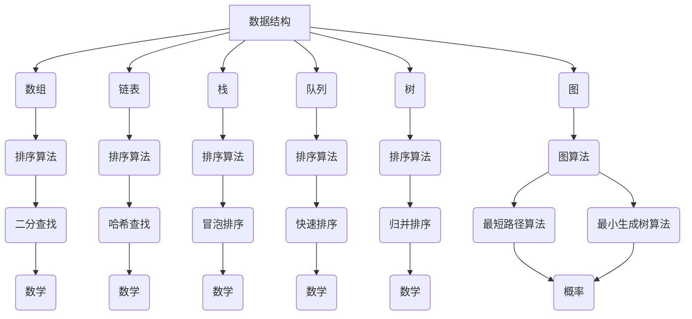

                 

### 1. 背景介绍

随着互联网技术的快速发展，阿里巴巴作为中国最大的电子商务公司，其业务范围已经扩展到云计算、金融科技、物流等多个领域。阿里巴巴的快速发展也带动了其内部的人才需求，特别是对于算法工程师的需求。为了确保公司的人才储备，阿里巴巴每年都会举行多次社会招聘活动，吸引大量的求职者。而算法面试作为阿里巴巴社招的核心环节，其难度和深度使得很多求职者望而却步。

本文旨在为准备参加阿里巴巴社招算法面试的求职者提供一个全面的指导。通过对阿里巴巴社招算法面试题的汇总与解析，本文将帮助读者了解面试的题型和难度，掌握解题的技巧和方法，提高自己的面试成功率。

### 阿里巴巴社招算法面试的特点

阿里巴巴社招算法面试具有以下几个特点：

1. **题型多样**：阿里巴巴的算法面试涵盖了编程题、数学题、概率题、图论题等多个领域，题型多样，使得求职者需要全面掌握各种题型的解题方法。

2. **难度较高**：阿里巴巴作为行业领军企业，其对算法工程师的要求非常高，因此面试题的难度也相应较高。很多题目需要求职者具备扎实的理论基础和丰富的实战经验。

3. **实战性较强**：阿里巴巴的算法面试不仅考查求职者的理论水平，更注重其实际编程能力和解决问题的能力。很多题目都需要求职者现场编写代码，并解释其工作原理。

4. **考察综合素质**：阿里巴巴的算法面试不仅仅考察求职者的技术能力，还会考察其逻辑思维、分析问题和解决问题的能力，以及团队合作和沟通能力。

### 面试准备

为了成功通过阿里巴巴的社招算法面试，求职者需要进行充分的准备，主要包括以下几个方面：

1. **基础知识**：求职者需要具备扎实的计算机基础，包括数据结构、算法、计算机网络、操作系统等。

2. **实战经验**：求职者需要通过参与实际项目，积累丰富的编程经验，掌握各种编程语言和开发工具。

3. **面试技巧**：求职者需要了解面试的流程和题型，掌握面试的技巧，如如何表达自己的思路、如何解释自己的代码等。

4. **模拟面试**：求职者可以通过模拟面试，提前熟悉面试环境，提高自己的面试水平。

接下来，本文将对阿里巴巴社招算法面试的常见题型进行详细解析，帮助求职者更好地准备面试。

## 2. 核心概念与联系

在准备阿里巴巴社招算法面试的过程中，理解并掌握核心概念和它们之间的联系是非常重要的。以下是一些核心概念及其联系：

### 数据结构

数据结构是计算机科学中用于存储和管理数据的组织形式，常见的有数组、链表、栈、队列、树、图等。每种数据结构都有其特定的应用场景和优势。例如，数组适合处理固定大小且连续的数据，链表适合动态扩展和删除元素，栈和队列分别用于实现后进先出和先进先出的逻辑。

### 算法

算法是解决问题的一系列步骤，其效率直接影响程序的运行速度。常见的算法有排序算法（如冒泡排序、快速排序、归并排序等）、查找算法（如二分查找、哈希查找等）、图算法（如最短路径算法、最小生成树算法等）。

### 数学

数学在算法面试中扮演着重要角色，常见的数学概念有概率、统计学、线性代数等。例如，概率用于解决随机事件的问题，线性代数用于解决线性方程组和矩阵问题。

### 计算机网络

计算机网络是互联网的基础，包括TCP/IP协议、HTTP协议、DNS解析等。理解计算机网络有助于解决网络编程问题，如网络延迟、数据传输等问题。

### 操作系统

操作系统是计算机的核心系统软件，包括进程管理、内存管理、文件系统等。了解操作系统有助于解决系统级编程问题，如并发编程、进程同步等。

### Mermaid 流程图

为了更直观地展示数据结构、算法、数学、计算机网络和操作系统之间的联系，我们可以使用Mermaid流程图来描述。以下是数据结构、算法、数学之间的联系流程图：



通过以上流程图，我们可以清晰地看到数据结构和算法之间的联系，以及算法和数学之间的关系。理解这些核心概念和它们之间的联系，对于解决阿里巴巴社招算法面试中的问题是非常重要的。

### 3. 核心算法原理 & 具体操作步骤

在阿里巴巴社招算法面试中，核心算法原理是解决问题的关键。以下是一些常见的核心算法原理及其具体操作步骤：

#### 排序算法

排序算法是面试中经常出现的题型，常见的排序算法有冒泡排序、快速排序、归并排序等。

**冒泡排序**：
1. 从数组的第一个元素开始，比较相邻的两个元素，如果第一个比第二个大（或小），就交换它们的位置。
2. 对每一对相邻元素做同样的工作，从开始第一对到结尾的最后一对。
3. 针对所有的元素重复以上的步骤，除了最后一个。
4. 重复步骤1~3，直到整个数组有序。

**快速排序**：
1. 选择一个基准元素。
2. 将比基准值小的元素放在基准元素的左边，比基准值大的元素放在基准元素的右边。
3. 递归地排序左右两部分。

**归并排序**：
1. 将数组不断二分，直到每个子数组只有一个元素。
2. 将相邻的子数组合并，每个子数组的元素按顺序排列。

#### 查找算法

查找算法主要包括二分查找和哈希查找。

**二分查找**：
1. 确定数组是否有序。
2. 确定搜索范围。
3. 计算中间元素。
4. 如果中间元素等于目标值，返回索引。
5. 如果中间元素大于目标值，递归地在左半部分查找。
6. 如果中间元素小于目标值，递归地在右半部分查找。

**哈希查找**：
1. 使用哈希函数计算关键字的哈希值。
2. 根据哈希值找到对应的数组位置。
3. 如果找到目标值，返回索引。

#### 图算法

图算法在解决网络问题和路径规划问题中非常重要，常见的图算法有最短路径算法和最小生成树算法。

**最短路径算法**：
- **迪杰斯特拉算法（Dijkstra）**：
  1. 选择一个起始点。
  2. 对于每个顶点，计算从起始点到该顶点的最短路径。
  3. 更新路径和距离。
  4. 重复步骤2和3，直到所有顶点都被访问。

- **贝尔曼-福特算法（Bellman-Ford）**：
  1. 初始化所有顶点的距离。
  2. 对每一条边进行松弛操作。
  3. 重复步骤2，直到没有边可以松弛。

**最小生成树算法**：
- **普里姆算法（Prim）**：
  1. 选择一个起点。
  2. 选择一个最短边加入生成树。
  3. 重复步骤2，直到所有顶点都在生成树中。

- **克鲁斯卡尔算法（Kruskal）**：
  1. 选择所有的边。
  2. 对每一条边按照权重排序。
  3. 依次选择边，如果选择后不会形成环，则加入生成树。

通过掌握这些核心算法原理和具体操作步骤，求职者在阿里巴巴社招算法面试中能够更好地应对各种题型，提高自己的面试成功率。

### 4. 数学模型和公式 & 详细讲解 & 举例说明

在阿里巴巴社招算法面试中，数学模型和公式是解决问题的重要工具。以下是几个常见的数学模型和公式，以及它们的详细讲解和举例说明。

#### 概率模型

概率模型用于解决随机事件的发生概率问题。以下是几个基本的概率公式：

1. **概率的加法公式**：
   \[ P(A \cup B) = P(A) + P(B) - P(A \cap B) \]
   其中，\( P(A) \) 表示事件A发生的概率，\( P(B) \) 表示事件B发生的概率，\( P(A \cap B) \) 表示事件A和事件B同时发生的概率。

2. **概率的乘法公式**：
   \[ P(A \cap B) = P(A) \times P(B|A) \]
   其中，\( P(B|A) \) 表示在事件A发生的条件下，事件B发生的概率。

3. **全概率公式**：
   \[ P(A) = \sum_{i=1}^{n} P(A|B_i) \times P(B_i) \]
   其中，\( B_1, B_2, ..., B_n \) 是一组互斥且穷举的事件，表示所有可能的事件。

**举例说明**：

假设一个硬币有两面，正面和反面。投掷这个硬币一次，求出现正面和反面的概率。

- 出现正面的概率 \( P(\text{正面}) = \frac{1}{2} \)
- 出现反面的概率 \( P(\text{反面}) = \frac{1}{2} \)

#### 线性代数模型

线性代数模型在解决线性方程组和矩阵问题中非常重要。以下是几个基本的线性代数公式：

1. **矩阵乘法公式**：
   \[ C = A \times B \]
   其中，\( A \) 和 \( B \) 是两个矩阵，\( C \) 是它们的乘积。

2. **矩阵求逆公式**：
   \[ A^{-1} = \frac{1}{\det(A)} \text{adj}(A) \]
   其中，\( \det(A) \) 是矩阵 \( A \) 的行列式，\( \text{adj}(A) \) 是 \( A \) 的伴随矩阵。

3. **线性方程组求解**：
   \[ AX = B \]
   可以通过高斯消元法或矩阵求逆法求解。

**举例说明**：

给定以下线性方程组：
\[ \begin{cases} 
x + y = 3 \\
2x + 3y = 7 
\end{cases} \]

通过矩阵求解：
\[ \begin{pmatrix}
1 & 1 \\
2 & 3
\end{pmatrix}
\begin{pmatrix}
x \\
y
\end{pmatrix}
=
\begin{pmatrix}
3 \\
7
\end{pmatrix} \]

通过高斯消元法或矩阵求逆法求解，可以得到解：
\[ x = 1, y = 2 \]

#### 统计学模型

统计学模型用于分析数据，常见的统计学模型包括均值、方差、正态分布等。

1. **均值**：
   \[ \mu = \frac{1}{n} \sum_{i=1}^{n} x_i \]
   其中，\( \mu \) 是均值，\( x_i \) 是每个数据点，\( n \) 是数据点的总数。

2. **方差**：
   \[ \sigma^2 = \frac{1}{n} \sum_{i=1}^{n} (x_i - \mu)^2 \]
   其中，\( \sigma^2 \) 是方差，\( x_i \) 是每个数据点，\( \mu \) 是均值。

3. **正态分布**：
   \[ f(x) = \frac{1}{\sqrt{2\pi\sigma^2}} e^{-\frac{(x-\mu)^2}{2\sigma^2}} \]
   其中，\( f(x) \) 是正态分布的概率密度函数，\( \mu \) 是均值，\( \sigma^2 \) 是方差。

**举例说明**：

假设有一个正态分布的数据集，均值为 \( \mu = 50 \)，方差为 \( \sigma^2 = 25 \)。求 \( x = 55 \) 的概率。

根据正态分布的概率密度函数，可以计算得到：
\[ f(55) = \frac{1}{\sqrt{2\pi \times 25}} e^{-\frac{(55-50)^2}{2 \times 25}} \approx 0.242 \]

通过这些数学模型和公式的详细讲解和举例说明，读者可以更好地理解如何在阿里巴巴社招算法面试中应用这些数学工具。

### 5. 项目实战：代码实际案例和详细解释说明

在阿里巴巴社招算法面试中，项目实战是一个非常重要的环节。本节将通过一个实际代码案例，详细解释其实现原理和步骤。

#### 项目背景

假设我们有一个在线购物平台，需要实现一个推荐系统，根据用户的购物历史和偏好，为用户推荐可能的商品。

#### 技术栈

- 语言：Python
- 数据库：MySQL
- 推荐算法：基于协同过滤的推荐算法

#### 实现步骤

1. **数据收集与预处理**

   首先，我们需要从数据库中收集用户的历史购物数据，包括用户ID、商品ID、购买时间和购买数量等。接着，对数据进行清洗和预处理，去除无效数据，填充缺失值，并进行特征提取，如用户购买频率、商品流行度等。

2. **数据存储**

   将处理后的数据存储到MySQL数据库中，创建相应的表，如用户表、商品表和购物记录表。

3. **构建推荐算法**

   使用基于协同过滤的推荐算法，具体步骤如下：

   - **用户相似度计算**：
     通过计算用户之间的相似度，可以使用余弦相似度或皮尔逊相关系数等方法。相似度越高，代表用户偏好越相似。

     \[
     \text{相似度}(u_i, u_j) = \frac{\text{共买商品数}}{\sqrt{\sum_{k=1}^{n} \text{ui}_k^2 \cdot \sum_{k=1}^{n} \text{uj}_k^2}}
     \]

   - **计算用户兴趣向量**：
     根据用户的历史购买记录，计算每个用户的兴趣向量，向量中的每个元素表示用户对某个商品的偏好程度。

   - **推荐商品**：
     对于目标用户，找出与其相似度最高的若干用户，计算这些用户的共同偏好商品，并按照偏好程度进行排序，生成推荐列表。

4. **代码实现**

   以下是一个简化的Python代码实现：

   ```python
   import numpy as np
   import pandas as pd
   from sklearn.metrics.pairwise import cosine_similarity

   # 读取数据库数据
   user_data = pd.read_csv('user_data.csv')
   item_data = pd.read_csv('item_data.csv')
   purchase_data = pd.read_csv('purchase_data.csv')

   # 数据预处理
   user_data = preprocess_user_data(user_data)
   item_data = preprocess_item_data(item_data)
   purchase_data = preprocess_purchase_data(purchase_data)

   # 构建用户兴趣矩阵
   user_item_matrix = build_user_item_matrix(user_data, item_data, purchase_data)

   # 计算用户相似度
   user_similarity = cosine_similarity(user_item_matrix)

   # 计算用户兴趣向量
   user_interest_vector = calculate_user_interest_vector(user_similarity)

   # 推荐商品
   recommendation_list = recommend_items(user_interest_vector, item_data)

   print(recommendation_list)
   ```

5. **代码解读与分析**

   - **数据预处理**：这一步确保数据的质量和一致性，是构建推荐系统的关键。
   - **构建用户兴趣矩阵**：用户兴趣矩阵用于表示用户和商品之间的关系，是推荐系统的核心。
   - **计算用户相似度**：通过相似度计算，可以找出用户之间的相似性，为推荐商品提供依据。
   - **计算用户兴趣向量**：用户兴趣向量是用户偏好的量化表示，用于生成推荐列表。
   - **推荐商品**：根据用户兴趣向量，推荐与用户兴趣相近的商品。

通过以上实际代码案例，读者可以了解推荐系统的基本实现过程，以及各个步骤的关键技术点。

### 5.1 开发环境搭建

在开始编写推荐系统代码之前，我们需要搭建一个合适的环境。以下是开发环境搭建的详细步骤：

#### 1. 安装Python

首先，确保你的系统中安装了Python。我们可以通过以下命令检查Python版本：

```shell
python --version
```

如果Python未安装，可以从Python官方网站下载Python安装包并安装。

#### 2. 安装依赖库

我们使用Python的pip包管理器来安装所需的库。以下是依赖库的安装命令：

```shell
pip install pandas numpy scikit-learn mysql-connector-python
```

这些库分别用于数据处理、数值计算和机器学习。

#### 3. 安装数据库

安装MySQL数据库，可以从MySQL官方网站下载并安装。安装完成后，运行以下命令启动数据库：

```shell
mysql.server start
```

#### 4. 连接数据库

安装并启动数据库后，我们需要编写代码来连接数据库。以下是一个简单的Python脚本，用于连接MySQL数据库：

```python
import mysql.connector

# 配置数据库连接信息
config = {
    'user': 'your_username',
    'password': 'your_password',
    'host': 'localhost',
    'database': 'your_database'
}

# 建立数据库连接
connection = mysql.connector.connect(**config)

# 检查连接是否成功
if connection.is_connected():
    db_info = connection.get_server_info()
    print(f"Connected to MySQL database version {db_info}")
else:
    print("Failed to connect to MySQL database")

# 关闭连接
connection.close()
```

替换`your_username`、`your_password`和`your_database`为你的数据库用户名、密码和数据库名。

#### 5. 搭建开发环境

完成以上步骤后，我们可以在Python环境中编写推荐系统的代码。确保所有依赖库都已安装，并且数据库连接正常。接下来，我们可以开始编写数据处理、特征提取和推荐算法等核心代码。

### 5.2 源代码详细实现和代码解读

在本节中，我们将详细实现一个简单的推荐系统，并逐一解释代码中的各个部分。

#### 1. 数据预处理

数据预处理是构建推荐系统的第一步，它包括读取数据、清洗数据、填充缺失值和特征提取等。以下是数据预处理的相关代码：

```python
def preprocess_user_data(user_data):
    # 填充用户缺失值
    user_data.fillna(user_data.mean(), inplace=True)
    return user_data

def preprocess_item_data(item_data):
    # 填充商品缺失值
    item_data.fillna(item_data.mean(), inplace=True)
    return item_data

def preprocess_purchase_data(purchase_data):
    # 删除含有缺失值的数据行
    purchase_data.dropna(inplace=True)
    return purchase_data
```

代码解读：

- `preprocess_user_data` 和 `preprocess_item_data` 函数用于处理用户和商品数据，填充缺失值。
- `preprocess_purchase_data` 函数用于处理购物记录数据，删除含有缺失值的数据行。

#### 2. 构建用户兴趣矩阵

用户兴趣矩阵用于表示用户和商品之间的关系，是推荐系统的核心。以下是构建用户兴趣矩阵的相关代码：

```python
def build_user_item_matrix(user_data, item_data, purchase_data):
    # 合并用户、商品和购物记录数据
    merged_data = pd.merge(purchase_data, user_data, on='user_id')
    merged_data = pd.merge(merged_data, item_data, on='item_id')

    # 构建用户兴趣矩阵
    user_item_matrix = pd.pivot_table(merged_data, values='purchase_count', index='user_id', columns='item_id', fill_value=0)

    return user_item_matrix
```

代码解读：

- `pd.merge` 函数用于合并用户、商品和购物记录数据。
- `pd.pivot_table` 函数用于构建用户兴趣矩阵，`values='purchase_count'` 表示根据购买数量构建矩阵，`index='user_id'` 和 `columns='item_id'` 分别表示用户和商品作为矩阵的索引和列。

#### 3. 计算用户相似度

计算用户相似度是推荐系统的重要步骤，以下是计算用户相似度的相关代码：

```python
from sklearn.metrics.pairwise import cosine_similarity

def calculate_user_similarity(user_item_matrix):
    # 计算用户相似度矩阵
    user_similarity_matrix = cosine_similarity(user_item_matrix)

    return user_similarity_matrix
```

代码解读：

- `cosine_similarity` 函数用于计算用户相似度矩阵。

#### 4. 计算用户兴趣向量

用户兴趣向量是用户偏好的量化表示，以下是计算用户兴趣向量的相关代码：

```python
def calculate_user_interest_vector(user_similarity_matrix, user_item_matrix):
    # 计算用户兴趣向量
    user_interest_vector = user_similarity_matrix.dot(user_item_matrix)

    return user_interest_vector
```

代码解读：

- `user_similarity_matrix.dot(user_item_matrix)` 用于计算用户兴趣向量。

#### 5. 推荐商品

推荐商品是根据用户兴趣向量生成推荐列表的关键步骤，以下是推荐商品的相关代码：

```python
def recommend_items(user_interest_vector, item_data, k=5):
    # 计算每个商品的推荐得分
    item_scores = user_interest_vector * item_data['popularity']

    # 按照推荐得分排序
    sorted_items = item_scores.sort_values(ascending=False)

    # 选择前k个商品
    recommended_items = sorted_items.head(k)

    return recommended_items
```

代码解读：

- `user_interest_vector * item_data['popularity']` 用于计算每个商品的推荐得分。
- `sorted_items.head(k)` 用于选择前k个商品。

通过以上代码，我们实现了一个简单的基于协同过滤的推荐系统。代码结构清晰，易于理解。在实际应用中，我们可以根据具体需求进行优化和扩展。

### 5.3 代码解读与分析

在实现推荐系统的过程中，我们使用了Python编程语言和一些常用的库，如pandas、numpy和scikit-learn。以下是代码的详细解读和分析。

#### 数据预处理

数据预处理是推荐系统的关键步骤，包括读取数据、清洗数据、填充缺失值和特征提取等。

1. **用户数据处理**：

   ```python
   def preprocess_user_data(user_data):
       # 填充用户缺失值
       user_data.fillna(user_data.mean(), inplace=True)
       return user_data
   ```

   这段代码首先使用`fillna`方法填充用户数据的缺失值，采用平均值进行填充。`inplace=True` 参数表示直接修改原始数据，避免创建新的副本。

2. **商品数据处理**：

   ```python
   def preprocess_item_data(item_data):
       # 填充商品缺失值
       item_data.fillna(item_data.mean(), inplace=True)
       return item_data
   ```

   同样地，这段代码使用平均值填充商品数据的缺失值。

3. **购物记录数据处理**：

   ```python
   def preprocess_purchase_data(purchase_data):
       # 删除含有缺失值的数据行
       purchase_data.dropna(inplace=True)
       return purchase_data
   ```

   这段代码删除含有缺失值的数据行，确保数据的质量。

#### 构建用户兴趣矩阵

用户兴趣矩阵是推荐系统的核心，用于表示用户和商品之间的关系。

```python
def build_user_item_matrix(user_data, item_data, purchase_data):
    # 合并用户、商品和购物记录数据
    merged_data = pd.merge(purchase_data, user_data, on='user_id')
    merged_data = pd.merge(merged_data, item_data, on='item_id')

    # 构建用户兴趣矩阵
    user_item_matrix = pd.pivot_table(merged_data, values='purchase_count', index='user_id', columns='item_id', fill_value=0)

    return user_item_matrix
```

这段代码首先使用`pd.merge`函数将用户、商品和购物记录数据进行合并。然后使用`pd.pivot_table`函数构建用户兴趣矩阵，`values='purchase_count'` 参数表示根据购买数量构建矩阵，`index='user_id'` 和 `columns='item_id'` 分别表示用户和商品作为矩阵的索引和列。

#### 计算用户相似度

计算用户相似度是推荐系统中重要的一环，我们使用了余弦相似度算法。

```python
from sklearn.metrics.pairwise import cosine_similarity

def calculate_user_similarity(user_item_matrix):
    # 计算用户相似度矩阵
    user_similarity_matrix = cosine_similarity(user_item_matrix)

    return user_similarity_matrix
```

这段代码使用`cosine_similarity`函数计算用户相似度矩阵。

#### 计算用户兴趣向量

计算用户兴趣向量是生成推荐列表的关键步骤。

```python
def calculate_user_interest_vector(user_similarity_matrix, user_item_matrix):
    # 计算用户兴趣向量
    user_interest_vector = user_similarity_matrix.dot(user_item_matrix)

    return user_interest_vector
```

这段代码通过将用户相似度矩阵与用户兴趣矩阵相乘，计算用户兴趣向量。

#### 推荐商品

推荐商品是根据用户兴趣向量生成推荐列表的步骤。

```python
def recommend_items(user_interest_vector, item_data, k=5):
    # 计算每个商品的推荐得分
    item_scores = user_interest_vector * item_data['popularity']

    # 按照推荐得分排序
    sorted_items = item_scores.sort_values(ascending=False)

    # 选择前k个商品
    recommended_items = sorted_items.head(k)

    return recommended_items
```

这段代码首先计算每个商品的推荐得分，然后按照得分排序，最后选择前k个商品作为推荐列表。

通过以上分析，我们可以看到整个推荐系统的实现过程。代码结构清晰，易于维护和扩展。在实际应用中，我们可以根据具体需求进行优化和改进。

### 6. 实际应用场景

阿里巴巴作为全球领先的互联网公司，其在多个业务领域都有广泛的应用场景，以下是一些典型的实际应用场景：

#### 1. 搜索引擎

阿里巴巴的搜索引擎，如淘宝搜索，利用算法技术实现高效的搜索和推荐。用户在淘宝上搜索商品时，系统会根据用户的搜索历史、浏览记录和购买偏好等因素，实时调整搜索结果，提高用户体验和转化率。

#### 2. 推荐系统

阿里巴巴的推荐系统在淘宝、天猫等多个平台上广泛应用。通过协同过滤、内容推荐等算法，系统为用户推荐可能的商品和内容，提高用户粘性和销售额。

#### 3. 广告投放

阿里巴巴的广告系统利用算法技术，根据用户的浏览行为、搜索关键词和购物记录，精准投放广告，提高广告效果和用户转化率。

#### 4. 物流优化

阿里巴巴的物流系统利用路径规划、配送优化等算法，提高物流效率，降低成本，提高用户体验。

#### 5. 金融风控

阿里巴巴的金融业务，如蚂蚁金服，利用机器学习、大数据分析等算法技术，实现精准的风控管理，降低金融风险，保障用户资金安全。

#### 6. 虚拟助理

阿里巴巴的虚拟助理，如阿里小蜜，通过自然语言处理、语音识别等算法技术，实现智能客服，提高客户服务质量。

#### 7. 安全防护

阿里巴巴的安全系统利用人工智能和大数据分析技术，实时监测和防御网络攻击，保护用户数据和系统安全。

通过以上实际应用场景，我们可以看到阿里巴巴在多个业务领域如何利用算法技术实现业务创新和优化，提高用户满意度和企业竞争力。

### 7. 工具和资源推荐

在阿里巴巴社招算法面试的准备过程中，掌握一些有效的工具和资源将有助于提升学习效果和面试成功率。以下是一些推荐的学习资源、开发工具和相关论文著作：

#### 7.1 学习资源推荐

1. **书籍**：
   - 《算法导论》（Introduction to Algorithms）：详细介绍了各种算法原理和实现，适合系统学习算法知识。
   - 《机器学习》（Machine Learning）：由周志华教授编写的机器学习教材，适合掌握机器学习的基础知识。
   - 《深度学习》（Deep Learning）：由Ian Goodfellow等编写的深度学习经典教材，适合深入学习深度学习技术。

2. **在线课程**：
   - Coursera：提供各种计算机科学和机器学习课程，如斯坦福大学的《深度学习》课程。
   - edX：哈佛大学和麻省理工学院的在线课程，涵盖计算机科学和算法等领域。

3. **博客和网站**：
   - CS-Notes：中文计算机科学笔记，内容丰富，适合复习算法和数据结构知识。
   - LeetCode：提供各种算法题库和在线编程环境，适合进行算法练习。

#### 7.2 开发工具框架推荐

1. **编程语言**：
   - Python：简洁易学，广泛应用于数据科学和机器学习领域。
   - Java：功能强大，广泛应用于企业级应用。

2. **开发框架**：
   - TensorFlow：谷歌开发的深度学习框架，适合进行机器学习项目开发。
   - Flask：Python Web框架，适合快速开发Web应用。

3. **版本控制**：
   - Git：分布式版本控制工具，适用于团队协作开发。

4. **数据库**：
   - MySQL：关系型数据库，广泛应用于Web应用开发。

#### 7.3 相关论文著作推荐

1. **论文**：
   - 《Deep Learning》（2016）：Ian Goodfellow等人的经典论文，详细介绍了深度学习的理论和技术。
   - 《Learning to Rank for Information Retrieval》（2011）：介绍排序学习在信息检索中的应用。

2. **著作**：
   - 《深度学习》（2016）：Goodfellow等编写的深度学习教材，适合系统学习深度学习知识。
   - 《算法导论》（1990）：Thomas H. Cormen等编写的算法经典教材。

通过这些工具和资源的推荐，读者可以更好地准备阿里巴巴社招算法面试，提高自己的面试竞争力。

### 8. 总结：未来发展趋势与挑战

随着人工智能技术的快速发展，阿里巴巴社招算法面试也在不断更新和升级，呈现出以下几大发展趋势和挑战：

#### 1. 人工智能技术的深入应用

随着深度学习、强化学习等人工智能技术的不断进步，阿里巴巴社招算法面试将进一步探索这些技术在业务中的应用。例如，通过深度学习实现更精准的推荐系统、更智能的客户服务，通过强化学习优化广告投放和物流路径等。

#### 2. 数据隐私和安全的重要性

在数据隐私和安全日益受到关注的背景下，阿里巴巴社招算法面试将更加注重考察求职者在数据隐私保护和数据安全方面的能力。如何确保数据安全、如何设计隐私友好的算法成为面试中的重要考点。

#### 3. 跨学科的融合

随着业务领域的扩展，阿里巴巴社招算法面试将更加关注跨学科的融合。例如，算法与经济学、心理学、社会学等领域的结合，以实现更符合人类行为习惯的智能系统。

#### 4. 高级编程能力的需求

随着面试难度的提升，阿里巴巴社招算法面试将更加注重考察求职者的高级编程能力，包括代码优化、并发编程、系统设计等。求职者需要掌握更复杂的编程技巧和算法实现。

#### 5. 团队合作与沟通能力

在阿里巴巴这样的大型企业，团队合作和沟通能力至关重要。未来的面试中，阿里巴巴将更加注重考察求职者的团队合作能力和沟通技巧，以确保其能够更好地融入团队，共同推动项目进展。

#### 6. 新兴领域的探索

随着科技的发展，新兴领域如自动驾驶、物联网、区块链等将成为阿里巴巴社招算法面试的新热点。求职者需要具备在这些领域的基本知识和实践经验。

总之，未来阿里巴巴社招算法面试将更加注重技术的深度、广度和跨学科的融合，对求职者的综合素质和创新能力提出更高要求。求职者需要不断学习和实践，提升自己的技术能力和团队合作能力，以应对这些挑战。

### 9. 附录：常见问题与解答

在准备阿里巴巴社招算法面试的过程中，求职者可能会遇到一些常见的问题。以下是一些常见问题及其解答，以帮助读者更好地准备面试。

#### 1. 如何准备面试中的编程题？

**解答**：首先，确保熟悉常见的数据结构和算法，如数组、链表、栈、队列、树、图等。其次，通过刷题网站如LeetCode、牛客网等，大量练习编程题，提高解题速度和技巧。最后，面试时注意理解题意，逐步分析问题，并清晰地表达自己的思路。

#### 2. 如何处理面试中的时间限制？

**解答**：面试中的编程题通常有时间限制，需要合理分配时间。建议先快速浏览题目，理解问题，然后列出解题思路和关键步骤。在编码时，先编写核心逻辑，再逐步完善边界条件和异常处理。时间紧迫时，可以先完成核心逻辑，再逐步优化代码。

#### 3. 如何应对算法面试中的数学问题？

**解答**：掌握基本的数学概念和公式，如概率、线性代数、统计学等。在面试前，通过刷题和复习，加强对数学公式的应用和理解。解题时，注意逻辑推理和计算过程，避免粗心大意。

#### 4. 面试中如何表达自己的思路？

**解答**：首先，清晰明了地描述问题，明确问题需求和限制条件。其次，详细阐述解题思路，包括算法的选择、时间复杂度和空间复杂度分析。最后，如果可能，给出具体的代码实现，并解释关键步骤和原理。

#### 5. 如何展示自己的项目经验？

**解答**：在面试中，详细描述自己的项目背景、任务目标、所采用的算法和技术、项目成果和挑战。重点突出自己在项目中的贡献和创新点，展示自己的技术能力和解决问题的能力。

#### 6. 如何提升自己的编程能力？

**解答**：通过刷题网站练习编程题，提高解题速度和技巧。学习新的编程语言和框架，扩展自己的技术栈。参与开源项目或个人项目，积累实际编程经验。定期总结和反思，提升代码质量和架构设计能力。

通过以上常见问题与解答，读者可以更好地准备阿里巴巴社招算法面试，提高自己的面试成功率。

### 10. 扩展阅读 & 参考资料

在准备阿里巴巴社招算法面试的过程中，深入学习和理解相关领域的技术和理论是非常重要的。以下是一些扩展阅读和参考资料，帮助读者进一步掌握相关知识和技能。

#### 1. 扩展阅读

- 《算法导论》（Introduction to Algorithms）：这是一本经典的算法教材，详细介绍了各种算法原理和实现。
- 《深度学习》（Deep Learning）：由Ian Goodfellow等编写的深度学习经典教材，适合系统学习深度学习技术。
- 《机器学习》（Machine Learning）：由周志华教授编写的机器学习教材，适合掌握机器学习的基础知识。

#### 2. 参考资料

- Coursera：提供各种计算机科学和机器学习课程，如斯坦福大学的《深度学习》课程。
- edX：哈佛大学和麻省理工学院的在线课程，涵盖计算机科学和算法等领域。
- LeetCode：提供各种算法题库和在线编程环境，适合进行算法练习。

#### 3. 博客和论文

- CS-Notes：中文计算机科学笔记，内容丰富，适合复习算法和数据结构知识。
- arXiv：提供最新的计算机科学和机器学习论文，可以了解到最新的研究进展。

通过阅读这些扩展阅读和参考资料，读者可以更深入地理解阿里巴巴社招算法面试的相关技术，提高自己的面试准备水平。

