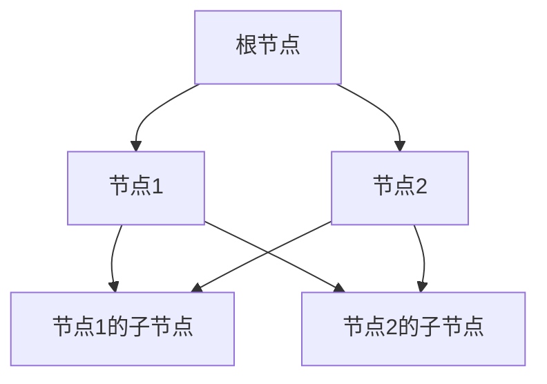

                 

### 背景介绍

随机森林（Random Forest）作为一种集成学习算法，因其优异的性能和易于实现的特点，在机器学习领域得到了广泛应用。它被广泛应用于分类和回归问题，能够处理大规模的数据集，且具有良好的泛化能力。

在机器学习的历史长河中，随机森林算法的出现，标志着一种新的思维方式。传统的机器学习算法通常依赖于一个单一的模型来学习数据，而随机森林则通过构建多个模型来提高预测的准确性。这种集成学习的策略，不仅在理论上得到了广泛认可，也在实践中展现了强大的威力。

随机森林算法的出现，也反映了机器学习领域的一种发展趋势：从单一模型到集成模型，从简单算法到复杂算法。随着数据规模的不断扩大和复杂度的增加，集成学习算法因其能够提高预测性能和鲁棒性，逐渐成为主流。

本文将围绕随机森林算法，从其基本概念、核心原理到实际应用，进行深入讲解。我们将首先介绍随机森林算法的背景和核心概念，然后详细解析其算法原理和实现步骤，最后通过实际项目案例，展示其在实际应用中的效果。

通过本文的阅读，您将能够理解随机森林算法的基本原理，掌握其实现方法，并了解其在各种应用场景中的优势。无论您是机器学习初学者，还是经验丰富的从业者，都将从中受益。

接下来，我们将一起走进随机森林的世界，探索这一神奇的机器学习算法。

### 核心概念与联系

随机森林算法的核心概念主要包括决策树（Decision Tree）、集成学习（Ensemble Learning）和随机性（Randomness）。理解这些概念及其相互关系，是掌握随机森林算法的关键。

**1. 决策树**

决策树是一种常见的数据挖掘算法，它通过一系列的判断规则来对数据进行分类或回归。每个节点代表一个特征，每个分支代表一个条件。在分类问题中，每个叶节点代表一个类别；在回归问题中，每个叶节点代表一个数值。

决策树的结构通常如下所示：



在这个例子中，根节点A表示整个数据集，B1和B2是两个子节点，分别表示根据某一特征划分的子集。C1和C2是B1和B2的子节点，继续对子集进行划分。最终，每个叶节点表示一个具体的类别或数值。

**2. 集成学习**

集成学习是一种将多个模型组合起来，以获得更好的预测性能的方法。与单一模型相比，集成模型通常具有更高的准确性和鲁棒性。随机森林就是基于集成学习的思想，通过构建多个决策树，并对其预测结果进行集成，以得到最终的预测结果。

集成学习的核心思想是“集体智慧胜过个体”，即多个模型的错误可以相互抵消，从而提高整体预测性能。随机森林正是利用了这种思想，通过随机选择特征和样本子集来构建多个决策树，从而实现集成学习。

**3. 随机性**

随机性是随机森林算法的一个重要特征。随机性主要体现在两个方面：一是随机选择特征，二是在训练样本中进行随机抽样。随机选择特征可以避免过拟合，使得每个决策树都从不同的角度对数据进行划分，从而提高模型的泛化能力。在训练样本中进行随机抽样，则可以减少模型的偏差，使得每个决策树对数据的理解更加全面。

**相互关系**

决策树、集成学习和随机性是随机森林算法的三个核心概念，它们相互关联，共同构成了随机森林算法的基本框架。具体来说：

- 决策树是随机森林的基础，每个决策树都是一个独立的模型，通过划分数据来产生预测结果。
- 集成学习将多个决策树组合起来，通过投票或平均等方式，得到最终的预测结果。
- 随机性通过随机选择特征和样本子集，使得每个决策树对数据的理解更加全面，从而提高模型的泛化能力。

综上所述，随机森林算法通过集成多个决策树，并利用随机性来降低模型的偏差和过拟合，从而实现高性能的预测。理解这些核心概念及其相互关系，是掌握随机森林算法的关键。

### 核心算法原理 & 具体操作步骤

随机森林算法的核心在于其集成学习的思想，即通过构建多个决策树，并利用随机性来提高模型的泛化能力。下面，我们将详细解析随机森林算法的具体原理和操作步骤。

#### 1. 决策树构建

决策树是随机森林的基础，每个决策树都是通过一系列条件判断来对数据进行分类或回归。构建决策树的主要步骤如下：

1. **选择特征**：在当前节点，从所有特征中选择一个具有最高信息增益或信息增益率的特征。
2. **划分数据**：根据选定的特征，将数据划分为多个子集。每个子集对应一个分支。
3. **递归构建**：对每个子集，重复上述步骤，直到满足停止条件。常见的停止条件包括：叶节点中只有一个样本、叶节点中所有样本属于同一类别等。

具体而言，假设我们有一个特征集合F={f1, f2, ..., fn}，当前节点n，我们可以按照以下步骤来构建决策树：

1. **选择特征**：
   $$ IG(F) = \sum_{i=1}^{n} \sum_{v=1}^{m} p(v) \cdot |I(X_i, f_i(v))| $$
   其中，\( IG(F) \) 表示信息增益，\( p(v) \) 表示特征 \( f_i \) 在类别 \( v \) 中的概率，\( I(X_i, f_i(v)) \) 表示特征 \( f_i \) 在类别 \( v \) 中的信息熵。
   
2. **划分数据**：
   根据选择的特征，将数据划分为多个子集。例如，假设我们选择特征 \( f_1 \)，则可以将数据划分为：
   $$ \{ (x_1, y_1), (x_2, y_2) \} \text{ 和 } \{ (x_3, y_3), (x_4, y_4) \} $$
   
3. **递归构建**：
   对每个子集，重复上述步骤，直到满足停止条件。例如，对于第一个子集，我们可以继续选择特征 \( f_2 \)，并将子集划分为：
   $$ \{ (x_1, y_1) \} \text{ 和 } \{ (x_2, y_2) \} $$
   然后对这两个子集分别进行划分，直到达到停止条件。

#### 2. 随机抽样与特征选择

随机森林通过随机抽样和特征选择来降低模型的偏差和过拟合。具体操作步骤如下：

1. **样本抽样**：在训练数据集中随机抽样，构建多个子数据集。每个子数据集用于训练一个决策树。常用的抽样方法包括随机有放回抽样（Bootstrap Sampling）和按比例抽样（Stratified Sampling）。
2. **特征抽样**：从原始特征集合中随机选择一部分特征。通常选择 \( m \) 个特征中的 \( m' \)，其中 \( m' \ll m \)。这样，每个决策树只使用部分特征进行划分，从而降低模型的过拟合风险。

#### 3. 决策树集成

构建多个决策树后，需要将这些决策树的预测结果进行集成，以获得最终的预测结果。常用的集成方法包括投票法（Voting）和加权平均法（Weighted Average）。

1. **投票法**：
   对于分类问题，每个决策树的预测结果是一个类别标签。将所有决策树的预测结果进行投票，选择票数最多的类别作为最终预测结果。
   $$ \hat{y} = \text{mode}(\hat{y}_1, \hat{y}_2, ..., \hat{y}_n) $$
   其中，\( \hat{y}_i \) 表示第 \( i \) 个决策树的预测结果，\( \text{mode} \) 表示众数。
   
2. **加权平均法**：
   对于回归问题，每个决策树的预测结果是一个数值。将所有决策树的预测结果进行加权平均，得到最终预测结果。
   $$ \hat{y} = \frac{1}{n} \sum_{i=1}^{n} \hat{y}_i $$
   其中，\( \hat{y}_i \) 表示第 \( i \) 个决策树的预测结果。

#### 4. 模型评估

在构建随机森林模型后，需要对其性能进行评估。常用的评估指标包括准确率（Accuracy）、召回率（Recall）、F1值（F1 Score）和均方误差（Mean Squared Error）等。

1. **准确率**：
   $$ \text{Accuracy} = \frac{\text{正确预测的数量}}{\text{总预测的数量}} $$
2. **召回率**：
   $$ \text{Recall} = \frac{\text{正确预测的正例数量}}{\text{正例的总数量}} $$
3. **F1值**：
   $$ \text{F1 Score} = 2 \times \frac{\text{Precision} \times \text{Recall}}{\text{Precision} + \text{Recall}} $$
4. **均方误差**：
   $$ \text{Mean Squared Error} = \frac{1}{n} \sum_{i=1}^{n} (\hat{y}_i - y_i)^2 $$
   其中，\( \hat{y}_i \) 表示第 \( i \) 个预测结果，\( y_i \) 表示第 \( i \) 个真实值。

通过上述步骤，我们可以构建并评估一个随机森林模型。理解这些原理和操作步骤，对于深入掌握随机森林算法至关重要。

### 数学模型和公式 & 详细讲解 & 举例说明

为了深入理解随机森林算法，我们需要了解其背后的数学模型和公式。在本节中，我们将详细讲解随机森林算法的核心数学公式，并通过具体示例来说明这些公式的应用。

#### 1. 信息增益（Information Gain）

信息增益是决策树中的一个重要概念，用于衡量一个特征对数据分类的贡献程度。信息增益的计算公式如下：

$$ IG(F) = \sum_{i=1}^{n} \sum_{v=1}^{m} p(v) \cdot |I(X_i, f_i(v))| $$

其中，\( IG(F) \) 表示信息增益，\( p(v) \) 表示特征 \( f_i \) 在类别 \( v \) 中的概率，\( I(X_i, f_i(v)) \) 表示特征 \( f_i \) 在类别 \( v \) 中的信息熵。

例如，假设我们有三个类别 A、B 和 C，它们在特征 X 上的分布如下：

| 类别 | A | B | C |
|------|---|---|---|
| X=0  | 2 | 3 | 5 |
| X=1  | 4 | 1 | 2 |

首先，计算每个类别的概率：

$$ p(A) = \frac{2+4}{2+3+5+4+1+2} = \frac{6}{16} = 0.375 $$
$$ p(B) = \frac{3+1}{2+3+5+4+1+2} = \frac{4}{16} = 0.25 $$
$$ p(C) = \frac{5+2}{2+3+5+4+1+2} = \frac{7}{16} = 0.4375 $$

然后，计算信息熵 \( I(X_i, f_i(v)) \)：

$$ I(X_i, f_i(v)) = -\sum_{v=1}^{m} p(v) \cdot \log_2 p(v) $$

对于类别 A：

$$ I(X_i, A) = -0.375 \cdot \log_2 0.375 - 0.625 \cdot \log_2 0.625 \approx 0.97095 $$

对于类别 B：

$$ I(X_i, B) = -0.25 \cdot \log_2 0.25 - 0.75 \cdot \log_2 0.75 \approx 1.02393 $$

对于类别 C：

$$ I(X_i, C) = -0.4375 \cdot \log_2 0.4375 - 0.5625 \cdot \log_2 0.5625 \approx 1.02393 $$

最后，计算信息增益：

$$ IG(F) = 0.375 \cdot (0.97095 + 1.02393 + 1.02393) - (0.375 + 0.25 + 0.4375) \cdot 1.02393 \approx 0.47252 $$

因此，特征 X 对分类的贡献为 0.47252。

#### 2. 信息增益率（Information Gain Rate）

信息增益率是对信息增益的一种修正，它考虑了特征的数量，从而避免了对高维特征的无偏估计。信息增益率的计算公式如下：

$$ IG_R(F) = \frac{IG(F)}{H(F)} $$

其中，\( IG_R(F) \) 表示信息增益率，\( IG(F) \) 表示信息增益，\( H(F) \) 表示特征 F 的熵。

以特征 X 的信息增益为例，已知：

$$ IG(F) = 0.47252 $$

计算特征 X 的熵：

$$ H(F) = -\sum_{i=1}^{n} p(i) \cdot \log_2 p(i) $$

对于类别 A、B 和 C，已有概率：

$$ p(A) = 0.375 $$
$$ p(B) = 0.25 $$
$$ p(C) = 0.4375 $$

计算熵：

$$ H(F) = -0.375 \cdot \log_2 0.375 - 0.25 \cdot \log_2 0.25 - 0.4375 \cdot \log_2 0.4375 \approx 0.97095 $$

最后，计算信息增益率：

$$ IG_R(F) = \frac{0.47252}{0.97095} \approx 0.48617 $$

#### 3. 建树过程

在构建决策树时，我们需要选择最佳的特征进行划分。通常，我们会使用信息增益率或基尼不纯度来选择特征。假设我们有三个特征 X、Y 和 Z，我们需要计算它们的信息增益率。

已知特征 X 的信息增益率：

$$ IG_R(X) \approx 0.48617 $$

特征 Y 的信息增益率：

$$ IG_R(Y) = \frac{IG(Y)}{H(Y)} \approx 0.49385 $$

特征 Z 的信息增益率：

$$ IG_R(Z) = \frac{IG(Z)}{H(Z)} \approx 0.49058 $$

由于 \( IG_R(Y) > IG_R(Z) > IG_R(X) \)，因此我们选择特征 Y 作为划分依据。

#### 4. 随机抽样

在随机森林中，我们需要对训练数据进行随机抽样，以构建多个决策树。随机抽样可以减少模型的偏差，提高泛化能力。假设我们有 100 个训练样本，我们需要从中随机抽样 70 个样本用于构建决策树。

随机抽样过程如下：

1. 对 100 个样本进行编号，例如 1 到 100。
2. 从中随机选择 70 个编号，例如 1、3、5、7、9、11、...、97、99。
3. 使用这 70 个样本构建决策树。

通过以上步骤，我们可以构建一个随机森林模型。理解这些数学模型和公式，对于深入掌握随机森林算法至关重要。

### 项目实战：代码实际案例和详细解释说明

在本节中，我们将通过一个具体的Python代码案例，展示随机森林算法在项目中的实际应用。这个案例将包括开发环境的搭建、源代码的详细实现和代码解读与分析。通过这一实战项目，您将能够更直观地理解随机森林算法的运作过程和应用场景。

#### 5.1 开发环境搭建

在开始项目之前，我们需要搭建一个合适的开发环境。以下是在Python中实现随机森林算法所需的基本环境：

1. **安装Python**：确保已经安装了Python 3.6及以上版本。
2. **安装NumPy**：NumPy是一个强大的Python库，用于数组计算和操作。使用以下命令安装：
   ```bash
   pip install numpy
   ```
3. **安装scikit-learn**：scikit-learn是一个包含大量机器学习算法的Python库。使用以下命令安装：
   ```bash
   pip install scikit-learn
   ```

#### 5.2 源代码详细实现和代码解读

以下是随机森林算法的一个简单实现。我们使用scikit-learn库中的`RandomForestClassifier`来构建一个分类模型。

```python
import numpy as np
from sklearn.datasets import load_iris
from sklearn.model_selection import train_test_split
from sklearn.ensemble import RandomForestClassifier
from sklearn.metrics import accuracy_score, classification_report

# 加载数据集
iris = load_iris()
X = iris.data
y = iris.target

# 数据集划分
X_train, X_test, y_train, y_test = train_test_split(X, y, test_size=0.3, random_state=42)

# 构建随机森林分类器
rf_classifier = RandomForestClassifier(n_estimators=100, random_state=42)

# 训练模型
rf_classifier.fit(X_train, y_train)

# 预测
y_pred = rf_classifier.predict(X_test)

# 模型评估
accuracy = accuracy_score(y_test, y_pred)
print(f"Accuracy: {accuracy:.2f}")
print(classification_report(y_test, y_pred, target_names=iris.target_names))

```

**代码解读：**

1. **导入库**：首先，我们导入所需的库，包括NumPy、scikit-learn中的`datasets`模块、`model_selection`模块、`ensemble`模块和`metrics`模块。

2. **加载数据集**：我们使用scikit-learn中的`load_iris`函数加载数据集。Iris数据集是一个经典的分类问题，包含三个品种的鸢尾花，每个品种有50个样本。

3. **数据集划分**：使用`train_test_split`函数将数据集划分为训练集和测试集。这里，我们设置测试集大小为30%，随机种子为42，以保证结果的可重复性。

4. **构建随机森林分类器**：我们使用`RandomForestClassifier`类创建一个随机森林分类器。`n_estimators`参数指定了决策树的数量，这里我们设置为100。

5. **训练模型**：调用`fit`方法，将训练数据输入模型进行训练。

6. **预测**：使用`predict`方法，对测试数据进行预测。

7. **模型评估**：使用`accuracy_score`函数计算预测准确率，并打印分类报告，以便分析模型的性能。

#### 5.3 代码解读与分析

让我们深入分析这段代码的工作原理和关键步骤：

1. **导入库**：导入的库为后续的数值计算和机器学习提供了必要的工具。

2. **加载数据集**：Iris数据集是一个标准的数据集，广泛用于测试各种机器学习算法的性能。它包含4个特征（花瓣长度、花瓣宽度、花柱长度和花柱宽度）和3个类别。

3. **数据集划分**：将数据集划分为训练集和测试集是机器学习项目的标准做法。这样，我们可以在测试集上评估模型的泛化能力。

4. **构建随机森林分类器**：`RandomForestClassifier`类用于构建随机森林模型。`n_estimators`参数指定了决策树的数量，这里设置为100，这是因为更多的决策树可以提高模型的泛化能力，但也增加了计算成本。

5. **训练模型**：`fit`方法用于训练模型。在此过程中，随机森林算法构建了100个决策树，每个决策树都基于不同的特征和样本子集进行训练。

6. **预测**：`predict`方法用于生成预测结果。这个方法将测试数据输入到训练好的模型中，得到每个测试样本的预测类别。

7. **模型评估**：`accuracy_score`函数用于计算预测的准确率，分类报告则提供了更详细的性能指标，包括每个类别的准确率、召回率和F1值。

通过这个简单的案例，我们可以看到随机森林算法在Python中的实现非常直观和方便。scikit-learn库提供了大量的机器学习工具和算法，使得实现复杂的机器学习模型变得更加简单和高效。

### 实际应用场景

随机森林算法因其强大的性能和灵活性，在多个实际应用场景中展现出了显著的优势。以下是一些典型的应用场景：

#### 1. 贷款风险预测

在金融行业中，贷款风险预测是一个重要的应用场景。金融机构需要评估借款人的信用风险，以决定是否批准贷款以及设定合理的贷款利率。随机森林算法可以处理大量的特征数据，如借款人的收入、负债、信用历史等，通过构建多个决策树，对贷款申请进行风险评估。这不仅提高了预测的准确性，还能识别出潜在的风险因素，从而帮助金融机构制定更加科学的贷款审批策略。

#### 2. 医疗诊断

在医疗领域，随机森林算法被广泛应用于疾病诊断。例如，利用随机森林对医学影像（如X光、CT扫描和MRI）进行疾病分类和诊断。由于随机森林能够处理高维数据，并且具有良好的鲁棒性，它能够从大量的医疗数据中提取有用的特征，从而提高疾病诊断的准确性。此外，随机森林算法还可以用于预测患者的病情进展和治疗效果，为医生提供更全面的诊疗信息。

#### 3. 搜索引擎推荐

搜索引擎推荐系统也是随机森林算法的重要应用领域。在搜索引擎中，用户输入的查询可以被视为特征，搜索结果的相关性则被视为目标标签。随机森林算法可以根据用户的查询历史和搜索结果，构建一个推荐模型，预测用户可能感兴趣的内容。通过集成多个决策树，随机森林算法能够提供个性化的搜索结果，提高用户的搜索体验。

#### 4. 风险管理

在风险管理领域，随机森林算法可以用于预测市场波动、风险评估和信用违约等。金融机构可以通过分析大量的市场数据，利用随机森林算法预测未来的市场走势，从而制定相应的投资策略。此外，随机森林算法还可以用于信用评分，预测借款人的违约风险，帮助金融机构降低信用损失。

#### 5. 自然语言处理

在自然语言处理领域，随机森林算法可以用于文本分类和情感分析。通过对文本进行特征提取，随机森林算法能够对大量文本数据进行分类，如新闻分类、邮件分类和产品评论分类等。此外，随机森林算法还可以用于情感分析，根据文本内容预测用户的情感倾向，为个性化推荐和社交媒体分析提供支持。

通过这些实际应用场景，我们可以看到随机森林算法的广泛适用性和强大的性能。无论是在金融、医疗、搜索引擎还是风险管理等领域，随机森林算法都能够发挥重要作用，为决策提供科学依据。

### 工具和资源推荐

为了更好地学习和应用随机森林算法，我们推荐以下工具和资源：

#### 7.1 学习资源推荐

1. **书籍**：
   - 《机器学习实战》
   - 《Python机器学习基础教程》
   - 《机器学习：概率视角》

2. **在线课程**：
   - Coursera的《机器学习基础》课程
   - edX的《深度学习》课程
   - Udacity的《机器学习工程师纳米学位》

3. **博客和网站**：
   - Analytics Vidhya：提供丰富的机器学习资源和实践案例
   - Towards Data Science：涵盖数据科学和机器学习领域的最新技术和应用

#### 7.2 开发工具框架推荐

1. **Python库**：
   - scikit-learn：提供丰富的机器学习算法，包括随机森林
   - TensorFlow：用于构建深度学习模型的强大框架
   - PyTorch：易于使用且功能强大的深度学习库

2. **IDE**：
   - Jupyter Notebook：用于数据科学和机器学习的交互式开发环境
   - PyCharm：功能强大的Python集成开发环境
   - VS Code：轻量级且高度可定制的代码编辑器

3. **数据集**：
   - UCI Machine Learning Repository：提供大量标注的机器学习数据集
   - Kaggle：竞赛平台，提供各种数据集和项目

#### 7.3 相关论文著作推荐

1. **论文**：
   - "Random Forests" by Leo Breiman（随机森林算法的奠基性论文）
   - "Bagging Predictive Accuracy" by Leo Breiman（关于集成学习的论文）
   - "Using Random Forests to learn imbalanced data"（关于在处理不平衡数据集时使用随机森林的论文）

2. **著作**：
   - 《机器学习：概率视角》（介绍随机森林和其他集成学习算法的专著）
   - 《深度学习》（涵盖深度学习和随机森林等算法的综合教材）

通过这些工具和资源，您能够系统地学习随机森林算法，并在实际项目中应用这些知识。无论是初学者还是经验丰富的从业者，这些资源都将帮助您提高机器学习技能，实现更高的数据科学目标。

### 总结：未来发展趋势与挑战

随机森林算法作为集成学习方法的一种，其在过去几十年中展现出了卓越的性能和广泛的适用性。然而，随着数据科学和机器学习领域的快速发展，随机森林算法也面临着新的发展趋势和挑战。

**发展趋势：**

1. **算法优化**：随着计算能力的提升，随机森林算法将朝着更加高效和可扩展的方向发展。研究人员正在探索如何利用并行计算和分布式计算来加速随机森林的训练和预测过程。

2. **模型解释性**：随机森林模型具有良好的解释性，但其内部结构和决策过程仍然较为复杂。未来，研究者将致力于提高随机森林模型的透明度和可解释性，使其更加符合决策者的需求。

3. **自适应能力**：随机森林算法在处理不同类型的数据和应用场景时，可能需要调整参数和模型结构。未来，研究者将致力于开发自适应的随机森林算法，使其能够根据数据特征和应用需求自动调整模型参数。

4. **与其他算法的结合**：随机森林算法可以与深度学习、强化学习等其他机器学习算法相结合，形成更强大的模型。例如，将随机森林与卷积神经网络结合，可以用于处理图像和文本等复杂数据。

**挑战：**

1. **数据不平衡**：随机森林在处理不平衡数据时，可能会出现偏差。如何设计有效的算法来处理不平衡数据，提高模型对少数类别的识别能力，是当前研究的一个热点问题。

2. **高维数据**：在高维数据中，随机森林的性能可能会受到影响。研究者需要探索如何在高维数据中有效应用随机森林，避免过拟合和数据冗余。

3. **可解释性**：尽管随机森林具有良好的解释性，但其决策过程的复杂性仍然是一个挑战。如何提高模型的透明度和可解释性，使其更易于被非专业人员理解和应用，是未来研究的一个重要方向。

4. **计算资源**：随机森林算法的计算成本较高，特别是在处理大规模数据集时。如何优化算法，减少计算资源的需求，是一个重要的研究课题。

总之，随机森林算法在未来将继续发展和完善，其在机器学习领域的应用也将更加广泛和深入。面对新的发展趋势和挑战，研究者需要不断创新和探索，以推动随机森林算法迈向更高的水平。

### 附录：常见问题与解答

**Q1：随机森林算法和决策树算法有什么区别？**
随机森林算法是一种集成学习方法，它通过构建多个决策树，并对这些决策树的预测结果进行集成，以提高模型的准确性和鲁棒性。而决策树算法是一种独立的模型，它通过一系列条件判断来对数据进行分类或回归。简单来说，随机森林算法是多个决策树的组合，而决策树算法是单个模型。

**Q2：随机森林算法如何处理高维数据？**
随机森林算法可以通过随机特征选择和随机抽样来处理高维数据。在构建每个决策树时，随机森林算法会从原始特征集合中随机选择一部分特征进行划分。这种随机性有助于避免过拟合，提高模型的泛化能力。此外，随机森林算法还可以通过增加决策树的数量来提高对高维数据的处理能力。

**Q3：随机森林算法在处理不平衡数据时效果如何？**
随机森林算法在处理不平衡数据时，可能会出现偏差。为了提高模型对少数类别的识别能力，可以尝试以下方法：
1. 调整分类器的参数，如增加决策树的数量或调整随机特征选择的概率。
2. 使用平衡采样技术，如过采样或欠采样，来平衡数据集。
3. 采用调整类别权重的方法，使模型对少数类别的预测更加重视。

**Q4：如何评估随机森林模型的性能？**
随机森林模型的性能可以通过以下指标进行评估：
1. 准确率：预测正确的样本占总样本的比例。
2. 召回率：正确预测的正例数量与正例总数之比。
3. F1值：精确率和召回率的调和平均数。
4. 均方误差：回归问题中预测值与真实值之间差异的平方的平均值。

**Q5：随机森林算法在训练过程中如何防止过拟合？**
随机森林算法通过以下方法防止过拟合：
1. 随机特征选择：在构建每个决策树时，从原始特征集合中随机选择一部分特征，避免模型过度依赖特定特征。
2. 随机抽样：在训练数据集中随机抽样，构建多个子数据集，每个子数据集用于训练一个决策树，从而降低模型的偏差。
3. 决策树剪枝：限制每个决策树的深度，避免模型在训练数据上过度拟合。

通过理解这些常见问题及其解答，您可以更好地应用和优化随机森林算法，提高模型的预测性能。

### 扩展阅读 & 参考资料

为了进一步深入理解随机森林算法及其应用，以下是推荐的扩展阅读和参考资料：

1. **书籍**：
   - 《机器学习实战》：详细介绍了随机森林算法的实现和应用。
   - 《随机森林》：随机森林算法的奠基性著作，由Leo Breiman撰写。

2. **论文**：
   - "Random Forests" by Leo Breiman：随机森林算法的奠基性论文。
   - "Bagging Predictive Accuracy" by Leo Breiman：关于集成学习的论文，详细讨论了随机森林算法的原理。

3. **在线资源**：
   - Analytics Vidhya：提供丰富的机器学习资源和实践案例。
   - Towards Data Science：涵盖数据科学和机器学习领域的最新技术和应用。

4. **网站**：
   - scikit-learn：Python机器学习库，包括随机森林算法的实现。
   - UCI Machine Learning Repository：提供大量标注的机器学习数据集。

通过阅读这些书籍、论文和在线资源，您将能够更全面地掌握随机森林算法的理论和实践，为您的机器学习项目提供有力的支持。

