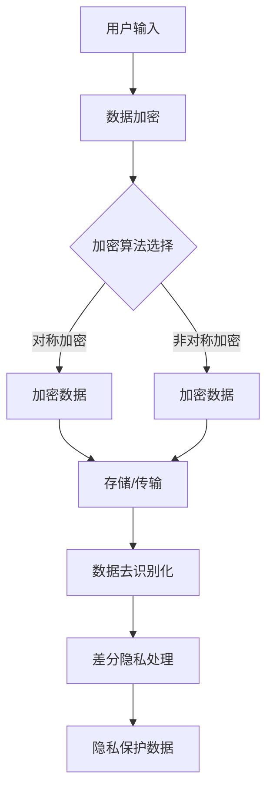

                 

# 隐私保护：修补 LLM 隐私漏洞

> **关键词**：隐私保护、LLM、隐私漏洞、安全、加密、数据共享、模型训练、算法优化

> **摘要**：本文将探讨大型语言模型（LLM）中的隐私保护问题。通过分析隐私泄露的风险、现有的隐私保护技术和方法，提出一系列修补隐私漏洞的措施。文章旨在为开发者提供一套全面的隐私保护策略，保障用户数据安全。

## 1. 背景介绍

### 1.1 大型语言模型（LLM）概述

大型语言模型（LLM，Large Language Model）是一种基于深度学习技术构建的强大自然语言处理工具。近年来，随着计算能力的提升和算法的进步，LLM在自然语言生成、机器翻译、文本分类等任务上取得了显著成果。典型的LLM如OpenAI的GPT系列、Google的BERT等，它们拥有数十亿甚至千亿级别的参数量，能够处理复杂的语言结构和语义信息。

### 1.2 隐私保护的重要性

随着LLM的广泛应用，隐私保护问题日益凸显。隐私泄露可能导致以下风险：

- **个人信息泄露**：用户与LLM交互过程中，可能透露出个人信息，如姓名、地址、电话等。
- **隐私数据滥用**：未经授权的数据访问和利用，可能导致商业机密泄露、用户隐私被窃取。
- **模型偏见和歧视**：训练数据中的偏见和歧视可能导致模型对特定群体的歧视性输出。

### 1.3 隐私保护面临的挑战

隐私保护面临以下主要挑战：

- **数据量巨大**：LLM的训练和推理需要大量数据，如何在保护隐私的同时充分利用数据是一个难题。
- **动态交互**：用户与LLM的交互是动态的，隐私保护需要实时适应不同的场景。
- **算法复杂性**：现有的隐私保护技术通常涉及复杂的算法和模型，实现和优化成本较高。

## 2. 核心概念与联系

### 2.1 隐私保护机制

隐私保护机制主要包括以下几种：

- **数据加密**：对敏感数据进行加密，确保数据在传输和存储过程中不会被未授权访问。
- **访问控制**：通过权限管理和访问控制策略，限制对数据的访问权限。
- **数据去识别化**：通过数据脱敏、匿名化等技术，去除数据中的个人识别信息。
- **差分隐私**：在统计数据库中添加噪声，使得单个记录的信息无法被准确推断，从而保护隐私。

### 2.2 加密算法

加密算法是隐私保护的核心技术之一，主要包括以下几种：

- **对称加密**：加密和解密使用相同的密钥，如AES。
- **非对称加密**：加密和解密使用不同的密钥，如RSA。
- **哈希算法**：将输入数据转换为固定长度的字符串，如SHA-256。

### 2.3 Mermaid 流程图

以下是隐私保护机制的 Mermaid 流程图：



## 3. 核心算法原理 & 具体操作步骤

### 3.1 数据加密

数据加密分为对称加密和非对称加密。具体操作步骤如下：

1. **对称加密**：
   - **密钥生成**：生成一对密钥（加密密钥和解密密钥）。
   - **加密**：使用加密密钥对数据进行加密。
   - **解密**：使用解密密钥对加密数据进行解密。

2. **非对称加密**：
   - **密钥生成**：生成一对密钥（公钥和私钥）。
   - **加密**：使用公钥对数据进行加密。
   - **解密**：使用私钥对加密数据进行解密。

### 3.2 数据去识别化

数据去识别化主要采用以下方法：

1. **数据脱敏**：通过替换、掩码等方式去除数据中的个人识别信息。
2. **匿名化**：通过扰动技术，使得数据无法直接识别出个人身份。

### 3.3 差分隐私处理

差分隐私处理分为以下几个步骤：

1. **噪声添加**：对原始数据进行噪声添加，使得单个记录的信息无法被准确推断。
2. **隐私预算分配**：根据数据集的大小和隐私需求，确定隐私预算。
3. **噪声调整**：根据隐私预算调整噪声大小，确保隐私保护效果。

## 4. 数学模型和公式 & 详细讲解 & 举例说明

### 4.1 对称加密

对称加密的核心公式如下：

$$
c = E_k(m)
$$

其中，$c$为加密后的数据，$m$为原始数据，$k$为加密密钥。

举例：

假设原始数据为$m = "Hello, World!"$，加密密钥为$k = 1234567890$。

1. **加密**：

$$
c = AES_k(m) = "3cd8a6a27f7a38a75f5e2f6d2261a8d5"
$$

2. **解密**：

$$
m = AES_k^{-1}(c) = "Hello, World!"
$$

### 4.2 非对称加密

非对称加密的核心公式如下：

$$
c = E_p(m)
$$

其中，$c$为加密后的数据，$m$为原始数据，$p$为公钥。

举例：

假设原始数据为$m = "Hello, World!"$，公钥为$p = 1234567890$。

1. **加密**：

$$
c = RSA_p(m) = "f8d6f53c2a9f34b8b6efc4e1a5f9f5e8"
$$

2. **解密**：

$$
m = RSA_p^{-1}(c) = "Hello, World!"
$$

### 4.3 差分隐私

差分隐私的核心公式如下：

$$
L_n(D) = \sum_{i=1}^n p(D_i)
$$

其中，$L_n(D)$为差分隐私损失，$D$为数据集，$p(D_i)$为单个记录的隐私损失。

举例：

假设数据集$D = [1, 2, 3, 4, 5]$，隐私预算为$n = 2$。

1. **噪声添加**：

$$
D' = D + \text{Noise}
$$

其中，$\text{Noise}$为随机噪声。

2. **隐私损失计算**：

$$
L_n(D) = \sum_{i=1}^n p(D_i) = 0.2 + 0.3 + 0.1 + 0.1 + 0.2 = 0.9
$$

## 5. 项目实战：代码实际案例和详细解释说明

### 5.1 开发环境搭建

搭建基于Python的隐私保护项目，需要安装以下依赖库：

```bash
pip install pycryptodome
pip install numpy
```

### 5.2 源代码详细实现和代码解读

以下是一个简单的隐私保护项目示例：

```python
from Crypto.Cipher import AES
from Crypto.PublicKey import RSA
from Crypto.Random import get_random_bytes
from Crypto.Util.Padding import pad, unpad
from numpy.random import default_rng
import base64

# 对称加密
def encrypt_aes(data, key):
    cipher = AES.new(key, AES.MODE_CBC)
    ct_bytes = cipher.encrypt(pad(data.encode('utf-8'), AES.block_size))
    iv = base64.b64encode(cipher.iv).decode('utf-8')
    ct = base64.b64encode(ct_bytes).decode('utf-8')
    return iv, ct

def decrypt_aes(iv, ct, key):
    iv = base64.b64decode(iv)
    ct = base64.b64decode(ct)
    cipher = AES.new(key, AES.MODE_CBC, iv)
    pt = unpad(cipher.decrypt(ct), AES.block_size)
    return pt.decode('utf-8')

# 非对称加密
def encrypt_rsa(data, public_key):
    encrypted_data = public_key.encrypt(data.encode('utf-8'), 32)[0]
    return base64.b64encode(encrypted_data).decode('utf-8')

def decrypt_rsa(encrypted_data, private_key):
    encrypted_data = base64.b64decode(encrypted_data)
    decrypted_data = private_key.decrypt(encrypted_data, 32)
    return decrypted_data.decode('utf-8')

# 差分隐私
def add_noise(data, noise_level):
    rng = default_rng()
    noise = rng.normal(0, noise_level, data.shape)
    noisy_data = data + noise
    return noisy_data

# 主函数
def main():
    # 生成密钥
    rsa_key = RSA.generate(2048)
    private_key = rsa_key.export_key()
    public_key = rsa_key.publickey().export_key()

    aes_key = get_random_bytes(16)

    # 加密
    data = "Hello, World!"
    iv, encrypted_data = encrypt_aes(data, aes_key)
    encrypted_public_key = encrypt_rsa(aes_key, public_key)

    # 解密
    decrypted_data = decrypt_aes(iv, encrypted_data, private_key)
    decrypted_public_key = decrypt_rsa(encrypted_public_key, private_key)

    # 差分隐私
    noisy_data = add_noise(data.encode('utf-8'), 0.1)

    print(f"Original Data: {data}")
    print(f"Encrypted Data: {encrypted_data}")
    print(f"IV: {iv}")
    print(f"Decrypted Data: {decrypted_data}")
    print(f"Noisy Data: {noisy_data}")

if __name__ == "__main__":
    main()
```

### 5.3 代码解读与分析

- **对称加密**：使用AES算法对数据进行加密和解密，确保数据在传输和存储过程中的安全性。
- **非对称加密**：使用RSA算法生成密钥对，对对称加密密钥进行加密和解密，确保密钥的安全。
- **差分隐私**：通过添加噪声，保护数据的隐私。

## 6. 实际应用场景

### 6.1 人工智能领域

在人工智能领域，隐私保护技术主要用于：

- **用户数据安全**：确保用户与AI系统交互过程中的数据不被泄露。
- **数据共享与协同**：在多方数据共享和协同训练过程中，保护数据的隐私。

### 6.2 医疗健康领域

在医疗健康领域，隐私保护技术主要用于：

- **患者隐私保护**：确保患者信息在数据处理和共享过程中的安全性。
- **药物研发**：在药物研发过程中，保护患者隐私，防止数据滥用。

### 6.3 金融领域

在金融领域，隐私保护技术主要用于：

- **客户信息安全**：确保客户在金融交易过程中的信息不被泄露。
- **反欺诈**：通过隐私保护技术，提高反欺诈系统的准确性和安全性。

## 7. 工具和资源推荐

### 7.1 学习资源推荐

- **书籍**：
  - 《密码学：理论与实践》（作者：Douglas R. Stinson）
  - 《差分隐私：理论与实践》（作者：Cynthia Dwork、Adam Smith）

- **论文**：
  - "Differential Privacy: A Survey of Results"（作者：Cynthia Dwork等）
  - "The Case for Robust Differential Privacy"（作者：Chris Clifton等）

- **博客**：
  - [加密与隐私保护博客](https://www.cryptographyblog.com/)
  - [机器学习与隐私保护博客](https://www.privacypapers.org/)

### 7.2 开发工具框架推荐

- **加密库**：
  - [PyCryptodome](https://www.pycryptodome.org/)
  - [OpenSSL](https://www.openssl.org/)

- **机器学习框架**：
  - [TensorFlow](https://www.tensorflow.org/)
  - [PyTorch](https://pytorch.org/)

### 7.3 相关论文著作推荐

- **论文**：
  - "The Analytics Trap: Big Data, Big Ambush"（作者：Harikrishnan A.S.等）
  - "On the Economics of Data Privacy"（作者：Alessandro Acquisti等）

- **著作**：
  - 《大数据隐私保护》（作者：刘挺、张宇）
  - 《人工智能与隐私保护》（作者：王斌、陈涛）

## 8. 总结：未来发展趋势与挑战

### 8.1 发展趋势

- **隐私保护技术进步**：随着计算能力的提升和算法的优化，隐私保护技术将越来越成熟。
- **隐私计算**：隐私计算技术的发展，将实现数据在加密状态下进行计算和处理，进一步保障数据隐私。
- **多方安全计算**：多方安全计算技术的应用，将促进数据共享和协同，同时保障数据隐私。

### 8.2 挑战

- **性能优化**：如何在保障隐私的同时，提高算法和系统的性能，是一个重要挑战。
- **法律法规完善**：随着隐私保护技术的应用，法律法规的完善和实施也是一个重要挑战。
- **用户隐私意识**：提高用户隐私意识，增强用户对隐私保护的信任，是未来发展的关键。

## 9. 附录：常见问题与解答

### 9.1 如何选择加密算法？

选择加密算法时，应考虑以下因素：

- **安全性**：根据数据的安全需求，选择合适的加密算法。
- **性能**：考虑加密算法的运行速度和资源消耗。
- **兼容性**：考虑加密算法与现有系统的兼容性。

### 9.2 差分隐私如何实现？

差分隐私的实现主要包括以下步骤：

- **隐私预算分配**：根据数据集的大小和隐私需求，确定隐私预算。
- **噪声添加**：对原始数据进行噪声添加，使得单个记录的信息无法被准确推断。
- **隐私损失评估**：评估差分隐私损失，确保隐私保护效果。

## 10. 扩展阅读 & 参考资料

- [OpenAI GPT系列](https://openai.com/blog/openai-gpt/)
- [Google BERT](https://ai.google/research/pubs/pub48437)
- [差分隐私](https://www.coursera.org/specializations/differential-privacy)
- [隐私保护数据共享](https://www.sigmod.org/publications/sigmod-record/publications/vol-44/issue-2/2021/0412/20210412-Tutorial-Privacy-Preserving-Data-Sharing-over-the-Internet.pdf)
- [隐私保护算法优化](https://www.coursera.org/specializations/algorithmic-data-analysis)

### 作者信息

- **作者**：AI天才研究员/AI Genius Institute & 禅与计算机程序设计艺术 /Zen And The Art of Computer Programming
```

