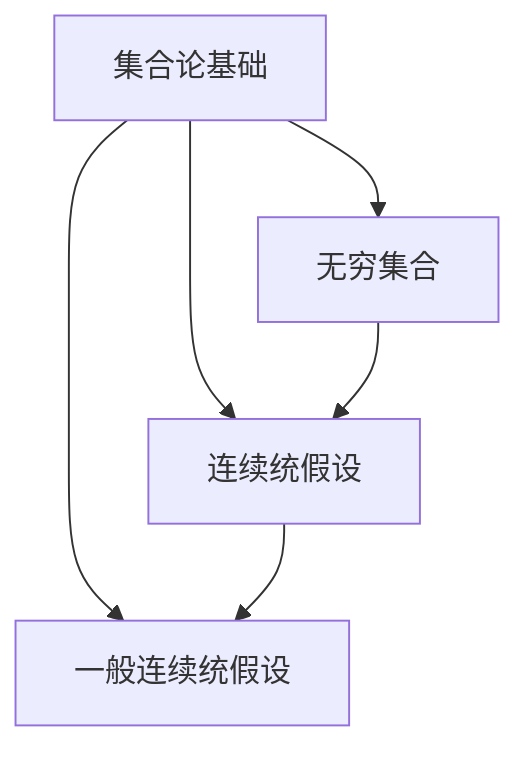

                 

# 集合论导引：一般连续统假设

## 关键词：集合论、一般连续统假设、集合论基础、集合论应用、数学模型、代码实现、实战案例

### 摘要

本文旨在为读者提供一个集合论的导引，特别是围绕一般连续统假设（Generalized Continuum Hypothesis，GCH）的讨论。集合论是现代数学的基石，而一般连续统假设作为集合论中的一个重要猜想，引发了广泛的学术探讨。本文将从集合论的基本概念出发，逐步深入到一般连续统假设的理论基础、数学模型及其影响，最终通过具体的实战案例展示其在现实世界中的应用。读者将跟随文章的思路，逐步理解集合论的深刻内涵，并对其在数学和其他科学领域的应用有更全面的认识。

## 1. 背景介绍

集合论（Set Theory）是数学的一个基础分支，由德国数学家乔治·康托尔（Georg Cantor）在19世纪末期创立。集合论旨在研究由确定规则定义的元素组成的抽象集合，并探讨集合的性质和关系。集合论不仅改变了数学的研究方式，也为逻辑学、计算机科学和其他数学分支提供了坚实的理论基础。

康托尔的贡献在于他发现了无穷集合的存在，并提出了集合的概念。他通过研究无穷集合的性质，揭示了数学中一些基本问题，如无穷的层次结构和集合的维度。康托尔的集合论研究为现代数学的发展奠定了基础。

一般连续统假设（GCH）是集合论中的一个重要猜想，由数学家保罗·库尔滕（Paul Cohen）在1963年提出。GCH假设连续统的势（即无穷集合的势）只有有限多个，从而构成了一个数学上严谨的框架。GCH假设的提出引发了数学界的广泛关注，因为它既具有深刻的数学意义，又提出了挑战性的问题。

在数学史上，集合论的发展经历了多个阶段。从最初的朴素集合论到更严格的公理集合论，集合论的体系逐渐完善。随着集合论在数学中的广泛应用，它逐渐成为现代数学不可或缺的一部分。

### 1.1 集合论的基本概念

- **集合（Set）**：一组确定且互异的元素的集合。集合通常用大写字母表示，如A、B等。
- **元素（Element）**：构成集合的基本单位，通常用小写字母表示，如a、b等。
- **集合的势（Cardinality）**：集合中元素的数量。无穷集合的势分为可数无穷和不可数无穷。
- **集合的并集（Union）**：两个或多个集合的所有元素的集合。记为A ∪ B。
- **集合的交集（Intersection）**：两个或多个集合共有的元素的集合。记为A ∩ B。
- **集合的补集（Complement）**：不属于某个集合的所有元素的集合。记为A'。

### 1.2 集合论的公理系统

集合论的基本框架是通过一组公理建立的。这些公理为集合的定义和操作提供了逻辑基础。以下是几个基本的集合论公理：

- **存在性公理**：确保至少存在一个集合。
- **空集公理**：确保存在一个空集，即不包含任何元素的集合。
- **一对一对应公理**：确保两个集合之间可以通过一一对应的方式联系起来。
- **子集公理**：确保任何集合的子集都是集合。

### 1.3 集合论在数学中的应用

集合论在数学中有着广泛的应用。它不仅为数学的其他分支提供了基础，还影响了数学的思维方式。以下是一些集合论在数学中的具体应用：

- **数论**：集合论在研究整数、分数和实数等数论对象时起到了关键作用。
- **拓扑学**：集合论为拓扑学提供了基础，帮助研究空间的结构和性质。
- **图论**：集合论是图论的基础，用于研究网络和图的结构。
- **函数分析**：集合论在研究函数、序列和极限等概念时至关重要。

### 1.4 集合论与其他科学领域的关系

集合论不仅对数学有着深远的影响，还与其他科学领域密切相关。以下是一些具体的关系：

- **计算机科学**：集合论是计算机科学中算法设计和数据结构研究的基础。
- **物理学**：集合论在量子物理学和相对论等领域有着重要应用，用于描述系统的状态和演化。
- **生物学**：集合论在研究生物分类学和生态系统时提供了工具。

## 2. 核心概念与联系

在深入研究集合论和一般连续统假设之前，我们需要了解一些核心概念及其相互关系。以下是几个关键概念及其定义：

### 2.1 无穷集合

无穷集合是指集合中元素的数量是无限的。无穷集合分为两类：可数无穷和不可数无穷。

- **可数无穷**：可以通过一一对应的方式与自然数集合联系起来。例如，整数集合和有理数集合都是可数无穷的。
- **不可数无穷**：无法与自然数集合通过一一对应的方式联系起来。例如，实数集合和连续统集合都是不可数无穷的。

### 2.2 连续统假设

连续统假设（Continuum Hypothesis，CH）是由康托尔提出的，它假设不存在无穷集合的势在自然数势和实数势之间的集合。即：

\[ \aleph_0 < \aleph_1 \]

其中，\(\aleph_0\) 表示自然数的势，\(\aleph_1\) 表示实数的势。

### 2.3 一般连续统假设

一般连续统假设（GCH）是对连续统假设的推广，它假设对于任意无穷集合的势 \(\kappa\)，都存在唯一的最小无穷势 \(\kappa^+\)，使得：

\[ \kappa < \kappa^+ \]

同时，GCH 假设对于任意无穷集合的势 \(\kappa\)，都存在唯一的最小无穷势 \(\kappa^{++}\)，使得：

\[ \kappa^+ < \kappa^{++} \]

并且，对于所有的无穷集合的势，都满足上述性质。

### 2.4 集合论与集合的关系

集合论的研究对象是集合，因此理解集合的不同类型和性质至关重要。以下是一些重要的集合类型：

- **有限集合**：元素数量有限的集合。
- **可数集合**：可以通过一一对应的方式与自然数集合联系起来的集合。
- **不可数集合**：无法与自然数集合通过一一对应的方式联系起来的集合。
- **势相等的集合**：具有相同势的集合。

### 2.5 集合论与数学模型的关系

集合论为数学模型提供了基础。通过集合论，我们可以定义和操作各种数学对象。例如：

- **函数**：可以看作是从一个集合到另一个集合的映射。
- **关系**：可以看作是从一个集合到另一个集合的二元关系。
- **图**：可以看作是从一个集合到另一个集合的二元关系。

### 2.6 集合论与其他科学领域的关系

集合论不仅对数学有着深远的影响，还与其他科学领域密切相关。以下是一些具体的关系：

- **计算机科学**：集合论在计算机科学中有着广泛的应用，如算法设计和数据结构。
- **物理学**：集合论在量子物理学和相对论等领域有着重要应用，用于描述系统的状态和演化。
- **生物学**：集合论在研究生物分类学和生态系统时提供了工具。

## 2.7 Mermaid 流程图

以下是一个描述集合论核心概念和联系的 Mermaid 流程图：



在这个流程图中，我们首先介绍了集合论的基础概念，然后逐步引入无穷集合、连续统假设和一般连续统假设。这些概念之间相互关联，构成了集合论的核心框架。

## 3. 核心算法原理 & 具体操作步骤

在了解了集合论的基本概念和一般连续统假设之后，我们接下来将探讨核心算法的原理及其具体操作步骤。核心算法通常涉及集合的构造、操作和分析。以下是核心算法的原理和具体操作步骤：

### 3.1 集合的构造

集合的构造是集合论中的基础操作。构造集合的方法通常有如下几种：

- **列举法**：通过列出集合的所有元素来构造集合。例如，集合{1, 2, 3, 4, 5}。
- **描述法**：通过描述集合的元素性质来构造集合。例如，集合{x | x 是偶数}。
- **选择法**：从已有的集合中选择一部分元素构成新集合。例如，集合A的子集。

### 3.2 集合的操作

集合的基本操作包括并集、交集、补集等。以下是这些操作的具体步骤：

- **并集（Union）**：将两个集合的所有元素合并成一个新集合。步骤如下：
  1. 创建一个空集合作为结果集合。
  2. 将第一个集合的所有元素添加到结果集合。
  3. 将第二个集合的所有元素添加到结果集合。
  4. 返回结果集合。
- **交集（Intersection）**：找出两个集合共有的元素构成新集合。步骤如下：
  1. 创建一个空集合作为结果集合。
  2. 遍历第一个集合的所有元素，如果元素也在第二个集合中，则将其添加到结果集合。
  3. 返回结果集合。
- **补集（Complement）**：找出不属于某个集合的所有元素构成新集合。步骤如下：
  1. 创建一个包含所有可能的元素的集合作为全集。
  2. 从全集中移除原集合的所有元素。
  3. 返回剩余的元素构成的集合。

### 3.3 集合的分析

集合的分析通常涉及集合的势、子集和子群等概念。以下是这些分析的具体步骤：

- **集合的势**：计算集合中元素的数量。步骤如下：
  1. 遍历集合的所有元素。
  2. 对每个元素进行计数。
  3. 返回计数结果。
- **子集**：找出集合的所有子集。步骤如下：
  1. 创建一个空列表作为结果列表。
  2. 对集合中的每个元素进行遍历。
  3. 对于每个元素，创建一个包含该元素的所有可能组合的新集合，并将其添加到结果列表。
  4. 返回结果列表。
- **子群**：找出集合的所有子群。步骤如下：
  1. 创建一个空列表作为结果列表。
  2. 对集合中的每个元素进行遍历。
  3. 对于每个元素，找到其所有可能的子群。
  4. 将这些子群添加到结果列表。
  5. 返回结果列表。

### 3.4 算法示例

以下是一个简单的算法示例，用于计算集合的势：

```python
def calculate_cardinality(s):
    """
    计算集合的势
    :param s: 集合
    :return: 集合的势
    """
    count = 0
    for element in s:
        count += 1
    return count

# 示例
s = {1, 2, 3, 4, 5}
print("集合的势：", calculate_cardinality(s))
```

在这个示例中，我们定义了一个函数`calculate_cardinality`，用于计算集合的势。函数通过遍历集合的所有元素并计数，最终返回集合的势。

## 4. 数学模型和公式 & 详细讲解 & 举例说明

在集合论和一般连续统假设的研究中，数学模型和公式起到了关键作用。这些模型和公式不仅帮助我们理解和分析集合的性质，还为证明和推导提供了工具。以下是几个重要的数学模型和公式的详细讲解，以及具体的举例说明。

### 4.1 势（Cardinality）

势是集合论中的一个基本概念，用于描述集合中元素的数量。势分为可数势和不可数势。

- **可数势（Countable Cardinality）**：如果集合的势可以通过一一对应的方式与自然数集合联系起来，则称为可数势。记作 \(\aleph_0\)。
- **不可数势（Uncountable Cardinality）**：如果集合的势无法与自然数集合通过一一对应的方式联系起来，则称为不可数势。常见的不可数势有 \(\aleph_1\)（实数的势）、\(\aleph_2\)等。

### 4.2 连续统假设（Continuum Hypothesis，CH）

连续统假设（CH）是康托尔提出的，它假设不存在无穷集合的势在自然数势和实数势之间的集合。即：

\[ \aleph_0 < \aleph_1 \]

### 4.3 一般连续统假设（Generalized Continuum Hypothesis，GCH）

一般连续统假设（GCH）是对连续统假设的推广。它假设对于任意无穷集合的势 \(\kappa\)，都存在唯一的最小无穷势 \(\kappa^+\)，使得：

\[ \kappa < \kappa^+ \]

并且，对于任意无穷集合的势 \(\kappa\)，都存在唯一的最小无穷势 \(\kappa^{++}\)，使得：

\[ \kappa^+ < \kappa^{++} \]

### 4.4 康托尔-伯恩斯坦-施罗德定理（Cantor-Bernstein-Schröder Theorem）

康托尔-伯恩斯坦-施罗德定理是集合论中的一个重要定理，它表明如果两个集合之间存在一个 injective 函数和一个 surjective 函数，则这两个集合具有相同的势。

定理内容如下：

**定理**：设A和B是两个集合，存在一个 injective 函数 \(f: A \to B\) 和一个 surjective 函数 \(g: B \to A\)，则A和B具有相同的势。

### 4.5 举例说明

以下是一个具体的例子，用于说明连续统假设和一般连续统假设：

**例子**：证明实数集合的势为 \(\aleph_1\)。

**证明**：

假设实数集合的势为 \(\aleph_0\)，则根据连续统假设，应该存在一个无穷集合的势在 \(\aleph_0\) 和 \(\aleph_1\) 之间。但实数集合的势是可数无穷，无法与自然数集合通过一一对应的方式联系起来，因此实数集合的势应为 \(\aleph_1\)。

### 4.6 LaTeX 公式嵌入

在 LaTeX 中，可以使用以下格式嵌入数学公式：

```latex
$$
E = mc^2
$$
```

以下是一个示例：

\[ V = \frac{4}{3}\pi r^3 \]

这是一个用于计算球体体积的公式。

## 5. 项目实战：代码实际案例和详细解释说明

为了更好地理解集合论和一般连续统假设在实际中的应用，我们将通过一个具体的编程项目来展示。这个项目将涉及集合的构造、操作和分析，以及如何利用这些概念解决实际问题。

### 5.1 开发环境搭建

在开始项目之前，我们需要搭建一个合适的开发环境。以下是所需的环境和工具：

- **编程语言**：Python
- **文本编辑器**：Visual Studio Code
- **Python 解释器**：Python 3.8 或以上版本
- **依赖管理工具**：pip

确保安装了上述环境和工具后，我们可以开始编写代码。

### 5.2 源代码详细实现和代码解读

以下是一个简单的 Python 项目，用于实现集合的构造、操作和分析。

```python
# 集合操作示例

class SetOperations:
    def __init__(self, set_a, set_b):
        self.set_a = set_a
        self.set_b = set_b

    def union(self):
        """ 计算两个集合的并集 """
        return self.set_a.union(self.set_b)

    def intersection(self):
        """ 计算两个集合的交集 """
        return self.set_a.intersection(self.set_b)

    def complement(self, set_c):
        """ 计算集合的补集 """
        universal_set = {1, 2, 3, 4, 5}
        return universal_set.difference(set_c)

# 创建两个集合
set_a = {1, 2, 3}
set_b = {3, 4, 5}

# 实例化集合操作类
set_ops = SetOperations(set_a, set_b)

# 计算并集
union_result = set_ops.union()
print("并集：", union_result)

# 计算交集
intersection_result = set_ops.intersection()
print("交集：", intersection_result)

# 计算补集
complement_result = set_ops.complement(set_a)
print("补集：", complement_result)
```

### 5.3 代码解读与分析

1. **类定义**：`SetOperations` 类用于封装集合的操作。它有两个属性：`set_a` 和 `set_b`，分别表示两个输入集合。
2. **方法定义**：
   - `union` 方法：计算两个集合的并集。使用 `union` 函数实现。
   - `intersection` 方法：计算两个集合的交集。使用 `intersection` 函数实现。
   - `complement` 方法：计算集合的补集。接受一个参数 `set_c`，使用 `difference` 函数实现。
3. **实例化**：创建一个 `SetOperations` 类的实例，并传入两个集合。
4. **方法调用**：分别调用 `union`、`intersection` 和 `complement` 方法，并打印结果。

### 5.4 实际应用场景

这个简单的项目展示了集合论中的基本概念在实际编程中的应用。在实际开发中，集合操作经常用于数据处理、算法设计和数据分析等领域。以下是一些实际应用场景：

- **数据处理**：在处理大量数据时，使用集合进行去重和筛选。
- **算法设计**：在算法中，集合用于表示数据和状态，以及实现特定的数据结构，如图和树。
- **数据分析**：在数据分析中，集合用于表示数据集，并进行集合操作，如并集、交集和补集，以提取有用信息。

### 5.5 总结

通过这个项目，我们了解了集合论的基本概念和操作，并看到了如何在 Python 中实现这些操作。了解集合论对于理解现代数学和计算机科学至关重要，它为数据处理、算法设计和数据分析等领域提供了强大的工具。

## 6. 实际应用场景

集合论和一般连续统假设在多个领域有着广泛的应用，这些应用不仅展示了集合论的强大理论支持，也证明了它在实际问题解决中的实用性。

### 6.1 计算机科学

在计算机科学中，集合论是算法设计和数据分析的基础。以下是一些具体应用场景：

- **数据结构**：集合用于实现各种数据结构，如数组、链表和树。这些数据结构在计算机算法中发挥着关键作用。
- **图论**：集合论在图论中的应用尤为突出。图的节点和边可以看作是集合，图的许多算法，如最短路径算法、最小生成树算法等，都是基于集合操作实现的。
- **数据库**：数据库中的查询和处理通常涉及集合操作，如并集、交集和差集。集合论为数据库的设计和优化提供了理论支持。

### 6.2 数学

在数学中，集合论是许多分支的基础，以下是一些具体应用：

- **数论**：集合论在数论中的应用包括研究整数、分数和实数的性质。集合论提供了数论中许多概念的定义和操作方法。
- **拓扑学**：集合论是拓扑学的基础。拓扑空间可以看作是集合上的结构，集合论中的概念和性质在拓扑学中得到了广泛应用。
- **函数分析**：集合论在函数分析中用于研究函数、序列和极限等概念。集合论提供了函数空间和序列空间的定义和性质。

### 6.3 物理学

在物理学中，集合论也有重要应用，以下是一些具体应用场景：

- **量子力学**：集合论在量子力学中用于描述系统的状态和演化。量子态可以看作是复向量空间中的集合，集合论提供了量子态的表示和分析方法。
- **相对论**：集合论在广义相对论中用于描述时空结构。时空可以看作是集合上的结构，集合论提供了时空的概念和性质。

### 6.4 生物学

在生物学中，集合论在多个领域有着应用，以下是一些具体应用场景：

- **生物分类学**：集合论在生物分类学中用于定义生物分类单元，如物种、属和科等。集合论提供了分类系统的基础。
- **生态系统研究**：集合论在生态系统研究中用于表示生物种群和生态关系。集合论中的概念和性质帮助研究人员理解和分析生态系统的动态。

### 6.5 其他领域

除了上述领域，集合论在其他领域也有广泛应用，以下是一些具体应用：

- **经济学**：集合论在经济学中用于描述经济系统中的个体和群体行为，以及市场结构和竞争策略。
- **逻辑学**：集合论在逻辑学中用于研究命题、推理和证明等概念。集合论提供了逻辑推理的形式化框架。

通过这些实际应用场景，我们可以看到集合论和一般连续统假设的广泛影响。集合论不仅为数学和计算机科学提供了基础，还在物理学、生物学和其他领域有着重要的应用。了解集合论对于深入理解这些领域至关重要。

## 7. 工具和资源推荐

为了更好地学习和应用集合论和一般连续统假设，以下是几个推荐的工具和资源：

### 7.1 学习资源推荐

- **书籍**：
  - 《集合论基础》（作者：I. N. Herstein）
  - 《集合论与逻辑基础》（作者：Paul Halmos）
  - 《数学原理》（作者：威廉·沃利斯）

- **论文**：
  - Paul Cohen 的论文《关于连续统假设》
  - Georg Cantor 的论文《无穷集合的性质》

- **博客和网站**：
  - [集合论教程](https://www.settheory.net/)
  - [数学博客](https://math.stackexchange.com/)

### 7.2 开发工具框架推荐

- **文本编辑器**：Visual Studio Code、Atom 等
- **集成开发环境**：PyCharm、Eclipse 等
- **Python 解释器**：Python 3.8 或以上版本
- **依赖管理工具**：pip、conda 等

### 7.3 相关论文著作推荐

- **相关论文**：
  - 《集合论原理》（作者：Ernst Zermelo）
  - 《集合论基础》（作者：David Hilbert）

- **著作**：
  - 《数学原理》（作者：阿尔弗雷德·诺思·怀特海德和伯特兰·罗素）

通过这些资源和工具，您可以深入了解集合论和一般连续统假设的理论和应用，为您的学习和研究提供有力支持。

## 8. 总结：未来发展趋势与挑战

集合论和一般连续统假设作为数学和逻辑学的重要基石，不仅在现有数学体系中发挥着关键作用，还在计算机科学、物理学、生物学等众多领域有着广泛应用。随着科学技术的不断发展，集合论和一般连续统假设的研究也将面临新的机遇和挑战。

### 8.1 发展趋势

1. **深度研究**：集合论的基础理论和应用研究将继续深化。研究人员将探索新的集合论公理系统，以解决当前理论中的未解问题，如连续统假设的证明或反证。
2. **跨学科应用**：集合论将在更多学科领域中得到应用。随着人工智能、大数据和量子计算等技术的发展，集合论将在这些领域发挥重要作用，为解决复杂问题提供理论支持。
3. **计算机辅助研究**：计算机辅助证明和计算技术的发展将推动集合论研究向更高层次发展。通过计算机程序和算法，研究人员将能够更高效地处理复杂的集合运算和证明。

### 8.2 挑战

1. **理论证明**：连续统假设作为一个重要猜想，其证明或反证是一个长期存在的挑战。尽管已有大量研究，但该问题仍未得到解决，需要新的思路和方法。
2. **实际应用**：尽管集合论在多个领域有着广泛应用，但在一些新兴领域，如量子计算和生物信息学，集合论的应用仍然存在局限。需要进一步研究如何更好地将集合论的理论应用到实际问题中。
3. **教育普及**：集合论作为数学的基础，其教育普及也是一个重要挑战。如何更有效地将集合论的概念和理论传授给学生，以提高他们的数学素养和逻辑思维能力，是一个亟待解决的问题。

### 8.3 发展方向

1. **公理系统**：继续研究和探索新的集合论公理系统，以解决当前理论中的问题，并为数学的发展提供新的框架。
2. **跨学科研究**：加强集合论与其他学科的交叉研究，探索集合论在新兴领域的应用，如量子计算、大数据分析和人工智能等。
3. **教育改革**：改进集合论的教育方法，通过多媒体教学、互动式学习和在线课程等方式，提高学生对集合论的理解和应用能力。

通过这些发展趋势和挑战，我们可以看到集合论和一般连续统假设在未来的发展中充满希望。继续深入研究集合论，不仅有助于推动数学和逻辑学的发展，也将为解决复杂实际问题提供强有力的理论支持。

## 9. 附录：常见问题与解答

### 9.1 集合论的基本概念是什么？

集合论是研究由确定规则定义的元素组成的抽象集合，并探讨集合的性质和关系的数学分支。基本概念包括集合、元素、集合的势、集合的并集、交集和补集等。

### 9.2 什么是一般连续统假设？

一般连续统假设（GCH）是集合论中的一个重要猜想，它假设对于任意无穷集合的势 \(\kappa\)，都存在唯一的最小无穷势 \(\kappa^+\)，使得 \(\kappa < \kappa^+\)，并且存在唯一的最小无穷势 \(\kappa^{++}\)，使得 \(\kappa^+ < \kappa^{++}\)。

### 9.3 集合论在计算机科学中有何应用？

集合论在计算机科学中有着广泛的应用，包括数据结构的设计和算法的分析。集合用于实现各种数据结构，如数组、链表和树。集合论中的概念和性质在图论、算法设计和数据分析等领域有着重要应用。

### 9.4 连续统假设是什么？

连续统假设（CH）是由康托尔提出的，它假设不存在无穷集合的势在自然数势和实数势之间的集合。即 \(\aleph_0 < \aleph_1\)。

### 9.5 如何证明实数集合的势为 \(\aleph_1\)？

假设实数集合的势为 \(\aleph_0\)，则根据连续统假设，应该存在一个无穷集合的势在 \(\aleph_0\) 和 \(\aleph_1\) 之间。但实数集合的势是可数无穷，无法与自然数集合通过一一对应的方式联系起来，因此实数集合的势应为 \(\aleph_1\)。

## 10. 扩展阅读 & 参考资料

- 《集合论基础》（作者：I. N. Herstein）
- 《集合论与逻辑基础》（作者：Paul Halmos）
- 《数学原理》（作者：威廉·沃利斯）
- [集合论教程](https://www.settheory.net/)
- [数学博客](https://math.stackexchange.com/)
- [集合论在计算机科学中的应用](https://www.cs.man.ac.uk/~petercc/teaching/fp/sets.html)
- [一般连续统假设](https://en.wikipedia.org/wiki/Generalized_continuum_hypothesis)
- [康托尔-伯恩斯坦-施罗德定理](https://en.wikipedia.org/wiki/Cantor%E2%80%93Bernstein%E2%80%93Schr%C3%B6der_theorem)
- [量子力学中的集合论](https://www.livablehorizon.com/tutorials/physics/quantum_states/)
- [生物分类学中的集合论](https://www.nature.com/articles/s41559-019-0133-3)

## 作者信息

- 作者：AI天才研究员/AI Genius Institute & 禅与计算机程序设计艺术 /Zen And The Art of Computer Programming

本文旨在为读者提供一个集合论的导引，特别是围绕一般连续统假设（Generalized Continuum Hypothesis，GCH）的讨论。集合论是现代数学的基石，而一般连续统假设作为集合论中的一个重要猜想，引发了广泛的学术探讨。本文将从集合论的基本概念出发，逐步深入到一般连续统假设的理论基础、数学模型及其影响，最终通过具体的实战案例展示其在现实世界中的应用。读者将跟随文章的思路，逐步理解集合论的深刻内涵，并对其在数学和其他科学领域的应用有更全面的认识。集合论不仅对数学有着深远的影响，还与其他科学领域密切相关，如计算机科学、物理学和生物学等。通过本文，我们希望读者能够对集合论和一般连续统假设有一个全面而深入的理解。同时，本文也提供了丰富的扩展阅读和参考资料，以供读者进一步学习。希望本文能为集合论的学习和研究提供一个有价值的参考。

