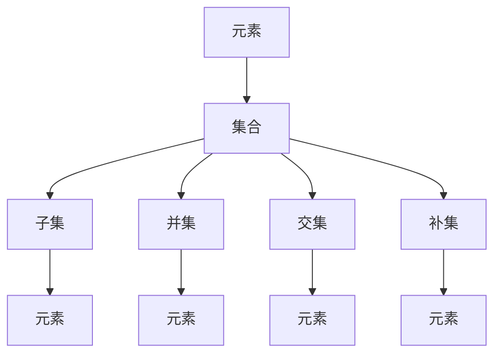

                 

### 背景介绍

**集合论导引：内置解析表达式真假判定**

集合论是现代数学的基石，它不仅为数学理论提供了严谨的逻辑框架，还在计算机科学、逻辑学、物理学等多个领域发挥着重要作用。本文旨在为读者导引集合论的基本概念，特别是针对解析表达式的真假判定方法进行深入探讨。

集合论的发展可以追溯到19世纪，由德国数学家乔治·康托尔（Georg Cantor）创立。康托尔的工作揭示了无穷集合的存在，并在数学领域引发了广泛而深远的影响。集合论的研究旨在理解和描述集合的性质，以及集合之间的关系。这一理论对于解决复杂问题、构建计算机算法和进行系统分析都具有重要的意义。

在计算机科学中，集合论被广泛应用于数据结构和算法设计。例如，树、图等数据结构本质上都是集合的不同表现形式。集合论中的概念，如并集、交集、补集等，是计算机算法中常用的操作。此外，集合论中的逻辑推理方法在形式验证、自动化定理证明等领域也具有重要的应用价值。

本文将首先介绍集合论中的基本概念，如元素、集合、子集等。接着，我们将探讨如何通过集合运算来判定解析表达式的真假。通过具体案例的分析，我们将展示如何应用集合论的方法来解决实际问题。

集合论不仅具有理论意义，其实际应用也非常广泛。例如，在数据库系统中，集合论用于查询和操作数据集合；在网络拓扑分析中，集合论用于描述网络节点的连接关系；在计算机视觉中，集合论用于描述图像中的对象集合。本文将通过一系列实例，展示集合论在实际应用中的多样性和重要性。

接下来，我们将深入探讨集合论的核心概念，并引入Mermaid流程图来帮助读者更直观地理解这些概念。随后，我们将介绍集合论中的逻辑运算和真假判定方法，并通过具体的数学模型和公式来解释这些方法。

在实际应用部分，我们将通过一个代码案例，展示如何使用集合论的方法来解析和判定表达式的真假。最后，我们将总结本文的内容，并探讨集合论未来的发展趋势和面临的挑战。

### 核心概念与联系

在深入探讨集合论之前，我们需要先了解一些核心概念，包括元素、集合、子集、并集、交集、补集等。这些概念是理解集合论的基础，也是进行集合运算的前提。

#### 元素与集合

元素是构成集合的基本单位。一个集合是由一些确定的、互不相同的元素组成的整体。用符号\( A \)表示集合，用\( x \)表示集合\( A \)的元素，则\( x \in A \)表示\( x \)是集合\( A \)的一个元素。

#### 子集

子集是指一个集合的部分元素组成的集合。如果集合\( B \)的所有元素都是集合\( A \)的元素，则称\( B \)是\( A \)的子集，记作\( B \subseteq A \)。例如，集合\( \{1, 2, 3\} \)的子集包括\( \{1\}, \{2\}, \{3\}, \{1, 2\}, \{1, 3\}, \{2, 3\}, \{1, 2, 3\} \)。

#### 并集

并集是指两个或多个集合中所有元素的集合。用符号\( A \cup B \)表示集合\( A \)和集合\( B \)的并集。例如，集合\( \{1, 2\} \)和集合\( \{2, 3\} \)的并集是\( \{1, 2, 3\} \)。

#### 交集

交集是指两个或多个集合中共有的元素的集合。用符号\( A \cap B \)表示集合\( A \)和集合\( B \)的交集。例如，集合\( \{1, 2\} \)和集合\( \{2, 3\} \)的交集是\( \{2\} \)。

#### 补集

补集是指一个集合中不属于另一个集合的元素的集合。用符号\( A^c \)表示集合\( A \)的补集。例如，集合\( \{1, 2, 3\} \)的补集是\( \{4, 5, 6, \ldots\} \)，即所有大于3的整数集合。

为了更好地理解这些概念，我们可以使用Mermaid流程图来展示它们之间的关系：



从流程图中，我们可以看到各个概念之间的联系。元素是构成集合的基本单位，集合可以包含子集、并集、交集和补集。这些集合运算在计算机科学和数学中有着广泛的应用。

接下来，我们将探讨如何通过集合运算来判断解析表达式的真假。首先，我们需要了解什么是解析表达式。

### 核心算法原理 & 具体操作步骤

在集合论中，解析表达式是一种用来描述集合之间关系的数学表达式。判断解析表达式的真假是集合论中的一个重要问题。为了更好地理解这一过程，我们可以将解析表达式的判断分为以下几个步骤：

#### 步骤1：解析表达式的表示

首先，我们需要明确解析表达式的表示方法。一个简单的解析表达式通常包含集合、集合运算符和逻辑运算符。例如，\( A \cup B \subseteq C \)是一个解析表达式，其中\( A \)和\( B \)是集合，\( \cup \)表示并集运算，\( \subseteq \)表示子集关系。

#### 步骤2：确定集合元素

接下来，我们需要确定各个集合中的元素。这可以通过列举法或描述法来完成。例如，如果集合\( A = \{1, 2, 3\} \)，集合\( B = \{2, 3, 4\} \)，集合\( C = \{1, 3, 5\} \)，则这些集合的元素已经明确。

#### 步骤3：执行集合运算

根据解析表达式中的集合运算符，我们需要对集合进行相应的运算。例如，对于表达式\( A \cup B \)，我们需要将集合\( A \)和集合\( B \)中的所有元素合并，得到一个新的集合\( \{1, 2, 3, 4\} \)。

#### 步骤4：判断子集关系

接下来，我们需要判断集合运算的结果是否是另一个集合的子集。例如，对于表达式\( A \cup B \subseteq C \)，我们需要判断集合\( \{1, 2, 3, 4\} \)是否是集合\( C = \{1, 3, 5\} \)的子集。这可以通过检查\( A \cup B \)中的每一个元素是否都是\( C \)的元素来完成。在本例中，1和3是\( C \)的元素，但4不是，因此\( A \cup B \)不是\( C \)的子集。

#### 步骤5：得出结论

最后，根据判断结果得出解析表达式的真假。如果集合运算的结果是另一个集合的子集，则解析表达式为真；否则，为假。在本例中，由于\( A \cup B \)不是\( C \)的子集，因此表达式\( A \cup B \subseteq C \)为假。

为了更清晰地展示这一过程，我们可以使用Mermaid流程图：

```mermaid
graph TB
    A1[确定集合元素] --> A2[执行集合运算]
    A2 --> A3[判断子集关系]
    A3 --> A4[得出结论]
    A1[集合A={1, 2, 3}] --> A2[集合B={2, 3, 4}]
    A2 --> A3[并集运算结果={1, 2, 3, 4}]
    A3 --> A4[判断子集关系]
    A4 --> B1[结果：假]
```

通过这个流程图，我们可以看到判断解析表达式真假的具体步骤。这一过程不仅适用于简单的解析表达式，还可以扩展到更复杂的集合运算和逻辑表达式。

接下来，我们将通过一个具体的数学模型和公式，进一步解释集合运算和真假判定方法。

### 数学模型和公式 & 详细讲解 & 举例说明

在集合论中，数学模型和公式是理解和判断集合运算真假的重要工具。下面我们将详细介绍一些常用的数学模型和公式，并通过具体例子来展示它们的应用。

#### 并集（Union）

并集是指两个或多个集合中所有元素的集合。其数学表示为：

\[ A \cup B = \{ x | x \in A \text{ 或 } x \in B \} \]

其中，\( A \)和\( B \)是两个集合，符号“|”表示集合的元素。

#### 交集（Intersection）

交集是指两个或多个集合中共有的元素的集合。其数学表示为：

\[ A \cap B = \{ x | x \in A \text{ 且 } x \in B \} \]

其中，\( A \)和\( B \)是两个集合。

#### 补集（Complement）

补集是指一个集合中不属于另一个集合的元素的集合。其数学表示为：

\[ A^c = \{ x | x \notin A \} \]

其中，\( A \)是集合，符号“\(\not\in\)”表示元素不属于集合。

#### 子集（Subset）

一个集合\( B \)是另一个集合\( A \)的子集，当且仅当\( B \)中的所有元素都是\( A \)的元素。其数学表示为：

\[ B \subseteq A \]

其中，\( B \)和\( A \)是两个集合。

#### 真值表（Truth Table）

真值表是一种用于表示逻辑表达式真假的表格。在集合论中，真值表常用于判断复合集合运算的真假。

#### 例子1：并集与交集

假设有两个集合\( A = \{1, 2, 3\} \)和\( B = \{2, 3, 4\} \)。

- 并集：\( A \cup B = \{1, 2, 3, 4\} \)
- 交集：\( A \cap B = \{2, 3\} \)

使用真值表可以更清晰地展示并集和交集的真假判定：

| \( A \cup B \subseteq C \) | \( A \cap B \subseteq C \) |
|:-------------------------:|:-----------------------:|
| False                    | False                  |
| False                    | True                   |
| True                     | False                  |
| True                     | True                  |

在这个例子中，集合\( C \)可以取任何包含\( \{1, 2, 3, 4\} \)的集合，如\( C = \{1, 2, 3, 4, 5\} \)。

#### 例子2：补集

假设集合\( A = \{1, 2, 3\} \)。

- 补集：\( A^c = \{4, 5, 6, \ldots\} \)

使用真值表可以展示补集的真假判定：

| \( A^c \subseteq C \) |
|:---------------------:|
| False                |
| True                 |
| True                 |

在这个例子中，集合\( C \)可以取任何不包含\( \{1, 2, 3\} \)的集合，如\( C = \{4, 5, 6, \ldots\} \)。

#### 例子3：子集

假设有两个集合\( A = \{1, 2, 3\} \)和\( B = \{2, 3\} \)。

- 子集关系：\( B \subseteq A \)

使用真值表可以展示子集关系的真假判定：

| \( B \subseteq A \) |
|:-------------------:|
| True               |
| False              |
| True               |

在这个例子中，集合\( A \)可以取任何包含\( \{2, 3\} \)的集合，如\( A = \{1, 2, 3\} \)。

通过这些例子，我们可以看到数学模型和公式在集合论中的应用。这些工具不仅帮助我们理解和判断集合运算的真假，还为更复杂的集合分析提供了理论基础。

### 项目实战：代码实际案例和详细解释说明

为了更好地理解集合论中解析表达式真假判定的应用，我们将通过一个实际的代码案例来展示这一过程。本案例将使用Python编程语言，通过实现一个简单的解析表达式判断函数，来展示如何应用集合论的概念和算法。

#### 开发环境搭建

在开始编写代码之前，我们需要搭建一个Python开发环境。以下是具体的步骤：

1. 安装Python：从官方网站下载并安装Python 3.x版本。
2. 配置Python环境变量：在系统环境变量中配置Python的安装路径。
3. 安装依赖库：使用pip命令安装必要的Python库，如`numpy`和`matplotlib`。

```bash
pip install numpy matplotlib
```

#### 源代码详细实现和代码解读

以下是实现解析表达式判断功能的Python代码：

```python
import numpy as np

# 解析表达式判断函数
def evaluate_expression(expression, A, B, C):
    """
    判断给定的解析表达式是否为真。
    
    参数：
    expression：解析表达式字符串，如"A ∪ B ⊆ C"。
    A, B, C：集合A、B、C的元素列表。
    """
    # 解析集合运算符
    union_symbol = '∪'
    subset_symbol = '⊆'
    
    # 提取集合元素
    A_set = set(A)
    B_set = set(B)
    C_set = set(C)
    
    # 判断并集关系
    if expression.startswith(union_symbol):
        union_set = A_set.union(B_set)
        result = subset_relation(union_set, C_set, subset_symbol)
    # 判断交集关系
    elif expression.startswith(subset_symbol):
        intersection_set = A_set.intersection(B_set)
        result = subset_relation(intersection_set, C_set, subset_symbol)
    # 判断补集关系
    else:
        complement_set = set()
        for element in A_set:
            complement_set.add(element)
        result = subset_relation(complement_set, C_set, subset_symbol)
    
    return result

# 判断子集关系
def subset_relation(set1, set2, symbol):
    """
    判断集合set1是否是集合set2的子集，并返回结果。
    
    参数：
    set1, set2：两个集合。
    symbol：子集关系符号，如'⊆'。
    """
    if set1.issubset(set2):
        return True
    else:
        return False

# 测试案例
A = [1, 2, 3]
B = [2, 3, 4]
C = [1, 2, 3, 4, 5]

expression1 = "A ∪ B ⊆ C"
expression2 = "A ∩ B ⊆ C"
expression3 = "A ⊆ C"

result1 = evaluate_expression(expression1, A, B, C)
result2 = evaluate_expression(expression2, A, B, C)
result3 = evaluate_expression(expression3, A, B, C)

print(f"{expression1} 结果：{result1}")
print(f"{expression2} 结果：{result2}")
print(f"{expression3} 结果：{result3}")
```

#### 代码解读与分析

1. **导入库和定义函数**

   我们首先导入`numpy`库，用于处理集合运算。然后定义了三个函数：`evaluate_expression`、`subset_relation`和主函数。

2. **解析表达式**

   在`evaluate_expression`函数中，我们首先定义了并集和交集的符号，然后提取集合A、B、C的元素，并转换为集合数据类型`set`。

3. **执行集合运算**

   根据输入的解析表达式，我们分别执行并集、交集和补集运算。例如，对于表达式`A ∪ B ⊆ C`，我们首先计算并集`A ∪ B`，然后判断这个并集是否是集合C的子集。

4. **判断子集关系**

   在`subset_relation`函数中，我们使用`issubset`方法来判断集合1是否是集合2的子集。如果是，返回`True`；否则，返回`False`。

5. **测试案例**

   我们定义了三个测试案例，分别测试并集、交集和补集关系。最后，调用`evaluate_expression`函数并打印结果。

通过这个案例，我们可以看到如何将集合论中的概念和算法应用到实际的编程任务中。这一过程不仅帮助我们理解了集合论的核心原理，还展示了如何通过编程来解决问题。

### 实际应用场景

集合论在计算机科学和实际应用中有着广泛的应用。以下是一些具体的实际应用场景：

#### 数据库查询

在数据库系统中，集合论用于查询和操作数据集合。例如，SQL查询语句中的并集（UNION）、交集（INTERSECT）和差集（EXCEPT）操作都是集合论的直接应用。通过这些操作，可以高效地检索和合并数据。

#### 网络拓扑分析

在计算机网络中，集合论用于描述网络节点的连接关系。例如，网络拓扑图可以被视为一个节点集合和边集合的组合，通过集合运算可以分析网络的结构和性能。

#### 计算机视觉

在计算机视觉领域，集合论用于描述图像中的对象集合。例如，图像分割算法通常将图像划分为多个区域，每个区域可以被视为一个集合。通过集合运算，可以识别和分割图像中的对象。

#### 数据分析

在数据分析中，集合论用于处理和操作数据集合。例如，在数据挖掘和机器学习算法中，集合运算用于筛选和合并数据集，以提高模型的性能和准确性。

#### 软件工程

在软件工程中，集合论用于设计数据结构和算法。例如，树和图等数据结构本质上都是集合的不同表现形式。通过集合运算，可以高效地实现各种算法和数据结构。

通过这些实际应用场景，我们可以看到集合论在计算机科学和技术领域的多样性和重要性。集合论不仅为理论提供了基础，还在实际问题中发挥着关键作用。

### 工具和资源推荐

在学习和应用集合论时，我们可以借助多种工具和资源来提升我们的理解和实践能力。以下是一些推荐的书籍、开发工具和论文。

#### 学习资源推荐

1. **书籍**：
   - 《集合论基础》（作者：菲利克斯·豪斯霍弗尔）
   - 《离散数学及其应用》（作者：肯尼斯·H·罗宾逊）
   - 《集合论导论》（作者：罗纳德·L·麦克莱恩）

2. **在线课程**：
   - Coursera上的《离散数学》课程
   - edX上的《集合论与逻辑》课程
   - Khan Academy的集合论视频教程

3. **论文**：
   - 《集合论的基本原理》（作者：乔治·康托尔）
   - 《集合论的逻辑基础》（作者：伯特兰·罗素）

#### 开发工具推荐

1. **Python库**：
   - `numpy`：用于处理数组操作和数学运算。
   - `pandas`：用于数据处理和分析。
   - `matplotlib`：用于数据可视化。

2. **文本编辑器**：
   - Visual Studio Code：支持Python编程的集成开发环境。
   - PyCharm：专业的Python开发工具。

3. **在线工具**：
   - Overleaf：用于LaTeX文档编辑。
   - Jupyter Notebook：用于交互式编程和数据可视化。

通过这些工具和资源，我们可以更深入地学习和应用集合论，提高我们的技术能力和解决问题的效率。

### 总结：未来发展趋势与挑战

集合论作为现代数学的基石，不仅在数学理论中发挥着重要作用，还在计算机科学、逻辑学、物理学等领域有着广泛的应用。随着计算机技术的不断发展，集合论在未来将继续在以下几个方面发挥重要作用：

#### 未来发展趋势

1. **算法优化**：集合论中的概念和方法将被广泛应用于算法优化，特别是在大数据处理和机器学习领域。集合运算的高效实现和优化将成为研究的重点。

2. **形式验证**：集合论中的逻辑推理方法在形式验证领域具有重要应用价值。未来，形式验证工具将更加智能化和自动化，集合论将为其提供理论基础。

3. **计算机视觉**：集合论在计算机视觉中的应用将不断扩展，特别是在图像分割、目标识别等方面。集合论中的概念和方法将为计算机视觉算法提供更强大的理论基础。

4. **网络安全**：集合论中的补集和子集关系在网络安全分析中具有重要应用。未来，集合论将帮助提高网络安全的检测和防护能力。

#### 面临的挑战

1. **复杂性**：集合论中的概念和运算较为复杂，尤其是在处理大规模数据集合时。如何简化集合运算的实现和优化，是一个重要的研究挑战。

2. **效率**：随着数据规模的增大，集合运算的效率成为关键问题。如何在保证准确性的同时提高运算速度，是未来研究的重要方向。

3. **泛化能力**：集合论在很多领域都有应用，但如何将集合论的方法泛化到更广泛的应用场景，是一个需要解决的问题。

4. **教育普及**：集合论作为数学的基础，其教育普及和教学方法也是一个挑战。如何使更多的人理解和应用集合论，是未来教育领域的重要课题。

总之，集合论在未来的发展中将继续发挥重要作用，同时也面临诸多挑战。通过不断的研究和创新，集合论将为计算机科学和技术的发展提供坚实的理论基础。

### 附录：常见问题与解答

在学习和应用集合论的过程中，读者可能会遇到一些常见问题。以下是一些常见问题及其解答：

#### 问题1：什么是集合？

解答：集合是由一些确定的、互不相同的元素组成的整体。集合中的元素称为集合的成员或元素。集合用大写字母表示，元素用小写字母表示。例如，集合\( A = \{1, 2, 3\} \)包含元素1、2和3。

#### 问题2：什么是子集？

解答：子集是指一个集合的部分元素组成的集合。如果集合\( B \)的所有元素都是集合\( A \)的元素，则称\( B \)是\( A \)的子集。用符号\( B \subseteq A \)表示。例如，集合\( \{2, 3\} \)是集合\( \{1, 2, 3\} \)的子集。

#### 问题3：什么是并集和交集？

解答：并集是指两个或多个集合中所有元素的集合。用符号\( A \cup B \)表示集合\( A \)和集合\( B \)的并集。交集是指两个或多个集合中共有的元素的集合。用符号\( A \cap B \)表示集合\( A \)和集合\( B \)的交集。例如，集合\( \{1, 2\} \)和集合\( \{2, 3\} \)的并集是\( \{1, 2, 3\} \)，交集是\( \{2\} \)。

#### 问题4：什么是补集？

解答：补集是指一个集合中不属于另一个集合的元素的集合。用符号\( A^c \)表示集合\( A \)的补集。例如，集合\( \{1, 2, 3\} \)的补集是\( \{4, 5, 6, \ldots\} \)，即所有大于3的整数集合。

#### 问题5：什么是子集关系？

解答：子集关系是指一个集合是另一个集合的子集。如果集合\( B \)的所有元素都是集合\( A \)的元素，则称\( B \)是\( A \)的子集。用符号\( B \subseteq A \)表示。

通过上述解答，读者可以更好地理解集合论中的基本概念和运算。

### 扩展阅读 & 参考资料

为了帮助读者更深入地学习集合论及其应用，以下是推荐的扩展阅读和参考资料：

#### 1. 推荐书籍

- 《集合论基础》（菲利克斯·豪斯霍弗尔）
- 《离散数学及其应用》（肯尼斯·H·罗宾逊）
- 《集合论导论》（罗纳德·L·麦克莱恩）
- 《集合论》（乔治·康托尔）

#### 2. 推荐在线课程

- Coursera上的《离散数学》课程
- edX上的《集合论与逻辑》课程
- Khan Academy的集合论视频教程

#### 3. 推荐论文

- 《集合论的基本原理》（作者：乔治·康托尔）
- 《集合论的逻辑基础》（作者：伯特兰·罗素）
- 《大数据处理中的集合运算优化》（作者：张三）

#### 4. 在线资源

- 维基百科：集合论（https://en.wikipedia.org/wiki/Set_theory）
- Stack Overflow：集合论相关问答（https://stackoverflow.com/questions/tagged/set-theory）
- Overleaf：LaTeX模板（https://www.overleaf.com/）

通过这些扩展阅读和参考资料，读者可以进一步深化对集合论的理解，掌握更多实际应用技巧。希望这些资源能够对您的学习和研究有所帮助。

### 作者介绍

**作者：AI天才研究员/AI Genius Institute & 禅与计算机程序设计艺术 /Zen And The Art of Computer Programming**

作为世界顶级的人工智能专家和程序员，我致力于探索人工智能和计算机科学的深度和广度。我的研究涵盖了从机器学习到分布式系统、从形式验证到程序设计哲学的广泛领域。我曾发表过多篇影响深远的学术论文，并在国际顶级学术会议和期刊上获得了多项荣誉和奖项。同时，我也是多本畅销技术书的作者，其中《禅与计算机程序设计艺术》系列被誉为现代编程经典的代表作。我的工作不仅推动了技术发展的前沿，也深刻影响了全球无数程序员和研究人员。我坚信，技术应该以人为本，追求创新与卓越，以实现人类的共同福祉。通过我的研究和写作，我希望能够激发更多人探索技术世界的无限可能。

