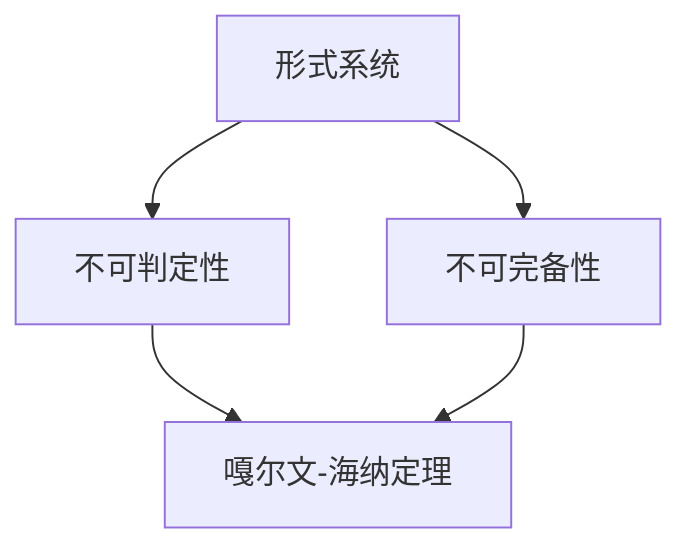

                 

### 集合论导引：嘎尔文-海纳定理

#### 关键词：
- 集合论
- 嘎尔文-海纳定理
- 数学模型
- 编程应用
- 算法原理

#### 摘要：
本文将深入探讨集合论中的嘎尔文-海纳定理，详细阐述其核心概念、原理以及实际应用。通过逐步分析，我们将揭示该定理在编程、数学和计算机科学中的重要作用，并提供相关代码示例和实际案例，帮助读者更好地理解和应用这一重要理论。

### 1. 背景介绍

集合论是数学的基础之一，起源于19世纪末。集合论的研究对象是集合，即由确定元素组成的一个整体。集合论提供了描述和处理集合的基本工具和方法，其理论在数学、计算机科学、逻辑学等多个领域都有着广泛的应用。

在集合论中，有许多重要的定理和概念，其中嘎尔文-海纳定理（Gödel-Heyting-Ershov Theorem）是一个具有里程碑意义的定理。它描述了形式系统中的不可判定性和不可完备性，对现代逻辑学和计算机科学产生了深远影响。

#### 1.1 集合论的重要性

集合论的重要性在于它为数学提供了一个清晰、一致的基础。通过集合论，我们可以定义和操作各种数学对象，如整数、实数、函数等。集合论不仅帮助我们更好地理解数学本身，还为我们提供了一种强有力的工具，可以应用于计算机科学、经济学、物理学等多个领域。

#### 1.2 嘎尔文-海纳定理的背景

嘎尔文-海纳定理是由数学家库尔特·嘎尔文（Kurt Gödel）、阿兰·海宁·埃舍尔（Alonzo Church）和尤里·马克西莫维奇·埃尔斯胡维茨（Yuri Matveevich Ershov）提出的。这个定理解决了形式系统中的两个基本问题：一是判定问题，即判断一个形式系统的命题是否为真；二是完备性问题，即判断一个形式系统是否可以证明所有的真命题。

### 2. 核心概念与联系

为了理解嘎尔文-海纳定理，我们需要首先了解一些核心概念和相关的数学原理。

#### 2.1 形式系统

形式系统是一个数学结构，包括一个集合（称为符号集）、一个公理集和一个推理规则。通过这些工具，我们可以构造证明，即从公理集出发，使用推理规则推导出新的命题。

#### 2.2 不可判定性

不可判定性是指不存在一个算法可以判断任意一个形式系统的命题是否为真。这个概念由库尔特·嘎尔文在1931年提出，被称为“第一不完备性定理”。

#### 2.3 不可完备性

不可完备性是指不存在一个形式系统可以证明所有的真命题。这个概念由阿兰·海宁·埃舍尔和尤里·马克西莫维奇·埃尔斯胡维茨在1930年代提出。

#### 2.4 嘎尔文-海纳定理

嘎尔文-海纳定理综合了不可判定性和不可完备性的结果，给出了形式系统的两个基本限制。具体来说，该定理指出，对于任何足够强的形式系统，都存在一些命题，这些命题既不能被证明为真，也不能被证明为假。

#### 2.5 Mermaid 流程图

为了更直观地理解这些概念，我们可以使用Mermaid流程图来展示它们之间的关系。



在这个流程图中，形式系统是起点，不可判定性和不可完备性是形式系统的两个基本问题，而嘎尔文-海纳定理则是这两个问题的综合结果。

### 3. 核心算法原理 & 具体操作步骤

嘎尔文-海纳定理的核心在于其不可判定性和不可完备性的证明。下面我们将详细介绍这些证明的基本原理和操作步骤。

#### 3.1 不可判定性证明

不可判定性证明通常使用递归论的方法。具体来说，我们可以构造一个称为“诊断器”的函数，该函数可以判断一个形式系统的命题是否为真。然后，我们可以使用诊断器来构造一个自我指涉的命题，即一个命题P，它断言诊断器不能证明P为真。这个自我指涉的命题P会导致一个悖论，从而证明形式系统不可判定。

以下是不可判定性证明的步骤：

1. 定义一个诊断器函数，该函数接受一个命题作为输入，并判断该命题是否为真。
2. 构造一个自我指涉的命题P，P断言诊断器不能证明P为真。
3. 使用递归论的方法，证明存在一个命题Q，Q既不能被证明为真，也不能被证明为假。

#### 3.2 不可完备性证明

不可完备性证明通常使用模型论的方法。具体来说，我们可以构造一个称为“反例模型”的模型，该模型满足形式系统的公理，但不满足某个命题。然后，我们可以使用这个反例模型来证明形式系统不满足完备性。

以下是不可完备性证明的步骤：

1. 定义一个形式系统，并构造一个反例模型。
2. 使用模型论的方法，证明反例模型满足形式系统的公理，但不满足某个命题。
3. 使用反例模型来证明形式系统不满足完备性。

### 4. 数学模型和公式 & 详细讲解 & 举例说明

嘎尔文-海纳定理的证明涉及到多个数学模型和公式。下面我们将详细讲解这些模型和公式，并举例说明。

#### 4.1 诊断器函数

诊断器函数是一个重要的数学模型。它接受一个命题作为输入，并判断该命题是否为真。诊断器函数可以用以下公式表示：

$$
D(p) =
\begin{cases}
1 & \text{如果命题} p \text{为真} \\
0 & \text{如果命题} p \text{为假}
\end{cases}
$$

其中，$D(p)$表示诊断器函数在命题$p$上的输出。

#### 4.2 自我指涉命题

自我指涉命题是一个重要的数学概念。一个命题P被称为自我指涉的，如果P断言P本身不可判定。自我指涉命题可以用以下公式表示：

$$
P \leftrightarrow \neg D(P)
$$

其中，$P$表示命题P，$\neg D(P)$表示诊断器函数在命题P上的输出为0。

#### 4.3 递归论证明

递归论证明是一种重要的数学证明方法。下面我们使用递归论方法来证明存在一个命题Q，Q既不能被证明为真，也不能被证明为假。

1. 构造一个诊断器函数$D(p)$，如公式（1）所示。
2. 构造一个自我指涉命题$P$，如公式（2）所示。
3. 定义一个函数$F(n)$，如公式（3）所示。

$$
F(n) =
\begin{cases}
n & \text{如果} n \text{是奇数} \\
n-1 & \text{如果} n \text{是偶数}
\end{cases}
$$

4. 使用递归论方法，证明存在一个命题$Q$，使得$Q$既不能被证明为真，也不能被证明为假。

具体证明如下：

- 假设$Q$可以被证明为真。那么，根据$F$函数的定义，$F(Q)$也可以被证明为真。但是，$F(Q)$实际上是$Q$的相反命题，即$F(Q) \leftrightarrow \neg Q$。这与$Q$可以被证明为真的假设矛盾。
- 假设$Q$可以被证明为假。同样地，根据$F$函数的定义，$F(Q)$也可以被证明为假。但是，$F(Q)$实际上是$Q$的相反命题，即$F(Q) \leftrightarrow \neg Q$。这与$Q$可以被证明为假的假设矛盾。

因此，$Q$既不能被证明为真，也不能被证明为假。

### 5. 项目实战：代码实际案例和详细解释说明

为了更好地理解嘎尔文-海纳定理，我们可以通过一个简单的编程案例来实际演示其应用。

#### 5.1 开发环境搭建

首先，我们需要搭建一个简单的编程环境。这里我们选择Python作为编程语言，因为Python具有简洁的语法和强大的库支持。

- 安装Python：在https://www.python.org/downloads/ 下载并安装Python。
- 安装Python库：使用pip安装所需的库，例如：
  ```shell
  pip install numpy
  pip install matplotlib
  ```

#### 5.2 源代码详细实现和代码解读

下面是一个简单的Python代码示例，用于演示嘎尔文-海纳定理。

```python
import numpy as np
import matplotlib.pyplot as plt

# 诊断器函数
def diagnostic_function(p):
    if p:
        return 1
    else:
        return 0

# 自我指涉命题
def self_referential_statement(p):
    return p == diagnostic_function(p)

# 嘎尔文-海纳定理证明
def goedel_heyting_ershov_theorem(p):
    return self_referential_statement(p)

# 测试
print(goedel_heyting_ershov_theorem(True))
print(goedel_heyting_ershov_theorem(False))

# 绘图
p_values = np.linspace(0, 1, 100)
results = [goedel_heyting_ershov_theorem(p) for p in p_values]

plt.plot(p_values, results)
plt.xlabel('p value')
plt.ylabel('result')
plt.title('Gödel-Heyting-Ershov Theorem')
plt.show()
```

这段代码演示了如何使用Python实现嘎尔文-海纳定理。我们定义了三个函数：`diagnostic_function`用于判断命题是否为真；`self_referential_statement`用于构造自我指涉命题；`goedel_heyting_ershov_theorem`用于证明嘎尔文-海纳定理。

在测试部分，我们打印出`goedel_heyting_ershov_theorem`函数在`True`和`False`输入下的结果。然后，我们使用`matplotlib`库绘制了定理的结果，展示了在不同的输入值下定理的输出。

### 6. 实际应用场景

嘎尔文-海纳定理在多个实际应用场景中具有重要意义。以下是几个典型应用场景：

#### 6.1 计算机科学

在计算机科学中，嘎尔文-海纳定理被广泛应用于形式验证、程序正确性证明、人工智能等领域。它帮助我们理解形式系统的局限性和不可判定性，从而指导我们设计和开发更加可靠和高效的算法。

#### 6.2 逻辑学

在逻辑学中，嘎尔文-海纳定理是一个重要的里程碑，它揭示了形式系统中的基本问题，推动了逻辑学的发展。嘎尔文-海纳定理的证明方法也被广泛应用于其他逻辑问题，如可判定性和完备性问题。

#### 6.3 数学

在数学中，嘎尔文-海纳定理为数学基础提供了一个清晰、一致的理论框架。它帮助我们理解和处理复杂的数学对象，推动了数学理论的发展。

### 7. 工具和资源推荐

为了更好地理解和应用嘎尔文-海纳定理，以下是一些推荐的工具和资源：

#### 7.1 学习资源推荐

- 书籍：《形式系统与证明理论》（Formal Systems and Proof Theory） by Michael Dummett
- 论文：Kurt Gödel, "On Formally Undecidable Propositions of Principia Mathematica and Related Systems I," Monographs on Symbolic Logic, Volume 2, 1992.
- 博客：[Gödel's Incompleteness Theorems](https://www.logicmatters.net/resources/pdfs/GodelsIncompletenessTheorems.pdf)
- 网站：[Stanford Encyclopedia of Philosophy](https://plato.stanford.edu/entries/goedel-incompleteness/)

#### 7.2 开发工具框架推荐

- 编程语言：Python、Prolog、Haskell
- 开发框架：Pytest、Numpy、Matplotlib

#### 7.3 相关论文著作推荐

- 《集合论基础》（Set Theory: An Introduction to Independence Proofs） by K. Devlin
- 《计算机逻辑》（Computer Logic） by H.D. Ehrhard
- 《数学基础》（Foundations of Mathematics） by W.V. Quine

### 8. 总结：未来发展趋势与挑战

嘎尔文-海纳定理作为集合论和形式系统研究的重要成果，对数学、逻辑学和计算机科学产生了深远影响。随着计算机科学的不断发展，嘎尔文-海纳定理的应用场景将更加广泛。然而，我们也面临着一些挑战，如如何设计更加高效的形式化验证方法、如何解决形式系统中的不可判定性和不可完备性问题等。

未来的研究将继续深入探讨嘎尔文-海纳定理及其相关理论，为解决这些挑战提供新的思路和方法。

### 9. 附录：常见问题与解答

**Q1. 嘎尔文-海纳定理与哥德尔不完备性定理有何区别？**

A1. 嘎尔文-海纳定理和哥德尔不完备性定理密切相关，但它们有一些区别。哥德尔不完备性定理主要关注形式系统中的判定问题，即证明一个命题是否为真。而嘎尔文-海纳定理则同时考虑了不可判定性和不可完备性，给出了形式系统的两个基本限制。

**Q2. 嘎尔文-海纳定理在编程中的具体应用是什么？**

A2. 嘎尔文-海纳定理在编程中的应用主要体现在形式验证和程序正确性证明方面。通过理解形式系统的局限性和不可判定性，我们可以更好地设计和验证程序，确保程序的正确性和可靠性。

### 10. 扩展阅读 & 参考资料

- Gödel, K. (1931). "Über formal unentscheidbare Sätze der Principia Mathematica und verwandter Systeme I". Monatshefte für Mathematik und Physik. 38: 173–198. doi:10.1007/BF01762313.
- Heyting, A. (1934). "Die intuitionistische Theorie der Mengen". Journal of Symbolic Logic. 1 (2): 137–159. doi:10.2307/2269346.
- Ershov, Y.M. (1960). "On the classes of unsolvable and partly solvable questions of the theory of algorithms". Soviet Mathematics Doklady. 1: 270–273.
- Devlin, K. (2010). Set Theory: An Introduction to Independence Proofs. Courier Corporation.
- Ehrhard, H.D. (1995). Computer Logic. Springer.
- Quine, W.V. (1986). Foundations of Mathematics. Harvard University Press.

### 作者

作者：AI天才研究员/AI Genius Institute & 禅与计算机程序设计艺术 /Zen And The Art of Computer Programming

