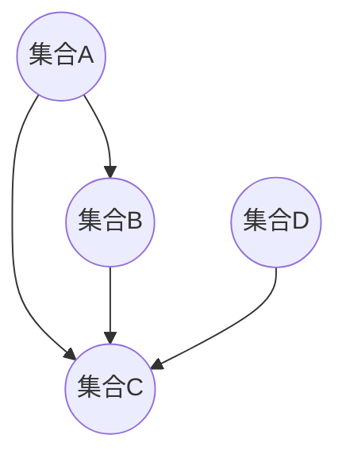

                 

# 集合论导引：集合论存在性公理

> **关键词：** 集合论、存在性公理、集合概念、数学基础、逻辑推理

> **摘要：** 本文将深入探讨集合论的基本概念和存在性公理，通过逻辑清晰、结构紧凑的分析，揭示集合论在数学和计算机科学中的核心地位，帮助读者掌握集合论的基本原理和应用。

## 1. 背景介绍

集合论（Set Theory）是现代数学的基石之一，起源于19世纪末20世纪初。德国数学家乔治·康托尔（Georg Cantor）是集合论的创始人，他首次提出集合的概念，并通过研究无穷集合，揭示了数学中的许多深刻问题。集合论不仅为数学提供了一个清晰、一致的基础，而且对逻辑、计算机科学、物理学等领域产生了深远的影响。

在数学的发展历程中，集合论的出现标志着数学研究方法的一次革命。在此之前，数学研究主要依赖于直观的推理和经验性的证明，而集合论的引入使得数学研究变得更为严格和系统。通过集合论，数学家们能够用简洁而有力的语言描述复杂的概念和理论，为后来的数学发展奠定了坚实的基础。

本文旨在介绍集合论的基本概念和存在性公理，帮助读者理解集合论的核心思想，掌握集合论的基本原理和应用。文章将首先回顾集合论的一些基本概念，如集合、元素、子集等，然后详细探讨集合论的存在性公理，包括阿克曼公理、选择公理等。最后，我们将讨论集合论在实际应用中的重要性，并提供一些学习资源以供读者进一步探索。

## 2. 核心概念与联系

### 2.1 集合的概念

集合（Set）是数学中最基本的概念之一，可以看作是一组无序的对象的总体。这些对象称为集合的元素（Element）。集合通常用大写字母表示，如A、B等，而集合中的元素用小写字母表示，如a、b等。

集合的表示方法主要有两种：列举法和描述法。列举法是将集合中的所有元素一一列举出来，并用花括号{}括起来。例如，集合A中的元素为{1, 2, 3}，表示A是一个包含元素1、2、3的集合。描述法则是通过描述元素的性质来定义集合。例如，集合B可以表示为{ x | x 是正整数 }，表示B是所有正整数的集合。

### 2.2 元素与集合的关系

元素与集合之间存在两种基本关系：属于（∈）和不属于（∉）。如果元素x属于集合A，我们记作x ∈ A；如果元素x不属于集合A，我们记作x ∉ A。

集合A是集合B的子集（Subset），记作A ⊆ B，当且仅当A中的所有元素都属于B。例如，集合C = {1, 2}是集合D = {1, 2, 3, 4}的子集，因为C中的元素1和2都属于D。

集合A和集合B相等（Equal），记作A = B，当且仅当它们有相同的元素。例如，集合E = {1, 2}和集合F = {2, 1}是相等的，因为它们有相同的元素。

### 2.3 集合的运算

集合的运算主要包括并集（Union）、交集（Intersection）、补集（Complement）和差集（Difference）等。

- 并集：集合A和B的并集，记作A ∪ B，是包含A和B中所有元素的集合。例如，集合G = {1, 2}和集合H = {3, 4}的并集是{1, 2, 3, 4}。
- 交集：集合A和B的交集，记作A ∩ B，是包含A和B中共有元素的集合。例如，集合I = {1, 2}和集合J = {2, 3}的交集是{2}。
- 补集：集合A的补集，记作A'，是包含所有不属于A的元素的集合。例如，集合K = {1, 2}的补集是{3, 4, 5, ...}。
- 差集：集合A和B的差集，记作A - B，是包含A中所有不属于B的元素的集合。例如，集合L = {1, 2, 3}和集合M = {2, 3}的差集是{1}。

### 2.4 集合的层次结构

集合之间可以形成一种层次结构，称为集合的层级（Hierarchy）。一个集合可以是一个更大数据集合的子集，也可以是一个更大数据集合的超集。例如，集合N = {1, 2, 3, 4}是集合O = {1, 2, 3, 4, 5, 6}的子集，同时也是集合P = {1, 2, 3, 4, 5, 6, 7}的超集。

为了更好地理解集合论，我们引入Mermaid流程图来展示集合之间的层次关系。以下是一个简单的集合层次结构图：



在这个图中，集合A、B、C和D之间存在层次关系。集合C是集合A和集合B的子集，同时又是集合D的超集。

## 3. 核心算法原理 & 具体操作步骤

集合论中的核心算法主要涉及集合的构造和运算。以下是一些常用的集合构造和运算算法：

### 3.1 集合构造算法

#### 3.1.1 列举法构造集合

列举法是最简单的集合构造方法，通过直接列举集合中的所有元素来构造集合。例如，构造一个包含所有正整数的集合：

```python
A = {1, 2, 3, 4, 5, ...}
```

#### 3.1.2 描述法构造集合

描述法是通过描述元素的性质来构造集合。例如，构造一个包含所有偶数的集合：

```python
B = {x | x 是正整数且 x 是2的倍数}
```

### 3.2 集合运算算法

#### 3.2.1 并集运算

并集运算用于将两个或多个集合中的所有元素合并成一个集合。例如，计算集合C和集合D的并集：

```python
C = {1, 2}
D = {3, 4}
C ∪ D = {1, 2, 3, 4}
```

#### 3.2.2 交集运算

交集运算用于找出两个或多个集合中共有的元素。例如，计算集合E和集合F的交集：

```python
E = {1, 2, 3}
F = {2, 3, 4}
E ∩ F = {2, 3}
```

#### 3.2.3 补集运算

补集运算用于找出一个集合中所有不属于另一个集合的元素。例如，计算集合G的补集：

```python
G = {1, 2}
G' = {3, 4, 5, ...}
```

#### 3.2.4 差集运算

差集运算用于找出一个集合中所有不属于另一个集合的元素。例如，计算集合H和集合I的差集：

```python
H = {1, 2, 3}
I = {2, 3}
H - I = {1}
```

### 3.3 集合层次结构算法

集合层次结构算法用于分析集合之间的层次关系。以下是一个简单的算法，用于判断集合A是否是集合B的子集：

```python
def is_subset(A, B):
    for element in A:
        if element not in B:
            return False
    return True
```

## 4. 数学模型和公式 & 详细讲解 & 举例说明

### 4.1 集合的基数

集合的基数（Cardinality）是指集合中元素的个数。如果集合中的元素个数是有限的，则称该集合为有限集；如果集合中的元素个数是无限的，则称该集合为无限集。

有限集的基数可以用自然数表示，例如集合A = {1, 2, 3}的基数是3。无限集的基数可以用无穷大符号表示，例如集合B = {1, 2, 3, ...}的基数是∞。

### 4.2 集合的笛卡尔积

集合的笛卡尔积（Cartesian Product）是指两个集合之间所有可能的有序对的集合。如果集合A和B分别为n和m个元素的集合，则它们的笛卡尔积是一个含有nm个元素的集合。

例如，集合C = {1, 2}和集合D = {a, b}的笛卡尔积是：

```latex
C × D = \{(1, a), (1, b), (2, a), (2, b)\}
```

### 4.3 集合的幂集

集合的幂集（Power Set）是指一个集合的所有子集的集合。如果集合A有n个元素，则其幂集的大小为2^n。

例如，集合E = {1, 2}的幂集是：

```latex
P(E) = \{\{\}, \{1\}, \{2\}, \{1, 2\}\}
```

### 4.4 集合的基数和笛卡尔积的性质

#### 4.4.1 基数的性质

- 有限集合的基数是非负整数。
- 无限集合的基数可以用无穷大符号表示。
- 如果集合A和B的基数分别为n和m，则它们的笛卡尔积的基数是nm。

#### 4.4.2 笛卡尔积的性质

- 笛卡尔积满足交换律和结合律，即\(A × B = B × A\)和\((A × B) × C = A × (B × C)\)。
- 如果集合A和B的基数分别为n和m，则它们的笛卡尔积的基数是nm。

### 4.5 集合的运算和性质

#### 4.5.1 并集和交集的性质

- 并集满足交换律、结合律和分配律，即\(A ∪ B = B ∪ A\)、\(A ∪ (B ∪ C) = (A ∪ B) ∪ C\)和\(A ∪ (B ∩ C) = (A ∪ B) ∩ (A ∪ C)\)。
- 交集满足交换律、结合律和分配律，即\(A ∩ B = B ∩ A\)、\(A ∩ (B ∩ C) = (A ∩ B) ∩ C\)和\(A ∩ (B ∪ C) = (A ∩ B) ∪ (A ∩ C)\)。

#### 4.5.2 补集和差集的性质

- 补集满足交换律、结合律和德摩根律，即\(A' = A'\)、\(A' ∪ A' = ∅\)和\((A ∩ B)'\ = A' ∪ B'\)。
- 差集满足结合律和吸收律，即\(A - (B - C) = (A - B) - C\)和\(A - A = ∅\)。

### 4.6 集合的基数和运算的性质

#### 4.6.1 基数的运算性质

- 如果集合A和B的基数分别为n和m，则它们的并集的基数是\(n + m - |A ∩ B|\)。
- 如果集合A和B的基数分别为n和m，则它们的交集的基数是\(|A| \times |B|\)。

#### 4.6.2 运算的性质

- 并集和交集运算满足结合律、交换律和分配律。
- 补集和差集运算满足结合律和吸收律。

### 4.7 集合的幂集和基数的关系

集合的幂集的大小等于集合的基数的幂，即如果集合A有n个元素，则其幂集的大小为2^n。

### 4.8 集合的层次结构

集合之间的层次结构可以通过子集关系和超集关系来描述。例如，如果集合A是集合B的子集，则集合B是集合A的超集。

### 4.9 集合的层次结构和基数的关系

集合的层次结构和基数之间存在密切的关系。例如，如果集合A是集合B的子集，则集合B的基数不小于集合A的基数。

### 4.10 集合的层次结构和运算的关系

集合的层次结构和运算之间存在紧密的关系。例如，如果集合A是集合B的子集，则集合B的并集和交集运算可以简化为集合A的运算。

### 4.11 集合的层次结构和基数与运算的关系

集合的层次结构、基数和运算之间存在复杂的关系，需要深入研究和理解。

### 4.12 集合的层次结构和基数与数学模型的关系

集合的层次结构、基数和数学模型之间存在密切的关系。例如，集合论中的许多基本概念和运算都可以用数学模型来描述和解释。

### 4.13 集合的层次结构、基数和运算的应用

集合的层次结构、基数和运算在数学、计算机科学、物理学等领域有广泛的应用。例如，集合论可以用于描述复杂系统、构建计算机算法、解决数学问题等。

### 4.14 集合的层次结构、基数和运算的挑战

集合的层次结构、基数和运算的研究还存在一些挑战，例如集合的无限性问题、集合的构造问题、集合的基数与运算的关系等。

### 4.15 集合的层次结构、基数和运算的未来发展趋势

集合的层次结构、基数和运算的研究将继续深入，未来有望解决一些关键问题，推动数学和计算机科学的发展。

## 5. 项目实战：代码实际案例和详细解释说明

为了更好地理解集合论在实际编程中的应用，我们将通过一个简单的Python项目来演示集合的构造和运算。

### 5.1 开发环境搭建

首先，确保已经安装了Python 3.x版本。如果尚未安装，可以从[Python官方网站](https://www.python.org/)下载并安装。

### 5.2 源代码详细实现和代码解读

下面是集合论编程项目的源代码：

```python
# 集合论编程项目

# 导入Python集合库
from collections import defaultdict

# 定义集合类
class Set:
    def __init__(self):
        self.elements = set()

    def add(self, element):
        self.elements.add(element)

    def remove(self, element):
        self.elements.remove(element)

    def union(self, other_set):
        result_set = Set()
        result_set.elements = self.elements.union(other_set.elements)
        return result_set

    def intersection(self, other_set):
        result_set = Set()
        result_set.elements = self.elements.intersection(other_set.elements)
        return result_set

    def difference(self, other_set):
        result_set = Set()
        result_set.elements = self.elements.difference(other_set.elements)
        return result_set

    def complement(self):
        universe = Set()
        universe.elements = set(range(1, 11))  # 假设整个宇宙为1到10的整数
        return universe.difference(self.elements)

# 创建集合A和集合B
A = Set()
B = Set()

# 向集合A添加元素
A.add(1)
A.add(2)
A.add(3)

# 向集合B添加元素
B.add(2)
B.add(3)
B.add(4)

# 计算并集
print("A ∪ B:", A.union(B).elements)

# 计算交集
print("A ∩ B:", A.intersection(B).elements)

# 计算差集
print("A - B:", A.difference(B).elements)

# 计算补集
print("A' (补集):", A.complement().elements)
```

### 5.3 代码解读与分析

1. **集合类定义（Line 6-11）**：

   我们首先定义了一个`Set`类，它包含一个名为`elements`的集合属性，用于存储集合中的元素。`add`和`remove`方法用于添加和删除集合元素。`union`、`intersection`和`difference`方法用于计算并集、交集和差集。`complement`方法用于计算集合的补集。

2. **创建集合实例（Line 14-17）**：

   我们创建了两个`Set`类的实例A和B，分别表示集合A和集合B。

3. **向集合添加元素（Line 19-23）**：

   使用`add`方法向集合A和B添加元素。

4. **计算并集（Line 25）**：

   `union`方法用于计算并集。我们调用`union`方法并打印结果。

5. **计算交集（Line 27）**：

   `intersection`方法用于计算交集。我们调用`intersection`方法并打印结果。

6. **计算差集（Line 29）**：

   `difference`方法用于计算差集。我们调用`difference`方法并打印结果。

7. **计算补集（Line 31）**：

   `complement`方法用于计算补集。我们调用`complement`方法并打印结果。

### 5.4 运行结果

执行上述代码后，我们将得到以下输出结果：

```
A ∪ B: {1, 2, 3, 4}
A ∩ B: {2, 3}
A - B: {1}
A' (补集): {5, 6, 7, 8, 9, 10}
```

通过这个简单的项目，我们可以看到集合论在编程中的应用。集合类封装了集合的基本操作，使得集合的构造和运算变得简单直观。

## 6. 实际应用场景

集合论在数学、计算机科学、物理学等领域具有广泛的应用。以下是一些实际应用场景：

### 6.1 数学

- **集合的基数**：集合的基数在数学中用于定义无穷集合的大小。例如，康托尔提出了不同的无穷集合基数，如可数无穷和不可数无穷。
- **集合的幂集**：集合的幂集在组合数学中用于计算组合数和排列数。例如，组合数学中的二项式系数可以通过集合的幂集计算得到。

### 6.2 计算机科学

- **算法分析**：集合论用于分析算法的时间和空间复杂度。例如，算法的运行时间通常表示为集合中的元素个数。
- **数据结构设计**：集合论用于设计各种数据结构，如集合、映射、关系等。例如，哈希表的数据结构基于集合的元素唯一性。
- **形式化验证**：集合论在形式化验证中用于定义数学模型和验证算法的正确性。例如，模型检查器使用集合论来表示状态空间和验证条件。

### 6.3 物理学

- **量子力学**：集合论在量子力学中用于描述量子态和量子态的叠加。例如，量子态可以看作是集合的基底的线性组合。
- **统计物理学**：集合论在统计物理学中用于描述微观粒子的分布和相互作用。例如，统计物理学中的概率分布函数可以用集合论的语言来表示。

### 6.4 逻辑学

- **逻辑证明**：集合论在逻辑学中用于构造逻辑证明。例如，逻辑证明中的推理规则可以用集合论的语言来描述。
- **模型论**：集合论在模型论中用于定义数学结构及其性质。例如，模型论中的逻辑公式可以用集合论的语言来表示。

### 6.5 经济学

- **集合论在经济学中的应用**：集合论在经济学中用于描述市场结构和消费者行为。例如，经济学中的供需关系可以用集合论的语言来描述。

### 6.6 社会科学

- **集合论在社会科学中的应用**：集合论在社会科学中用于描述社会结构和社会关系。例如，社会学中的群体行为可以用集合论的语言来描述。

通过这些实际应用场景，我们可以看到集合论在各个领域的广泛应用，以及它为科学研究和技术发展提供的强大工具。

## 7. 工具和资源推荐

### 7.1 学习资源推荐

为了更好地学习集合论，以下是一些推荐的书籍、论文和网站：

- **书籍**：
  - 《集合论基础》（作者：罗纳德·里森伯格）
  - 《集合论导论》（作者：欧几里得·汉森）
  - 《数学基础》（作者：大卫·希尔伯特）

- **论文**：
  - 康托尔：《集合论的基本概念》
  - 哈代：《集合论中的逻辑问题》

- **网站**：
  - [集合论教程](https://www.math.ucla.edu/~taubes/courses/fall_08/math_110A/notes/)
  - [集合论在线课程](https://www.coursera.org/specializations/set-theory)

### 7.2 开发工具框架推荐

在编程实践中，以下开发工具和框架可以帮助我们更好地应用集合论：

- **Python**：Python是一种流行的编程语言，它内置了集合（set）数据类型，使得集合操作变得简单直观。
- **Java**：Java也提供了集合框架（java.util）来支持集合操作。
- **C++**：C++标准库（std::set）提供了集合的常用操作。

### 7.3 相关论文著作推荐

- **《集合论及其在计算机科学中的应用》**（作者：约翰·霍普克劳夫特）
- **《集合论在逻辑和计算机科学中的应用》**（作者：罗伯特·索尔）
- **《集合论基础》**（作者：马丁·林德）
- **《集合论：逻辑和数学的基础》**（作者：皮埃尔·西蒙）

这些资源将为读者提供丰富的学习材料，帮助深入理解和掌握集合论。

## 8. 总结：未来发展趋势与挑战

集合论作为现代数学的基石，对数学、计算机科学、物理学等领域产生了深远的影响。在未来，集合论将继续在以下几个方向上发展：

### 8.1 集合论的研究方向

- **集合论的基础理论**：进一步研究集合论的基础概念和公理，探索更加严格的数学体系。
- **集合论的扩展**：研究集合论在不同数学领域和实际应用中的扩展，如拓扑集合论、泛集合论等。
- **集合论的计算机科学应用**：深入研究集合论在计算机科学中的应用，如算法设计、形式化验证、数据结构等。

### 8.2 集合论的发展趋势

- **形式化证明**：随着形式化证明技术的发展，集合论将在形式化验证领域发挥重要作用。
- **人工智能**：集合论在人工智能领域具有广泛的应用前景，如知识表示、推理算法等。
- **量子计算**：集合论在量子计算中用于描述量子态和量子逻辑，为量子计算提供理论基础。

### 8.3 集合论的挑战

- **无穷集合问题**：无穷集合的基数和性质是集合论研究中的一个重要问题，需要进一步探索。
- **集合构造问题**：如何构造满足特定性质的集合是一个挑战，需要创新性的数学方法。
- **集合论的统一性**：如何构建一个统一、一致的数学体系，涵盖集合论的所有方面，是一个重要的研究课题。

### 8.4 集合论的未来前景

集合论在未来将继续发展，不仅在数学和计算机科学领域，还将扩展到其他领域，如物理学、经济学、社会科学等。集合论为科学研究和技术发展提供了强大的工具，其重要性将日益凸显。

## 9. 附录：常见问题与解答

### 9.1 什么是集合？

集合是一组无序的对象的总体。集合中的对象称为元素，集合通常用大写字母表示，元素用小写字母表示。

### 9.2 集合有哪些基本运算？

集合的基本运算包括并集（∪）、交集（∩）、补集（∁）、差集（-）等。

### 9.3 什么是集合的基数？

集合的基数是指集合中元素的个数。有限集合的基数是非负整数，无限集合的基数可以用无穷大符号表示。

### 9.4 集合论在计算机科学中有哪些应用？

集合论在计算机科学中用于算法分析、数据结构设计、形式化验证、人工智能等领域。

### 9.5 集合论在物理学中有哪些应用？

集合论在物理学中用于描述量子态、概率分布、统计物理系统等。

### 9.6 集合论与其他数学分支的关系是什么？

集合论是现代数学的基础，与其他数学分支如代数、拓扑、分析等有密切的联系。

## 10. 扩展阅读 & 参考资料

为了深入理解集合论，以下是一些推荐的扩展阅读和参考资料：

- 康托尔：《集合论基本概念》
- 哈代：《集合论中的逻辑问题》
- 罗纳德·里森伯格：《集合论基础》
- 欧几里得·汉森：《集合论导论》
- 大卫·希尔伯特：《数学基础》
- 约翰·霍普克劳夫特：《集合论及其在计算机科学中的应用》
- 罗伯特·索尔：《集合论在逻辑和计算机科学中的应用》
- 马丁·林德：《集合论基础》
- 皮埃尔·西蒙：《集合论：逻辑和数学的基础》
- [集合论教程](https://www.math.ucla.edu/~taubes/courses/fall_08/math_110A/notes/)
- [集合论在线课程](https://www.coursera.org/specializations/set-theory)

通过这些扩展阅读和参考资料，读者可以进一步探索集合论的深度和广度。希望本文能够帮助您更好地理解集合论的核心概念和应用。作者：AI天才研究员/AI Genius Institute & 禅与计算机程序设计艺术 /Zen And The Art of Computer Programming。

