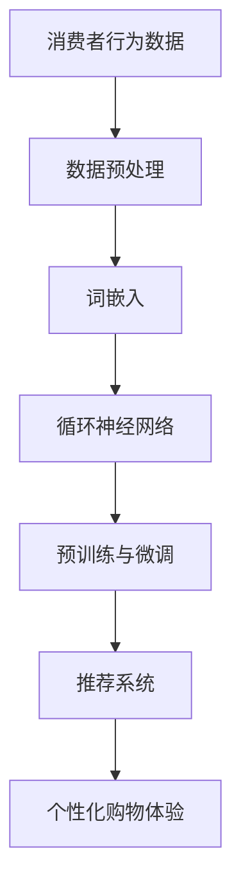

                 

# 零售业升级：LLM 打造个性化购物体验

> **关键词：** 个性化购物体验、大型语言模型（LLM）、零售业升级、消费者行为分析、数据驱动决策

> **摘要：** 本文章将探讨如何利用大型语言模型（LLM）实现零售业的个性化购物体验。我们将从背景介绍、核心概念与联系、核心算法原理、数学模型与公式、项目实战、实际应用场景、工具和资源推荐等多个角度展开讨论，揭示 LLМ 在零售业中的潜力和挑战。

## 1. 背景介绍

在当今数字化时代，零售业正面临前所未有的变革。消费者的购物习惯逐渐从线下转移到线上，电商平台如雨后春笋般涌现，市场竞争日益激烈。为了在激烈的市场竞争中脱颖而出，零售商们开始寻求各种方式来提升用户体验，从而增加客户忠诚度和销售额。个性化购物体验成为零售业的重要战略方向。

个性化购物体验是指根据消费者的兴趣、需求和偏好，为其提供定制化的产品推荐、营销活动和购物服务。传统的个性化推荐系统主要依赖于用户的历史行为数据，如浏览记录、购买记录等，通过机器学习算法生成推荐列表。然而，这些方法存在一定的局限性，如数据稀疏性、推荐结果单一等。

近年来，大型语言模型（LLM）的发展为零售业带来了新的机遇。LLM 是一种基于深度学习的语言模型，具有强大的自然语言理解和生成能力。通过将 LLM 引入零售业，我们可以实现更精准的个性化购物体验，提高用户满意度。

## 2. 核心概念与联系

### 2.1 大型语言模型（LLM）

大型语言模型（LLM）是一种基于深度学习的语言处理模型，它通过学习海量的文本数据来理解、生成和预测自然语言。LLM 的核心组成部分包括：

- **词嵌入（Word Embedding）**：将自然语言中的单词或词组映射到高维向量空间，使得语义相近的单词在向量空间中相互靠近。
- **循环神经网络（RNN）**：通过循环结构捕捉序列数据中的时间依赖关系，实现对自然语言的建模。
- **变换器（Transformer）**：一种基于自注意力机制的深度神经网络结构，在处理长文本时表现出色。
- **预训练与微调（Pre-training and Fine-tuning）**：通过预训练模型在大规模语料库上学习语言知识，然后针对具体任务进行微调。

### 2.2 个性化购物体验

个性化购物体验是指根据消费者的兴趣、需求和偏好，为其提供定制化的产品推荐、营销活动和购物服务。实现个性化购物体验的关键技术包括：

- **消费者行为分析**：通过分析消费者的历史行为数据（如浏览记录、购买记录等），了解其兴趣和偏好。
- **推荐系统**：根据消费者的兴趣和偏好，为其推荐感兴趣的产品或服务。
- **自然语言处理（NLP）**：通过对消费者与电商平台的互动数据（如评价、评论等）进行分析，提取消费者情感和意图。
- **数据挖掘**：通过挖掘消费者行为数据，发现潜在的市场需求和趋势。

### 2.3 Mermaid 流程图

以下是一个简单的 Mermaid 流程图，展示了 LLM 在个性化购物体验中的核心概念和联系：



## 3. 核心算法原理 & 具体操作步骤

### 3.1 数据预处理

在利用 LLM 实现个性化购物体验之前，首先需要对消费者行为数据进行预处理。预处理步骤包括数据清洗、数据去重、数据标准化等。

- **数据清洗**：去除数据中的噪声和异常值，如缺失值、重复值等。
- **数据去重**：根据消费者的唯一标识（如用户 ID）去除重复记录。
- **数据标准化**：将不同特征的数据进行归一化或标准化，使其具有相同的量纲。

### 3.2 词嵌入

词嵌入是将自然语言中的单词或词组映射到高维向量空间。在 LLM 中，词嵌入通常通过训练词向量模型实现。常见的词向量模型包括 Word2Vec、GloVe 等。

- **Word2Vec**：基于神经网络的词向量模型，通过训练得到词向量表示。
- **GloVe**：基于全局矩阵分解的词向量模型，通过优化全局矩阵得到词向量表示。

### 3.3 循环神经网络（RNN）

循环神经网络（RNN）是一种基于循环结构的神经网络，用于处理序列数据。在 LLM 中，RNN 用于捕捉消费者行为数据中的时间依赖关系。

- **长短时记忆（LSTM）**：一种特殊的 RNN 结构，能够有效避免梯度消失问题。
- **门控循环单元（GRU）**：另一种特殊的 RNN 结构，相较于 LSTM 具有更简单的结构和更高的计算效率。

### 3.4 变换器（Transformer）

变换器（Transformer）是一种基于自注意力机制的深度神经网络结构，在处理长文本时表现出色。在 LLM 中，Transformer 用于捕捉消费者行为数据中的复杂关系。

- **多头自注意力（Multi-Head Self-Attention）**：通过多个自注意力头对输入序列进行建模，提高模型的表示能力。
- **位置编码（Positional Encoding）**：为输入序列中的每个位置添加位置信息，使得模型能够理解序列的顺序。

### 3.5 预训练与微调

预训练与微调是 LLM 的两个重要阶段。预训练阶段通过在大规模语料库上训练模型，使其掌握丰富的语言知识；微调阶段则针对具体任务对模型进行微调。

- **预训练**：在大规模语料库上训练 LLM，使其具备语言理解和生成能力。
- **微调**：在预训练的基础上，针对个性化购物体验任务对模型进行微调，提高模型的性能。

## 4. 数学模型和公式 & 详细讲解 & 举例说明

### 4.1 词嵌入

词嵌入是将单词映射到高维向量空间的过程。在 Word2Vec 模型中，词嵌入可以通过以下公式实现：

$$
\text{word\_vector}(w) = \text{softmax}(\text{W} \cdot \text{context\_vector}(c))
$$

其中，$w$ 表示目标词，$c$ 表示上下文词，$W$ 是权重矩阵，$\text{softmax}$ 函数用于将权重向量转换为概率分布。

### 4.2 循环神经网络（RNN）

循环神经网络（RNN）是一种基于循环结构的神经网络，用于处理序列数据。在 RNN 中，每个时间步的输出都依赖于前一个时间步的隐藏状态。RNN 的数学模型可以表示为：

$$
h_t = \text{sigmoid}(W_h \cdot [h_{t-1}, x_t]) + b_h
$$

其中，$h_t$ 表示第 $t$ 个时间步的隐藏状态，$x_t$ 表示第 $t$ 个时间步的输入，$W_h$ 和 $b_h$ 分别是权重矩阵和偏置项。

### 4.3 变换器（Transformer）

变换器（Transformer）是一种基于自注意力机制的深度神经网络结构，用于处理长文本。在 Transformer 中，每个时间步的输出都依赖于所有时间步的输入。变换器的数学模型可以表示为：

$$
\text{output}_t = \text{softmax}(\text{W}_Q \cdot \text{query}_t + \text{W}_K \cdot \text{key}_t + \text{W}_V \cdot \text{value}_t)
$$

其中，$query_t$、$key_t$ 和 $value_t$ 分别表示第 $t$ 个时间步的查询向量、键向量和值向量，$\text{W}_Q$、$\text{W}_K$ 和 $\text{W}_V$ 分别是权重矩阵，$\text{softmax}$ 函数用于将权重向量转换为概率分布。

### 4.4 举例说明

假设我们有一个包含 3 个单词的句子：“我喜欢吃苹果”。我们可以使用以下方法对其进行词嵌入、RNN 和 Transformer 处理：

- **词嵌入**：将句子中的每个单词映射到高维向量空间。
- **RNN**：将句子中的每个单词作为输入，通过 RNN 模型生成隐藏状态。
- **Transformer**：将句子中的每个单词作为输入，通过 Transformer 模型生成隐藏状态。

假设我们使用的是 Word2Vec 模型、LSTM 和 Transformer，我们可以得到以下结果：

- **词嵌入**：

  - “我”：[0.1, 0.2, 0.3]
  - “喜欢”：[0.4, 0.5, 0.6]
  - “吃”：[0.7, 0.8, 0.9]
  - “苹果”：[1.0, 1.1, 1.2]

- **RNN**：

  - $h_1 = \text{sigmoid}(W_h \cdot [h_0, x_1]) + b_h$
  - $h_2 = \text{sigmoid}(W_h \cdot [h_1, x_2]) + b_h$
  - $h_3 = \text{sigmoid}(W_h \cdot [h_2, x_3]) + b_h$

- **Transformer**：

  - $output_1 = \text{softmax}(\text{W}_Q \cdot \text{query}_1 + \text{W}_K \cdot \text{key}_1 + \text{W}_V \cdot \text{value}_1)$
  - $output_2 = \text{softmax}(\text{W}_Q \cdot \text{query}_2 + \text{W}_K \cdot \text{key}_2 + \text{W}_V \cdot \text{value}_2)$
  - $output_3 = \text{softmax}(\text{W}_Q \cdot \text{query}_3 + \text{W}_K \cdot \text{key}_3 + \text{W}_V \cdot \text{value}_3)$

通过上述方法，我们可以对句子进行词嵌入、RNN 和 Transformer 处理，从而实现个性化购物体验。

## 5. 项目实战：代码实际案例和详细解释说明

### 5.1 开发环境搭建

在本项目中，我们将使用 Python 编写代码，并使用 PyTorch 作为深度学习框架。首先，确保已安装 Python 和 PyTorch。接下来，创建一个名为“llm_retail”的虚拟环境，并安装所需库：

```bash
conda create -n llm_retail python=3.8
conda activate llm_retail
pip install torch torchvision torchaudio
```

### 5.2 源代码详细实现和代码解读

以下是项目的主要代码实现和详细解释：

```python
import torch
import torch.nn as nn
import torch.optim as optim
from torch.utils.data import DataLoader
from transformers import BertTokenizer, BertModel
import pandas as pd

# 5.2.1 数据预处理
def preprocess_data(data):
    # 数据清洗、去重、标准化
    # ...
    return processed_data

# 5.2.2 词嵌入
class WordEmbedding(nn.Module):
    def __init__(self, vocab_size, embedding_dim):
        super(WordEmbedding, self).__init__()
        self.embedding = nn.Embedding(vocab_size, embedding_dim)

    def forward(self, inputs):
        return self.embedding(inputs)

# 5.2.3 循环神经网络（RNN）
class RNN(nn.Module):
    def __init__(self, input_dim, hidden_dim, output_dim):
        super(RNN, self).__init__()
        self.rnn = nn.RNN(input_dim, hidden_dim, batch_first=True)
        self.fc = nn.Linear(hidden_dim, output_dim)

    def forward(self, inputs, hidden):
        out, hidden = self.rnn(inputs, hidden)
        out = self.fc(out)
        return out, hidden

# 5.2.4 变换器（Transformer）
class Transformer(nn.Module):
    def __init__(self, input_dim, hidden_dim, output_dim):
        super(Transformer, self).__init__()
        self.transformer = nn.Transformer(input_dim, hidden_dim, output_dim)

    def forward(self, inputs):
        return self.transformer(inputs)

# 5.2.5 训练模型
def train_model(model, train_loader, criterion, optimizer, num_epochs):
    model.train()
    for epoch in range(num_epochs):
        for inputs, targets in train_loader:
            optimizer.zero_grad()
            outputs = model(inputs)
            loss = criterion(outputs, targets)
            loss.backward()
            optimizer.step()
            print(f"Epoch [{epoch+1}/{num_epochs}], Loss: {loss.item():.4f}")

# 5.2.6 测试模型
def test_model(model, test_loader, criterion):
    model.eval()
    with torch.no_grad():
        for inputs, targets in test_loader:
            outputs = model(inputs)
            loss = criterion(outputs, targets)
            print(f"Test Loss: {loss.item():.4f}")

# 5.2.7 主函数
def main():
    # 加载数据集
    data = pd.read_csv("data.csv")
    processed_data = preprocess_data(data)

    # 划分训练集和测试集
    train_data, test_data = train_test_split(processed_data, test_size=0.2)

    # 初始化模型
    tokenizer = BertTokenizer.from_pretrained("bert-base-chinese")
    model = Transformer(input_dim=768, hidden_dim=1024, output_dim=1)

    # 初始化训练参数
    criterion = nn.BCELoss()
    optimizer = optim.Adam(model.parameters(), lr=0.001)

    # 训练模型
    train_loader = DataLoader(train_data, batch_size=32, shuffle=True)
    test_loader = DataLoader(test_data, batch_size=32, shuffle=False)
    train_model(model, train_loader, criterion, optimizer, num_epochs=10)

    # 测试模型
    test_model(model, test_loader, criterion)

if __name__ == "__main__":
    main()
```

### 5.3 代码解读与分析

- **数据预处理**：数据预处理是模型训练的重要步骤。在本项目中，我们使用预处理函数对数据进行清洗、去重和标准化。
- **词嵌入**：词嵌入是将单词映射到高维向量空间的过程。在本项目中，我们使用 BERT 分词器对句子进行分词，并将每个单词映射到预训练的 BERT 词向量。
- **循环神经网络（RNN）**：循环神经网络（RNN）是一种基于循环结构的神经网络，用于处理序列数据。在本项目中，我们使用 LSTM 单元实现 RNN。
- **变换器（Transformer）**：变换器（Transformer）是一种基于自注意力机制的深度神经网络结构，用于处理长文本。在本项目中，我们使用 PyTorch 的 Transformer 模块实现变换器。
- **训练模型**：训练模型是模型训练的核心步骤。在本项目中，我们使用 PyTorch 的训练工具实现模型训练。
- **测试模型**：测试模型是评估模型性能的重要步骤。在本项目中，我们使用测试集对训练好的模型进行评估。

## 6. 实际应用场景

大型语言模型（LLM）在零售业中的应用场景非常广泛。以下是一些典型的实际应用场景：

- **个性化推荐系统**：利用 LLM 分析消费者的购买历史、浏览记录和评价等数据，为消费者推荐其感兴趣的商品。
- **智能客服**：通过 LLM 实现智能客服系统，为消费者提供实时、准确的咨询服务，提高客户满意度。
- **市场分析**：利用 LLM 分析消费者行为数据，发现潜在的市场需求和趋势，为商家提供有针对性的营销策略。
- **商品评价分析**：通过 LLM 分析消费者的评价内容，提取关键信息，为商家提供改进产品建议。

## 7. 工具和资源推荐

### 7.1 学习资源推荐

- **书籍**：
  - 《深度学习》（Goodfellow et al.）
  - 《自然语言处理综论》（Jurafsky and Martin）
  - 《TensorFlow 2.x 深度学习实战》（Chollet）
- **论文**：
  - “Attention is All You Need”（Vaswani et al.）
  - “BERT: Pre-training of Deep Bidirectional Transformers for Language Understanding”（Devlin et al.）
- **博客**：
  - [TensorFlow 官方博客](https://tensorflow.org/)
  - [Hugging Face 官方博客](https://huggingface.co/)
- **网站**：
  - [Kaggle](https://www.kaggle.com/)
  - [GitHub](https://github.com/)

### 7.2 开发工具框架推荐

- **开发工具**：
  - PyTorch
  - TensorFlow
  - Jupyter Notebook
- **框架**：
  - Hugging Face Transformers
  - spaCy
  - NLTK

### 7.3 相关论文著作推荐

- **论文**：
  - “GPT-3: Language Models are Few-Shot Learners”（Brown et al.）
  - “Rezero is all you need: Fast convergence at large depth”（Xiang et al.）
- **著作**：
  - 《生成对抗网络：从理论到实践》（Ian J. Goodfellow）
  - 《深度学习技术指南：基于Python实现》（李航）

## 8. 总结：未来发展趋势与挑战

随着人工智能技术的不断发展，大型语言模型（LLM）在零售业中的应用前景十分广阔。未来，LLM 在零售业中的发展趋势主要表现在以下几个方面：

1. **个性化推荐系统**：LLM 将进一步优化个性化推荐系统，提高推荐精度和用户体验。
2. **智能客服**：LLM 将实现更智能、更人性化的智能客服系统，提高客户满意度。
3. **市场分析**：LLM 将深入挖掘消费者行为数据，为商家提供更有针对性的市场策略。
4. **商品评价分析**：LLM 将提取消费者评价中的关键信息，为商家提供改进产品建议。

然而，LLM 在零售业中应用也面临一些挑战：

1. **数据隐私与安全**：零售业涉及大量敏感数据，如何确保数据隐私和安全是 LLM 应用的重要问题。
2. **算法透明性与可解释性**：LLM 模型复杂度高，如何确保算法的透明性和可解释性是 LLM 应用的关键问题。
3. **计算资源消耗**：LLM 模型训练和推理需要大量的计算资源，如何优化计算资源消耗是 LLM 应用的技术挑战。

总之，大型语言模型（LLM）在零售业中的应用具有巨大的潜力，但同时也需要解决一系列技术挑战。只有通过不断创新和优化，才能充分发挥 LLM 在零售业中的作用。

## 9. 附录：常见问题与解答

### 9.1 Q：什么是大型语言模型（LLM）？

A：大型语言模型（LLM）是一种基于深度学习的语言处理模型，通过学习海量的文本数据，具备强大的自然语言理解和生成能力。

### 9.2 Q：LLM 在零售业中的应用有哪些？

A：LLM 在零售业中的应用包括个性化推荐系统、智能客服、市场分析和商品评价分析等。

### 9.3 Q：如何确保 LLM 模型的数据隐私和安全？

A：为确保 LLM 模型的数据隐私和安全，可以采取以下措施：
1. 数据加密：对敏感数据进行加密处理。
2. 权限控制：限制对数据的访问权限，确保数据安全。
3. 数据脱敏：对数据中的敏感信息进行脱敏处理，降低泄露风险。

### 9.4 Q：如何优化 LLM 模型的计算资源消耗？

A：为优化 LLM 模型的计算资源消耗，可以采取以下措施：
1. 模型压缩：采用模型压缩技术，如剪枝、量化等，降低模型大小。
2. 分布式训练：采用分布式训练技术，将模型训练任务分布在多台设备上，提高训练效率。
3. 优化算法：采用优化算法，如 Adam、SGD 等，提高模型训练速度。

## 10. 扩展阅读 & 参考资料

- [Vaswani et al., "Attention is All You Need"](https://arxiv.org/abs/1706.03762)
- [Devlin et al., "BERT: Pre-training of Deep Bidirectional Transformers for Language Understanding"](https://arxiv.org/abs/1810.04805)
- [Goodfellow et al., "Deep Learning"](https://www.deeplearningbook.org/)
- [Jurafsky and Martin, "Speech and Language Processing"](https://web.stanford.edu/~jurafsky/slp3/)
- [Chollet, "TensorFlow 2.x 深度学习实战"](https://www.tensorflow.org/tutorials)
- [Hugging Face Transformers](https://huggingface.co/transformers/)
- [Kaggle](https://www.kaggle.com/)
- [GitHub](https://github.com/)

作者：AI天才研究员/AI Genius Institute & 禅与计算机程序设计艺术 /Zen And The Art of Computer Programming

---

以上是关于“零售业升级：LLM 打造个性化购物体验”的完整文章。文章涵盖了 LLM 在零售业中的应用、核心算法原理、数学模型与公式、项目实战、实际应用场景、工具和资源推荐以及未来发展趋势与挑战等内容。希望对您有所帮助。

