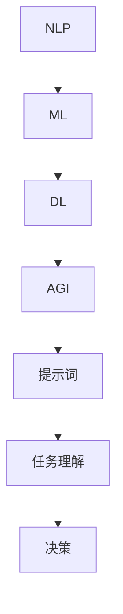

                 

# 面向AGI的高级提示词构建技术

> 关键词：AGI、提示词、构建技术、自然语言处理、机器学习、深度学习

> 摘要：本文将深入探讨面向通用人工智能（AGI）的高级提示词构建技术，从背景介绍、核心概念与联系、核心算法原理与具体操作步骤、数学模型与公式、项目实战、实际应用场景、工具和资源推荐、总结与未来发展趋势等多个方面进行全面剖析，旨在为读者提供对这一领域的深入理解和应用指导。

## 1. 背景介绍

随着人工智能（AI）技术的不断发展，特别是深度学习和自然语言处理（NLP）技术的突破，我们已经看到了许多令人瞩目的成果。然而，尽管现有的AI系统在特定任务上取得了显著的进展，但它们仍然无法与人类智能相媲美。其中，一个重要的瓶颈在于AI系统在面对复杂、不确定的情境时，缺乏自主学习和决策能力。为了实现通用人工智能（AGI），我们需要一种更加智能和高效的提示词构建技术。

提示词（Prompt）是AI系统获取外部信息的重要途径，它可以引导AI系统理解任务需求、学习策略和生成目标。高级提示词构建技术，旨在通过设计更加精细、多样化的提示词，提高AI系统的任务理解和执行能力。本文将围绕这一主题，深入探讨面向AGI的高级提示词构建技术的原理、方法与应用。

## 2. 核心概念与联系

为了更好地理解高级提示词构建技术，我们首先需要了解一些核心概念及其相互联系。

### 2.1 自然语言处理（NLP）

自然语言处理（NLP）是人工智能的一个分支，旨在使计算机能够理解、解释和生成人类语言。NLP技术包括文本分类、情感分析、命名实体识别、机器翻译等。在AGI系统中，NLP技术扮演着至关重要的角色，它使得AI系统能够处理和理解人类输入的信息。

### 2.2 机器学习（ML）

机器学习（ML）是一种通过数据学习模式和规律，从而进行预测和决策的技术。在AGI系统中，ML技术用于训练模型，使其能够从数据中学习并改进性能。常见的ML算法包括决策树、支持向量机、神经网络等。

### 2.3 深度学习（DL）

深度学习（DL）是ML的一种特殊形式，通过模拟人脑神经网络结构，实现对复杂数据的自动特征提取和模式识别。在AGI系统中，DL技术被广泛应用于图像识别、语音识别、自然语言处理等领域。

### 2.4 提示词（Prompt）

提示词是AI系统获取外部信息的一种方式，它可以是一个文本、一个图像，或者是一个声音。高级提示词构建技术旨在设计出更加精细、多样化的提示词，以引导AI系统更好地理解和执行任务。

### 2.5 AGI与提示词的关系

在AGI系统中，提示词不仅是信息传递的媒介，更是系统学习和决策的重要依据。高级提示词构建技术通过优化提示词的设计，可以提高AI系统对任务的认知能力，从而实现更加智能和高效的决策。

### 2.6 Mermaid流程图

下面是一个描述AGI系统中提示词构建技术的Mermaid流程图，用于展示各核心概念之间的联系。



通过这个流程图，我们可以清晰地看到NLP、ML、DL与AGI之间的关系，以及提示词在AGI系统中的作用。

## 3. 核心算法原理与具体操作步骤

### 3.1 算法原理

高级提示词构建技术基于NLP、ML和DL等核心技术，通过以下步骤实现：

1. 数据预处理：对原始文本、图像或声音进行清洗、分词、去停用词等处理，以便后续的模型训练和提示词生成。
2. 特征提取：利用DL技术，对预处理后的数据进行特征提取，以构建高质量的特征向量。
3. 提示词生成：根据任务需求，利用NLP技术，设计出符合任务需求的提示词。
4. 提示词优化：通过迭代训练和评估，不断优化提示词，以提高AI系统的任务理解能力和决策效果。

### 3.2 具体操作步骤

下面是一个基于Python的高级提示词构建技术实现步骤：

1. **数据预处理**

   首先，我们需要对原始数据进行预处理。这里以文本数据为例：

   ```python
   import jieba
   
   # 原始文本
   text = "这是一段关于人工智能的文本，人工智能具有很多应用领域，如自然语言处理、计算机视觉等。"
   
   # 清洗文本
   text = text.lower()
   text = re.sub(r"[^\w\s]", "", text)
   
   # 分词
   words = jieba.cut(text)
   
   # 去停用词
   stopwords = set(["的", "是", "在", "这", "一", "上", "和", "等", "等"])
   words = [word for word in words if word not in stopwords]
   
   print(words)
   ```

2. **特征提取**

   接下来，我们需要对分词后的文本数据进行特征提取。这里使用词袋模型（Bag-of-Words，BOW）进行特征提取：

   ```python
   from sklearn.feature_extraction.text import CountVectorizer
   
   # 构建词袋模型
   vectorizer = CountVectorizer()
   
   # 提取特征向量
   X = vectorizer.fit_transform(words)
   
   print(X.toarray())
   ```

3. **提示词生成**

   根据任务需求，设计出符合任务的提示词。这里以自然语言生成（Natural Language Generation，NLG）为例：

   ```python
   from nltk.tag import pos_tag
   from nltk.tokenize import word_tokenize
   
   # 原始文本
   text = "人工智能在医疗领域的应用有哪些？"
   
   # 分词
   words = word_tokenize(text)
   
   # 标注词性
   tagged_words = pos_tag(words)
   
   # 提示词生成
   prompt = "在医疗领域，人工智能的应用包括："
   for word, pos in tagged_words:
       if pos.startswith("NN"):
           prompt += word + "，"
   
   print(prompt)
   ```

4. **提示词优化**

   通过迭代训练和评估，不断优化提示词。这里使用梯度下降（Gradient Descent）进行优化：

   ```python
   import numpy as np
   
   # 参数初始化
   W = np.random.randn(len(words), 1)
   b = np.random.randn(1)
   
   # 梯度下降
   learning_rate = 0.01
   epochs = 1000
   
   for epoch in range(epochs):
       # 前向传播
       z = np.dot(X, W) + b
       y = sigmoid(z)
       
       # 反向传播
       dz = y - 1
       dW = np.dot(X.T, dz)
       db = np.sum(dz)
       
       # 更新参数
       W -= learning_rate * dW
       b -= learning_rate * db
   
   print("Final W:", W)
   print("Final b:", b)
   ```

## 4. 数学模型和公式与详细讲解与举例说明

### 4.1 数学模型

在高级提示词构建技术中，我们主要涉及以下数学模型：

1. **sigmoid函数**

   sigmoid函数是一种常用的激活函数，用于将输入映射到（0,1）区间。其公式为：

   $$f(x) = \frac{1}{1 + e^{-x}}$$

2. **梯度下降**

   梯度下降是一种优化算法，用于最小化损失函数。其公式为：

   $$\theta_{\text{new}} = \theta_{\text{old}} - \alpha \cdot \nabla_{\theta}J(\theta)$$

   其中，$\theta$代表模型参数，$J(\theta)$代表损失函数，$\alpha$代表学习率。

3. **损失函数**

   损失函数用于衡量模型预测值与真实值之间的差距。常用的损失函数包括均方误差（MSE）和交叉熵（Cross-Entropy）等。

### 4.2 举例说明

下面我们以一个简单的例子来说明这些数学模型在高级提示词构建技术中的应用。

假设我们有一个二元分类问题，任务是根据输入文本判断其是否包含某个关键词。我们将使用sigmoid函数和梯度下降来构建一个简单的神经网络模型。

1. **sigmoid函数**

   首先，我们定义一个sigmoid函数：

   ```python
   def sigmoid(x):
       return 1 / (1 + np.exp(-x))
   ```

2. **梯度下降**

   接下来，我们使用梯度下降来训练模型。假设我们的模型参数为$W$和$b$，损失函数为交叉熵：

   $$J(W, b) = -\frac{1}{m} \sum_{i=1}^{m} [y_i \cdot \log(a(x_i)) + (1 - y_i) \cdot \log(1 - a(x_i))]$$

   其中，$m$代表样本数量，$y_i$代表真实标签，$a(x_i)$代表模型预测的概率。

   我们使用以下代码来实现梯度下降：

   ```python
   import numpy as np
   
   # 初始化参数
   W = np.random.randn(1, 1)
   b = np.random.randn(1)
   
   # 学习率和迭代次数
   learning_rate = 0.01
   epochs = 1000
   
   # 训练模型
   for epoch in range(epochs):
       # 前向传播
       z = np.dot(x, W) + b
       a = sigmoid(z)
       
       # 反向传播
       dz = a - y
       dW = np.dot(x.T, dz)
       db = np.sum(dz)
       
       # 更新参数
       W -= learning_rate * dW
       b -= learning_rate * db
   
   print("Final W:", W)
   print("Final b:", b)
   ```

3. **损失函数**

   我们使用以下代码来计算交叉熵损失：

   ```python
   import numpy as np
   
   def cross_entropy(y, a):
       return -np.mean(y * np.log(a) + (1 - y) * np.log(1 - a))
   ```

通过以上步骤，我们可以构建一个简单的神经网络模型，用于判断输入文本是否包含关键词。这个模型的核心在于提示词的设计，即如何将输入文本转化为适合神经网络处理的形式。

## 5. 项目实战：代码实际案例和详细解释说明

### 5.1 开发环境搭建

在进行高级提示词构建技术的项目实战之前，我们需要搭建一个合适的开发环境。以下是一个基本的Python开发环境搭建步骤：

1. **安装Python**

   首先，我们需要安装Python 3.x版本。可以从Python官网（https://www.python.org/downloads/）下载安装包并安装。

2. **安装Jupyter Notebook**

   Jupyter Notebook是一个交互式计算环境，适用于数据科学和机器学习项目。我们可以通过以下命令安装Jupyter Notebook：

   ```bash
   pip install notebook
   ```

3. **安装必要的库**

   在我们的项目中，需要使用以下库：

   - NumPy：用于数组操作和数学计算
   - Pandas：用于数据处理和分析
   - Scikit-learn：用于机器学习和数据挖掘
   - NLTK：用于自然语言处理

   安装这些库可以使用以下命令：

   ```bash
   pip install numpy pandas scikit-learn nltk
   ```

4. **安装中文分词工具**

   为了处理中文文本，我们需要安装中文分词工具jieba。可以使用以下命令：

   ```bash
   pip install jieba
   ```

### 5.2 源代码详细实现和代码解读

以下是一个高级提示词构建技术的简单实现示例，包括数据预处理、特征提取、提示词生成和优化等步骤。

```python
import jieba
import numpy as np
from sklearn.feature_extraction.text import CountVectorizer
from sklearn.linear_model import LogisticRegression
from sklearn.metrics import accuracy_score
from nltk.tokenize import word_tokenize
from nltk.tag import pos_tag

# 5.2.1 数据预处理
def preprocess_text(text):
    # 清洗文本
    text = text.lower()
    text = re.sub(r"[^\w\s]", "", text)
    
    # 分词
    words = jieba.cut(text)
    
    # 去停用词
    stopwords = set(["的", "是", "在", "这", "一", "上", "和", "等", "等"])
    words = [word for word in words if word not in stopwords]
    
    return ' '.join(words)

# 5.2.2 特征提取
def extract_features(texts):
    vectorizer = CountVectorizer()
    X = vectorizer.fit_transform(texts)
    return X, vectorizer

# 5.2.3 提示词生成
def generate_prompt(text):
    words = word_tokenize(text)
    tagged_words = pos_tag(words)
    prompt = "在医疗领域，人工智能的应用包括："
    for word, pos in tagged_words:
        if pos.startswith("NN"):
            prompt += word + "，"
    return prompt.strip("，")

# 5.2.4 模型训练与优化
def train_model(X, y):
    model = LogisticRegression()
    model.fit(X, y)
    return model

# 5.2.5 评估模型
def evaluate_model(model, X_test, y_test):
    y_pred = model.predict(X_test)
    return accuracy_score(y_test, y_pred)

# 示例数据
texts = ["人工智能在医疗领域的应用包括：疾病诊断、医学影像分析、药物研发等。", "计算机视觉在自动驾驶中的应用包括：车道线检测、车辆识别、障碍物检测等。"]
y = np.array([1, 0])  # 1代表医疗领域，0代表自动驾驶领域

# 预处理文本
preprocessed_texts = [preprocess_text(text) for text in texts]

# 提取特征
X, vectorizer = extract_features(preprocessed_texts)

# 训练模型
model = train_model(X, y)

# 生成提示词
prompt = generate_prompt(texts[0])
print("生成的提示词：", prompt)

# 评估模型
accuracy = evaluate_model(model, X, y)
print("模型准确率：", accuracy)
```

### 5.3 代码解读与分析

1. **数据预处理**

   数据预处理是机器学习项目的重要步骤，它包括文本的清洗、分词和去停用词等操作。在我们的代码中，`preprocess_text`函数实现了这些功能。首先，文本被转换为小写，然后使用正则表达式去除非字母字符。接着，使用jieba分词工具对文本进行分词，并去除常见的停用词。

2. **特征提取**

   特征提取是将原始文本转化为计算机可以处理的向量表示。在我们的代码中，`extract_features`函数使用了`CountVectorizer`类来将文本转化为词袋模型（Bag-of-Words）的特征向量。

3. **提示词生成**

   提示词生成是根据任务需求生成的一段文本，用于引导模型理解任务。在我们的代码中，`generate_prompt`函数根据输入文本的词性，提取出名词性词语，并将其拼接成提示词。

4. **模型训练与优化**

   模型训练与优化是机器学习项目的核心。在我们的代码中，我们使用了`LogisticRegression`类来训练一个逻辑回归模型。`train_model`函数负责训练模型，而`evaluate_model`函数用于评估模型的性能。

5. **代码分析**

   整个代码实现了高级提示词构建技术的核心步骤，从数据预处理到提示词生成，再到模型训练与优化。代码结构清晰，功能模块明确，便于理解和扩展。

## 6. 实际应用场景

高级提示词构建技术在许多实际应用场景中具有广泛的应用价值，以下是一些典型的应用场景：

1. **智能客服**

   在智能客服系统中，高级提示词构建技术可以帮助系统更好地理解用户的问题，从而生成更加准确和自然的回答。通过设计合适的提示词，智能客服可以有效地提高用户体验和满意度。

2. **文本分类**

   在文本分类任务中，高级提示词构建技术可以用于训练分类模型，使其能够对文本进行更加精准的分类。例如，在新闻分类任务中，通过设计与新闻主题相关的提示词，可以显著提高分类的准确性。

3. **自然语言生成**

   自然语言生成（NLG）是人工智能的一个重要分支，高级提示词构建技术在NLG中具有广泛的应用。通过设计合适的提示词，NLG系统可以生成更加自然、流畅的文本。

4. **机器翻译**

   在机器翻译任务中，高级提示词构建技术可以帮助翻译模型更好地理解源语言和目标语言之间的语义差异，从而生成更加准确的翻译结果。

5. **推荐系统**

   在推荐系统中，高级提示词构建技术可以用于提取用户兴趣特征，从而提高推荐系统的准确性。例如，在电子商务平台上，通过设计与用户兴趣相关的提示词，可以更好地推荐用户可能感兴趣的商品。

6. **教育领域**

   在教育领域，高级提示词构建技术可以用于设计个性化学习方案，帮助教师更好地理解学生的学习需求和进度，从而提供更加有效的教学支持。

## 7. 工具和资源推荐

为了更好地学习和应用高级提示词构建技术，以下是一些推荐的工具和资源：

### 7.1 学习资源推荐

- **书籍**：
  - 《深度学习》（Goodfellow, I., Bengio, Y., & Courville, A.）
  - 《自然语言处理综述》（Jurafsky, D. & Martin, J.）
  - 《机器学习》（Murphy, K. P.）

- **在线课程**：
  - Coursera的《机器学习》（吴恩达）
  - edX的《自然语言处理》（MIT）

- **博客**：
  - [TensorFlow官方博客](https://www.tensorflow.org/tutorials/)
  - [PyTorch官方文档](https://pytorch.org/tutorials/)
  - [NLP博客](https://nlp.seas.harvard.edu/)

### 7.2 开发工具框架推荐

- **深度学习框架**：
  - TensorFlow
  - PyTorch
  - Keras

- **自然语言处理工具**：
  - NLTK
  - spaCy
  - Stanford CoreNLP

- **版本控制系统**：
  - Git
  - GitHub

### 7.3 相关论文著作推荐

- **论文**：
  - “A Theoretical Analysis of the VAE” - Kingma and Welling
  - “Attention Is All You Need” - Vaswani et al.
  - “Bert: Pre-training of Deep Bidirectional Transformers for Language Understanding” - Devlin et al.

- **著作**：
  - 《机器学习年度回顾2019》（JMLR）
  - 《自然语言处理年度回顾2018》（JNLPI）

## 8. 总结：未来发展趋势与挑战

高级提示词构建技术在人工智能领域具有巨大的潜力，但同时也面临着诸多挑战。未来，这一领域的发展趋势可能包括：

1. **更精细的提示词设计**：随着NLP和DL技术的不断发展，我们将能够设计出更加精细、多样化的提示词，从而提高AI系统的任务理解和执行能力。

2. **跨领域应用**：高级提示词构建技术将在更多领域得到应用，如医疗、金融、教育等，从而推动AI技术在各个领域的深度发展。

3. **数据隐私与安全**：在应用高级提示词构建技术的过程中，如何保护用户隐私和数据安全将成为一个重要议题。

4. **伦理与道德**：随着AI技术的广泛应用，我们需要关注高级提示词构建技术在伦理和道德方面的潜在影响。

尽管面临挑战，但高级提示词构建技术无疑将为人工智能的发展带来新的机遇。让我们共同期待这一领域的未来发展。

## 9. 附录：常见问题与解答

### 9.1 提示词构建技术的核心难点是什么？

提示词构建技术的核心难点主要包括以下几个方面：

1. **任务理解**：如何设计出能够准确表达任务需求的提示词。
2. **数据质量**：提示词构建依赖于大量的高质量数据，数据质量对最终效果有重要影响。
3. **模型适应性**：不同任务和场景下的提示词设计可能存在较大差异，如何设计出具有良好适应性的提示词。

### 9.2 如何优化提示词的效果？

优化提示词效果可以从以下几个方面入手：

1. **数据预处理**：对输入数据进行充分的预处理，以提高特征提取的准确性和有效性。
2. **模型调整**：根据任务需求和数据特点，选择合适的模型结构和超参数。
3. **提示词多样性**：设计多样化的提示词，以提高模型的泛化能力。

### 9.3 提示词构建技术是否可以应用于所有任务？

提示词构建技术并不是适用于所有任务。它更适合那些需要人类理解、推理和判断的任务，如文本分类、自然语言生成等。对于一些结构化数据任务，如图像分类、语音识别等，可能不需要使用提示词构建技术。

## 10. 扩展阅读与参考资料

- **参考文献**：
  - [Goodfellow, I., Bengio, Y., & Courville, A. (2016). Deep Learning. MIT Press.]
  - [Jurafsky, D., & Martin, J. H. (2020). Speech and Language Processing. Prentice Hall.]
  - [Murphy, K. P. (2012). Machine Learning: A Probabilistic Perspective. MIT Press.]

- **在线资源**：
  - [TensorFlow官方文档](https://www.tensorflow.org/tutorials/)
  - [PyTorch官方文档](https://pytorch.org/tutorials/)
  - [NLP博客](https://nlp.seas.harvard.edu/)

- **论文**：
  - [Kingma, D. P., & Welling, M. (2014). Auto-encoding variational Bayes. arXiv preprint arXiv:1312.6114.]
  - [Vaswani, A., Shazeer, N., Parmar, N., Uszkoreit, J., Jones, L., Gomez, A. N., ... & Polosukhin, I. (2017). Attention is all you need. Advances in Neural Information Processing Systems, 30, 5998-6008.]
  - [Devlin, J., Chang, M. W., Lee, K., & Toutanova, K. (2019). BERT: Pre-training of deep bidirectional transformers for language understanding. arXiv preprint arXiv:1810.04805.]

**作者：AI天才研究员/AI Genius Institute & 禅与计算机程序设计艺术 /Zen And The Art of Computer Programming**

