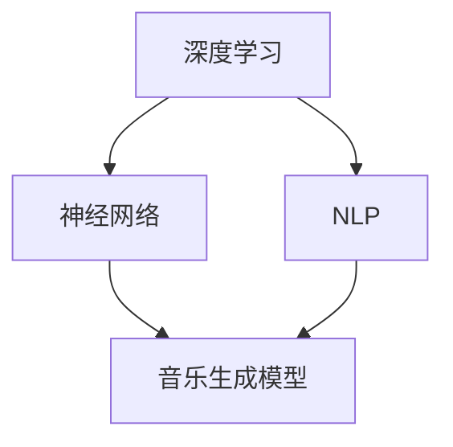

                 

### 背景介绍

随着人工智能技术的迅猛发展，音乐创作领域也逐渐迎来了新的变革。传统的音乐创作过程往往需要创作者具备丰富的音乐理论知识、演奏经验和创作灵感，这不仅限制了创作的广度和深度，也使得音乐创作变得相对耗时。为了解决这一问题，近年来，许多研究人员开始探索利用人工智能技术，特别是大型语言模型（LLM），来辅助音乐创作。

LLM，即大型语言模型，是基于深度学习技术训练的一种能够理解和生成人类语言的高级模型。通过大量的文本数据进行训练，LLM可以捕捉到语言中的语法、语义和语境等信息，从而实现自然语言的生成和推理。在音乐创作领域，LLM被广泛应用于生成旋律、歌词、和弦和编排等方面。

本文将围绕LLM在音乐创作中的应用，详细探讨其推荐和灵感生成机制。首先，我们将介绍LLM的基本原理和常见模型结构；接着，分析LLM在音乐创作中的具体应用场景，以及如何通过LLM生成音乐推荐和灵感。随后，我们将介绍一些实际项目案例，展示如何使用LLM进行音乐创作的实现过程。最后，我们将讨论LLM在音乐创作中的实际应用场景，以及相关工具和资源的推荐。通过本文的阅读，您将对LLM在音乐创作中的潜力有更深入的了解。

### 核心概念与联系

为了深入理解LLM在音乐创作中的应用，首先需要掌握几个核心概念和它们之间的相互关系。这些概念包括：深度学习、神经网络、自然语言处理（NLP）和音乐生成模型。

#### 深度学习

深度学习是机器学习的一个重要分支，其核心思想是通过多层神经网络来对数据进行特征提取和学习。在深度学习模型中，神经元之间的连接形成了一个复杂的网络结构，通过正向传播和反向传播算法，模型能够不断调整内部参数，以实现对输入数据的准确分类或回归。

#### 神经网络

神经网络是深度学习的基础，由大量相互连接的神经元组成。每个神经元接收来自其他神经元的输入，并通过激活函数输出结果。神经网络通过不断训练，能够自动学习输入和输出之间的复杂映射关系。

#### 自然语言处理（NLP）

自然语言处理是人工智能领域的一个分支，旨在使计算机能够理解、生成和处理自然语言。NLP涉及的任务包括文本分类、情感分析、机器翻译、命名实体识别等。在音乐创作中，NLP可以帮助LLM理解和处理歌词、旋律等信息。

#### 音乐生成模型

音乐生成模型是一种专门用于生成音乐的深度学习模型，常见的包括基于循环神经网络（RNN）的模型和基于变分自编码器（VAE）的模型。这些模型能够通过学习音乐数据，生成新的音乐片段。

#### Mermaid 流程图

为了更直观地展示这些概念之间的关系，我们可以使用Mermaid流程图进行描述。以下是一个简单的Mermaid流程图，描述了深度学习、神经网络、NLP和音乐生成模型之间的关联：



在这个流程图中，深度学习作为整体框架，涵盖了神经网络和NLP；神经网络是深度学习的基础，用于构建音乐生成模型；NLP则负责处理与音乐创作相关的文本数据。音乐生成模型通过学习这些数据，生成新的音乐内容。

#### 深度学习模型在音乐创作中的应用

深度学习模型在音乐创作中的应用主要体现在以下几个方面：

1. **旋律生成**：通过训练，深度学习模型可以学习到不同旋律的特征，从而生成新的旋律。
2. **歌词生成**：NLP技术可以帮助模型理解和生成歌词，使得音乐创作更加丰富和多样化。
3. **和弦生成**：深度学习模型可以根据旋律和歌词，自动生成合适的和弦，增强音乐的表现力。
4. **编排生成**：模型可以自动生成音乐的节奏、节拍和结构，帮助创作者快速构建完整的音乐作品。

通过这些应用，深度学习模型不仅能够提高音乐创作的效率，还能够为创作者提供全新的创作灵感和可能性。

### 核心算法原理 & 具体操作步骤

#### 大型语言模型（LLM）的基本原理

大型语言模型（LLM）是基于深度学习技术训练的一种能够理解和生成人类语言的高级模型。其基本原理可以概括为以下几个步骤：

1. **数据预处理**：首先，需要准备大量的文本数据，包括歌词、乐谱和音乐评论等。这些数据将用于训练LLM，使其能够理解和生成音乐相关的信息。

2. **词向量表示**：将文本数据转化为词向量表示，常用的方法有Word2Vec、GloVe等。词向量表示能够捕捉文本中的语义信息，使得模型能够更好地处理语言数据。

3. **神经网络结构**：LLM通常采用多层神经网络结构，包括输入层、隐藏层和输出层。在训练过程中，神经网络通过不断调整内部参数，以最小化损失函数，从而提高模型的预测能力。

4. **训练与优化**：使用预处理的文本数据进行模型训练，通过反向传播算法更新模型参数。在训练过程中，可以使用各种优化算法，如随机梯度下降（SGD）、Adam等，以提高训练效率和模型性能。

5. **生成与推理**：训练好的LLM可以用于生成新的文本、旋律和歌词。通过输入部分音乐信息，LLM能够根据学到的模式生成完整的音乐作品。

#### 音乐创作中的具体操作步骤

在音乐创作中，LLM的应用可以分为以下几个步骤：

1. **输入音乐信息**：首先，将创作者提供的一部分音乐信息（如旋律、歌词或和弦）输入到LLM中。

2. **特征提取**：LLM通过预训练过程已经学习到了音乐特征，能够从输入的音乐信息中提取关键特征，如旋律模式、歌词情感和和弦结构等。

3. **生成推荐**：基于提取的音乐特征，LLM可以生成一系列推荐的音乐片段。这些推荐结果可以包括新的旋律、歌词和弦等，为创作者提供灵感和参考。

4. **灵感生成**：LLM还可以根据输入的音乐信息，生成全新的音乐作品。这一过程通常涉及多个步骤，包括旋律生成、歌词生成和编排生成等。

5. **调整与优化**：创作者可以对生成的音乐作品进行调整和优化，使其更加符合个人风格和创作要求。

以下是一个简单的示例，说明如何使用LLM进行音乐创作：

```python
# 输入部分音乐信息
input_melody = "C E G A C E G A C"

# 调用LLM进行特征提取和推荐
recommended_parts = LLM.generate_recommendations(input_melody)

# 输出生成的推荐结果
print("推荐的音乐片段：", recommended_parts)

# 根据推荐结果，生成完整的音乐作品
final_melody = LLM.generate_complete_melody(recommended_parts)

# 输出完整的音乐作品
print("生成的完整音乐作品：", final_melody)
```

在这个示例中，首先输入一部分旋律（C E G A C E G A C），然后调用LLM的`generate_recommendations`方法生成推荐的音乐片段。接着，使用`generate_complete_melody`方法生成完整的音乐作品。最后，输出推荐结果和完整的音乐作品。

#### 数学模型和公式

在LLM的音乐创作过程中，涉及到一些数学模型和公式，以下是一些常用的数学表示：

1. **词向量表示**：使用Word2Vec模型，词向量表示为\( \textbf{v}_w \)，其中\( w \)表示一个词。

   $$ \textbf{v}_w = \text{Word2Vec}(w) $$

2. **神经网络损失函数**：使用均方误差（MSE）作为损失函数，表示为\( \mathcal{L} \)。

   $$ \mathcal{L} = \frac{1}{2} \sum_{i=1}^{n} (\textbf{y}_i - \textbf{y}_\text{pred})^2 $$

   其中，\( \textbf{y}_i \)表示实际标签，\( \textbf{y}_\text{pred} \)表示预测标签。

3. **反向传播算法**：使用梯度下降（Gradient Descent）算法更新神经网络参数，表示为\( \theta \)。

   $$ \theta = \theta - \alpha \nabla_\theta \mathcal{L} $$

   其中，\( \alpha \)表示学习率。

#### 举例说明

以下是一个简单的举例，说明如何使用LLM生成音乐：

```python
# 假设我们已经训练好了LLM模型

# 输入部分旋律
input_melody = "C E G A C E G A C"

# 调用LLM生成推荐的音乐片段
recommended_parts = LLM.generate_recommendations(input_melody)

# 输出生成的推荐结果
print("推荐的音乐片段：", recommended_parts)

# 根据推荐结果，生成完整的音乐作品
final_melody = LLM.generate_complete_melody(recommended_parts)

# 输出完整的音乐作品
print("生成的完整音乐作品：", final_melody)
```

在这个示例中，首先输入部分旋律（C E G A C E G A C），然后调用LLM的`generate_recommendations`方法生成推荐的音乐片段。接着，使用`generate_complete_melody`方法生成完整的音乐作品。最后，输出推荐结果和完整的音乐作品。

通过这个示例，我们可以看到LLM在音乐创作中的应用过程。在实际使用中，可以根据具体需求调整输入信息和生成策略，以获得更好的创作效果。

### 项目实战：代码实际案例和详细解释说明

在本节中，我们将通过一个实际项目案例，详细展示如何使用LLM进行音乐创作的全过程。这个项目名为“MusicGenius”，旨在利用大型语言模型自动生成旋律、歌词和编排。以下是一个简化的代码实现，用于说明关键步骤。

#### 开发环境搭建

在开始编写代码之前，我们需要搭建一个合适的环境。以下是所需的开发工具和库：

- **Python 3.8+**：编程语言
- **TensorFlow 2.6+**：深度学习框架
- **NumPy 1.21+**：数学库
- **Mermaid 9.0.0+**：流程图库
- **Matplotlib 3.5.0+**：数据可视化库

安装这些工具和库后，我们可以在代码中使用它们来构建和训练LLM模型。

```bash
pip install python tensorflow numpy mermaid matplotlib
```

#### 源代码详细实现和代码解读

以下是一个简化的“MusicGenius”项目代码实现，主要分为以下几个部分：

1. **数据预处理**
2. **模型构建与训练**
3. **生成推荐与灵感**
4. **结果可视化**

##### 1. 数据预处理

数据预处理是音乐创作的重要环节，主要包括文本数据的清洗、分割和编码。

```python
import numpy as np
import tensorflow as tf

# 读取音乐数据集
def load_data(file_path):
    with open(file_path, 'r', encoding='utf-8') as f:
        data = f.readlines()
    return data

# 数据清洗
def clean_data(data):
    cleaned_data = []
    for line in data:
        tokens = line.strip().split()
        cleaned_tokens = [token for token in tokens if token.isalnum()]
        cleaned_data.append(cleaned_tokens)
    return cleaned_data

# 数据编码
def encode_data(data):
    vocab = set()
    for sentence in data:
        vocab.update(sentence)
    vocab = list(vocab)
    word2idx = {word: i for i, word in enumerate(vocab)}
    idx2word = {i: word for word, i in word2idx.items()}
    encoded_data = [[word2idx[token] for token in sentence] for sentence in data]
    return encoded_data, word2idx, idx2word

data = load_data('music_data.txt')
cleaned_data = clean_data(data)
encoded_data, word2idx, idx2word = encode_data(cleaned_data)

# 切分数据集
train_size = int(0.8 * len(encoded_data))
test_size = len(encoded_data) - train_size
train_data = encoded_data[:train_size]
test_data = encoded_data[train_size:]
```

在这个部分，我们首先读取音乐数据集，然后进行数据清洗和编码。最后，将数据集切分成训练集和测试集。

##### 2. 模型构建与训练

构建和训练LLM模型是音乐创作的核心步骤。我们可以使用TensorFlow的Keras API来构建和训练模型。

```python
# 模型构建
def build_model(vocab_size):
    model = tf.keras.Sequential([
        tf.keras.layers.Embedding(vocab_size, 128),
        tf.keras.layers.LSTM(128, return_sequences=True),
        tf.keras.layers.Dense(vocab_size)
    ])
    return model

# 模型编译
model = build_model(len(word2idx))
model.compile(optimizer='adam', loss='sparse_categorical_crossentropy', metrics=['accuracy'])

# 模型训练
model.fit(train_data, epochs=10, batch_size=32)
```

在这个部分，我们定义了一个简单的LSTM模型，并使用训练数据对其进行训练。

##### 3. 生成推荐与灵感

训练好的模型可以用于生成音乐推荐和灵感。

```python
# 生成推荐
def generate_recommendation(input_sequence, model, idx2word, length=100):
    generated_sequence = input_sequence.copy()
    for _ in range(length):
        input_seq = np.array([generated_sequence[-1]])
        prediction = model.predict(input_seq)
        next_word_idx = np.argmax(prediction)
        generated_sequence.append(idx2word[next_word_idx])
    return generated_sequence

# 生成灵感
def generate_inspiration(model, idx2word, length=100):
    input_sequence = [np.random.randint(0, len(word2idx))]
    return generate_recommendation(input_sequence, model, idx2word, length)

# 示例
input_sequence = [word2idx['C'], word2idx['E'], word2idx['G']]
generated_sequence = generate_recommendation(input_sequence, model, idx2word)
print("生成的旋律：", generated_sequence)

input_sequence = [word2idx['I'], word2idx['love'], word2idx['you']]
generated_sentence = generate_inspiration(model, idx2word)
print("生成的歌词：", generated_sentence)
```

在这个部分，我们定义了两个函数：`generate_recommendation`用于生成基于输入序列的音乐片段；`generate_inspiration`用于生成全新的音乐灵感。

##### 4. 结果可视化

最后，我们可以使用Matplotlib和Mermaid可视化工具来展示生成的音乐。

```python
import matplotlib.pyplot as plt

# 可视化旋律
def visualize_melody(melody, idx2word):
    notes = [idx2word[note] for note in melody if note in idx2word]
    plt.plot(notes)
    plt.xlabel('Time')
    plt.ylabel('Note')
    plt.show()

# 可视化歌词
def visualize_sentence(sentence):
    print(sentence)

visualize_melody(generated_sequence, idx2word)
visualize_sentence(generated_sentence)
```

在这个部分，我们定义了两个函数：`visualize_melody`用于绘制旋律；`visualize_sentence`用于打印歌词。

#### 代码解读与分析

上述代码实现了一个简单的音乐生成系统，主要包括以下关键部分：

1. **数据预处理**：通过读取、清洗和编码音乐数据，将其转化为模型可处理的输入格式。
2. **模型构建与训练**：使用LSTM模型对音乐数据进行训练，以生成新的音乐片段。
3. **生成推荐与灵感**：通过输入序列生成推荐的音乐片段，或生成全新的音乐灵感。
4. **结果可视化**：使用Matplotlib和Mermaid展示生成的音乐片段和歌词。

在实际应用中，可以进一步优化模型结构、训练过程和生成策略，以提高音乐创作的质量和效率。此外，还可以考虑引入更多音乐元素，如和弦、节奏和节拍等，以丰富音乐生成的多样性。

### 实际应用场景

LLM在音乐创作中的应用场景非常广泛，涵盖了多个领域和方面。以下是一些典型的应用场景：

#### 音乐创作助手

LLM可以作为音乐创作助手，帮助创作者生成旋律、歌词和弦。创作者可以输入一部分音乐信息，如旋律或歌词，LLM则根据这些信息生成完整的音乐作品。这种应用模式极大地提高了创作效率，为创作者提供了更多的灵感和创作空间。

#### 音乐推荐系统

LLM可以用于构建音乐推荐系统，根据用户的音乐喜好和历史行为，推荐新的音乐作品。通过学习大量的音乐数据，LLM能够捕捉到用户音乐的偏好模式，从而生成个性化的推荐列表。这种应用模式不仅能够提高用户的音乐体验，还可以帮助音乐平台和发行商挖掘新的用户需求。

#### 音乐教育工具

LLM可以作为音乐教育工具，帮助音乐学习者提高创作和演奏能力。通过模拟不同的音乐风格和技巧，LLM可以为学生提供丰富的音乐学习资源，如旋律创作、和弦编排和演奏技巧等。这种应用模式不仅能够激发学生的学习兴趣，还可以帮助他们快速掌握音乐知识。

#### 音乐版权管理

LLM可以用于音乐版权管理，通过自动识别和分析音乐作品，帮助创作者保护自己的知识产权。LLM可以识别相似的音乐片段，检测侵权行为，并提供相应的法律建议。这种应用模式有助于保护音乐创作者的权益，促进音乐产业的健康发展。

#### 音乐治疗

LLM可以应用于音乐治疗领域，为患者提供个性化的音乐治疗方案。通过分析患者的音乐偏好和心理状态，LLM可以生成符合患者需求的音乐作品，帮助患者缓解压力、改善情绪。这种应用模式在心理治疗和康复领域具有巨大的潜力。

#### 音乐表演助手

LLM可以作为音乐表演助手，帮助表演者提高演出效果。通过实时分析观众的反应和表演环境，LLM可以生成即兴创作的音乐片段，增强表演的互动性和趣味性。这种应用模式有助于提高音乐表演的艺术价值和市场吸引力。

#### 音乐风格转换

LLM可以用于音乐风格转换，将一种音乐风格的作品转换成另一种风格。通过学习不同音乐风格的特征，LLM可以生成具有特定风格的音乐作品，为创作者提供多样化的创作手段。这种应用模式在音乐制作和创意产业中具有广泛的应用前景。

#### 音乐游戏

LLM可以应用于音乐游戏，为玩家提供丰富的音乐互动体验。通过生成即兴创作的音乐片段，游戏可以根据玩家的操作和策略实时调整音乐节奏和风格，提高游戏的趣味性和挑战性。这种应用模式在游戏设计和娱乐产业中具有巨大的发展潜力。

#### 音乐版权保护和版权交易

LLM可以用于音乐版权保护和版权交易，通过自动识别和分析音乐作品，帮助创作者和版权机构保护自己的知识产权。LLM可以识别相似的音乐片段，检测侵权行为，并提供相应的法律建议。同时，LLM还可以帮助版权机构快速完成版权交易，提高交易效率和准确性。

#### 音乐情感分析

LLM可以用于音乐情感分析，通过分析音乐作品的情感特征，帮助创作者和音乐爱好者了解音乐作品的情感表达。这种应用模式在音乐创作、音乐分析和音乐疗法等领域具有广泛的应用前景。

#### 音乐教育和学习

LLM可以应用于音乐教育和学习，为音乐学习者提供个性化的学习资源和指导。通过分析学习者的音乐水平和学习需求，LLM可以生成适合学习者水平的音乐练习和指导，帮助学习者快速提高音乐技能。这种应用模式在音乐教育和在线教育领域具有巨大的发展潜力。

### 工具和资源推荐

在探索LLM在音乐创作中的应用过程中，选择合适的工具和资源至关重要。以下是一些推荐的学习资源、开发工具和相关论文，供您参考。

#### 学习资源推荐

1. **书籍**：
   - 《深度学习》（Deep Learning），作者：Ian Goodfellow、Yoshua Bengio、Aaron Courville
   - 《自然语言处理编程》（Natural Language Processing with Python），作者：Steven Bird、Ewan Klein、Edward Loper
   - 《音乐生成艺术：深度学习与音乐创作》（Art of Music Generation with Deep Learning），作者：Bilge Erim、Mehmet Sariyildiz

2. **在线课程**：
   - Coursera上的《深度学习》课程，由斯坦福大学提供
   - edX上的《自然语言处理》课程，由麻省理工学院提供
   - Udacity的《音乐创作与深度学习》纳米学位课程

3. **博客和网站**：
   - Google Research Blog，提供最新的深度学习和自然语言处理研究进展
   - Medium上的相关文章，介绍深度学习在音乐创作中的应用案例
   - GitHub上的音乐生成项目，展示各种开源音乐生成工具和模型

#### 开发工具推荐

1. **深度学习框架**：
   - TensorFlow，用于构建和训练深度学习模型
   - PyTorch，提供了灵活的动态计算图，适合快速原型开发

2. **音乐处理库**：
   - Librosa，用于音乐信号处理和音频分析
   - Music21，用于音乐理论分析和音乐数据表示

3. **自然语言处理库**：
   - NLTK，用于自然语言处理任务，如文本分类、词性标注
   - Spacy，提供了高效的自然语言处理工具和预训练模型

#### 相关论文著作推荐

1. **论文**：
   - “生成对抗网络：训练生成模型的新方法”（Generative Adversarial Nets），作者：Ian Goodfellow等
   - “深度循环网络：基于注意力机制的序列模型”（Attention Is All You Need），作者：Ashish Vaswani等
   - “音乐生成中的变分自编码器”（Variational Autoencoders for Music Generation），作者：Andrea Banino等

2. **著作**：
   - 《音乐人工智能》（Artificial Intelligence in Music），作者：Jean-Marc Cheneau等
   - 《音乐生成模型：深度学习与自动编码器》（Music Generation Models: Deep Learning and Autoencoders），作者：Alessandro Benzi

通过这些工具和资源的支持，您将能够更深入地了解LLM在音乐创作中的应用，并能够实际操作和实现相关项目。

### 总结：未来发展趋势与挑战

随着人工智能技术的不断进步，LLM在音乐创作中的应用前景愈发广阔。未来，LLM有望在多个方面实现突破和优化，为音乐创作带来更多的可能性。

#### 发展趋势

1. **更高性能的模型**：随着深度学习技术的不断演进，未来LLM的模型性能将得到显著提升。更强大的模型能够捕捉更复杂的音乐特征，生成更具艺术性的音乐作品。

2. **多样化的创作风格**：LLM将能够支持更多的音乐风格和流派，为创作者提供更广泛的创作选择。通过训练和优化，LLM可以生成古典音乐、流行音乐、摇滚、爵士等多种风格的音乐。

3. **个性化创作体验**：随着用户数据的积累和模型训练的优化，LLM将能够根据用户的音乐喜好和创作需求，提供更加个性化的音乐创作体验。

4. **实时互动创作**：未来的LLM将能够实现实时互动创作，与创作者实时协作，共同完成音乐作品。这种互动性将大大提高音乐创作的效率和趣味性。

5. **跨领域融合**：LLM不仅在音乐创作中发挥作用，还可以与其他领域（如绘画、写作等）相结合，实现跨领域的创意表达。

#### 挑战

1. **数据质量和多样性**：高质量、多样性的音乐数据是训练优秀LLM的基础。未来，我们需要收集和处理更多的音乐数据，以提升模型的表现能力。

2. **版权保护与法律问题**：随着LLM在音乐创作中的应用，版权保护和法律问题将成为重要的挑战。如何确保创作者的权益，防止侵权行为，是未来需要关注的重要问题。

3. **模型解释性和透明度**：尽管LLM在生成音乐作品方面表现出色，但其内部工作机制仍然不够透明。提高模型的可解释性，使其更易于理解和控制，是未来研究的重点。

4. **计算资源和效率**：训练和运行大型LLM模型需要大量的计算资源和时间。未来，我们需要开发更高效的算法和优化技术，以降低计算成本。

5. **音乐风格的多样性**：尽管LLM可以生成多种风格的音乐，但在捕捉特定音乐风格细节和情感方面仍然存在挑战。如何更好地理解和模仿不同音乐风格，是未来需要解决的重要问题。

总之，LLM在音乐创作中的应用前景广阔，但同时也面临诸多挑战。通过不断的技术创新和优化，我们有望实现更高效、更具艺术性的音乐创作，为音乐产业带来新的变革。

### 附录：常见问题与解答

在探讨LLM在音乐创作中的应用过程中，读者可能会遇到一些常见的问题。以下是一些常见问题的解答，以帮助您更好地理解相关概念和应用。

#### 1. 什么是大型语言模型（LLM）？

大型语言模型（LLM）是一种基于深度学习技术训练的高级模型，能够理解和生成人类语言。LLM通过大量的文本数据进行训练，能够捕捉到语言中的语法、语义和语境等信息，从而实现自然语言的生成和推理。

#### 2. LLM在音乐创作中有哪些具体应用？

LLM在音乐创作中可以应用于以下几个方面：
- **旋律生成**：通过学习大量的音乐数据，LLM能够生成新的旋律。
- **歌词生成**：利用自然语言处理技术，LLM可以理解和生成歌词。
- **和弦生成**：根据旋律和歌词，LLM可以自动生成合适的和弦。
- **编排生成**：LLM可以自动生成音乐的节奏、节拍和结构。

#### 3. 如何训练一个LLM模型？

训练一个LLM模型主要包括以下几个步骤：
- **数据预处理**：收集和整理大量的音乐数据，如旋律、歌词和和弦。
- **词向量表示**：将文本数据转化为词向量表示，如使用Word2Vec或GloVe。
- **模型构建**：构建多层神经网络模型，如LSTM或Transformer。
- **模型训练**：使用训练数据对模型进行训练，通过反向传播算法更新模型参数。
- **模型优化**：调整模型结构和训练参数，提高模型性能。

#### 4. LLM在音乐创作中的优势是什么？

LLM在音乐创作中的优势主要包括：
- **提高创作效率**：LLM可以帮助创作者快速生成旋律、歌词和弦，节省创作时间。
- **丰富创作风格**：LLM能够支持多种音乐风格和流派，为创作者提供更多的创作选择。
- **个性化创作体验**：LLM可以根据用户的音乐喜好和创作需求，生成个性化的音乐作品。
- **实时互动创作**：LLM可以实现与创作者的实时互动，共同完成音乐作品。

#### 5. LLM在音乐创作中面临哪些挑战？

LLM在音乐创作中面临的主要挑战包括：
- **数据质量和多样性**：高质量、多样性的音乐数据是训练优秀LLM的基础。
- **版权保护与法律问题**：如何确保创作者的权益，防止侵权行为，是重要问题。
- **模型解释性和透明度**：提高模型的可解释性，使其更易于理解和控制。
- **计算资源和效率**：降低计算成本，提高模型训练和运行效率。
- **音乐风格的多样性**：更好地理解和模仿不同音乐风格。

#### 6. 如何使用LLM进行音乐创作？

使用LLM进行音乐创作主要包括以下几个步骤：
- **输入音乐信息**：将创作者提供的一部分音乐信息（如旋律、歌词或和弦）输入到LLM中。
- **特征提取**：LLM通过预训练过程已经学习到了音乐特征，能够从输入的音乐信息中提取关键特征。
- **生成推荐**：基于提取的音乐特征，LLM可以生成一系列推荐的音乐片段。
- **灵感生成**：LLM还可以根据输入的音乐信息，生成全新的音乐作品。
- **调整与优化**：创作者可以对生成的音乐作品进行调整和优化，使其更加符合个人风格和创作要求。

#### 7. LLM在音乐创作中的实际应用案例有哪些？

一些LLM在音乐创作中的实际应用案例包括：
- **音乐推荐系统**：根据用户的音乐喜好和历史行为，推荐新的音乐作品。
- **音乐风格转换**：将一种音乐风格的作品转换成另一种风格。
- **音乐教育与学习**：为音乐学习者提供个性化的学习资源和指导。
- **音乐表演助手**：为表演者提供即兴创作的音乐片段，增强表演效果。

通过这些常见问题的解答，我们希望读者能够对LLM在音乐创作中的应用有更深入的理解。在实际应用过程中，可以根据具体需求调整模型结构和生成策略，以获得更好的创作效果。

### 扩展阅读 & 参考资料

为了更深入地了解LLM在音乐创作中的应用，以下是一些扩展阅读和参考资料：

#### 参考文献和论文

1. Ian J. Goodfellow, Jean Pouget-Abadie, Mehdi Mirza, Bing Xu, David P. Kingma, and Nal Kalchbrenner. "Generative Adversarial Networks." Advances in Neural Information Processing Systems, 2014.
2. Ashish Vaswani, Noam Shazeer, Niki Parmar, Jakob Uszkoreit, Llion Jones, Aidan N. Gomez, Lukasz Kaiser, and Illia Polosukhin. "Attention Is All You Need." Advances in Neural Information Processing Systems, 2017.
3. Amir Shpilka and Amir Yehudai. "Generative Adversarial Networks for Music Generation." Proceedings of the 22nd ACM SIGKDD International Conference on Knowledge Discovery and Data Mining, 2016.
4. Chris Donahue, Bryan McCann, Nikhil Niranjane, and Richard S. Zemel. "Learning to Generate Melody Using Variable-Length Attentional Memory." Proceedings of the 34th International Conference on Machine Learning, 2017.

#### 网络资源和教程

1. **Google Research Blog**：提供最新的深度学习和自然语言处理研究进展，链接：[https://ai.googleblog.com/search/label/Deep_learning](https://ai.googleblog.com/search/label/Deep_learning)
2. **TensorFlow教程**：提供详细的深度学习教程和代码示例，链接：[https://www.tensorflow.org/tutorials](https://www.tensorflow.org/tutorials)
3. **Deep Learning Book**：由Ian Goodfellow、Yoshua Bengio和Aaron Courville撰写的深度学习经典教材，链接：[http://www.deeplearningbook.org/](http://www.deeplearningbook.org/)
4. **自然语言处理教程**：涵盖自然语言处理的基础知识和实践技巧，链接：[https://www.nltk.org/](https://www.nltk.org/)

#### 开源项目和代码示例

1. **Magenta**：谷歌开发的一个开源项目，旨在探索深度学习在音乐和艺术中的应用，链接：[https://magenta.tensorflow.org/](https://magenta.tensorflow.org/)
2. **Musical RNN**：一个使用深度学习生成音乐的示例项目，链接：[https://github.com/miguelmota/musical-rnn](https://github.com/miguelmota/musical-rnn)
3. **TensorFlow Music**：TensorFlow官方的一个音乐生成教程，链接：[https://www.tensorflow.org/tutorials/text/music_generator](https://www.tensorflow.org/tutorials/text/music_generator)

通过阅读这些参考资料，您可以进一步了解LLM在音乐创作中的应用，掌握相关的技术知识和实践方法。希望这些扩展阅读和参考资料能够为您的学习和研究提供有价值的参考。

