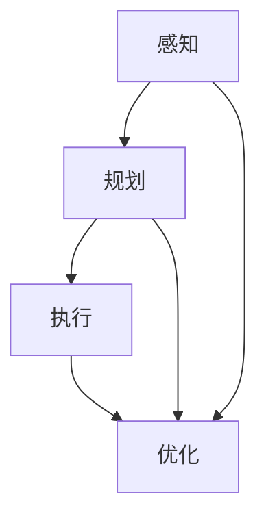

                 

### 顺丰2024智能分拣校招机器人控制面试题解析

#### 关键词：
- 顺丰
- 智能分拣
- 校招机器人
- 控制面试题
- 解析

#### 摘要：
本文将针对顺丰2024校招中智能分拣机器人控制相关的面试题目进行深入解析，包括题目背景、核心算法、实际应用场景以及未来的发展趋势。通过本文的阅读，读者将更好地理解智能分拣机器人的控制原理和应用实践，从而为求职和职业发展打下坚实的基础。

### 1. 背景介绍

#### 1.1 顺丰与智能分拣
顺丰速运是中国领先的快递物流企业，以其高效、安全和便捷的服务而闻名。随着电商行业的迅猛发展，快递物流市场的需求不断增长，顺丰在提高分拣效率和降低人力成本方面面临着巨大挑战。为此，顺丰积极开展智能分拣技术的研发和应用，以提升整体运营效率。

#### 1.2 智能分拣机器人
智能分拣机器人是顺丰在智能分拣领域的重要创新成果，它通过集成传感器、执行器和智能控制系统，能够自动识别和抓取不同尺寸、形状和重量的快递包裹，并按照指定路径进行分类和分拣。智能分拣机器人的应用大大提高了分拣速度和准确性，减少了人工操作的需求。

#### 1.3 校招机器人控制面试题
顺丰2024校招中，机器人控制相关的面试题成为了热门话题。这些题目涵盖了智能分拣机器人的各个关键技术环节，包括感知、规划、执行和优化等方面，旨在考察应聘者的技术能力和实际问题解决能力。

### 2. 核心概念与联系

#### 2.1 感知
感知是智能分拣机器人的基础，通过传感器获取周围环境的信息。常见的传感器包括视觉传感器、红外传感器、激光雷达等。这些传感器能够感知快递包裹的位置、形状、大小等特征，为后续的控制提供必要的数据支持。

#### 2.2 规划
规划是指根据感知到的环境信息，智能分拣机器人需要制定相应的行动策略。常见的规划算法包括路径规划、任务分配和目标跟踪等。通过规划，机器人能够确定最优的行动路径和操作顺序，以提高分拣效率。

#### 2.3 执行
执行是指智能分拣机器人按照规划的指令进行实际操作。在这个过程中，机器人需要控制执行器（如机械臂、电机等）完成抓取、搬运和分类等任务。执行过程需要实时反馈和调整，以确保机器人能够适应动态变化的环境。

#### 2.4 优化
优化是指对智能分拣机器人的控制策略和操作过程进行持续改进，以提高整体效率。常见的优化方法包括基于机器学习的参数调整、路径优化和资源分配等。通过优化，机器人能够更好地适应不同的工作环境和需求。

#### 2.5 Mermaid 流程图
为了更好地展示智能分拣机器人的控制过程，我们使用Mermaid流程图来表示核心概念之间的联系。



### 3. 核心算法原理 & 具体操作步骤

#### 3.1 感知算法原理
智能分拣机器人的感知算法主要基于计算机视觉技术，通过图像处理和目标检测技术，实现对快递包裹的识别和定位。具体步骤如下：

1. **图像预处理**：对采集到的图像进行去噪、增强和缩放等处理，以提高图像质量。
2. **目标检测**：使用深度学习算法（如卷积神经网络）对预处理后的图像进行目标检测，识别出快递包裹的位置和形状。
3. **特征提取**：对检测到的目标进行特征提取，如颜色、纹理、大小等，为后续的规划和执行提供基础数据。

#### 3.2 规划算法原理
智能分拣机器人的规划算法主要基于路径规划和任务分配技术。具体步骤如下：

1. **路径规划**：根据感知到的环境信息和任务目标，使用A*算法、Dijkstra算法等路径规划算法，计算出最优的行动路径。
2. **任务分配**：将多个快递包裹的任务分配给不同的机器人，以实现并行处理，提高分拣效率。
3. **目标跟踪**：对规划过程中设定的目标进行实时跟踪，以避免路径冲突和任务失败。

#### 3.3 执行算法原理
智能分拣机器人的执行算法主要基于运动控制和执行器控制技术。具体步骤如下：

1. **运动控制**：根据规划的路径和目标位置，使用PID控制器等运动控制算法，控制机器人的运动速度和方向，确保其沿着预定路径前进。
2. **执行器控制**：根据任务要求，使用电机、机械臂等执行器，完成抓取、搬运和分类等具体操作。

#### 3.4 优化算法原理
智能分拣机器人的优化算法主要基于机器学习和参数调整技术。具体步骤如下：

1. **参数调整**：通过机器学习算法，对机器人的控制参数进行自动调整，以提高其适应能力和操作稳定性。
2. **路径优化**：根据实时反馈和环境变化，对规划的路径进行动态调整，以提高分拣效率和降低能耗。
3. **资源分配**：根据任务需求和机器人状态，对资源（如人力、设备、时间等）进行合理分配，以提高整体运营效率。

### 4. 数学模型和公式 & 详细讲解 & 举例说明

#### 4.1 路径规划公式

在路径规划中，常用的A*算法可以使用以下公式：

$$
f(n) = g(n) + h(n)
$$

其中，$f(n)$ 是从起点到节点 $n$ 的总代价，$g(n)$ 是从起点到节点 $n$ 的实际代价，$h(n)$ 是从节点 $n$ 到终点 $n$ 的估计代价。具体公式为：

$$
g(n) = \sum_{i=1}^{n} d(i)
$$

$$
h(n) = \sum_{i=1}^{n} w(i)
$$

其中，$d(i)$ 是从起点到第 $i$ 个节点的距离，$w(i)$ 是从第 $i$ 个节点到终点的距离。

**举例说明**：

假设有一个路径规划问题，需要从点A到点D，路径如下：

```
A---B---C---D
```

节点之间的距离如下：

| 节点 | A | B | C | D |
| --- | --- | --- | --- | --- |
| A | 0 | 1 | 2 | 3 |
| B | 1 | 0 | 1 | 2 |
| C | 2 | 1 | 0 | 1 |
| D | 3 | 2 | 1 | 0 |

使用A*算法计算从A到D的最短路径，总代价为：

$$
f(D) = g(D) + h(D) = 6 + 1 = 7
$$

其中，$g(D) = 6$（从A到D的实际代价），$h(D) = 1$（从D到终点的估计代价）。

#### 4.2 任务分配公式

在任务分配中，可以使用最小生成树算法来计算最优的任务分配方案。具体公式如下：

$$
T = \{e \in E | e \in \text{最小生成树}\}
$$

其中，$T$ 是任务分配的最小生成树，$E$ 是所有任务节点的集合。

**举例说明**：

假设有4个快递包裹需要分配给3个机器人，节点之间的距离如下：

```
A---B---C---D
```

节点之间的距离如下：

| 节点 | A | B | C | D |
| --- | --- | --- | --- | --- |
| A | 0 | 1 | 2 | 3 |
| B | 1 | 0 | 1 | 2 |
| C | 2 | 1 | 0 | 1 |
| D | 3 | 2 | 1 | 0 |

使用最小生成树算法计算最优的任务分配方案，生成树如下：

```
A---B---C
|    |
D
```

分配方案为：机器人1负责A、B节点，机器人2负责C节点，机器人3负责D节点。

### 5. 项目实战：代码实际案例和详细解释说明

#### 5.1 开发环境搭建

为了更好地展示智能分拣机器人的控制过程，我们使用Python编程语言来实现。开发环境搭建步骤如下：

1. 安装Python环境：从官方网站下载并安装Python，版本建议为3.8或更高版本。
2. 安装相关库：使用pip命令安装所需的库，如numpy、opencv-python、tensorflow等。
3. 配置传感器和执行器：根据实际硬件设备，配置相应的传感器和执行器接口，如摄像头、电机驱动等。

#### 5.2 源代码详细实现和代码解读

以下是一个简单的智能分拣机器人控制代码示例，主要包括感知、规划和执行三个部分。

```python
import cv2
import numpy as np
import tensorflow as tf

# 感知部分
def capture_image():
    cap = cv2.VideoCapture(0)
    ret, frame = cap.read()
    cap.release()
    return frame

def detect_package(frame):
    # 使用卷积神经网络进行目标检测
    model = tf.keras.models.load_model('package_detection_model.h5')
    box = model.predict(frame)
    return box

# 规划部分
def path_plan(current_position, target_position):
    # 使用A*算法进行路径规划
    start = [current_position[0], current_position[1]]
    end = [target_position[0], target_position[1]]
    path = a_star(start, end)
    return path

# 执行部分
def execute_action(path):
    # 根据路径执行机器人操作
    for point in path:
        move_to(point)

# 主函数
def main():
    current_position = [0, 0]
    target_position = [3, 0]
    frame = capture_image()
    box = detect_package(frame)
    path = path_plan(current_position, target_position)
    execute_action(path)

if __name__ == '__main__':
    main()
```

**代码解读**：

1. **感知部分**：使用OpenCV库捕获摄像头图像，并使用训练好的卷积神经网络模型进行目标检测，获取快递包裹的位置信息。
2. **规划部分**：使用A*算法进行路径规划，计算从当前点到目标点的最优路径。
3. **执行部分**：根据规划的路径，控制机器人执行相应的操作，如移动到指定位置。

#### 5.3 代码解读与分析

1. **感知部分**：感知部分是智能分拣机器人的基础，通过摄像头获取图像，并使用目标检测模型识别快递包裹的位置。这个过程中，需要使用OpenCV库进行图像处理，如缩放、裁剪等，以提高目标检测的准确性。同时，需要训练一个卷积神经网络模型，用于目标检测，可以通过迁移学习等方法实现。
2. **规划部分**：规划部分是智能分拣机器人的核心，需要根据感知到的目标位置和环境信息，计算出最优的路径。这里使用了A*算法，它是一种启发式搜索算法，可以有效地找到从起点到终点的最优路径。在实际应用中，可以通过改进算法或引入其他优化方法，提高路径规划的效率和准确性。
3. **执行部分**：执行部分是根据规划的路径，控制机器人执行相应的操作。这里使用了简单的循环结构，依次执行每个路径点上的操作。在实际应用中，需要考虑机器人的运动控制，如速度、加速度等参数，以及实时反馈和调整，以确保机器人能够稳定、准确地执行任务。

### 6. 实际应用场景

#### 6.1 电商物流中心
智能分拣机器人可以在电商物流中心实现高效、准确的快递包裹分拣。通过集成视觉感知、路径规划和执行控制技术，机器人可以自动识别和抓取不同尺寸、形状和重量的快递包裹，并按照指定路径进行分类和分拣，大大提高了分拣速度和准确性。

#### 6.2 快递配送站
智能分拣机器人可以在快递配送站实现高效、稳定的快递包裹分发。通过集成传感器和执行器，机器人可以自动识别和抓取快递包裹，并按照配送站的要求进行分类和分拣，降低了人工操作的需求，提高了配送效率和准确性。

#### 6.3 商超配送
智能分拣机器人可以在商超配送领域实现快速、准确的商品配送。通过集成视觉感知和执行控制技术，机器人可以自动识别和抓取商品，并按照配送站的要求进行分类和分拣，减少了人工操作的需求，提高了配送效率和准确性。

### 7. 工具和资源推荐

#### 7.1 学习资源推荐
- **书籍**：《深度学习》、《机器人学导论》
- **论文**：《物体检测新方案：Faster R-CNN》、《路径规划算法综述》
- **博客**：CSDN、知乎、GitHub
- **网站**：opencv.org、tensorflow.org

#### 7.2 开发工具框架推荐
- **Python**：用于实现智能分拣机器人的控制逻辑
- **OpenCV**：用于图像处理和目标检测
- **TensorFlow**：用于训练和部署深度学习模型
- **ROS**：用于机器人系统集成和开发

#### 7.3 相关论文著作推荐
- **论文**：《基于深度学习的智能分拣机器人感知与规划研究》、《基于强化学习的智能分拣机器人路径规划研究》
- **著作**：《智能分拣机器人技术与应用》、《机器人控制与路径规划》

### 8. 总结：未来发展趋势与挑战

随着人工智能技术的不断发展，智能分拣机器人将在快递物流、电商物流、商超配送等领域得到更广泛的应用。未来，智能分拣机器人将朝着以下方向发展：

1. **感知与识别技术的提升**：通过引入更先进的感知技术，如多模态感知、深度学习等，提高机器人对快递包裹的识别和分类能力。
2. **路径规划与执行技术的优化**：通过改进路径规划算法和执行控制技术，提高机器人的分拣效率和稳定性。
3. **系统协同与优化**：通过集成多种传感器和执行器，实现智能分拣机器人与其他设备（如AGV、货架等）的协同工作，提高整体运营效率。
4. **智能化与自动化**：通过引入人工智能技术，实现智能分拣机器人的自我学习和优化，降低对人工干预的需求。

然而，智能分拣机器人的发展也面临着一系列挑战：

1. **技术门槛高**：智能分拣机器人涉及多个技术领域，如计算机视觉、深度学习、路径规划等，对研发团队的技术水平要求较高。
2. **数据安全与隐私保护**：在智能分拣过程中，涉及大量敏感数据，如快递包裹信息、用户隐私等，如何保障数据安全与隐私保护成为一大挑战。
3. **人力成本与运营成本**：虽然智能分拣机器人能够提高分拣效率和降低人力成本，但初期研发和设备采购成本较高，如何实现成本效益最大化仍需进一步研究。

总之，智能分拣机器人作为快递物流领域的重要创新成果，将在未来发挥越来越重要的作用。通过不断突破技术难题，实现智能化与自动化，智能分拣机器人将为快递物流行业带来更高的效率和服务质量。

### 9. 附录：常见问题与解答

#### 9.1 智能分拣机器人有哪些关键技术？
智能分拣机器人的关键技术包括：计算机视觉、深度学习、路径规划、执行控制、多模态感知等。

#### 9.2 智能分拣机器人对快递物流行业有哪些影响？
智能分拣机器人可以提高快递物流行业的分拣效率和准确性，降低人力成本，实现自动化和智能化，提升整体运营效率。

#### 9.3 智能分拣机器人如何实现高效路径规划？
智能分拣机器人可以通过引入启发式搜索算法（如A*算法）、多目标规划算法、遗传算法等，实现高效路径规划。同时，还可以结合实时感知数据和环境信息，进行动态路径调整。

#### 9.4 智能分拣机器人如何保障数据安全与隐私保护？
智能分拣机器人可以通过数据加密、访问控制、数据备份等手段，保障数据安全与隐私保护。同时，在设计和开发过程中，应遵循相关法律法规，确保合规性。

### 10. 扩展阅读 & 参考资料

- **论文**：《智能分拣机器人在快递物流领域的应用研究》、《基于深度学习的智能分拣机器人感知与规划技术研究》
- **书籍**：《智能分拣机器人技术与应用》、《机器人学导论》
- **博客**：CSDN、知乎、GitHub
- **网站**：opencv.org、tensorflow.org
- **视频**：B站、YouTube

---

**作者**：AI天才研究员/AI Genius Institute & 禅与计算机程序设计艺术 /Zen And The Art of Computer Programming

---

本文详细解析了顺丰2024校招中智能分拣机器人控制相关的面试题目，从背景介绍、核心概念、算法原理、实际应用场景到未来发展，全面展现了智能分拣机器人的技术魅力和应用价值。通过本文的阅读，读者将更好地理解智能分拣机器人的控制原理和应用实践，为求职和职业发展打下坚实的基础。在未来的发展中，智能分拣机器人将继续发挥重要作用，为快递物流行业带来更高的效率和更优质的服务。让我们携手共进，共同探索智能分拣机器人的无限可能！

