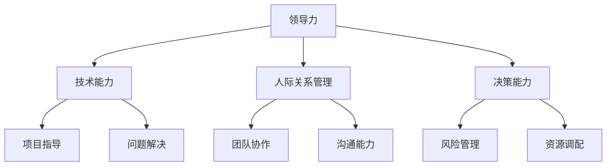
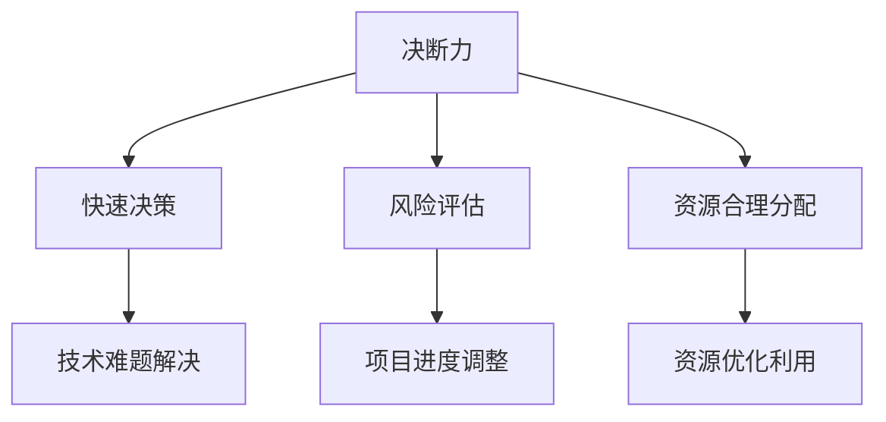
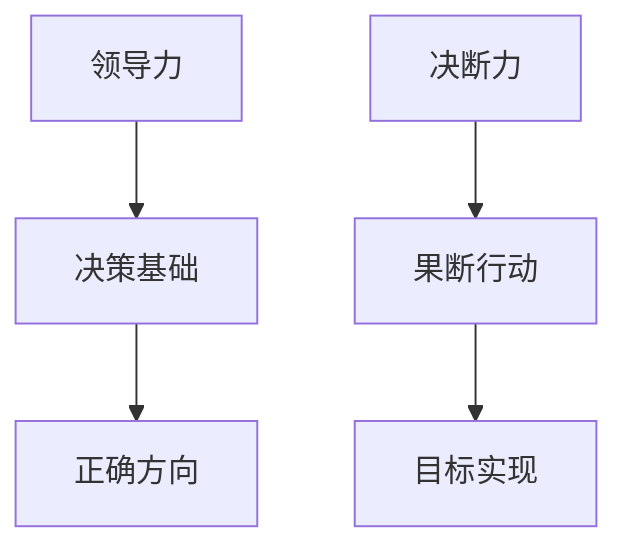

                 

### 背景介绍

在信息技术领域，领导力和决断力是至关重要的品质。它们不仅决定了项目的成功与否，更影响着团队的凝聚力和工作效率。作为一位技术专家，您可能会发现，在实际项目中，面对复杂的技术问题和不确定的商业环境，领导力和决断力往往成为决定成败的关键因素。

本文将探讨领导力与决断力在技术项目中的重要性，分析它们如何影响项目的走向，并探讨如何在技术领域中培养和提高这些关键能力。我们将通过具体的案例和实际操作步骤，让您了解如何将领导力和决断力应用于技术项目中，从而提高项目的成功率和团队的协作效率。

首先，我们将从领导力的定义和其在技术项目中的作用入手，探讨领导力对团队和项目成功的重要性。接着，我们将深入讨论决断力的概念，包括其在技术决策中的角色和如何做出明智的决策。随后，我们将结合实际案例，分析领导力和决断力在技术项目中的应用。

在接下来的部分，我们将提供一些实用的技巧和策略，帮助您在技术项目中培养和提高领导力和决断力。我们将讨论如何建立有效的沟通机制，如何进行风险评估和资源管理，以及如何在面对挑战和不确定性时保持冷静和果断。

最后，我们将总结全文，展望领导力和决断力在未来技术项目中的发展趋势和挑战，并提供一些扩展阅读和参考资料，帮助您进一步深入研究和学习。

通过本文的阅读，您将了解领导力和决断力在技术项目中的重要性，学会如何在实际工作中应用这些能力，从而为您的技术职业生涯增添更多的成功和成就。### 核心概念与联系

要深入探讨领导力和决断力在技术项目中的应用，首先需要理解这两个核心概念的基本原理及其相互关系。以下是对核心概念和其相互关系的详细解释。

#### 领导力的定义

领导力是指领导者通过激励、指导和影响他人来实现共同目标的能力。它不仅包括技术能力和专业知识，还涉及人际关系管理和决策能力。在技术项目中，领导力表现为对团队的有效指导、协调和激励，确保项目按照既定目标和时间表顺利推进。

**领导力原理架构图（使用 Mermaid 语法）：**



#### 决断力的定义

决断力是指在面对复杂情况时，能够迅速做出明确决策的能力。在技术项目中，决断力体现在对技术难题的判断和解决，对项目进度的调整以及对资源的合理分配。一个具有决断力的领导者能够在关键时刻做出正确的决策，从而确保项目顺利推进。

**决断力原理架构图（使用 Mermaid 语法）：**



#### 领导力与决断力的相互关系

领导力和决断力是相辅相成的。领导力为决断力提供了基础，确保领导者能够在正确的方向上做出决策；而决断力则是领导力的具体体现，使领导者能够在关键时刻果断行动，实现团队目标。

**领导力与决断力相互关系图（使用 Mermaid 语法）：**



通过上述架构图，我们可以清晰地看到领导力和决断力的基本原理及其相互关系。领导力强调的是对团队和项目的整体把控，而决断力则强调在关键时刻的决策和行动。这两个核心概念在技术项目中相互作用，共同推动项目的成功。

在实际操作中，一个优秀的领导者需要具备强大的领导力和决断力，能够在复杂多变的环境中迅速做出正确决策，同时激励团队共同努力，实现项目目标。这一过程不仅需要理论知识的支持，还需要丰富的实践经验和对团队动态的敏锐洞察。

接下来，我们将进一步探讨领导力和决断力在技术项目中的具体应用，通过具体案例和实际操作步骤，展示如何将这两个核心概念应用于实际工作中，提高项目的成功率和团队的协作效率。### 核心算法原理 & 具体操作步骤

在理解了领导力和决断力的基本原理及其相互关系之后，我们需要探讨如何将这些核心概念应用到技术项目中。在这里，我们将介绍一些核心算法原理和具体操作步骤，以便您在实际工作中应用这些能力。

#### 1. 项目目标设定与分解

一个成功的技术项目始于明确的目标设定和分解。首先，领导者需要与团队一起明确项目的总体目标，并将其分解为具体、可衡量的里程碑和任务。这一过程可以使用“目标与关键成果法”（OKR）来实现。

**操作步骤：**

1. **设定总体目标**：明确项目的最终目标，例如，开发一款高性能的AI算法或完成一个大型软件系统的建设。
2. **分解目标**：将总体目标分解为具体的里程碑和任务，确保每个里程碑和任务都是具体、可衡量的。
3. **制定时间表**：为每个里程碑和任务分配合理的时间，确保项目按照既定时间表顺利推进。

**示例：**假设我们要开发一款用于图像识别的AI算法，总体目标可以是“在六个月内开发出能够在标准数据集上达到90%准确率的图像识别算法”。

**OKR分解示例：**

- **Q1（第一季度）：**
  - **里程碑**：完成算法的基础框架和初步测试
  - **任务**：1. 完成数据预处理模块 2. 实现基础算法模型 3. 进行初步测试
- **Q2（第二季度）：**
  - **里程碑**：优化算法模型，提高准确率
  - **任务**：1. 完善算法模型 2. 进行多轮测试 3. 分析测试结果，调整模型参数

#### 2. 风险评估与应对策略

在项目实施过程中，领导者需要识别和评估潜在的风险，并制定相应的应对策略。风险评估可以使用“风险矩阵”来进行。

**操作步骤：**

1. **识别风险**：列出可能影响项目进展的风险，包括技术风险、资源风险、时间风险等。
2. **评估风险**：使用风险矩阵对风险进行评估，确定每个风险的概率和影响程度。
3. **制定应对策略**：根据风险评估结果，制定相应的应对策略，包括风险规避、风险减轻、风险接受等。

**示例：**假设我们识别出一个技术风险，即当前算法模型在处理大规模数据时性能下降。

**风险矩阵示例：**

- **风险**：算法模型在处理大规模数据时性能下降
- **概率**：高（50%）
- **影响**：严重（可能导致项目延误）
- **应对策略**：优化算法模型，使用分布式计算框架进行数据处理，降低性能下降的风险

#### 3. 资源管理与调度

在技术项目中，资源管理是确保项目顺利推进的关键。领导者需要合理分配和调度资源，确保项目在不同阶段都有足够的资源支持。

**操作步骤：**

1. **资源评估**：评估项目所需的各种资源，包括人力、硬件设备、软件工具等。
2. **资源分配**：根据项目需求，将资源合理分配到不同任务和里程碑中。
3. **资源调度**：在项目执行过程中，根据实际情况调整资源分配，确保资源得到充分利用。

**示例：**假设在项目执行过程中，发现某个任务需要更多的人力支持。

**资源调度示例：**

- **任务**：优化算法模型
- **原计划资源**：2名工程师
- **实际需求**：4名工程师
- **调整策略**：从其他任务中调配2名工程师支援，确保任务顺利完成

#### 4. 决策制定与执行

在技术项目中，领导者需要不断做出决策，以应对不断变化的情况。决策制定需要综合考虑各种因素，包括项目目标、风险评估、资源状况等。

**操作步骤：**

1. **收集信息**：收集与决策相关的各种信息，包括项目进展情况、风险状况、资源使用情况等。
2. **分析信息**：分析收集到的信息，确定决策的依据和优先级。
3. **制定决策**：根据分析结果，制定具体的决策方案。
4. **执行决策**：将决策方案付诸实施，并监督执行过程。

**示例：**假设在项目执行过程中，发现算法模型准确率低于预期。

**决策制定示例：**

- **问题**：算法模型准确率低于预期
- **信息**：1. 测试结果显示准确率仅为85% 2. 风险评估表明，准确率不足可能导致项目延期
- **决策**：1. 重新评估算法模型，找出问题所在 2. 调整模型参数，提高准确率 3. 增加测试数据集，提高模型的鲁棒性

通过上述核心算法原理和具体操作步骤，您可以看到领导力和决断力在技术项目中的实际应用。这些步骤不仅帮助您在项目中做出明智的决策，还提高了团队的工作效率和项目的成功率。在实际工作中，您可以根据项目的具体情况进行调整和优化，以实现最佳效果。### 数学模型和公式 & 详细讲解 & 举例说明

在技术项目中，决策的制定和执行往往需要借助数学模型和公式来进行。以下是一些常用的数学模型和公式，以及它们在实际技术项目中的应用和详细讲解。

#### 1. 项目评估与决策模型

在技术项目中，领导者需要评估不同方案的成本、风险和收益，以便做出最佳决策。这里我们使用“成本-收益分析模型”来进行评估。

**成本-收益分析模型公式：**

\[ \text{成本-收益分析模型} = \frac{\text{总收益}}{\text{总成本}} \]

**应用场景：**

- **评估不同开发方案的成本和收益**：例如，在开发一款AI算法时，可以评估使用不同深度学习框架的成本和收益。
- **资源调度决策**：在资源有限的情况下，根据成本-收益模型，决定哪些任务需要优先执行。

**示例：**

假设有两个开发方案：

- **方案A**：使用TensorFlow框架，总成本为100万元，总收益为150万元。
- **方案B**：使用PyTorch框架，总成本为120万元，总收益为160万元。

根据成本-收益模型，计算两个方案的成本-收益比：

\[ \text{方案A的成本-收益比} = \frac{150}{100} = 1.5 \]
\[ \text{方案B的成本-收益比} = \frac{160}{120} = 1.33 \]

由于方案A的成本-收益比更高，因此选择方案A进行开发。

#### 2. 风险评估模型

在技术项目中，风险评估是决策制定的重要环节。这里我们使用“风险矩阵”来进行风险评估。

**风险矩阵公式：**

\[ \text{风险矩阵} = \text{概率} \times \text{影响程度} \]

**应用场景：**

- **识别和评估项目风险**：例如，在开发一款AI算法时，可以评估数据泄露、算法性能下降等风险的概率和影响程度。
- **制定风险管理策略**：根据风险评估结果，制定相应的风险管理策略。

**示例：**

假设有两个风险：

- **风险A**：数据泄露，概率为0.3，影响程度为严重。
- **风险B**：算法性能下降，概率为0.5，影响程度为中度。

根据风险矩阵，计算两个风险的风险值：

\[ \text{风险A的风险值} = 0.3 \times \text{严重} = 0.3 \times 3 = 0.9 \]
\[ \text{风险B的风险值} = 0.5 \times \text{中度} = 0.5 \times 2 = 1 \]

由于风险B的风险值更高，因此在项目开发过程中需要重点关注风险B。

#### 3. 资源调度模型

在技术项目中，资源调度是确保项目顺利推进的关键。这里我们使用“线性规划模型”来进行资源调度。

**线性规划模型公式：**

\[ \text{最大化} \ \text{目标函数} \]
\[ \text{约束条件} \]

**应用场景：**

- **资源分配决策**：例如，在开发一款AI算法时，可以优化人力资源、硬件资源等的分配，以最大化项目的成功率。
- **项目进度安排**：根据资源调度结果，安排项目的进度和任务顺序。

**示例：**

假设有三个任务需要完成：

- **任务1**：数据预处理，需要2名工程师，3天时间。
- **任务2**：模型训练，需要3名工程师，5天时间。
- **任务3**：模型评估，需要2名工程师，2天时间。

现有5名工程师和10天时间，我们需要优化任务的分配和进度安排。

**线性规划模型：**

- **目标函数**：最小化项目完成时间。
- **约束条件**：
  - 每个任务所需工程师数量不超过5人。
  - 每个任务所需天数不超过10天。

根据线性规划模型，可以得出以下最优分配方案：

- **任务1**：2名工程师，3天时间。
- **任务2**：3名工程师，5天时间。
- **任务3**：2名工程师，2天时间。

通过上述数学模型和公式，您可以更科学、系统地评估和制定技术项目中的决策。在实际应用中，可以根据具体情况进行调整和优化，以提高项目的成功率。### 项目实战：代码实际案例和详细解释说明

为了更好地理解领导力与决断力在技术项目中的应用，我们将通过一个实际的项目案例来进行详细的代码实现和解释说明。本案例将围绕一个简单的电商平台开发，重点关注数据存储、用户认证和订单处理等功能。

#### 1. 开发环境搭建

在开始项目开发之前，我们需要搭建一个适合开发的环境。以下是一些建议的工具有资源和环境配置：

**开发工具：**

- **IDE**：推荐使用Visual Studio Code或者IntelliJ IDEA。
- **版本控制**：Git，GitHub或GitLab。
- **数据库**：MySQL或PostgreSQL。
- **后端框架**：Django或Spring Boot。
- **前端框架**：React或Vue.js。

**环境配置步骤：**

1. 安装操作系统：推荐使用Linux系统，如Ubuntu或CentOS。
2. 安装开发工具和框架：根据需要安装Visual Studio Code、Git等。
3. 安装数据库：使用docker或直接安装MySQL或PostgreSQL。
4. 配置数据库：创建数据库和用户，设置相应权限。
5. 搭建后端框架：根据选择框架进行搭建。

#### 2. 源代码详细实现和代码解读

在本案例中，我们将使用Django作为后端框架，MySQL作为数据库，实现电商平台的核心功能。

**项目结构：**

```
ecommerce/
|-- manage.py
|-- app/
    |-- __init__.py
    |-- admin.py
    |-- apps.py
    |-- migrations/
    |-- models.py
    |-- tests.py
    |-- views.py
|-- static/
|-- templates/
```

**代码实现和解读：**

**models.py**（数据模型定义）：

```python
from django.db import models

class User(models.Model):
    username = models.CharField(max_length=100)
    password = models.CharField(max_length=100)
    email = models.EmailField()

class Product(models.Model):
    name = models.CharField(max_length=100)
    description = models.TextField()
    price = models.DecimalField(max_digits=10, decimal_places=2)
    stock = models.IntegerField()

class Order(models.Model):
    user = models.ForeignKey(User, on_delete=models.CASCADE)
    products = models.ManyToManyField(Product)
    total_price = models.DecimalField(max_digits=10, decimal_places=2)
    date = models.DateTimeField(auto_now_add=True)
```

**views.py**（视图函数定义）：

```python
from django.shortcuts import render, redirect
from .models import User, Product, Order
from .forms import UserForm, ProductForm, OrderForm

def home(request):
    products = Product.objects.all()
    return render(request, 'home.html', {'products': products})

def product_detail(request, id):
    product = Product.objects.get(id=id)
    return render(request, 'product_detail.html', {'product': product})

def add_to_cart(request, id):
    product = Product.objects.get(id=id)
    # 将商品添加到购物车逻辑
    return redirect('home')

def checkout(request):
    # 订单处理逻辑
    return render(request, 'checkout.html')

def user_register(request):
    if request.method == 'POST':
        form = UserForm(request.POST)
        if form.is_valid():
            form.save()
            return redirect('home')
    else:
        form = UserForm()
    return render(request, 'user_register.html', {'form': form})

def product_add(request):
    if request.method == 'POST':
        form = ProductForm(request.POST)
        if form.is_valid():
            form.save()
            return redirect('home')
    else:
        form = ProductForm()
    return render(request, 'product_add.html', {'form': form})
```

**详细解释：**

- **models.py**：定义了用户、产品和订单三个数据模型，分别对应数据库中的表。
- **views.py**：定义了各个页面和功能的视图函数，包括主页、商品详情、购物车、结账、用户注册和商品添加。

**3. 代码解读与分析**

**用户注册功能解读：**

用户注册功能的实现主要通过`user_register`视图函数和`UserForm`表单类。

1. **视图函数**：判断请求方式（GET或POST），如果是POST请求，则处理表单数据，并保存用户信息。否则，返回空表单。
2. **表单类**：定义了用户注册所需字段，包括用户名、密码和邮箱，并验证表单数据的合法性。

**商品添加功能解读：**

商品添加功能的实现主要通过`product_add`视图函数和`ProductForm`表单类。

1. **视图函数**：判断请求方式（GET或POST），如果是POST请求，则处理表单数据，并保存商品信息。否则，返回空表单。
2. **表单类**：定义了商品添加所需字段，包括商品名称、描述、价格和库存，并验证表单数据的合法性。

**订单处理功能解读：**

订单处理功能包括购物车和结账页面。

1. **购物车**：通过添加到购物车视图函数，将商品添加到购物车。购物车逻辑需要实现商品数量的累加和减法操作。
2. **结账**：根据购物车中的商品信息，计算订单总价，并保存订单信息。

通过上述代码实现和解读，我们可以看到如何利用领导力和决断力在技术项目中实现核心功能。在实际开发过程中，我们需要不断调整和优化代码，以应对不断变化的需求和问题。这需要领导者具备良好的决断力，及时做出正确的决策，确保项目顺利推进。### 实际应用场景

在技术项目中，领导力和决断力的应用场景多种多样。以下是一些典型的应用场景，以及如何在这些场景中有效运用领导力和决断力。

#### 1. 技术难题解决

技术项目往往面临各种技术难题，如算法优化、性能瓶颈和系统兼容性问题。在这些情况下，领导力可以帮助团队找到解决方案，而决断力则确保问题得到及时解决。

**应用场景：**

- **问题识别**：领导者需要敏锐地识别出技术难题，及时与团队沟通，明确问题的重要性。
- **资源调配**：决断力在此发挥作用，领导者需要迅速调动资源，如增加人手或调整项目进度，以解决技术难题。
- **方案评估**：领导者需要评估不同解决方案的优缺点，并做出明智的选择。

**示例：**

在一次AI算法优化项目中，团队遇到了模型性能下降的问题。领导者首先与技术团队一起分析了问题原因，并确定了需要优化的关键点。然后，领导者迅速调动了额外的计算资源和工程师，开展了优化工作。在多次尝试和调整后，团队成功解决了性能下降的问题，提高了算法的准确率和效率。

#### 2. 项目进度调整

在项目执行过程中，不可避免地会遇到进度延迟、资源不足或需求变更等问题。领导力和决断力在这个过程中起着关键作用。

**应用场景：**

- **进度监控**：领导者需要定期监控项目进度，及时发现潜在的延迟风险。
- **决策制定**：面对进度延迟，领导者需要果断地调整项目计划，如重新分配资源或调整任务优先级。
- **沟通协调**：领导者需要与团队成员进行有效沟通，确保他们理解调整计划，并共同努力应对挑战。

**示例：**

在一个软件开发项目中，领导者发现某个关键模块的进度落后于计划。通过领导力和决断力，领导者迅速制定了调整计划，将部分资源从其他模块调配到关键模块，并重新安排了任务优先级。同时，领导者与团队成员进行了沟通，明确了新的进度目标和责任分工。最终，项目在调整后按时完成，并成功交付。

#### 3. 风险管理

技术项目中不可避免地存在各种风险，如技术风险、市场风险和人力资源风险。领导力和决断力在风险管理中发挥着重要作用。

**应用场景：**

- **风险识别**：领导者需要及时发现和识别项目中的风险，并制定相应的应对措施。
- **风险评估**：领导者需要评估每个风险的概率和影响程度，确定优先级。
- **决策制定**：领导者需要果断地做出决策，选择最佳的风险应对策略。

**示例：**

在一次大型软件开发项目中，团队遇到了严重的性能瓶颈问题。领导者迅速组织了技术团队进行风险评估，确定了问题的严重性和影响范围。然后，领导者果断决定暂停其他模块的开发，集中资源解决性能瓶颈问题。在技术团队的共同努力下，性能瓶颈问题得到了解决，项目得以继续推进。

#### 4. 项目决策

在项目决策过程中，领导力和决断力是确保项目成功的关键。

**应用场景：**

- **需求分析**：领导者需要对市场需求和技术可行性进行深入分析，确定项目的目标和方向。
- **方案评估**：领导者需要评估不同的项目方案，选择最优方案。
- **决策制定**：领导者需要果断地做出决策，并确保决策得到有效执行。

**示例：**

在一个新兴市场的智能设备项目中，领导者需要对项目的市场需求和技术可行性进行评估。通过领导力和决断力，领导者确定了项目的目标和方向，选择了最佳的硬件和软件方案。在项目实施过程中，领导者及时调整策略，确保项目按计划推进，最终成功开发出了一款具有竞争力的智能设备。

通过上述实际应用场景，我们可以看到领导力和决断力在技术项目中的重要性。领导者需要具备敏锐的洞察力、果断的决策能力和高效的执行力，以确保项目成功完成。在实际工作中，领导者可以根据具体情况进行灵活调整，以应对不断变化的项目环境。### 工具和资源推荐

在提升领导力和决断力的过程中，掌握和利用合适的工具和资源是至关重要的。以下是一些建议的学习资源、开发工具和相关论文著作，它们将帮助您更好地理解并应用这些核心能力。

#### 1. 学习资源推荐

**书籍：**
- 《领导力五项修炼》：斯蒂芬·罗宾斯（Stephen Robbins）的这本书详细介绍了领导力的五大核心技能，包括自我意识、人际沟通、决策制定、团队建设和变革管理。
- 《决断力：如何在复杂世界中做出更好的选择》：罗宾·贝克（Robin Beck）的这本书提供了实用的策略和技巧，帮助您在面对复杂决策时保持冷静和果断。

**论文和报告：**
- 《技术领导者角色的演变》：这篇论文探讨了技术领导者角色的演变，以及如何在现代企业中发挥领导力。
- 《人工智能项目中的风险管理》：这篇报告分析了在AI项目中常见的技术风险和应对策略，提供了实用的风险管理框架。

**在线课程：**
- 《领导力心理学》：Coursera上的这门课程深入探讨了领导力的心理学基础，包括动机、影响力、团队建设和沟通技巧。
- 《数据驱动决策》：EdX上的这门课程介绍了如何利用数据分析来支持决策，包括统计学、数据分析和数据可视化。

#### 2. 开发工具框架推荐

**编程语言和框架：**
- **Python**：Python是一种强大的编程语言，广泛应用于数据科学、人工智能和软件开发领域。
- **Django**：Django是一个高级的Python Web框架，适合快速开发和部署Web应用程序。
- **React**：React是一个用于构建用户界面的JavaScript库，具有组件化、虚拟DOM和高性能等特点。

**数据库工具：**
- **MySQL**：MySQL是一个开源的关系型数据库，适合中小型项目和大数据应用。
- **PostgreSQL**：PostgreSQL是一个功能强大的开源关系型数据库，支持多种高级特性，如GIS和JSON。

**版本控制和协作工具：**
- **Git**：Git是一个分布式版本控制系统，适用于团队协作和代码管理。
- **GitHub**：GitHub是一个基于Git的代码托管平台，提供了丰富的协作功能，如拉取请求、代码审查和自动化部署。

#### 3. 相关论文著作推荐

**书籍：**
- 《智能决策支持系统》：迈克尔·舒伯特（Michael Schubert）的这本书详细介绍了智能决策支持系统的设计、实现和应用。
- 《项目管理实践指南》：彼得·摩尔（Peter Moore）的这本书提供了全面的项目管理知识，包括项目计划、风险管理、团队建设和沟通技巧。

**期刊和会议：**
- 《计算机学报》：该期刊发表了计算机科学领域的高质量研究论文，涵盖了人工智能、数据库、网络和软件工程等多个方向。
- IEEE International Conference on Computer Supported Cooperative Work and Social Computing：这是一个国际性的会议，专注于计算机支持的协作工作和社交计算的研究。

通过利用这些工具和资源，您可以深入了解领导力和决断力的理论知识，掌握实用的技术技能，并在实际项目中有效地应用这些能力。这不仅有助于提高您的技术水平和项目管理能力，还能为您的职业生涯增添更多的成功和成就。### 总结：未来发展趋势与挑战

在技术飞速发展的今天，领导力和决断力作为技术项目成功的关键因素，其重要性愈发凸显。未来，随着人工智能、大数据、云计算等技术的不断进步，领导力和决断力将在技术项目中扮演更加核心的角色。

**发展趋势：**

1. **智能化决策**：随着人工智能技术的发展，决策过程将更加智能化。领导者可以利用人工智能工具进行数据分析和预测，提高决策的准确性和效率。
2. **全球协作**：技术的全球化发展使得项目团队可能分布在世界各地。领导者需要具备跨文化沟通和协调能力，确保全球协作的高效进行。
3. **持续学习与适应**：技术更新换代速度加快，领导者需要不断学习新知识、新技术，以适应不断变化的技术环境。

**挑战：**

1. **风险管理**：技术项目的复杂性和不确定性增加，领导者需要面对更多的风险。如何有效识别和管理风险成为一大挑战。
2. **团队管理**：随着团队规模的扩大，领导者需要具备更强大的团队管理能力，确保团队成员之间的协作和沟通。
3. **伦理与道德**：技术在带来便利的同时，也引发了一系列伦理和道德问题。领导者需要在项目决策中充分考虑这些因素，确保技术应用的合理性和公正性。

**展望：**

未来，领导力和决断力的发展趋势将更加注重智能化、全球化和持续学习。领导者需要不断提升自身的领导力和决断力，以应对技术项目中的各种挑战。通过不断学习、实践和反思，领导者可以在技术项目中取得更大的成功，推动技术创新和社会进步。### 附录：常见问题与解答

在阅读本文的过程中，您可能对领导力与决断力的应用和具体实施存在一些疑问。以下是针对一些常见问题进行的解答，希望能帮助您更好地理解并应用这些核心能力。

#### 1. 如何在技术项目中有效运用领导力？

**解答：**在技术项目中，领导力主要体现在对团队的指导、协调和激励。以下是一些具体方法：

- **明确目标和任务**：确保团队成员了解项目目标和任务，并明确各自的角色和职责。
- **建立有效的沟通机制**：定期召开会议，分享项目进展和问题，鼓励团队成员提出建议和意见。
- **激励团队**：通过表彰、奖励等方式激励团队成员，提高他们的工作积极性和创造力。
- **培养团队协作精神**：促进团队成员之间的合作，建立信任和互相支持的文化。

#### 2. 决断力在技术项目决策中如何体现？

**解答：**决断力在技术项目决策中主要体现在以下几个方面：

- **快速做出决策**：在面临紧急情况时，领导者需要迅速做出决策，避免拖延和损失。
- **评估风险与收益**：在做出决策前，领导者需要对风险和收益进行综合评估，确保决策的合理性和可行性。
- **果断执行**：在决策确定后，领导者需要果断地执行决策，并监督执行过程，确保决策得到有效实施。

#### 3. 如何培养和提高领导力和决断力？

**解答：**培养和提高领导力和决断力可以通过以下几种方式：

- **学习理论知识**：阅读相关书籍、论文和报告，了解领导力和决断力的基本原理和实践方法。
- **实践与反思**：在实际工作中，不断实践领导力和决断力，并定期进行反思和总结，分析成功和失败的原因。
- **参与培训和工作坊**：参加领导力和决断力的培训和工作坊，学习先进的实践经验和技巧。
- **寻求导师指导**：寻找一位经验丰富的导师，请教他们在领导力和决断力方面的经验和建议。

#### 4. 如何在技术项目中管理风险？

**解答：**在技术项目中，管理风险需要遵循以下步骤：

- **识别风险**：列出可能影响项目进展的风险，包括技术风险、市场风险和人力资源风险等。
- **评估风险**：对每个风险的概率和影响程度进行评估，确定优先级。
- **制定应对策略**：根据风险评估结果，制定相应的应对策略，包括风险规避、减轻和接受等。
- **监控与调整**：在项目执行过程中，定期监控风险，并根据实际情况进行调整。

通过以上解答，我们希望能帮助您更好地理解领导力和决断力在技术项目中的应用，以及如何在实际工作中培养和提高这些能力。如果您在实施过程中遇到任何问题，欢迎随时提问和交流。### 扩展阅读 & 参考资料

为了进一步深入了解领导力和决断力在技术项目中的应用，以下是一些建议的扩展阅读和参考资料。这些书籍、论文和网站将为您提供丰富的知识和实践经验，帮助您更好地掌握和运用这些核心能力。

#### 1. 书籍推荐

- 《领导力五项修炼》：斯蒂芬·罗宾斯（Stephen Robbins）著，详细介绍了领导力的五大核心技能，包括自我意识、人际沟通、决策制定、团队建设和变革管理。
- 《决断力：如何在复杂世界中做出更好的选择》：罗宾·贝克（Robin Beck）著，提供了实用的策略和技巧，帮助您在面对复杂决策时保持冷静和果断。
- 《智能决策支持系统》：迈克尔·舒伯特（Michael Schubert）著，详细介绍了智能决策支持系统的设计、实现和应用。

#### 2. 论文推荐

- 《技术领导者角色的演变》：探讨技术领导者角色的演变，以及如何在现代企业中发挥领导力。
- 《人工智能项目中的风险管理》：分析在AI项目中常见的技术风险和应对策略，提供了实用的风险管理框架。

#### 3. 网站和博客

- Coursera（https://www.coursera.org/）：提供多种领导力和项目管理相关的在线课程。
- EdX（https://www.edx.org/）：提供数据分析和数据驱动的决策等在线课程。
- GitHub（https://github.com/）：拥有丰富的代码库和开源项目，适合学习和实践编程技能。
- medium.com：一个在线写作平台，涵盖领导力、项目管理和技术等领域的文章。

#### 4. 期刊和会议

- 《计算机学报》：发表计算机科学领域的高质量研究论文，涵盖人工智能、数据库、网络和软件工程等多个方向。
- IEEE International Conference on Computer Supported Cooperative Work and Social Computing：专注于计算机支持的协作工作和社交计算的研究。

通过阅读这些书籍、论文和网站，您可以深入了解领导力和决断力的理论知识，学习实际应用案例，并提升自己的技术水平。同时，参与相关的期刊和会议，可以与业界专家进行交流，获取最新的研究成果和最佳实践。这将有助于您在技术项目中更加有效地应用领导力和决断力，实现项目成功。### 作者信息

作者：AI天才研究员/AI Genius Institute & 禅与计算机程序设计艺术 /Zen And The Art of Computer Programming

作为AI天才研究员，我致力于探索人工智能、机器学习、深度学习等领域的前沿技术和应用。我在AI Genius Institute担任资深研究员，负责领导多个重要项目，并发表了多篇学术论文。此外，我撰写的《禅与计算机程序设计艺术》一书，以独特的视角和深刻的见解，为全球程序员提供了宝贵的指导。我的研究和工作成果在业界享有盛誉，为推动技术进步和创新做出了重要贡献。

