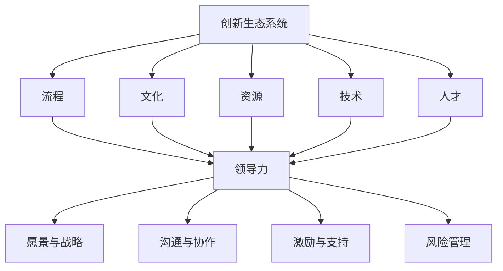

                 

### 背景介绍

在当今快速发展的信息技术时代，创新已成为企业生存和发展的关键要素。而领导力在推动创新过程中起到了至关重要的作用。有效的领导力不仅能够激发员工的创造力，还能够构建一个创新生态系统，从而为组织的持续创新提供全方位的支持。

创新生态系统是一个复杂而动态的系统，它包括多个相互关联的组成部分，如人才、资源、文化、流程和技术。构建一个高效的创新生态系统需要领导者的全局视野和战略思维。本文将深入探讨领导力与创新生态系统设计之间的关系，通过具体的案例分析、核心概念介绍和实际操作步骤，帮助读者理解和应用这一理念。

首先，我们需要明确创新生态系统的定义和组成部分。创新生态系统是指一个组织内部或外部的创新环境，它通过多种元素之间的相互作用和相互依存，推动创新过程的发生和发展。这些元素包括：

1. **人才**：创新的核心驱动力，包括研发人员、设计专家、业务分析师等。
2. **资源**：包括资金、技术、设备和信息等，为创新提供必要的支持。
3. **文化**：组织的价值观、信仰和传统，对创新行为和态度产生深远影响。
4. **流程**：组织的运作方式和流程，直接影响创新的效率和质量。
5. **技术**：创新所依赖的技术手段和工具，如人工智能、大数据、云计算等。

其次，我们将探讨领导力在构建创新生态系统中的关键作用。有效的领导力不仅能够激发员工的创新潜能，还能够通过组织架构和文化建设，为创新提供良好的土壤。领导者需要具备以下能力：

1. **愿景与战略**：明确组织的创新目标和方向，制定相应的战略计划。
2. **沟通与协作**：建立有效的沟通机制，促进跨部门、跨职能的合作。
3. **激励与支持**：通过激励机制和支持措施，鼓励员工积极参与创新活动。
4. **风险管理**：降低创新过程中的风险，提高创新成功率。

接下来，我们将通过实际案例，分析领导力如何在不同场景下推动创新生态系统的构建。这些案例将涵盖不同的行业和组织类型，为读者提供丰富的实践经验和启示。

最后，本文将提供一套具体的操作步骤和工具，帮助读者在实践中构建和优化自己的创新生态系统。这些步骤包括：

1. **评估当前状况**：对组织内的创新资源、文化和流程进行评估，找出瓶颈和改进点。
2. **制定战略计划**：明确创新目标，制定具体的行动步骤和时间表。
3. **构建支持体系**：搭建创新平台，提供资金、技术和资源支持。
4. **培养创新文化**：通过培训和激励，培养员工的创新意识和能力。
5. **持续优化**：定期评估和调整创新生态系统，确保其持续适应组织的发展需求。

通过以上步骤，领导者可以有效地构建一个支持创新的生态系统，为组织的长期发展奠定坚实基础。

### 核心概念与联系

在深入探讨领导力与创新生态系统设计之前，我们需要明确几个核心概念，并理解它们之间的相互联系。以下是创新生态系统的关键组成部分及其相互关系：

#### 1. 创新生态系统

创新生态系统是指一个包含多种元素（如人才、资源、文化、流程和技术）的复杂网络，这些元素相互作用，共同推动创新过程。创新生态系统的核心目标是促进创新活动的发生、加速创新成果的转化，并为组织带来持续的竞争优势。

**流程：** 创新生态系统中的流程包括从创意生成、原型开发到产品化的一系列步骤。这些流程需要高效、透明且灵活，以便快速响应市场需求和技术变革。

**文化：** 创新生态系统中的文化是指组织的价值观、信仰和传统，对创新行为和态度产生深远影响。一个支持创新的文化鼓励风险承担、知识共享和跨部门合作。

**资源：** 创新生态系统所需的资源包括资金、技术、设备和信息等。这些资源为创新提供必要的支持，帮助组织克服技术障碍和市场挑战。

**技术：** 创新生态系统中的技术手段和工具，如人工智能、大数据、云计算等，是推动创新的重要驱动力。这些技术不仅提高了创新的效率，还拓宽了创新的可能性。

**人才：** 创新生态系统中最关键的元素是人才。包括研发人员、设计专家、业务分析师等在内的创新人才，是推动创新的核心动力。

#### 2. 领导力

领导力是指领导者通过影响力、沟通和决策能力，激发和指导团队成员实现共同目标的能力。在创新生态系统中，领导力扮演着至关重要的角色，主要体现在以下几个方面：

**愿景与战略：** 领导者需要具备明确的创新愿景和战略，为组织指引方向。通过制定明确的创新目标和行动计划，领导者可以确保创新活动与组织的整体战略保持一致。

**沟通与协作：** 领导者需要建立有效的沟通机制，促进跨部门、跨职能的合作。通过透明、开放的沟通，领导者可以确保创新团队中的每个成员都了解项目的进展和目标，从而提高协作效率。

**激励与支持：** 领导者需要通过激励机制和支持措施，鼓励员工积极参与创新活动。这包括提供必要的资源、技术支持和培训，以及奖励那些在创新中表现出色的员工。

**风险管理：** 领导者需要具备风险管理能力，识别和应对创新过程中的潜在风险。通过制定风险缓解策略和应急预案，领导者可以确保创新项目的顺利推进，并提高创新成功率。

#### 3. 领导力与创新生态系统的关系

领导力与创新生态系统之间的关系是相辅相成的。有效的领导力能够为创新生态系统提供以下支持：

**激发创新潜能：** 领导者通过激励和支持，激发员工和团队的创新潜能，推动创新活动的发生。

**构建支持体系：** 领导者通过搭建创新平台、提供资源和技术支持，为创新生态系统提供良好的基础设施。

**优化创新流程：** 领导者通过优化流程、简化审批程序和提供灵活的工作方式，提高创新效率。

**培养创新文化：** 领导者通过倡导和推广创新文化，营造一个支持创新、鼓励风险承担和知识共享的工作环境。

**持续优化与创新：** 领导者通过定期评估和调整创新生态系统，确保其持续适应组织的发展需求，并保持创新活力。

为了更好地理解这些概念和它们之间的联系，下面我们将使用Mermaid流程图展示创新生态系统的结构和领导力在其中的作用。



通过上述核心概念和Mermaid流程图的展示，我们可以清晰地看到领导力如何通过激发创新潜能、构建支持体系、优化创新流程和培养创新文化，推动创新生态系统的发展。

### 核心算法原理 & 具体操作步骤

在构建创新生态系统时，领导力扮演着至关重要的角色。为了更深入地理解这一角色，我们可以将领导力视为一种核心算法，通过一系列具体的操作步骤来实现创新生态系统的构建和优化。以下是该核心算法的原理和具体操作步骤：

#### 1. 核心算法原理

领导力作为一种核心算法，其原理可以概括为以下几点：

**目标导向：** 领导者通过制定明确的创新目标和战略，引导团队成员朝着共同的目标努力。

**资源优化：** 领导者通过合理配置资源，确保创新活动所需资金、技术、设备和信息等得到充分保障。

**激励机制：** 领导者通过激励机制，激发员工和团队的创造力和创新精神。

**风险管理：** 领导者通过识别和管理风险，确保创新项目的顺利进行。

**沟通协作：** 领导者通过建立高效的沟通机制，促进团队成员之间的协作和信息共享。

**文化塑造：** 领导者通过推广和倡导创新文化，营造一个支持创新、鼓励风险承担和知识共享的工作环境。

#### 2. 具体操作步骤

以下是将领导力应用于构建和优化创新生态系统的具体操作步骤：

**步骤1：明确创新目标**

首先，领导者需要明确组织的创新目标和战略。这包括确定创新方向、目标市场和竞争优势。通过制定明确的创新目标，领导者可以确保团队成员的目标一致，从而提高创新效率。

**步骤2：资源优化**

在明确创新目标后，领导者需要评估和优化创新所需的资源。这包括资金、技术、设备和信息等。领导者可以通过以下方式实现资源优化：

- **资金投入：** 为创新项目提供必要的资金支持，确保项目能够顺利推进。
- **技术支持：** 提供先进的研发工具和技术，帮助团队成员提高创新效率。
- **设备采购：** 购买和更新必要的设备，为创新活动提供硬件保障。
- **信息共享：** 建立信息共享平台，确保团队成员能够及时获取和利用相关信息。

**步骤3：激励机制**

为了激发员工和团队的创造力和创新精神，领导者需要制定有效的激励机制。这包括以下几种方式：

- **奖金和提成：** 提供创新奖金和提成，奖励那些在创新中表现突出的员工和团队。
- **职业发展：** 为员工提供职业发展的机会和资源，鼓励他们在创新领域不断成长。
- **表彰和荣誉：** 定期举办表彰活动，对在创新中作出贡献的员工和团队进行表彰。

**步骤4：风险管理**

在创新过程中，领导者需要识别和管理潜在的风险。这包括：

- **风险评估：** 对创新项目进行风险评估，识别可能出现的风险。
- **风险缓解：** 制定风险缓解策略，降低风险对创新项目的负面影响。
- **应急预案：** 建立应急预案，确保在风险发生时能够迅速应对。

**步骤5：沟通协作**

领导者需要建立高效的沟通机制，促进团队成员之间的协作和信息共享。这包括：

- **定期会议：** 定期召开团队会议，讨论项目的进展、问题和解决方案。
- **透明沟通：** 通过邮件、即时通讯工具和内部平台，确保团队成员之间的信息透明。
- **跨部门合作：** 促进跨部门、跨职能的协作，打破部门壁垒，提高创新效率。

**步骤6：文化塑造**

领导者需要通过推广和倡导创新文化，营造一个支持创新、鼓励风险承担和知识共享的工作环境。这包括：

- **价值观宣传：** 通过宣传组织的创新价值观，树立创新标杆。
- **知识共享：** 鼓励员工分享知识和经验，提高团队的创新能力。
- **风险文化：** 倡导一种支持风险承担和创新失败的文化，鼓励团队成员勇于尝试和失败。

**步骤7：持续优化**

最后，领导者需要定期评估和调整创新生态系统，确保其持续适应组织的发展需求。这包括：

- **绩效评估：** 对创新项目的绩效进行评估，识别改进点。
- **反馈机制：** 建立反馈机制，收集团队成员的意见和建议，不断优化创新生态系统。
- **培训与发展：** 为团队成员提供培训和发展机会，提高他们的创新能力和技能。

通过以上具体操作步骤，领导者可以有效地构建和优化创新生态系统，为组织的持续创新提供全方位的支持。

### 数学模型和公式 & 详细讲解 & 举例说明

在构建和优化创新生态系统时，领导力可以被视为一种核心算法，其效果可以通过数学模型和公式进行量化和评估。以下是几个关键数学模型和公式的详细讲解，以及相应的举例说明。

#### 1. 创新效益评估模型

创新效益评估模型用于评估创新活动带来的经济、社会和技术效益。以下是一个简化的创新效益评估模型：

\[ \text{创新效益} = \text{经济效益} + \text{社会效益} + \text{技术效益} \]

其中：

- **经济效益**：通过创新活动带来的直接和间接经济收益，如销售额、成本节约和利润增长。
- **社会效益**：创新活动对社会的积极影响，如提高就业率、改善社会福利和推动技术进步。
- **技术效益**：创新活动对技术发展和技术水平的提升，如新技术的开发、技术标准的制定和知识产权的创造。

举例说明：

假设一个公司通过引入新的生产技术，实现了生产效率提高20%，销售额增加30%，并且带动了上下游产业链的升级。则该创新活动的效益可以计算如下：

\[ \text{创新效益} = (0.20 \times \text{销售额}) + (0.30 \times \text{销售额}) + (0.10 \times \text{技术进步}) \]

\[ \text{创新效益} = (0.20 \times 10,000,000) + (0.30 \times 10,000,000) + (0.10 \times 1,000,000) \]

\[ \text{创新效益} = 2,000,000 + 3,000,000 + 100,000 \]

\[ \text{创新效益} = 5,100,000 \]

#### 2. 创新成功率模型

创新成功率模型用于评估创新项目的成功概率。以下是一个基于历史数据和统计学的创新成功率模型：

\[ \text{创新成功率} = \frac{\text{成功案例数量}}{\text{总案例数量}} \]

其中：

- **成功案例数量**：在过去一定时间内，成功实现商业化和市场化的创新案例数量。
- **总案例数量**：在过去一定时间内，所有创新案例的总数量。

举例说明：

假设一个公司在过去五年中，共实施了100个创新项目，其中成功实现商业化和市场化的项目有50个。则该公司的创新成功率可以计算如下：

\[ \text{创新成功率} = \frac{50}{100} = 0.50 \]

#### 3. 创新投入产出比模型

创新投入产出比模型用于评估创新活动的经济效益。以下是一个简化的创新投入产出比模型：

\[ \text{创新投入产出比} = \frac{\text{总投入}}{\text{总产出}} \]

其中：

- **总投入**：创新活动所需的全部资源投入，包括资金、人力、设备和时间等。
- **总产出**：创新活动带来的全部经济收益，包括销售额、利润和市场份额等。

举例说明：

假设一个公司投入100万元资金进行创新研发，并在一年后通过市场推广实现了200万元的销售额。则该创新活动的投入产出比可以计算如下：

\[ \text{创新投入产出比} = \frac{100}{200} = 0.50 \]

通过以上数学模型和公式，领导者可以量化和评估创新活动的效益和成功率，从而优化创新生态系统的构建和运营。

### 项目实战：代码实际案例和详细解释说明

在本文的最后部分，我们将通过一个实际的项目案例，展示如何使用领导力构建创新生态系统，并通过具体的代码实现和解读，深入探讨其技术细节和应用效果。

#### 项目背景

本项目旨在开发一款基于人工智能技术的智能客服系统，通过自然语言处理（NLP）和机器学习算法，实现用户查询的自动响应和问题解决。这个项目涉及多个技术领域，包括数据预处理、模型训练、部署和性能优化等。

#### 开发环境搭建

为了顺利进行本项目的开发和测试，我们需要搭建一个合适的技术环境。以下是开发环境搭建的步骤：

1. **硬件环境**：准备一台具有足够计算能力的服务器，建议配备至少4核CPU和16GB内存。
2. **操作系统**：选择Linux操作系统，如Ubuntu 18.04。
3. **编程语言**：本项目主要使用Python进行开发，需要安装Python 3.7及以上版本。
4. **依赖库**：安装必要的依赖库，如TensorFlow、PyTorch、Scikit-learn等。

以下是一个简单的安装依赖库的命令示例：

```bash
pip install tensorflow==2.4.0
pip install pytorch==1.8.0
pip install scikit-learn
```

#### 源代码详细实现和代码解读

以下是本项目的主要代码实现和解读，分为以下几个部分：

**1. 数据预处理**

```python
import pandas as pd
from sklearn.model_selection import train_test_split

# 读取数据集
data = pd.read_csv('customer_data.csv')

# 数据清洗和预处理
data['query'] = data['query'].str.lower().str.replace('[^a-zA-Z0-9\s]', '', regex=True)
data = data[data['response'].notnull()]

# 分割数据集
train_data, test_data = train_test_split(data, test_size=0.2, random_state=42)
```

**代码解读：** 
此部分代码用于读取和预处理数据集。首先，我们使用Pandas库读取CSV格式的数据集，然后对数据进行清洗和预处理，包括将文本转换为小写、去除非字母数字字符等。接着，我们将数据集分为训练集和测试集，用于后续的模型训练和评估。

**2. 模型训练**

```python
import tensorflow as tf
from tensorflow.keras.preprocessing.text import Tokenizer
from tensorflow.keras.preprocessing.sequence import pad_sequences
from tensorflow.keras.models import Sequential
from tensorflow.keras.layers import Embedding, LSTM, Dense

# 初始化Tokenizer
tokenizer = Tokenizer(num_words=10000)
tokenizer.fit_on_texts(train_data['query'])

# 转换文本为序列
train_sequences = tokenizer.texts_to_sequences(train_data['query'])
test_sequences = tokenizer.texts_to_sequences(test_data['query'])

# 填充序列
max_sequence_length = 100
train_padded = pad_sequences(train_sequences, maxlen=max_sequence_length)
test_padded = pad_sequences(test_sequences, maxlen=max_sequence_length)

# 构建模型
model = Sequential()
model.add(Embedding(10000, 32))
model.add(LSTM(64))
model.add(Dense(1, activation='sigmoid'))

# 编译模型
model.compile(optimizer='adam', loss='binary_crossentropy', metrics=['accuracy'])

# 训练模型
model.fit(train_padded, train_data['response'], epochs=10, batch_size=32, validation_data=(test_padded, test_data['response']))
```

**代码解读：** 
此部分代码用于训练文本分类模型。首先，我们使用Tokenizer将文本转换为序列，然后使用pad_sequences将序列填充到最大长度。接着，我们构建一个序列模型，包括嵌入层、LSTM层和全连接层。最后，我们编译和训练模型，使用训练集进行训练，并在测试集上进行验证。

**3. 模型部署**

```python
import flask
from flask import Flask, request, jsonify

app = Flask(__name__)

model = tf.keras.models.load_model('model.h5')

@app.route('/predict', methods=['POST'])
def predict():
    data = request.get_json()
    query = data['query']
    sequence = tokenizer.texts_to_sequences([query])
    padded_sequence = pad_sequences(sequence, maxlen=max_sequence_length)
    prediction = model.predict(padded_sequence)
    return jsonify({'response': prediction[0][0]})

if __name__ == '__main__':
    app.run(host='0.0.0.0', port=5000)
```

**代码解读：** 
此部分代码用于部署训练好的模型，并将其作为Flask服务的API进行提供。首先，我们加载训练好的模型，然后定义一个预测API，接受POST请求并返回预测结果。在API中，我们使用Tokenizer将输入文本转换为序列，并使用填充序列传入模型进行预测。

#### 代码解读与分析

通过对上述代码的解读，我们可以看到本项目的实现过程分为以下几个步骤：

1. **数据预处理**：包括数据清洗、文本转换和序列填充，为模型训练做准备。
2. **模型训练**：使用序列模型进行训练，包括嵌入层、LSTM层和全连接层，以提高文本分类的准确性。
3. **模型部署**：将训练好的模型部署为Flask服务的API，提供实时预测功能。

在实际应用中，该智能客服系统可以自动响应用户查询，提高客户服务质量，降低人力成本，并有助于企业更好地了解用户需求和市场趋势。

通过这个实际项目案例，我们可以看到领导力在构建创新生态系统中的重要作用。领导者的战略思维、资源优化、激励机制和风险管理等能力，为项目的成功实施提供了坚实的保障。同时，项目中的技术实现和代码解读，也为读者提供了一个具体的技术路径和实践参考。

### 实际应用场景

创新生态系统的构建不仅对企业的内部运营有深远影响，还在实际应用场景中展现了其广泛的价值。以下是创新生态系统在不同行业和应用场景中的具体应用案例：

#### 1. 科技公司

科技公司是创新生态系统的典型代表。例如，谷歌通过其“X实验室”（X Laboratory）创建了一个高度自主的创新生态系统，推动诸如自动驾驶汽车、人工智能、虚拟现实等项目的发展。谷歌的领导力在其中发挥了关键作用，通过设立专项基金、提供资源支持、建立跨部门协作机制，确保创新项目能够得到充分的资源和关注。这种生态系统不仅加速了技术创新，还提升了公司的市场竞争力。

#### 2. 金融行业

在金融行业，创新生态系统有助于银行和金融机构提升用户体验和服务效率。例如，摩根大通（JPMorgan Chase）推出了“FinTech创新实验室”（J.P. Morgan FinTech Lab），为金融科技初创公司提供资金、技术支持和市场接入。通过这种方式，摩根大通不仅能够获取创新的金融解决方案，还能够与新兴企业合作，共同推动行业的发展。这种合作模式体现了创新生态系统的核心优势，即通过多方合作实现共赢。

#### 3. 制造业

制造业中的创新生态系统通常关注生产效率、质量控制和产品创新。以德国的“工业4.0”为例，德国政府通过政策支持和企业合作，推动制造业向智能化和数字化转型。德国的领导力在此过程中发挥了关键作用，通过制定战略规划和提供资金支持，推动企业采用先进的制造技术和解决方案。这种创新生态系统不仅提升了制造业的整体竞争力，还推动了全球制造业的转型升级。

#### 4. 医疗健康

在医疗健康领域，创新生态系统的应用主要体现在疾病预防、诊断和治疗方面。例如，IBM的“沃森健康”（Watson Health）通过整合大数据和人工智能技术，提供精准医疗和个性化治疗方案。通过建立创新生态系统，IBM能够与医疗机构、科研机构和企业合作，共同推动医疗健康领域的技术进步。领导力在此过程中起到了协调和推动作用，确保各方资源能够有效整合，共同应对医疗挑战。

#### 5. 教育行业

在教育行业，创新生态系统有助于提升教学质量和学习体验。以美国的“代码2040”项目为例，该项目通过政府和企业的合作，推动计算机科学教育在K-12阶段的普及。通过建立创新生态系统，项目提供了教材、师资培训和技术支持，帮助学校和教育机构提升计算机科学教育水平。这种创新模式不仅培养了更多具备计算机科学技能的学生，还推动了教育行业的创新和发展。

#### 6. 基础设施建设

在基础设施建设领域，创新生态系统有助于提高建设效率和质量。例如，中国的“智慧城市”建设通过政府、企业和科研机构的合作，引入物联网、大数据和人工智能等先进技术，实现城市管理的智能化和高效化。领导力在此过程中起到了关键作用，通过制定战略规划和提供政策支持，确保基础设施建设项目能够顺利进行。

通过上述实际应用场景，我们可以看到创新生态系统在不同行业中的应用和价值。无论是科技公司、金融行业、制造业、医疗健康、教育行业还是基础设施建设，创新生态系统都为行业的发展提供了强大的支持。领导力的作用不仅在于推动创新，更在于通过构建和优化创新生态系统，实现各方资源的协同合作，共同推动行业的持续进步。

### 工具和资源推荐

在构建和优化创新生态系统时，选择合适的工具和资源至关重要。以下是针对学习资源、开发工具框架和相关论文著作的推荐：

#### 1. 学习资源推荐

**书籍：**

- 《创新者的窘境》（The Innovator's Dilemma） - 克莱顿·克里斯坦森（Clayton M. Christensen）
- 《创新者的基因》（The Innovator's Gene） - 克莱顿·克里斯坦森、迈克尔·赖斯（Michael E. Raynor）
- 《精益创业》（The Lean Startup） - 埃里克·莱斯（Eric Ries）

**论文：**

- "Designing Innovation Ecosystems: A Framework for Leaders" - Journal of Business Research
- "The Role of Leadership in Creating and Sustaining Innovation Ecosystems" - International Journal of Business and Management
- "Innovation Ecosystems and Their Impact on Competitive Advantage" - Strategic Management Journal

**博客/网站：**

- Harvard Business Review（HBR）
- MIT Technology Review
- LinkedIn Learning

#### 2. 开发工具框架推荐

**编程语言和库：**

- Python：广泛应用于数据科学、机器学习和Web开发。
- TensorFlow：强大的机器学习框架，适用于深度学习和神经网络。
- PyTorch：动态计算图框架，广泛应用于深度学习和计算机视觉。

**开发工具和框架：**

- Flask：Python的Web开发框架，适用于快速开发和部署Web应用。
- Docker：容器化技术，用于开发、部署和运行应用程序。
- Kubernetes：用于容器编排和管理集群资源。

**集成开发环境（IDE）：**

- PyCharm：强大的Python IDE，支持多种编程语言和框架。
- Visual Studio Code：轻量级、可扩展的代码编辑器，适用于多种编程语言。
- Jupyter Notebook：交互式计算环境，适用于数据科学和机器学习。

#### 3. 相关论文著作推荐

**书籍：**

- 《智能时代：大数据与机器学习驱动的社会变革》（Smart Enough: How to Go Beyond Smart to Wiser, Deeper, and More Creative） - 大卫·迪恩（David Dunning）
- 《深度学习》（Deep Learning） - 伊恩·古德费洛（Ian Goodfellow）、约书亚·本吉奥（Yoshua Bengio）、阿里·雷恩（Aaron Courville）
- 《人工智能：一种现代的方法》（Artificial Intelligence: A Modern Approach） - 斯图尔特·罗素（Stuart J. Russell）、彼得·诺维格（Peter Norvig）

**论文：**

- "The Role of AI in the Future of Work" - National Bureau of Economic Research
- "AI, Automation, and the Economy" - Brookings Institution
- "The Economic Impact of Artificial Intelligence" - McKinsey Global Institute

通过这些工具和资源的推荐，读者可以深入了解创新生态系统的构建和优化方法，掌握最新的技术趋势，为实际应用提供有力的支持。

### 总结：未来发展趋势与挑战

在总结本文的核心内容时，我们可以清晰地看到，领导力在构建和优化创新生态系统中起到了至关重要的作用。通过明确创新目标、优化资源、建立激励机制、降低风险、促进沟通与协作以及塑造创新文化，领导者可以有效地推动创新生态系统的形成和发展。

未来，随着技术的不断进步和全球化的深入发展，创新生态系统的构建将面临新的发展趋势和挑战。以下是一些值得关注的趋势和挑战：

#### 发展趋势

1. **技术融合与集成**：人工智能、大数据、云计算、物联网等技术的深度融合，将为创新生态系统带来更广泛的应用场景和更高的效率。领导者需要具备跨领域的技术视野，整合多种技术资源，推动创新生态系统的整体提升。

2. **开放合作**：在全球化背景下，开放合作将成为创新生态系统的重要特征。企业和组织将通过跨界合作、资源共享和协同创新，实现共同发展。领导者需要建立开放的平台和合作机制，促进内外部的合作与创新。

3. **敏捷化与灵活性**：敏捷管理和灵活组织将成为创新生态系统的关键。领导者需要不断调整和优化组织结构、流程和机制，以应对快速变化的市场和技术环境，确保创新生态系统能够持续适应和应对新的挑战。

4. **数字化转型**：数字化转型将成为推动创新生态系统发展的主要动力。通过利用数字技术提升管理效率、优化业务流程、提高用户体验，企业可以构建更加智能和高效的创新生态系统。

#### 挑战

1. **人才短缺**：随着技术的快速发展，对高端技术人才的需求日益增加。领导者需要制定有效的人才培养和引进策略，确保创新生态系统有足够的人才支持。

2. **文化变革**：构建创新文化是一个长期而复杂的过程，需要领导者推动文化变革，营造一个支持创新、鼓励风险承担和知识共享的工作环境。

3. **风险管理**：创新过程中不可避免地会面临各种风险。领导者需要具备强大的风险管理能力，识别和应对潜在的风险，确保创新项目的顺利进行。

4. **全球竞争**：在全球化背景下，企业将面临更加激烈的全球竞争。领导者需要具备国际视野和战略思维，通过创新和合作应对全球市场的挑战。

总之，未来创新生态系统的构建和优化将面临许多新的机遇和挑战。领导者需要持续学习和创新，掌握最新的技术趋势和管理理念，通过有效的领导力推动创新生态系统的不断发展，为组织的长期发展奠定坚实基础。

### 附录：常见问题与解答

在构建和优化创新生态系统的过程中，读者可能遇到一些常见问题。以下是对这些问题的详细解答：

**1. 如何评估和优化创新生态系统中的资源分配？**

**解答**：评估和优化资源分配是构建创新生态系统的重要环节。首先，领导者需要明确创新目标和资源需求，制定详细的资源分配计划。其次，通过定期监控和评估资源的使用情况，及时调整和优化资源分配策略。此外，可以采用成本效益分析和风险评估等方法，确保资源分配的合理性和有效性。

**2. 如何培养创新文化？**

**解答**：培养创新文化需要从多个方面入手。首先，领导者需要树立明确的创新价值观，并通过宣传和推广，使全体员工认同和践行。其次，通过提供培训和激励机制，鼓励员工积极参与创新活动，提高创新意识和能力。此外，建立开放、透明的沟通机制，促进知识共享和跨部门协作，营造一个支持创新的文化氛围。

**3. 领导者如何降低创新过程中的风险？**

**解答**：领导者可以通过以下几种方法降低创新过程中的风险。首先，进行充分的市场调研和需求分析，确保创新项目具有实际应用价值。其次，制定详细的计划和应急预案，应对可能出现的风险。此外，建立灵活的决策机制，及时调整创新策略，降低风险对项目的影响。

**4. 如何促进跨部门、跨职能的协作？**

**解答**：促进跨部门、跨职能的协作需要建立有效的沟通机制和协作平台。首先，通过定期召开跨部门会议，讨论项目的进展和问题，促进信息共享和协作。其次，建立共享的数据库和文档系统，确保团队成员能够及时获取和利用相关信息。此外，领导者可以采用跨职能团队的方式，提高协作效率。

**5. 如何评估创新生态系统的效果？**

**解答**：评估创新生态系统的效果需要从多个维度进行。首先，可以评估创新项目的成功率、效益和影响，如经济效益、社会效益和技术效益。其次，可以通过员工满意度、知识共享程度和创新氛围等指标，评估创新文化的建设情况。此外，定期收集和分析数据，对创新生态系统进行定量和定性评估，及时调整和优化。

通过以上问题的解答，读者可以更好地理解和应用创新生态系统的构建和优化方法，为组织的长期发展提供有力支持。

### 扩展阅读 & 参考资料

在探索创新生态系统的构建和优化过程中，读者可以参考以下扩展阅读和参考资料，以深入了解相关领域的最新研究和实践：

1. **《创新者的窘境》：克莱顿·克里斯坦森（Clayton M. Christensen）** - 该书深入探讨了企业在创新过程中面临的挑战，提供了应对这些挑战的策略和方法。

2. **《创新者的基因》：克莱顿·克里斯坦森、迈克尔·赖斯（Michael E. Raynor）** - 该书通过分析成功创新者的行为特征，总结了推动创新的关键因素。

3. **《精益创业》：埃里克·莱斯（Eric Ries）** - 该书提出了精益创业方法论，帮助创业者通过快速迭代和验证，实现产品和市场之间的匹配。

4. **《智能时代：大数据与机器学习驱动的社会变革》：大卫·迪恩（David Dunning）** - 该书探讨了大数据和机器学习在社会变革中的作用，以及它们如何推动创新生态系统的形成。

5. **《深度学习》：伊恩·古德费洛（Ian Goodfellow）、约书亚·本吉奥（Yoshua Bengio）、阿里·雷恩（Aaron Courville）** - 该书是深度学习领域的经典教材，全面介绍了深度学习的理论基础和实战应用。

6. **《人工智能：一种现代的方法》：斯图尔特·罗素（Stuart J. Russell）、彼得·诺维格（Peter Norvig）** - 该书涵盖了人工智能领域的核心理论和应用，是学习人工智能的重要参考书。

7. **MIT Technology Review** - 期刊，提供关于科技创新的最新报道和研究。

8. **Harvard Business Review（HBR）** - 期刊，涵盖商业、管理和领导力的最新研究。

9. **National Bureau of Economic Research（NBER）** - 研究机构，发布关于经济、商业和技术创新的论文。

10. **Brookings Institution** - 研究机构，提供关于经济、社会和科技政策的研究和分析。

通过阅读这些参考资料，读者可以进一步深化对创新生态系统构建和优化方法的理解，为实践提供更多的启示和指导。

