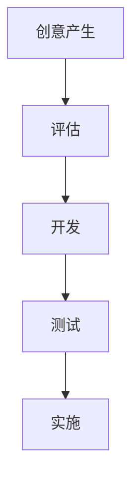

                 

# 领导力与创新管理：从创意到实施的全过程

## 摘要

本文旨在探讨领导力与创新管理在IT领域的重要性，并详细解析从创意到实施的全过程。文章首先介绍了领导力的核心概念和其在团队中的重要作用，然后分析了创新管理的流程，包括创意的产生、评估、开发、测试和实施。接着，通过一个实际案例展示了这些概念的应用，并讨论了在实施过程中可能遇到的问题和解决方案。最后，文章总结了未来发展趋势与挑战，并推荐了一些学习资源和开发工具。

## 1. 背景介绍

在当今快速发展的信息技术领域，领导力和创新管理已经成为企业和组织取得竞争优势的关键因素。随着技术的不断进步，市场竞争日益激烈，企业需要不断推陈出新，以适应不断变化的市场需求。在这个过程中，领导力不仅体现在技术层面，更体现在管理层面，即如何有效地激发团队的创造力，将创意转化为实际成果。

领导力是指导团队实现共同目标的能力，包括愿景、决策、沟通、激励等多个方面。创新管理则是将创新思维与实际操作相结合，通过系统化的方法将创意转化为可执行的项目。这两个概念相互关联，共同推动着企业的发展。

本文将首先介绍领导力的核心概念和其在团队中的作用，然后分析创新管理的流程，最后通过一个实际案例来展示这些概念的应用。

## 2. 核心概念与联系

### 领导力

领导力是一种能力，它能够激发团队成员的潜力，实现共同的目标。在IT领域，领导力的重要性不言而喻。首先，领导力能够帮助团队建立正确的价值观和目标，确保团队朝着正确的方向努力。其次，领导力能够提高团队的合作效率，通过有效的沟通和协调，使团队成员能够更好地协作。最后，领导力还能够激发团队成员的创新思维，鼓励他们不断探索新的解决方案。

领导力的核心概念包括：

1. **愿景**：领导力首先需要有一个清晰的愿景，这个愿景应该能够激励团队成员，让他们看到未来的发展方向。
2. **决策**：领导力在决策过程中起到关键作用，需要平衡各种因素，做出最优的选择。
3. **沟通**：领导力需要具备良好的沟通能力，能够与团队成员、上级和客户有效沟通。
4. **激励**：领导力需要能够激励团队成员，提高他们的工作积极性和创造力。

### 创新管理

创新管理是将创新思维与实际操作相结合的过程，它包括以下几个步骤：

1. **创意的产生**：创新管理始于创意的产生，可以通过头脑风暴、市场调研等方法来获取创意。
2. **评估**：对创意进行评估，确定其可行性、市场潜力等。
3. **开发**：将评估通过的创意进行开发，形成可执行的项目。
4. **测试**：对开发的项目进行测试，确保其符合预期。
5. **实施**：将项目投入实际应用，并进行持续优化。

创新管理的核心概念包括：

1. **创意的产生**：创新管理需要不断地激发创意，这可以通过创造一个开放、包容的环境来实现。
2. **评估**：评估是创新管理的关键环节，需要综合考虑各种因素，确保创意的可执行性。
3. **开发**：开发是将创意转化为实际产品的过程，需要团队协作、技术积累等。
4. **测试**：测试是验证创意是否有效的关键步骤，可以通过模拟、用户测试等方法进行。
5. **实施**：实施是将创意应用到实际业务中的过程，需要制定详细的实施计划。

### Mermaid 流程图



## 3. 核心算法原理 & 具体操作步骤

### 创意的产生

创意的产生是创新管理的第一步，它可以通过以下方法实现：

1. **头脑风暴**：通过集体讨论，激发团队成员的思维，产生大量的创意。
2. **市场调研**：通过了解市场需求，获取潜在的创意。
3. **用户反馈**：通过用户反馈，了解用户的需求和痛点，产生创意。

### 评估

评估是对创意进行可行性、市场潜力等评估的过程。具体步骤如下：

1. **确定评估标准**：根据企业的目标和市场需求，确定评估的标准。
2. **数据收集**：收集相关的数据，如市场趋势、用户需求等。
3. **分析数据**：对收集到的数据进行分析，评估创意的可行性。
4. **决策**：根据评估结果，决定是否继续开发。

### 开发

开发是将创意转化为实际产品的过程，具体步骤如下：

1. **需求分析**：明确产品的功能需求和用户需求。
2. **设计**：根据需求分析，设计产品的架构和界面。
3. **编码**：根据设计，编写产品的代码。
4. **测试**：对编码的产品进行测试，确保其符合需求。

### 测试

测试是验证创意是否有效的关键步骤，具体步骤如下：

1. **模拟测试**：在模拟环境中，测试产品的性能和稳定性。
2. **用户测试**：邀请用户进行测试，收集用户反馈。
3. **分析反馈**：对用户反馈进行分析，识别问题并进行修复。

### 实施

实施是将创意应用到实际业务中的过程，具体步骤如下：

1. **制定实施计划**：根据评估和测试的结果，制定详细的实施计划。
2. **培训员工**：对员工进行培训，确保他们了解产品的使用方法。
3. **部署产品**：将产品部署到实际环境中。
4. **持续优化**：根据用户反馈，持续优化产品。

## 4. 数学模型和公式 & 详细讲解 & 举例说明

在创新管理过程中，数学模型和公式可以用来评估创意的可行性。以下是一个简单的数学模型，用于评估创意的市场潜力。

### 市场潜力评估模型

$$
市场潜力 = 需求量 \times 价格
$$

其中：

- **需求量**：可以通过市场调研得到。
- **价格**：可以通过市场分析得到。

### 举例说明

假设一个创新创意是一个新的移动应用程序，通过分析市场需求，得到以下数据：

- **需求量**：1000单位/月
- **价格**：10美元/单位

将这些数据代入市场潜力评估模型，得到：

$$
市场潜力 = 1000 \times 10 = 10000 美元/月
$$

这意味着这个创新创意在一个月内的市场潜力为10000美元。

通过这个简单的数学模型，企业可以初步评估创意的市场潜力，从而决定是否继续开发。

## 5. 项目实战：代码实际案例和详细解释说明

### 开发环境搭建

在进行项目实战之前，我们需要搭建一个开发环境。以下是一个简单的Python开发环境搭建步骤：

1. **安装Python**：从Python官方网站下载并安装Python。
2. **安装IDE**：安装一个集成开发环境（IDE），如PyCharm或Visual Studio Code。
3. **安装依赖库**：根据项目需求，安装所需的依赖库，如NumPy、Pandas等。

### 源代码详细实现和代码解读

以下是一个简单的Python项目，用于实现一个简单的用户管理系统。

```python
import pandas as pd

class UserManager:
    def __init__(self, data_file):
        self.data = pd.read_csv(data_file)

    def add_user(self, user):
        self.data = self.data.append(user, ignore_index=True)

    def remove_user(self, user_id):
        self.data = self.data[self.data['user_id'] != user_id]

    def update_user(self, user_id, user):
        index = self.data[self.data['user_id'] == user_id].index[0]
        self.data.loc[index] = user

    def list_users(self):
        return self.data

# 创建用户管理对象
user_manager = UserManager('user_data.csv')

# 添加用户
user_manager.add_user({'user_id': 1, 'name': '张三', 'age': 30})

# 删除用户
user_manager.remove_user(1)

# 更新用户
user_manager.update_user(1, {'user_id': 1, 'name': '李四', 'age': 35})

# 列出用户
print(user_manager.list_users())
```

### 代码解读与分析

1. **类定义**：`UserManager` 类用于管理用户数据。
2. **初始化方法**：`__init__` 方法用于初始化用户数据。
3. **添加用户方法**：`add_user` 方法用于添加用户。
4. **删除用户方法**：`remove_user` 方法用于删除用户。
5. **更新用户方法**：`update_user` 方法用于更新用户。
6. **列出用户方法**：`list_users` 方法用于列出所有用户。

通过这个简单的项目，我们可以看到如何使用Python实现一个用户管理系统。在实际项目中，我们可以根据需求扩展这个系统，如添加权限管理、用户角色等。

## 6. 实际应用场景

在实际应用中，领导力和创新管理在IT领域的应用非常广泛。以下是一些具体的应用场景：

1. **产品开发**：领导力可以帮助团队明确产品目标，确保团队朝着正确的方向努力。创新管理则可以帮助团队将创意转化为实际的产品。
2. **项目实施**：领导力可以帮助项目经理有效地管理项目，确保项目按时交付。创新管理则可以帮助团队在项目实施过程中不断创新，提高项目效率。
3. **技术攻关**：在遇到技术难题时，领导力可以帮助团队保持积极的态度，共同解决问题。创新管理则可以帮助团队寻找新的解决方案。

## 7. 工具和资源推荐

### 学习资源推荐

1. **书籍**：
   - 《创新与企业家精神》（作者：彼得·德鲁克）
   - 《领导力的五项修炼》（作者：彼得·圣吉）
   - 《精益创业》（作者：埃里克·莱斯）
2. **论文**：可以通过Google Scholar等学术搜索引擎查找相关论文。
3. **博客**：许多专家和技术博客都分享了他们在领导力和创新管理方面的经验和见解。

### 开发工具框架推荐

1. **开发工具**：PyCharm、Visual Studio Code等。
2. **框架**：Django、Flask、Spring Boot等。

### 相关论文著作推荐

1. **《创新者的窘境》**（作者：克莱顿·克里斯滕森）
2. **《从优秀到卓越》**（作者：吉姆·柯林斯）
3. **《创新思维》**（作者：凯文·凯利）

## 8. 总结：未来发展趋势与挑战

### 发展趋势

1. **人工智能的广泛应用**：随着人工智能技术的发展，领导力和创新管理将更多地应用于人工智能领域，推动人工智能的创新和应用。
2. **数字化转型**：越来越多的企业将数字化转型作为战略重点，领导力和创新管理将在数字化转型过程中发挥重要作用。
3. **全球化**：全球化带来了更多的机遇和挑战，领导力和创新管理将帮助企业在全球范围内保持竞争力。

### 挑战

1. **技术更新速度快**：技术的快速发展带来了新的挑战，领导力和创新管理需要不断适应新技术，保持领先地位。
2. **人才竞争激烈**：优秀人才的竞争越来越激烈，领导力和创新管理需要吸引和留住优秀人才。
3. **可持续发展**：在追求创新的同时，也需要关注可持续发展，确保企业的长期发展。

## 9. 附录：常见问题与解答

### 问题1：领导力和创新管理在IT领域的重要性是什么？

**解答**：领导力在IT领域的重要性体现在以下几个方面：

1. **明确方向**：领导力可以帮助团队明确目标，确保团队朝着正确的方向努力。
2. **提高效率**：领导力可以有效地提高团队的工作效率，减少内耗。
3. **激发创新**：领导力可以激发团队成员的创新思维，推动技术进步。

创新管理在IT领域的重要性体现在以下几个方面：

1. **推动技术进步**：创新管理可以帮助企业不断推陈出新，保持技术领先地位。
2. **提高竞争力**：创新管理可以帮助企业应对市场变化，提高竞争力。
3. **持续发展**：创新管理可以帮助企业实现可持续发展，确保企业的长期发展。

### 问题2：如何有效地激发团队的创造力？

**解答**：以下是几种有效激发团队创造力的方法：

1. **创造一个开放的环境**：鼓励团队成员自由表达自己的想法，不拘泥于传统的思维方式。
2. **提供足够的资源**：确保团队有足够的资源和时间进行创新。
3. **奖励创新**：对提出创新想法的团队成员给予奖励，提高他们的积极性。
4. **鼓励团队合作**：通过团队合作，集思广益，产生更多的创意。

### 问题3：在实施创新过程中，如何确保创意的可执行性？

**解答**：以下是确保创意可执行性的几个关键步骤：

1. **充分调研**：在创意产生后，进行充分的市场调研和风险评估，确保创意的可行性。
2. **制定详细的实施计划**：在创意通过评估后，制定详细的实施计划，确保每个环节都有明确的目标和责任。
3. **持续优化**：在实施过程中，根据实际情况不断调整和优化，确保创意能够顺利实施。

### 问题4：领导力和创新管理如何应对快速变化的市场环境？

**解答**：以下是领导力和创新管理应对快速变化市场环境的几个策略：

1. **保持敏锐的洞察力**：领导力需要具备敏锐的洞察力，及时了解市场变化，调整战略。
2. **灵活调整**：在市场变化时，领导力需要灵活调整，确保团队能够迅速适应。
3. **持续创新**：通过不断创新，保持技术领先地位，应对市场变化。

## 10. 扩展阅读 & 参考资料

1. **《领导力与创新管理》**（作者：约翰·P·科特）
2. **《创新者的DNA》**（作者：史蒂芬·科特勒）
3. **《创新与企业家精神》**（作者：彼得·德鲁克）
4. **《人工智能：一种现代方法》**（作者：Stuart Russell & Peter Norvig）
5. **《数字化的未来：企业如何应对数字化转型的挑战》**（作者：韩都衣舍）

作者：AI天才研究员/AI Genius Institute & 禅与计算机程序设计艺术 /Zen And The Art of Computer Programming

