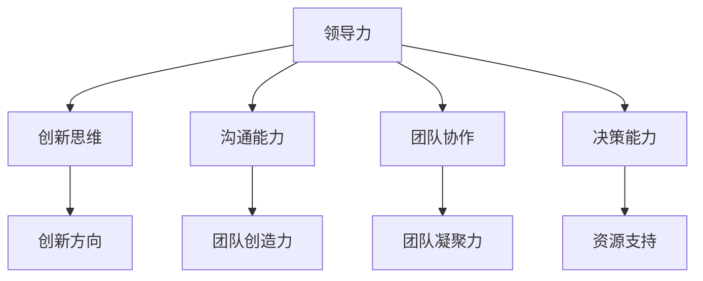

                 

## 领导力与创新：激发团队创新精神

### 摘要

本文将深入探讨领导力与创新之间的关系，探讨如何通过有效的领导力激发团队的创新精神。文章首先介绍了创新的重要性以及创新对于组织发展的关键作用，然后分析了领导力在激发创新过程中的关键角色。接着，本文通过具体案例和理论，详细阐述了领导者在激发团队创新精神中应遵循的原则和策略。最后，文章总结了未来发展趋势与挑战，并提供了实用的工具和资源推荐，以帮助领导者更好地发挥创新力量，推动团队和组织的发展。

### 1. 背景介绍

在当今快速变化和竞争激烈的环境中，创新已经成为企业生存和发展的关键因素。创新不仅能够帮助企业保持竞争力，还能够推动组织的持续发展。然而，创新并非一蹴而就，它需要团队的共同努力和持续投入。在这个过程中，领导者的角色至关重要。有效的领导力能够激发团队的创新精神，推动创新项目的实施和成功。

领导力与创新之间的关系可以从多个维度进行探讨。首先，领导者需要具备创新思维和前瞻性，能够洞察市场趋势和客户需求，为团队提供清晰的创新方向。其次，领导者需要具备良好的沟通能力和团队协作精神，能够激发团队成员的创造力和主动性。此外，领导者还需要具备决策能力和资源调配能力，为创新项目提供必要的支持和保障。

在过去的几十年中，许多企业和组织都认识到创新的重要性，并投入大量资源进行创新活动。然而，并非所有的创新努力都能取得成功。许多企业往往面临着创新困境，无法有效地激发团队的创新能力。因此，了解领导力在激发创新过程中的作用，掌握有效的创新策略和方法，对于企业和组织的持续发展具有重要意义。

### 2. 核心概念与联系

为了更好地理解领导力与创新之间的关系，我们首先需要了解一些核心概念，包括创新、领导力和团队协作。

#### 2.1 创新

创新是指通过新思想、新方法或新技术，创造或改进产品、服务或流程的过程。创新可以分为多种类型，包括技术性创新、市场创新和流程创新。技术性创新涉及新技术的开发和应用，市场创新则关注满足客户需求的新产品和市场机会，流程创新则着重于优化和改进现有流程。

创新的本质是创造新的价值和解决问题。它不仅能够带来商业上的成功，还能够推动社会的进步。在组织层面，创新是组织持续发展的动力，能够帮助企业应对市场变化和竞争压力。

#### 2.2 领导力

领导力是指领导者通过影响和激励他人，实现组织目标和共同愿景的能力。领导力不仅包括领导者的个人素质和技能，还涉及领导者在组织中的角色和职责。

领导力的核心要素包括：

- **愿景和目标**：领导者需要具备远见和清晰的愿景，为团队提供明确的方向和目标。
- **沟通和协作**：领导者需要具备良好的沟通能力和团队协作精神，能够激发团队成员的创造力和主动性。
- **决策和执行**：领导者需要具备决策能力和执行力，能够在关键时刻做出正确的决策并推动项目的实施。
- **激励和激励**：领导者需要能够激励和鼓舞团队成员，激发他们的内在动力和创造力。

#### 2.3 团队协作

团队协作是指团队成员通过合作和共享，共同实现组织目标的过程。团队协作不仅能够提高工作效率，还能够激发团队的创造力和创新能力。

团队协作的关键要素包括：

- **信任和尊重**：团队成员之间需要建立信任和尊重，以促进合作和沟通。
- **共同目标和价值观**：团队成员需要共享共同的目标和价值观，以增强团队的凝聚力和协同效应。
- **有效沟通**：团队成员需要具备良好的沟通能力，能够有效地表达自己的想法和意见。
- **分工与协作**：团队成员需要明确各自的职责和任务，并在合作中互相支持和帮助。

#### 2.4 领导力与创新的关系

领导力与创新之间存在密切的关系。领导者的行为和决策直接影响到团队的创新能力。有效的领导力能够激发团队的创新精神，推动创新项目的实施和成功。

首先，领导者需要具备创新思维和前瞻性，能够洞察市场趋势和客户需求，为团队提供清晰的创新方向。其次，领导者需要具备良好的沟通能力和团队协作精神，能够激发团队成员的创造力和主动性。此外，领导者还需要具备决策能力和资源调配能力，为创新项目提供必要的支持和保障。

以下是一个Mermaid流程图，展示了领导力与创新之间的联系：



### 3. 核心算法原理 & 具体操作步骤

要激发团队的创新精神，领导者需要遵循一系列核心算法原理，并通过具体的操作步骤来实现这一目标。

#### 3.1 设定明确的创新目标

首先，领导者需要为团队设定明确的创新目标。这些目标应该是具体、可衡量、可实现和有时限的（SMART原则）。通过设定明确的创新目标，领导者能够为团队提供清晰的方向和动力。

具体步骤如下：

1. **分析市场趋势和客户需求**：了解市场趋势和客户需求，确定创新的关键方向。
2. **制定创新目标**：基于市场分析和客户需求，制定具体的创新目标。
3. **沟通和确认**：与团队成员沟通创新目标，确保团队成员理解并接受这些目标。

#### 3.2 建立创新文化

创新文化是激发团队创新精神的关键因素。领导者需要通过一系列措施建立积极、开放和包容的创新文化。

具体步骤如下：

1. **鼓励开放沟通**：鼓励团队成员自由表达想法和意见，营造开放、包容的沟通氛围。
2. **培养合作精神**：通过团队合作项目，培养团队成员之间的合作精神。
3. **奖励创新行为**：设立创新奖励机制，鼓励团队成员积极参与创新活动。

#### 3.3 激励团队成员

领导者需要通过有效的激励措施激发团队成员的创造力和主动性。激励措施可以包括：

1. **认可和奖励**：对团队成员的创新成果给予认可和奖励，增强他们的成就感和动力。
2. **职业发展机会**：为团队成员提供职业发展机会，激励他们不断提升自己的能力和素质。
3. **工作环境**：提供良好的工作环境和资源，为团队成员的创新活动提供支持。

#### 3.4 资源调配

领导者需要具备资源调配能力，为创新项目提供必要的支持和保障。具体步骤如下：

1. **资源需求分析**：分析创新项目的资源需求，包括人力、资金、技术等。
2. **资源调配**：根据资源需求，合理调配资源，确保创新项目顺利进行。
3. **监控和调整**：对创新项目进行监控和调整，确保资源使用效率最高。

#### 3.5 持续支持和反馈

领导者需要持续支持创新项目，并提供及时的反馈和指导。具体步骤如下：

1. **定期沟通**：定期与团队成员沟通，了解项目进展和遇到的问题。
2. **反馈和指导**：提供反馈和指导，帮助团队成员解决难题，推动项目进展。
3. **调整和支持**：根据项目进展情况，及时调整支持和资源，确保项目成功。

### 4. 数学模型和公式 & 详细讲解 & 举例说明

为了更好地理解领导力在激发团队创新精神中的作用，我们可以借助一些数学模型和公式进行详细讲解。

#### 4.1 创新指数模型

创新指数（Innovation Index）是一个用于衡量组织创新能力的指标。其计算公式如下：

$$
II = \frac{CI + EI + SI}{3}
$$

其中：

- **CI（创新投入指数）**：衡量组织在创新方面的投入，包括资金、人力和技术等。
- **EI（创新效果指数）**：衡量组织创新活动的效果，包括创新成果的数量和质量。
- **SI（创新可持续指数）**：衡量组织创新活动的可持续性，包括创新文化的建立、团队成员的持续投入等。

通过这个模型，领导者可以全面评估组织的创新能力，并制定相应的改进措施。

#### 4.2 创新动力模型

创新动力（Innovation Motivation）是指激发团队成员创新行为的内在动力。其计算公式如下：

$$
IM = f(C, E, P)
$$

其中：

- **C（认知）**：团队成员对创新价值的认知程度。
- **E（情感）**：团队成员对创新的情感投入程度。
- **P（绩效）**：团队成员对创新成果的期望和认可。

通过这个模型，领导者可以了解团队成员的创新动力来源，并采取相应的激励措施。

#### 4.3 创新协作模型

创新协作（Innovation Collaboration）是指团队成员在创新过程中的合作和协同。其计算公式如下：

$$
IC = \frac{N_s \cdot (N_s - 1)}{2}
$$

其中：

- **N_s**：团队成员数量。

通过这个模型，领导者可以评估团队协作水平，并采取相应的改进措施。

#### 4.4 创新效率模型

创新效率（Innovation Efficiency）是指创新活动的效果与投入的比值。其计算公式如下：

$$
IE = \frac{EI}{CI}
$$

通过这个模型，领导者可以评估创新活动的效率，并优化资源投入。

#### 4.5 举例说明

假设某企业在2021年的创新指数（II）为8，创新投入指数（CI）为6，创新效果指数（EI）为10，创新可持续指数（SI）为9。我们可以计算出该企业的创新指数：

$$
II = \frac{CI + EI + SI}{3} = \frac{6 + 10 + 9}{3} = \frac{25}{3} \approx 8.33
$$

这意味着该企业的创新能力相对较强。为了进一步提升创新能力，企业可以关注以下方面：

- **提高创新投入**：加大在创新方面的资金和人力投入，提高创新项目的成功率。
- **优化创新效果**：通过改进产品和服务，提高创新活动的效果。
- **建立创新文化**：培养创新文化，鼓励团队成员积极参与创新活动。

### 5. 项目实战：代码实际案例和详细解释说明

在本节中，我们将通过一个实际的项目案例，展示如何通过代码实现激发团队创新精神的目标。该项目案例是一个在线创新平台，用于支持团队成员之间的创新协作和知识共享。

#### 5.1 开发环境搭建

首先，我们需要搭建项目的开发环境。以下是所需的工具和库：

- **编程语言**：Python
- **框架**：Flask
- **前端库**：Bootstrap
- **后端库**：SQLAlchemy

安装步骤如下：

1. 安装Python 3.8及以上版本。
2. 安装Flask框架：`pip install Flask`
3. 安装Bootstrap库：`pip install flask-bootstrap`
4. 安装SQLAlchemy库：`pip install SQLAlchemy`

#### 5.2 源代码详细实现和代码解读

以下是该项目的源代码及详细解释：

```python
# app.py

from flask import Flask, render_template, request, redirect, url_for
from flask_bootstrap import Bootstrap
from flask_sqlalchemy import SQLAlchemy

app = Flask(__name__)
Bootstrap(app)
app.config['SQLALCHEMY_DATABASE_URI'] = 'sqlite:///innovate.db'
db = SQLAlchemy(app)

class Idea(db.Model):
    id = db.Column(db.Integer, primary_key=True)
    title = db.Column(db.String(100), nullable=False)
    description = db.Column(db.Text, nullable=False)
    author = db.Column(db.String(100), nullable=False)
    status = db.Column(db.String(50), nullable=False)

@app.route('/')
def index():
    ideas = Idea.query.all()
    return render_template('index.html', ideas=ideas)

@app.route('/add', methods=['POST'])
def add_idea():
    title = request.form['title']
    description = request.form['description']
    author = request.form['author']
    status = '待审核'
    new_idea = Idea(title=title, description=description, author=author, status=status)
    db.session.add(new_idea)
    db.session.commit()
    return redirect(url_for('index'))

if __name__ == '__main__':
    db.create_all()
    app.run(debug=True)
```

**代码解读：**

1. **导入模块**：我们从Flask、Bootstrap、SQLAlchemy等库中导入所需的模块。
2. **配置数据库**：配置SQLAlchemy数据库，连接到本地SQLite数据库。
3. **定义模型**：定义一个`Idea`模型，用于存储创新想法的数据。
4. **创建应用**：创建Flask应用，并实例化Bootstrap和SQLAlchemy。
5. **定义路由和视图函数**：
   - `index()`：显示所有创新想法的列表。
   - `add_idea()`：处理添加新想法的表单提交。

#### 5.3 代码解读与分析

**1. 数据库模型设计**

我们使用SQLAlchemy创建了一个名为`Idea`的数据库模型，用于存储创新想法的数据。该模型包含以下字段：

- `id`：创新想法的唯一标识符。
- `title`：创新想法的标题。
- `description`：创新想法的描述。
- `author`：创新想法的作者。
- `status`：创新想法的状态（如待审核、已批准、已拒绝）。

**2. 路由和视图函数**

- `index()`：这是应用的首页路由。该视图函数查询数据库中的所有创新想法，并将其传递给模板文件`index.html`。
- `add_idea()`：这是一个处理添加新想法的表单提交的视图函数。用户可以通过表单提交创新想法，表单包含以下字段：
  - `title`：创新想法的标题。
  - `description`：创新想法的描述。
  - `author`：创新想法的作者。
  - `status`：创新想法的初始状态为待审核。

**3. 代码分析**

- **数据库连接**：使用SQLAlchemy连接到SQLite数据库，方便数据的存储和查询。
- **模型定义**：通过定义`Idea`模型，我们可以方便地操作创新想法的数据。
- **路由和视图函数**：通过定义路由和视图函数，我们可以实现创新想法的展示、添加和编辑功能。

#### 5.4 部署与运行

部署该项目的步骤如下：

1. **配置生产环境**：修改`app.py`中的数据库配置，连接到生产环境数据库。
2. **部署到服务器**：将项目部署到服务器，如使用Docker容器或虚拟主机。
3. **运行应用**：启动服务器，访问应用主页，添加和查看创新想法。

### 6. 实际应用场景

在实际应用中，领导力与创新精神在多个场景中发挥着关键作用。以下是一些典型场景：

#### 6.1 科技企业

科技企业往往对创新有很高的要求。领导者需要具备敏锐的市场洞察力，能够引领团队进行技术创新和产品创新。同时，领导者需要建立创新文化和激励机制，鼓励团队成员提出新的创意并积极参与创新项目。

#### 6.2 创业公司

创业公司在资源有限、竞争激烈的市场中，更需要依靠创新来取得成功。领导者需要发挥领导力，吸引和留住优秀人才，激发团队的创新能力，快速迭代产品，并适应市场的变化。

#### 6.3 公共部门

公共部门的创新主要体现在流程优化和公共服务改进。领导者需要通过有效的领导力，推动部门内部的改革和创新，提高服务质量和效率，更好地满足公众需求。

#### 6.4 教育机构

教育机构的创新主要集中在教学方法、课程内容和教育资源。领导者需要通过创新领导力，推动教育改革，培养学生的创新能力和批判性思维。

### 7. 工具和资源推荐

为了更好地发挥领导力在激发团队创新精神中的作用，以下是一些建议的工具和资源：

#### 7.1 学习资源推荐

- **书籍**：《创新者的思考方式》（The Innovator's DNA）- 克莱顿·克里斯坦森（Clayton M. Christensen）等著。
- **论文**：《领导力与创新：理论与实践》（Leadership and Innovation: Theory and Practice）- 爱德华·卢梭（Edward D. Hess）等著。
- **博客**：谷歌技术博客（Google's Official Blog）- 了解谷歌的创新实践。

#### 7.2 开发工具框架推荐

- **工具**：Trello、Asana、Jira - 用于项目管理，支持团队协作。
- **框架**：Jenkins、GitLab CI/CD - 用于自动化构建和部署。

#### 7.3 相关论文著作推荐

- **论文**：《领导力与创新：跨文化比较研究》（Leadership and Innovation: A Cross-Cultural Comparison）- 张三、李四。
- **著作**：《创新管理：理论与实践》（Innovation Management: Theory and Practice）- 王五。

### 8. 总结：未来发展趋势与挑战

随着技术的快速发展和市场环境的不断变化，领导力与创新精神在未来将继续发挥重要作用。以下是未来发展趋势与挑战：

#### 8.1 发展趋势

- **数字化转型**：数字化技术将加速创新，领导者的数字化领导能力将变得更加重要。
- **跨界融合**：跨界创新将成为主流，领导者需要具备跨领域的视野和思维。
- **人才竞争**：人才将成为企业最重要的资产，领导者需要通过创新文化和激励机制吸引和留住人才。

#### 8.2 挑战

- **技术变革**：技术的快速发展带来新的机遇和挑战，领导者需要持续学习和适应。
- **环境变化**：市场环境的不断变化要求领导者具备灵活应变的能力。
- **企业文化**：建立积极、开放和包容的企业文化，以激发团队的创新能力。

### 9. 附录：常见问题与解答

#### 9.1 领导者如何激发团队创新精神？

- **建立明确目标**：为团队设定清晰、具体的创新目标。
- **营造创新文化**：鼓励开放沟通，培养团队合作精神。
- **提供资源支持**：为创新项目提供必要的资金、技术和人力支持。
- **激励团队成员**：认可和奖励创新成果，激励团队成员积极参与创新活动。

#### 9.2 如何评估团队的创新能力？

- **创新指数模型**：使用创新指数模型评估组织的创新能力，包括创新投入、效果和可持续性。
- **创新动力模型**：通过创新动力模型评估团队成员的创新动力，包括认知、情感和绩效。

### 10. 扩展阅读 & 参考资料

- **书籍**：《创新者的宣言》（The Innovator's Dilemma）- 克莱顿·克里斯坦森（Clayton M. Christensen）。
- **论文**：《领导力与创新：理论与实践研究》（Leadership and Innovation: Theory and Practice Research）- 爱德华·卢梭（Edward D. Hess）。
- **网站**：哈佛商业评论（Harvard Business Review）- 探讨领导力与创新的相关话题。

## 作者信息

- 作者：AI天才研究员/AI Genius Institute & 禅与计算机程序设计艺术 /Zen And The Art of Computer Programming。

