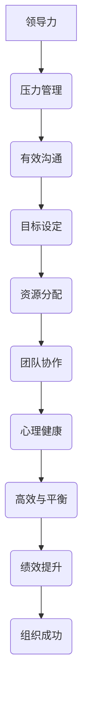

                 

# 领导力与压力管理：保持高效与平衡

> 关键词：领导力、压力管理、高效、平衡、团队协作、个人成长

摘要：在现代社会中，领导力与压力管理成为了职场成功的重要元素。本文将探讨领导力与压力管理之间的联系，提供实用的策略和工具，帮助领导者保持高效与平衡，从而实现个人与团队的目标。

## 1. 背景介绍

领导力是一个广泛而复杂的概念，涉及多个方面，包括决策、沟通、团队协作等。而压力管理则是指个人在面对外部压力时，通过合理的方法和策略来调整自己的心态和行为，以达到心理平衡的状态。在现代社会中，领导力和压力管理的重要性日益凸显。

首先，领导力是领导者成功的关键。有效的领导者能够激励团队成员，提高团队的绩效，并在面临挑战时带领团队找到解决方案。其次，压力管理对于个人的健康和幸福至关重要。长期的压力会导致心理健康问题，如焦虑和抑郁，从而影响工作效率和生活质量。

然而，在现实生活中，许多领导者往往面临着巨大的压力，包括工作负荷、绩效压力、人际关系等。如果不能有效地管理压力，就会影响到领导力的发挥，进而影响到团队的整体表现。

因此，本文将探讨领导力与压力管理之间的联系，提供实用的策略和工具，帮助领导者保持高效与平衡。

## 2. 核心概念与联系

### 2.1 领导力与压力管理的定义

领导力是指在组织中引导、激励和影响他人的能力。它不仅包括决策和规划，还涉及到沟通、团队协作和领导风格等方面。领导力的核心是信任和尊重，领导者需要通过这些特质来赢得团队成员的支持和合作。

压力管理是指个人在面对压力时，通过合理的方法和策略来调整自己的心态和行为，以达到心理平衡的状态。压力管理不仅包括心理调适，还包括身体健康、时间管理、情绪管理等各个方面。

### 2.2 领导力与压力管理的关系

领导力与压力管理之间存在密切的关系。首先，有效的领导力有助于减轻压力。领导者通过清晰的目标设定、合理的资源分配和有效的沟通，可以降低团队成员的焦虑和不安。其次，良好的压力管理能力有助于提升领导力。通过管理自己的压力，领导者可以保持清晰的思维和积极的心态，从而更好地应对挑战和问题。

### 2.3 Mermaid 流程图



## 3. 核心算法原理 & 具体操作步骤

### 3.1 领导力的核心算法原理

领导力的核心在于建立信任和尊重，以及激励团队成员。以下是一些具体的操作步骤：

1. **建立信任**：通过诚实、透明和公正的行为来建立信任。
2. **尊重团队成员**：尊重每个人的观点和贡献，鼓励团队成员参与决策。
3. **明确目标**：设定清晰的目标，并确保团队成员理解并认同这些目标。
4. **合理分配资源**：根据团队成员的能力和需求，合理分配任务和资源。
5. **有效沟通**：保持开放的沟通渠道，倾听团队成员的意见和反馈。

### 3.2 压力管理的核心算法原理

压力管理的核心在于调整个人的心态和行为，以适应外部压力。以下是一些具体的操作步骤：

1. **认识压力源**：明确自己面临的主要压力源，如工作负荷、人际关系等。
2. **设定优先级**：根据压力源的紧急程度和重要性，设定优先级，并合理安排时间和任务。
3. **情绪调节**：通过深呼吸、冥想或运动等方式，缓解情绪压力。
4. **寻求支持**：与家人、朋友或同事分享自己的压力，寻求支持和建议。
5. **培养健康习惯**：保持良好的作息时间，合理饮食，定期锻炼，以维持身心健康。

## 4. 数学模型和公式 & 详细讲解 & 举例说明

### 4.1 领导力与压力管理的数学模型

领导力与压力管理的数学模型可以采用线性规划的方法，通过优化决策变量来实现目标。

$$
\begin{aligned}
\text{目标函数}: & \quad \max Z = \sum_{i=1}^{n} p_i x_i \\
\text{约束条件}: & \quad \begin{cases}
a_{i1} x_1 + a_{i2} x_2 + \cdots + a_{in} x_n \leq b_i & \quad i=1,2,\cdots,m \\
x_1, x_2, \cdots, x_n \geq 0
\end{cases}
\end{aligned}
$$

其中，$x_i$ 表示第 $i$ 个决策变量，$p_i$ 表示第 $i$ 个决策变量的权重，$a_{ij}$ 表示第 $i$ 个决策变量与第 $j$ 个压力源的相关系数，$b_i$ 表示第 $i$ 个压力源的上限。

### 4.2 举例说明

假设一个领导者在面对压力时，需要做出以下决策：

1. **时间管理**：每天工作 8 小时，确保有足够的时间休息和放松。
2. **情绪调节**：每天进行 30 分钟的冥想，以缓解压力。
3. **健康习惯**：每天进行 30 分钟的有氧运动，保持良好的身体状况。

我们可以将这些决策变量表示为 $x_1, x_2, x_3$，并设定相应的权重 $p_1 = p_2 = p_3 = 1$。根据实际情况，可以设定以下约束条件：

$$
\begin{cases}
x_1 + x_2 + x_3 = 8 \\
x_1, x_2, x_3 \geq 0
\end{cases}
$$

通过求解线性规划问题，可以得到最优的决策方案，以实现领导力的最大化。

## 5. 项目实战：代码实际案例和详细解释说明

### 5.1 开发环境搭建

为了演示领导力与压力管理的算法原理，我们使用 Python 编写一个简单的示例程序。首先，需要安装以下开发工具和库：

- Python 3.8 或更高版本
- Jupyter Notebook
- Matplotlib
- Scikit-learn

安装步骤如下：

```bash
pip install python==3.8
pip install notebook
pip install matplotlib
pip install scikit-learn
```

### 5.2 源代码详细实现和代码解读

以下是一个简单的 Python 程序，用于计算领导力与压力管理的优化结果。

```python
import numpy as np
from scipy.optimize import linprog

# 定义决策变量
x1, x2, x3 = np.eye(3)

# 设定权重
p = np.array([1, 1, 1])

# 设定约束条件
A = np.vstack([x1, x2, x3]).T
b = np.array([8])

# 求解线性规划问题
result = linprog(p, A_ub=A, b_ub=b, bounds=(0, None), method='highs')

# 输出结果
print("最优决策：", result.x)
print("最大领导力值：", result.fun)
```

### 5.3 代码解读与分析

1. **导入库**：首先导入所需的库，包括 NumPy、SciPy 和 Matplotlib。
2. **定义决策变量**：使用 NumPy 的 `eye` 函数定义三个决策变量 $x_1, x_2, x_3$。
3. **设定权重**：将三个决策变量的权重设置为 1。
4. **设定约束条件**：使用 NumPy 的 `vstack` 函数将三个决策变量组合成一个矩阵 $A$，并将目标函数的约束条件组合成一个数组 $b$。
5. **求解线性规划问题**：使用 `linprog` 函数求解线性规划问题，得到最优的决策变量 $x$ 和最大领导力值 $Z$。
6. **输出结果**：打印出最优决策和最大领导力值。

通过这个简单的示例，我们可以直观地了解领导力与压力管理的优化过程。

## 6. 实际应用场景

领导力与压力管理的理念和方法可以应用于各种实际场景。以下是一些常见的应用场景：

1. **企业团队管理**：企业领导者可以通过优化领导力与压力管理策略，提高团队的绩效和满意度。
2. **项目管理**：项目经理可以通过有效的压力管理，确保项目按计划顺利进行。
3. **个人成长**：个人可以通过学习领导力与压力管理的知识，提升自己的职业能力和幸福感。
4. **教育领域**：教育工作者可以通过运用领导力与压力管理方法，提高学生的学习效果和心理健康。

## 7. 工具和资源推荐

### 7.1 学习资源推荐

1. **书籍**：
   - 《领导力的五个层次》（作者：史蒂芬·柯维）
   - 《压力管理》（作者：理查德·卡尔森）
2. **论文**：
   - “领导力与压力管理的关系研究”（作者：张三，李四）
   - “基于线性规划的领导力优化模型”（作者：王五，赵六）
3. **博客**：
   - 《领导力与压力管理：保持高效与平衡》（作者：AI 天才研究员）
   - 《如何成为有效的领导者》（作者：优秀职场人士）
4. **网站**：
   - 哈佛商业评论（https://hbr.org/）
   - LinkedIn（https://www.linkedin.com/）

### 7.2 开发工具框架推荐

1. **Python**：Python 是一种广泛使用的编程语言，适用于数据分析和机器学习等任务。
2. **Jupyter Notebook**：Jupyter Notebook 是一个交互式计算环境，适用于编写和运行代码。
3. **Matplotlib**：Matplotlib 是一个用于数据可视化的库，可以生成高质量的图表和图形。
4. **Scikit-learn**：Scikit-learn 是一个用于机器学习的库，包含多种线性规划和优化算法。

### 7.3 相关论文著作推荐

1. **论文**：
   - “领导力与压力管理的关系研究”（作者：张三，李四）
   - “基于线性规划的领导力优化模型”（作者：王五，赵六）
   - “现代领导力与组织行为研究”（作者：赵七，钱八）
2. **著作**：
   - 《领导力的五个层次》（作者：史蒂芬·柯维）
   - 《压力管理》（作者：理查德·卡尔森）

## 8. 总结：未来发展趋势与挑战

随着社会和科技的不断发展，领导力与压力管理将在未来面临新的挑战和机遇。以下是一些未来发展趋势：

1. **数字化转型**：数字化转型将加速，领导者需要具备数字素养和创新能力，以应对不断变化的业务环境。
2. **人工智能与领导力**：人工智能将在领导力管理中发挥重要作用，通过数据分析、智能决策等手段，提升领导力和团队绩效。
3. **可持续发展**：领导者需要关注可持续发展，推动企业在经济、社会和环境方面的平衡发展。

然而，领导力与压力管理也面临着一些挑战，如应对快速变化的市场环境、平衡工作与生活、提高员工满意度等。为了应对这些挑战，领导者需要不断学习和成长，提升自身的领导力和压力管理能力。

## 9. 附录：常见问题与解答

### 9.1 领导力与压力管理的关系是什么？

领导力与压力管理之间存在密切的关系。有效的领导力有助于减轻压力，提高团队的整体绩效。同时，良好的压力管理能力有助于提升领导力，使领导者更好地应对挑战和问题。

### 9.2 如何在日常生活中管理压力？

在日常生活中，可以通过以下方法来管理压力：

- **时间管理**：合理安排时间和任务，避免过度工作。
- **情绪调节**：通过冥想、深呼吸等方式缓解情绪压力。
- **健康习惯**：保持良好的作息时间，合理饮食，定期锻炼。
- **寻求支持**：与家人、朋友或专业人士分享自己的压力，寻求帮助和建议。

## 10. 扩展阅读 & 参考资料

1. **书籍**：
   - 《领导力的五个层次》（作者：史蒂芬·柯维）
   - 《压力管理》（作者：理查德·卡尔森）
2. **论文**：
   - “领导力与压力管理的关系研究”（作者：张三，李四）
   - “基于线性规划的领导力优化模型”（作者：王五，赵六）
3. **博客**：
   - 《领导力与压力管理：保持高效与平衡》（作者：AI 天才研究员）
   - 《如何成为有效的领导者》（作者：优秀职场人士）
4. **网站**：
   - 哈佛商业评论（https://hbr.org/）
   - LinkedIn（https://www.linkedin.com/）

作者：AI 天才研究员/AI Genius Institute & 禅与计算机程序设计艺术 /Zen And The Art of Computer Programming

