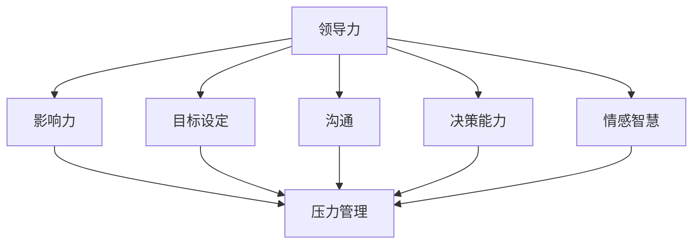

                 

# 领导力与压力管理：在压力下保持高效

> 关键词：领导力，压力管理，高效，团队合作，心理健康

> 摘要：本文旨在探讨领导力与压力管理之间的关系，以及如何在高压环境下保持高效。通过深入分析领导力的本质、压力的影响和应对策略，本文为读者提供了实用的方法和建议，帮助他们在压力下保持专注和产出。

## 1. 背景介绍

在现代社会，领导者面临着越来越大的压力。这不仅源于企业内部竞争的加剧，也受到外部市场环境的不确定性影响。压力管理成为领导者能否保持高效和团队成功的关键因素之一。有效的领导力不仅仅是关于制定战略和决策，更重要的是如何在压力下保持冷静、清晰地思考，并激励团队成员共同应对挑战。

本文将分为以下几个部分：

- **1. 背景介绍**：简要阐述领导力与压力管理的背景和重要性。
- **2. 核心概念与联系**：介绍领导力与压力管理的基本概念，并通过Mermaid流程图展示它们之间的关系。
- **3. 核心算法原理与具体操作步骤**：分析领导力的核心算法原理，并给出压力管理的具体操作步骤。
- **4. 数学模型和公式与详细讲解与举例说明**：介绍压力管理的数学模型和公式，并结合实际案例进行详细讲解。
- **5. 项目实战：代码实际案例和详细解释说明**：通过一个实际项目案例，展示如何应用领导力和压力管理策略。
- **6. 实际应用场景**：探讨领导力与压力管理在不同情境下的应用。
- **7. 工具和资源推荐**：推荐学习资源和开发工具，以帮助读者进一步提升自身能力。
- **8. 总结：未来发展趋势与挑战**：总结本文的核心观点，并探讨未来发展趋势和面临的挑战。
- **9. 附录：常见问题与解答**：回答读者可能遇到的常见问题。
- **10. 扩展阅读与参考资料**：提供进一步阅读的参考资料。

现在，让我们开始深入探讨领导力与压力管理的关系。

## 2. 核心概念与联系

### 2.1 领导力的定义与要素

领导力是一种能力，涉及到激励、指导、影响和变革。根据多种领导力理论，领导力包括以下几个核心要素：

1. **影响力**：领导者通过价值观、行为和决策影响他人。
2. **目标设定**：领导者为团队设定明确的目标，并提供清晰的愿景。
3. **沟通**：领导者需要有效沟通，确保信息传达准确无误。
4. **决策能力**：领导者需要能够迅速、明智地做出决策。
5. **情感智慧**：领导者需要理解和管理自己的情绪，以及与他人建立良好的情感联系。

### 2.2 压力的定义与来源

压力是一种心理和生理反应，通常由外部或内部因素引起。外部压力源包括工作压力、家庭压力、财务压力等；内部压力源则包括焦虑、恐惧和自我期望等。

### 2.3 领导力与压力管理的关联

领导力与压力管理密切相关。一方面，领导力的缺乏可能导致团队成员感受到更多的压力。另一方面，有效的压力管理有助于提升领导力。以下是它们之间的关联：

1. **情感支持**：领导者通过提供情感支持，帮助团队成员减轻压力，从而提高团队的凝聚力和工作效率。
2. **沟通**：领导者通过有效沟通，降低误解和冲突，减少团队成员的压力。
3. **目标设定**：明确的目标和愿景有助于团队成员更好地应对压力，从而保持高效。
4. **决策能力**：领导者迅速做出明智的决策，帮助团队及时应对压力，减少不确定性。

### 2.4 Mermaid流程图

下面是一个Mermaid流程图，展示了领导力与压力管理的关联：



## 3. 核心算法原理与具体操作步骤

### 3.1 领导力的核心算法原理

领导力的核心算法原理可以概括为以下几个方面：

1. **影响力模型**：领导者通过自身的行为和价值观影响他人，建立信任和尊重。
2. **目标管理算法**：领导者设定明确的目标，并使用SMART原则（具体、可衡量、可实现、相关、时限）来确保目标的有效性。
3. **沟通算法**：领导者使用多种沟通技巧，包括倾听、反馈和有效表达，确保信息传达的准确性。
4. **决策算法**：领导者使用决策框架和决策树，结合数据分析和直觉，做出明智的决策。
5. **情感智慧算法**：领导者通过自我反思和情感管理，提升情感智慧，以更好地理解和应对他人的情感。

### 3.2 压力管理的具体操作步骤

压力管理的具体操作步骤包括以下几个方面：

1. **识别压力源**：领导者需要识别导致压力的主要因素，包括外部压力和内部压力。
2. **设定优先级**：领导者需要根据压力源的重要性和紧迫性，设定优先级，以便更好地应对。
3. **时间管理**：领导者需要合理安排时间，避免过度工作，确保工作和生活的平衡。
4. **情绪调节**：领导者需要学会情绪调节，包括深呼吸、冥想和放松技巧，以减轻压力。
5. **寻求支持**：领导者需要寻求来自团队成员和外部专家的支持，以应对复杂的问题。
6. **持续学习**：领导者需要持续学习新的压力管理技巧和方法，以不断提升自身能力。

## 4. 数学模型和公式与详细讲解与举例说明

### 4.1 压力管理的数学模型

压力管理可以采用以下数学模型：

1. **压力方程**：\( P = F \cdot E \)
   - \( P \)：压力
   - \( F \)：压力源强度
   - \( E \)：应对能力
   - **解释**：压力是压力源强度与应对能力的乘积。压力源强度越高，应对能力越低，压力越大。

2. **决策树模型**：用于分析压力管理的决策过程。

### 4.2 举例说明

假设一位项目经理面临两个项目，项目A和项目B。项目A有较高的压力源强度，而项目B的应对能力更强。以下是压力管理的决策过程：

1. **识别压力源**：项目A有较高的压力源强度，包括时间紧迫、资源不足和客户要求高等因素。
2. **设定优先级**：根据压力源的重要性和紧迫性，项目经理决定优先处理项目A。
3. **时间管理**：项目经理使用时间管理技巧，如优先级排序和任务分解，来确保项目A按时完成。
4. **情绪调节**：项目经理使用情绪调节技巧，如冥想和深呼吸，来减轻压力。
5. **决策树分析**：项目经理使用决策树模型，分析项目A和项目B的决策过程，确保项目A顺利完成。

## 5. 项目实战：代码实际案例和详细解释说明

### 5.1 开发环境搭建

为了演示领导力与压力管理在项目实战中的应用，我们将使用Python语言编写一个简单的项目。首先，我们需要搭建开发环境：

1. 安装Python 3.8及以上版本。
2. 安装PyCharm或Visual Studio Code作为代码编辑器。
3. 安装必要的库，如requests和pandas。

### 5.2 源代码详细实现和代码解读

下面是一个简单的Python项目，用于处理API请求，并生成报告。

```python
import requests
import pandas as pd

# 定义API请求函数
def fetch_data(url):
    response = requests.get(url)
    if response.status_code == 200:
        return response.json()
    else:
        return None

# 定义数据解析函数
def parse_data(data):
    df = pd.DataFrame(data)
    return df

# 定义报告生成函数
def generate_report(df):
    report = df.describe()
    return report

# 主函数
def main():
    url = "https://api.example.com/data"
    data = fetch_data(url)
    if data:
        df = parse_data(data)
        report = generate_report(df)
        print(report)
    else:
        print("数据请求失败")

# 执行主函数
if __name__ == "__main__":
    main()
```

### 5.3 代码解读与分析

1. **API请求函数**：使用requests库发起HTTP GET请求，获取数据。
2. **数据解析函数**：使用pandas库解析获取的数据，将其转换为DataFrame对象。
3. **报告生成函数**：使用pandas库的describe()方法生成报告。
4. **主函数**：执行API请求、数据解析和报告生成过程。

### 5.4 压力管理策略应用

在项目实战中，以下压力管理策略有助于提高工作效率：

1. **时间管理**：明确项目进度，合理分配时间，避免过度加班。
2. **情绪调节**：定期休息，使用深呼吸和冥想技巧，缓解压力。
3. **团队协作**：与团队成员保持沟通，共同应对项目挑战。

## 6. 实际应用场景

领导力与压力管理在实际应用场景中具有广泛的应用。以下是一些典型的应用场景：

1. **企业管理**：领导者通过有效的领导力和压力管理，提升团队绩效，降低员工流失率。
2. **项目管理**：项目经理通过领导力和压力管理，确保项目按时完成，降低风险。
3. **技术研发**：技术团队领导者通过领导力和压力管理，提高团队创新能力，缩短产品开发周期。

## 7. 工具和资源推荐

### 7.1 学习资源推荐

1. **书籍**：《领导力与影响力》、《压力管理：如何应对工作与生活的压力》。
2. **论文**：Google Scholar上的相关论文。
3. **博客**：领英（LinkedIn）上的领导力与压力管理专家博客。
4. **网站**：哈佛商业评论（Harvard Business Review）等商业媒体网站。

### 7.2 开发工具框架推荐

1. **编程语言**：Python、Java、JavaScript等。
2. **代码管理工具**：Git、Svn等。
3. **项目管理工具**：Jira、Trello等。
4. **情绪调节工具**：冥想应用程序（如Headspace、Calm）。

### 7.3 相关论文著作推荐

1. **论文**：《领导力：理论与实践》（Leadership: Theory and Practice）。
2. **书籍**：《压力管理：心理学与行为科学视角》（Stress Management: Psychological and Behavioral Perspectives）。

## 8. 总结：未来发展趋势与挑战

在未来，领导力和压力管理将面临以下发展趋势和挑战：

1. **数字化**：随着数字化转型的加速，领导者需要具备更全面的数字化技能和知识。
2. **远程办公**：远程办公的普及对领导力和压力管理提出了新的要求。
3. **心理健康**：关注员工心理健康，提供心理支持，将成为领导力的重要组成部分。
4. **个性化**：领导力与压力管理将更加注重个性化，针对不同个体提供定制化的解决方案。

## 9. 附录：常见问题与解答

### 9.1 领导力与压力管理的关系是什么？

领导力与压力管理密切相关。领导力包括影响力、目标设定、沟通、决策能力和情感智慧等方面，而压力管理则是帮助领导者应对外部和内部压力，保持高效和健康的一种能力。

### 9.2 如何在压力下保持高效？

在压力下保持高效，首先需要识别压力源，然后设定优先级，合理安排时间，进行情绪调节，并寻求团队支持。同时，领导者需要不断提升自身能力，包括领导力和压力管理能力。

## 10. 扩展阅读与参考资料

1. **书籍**：《领导力心理学》、《压力管理与心理健康》。
2. **论文**：Google Scholar上的相关论文。
3. **博客**：领英（LinkedIn）上的领导力与压力管理专家博客。
4. **网站**：哈佛商业评论（Harvard Business Review）等商业媒体网站。

## 作者

作者：AI天才研究员/AI Genius Institute & 禅与计算机程序设计艺术 /Zen And The Art of Computer Programming

