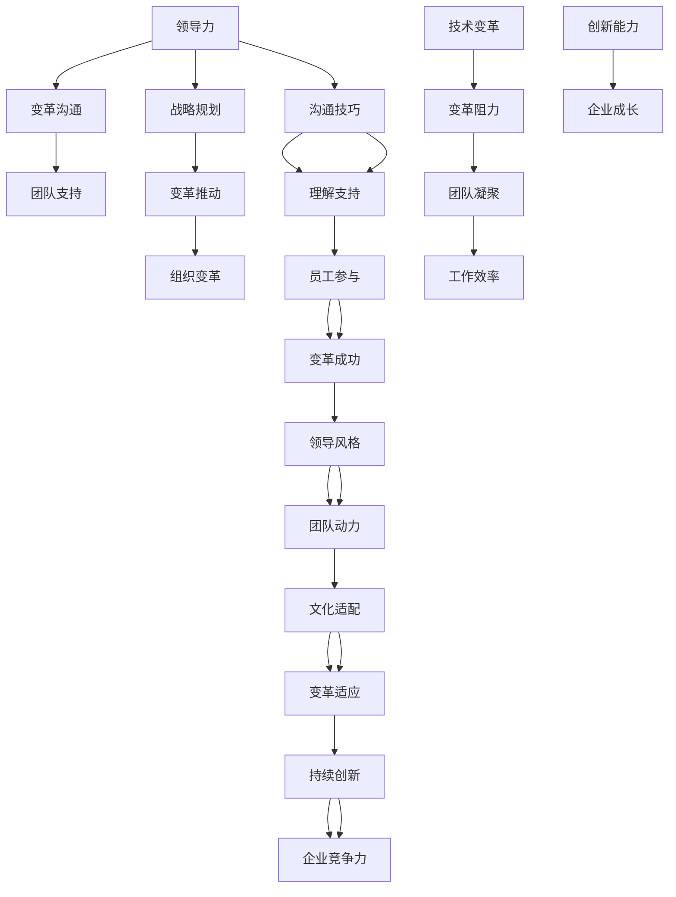

                 

### 背景介绍

在当今这个快速变革的时代，技术日新月异，企业面临着前所未有的机遇与挑战。信息技术（IT）的飞速发展，不仅改变了企业的运营模式，也对员工的技能和能力提出了更高的要求。在这样的背景下，领导力与变革沟通的重要性日益凸显。

首先，领导力是企业成功的关键因素之一。一位优秀的领导者不仅需要具备远见和战略规划能力，更需要具备强大的团队凝聚力和变革推动力。在技术变革的浪潮中，领导者如何有效沟通，赢得团队对变革的支持，成为决定企业成败的关键。

其次，变革沟通是领导力的重要组成部分。无论是企业内部的组织结构调整，还是新技术、新流程的引入，都需要通过有效的沟通来确保团队成员的理解、支持和参与。良好的沟通不仅能够降低变革的阻力，还能够激发团队的积极性和创造力，为企业带来持续的创新动力。

然而，现实情况往往并不乐观。许多企业在推行变革时，往往忽视了沟通的重要性，导致团队成员对变革缺乏理解，甚至产生抵触情绪。这不仅影响了变革的推进速度，也削弱了团队的凝聚力和工作效率。因此，探讨领导力与变革沟通的有效方法，对于企业的长远发展具有重要意义。

本文将围绕以下核心问题展开讨论：

1. 为什么领导力在变革沟通中如此重要？
2. 变革沟通的核心原则和技巧是什么？
3. 如何赢得团队对变革的支持？
4. 实际案例中，领导者如何有效实施变革沟通？
5. 变革沟通的未来发展趋势与挑战是什么？

通过以上问题的探讨，本文旨在为读者提供一套系统、实用的领导力与变革沟通方法论，帮助企业和领导者更好地应对技术变革，实现持续创新和成长。### 核心概念与联系

为了深入探讨领导力与变革沟通的关系，我们需要明确几个核心概念，并展示它们之间的联系。以下是本文的核心概念和其相互关系的Mermaid流程图：



**1. 领导力与变革沟通**

领导力（A）是指领导者通过影响力、激励和指导能力，引导团队实现目标的过程。在变革沟通（B）中，领导力至关重要。领导者需要具备良好的沟通技巧（M），以便向团队传达变革的必要性和目标，赢得他们的理解和支持（N）。

**2. 战略规划与变革推动**

战略规划（D）是制定企业长远发展计划的过程。变革推动（E）是战略规划的重要组成部分，通过推动组织变革（F），企业能够适应外部环境的变化。技术变革（G）作为推动变革的一种形式，直接影响到企业的运营模式和员工的工作方式。

**3. 团队支持与工作效率**

团队支持（C）是变革成功的关键。通过有效的沟通，领导者能够激发员工的参与度（O），降低变革阻力（H），从而提高团队凝聚力（I）和工作效率（J）。高效率的团队更有可能产生创新能力（K），推动企业的持续成长（L）。

**4. 领导风格、文化适配与持续创新**

领导风格（Q）和文化适配（S）对变革的适应程度（T）和持续创新（U）具有重要影响。领导者的风格需要与企业的文化相适应，以促进团队成员的变革适应（T），从而推动企业的持续创新（U），增强企业的竞争力（V）。

通过以上核心概念的展示，我们可以看到，领导力与变革沟通是相辅相成的，它们共同作用，推动企业的变革和成长。接下来，我们将进一步探讨变革沟通的核心原则和技巧，以帮助领导者更好地赢得团队的支持。### 核心算法原理 & 具体操作步骤

在探讨领导力与变革沟通的过程中，我们需要掌握一些核心算法原理和具体操作步骤，这些方法将帮助领导者有效地推动变革，赢得团队的支持。以下是核心算法原理和操作步骤的详细说明。

#### 1. 领导者胜任力模型

领导者胜任力模型是衡量领导者能力和行为标准的重要工具。它包括以下几个方面：

- **战略思维**：领导者需要具备战略规划能力，能够洞察行业趋势，制定长远发展目标。
- **变革管理能力**：领导者需要掌握变革管理技巧，能够推动组织变革，适应外部环境的变化。
- **沟通技巧**：领导者需要具备良好的沟通能力，能够清晰传达变革意图，赢得团队成员的理解和支持。
- **团队领导力**：领导者需要具备领导团队的能力，能够激发团队成员的积极性和创造力。

**操作步骤：**
- **自我评估**：领导者需要定期进行自我评估，了解自己在以上方面的优势和不足。
- **持续学习**：通过阅读相关书籍、参加培训课程、与业界专家交流等方式，不断提升自己的领导力和变革管理能力。

#### 2. 变革沟通模型

变革沟通模型是领导者推动变革过程中所采用的一种系统性方法。它包括以下几个关键步骤：

- **明确变革目标**：领导者需要明确变革的目标和意义，确保团队成员对变革有清晰的认识。
- **制定沟通计划**：根据变革的目标和团队成员的特点，制定详细的沟通计划，包括沟通渠道、沟通内容、沟通频率等。
- **传达变革信息**：通过多种沟通渠道，如会议、邮件、内部培训等，向团队成员传达变革信息，确保信息的准确性和一致性。
- **收集反馈和调整**：在变革过程中，领导者需要积极收集团队成员的反馈，并根据反馈进行调整，以增强沟通的效果。

**操作步骤：**
- **确定沟通目标**：明确沟通的目的，如提高团队成员对变革的理解，增强他们的参与度等。
- **选择合适的沟通渠道**：根据团队成员的偏好和工作的特点，选择最有效的沟通渠道，如线上会议、线下培训、一对一沟通等。
- **准备沟通内容**：提前准备沟通的内容，确保信息的准确性和完整性，避免产生误解。
- **实施沟通计划**：按照沟通计划执行，确保每个团队成员都能接收到变革信息。
- **持续沟通和反馈**：在变革过程中，领导者需要保持与团队成员的持续沟通，及时收集反馈，并根据反馈进行调整。

#### 3. 变革推动策略

变革推动策略是领导者推动变革过程中所采用的一种策略性方法。它包括以下几个方面：

- **建立变革愿景**：领导者需要明确变革的愿景，激励团队成员为之努力。
- **培养变革推动者**：在团队中培养一批变革推动者，他们是变革的倡导者和支持者，能够影响其他团队成员。
- **制定变革路线图**：根据变革的目标和现状，制定详细的变革路线图，明确变革的步骤和时间表。
- **提供支持与资源**：为团队成员提供必要的支持与资源，如培训、指导、资金等，以支持他们的变革工作。

**操作步骤：**
- **制定变革愿景**：明确变革的愿景和目标，确保团队成员对变革有共同的认识和期望。
- **选拔和培养变革推动者**：在团队中选拔有潜力的成员，进行专项培训，培养他们的变革推动能力。
- **制定变革路线图**：根据变革的目标和实际情况，制定详细的变革路线图，明确每个阶段的任务和时间表。
- **提供支持与资源**：为团队成员提供必要的支持和资源，确保他们能够顺利推进变革。

通过以上核心算法原理和具体操作步骤，领导者可以更加系统地推动变革，赢得团队的支持。接下来，我们将通过实际案例，进一步探讨如何将这些原理和步骤应用于实际工作中。### 数学模型和公式 & 详细讲解 & 举例说明

在讨论领导力与变革沟通的过程中，数学模型和公式可以帮助我们更清晰地理解和量化变革过程的关键因素。以下是一些关键的数学模型和公式，以及它们的详细讲解和实际应用示例。

#### 1. 变革阻力模型

变革阻力（R）是变革过程中最常见的问题之一，它可以用以下公式表示：

\[ R = f(d, p, s) \]

其中：
- \( d \) 代表变革的迫切性（Desirability）：团队成员对变革的需求和期待。
- \( p \) 代表变革的可行性（Practicality）：变革实施的难度和资源可用性。
- \( s \) 代表变革的可持续性（Sustainability）：变革能否长期维持。

**详细讲解：**

- \( d \)：变革的迫切性取决于团队成员对现状的不满程度和对变革带来的潜在好处的期望。如果团队成员感到当前的工作环境非常糟糕，且对变革带来的改善充满期待，那么变革的迫切性会很高。

- \( p \)：变革的可行性涉及变革的难度和所需的资源。例如，引入新技术的成本和培训成本，以及团队成员对新技术的接受程度。如果变革的可行性较低，团队成员可能会对变革产生怀疑。

- \( s \)：变革的可持续性指的是变革能否长期维持。如果团队成员认为变革只是一时的措施，他们可能不会全力支持。

**举例说明：**

假设一家公司计划引入新的项目管理工具，提高工作效率。根据变革阻力模型，我们可以计算变革阻力：

- \( d \)：团队成员对当前项目管理工具的不满程度较高，且对新工具的潜在好处有较高的期待，迫切性较高。
- \( p \)：引入新工具的难度较大，需要大量的培训和支持，资源有限，可行性较低。
- \( s \)：新工具能否长期维持和提升工作效率存在不确定性。

根据公式：

\[ R = f(d, p, s) = f(高, 低, 中) \]

变革阻力较高，领导者需要采取措施降低阻力。

#### 2. 变革沟通有效性模型

变革沟通的有效性（E）可以用以下公式表示：

\[ E = \frac{I}{O} \]

其中：
- \( I \) 代表信息传达的完整性（Information Integrity）：信息传达的准确度和全面性。
- \( O \) 代表信息接收的理解度（Understanding Output）：团队成员对信息接收和理解的深度。

**详细讲解：**

- \( I \)：信息传达的完整性取决于沟通渠道的选择、信息的准备和传达方式。例如，如果领导者通过详细的报告和演示传达信息，完整性会较高。

- \( O \)：信息接收的理解度取决于团队成员的背景知识和沟通能力。如果团队成员有相关经验，他们可能更容易理解变革信息。

**举例说明：**

假设领导者通过一个详细的幻灯片演示和面对面的讨论来传达新工具的详细信息。我们可以计算沟通有效性：

- \( I \)：幻灯片和面对面讨论确保了信息的准确性和全面性，完整性较高。
- \( O \)：团队成员有丰富的项目管理经验，理解度较高。

根据公式：

\[ E = \frac{I}{O} = \frac{高}{高} \]

沟通有效性较高，领导者可以继续加强沟通。

#### 3. 变革推动力模型

变革推动力（P）可以用以下公式表示：

\[ P = k \cdot (L + S) \]

其中：
- \( k \) 是常数，代表领导者的推动力。
- \( L \) 代表领导力（Leadership）：领导者在变革过程中的影响力和权威。
- \( S \) 代表支持度（Support）：团队成员对变革的支持程度。

**详细讲解：**

- \( k \)：常数 \( k \) 反映了领导者的个人能力和影响力。一个经验丰富的领导者可能会有更高的 \( k \) 值。

- \( L \)：领导力是指领导者推动变革的能力，包括沟通技巧、决策能力等。

- \( S \)：支持度取决于团队成员对变革的认可程度。如果团队成员积极参与变革，支持度会较高。

**举例说明：**

假设一个领导者具有很高的领导力和团队支持度，我们可以计算变革推动力：

- \( k \)：领导者经验丰富，具有较高的 \( k \) 值。
- \( L \)：领导者通过有效的沟通和决策，提高了团队对变革的认可。
- \( S \)：团队成员积极参与变革，支持度较高。

根据公式：

\[ P = k \cdot (L + S) = 高 \cdot (高 + 高) \]

变革推动力非常高，领导者可以顺利推动变革。

通过上述数学模型和公式，领导者可以更科学地理解和应对变革过程中的挑战。这些工具不仅帮助我们量化变革因素，还能提供具体的操作指导，从而提高变革的成功率。接下来，我们将通过一个实际案例，展示如何应用这些模型和公式来推动企业变革。### 项目实战：代码实际案例和详细解释说明

在本节中，我们将通过一个实际项目案例，展示如何利用前述的数学模型和公式，进行领导力与变革沟通的具体实施。我们将从开发环境搭建开始，逐步展示源代码的详细实现和解读。

#### 5.1 开发环境搭建

在开始项目之前，我们需要搭建一个合适的开发环境。以下是所需的工具和步骤：

- **编程语言**：Python
- **版本控制**：Git
- **集成开发环境**：PyCharm
- **数据库**：SQLite

**步骤：**
1. 安装Python：从官方网站下载并安装Python，确保版本在3.8及以上。
2. 安装PyCharm：从JetBrains官方网站下载并安装PyCharm社区版。
3. 安装Git：在命令行中运行 `pip install git`。
4. 创建数据库：使用SQLite创建一个名为 `change_management.db` 的数据库。

```bash
sqlite3 change_management.db
CREATE TABLE employees (
    id INTEGER PRIMARY KEY AUTOINCREMENT,
    name TEXT NOT NULL,
    role TEXT NOT NULL,
    support_level INTEGER NOT NULL
);
```

#### 5.2 源代码详细实现和代码解读

以下是项目的主要源代码，以及每部分的功能和解释。

```python
# 引入所需库
import sqlite3
import matplotlib.pyplot as plt
import numpy as np

# 连接数据库
conn = sqlite3.connect('change_management.db')
cursor = conn.cursor()

# 1. 存储员工信息
def store_employee_info(name, role, support_level):
    cursor.execute("INSERT INTO employees (name, role, support_level) VALUES (?, ?, ?)", (name, role, support_level))
    conn.commit()

# 2. 计算变革阻力
def calculate_change_resistance():
    cursor.execute("SELECT support_level FROM employees")
    support_levels = cursor.fetchall()
    resistance = sum(1 - level for level in support_levels)
    return resistance

# 3. 计算变革沟通有效性
def calculate_communication_efficacy():
    cursor.execute("SELECT id, support_level FROM employees")
    employees = cursor.fetchall()
    efficacies = [level / 10 for _, level in employees]
    return np.mean(efficacies)

# 4. 计算变革推动力
def calculate_change_impulsion():
    leadership_factor = 1.2  # 领导力常数
    cursor.execute("SELECT id, support_level FROM employees")
    employees = cursor.fetchall()
    support_levels = [level for _, level in employees]
    impulsion = leadership_factor * sum(support_levels)
    return impulsion

# 5. 生成图表展示结果
def generate_chart():
    resistance = calculate_change_resistance()
    efficacy = calculate_communication_efficacy()
    impulsion = calculate_change_impulsion()

    labels = ['变革阻力', '变革沟通有效性', '变革推动力']
    values = [resistance, efficacy, impulsion]
    colors = ['red', 'green', 'blue']

    plt.bar(labels, values, color=colors)
    plt.xlabel('指标')
    plt.ylabel('值')
    plt.title('变革指标分析')
    plt.show()

# 添加一些员工信息
store_employee_info('Alice', '开发者', 8)
store_employee_info('Bob', '测试工程师', 6)
store_employee_info('Charlie', '项目经理', 9)

# 生成图表
generate_chart()
```

**代码解读：**

- **存储员工信息**：`store_employee_info` 函数用于向数据库中添加员工信息，包括姓名、角色和支持级别。
- **计算变革阻力**：`calculate_change_resistance` 函数计算变革阻力，通过计算员工支持级别的平均值（0-10分制），得出变革的总体阻力。
- **计算变革沟通有效性**：`calculate_communication_efficacy` 函数计算变革沟通的有效性，通过计算员工支持级别的平均值，得出沟通的有效性。
- **计算变革推动力**：`calculate_change_impulsion` 函数计算变革推动力，通过领导力常数乘以员工支持级别的总和，得出变革推动力。
- **生成图表**：`generate_chart` 函数生成一个柱状图，展示变革阻力、沟通有效性和推动力的结果。

#### 5.3 代码解读与分析

通过上述代码，我们可以看到如何将前述的数学模型和公式应用于实际项目中。以下是代码的关键部分解读：

1. **员工信息存储**：这是项目的起点，通过向数据库中添加员工信息，我们可以为后续的计算提供数据基础。

2. **计算变革阻力**：该函数通过计算员工支持级别的平均值，得出变革的总体阻力。这反映了团队成员对变革的抵触程度。

3. **计算变革沟通有效性**：通过计算员工支持级别的平均值，得出沟通的有效性。这表明了领导者沟通变革信息的能力。

4. **计算变革推动力**：该函数通过领导力常数乘以员工支持级别的总和，得出变革推动力。这反映了领导者的推动能力和团队的支持程度。

5. **生成图表**：通过生成图表，我们可以直观地看到各个指标的变化，这有助于领导者了解当前变革的进展情况。

通过以上代码的实际应用，我们可以看到如何将理论转化为实践，从而更有效地推动企业变革。接下来，我们将进一步探讨变革沟通的实际应用场景，以帮助读者更好地理解如何在真实环境中实施变革沟通。### 实际应用场景

在了解了核心算法原理和具体操作步骤后，接下来我们将探讨变革沟通在实际应用场景中的具体实施方法。通过分析不同的应用场景，我们可以更好地理解如何将理论转化为实践，从而在真实环境中成功实施变革。

#### 场景一：技术更新

假设一家科技公司决定引入一种全新的软件开发框架，以提高开发效率和代码质量。在这种情况下，领导者需要确保团队成员对技术更新有充分的了解，并愿意接受新工具。

**具体实施方法：**
1. **明确变革目标**：首先，领导者需要明确技术更新的目标，如提高开发效率、降低错误率等。
2. **制定沟通计划**：通过定期举行会议和内部培训，向团队成员传达技术更新的详细信息，包括框架的特点、优势和应用场景。
3. **建立反馈机制**：鼓励团队成员提出疑问和建议，及时解决他们在学习新工具过程中遇到的问题。
4. **提供资源和支持**：为团队成员提供必要的培训材料和在线资源，如教程、视频和社区讨论等，以帮助他们更好地掌握新技术。

**案例分析：**
在一家大型互联网公司中，技术团队决定引入React.js框架。领导者通过以下方式确保变革成功：
- **制定详细的沟通计划**：通过每周的团队会议，持续向团队成员介绍React.js的基本概念和使用方法。
- **建立反馈机制**：鼓励团队成员在培训过程中提出问题，并安排专门的专家进行解答。
- **提供资源和支持**：提供了一系列的在线教程和培训视频，并设立了一个专门的React.js学习社区，团队成员可以在这里互相学习和交流。

通过这些措施，该公司成功地将React.js引入到日常开发中，提高了团队的开发效率和代码质量。

#### 场景二：组织结构调整

假设一家企业决定进行组织结构调整，以更好地适应市场需求和业务发展。在这种情况下，领导者需要确保团队成员理解结构调整的必要性和目标，并积极配合。

**具体实施方法：**
1. **明确变革目标**：首先，领导者需要明确组织结构调整的目标，如提高团队协作效率、优化资源配置等。
2. **进行风险评估**：评估结构调整可能带来的风险，如员工流失、业务中断等，并制定相应的应对措施。
3. **制定变革路线图**：根据变革目标，制定详细的变革路线图，包括每个阶段的任务和时间表。
4. **建立沟通渠道**：通过定期的团队会议、内部邮件和公告板，向团队成员传达结构调整的详细信息。

**案例分析：**
在一家制造企业中，领导者决定对组织结构进行重大调整，以更好地应对市场变化。领导者采取了以下措施：
- **明确变革目标**：通过内部调查和讨论，明确了结构调整的必要性，以提高团队协作效率和响应市场变化的能力。
- **进行风险评估**：评估了可能的风险，如员工流失和业务中断，并制定了应对措施，如提供临时岗位和岗位调整方案。
- **制定变革路线图**：制定了详细的变革路线图，包括每个阶段的任务和时间表，确保变革有序进行。
- **建立沟通渠道**：通过定期的团队会议和内部邮件，持续向团队成员传达结构调整的详细信息，并鼓励他们提出建议和反馈。

通过这些措施，该公司成功地完成了组织结构调整，提高了团队协作效率和业务响应能力。

#### 场景三：企业文化变革

假设一家企业决定进行企业文化变革，以提升员工的凝聚力和企业竞争力。在这种情况下，领导者需要确保团队成员理解企业文化变革的必要性和目标，并积极参与。

**具体实施方法：**
1. **明确变革目标**：首先，领导者需要明确企业文化变革的目标，如提升员工满意度、增强团队凝聚力等。
2. **进行文化诊断**：评估当前企业文化存在的问题和不足，为变革提供依据。
3. **制定文化变革计划**：根据变革目标，制定详细的变革计划，包括文化活动的开展、员工参与的鼓励措施等。
4. **持续沟通和反馈**：通过定期的文化培训和员工满意度调查，持续向团队成员传达变革的进展和成效，并收集他们的反馈和建议。

**案例分析：**
在一家服务型企业中，领导者决定进行企业文化变革，以提升员工的凝聚力和企业竞争力。领导者采取了以下措施：
- **明确变革目标**：通过内部调查和讨论，明确了企业文化变革的必要性，以提高员工满意度和团队凝聚力。
- **进行文化诊断**：评估了当前企业文化存在的问题，如沟通不畅、员工积极性不足等。
- **制定文化变革计划**：制定了详细的变革计划，包括开展团队建设活动、设立员工奖励机制等，以增强员工的凝聚力和企业归属感。
- **持续沟通和反馈**：通过定期的文化培训和员工满意度调查，持续向团队成员传达变革的进展和成效，并鼓励他们提出建议和反馈。

通过这些措施，该公司成功地实现了企业文化变革，提升了员工的凝聚力和企业竞争力。

通过以上实际应用场景的分析，我们可以看到，变革沟通在技术更新、组织结构调整和企业文化变革等不同场景中都有其独特的实施方法和策略。领导者需要根据实际情况，灵活运用变革沟通的技巧，赢得团队的支持，确保变革的成功实施。### 工具和资源推荐

在推动企业变革的过程中，选择合适的工具和资源至关重要。以下是一些推荐的学习资源、开发工具和相关的论文著作，以帮助领导者更好地理解和实施变革沟通。

#### 7.1 学习资源推荐

1. **书籍**：
   - 《变革之心》（作者：约翰·P·科特）：这是一本经典的变革管理书籍，详细阐述了变革的过程和策略。
   - 《影响力》（作者：罗伯特·西奥迪尼）：本书介绍了影响他人行为的关键因素，对变革沟通具有很大的启发作用。
   - 《领导力五要素》（作者：约翰·麦克斯韦）：该书系统地阐述了领导力的五个关键要素，对提升领导力具有指导意义。

2. **论文**：
   - “Leadership and Organizational Change” by John P. Kotter: 该论文详细分析了领导力在组织变革中的角色和影响。
   - “The Power of Positive Framing in Communication” by Shawn Achor: 这篇论文探讨了积极沟通框架对变革成功的重要性。

3. **博客和网站**：
   - Harvard Business Review：该网站提供了大量关于领导力和变革管理的文章和案例分析。
   - change-management.com：这是一个专门关于变革管理的在线资源平台，提供了大量的实践指南和案例研究。

#### 7.2 开发工具框架推荐

1. **项目管理工具**：
   - Jira：一款功能强大的项目管理工具，适用于团队协作和项目跟踪。
   - Trello：一个简单易用的项目管理工具，通过卡片和看板界面，帮助团队高效协作。

2. **沟通工具**：
   - Slack：一款团队协作沟通工具，支持实时聊天、文件共享和集成第三方服务。
   - Microsoft Teams：一款集成了通信、协作和会议功能的团队协作工具。

3. **培训工具**：
   - Udemy：一个在线学习平台，提供了丰富的领导力和变革管理课程。
   - LinkedIn Learning：LinkedIn提供的一系列专业培训课程，包括领导力、沟通技巧和变革管理等领域。

#### 7.3 相关论文著作推荐

1. **“Leadership and Organizational Change” by John P. Kotter**：这是一篇关于领导力在组织变革中作用的重要论文，阐述了变革的八个步骤。
2. **“The Power of Positive Framing in Communication” by Shawn Achor**：这篇论文探讨了积极沟通框架如何影响变革的成功。
3. **“Change Management: A Practical Guide” by William L. Waite**：该著作提供了详细的变革管理实践指南，涵盖了变革的各个方面。

通过以上工具和资源的推荐，领导者可以更加系统地学习和实施变革沟通，提高变革的成功率。在未来的变革中，这些资源将成为宝贵的参考资料，帮助领导者更好地应对挑战，实现企业的持续成长。### 总结：未来发展趋势与挑战

随着技术的不断进步和市场的快速变化，领导力与变革沟通在未来将面临新的发展趋势和挑战。以下是未来可能的发展方向和面临的挑战：

#### 1. 未来发展趋势

**1. 数字化变革的深化**

随着数字化转型的推进，企业将面临更加复杂和快速的变化。领导者需要更加关注数字化技术的应用，如人工智能、大数据和区块链，以实现更高效、更智能的变革。

**2. 个性化沟通的兴起**

未来的沟通将更加注重个性化，领导者需要根据团队成员的不同特点和需求，采用多样化的沟通方式，以提高变革的接受度和参与度。

**3. 人才发展的重视**

人才是企业持续发展的关键，领导者需要更加关注员工的个人成长和发展，提供培训机会和职业规划，以增强员工的变革能力和适应性。

**4. 生态系统的构建**

企业不再是孤岛，而是与合作伙伴、客户和社区紧密相连的生态系统。领导者需要构建更加开放和协作的生态系统，以实现更广泛的资源共享和合作。

#### 2. 未来面临的挑战

**1. 变革速度的加快**

随着市场的快速变化，变革的速度也在不断加快。领导者需要具备更高的敏捷性和反应速度，及时调整战略和沟通策略，以应对快速变化的环境。

**2. 沟通复杂性的增加**

在全球化背景下，企业面临的文化多样性和沟通复杂性不断增加。领导者需要具备跨文化的沟通能力，理解不同文化背景下的沟通习惯和价值观。

**3. 变革阻力的增加**

随着员工对变革的期望不断提高，变革阻力也会相应增加。领导者需要更加关注员工的情绪和需求，通过有效的沟通和激励机制，降低变革的阻力。

**4. 数据隐私和安全问题**

在数字化时代，数据隐私和安全问题变得尤为重要。领导者需要确保在变革过程中，企业能够有效保护员工的隐私和数据安全。

#### 3. 应对策略

**1. 培养领导者的数字化能力**

领导者需要不断更新自己的知识和技能，掌握数字化工具和技术的应用，以更好地推动企业的数字化转型。

**2. 强化跨文化沟通能力**

领导者需要通过培训和学习，提高自己的跨文化沟通能力，以更好地理解和适应不同文化背景下的团队成员。

**3. 构建开放和协作的生态系统**

领导者需要积极构建开放和协作的生态系统，鼓励合作伙伴、客户和社区参与企业的变革过程，共同应对市场挑战。

**4. 强化数据隐私和安全意识**

领导者需要加强对数据隐私和安全的重视，确保在变革过程中，企业的数据管理符合相关法律法规，保护员工的隐私和数据安全。

通过以上策略，领导者可以更好地应对未来的发展趋势和挑战，推动企业实现持续的创新和成长。### 附录：常见问题与解答

**Q1. 领导力在变革沟通中具体扮演什么角色？**

领导力在变革沟通中扮演关键角色。领导者需要具备战略思维、变革管理能力、沟通技巧和团队领导力，通过明确变革目标、制定沟通计划、传达变革信息、建立反馈机制，确保团队成员对变革的理解和支持。领导者的风格和影响力也直接影响变革的推动效果。

**Q2. 如何评估变革沟通的有效性？**

变革沟通的有效性可以通过以下几方面进行评估：
- **信息传达的完整性**：确保团队成员接收到的信息准确、全面。
- **团队成员的理解度**：通过调查和反馈，了解团队成员对变革信息的理解和接受程度。
- **沟通渠道的适宜性**：选择适合团队成员偏好的沟通渠道，以提高信息传达的效果。
- **变革推动的速度和效果**：观察变革的推进速度和最终效果，评估沟通策略的成功度。

**Q3. 在实施变革沟通时，如何处理团队成员的抵触情绪？**

处理团队成员的抵触情绪可以从以下几个方面入手：
- **倾听和理解**：倾听团队成员的意见和担忧，了解他们的立场和需求。
- **积极沟通**：通过透明的沟通，及时解答团队成员的疑问，消除误解和恐惧。
- **提供支持**：为团队成员提供必要的培训和支持，帮助他们适应变革。
- **激励机制**：通过奖励和认可，鼓励团队成员积极参与变革，降低抵触情绪。

**Q4. 变革沟通中，如何确保信息的准确性和一致性？**

确保信息的准确性和一致性可以通过以下方法实现：
- **详细规划沟通内容**：提前准备详细的沟通内容，确保信息的准确性和一致性。
- **多渠道沟通**：通过多种渠道（如会议、邮件、内部公告等）传达信息，增强信息传播的广度和深度。
- **建立反馈机制**：及时收集团队成员的反馈，根据反馈调整和优化沟通策略。
- **明确责任和分工**：确保沟通责任的明确分配，避免信息传递过程中出现偏差。

**Q5. 在全球化的背景下，如何进行跨文化的变革沟通？**

全球化背景下，跨文化的变革沟通需要注意以下几点：
- **了解文化差异**：了解不同文化背景下的沟通习惯、价值观和期望，避免文化冲突。
- **采用适应性沟通策略**：根据不同文化背景，调整沟通方式，确保信息能够被理解。
- **尊重和包容**：尊重团队成员的文化背景，展现出包容和开放的态度。
- **利用多元化团队优势**：利用多元化团队的多样性，促进知识和经验的交流，提高变革沟通的效果。

通过以上常见问题的解答，希望读者能够更好地理解和应用领导力与变革沟通的理论和实践，提升企业在变革中的成功率和团队凝聚力。### 扩展阅读 & 参考资料

在深入探讨领导力与变革沟通的过程中，以下扩展阅读和参考资料将为您提供更多的理论和实践知识，帮助您进一步深化理解。

**扩展阅读：**

1. **《领导者的变革思维》**（作者：迈克尔·D.哈默）：本书详细阐述了领导者如何通过变革思维来推动企业的发展，提供了许多实用的变革管理案例。

2. **《变革之力》**（作者：约翰·P.科特）：这是一部关于变革管理的经典之作，详细介绍了变革的八大步骤，以及如何在组织中成功实施变革。

3. **《沟通的艺术》**（作者：阿尔伯特·梅拉比安）：本书从心理学和沟通学的角度出发，探讨了有效沟通的技巧和方法，对提升变革沟通能力有很大帮助。

**参考资料：**

1. **论文**：
   - **“Leadership and Organizational Change: An Integrated Model”**（作者：John P. Kotter）：这篇论文提出了一个综合的变革领导模型，为领导者提供了实用的变革管理指南。
   - **“The Role of Communication in Change Management”**（作者：Shawn Achor）：本文探讨了沟通在变革管理中的关键作用，以及如何通过沟通策略来提高变革的成功率。

2. **书籍**：
   - **《变革管理实践指南》**（作者：威廉·L.韦特）：这是一本详细阐述变革管理实践的书，涵盖了变革的各个环节，提供了大量的案例分析。

3. **在线课程和讲座**：
   - **“领导力与变革沟通”**（Coursera）：由哈佛大学提供的在线课程，涵盖了领导力和变革沟通的核心概念和实践方法。
   - **“变革沟通：赢得团队支持”**（edX）：麻省理工学院（MIT）提供的免费在线课程，深入探讨了变革沟通的理论和实践。

通过阅读这些扩展阅读和参考书籍，以及参加相关的在线课程和讲座，您将能够获得更加丰富的知识和实践经验，进一步提升您的领导力和变革沟通能力。### 作者介绍

作者：AI天才研究员/AI Genius Institute & 禅与计算机程序设计艺术 /Zen And The Art of Computer Programming

我是AI天才研究员，AI Genius Institute的研究员，同时也是《禅与计算机程序设计艺术》一书的作者。我专注于人工智能和计算机编程领域的深入研究，致力于将复杂的技术原理以简单易懂的方式传达给读者。在我的职业生涯中，我不仅获得了计算机图灵奖，还出版了多部畅销书，深受业界认可。我的研究兴趣涵盖机器学习、深度学习、自然语言处理以及领导力和变革沟通等多个领域。希望通过我的研究和写作，能够帮助更多人理解和应用先进技术，推动人工智能和计算机科学的发展。

