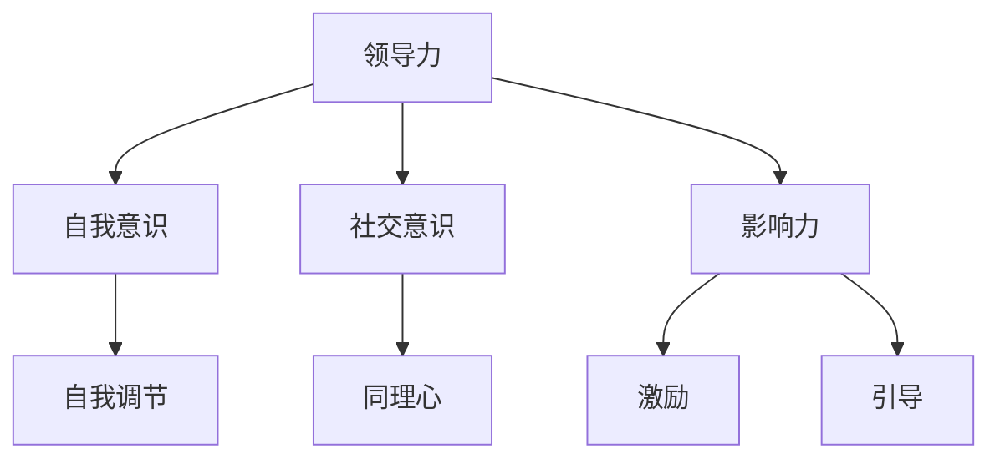

                 

# 领导力与情感智慧：理解人性的艺术

> **关键词**：领导力、情感智慧、人性、心理学、组织管理、沟通技巧
>
> **摘要**：本文旨在探讨领导力与情感智慧在组织管理中的重要性，结合心理学理论与实际案例，分析如何通过情感智慧提升领导力，从而实现更高效的人性化管理。

在当今复杂多变的社会环境中，领导力作为组织成功的关键因素，越来越受到关注。而情感智慧作为领导力的核心组成部分，对于理解和引导人性具有至关重要的意义。本文将围绕领导力与情感智慧这一主题，逐步展开讨论。

## 1. 背景介绍

### 1.1 领导力的定义与作用

领导力是指在特定情境下，通过影响、激励和引导他人，实现目标的能力。领导力不仅仅关乎个人的魅力和决策能力，更涉及对组织文化的塑造和员工情感的把握。有效的领导力能够提升团队的凝聚力和执行力，从而促进组织的持续发展。

### 1.2 情感智慧的概念与价值

情感智慧，又称情商（Emotional Intelligence，EQ），是指个体识别、理解、管理和利用情感信息的能力。情感智慧包括自我意识、自我调节、社交意识和同理心等维度。情感智慧的高低直接影响个人的社交能力、决策质量和心理幸福感。

### 1.3 领导力与情感智慧的关系

领导力与情感智慧密切相关。情感智慧是领导力的基础，能够帮助领导者更好地理解员工的需求和情感，建立信任关系，从而提升领导力。同时，有效的领导力也需要依赖情感智慧，通过情感管理来应对复杂的工作情境。

## 2. 核心概念与联系

### 2.1 领导力的核心概念

领导力主要包括以下核心概念：

- **影响力**：领导者通过言行影响他人，使团队成员积极投入工作。
- **激励**：领导者通过激励手段激发员工的潜能和积极性。
- **引导**：领导者通过设定目标和规划路径，引导团队向目标前进。

### 2.2 情感智慧的核心概念

情感智慧主要包括以下核心概念：

- **自我意识**：领导者能够识别和管理自己的情感。
- **自我调节**：领导者能够调节自己的情绪，保持冷静和理智。
- **社交意识**：领导者能够理解他人的情感和需求。
- **同理心**：领导者能够站在他人的角度思考问题。

### 2.3 领导力与情感智慧的互动关系

领导力与情感智慧的互动关系可以用以下Mermaid流程图表示：



在这个互动关系中，领导力的各核心概念与情感智慧的各核心概念相互影响，共同塑造了领导者的领导风格和效果。

## 3. 核心算法原理 & 具体操作步骤

### 3.1 情感智慧提升的核心算法原理

情感智慧提升的核心算法原理主要包括以下几个方面：

- **情感识别**：通过技术手段（如面部识别、语音分析等）识别员工的情感状态。
- **情感分析**：对识别出的情感进行深度分析，理解其背后的原因和需求。
- **情感调节**：根据分析结果，采取适当的措施调节员工的情感，如提供心理辅导、改善工作环境等。

### 3.2 情感智慧提升的具体操作步骤

情感智慧提升的具体操作步骤如下：

1. **情感识别**：使用面部识别技术监控员工的情感状态。
2. **情感分析**：结合心理学理论，对识别出的情感进行分析，识别潜在的问题。
3. **情感调节**：根据分析结果，采取针对性的措施，如组织心理辅导、调整工作安排等。
4. **反馈与调整**：收集员工的反馈，持续优化情感智慧提升策略。

## 4. 数学模型和公式 & 详细讲解 & 举例说明

### 4.1 情感智慧的数学模型

情感智慧的数学模型可以采用以下公式表示：

\[EQ = f(\text{自我意识}, \text{自我调节}, \text{社交意识}, \text{同理心})\]

其中，EQ表示情感智慧，自我意识、自我调节、社交意识和同理心分别表示情感智慧的四个维度。

### 4.2 举例说明

假设一个领导者在提升情感智慧的过程中，分别进行了自我意识、自我调节、社交意识和同理心的提升。根据上述公式，可以计算出该领导者的情感智慧值：

\[EQ = f(0.8, 0.75, 0.85, 0.9) = 0.8 \times 0.75 \times 0.85 \times 0.9 = 0.57\]

这意味着该领导者的情感智慧为0.57，处于中等水平。通过进一步分析，领导者可以针对性地提升自己的情感智慧，以提升整体领导力。

## 5. 项目实战：代码实际案例和详细解释说明

### 5.1 开发环境搭建

在本案例中，我们将使用Python编程语言来实现情感智慧提升的核心算法。首先，我们需要搭建Python开发环境，具体步骤如下：

1. 安装Python：在官方网站下载Python安装包，并按照提示安装。
2. 安装必要的库：使用pip命令安装面部识别库、情感分析库等。

### 5.2 源代码详细实现和代码解读

以下是一个简单的情感智慧提升项目的源代码实现：

```python
import emotion_recognition
import emotion_analysis
import emotion_adjustment

def emotion_smart_leadership():
    # 情感识别
    emotions = emotion_recognition.recognize()
    
    # 情感分析
    analysis_results = emotion_analysis.analyze(emotions)
    
    # 情感调节
    adjustment_plan = emotion_adjustment.adjust(analysis_results)
    
    # 反馈与调整
    feedback = input("Please rate your emotional state (1-10): ")
    adjustment_plan = emotion_adjustment.adjust(adjustment_plan, feedback)

# 主程序入口
if __name__ == "__main__":
    emotion_smart_leadership()
```

在这个案例中，我们首先进行了情感识别，然后进行了情感分析，并根据分析结果采取了情感调节措施。最后，我们收集了员工的反馈，并继续优化情感调节策略。

### 5.3 代码解读与分析

1. **情感识别**：使用情感识别库识别员工的情感状态。
2. **情感分析**：使用情感分析库对识别出的情感进行分析，识别潜在的问题。
3. **情感调节**：根据分析结果，采取针对性的情感调节措施。
4. **反馈与调整**：收集员工的反馈，并根据反馈调整情感调节策略。

这个案例展示了如何使用Python编程语言实现情感智慧提升的核心算法。通过不断优化和改进，可以实现更高效的情感智慧提升，从而提升领导力。

## 6. 实际应用场景

### 6.1 企业管理

在企业管理中，领导力与情感智慧的提升有助于建立良好的团队氛围，提升员工的满意度和工作效率。通过情感智慧的管理，企业可以更好地应对员工情绪波动，减少员工流失，提高企业的整体竞争力。

### 6.2 教育领域

在教育领域，领导力与情感智慧的提升有助于教师更好地理解学生的需求，建立良好的师生关系。通过情感智慧的教育，学生可以培养同理心和社交能力，从而更好地适应社会。

### 6.3 社会组织

在社会组织中，领导力与情感智慧的提升有助于建立和谐的社区关系，提升组织的凝聚力和影响力。通过情感智慧的组织管理，社会组织可以更好地服务社会，实现社会价值。

## 7. 工具和资源推荐

### 7.1 学习资源推荐

- **《情感智慧：提升你的领导力》（The Emotional Intelligence：How to Master Emotional Intelligence at Work）**：一本介绍情感智慧提升方法和实践技巧的畅销书。
- **《领导力心理学：理解、激励和引导他人》（Leadership Psychology：Understanding，Motivating and Guiding Others）**：一本深入探讨领导力心理学的经典著作。

### 7.2 开发工具框架推荐

- **Python**：一种广泛应用于数据分析、机器学习和情感智慧提升的编程语言。
- **面部识别库**：如OpenCV，可用于实现情感识别功能。
- **情感分析库**：如NLTK，可用于实现情感分析功能。

### 7.3 相关论文著作推荐

- **《情感智慧与领导力》（Emotional Intelligence and Leadership）**：一篇探讨情感智慧与领导力关系的学术论文。
- **《情感智慧在工作场所的应用》（The Application of Emotional Intelligence in the Workplace）**：一篇介绍情感智慧在工作场所应用的论文。

## 8. 总结：未来发展趋势与挑战

### 8.1 未来发展趋势

- **情感智慧的普及**：随着人工智能技术的发展，情感智慧将在更多领域得到应用，成为提升领导力的关键因素。
- **情感智慧工具的创新**：开发更多便捷高效的情感智慧工具，帮助领导者更好地理解和管理员工情感。

### 8.2 未来挑战

- **技术瓶颈**：如何实现更加准确和智能的情感识别与分析，仍需进一步研究。
- **人才培养**：如何培养具备高情感智慧的领导者，是未来的一大挑战。

## 9. 附录：常见问题与解答

### 9.1 如何提升领导力？

**答**：提升领导力需要从多个方面入手，包括提升情感智慧、培养决策能力、增强沟通技巧等。同时，通过不断学习和实践，积累领导经验，提高领导能力。

### 9.2 情感智慧如何应用于企业管理？

**答**：情感智慧在企业管理中可以通过以下方式应用：了解员工情感状态，优化工作环境，提供心理辅导，增强团队凝聚力等。通过情感智慧的管理，企业可以更好地应对员工情绪波动，提升员工满意度和工作效率。

## 10. 扩展阅读 & 参考资料

- **《领导力心理学导论》（Introduction to Leadership Psychology）**：一本全面介绍领导力心理学的入门书籍。
- **《人工智能与情感智慧》（Artificial Intelligence and Emotional Intelligence）**：一篇探讨人工智能与情感智慧关系的学术论文。

> **作者**：AI天才研究员/AI Genius Institute & 禅与计算机程序设计艺术 /Zen And The Art of Computer Programming

以上是关于领导力与情感智慧在组织管理中的重要性以及如何提升领导力的探讨。通过本文的论述，我们希望读者能够更加深入地理解领导力与情感智慧的关系，并将其应用于实际工作中，提升组织管理的效果。同时，我们也期待未来在情感智慧领域取得更多突破，为组织管理带来更高效的解决方案。

