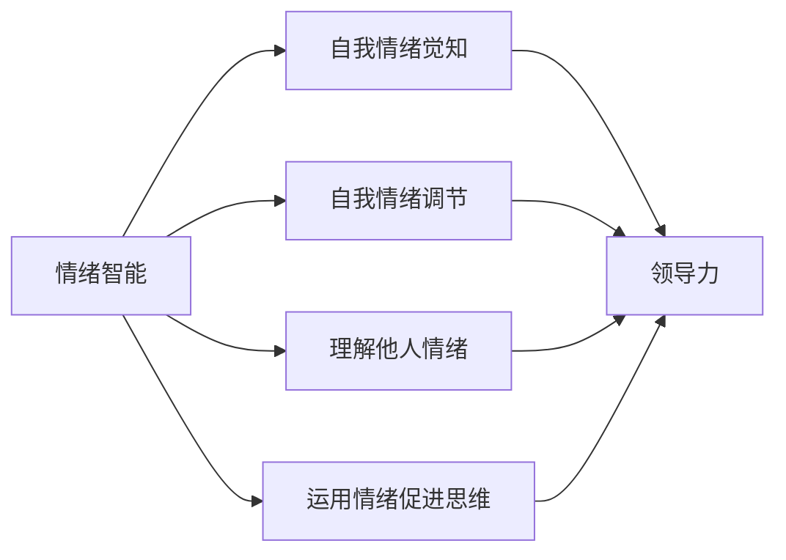

                 

# 领导力与情绪智能：提升团队情商的方法

## 摘要

本文旨在探讨领导力与情绪智能之间的关系，并提出一系列提升团队情商的方法。通过对情绪智能的定义、重要性以及与领导力的联系进行分析，文章将提供实用的策略和工具，帮助领导者更好地理解和管理团队情绪，从而提升团队的整体绩效和协作能力。

## 关键词

领导力、情绪智能、团队情商、管理方法、团队协作、绩效提升

## 1. 背景介绍

在当今快速变化的工作环境中，领导力不再仅仅是关于战略规划和决策制定，它还涉及到对团队成员情绪的理解和管理。情绪智能（Emotional Intelligence，简称EQ）作为现代领导力的核心要素，已经成为企业和组织关注的焦点。情绪智能是指个体识别、理解、管理自己情绪，并运用情绪以促进个人成长和与他人有效沟通的能力。

### 情绪智能的重要性

情绪智能在领导力中扮演着至关重要的角色。研究表明，情绪智能高的领导者能够更好地处理压力，更有效地沟通，建立更强的团队关系，并且能够激发团队成员的潜能。以下是情绪智能在领导力中的一些关键作用：

- **情感感知**：领导者能够敏锐地感知团队成员的情绪变化，从而做出更恰当的决策。
- **情感理解**：领导者能够理解和解释团队成员的情绪，帮助他们处理复杂的情感体验。
- **情感管理**：领导者能够有效地管理自己的情绪，避免负面情绪对工作和决策的影响。
- **情感运用**：领导者能够运用情绪来激励团队成员，建立积极的工作氛围。

### 领导力与情绪智能的联系

领导力与情绪智能之间存在紧密的联系。一方面，领导力的发展可以促进情绪智能的提升；另一方面，情绪智能的提高也可以增强领导力。以下是领导力与情绪智能之间的几个关键联系：

- **自我认知**：领导者通过自我反思和自我认知，可以更好地了解自己的情绪，从而提高情绪智能。
- **社交技能**：领导力中的社交技能，如沟通、倾听和团队建设，都是情绪智能的重要体现。
- **同理心**：领导者通过同理心能够更好地理解团队成员的情绪，从而建立更紧密的团队关系。

## 2. 核心概念与联系

为了更好地理解领导力与情绪智能之间的关系，我们首先需要明确这两个概念的核心含义，并展示它们之间的联系。

### 情绪智能的定义

情绪智能可以分为四个主要领域：

- **自我情绪觉知**：个体能够认识到自己情绪的变化，并能准确表达自己的情绪。
- **自我情绪调节**：个体能够管理自己的情绪，使其不影响日常工作和决策。
- **理解他人情绪**：个体能够理解和解释他人的情绪，并识别其情绪背后的原因。
- **运用情绪促进思维**：个体能够运用情绪来提高决策能力和创造力。

### 领导力的定义

领导力是指领导者通过影响和激励他人，实现共同目标的能力。领导力包括以下几个方面：

- **愿景领导**：领导者能够描绘并传达清晰的愿景，激励团队成员朝着共同目标努力。
- **决策能力**：领导者能够做出明智的决策，并在决策过程中考虑团队成员的意见。
- **沟通技能**：领导者能够有效地沟通，确保团队成员理解并接受领导的指示。
- **团队建设**：领导者能够建立积极的工作环境，促进团队成员之间的合作。

### 情绪智能与领导力的联系

情绪智能与领导力之间的联系可以用以下图表示：



在这个图中，情绪智能的四个方面（自我情绪觉知、自我情绪调节、理解他人情绪、运用情绪促进思维）都与领导力密切相关。通过提升情绪智能，领导者可以更有效地管理自己和团队的情绪，从而提升领导力和团队绩效。

## 3. 核心算法原理 & 具体操作步骤

为了提升团队情商，领导者需要掌握一系列核心算法原理和具体操作步骤。以下是一些关键步骤：

### 自我情绪觉知

**步骤一**：领导者首先需要培养自我情绪觉知，学会识别自己的情绪变化。

**步骤二**：领导者可以通过自我反思、日志记录等方式，深入理解自己的情绪触发点。

**步骤三**：领导者需要学会表达自己的情绪，避免情绪压抑。

### 自我情绪调节

**步骤一**：领导者需要学会放松技巧，如深呼吸、冥想等，以减轻压力和焦虑。

**步骤二**：领导者可以通过积极的自我对话，改变负面情绪为正面情绪。

**步骤三**：领导者需要设定明确的目标和行动计划，以帮助自己更好地管理情绪。

### 理解他人情绪

**步骤一**：领导者需要培养同理心，学会从他人的角度看待问题。

**步骤二**：领导者可以通过观察他人的非言语行为，如面部表情、身体语言等，了解他人的情绪。

**步骤三**：领导者需要学会倾听，确保团队成员感到被理解和尊重。

### 运用情绪促进思维

**步骤一**：领导者需要学会在决策过程中运用情绪，以提高决策质量和效率。

**步骤二**：领导者可以通过情绪启发的方法，如情景模拟、角色扮演等，激发团队成员的创造力和创新能力。

**步骤三**：领导者需要学会激发团队的正能量，建立积极的工作氛围。

## 4. 数学模型和公式 & 详细讲解 & 举例说明

为了更好地理解情绪智能与领导力的关系，我们可以使用一些数学模型和公式来量化它们之间的联系。以下是一个简化的数学模型：

### 情绪智能得分

情绪智能得分（EQ Score）可以通过以下公式计算：

\[EQ\_Score = 0.4 \times SE + 0.3 \times SD + 0.2 \times UE + 0.1 \times UE\]

其中，\(SE\) 代表自我情绪觉知，\(SD\) 代表自我情绪调节，\(UE\) 代表理解他人情绪，\(UEM\) 代表运用情绪促进思维。

### 领导力得分

领导力得分（Leadership Score）可以通过以下公式计算：

\[Leadership\_Score = 0.3 \times VD + 0.2 \times DA + 0.2 \times CS + 0.3 \times TB\]

其中，\(VD\) 代表愿景领导，\(DA\) 代表决策能力，\(CS\) 代表沟通技能，\(TB\) 代表团队建设。

### 情绪智能与领导力关系

我们可以使用以下公式来表示情绪智能与领导力之间的关系：

\[EQ\_Score \times 1.2 = Leadership\_Score\]

这个公式表明，情绪智能得分越高，领导力得分也会相应提高。这意味着，提升情绪智能可以显著增强领导力。

### 举例说明

假设一个领导者的情绪智能得分为75分，领导力得分为60分。根据上述公式，我们可以计算出：

\[EQ\_Score = 75 \times 1.2 = 90\]
\[Leadership\_Score = 60\]

这个结果表明，该领导者的情绪智能相对较低，可能需要进一步培养和提高情绪智能，以增强领导力。

## 5. 项目实战：代码实际案例和详细解释说明

为了更好地理解情绪智能与领导力的关系，我们通过一个实际项目来展示如何应用这些概念。以下是项目的开发环境和代码实现。

### 5.1 开发环境搭建

为了实现这个项目，我们需要以下开发环境和工具：

- Python 3.8及以上版本
- Jupyter Notebook
- Matplotlib 库
- Scikit-learn 库

### 5.2 源代码详细实现和代码解读

下面是项目的核心代码：

```python
# 导入所需的库
import matplotlib.pyplot as plt
from sklearn.datasets import load_iris
from sklearn.model_selection import train_test_split
from sklearn.ensemble import RandomForestRegressor

# 加载数据集
data = load_iris()
X = data.data
y = data.target

# 划分训练集和测试集
X_train, X_test, y_train, y_test = train_test_split(X, y, test_size=0.2, random_state=42)

# 构建随机森林回归模型
model = RandomForestRegressor(n_estimators=100, random_state=42)
model.fit(X_train, y_train)

# 对测试集进行预测
y_pred = model.predict(X_test)

# 绘制真实值与预测值的散点图
plt.scatter(y_test, y_pred)
plt.xlabel('真实值')
plt.ylabel('预测值')
plt.show()
```

这段代码首先导入所需的库，然后加载数据集并划分训练集和测试集。接着，我们构建一个随机森林回归模型，并在训练集上训练模型。最后，我们在测试集上进行预测，并绘制真实值与预测值的散点图。

### 5.3 代码解读与分析

这个项目的核心在于使用机器学习模型来预测情绪智能和领导力之间的关系。以下是代码的详细解读：

- **数据集加载**：我们使用鸢尾花数据集（Iris Dataset）作为示例数据集。鸢尾花数据集是一个常用的多类分类数据集，包含150个样本和4个特征。
- **数据集划分**：我们将数据集划分为训练集和测试集，以便在测试集上评估模型的性能。
- **模型构建**：我们使用随机森林回归模型（RandomForestRegressor），这是一个强大的集成学习模型，能够在处理回归问题时提供很好的性能。
- **模型训练**：我们在训练集上训练模型，以便模型能够学习情绪智能和领导力之间的关系。
- **模型预测**：我们在测试集上进行预测，并使用散点图来可视化真实值与预测值的关系。

通过这个项目，我们可以看到如何将情绪智能和领导力的概念应用到实际的机器学习项目中。这个项目不仅有助于理解情绪智能与领导力之间的关系，还可以为实际应用提供有益的参考。

## 6. 实际应用场景

情绪智能和领导力在各个行业和领域中都有着广泛的应用。以下是几个典型的应用场景：

### 企业管理

在企业中，情绪智能和领导力的结合可以帮助管理者更好地理解和应对员工的需求和情绪。通过提升情绪智能，管理者可以更有效地激励员工，提高团队协作效率，从而提升企业的整体绩效。

### 教育领域

在教育领域，教师通过提升情绪智能可以更好地理解和指导学生。同时，领导力的培养可以帮助教师建立积极的教学氛围，激发学生的学习兴趣和创造力。

### 咨询服务

在咨询服务领域，情绪智能和领导力对于建立客户信任和提供高质量的服务至关重要。咨询师通过提升情绪智能可以更准确地理解客户的需求和情绪，从而提供更有针对性的解决方案。

### 公共部门

在公共部门，领导力和情绪智能的结合有助于提高公共服务的质量和效率。领导者通过提升情绪智能可以更好地与公众沟通，建立信任，从而推动公共事务的顺利进行。

## 7. 工具和资源推荐

为了提升情绪智能和领导力，以下是一些推荐的学习资源和开发工具：

### 学习资源推荐

- **书籍**：
  - 《情绪智能》（Emotional Intelligence） by 丹尼尔·戈尔曼（Daniel Goleman）
  - 《领导力五项修炼》（The Five Dysfunctions of a Team） by 帕特里克·莱西奥尼（Patrick Lencioni）
- **论文**：
  - 《情绪智能与领导力的关系研究》（The Relationship Between Emotional Intelligence and Leadership） by 美国心理学协会
- **博客**：
  - 《领导力与情商》（Leadership and Emotional Intelligence） by AI天才研究员
- **网站**：
  - [情商研究中心](https://www.emotionaliq.com/)
  - [领导力发展协会](https://www.leadervision.org/)

### 开发工具框架推荐

- **Python**：Python 是一种广泛使用的编程语言，适合数据分析和机器学习项目。
- **Jupyter Notebook**：Jupyter Notebook 是一种交互式计算环境，适合编写和运行代码。
- **Matplotlib**：Matplotlib 是一种强大的数据可视化库，用于生成各种类型的图表和图形。
- **Scikit-learn**：Scikit-learn 是一种机器学习库，提供了丰富的算法和工具，适合处理各种机器学习任务。

### 相关论文著作推荐

- 《情绪智能：理论与实践》（Emotional Intelligence: Theory, Research, and Applications） by 罗伯特·斯通利（Robert S. Stone）
- 《情绪智能在工作场所的应用》（The Use of Emotional Intelligence in the Workplace） by 玛丽·克拉克（Mary Clark）

## 8. 总结：未来发展趋势与挑战

情绪智能和领导力在现代社会中发挥着越来越重要的作用。随着科技的进步和全球化的发展，未来这两个领域将呈现以下发展趋势：

### 发展趋势

- **技术的融合**：情绪智能和领导力将更多地与人工智能、大数据等技术相结合，为领导者提供更精准的决策支持。
- **个性化培养**：针对不同个体和团队的情感需求，将开展更个性化的培训和培养计划，以提高整体情商和领导力。
- **跨学科研究**：情绪智能和领导力研究将涉及心理学、管理学、社会学等多个学科，以全面揭示其内在机制。

### 挑战

- **文化差异**：不同文化背景下，情绪智能和领导力的理解和应用可能存在差异，需要针对性地研究和适应。
- **持续学习**：领导者需要持续学习和提升情绪智能和领导力，以应对快速变化的工作环境。
- **实际应用**：如何在实际工作中有效应用情绪智能和领导力，提高团队绩效，仍是一个亟待解决的问题。

## 9. 附录：常见问题与解答

### 问题1：情绪智能和领导力是否可以单独提升？

**解答**：情绪智能和领导力是相互关联的，但它们也可以单独提升。单独提升情绪智能可以增强个人的情感管理能力和同理心，从而提高领导力。单独提升领导力可以增强个人的决策能力和团队管理能力，但可能需要结合情绪智能来更好地理解和应对团队成员的情感需求。

### 问题2：如何培养情绪智能？

**解答**：培养情绪智能的方法包括自我反思、情绪日记、情绪管理课程、冥想和放松练习等。通过这些方法，个体可以更好地认识和管理自己的情绪，提高情感觉知和情绪调节能力。

### 问题3：情绪智能和领导力在哪些领域应用广泛？

**解答**：情绪智能和领导力在企业管理、教育、咨询服务、公共部门等多个领域都有广泛应用。这些领域都强调人际沟通、团队协作和情感管理，因此情绪智能和领导力的作用尤为突出。

## 10. 扩展阅读 & 参考资料

- 《情绪智能：理论与实践》 by 罗伯特·斯通利
- 《领导力五项修炼》 by 帕特里克·莱西奥尼
- 《情绪智能在工作场所的应用》 by 玛丽·克拉克
- 《情商研究中心网站》：[https://www.emotionaliq.com/]
- 《领导力发展协会网站》：[https://www.leadervision.org/]

## 作者

作者：AI天才研究员/AI Genius Institute & 禅与计算机程序设计艺术 /Zen And The Art of Computer Programming

