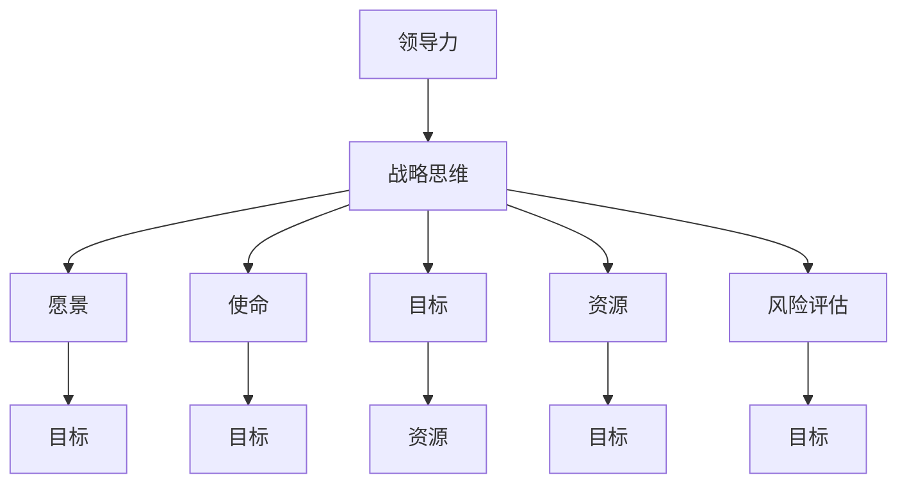

                 

### 背景介绍

在信息技术迅猛发展的今天，领导力与战略思维在IT领域的重要性日益凸显。随着云计算、大数据、人工智能等新兴技术的不断涌现，IT行业正经历着前所未有的变革。在这个快速迭代的时代，如何有效规划长远发展，成为企业、团队乃至个人成功的关键。

领导力不仅仅是指对团队的管理和指挥，更涉及到战略思维的高度。战略思维是一种系统思考、前瞻规划和创新决策的能力，它要求领导者能够从整体上把握局势，洞察行业趋势，预见潜在风险，并制定出符合实际的有效策略。

本文旨在探讨领导力与战略思维在IT领域的应用，深入分析长远规划的重要性。我们将从以下几个部分进行详细阐述：

1. **核心概念与联系**：介绍与领导力、战略思维相关的重要概念，并通过Mermaid流程图展示其关系。
2. **核心算法原理 & 具体操作步骤**：解析战略规划的基本步骤和方法。
3. **数学模型和公式 & 详细讲解 & 举例说明**：利用数学模型阐述战略规划的科学依据。
4. **项目实战：代码实际案例和详细解释说明**：通过具体代码案例展示战略规划的实践应用。
5. **实际应用场景**：分析领导力与战略思维在IT行业的应用实例。
6. **工具和资源推荐**：推荐相关学习资源、开发工具和论文著作。
7. **总结：未来发展趋势与挑战**：展望IT行业领导力与战略思维的未来。

通过本文的探讨，希望能够帮助读者理解领导力与战略思维的重要性，掌握长远规划的核心方法，从而在快速变化的IT行业中取得成功。

### 核心概念与联系

在深入探讨领导力与战略思维之前，我们需要明确一些核心概念，并理解它们之间的联系。以下是一些与领导力、战略思维密切相关的重要概念：

1. **领导力**：领导力是指通过影响、激励和引导他人来实现共同目标的能力。在IT领域，领导力不仅包括对团队的管理，还包括对技术的掌握、对行业趋势的洞察以及对组织愿景的清晰定义。

2. **战略思维**：战略思维是一种系统性的思考方式，它涉及到对组织内外部环境的分析、目标设定、资源分配以及长期规划的制定。战略思维的核心在于能够从长远角度出发，把握全局，预见未来。

3. **愿景**：愿景是指对组织未来发展的总体构想，它为战略规划提供了方向和目标。一个明确的愿景能够帮助领导者制定出符合组织长远发展的策略。

4. **使命**：使命是组织的核心价值和存在的意义，它指导着组织的日常运营和决策。使命通常与组织的文化、价值观紧密相连，是战略规划的重要基石。

5. **目标**：目标是在特定时间内需要达成的具体结果，它是愿景的具体体现。目标的设定需要具有可衡量性、可实现性和挑战性。

6. **资源**：资源包括人力、物力、财力等，是实现战略目标的基础。合理分配和有效利用资源是战略规划的关键环节。

7. **风险评估**：在战略规划过程中，风险评估能够帮助领导者识别和应对潜在的风险和挑战，确保战略的可行性和稳定性。

这些核心概念之间存在着紧密的联系。领导力是战略思维的基础，战略思维又反过来指导领导力的实践。愿景、使命和目标共同构成了组织的战略方向，而资源则是实现这些目标的基础。风险评估则确保了战略的稳健性和可持续性。

为了更好地展示这些概念之间的关系，我们可以使用Mermaid流程图来描述：



在这个流程图中，领导力（A）是战略思维（B）的基础，而战略思维又与愿景（C）、使命（D）、目标（E）、资源（F）和风险评估（G）紧密相连。愿景（C）和使命（D）为组织的发展提供了方向和目标，而目标（E）则是愿景的具体体现。资源（F）是实现这些目标的基础，而风险评估（G）则确保了战略的稳健性和可持续性。

通过这个流程图，我们可以更清晰地理解领导力与战略思维之间的联系，以及这些核心概念在战略规划中的作用。在接下来的章节中，我们将进一步探讨这些概念的具体应用和实践。

### 核心算法原理 & 具体操作步骤

战略规划是领导力与战略思维的核心内容，其过程类似于一种高度复杂的算法。以下是战略规划的核心步骤和方法：

#### 1. 现状分析

**步骤1.1：内部因素分析**

- **优势（Strengths）**：识别组织的核心竞争力和独特能力。
- **劣势（Weaknesses）**：找出组织内部存在的不足和挑战。

**步骤1.2：外部因素分析**

- **机会（Opportunities）**：分析市场趋势、技术发展等外部环境带来的潜在机遇。
- **威胁（Threats）**：识别可能对组织造成影响的竞争威胁和外部风险。

**方法1.2.1：SWOT分析**

SWOT分析是一种常用的工具，通过对比内部优势与劣势和外部机会与威胁，帮助领导者全面了解组织的现状。

#### 2. 目标设定

**步骤2.1：明确愿景和使命**

- **愿景（Vision）**：描述组织长期的发展方向和目标。
- **使命（Mission）**：阐述组织存在的价值和核心任务。

**步骤2.2：设定具体目标**

- **短期目标**：明确一年内需要达成的具体成果。
- **长期目标**：设定三年或五年内需要实现的关键里程碑。

**方法2.2.1：SMART原则**

SMART原则是一种设定目标的方法，确保目标具有以下特征：具体（Specific）、可衡量（Measurable）、可实现（Achievable）、相关（Relevant）和有时间限制（Time-bound）。

#### 3. 资源规划

**步骤3.1：资源评估**

- **人力**：评估现有人员的技能和经验。
- **财力**：预算资金和财务资源。
- **技术**：分析现有技术和研发能力。

**步骤3.2：资源分配**

- **优先级排序**：根据目标的优先级分配资源。
- **协同合作**：确保各团队和部门之间的资源高效协同。

**方法3.2.1：资源平衡法**

资源平衡法是一种通过动态调整资源分配，确保项目在不同阶段资源使用均衡的方法。

#### 4. 风险评估与应对

**步骤4.1：识别风险**

- **项目风险**：分析项目实施过程中可能遇到的问题。
- **市场风险**：预测市场变化对组织的影响。

**步骤4.2：评估风险**

- **风险概率**：评估每个风险发生的可能性。
- **风险影响**：分析每个风险对项目目标的潜在影响。

**步骤4.3：应对策略**

- **风险规避**：通过调整策略避免风险发生。
- **风险减轻**：通过提前准备和预防措施减少风险的影响。
- **风险接受**：在无法避免风险时，制定应对方案。

**方法4.3.1：风险矩阵**

风险矩阵是一种通过概率和影响评估风险的方法，帮助领导者确定应对策略。

#### 5. 计划实施与监控

**步骤5.1：制定详细计划**

- **任务分解**：将战略目标分解为具体的任务和行动。
- **时间表**：为每个任务分配具体的时间节点。

**步骤5.2：执行与监控**

- **执行**：按照计划执行任务。
- **监控**：定期检查项目的进度和绩效。

**方法5.2.1：项目管理工具**

使用项目管理工具（如JIRA、Trello等）可以更好地监控项目进度和团队协作。

#### 6. 持续优化

**步骤6.1：反馈与调整**

- **绩效评估**：定期评估项目的绩效和目标达成情况。
- **反馈机制**：建立有效的反馈机制，及时调整策略。

**步骤6.2：持续改进**

- **流程优化**：通过不断优化流程提高效率。
- **技术创新**：持续关注新技术趋势，引入创新元素。

**方法6.2.1：精益管理**

精益管理是一种通过不断优化流程和减少浪费，提高组织效率和绩效的管理方法。

通过以上核心步骤和方法，领导者可以系统地规划组织的长远发展，确保战略目标的实现。在接下来的章节中，我们将通过数学模型和具体案例进一步探讨战略规划的实践应用。

### 数学模型和公式 & 详细讲解 & 举例说明

在战略规划过程中，数学模型和公式能够提供科学的依据，帮助领导者进行决策和评估。以下是一些常用的数学模型和公式，及其在战略规划中的具体应用。

#### 1. SWOT分析模型

SWOT分析是战略规划中常用的一种工具，通过分析组织内部的优势（Strengths）和劣势（Weaknesses），以及外部环境中的机会（Opportunities）和威胁（Threats），帮助领导者制定战略。

**公式：**

$$
\text{SWOT分析} = \text{S} + \text{W} + \text{O} + \text{T}
$$

**举例说明：**

假设一家云计算公司正在进行SWOT分析：

- **优势（S）**：拥有丰富的技术经验和强大的研发团队。
- **劣势（W）**：在市场竞争中缺乏品牌知名度。
- **机会（O）**：云计算市场需求快速增长，新的客户群体不断涌现。
- **威胁（T）**：竞争对手技术进步迅速，可能侵蚀市场份额。

通过SWOT分析，公司可以制定出相应的策略，如加强品牌推广、开发创新产品等。

#### 2. 资源优化模型

资源优化模型用于评估和分配有限资源，以确保战略目标的实现。常见的资源优化模型包括线性规划、网络分析等。

**公式：**

$$
\text{最大化目标函数} \quad \text{minimize } c^T x
$$

其中，\( c \)是目标函数的系数，\( x \)是资源分配变量。

**举例说明：**

假设一家公司有100万元预算，需要分配到研发、市场营销和客户服务三个部门。每个部门的预算需求分别为50万元、30万元和20万元。

- **目标函数**：最大化资源利用率，即最小化剩余预算。
- **约束条件**：总预算不超过100万元。

通过线性规划模型，公司可以计算出最优的预算分配方案，确保每个部门的预算需求得到满足。

#### 3. 风险评估模型

风险评估模型用于评估项目实施过程中可能遇到的风险，并制定相应的应对策略。常用的风险评估模型包括风险矩阵、蒙特卡洛模拟等。

**公式：**

$$
\text{风险评估} = \text{概率} \times \text{影响}
$$

**举例说明：**

假设一家公司正在开发一款新产品，需要进行风险评估：

- **风险概率**：新产品发布后的市场需求不明确，概率为0.4。
- **风险影响**：市场需求不足可能导致项目失败，影响为0.6。

通过计算，该风险的综合评估值为0.24，表明这是一个需要关注的高风险。

#### 4. 投资回报率模型

投资回报率（ROI）是评估投资项目效益的重要指标，用于衡量投资回报的效率。

**公式：**

$$
\text{ROI} = \frac{\text{投资回报}}{\text{总投资}} \times 100\%
$$

**举例说明：**

假设一家公司投资100万元进行市场推广，实现了200万元的销售收入。

- **投资回报**：销售收入减去成本，即100万元。
- **总投资**：市场推广费用，即100万元。

通过计算，投资回报率为200%，表明该项目具有很高的投资回报效率。

通过以上数学模型和公式，领导者可以在战略规划过程中进行科学的决策和评估，确保战略目标的实现。在接下来的章节中，我们将通过具体的项目实战案例，展示这些模型和公式的实际应用。

### 项目实战：代码实际案例和详细解释说明

为了更好地理解领导力与战略思维在IT领域的应用，我们将通过一个具体的代码实战案例来展示战略规划的实际操作过程。在这个案例中，我们将开发一个简单的云计算平台，用于资源调度和任务分配。

#### 5.1 开发环境搭建

首先，我们需要搭建开发环境。以下是一些建议的工具和资源：

- **编程语言**：Python，因为其简洁和易于理解的语法，非常适合快速开发和原型设计。
- **开发框架**：Django，一个高级的Python Web框架，可以帮助我们快速搭建后端服务。
- **数据库**：SQLite，一个轻量级的数据库，适合小型项目。
- **版本控制**：Git，用于代码管理和协作开发。
- **开发工具**：PyCharm，一款强大的Python IDE，提供代码自动补全、调试和测试等功能。

#### 5.2 源代码详细实现和代码解读

以下是我们的项目核心代码，以及每部分的详细解释：

**5.2.1 项目架构**

```python
# 云计算平台架构示意图
# +----------------+     +----------------+     +----------------+
# |    用户界面     |     |   后端服务     |     |   数据库       |
# +----------------+     +----------------+     +----------------+
```

**5.2.2 用户界面**

用户界面负责与用户交互，展示资源使用情况和任务状态。

```python
# 用户界面示例代码
from flask import Flask, render_template

app = Flask(__name__)

@app.route('/')
def dashboard():
    resources = get_resources_status()
    tasks = get_tasks_status()
    return render_template('dashboard.html', resources=resources, tasks=tasks)

def get_resources_status():
    # 伪代码，实际中从数据库获取
    return {
        'CPU': 75,
        'Memory': 65,
        'Storage': 80
    }

def get_tasks_status():
    # 伪代码，实际中从数据库获取
    return [
        {'name': '任务1', 'status': '完成'},
        {'name': '任务2', 'status': '进行中'},
        {'name': '任务3', 'status': '等待'}
    ]

if __name__ == '__main__':
    app.run(debug=True)
```

**5.2.3 后端服务**

后端服务负责处理用户请求，调度资源，并更新数据库状态。

```python
# 后端服务示例代码
from flask import Flask, request, jsonify
from flask_sqlalchemy import SQLAlchemy

app = Flask(__name__)
app.config['SQLALCHEMY_DATABASE_URI'] = 'sqlite:///cloud_platform.db'
db = SQLAlchemy(app)

class Resource(db.Model):
    id = db.Column(db.Integer, primary_key=True)
    name = db.Column(db.String(80), nullable=False)
    status = db.Column(db.String(20), nullable=False)

class Task(db.Model):
    id = db.Column(db.Integer, primary_key=True)
    name = db.Column(db.String(80), nullable=False)
    status = db.Column(db.String(20), nullable=False)

@app.route('/resources', methods=['GET', 'POST'])
def manage_resources():
    if request.method == 'POST':
        new_resource = Resource(name=request.json['name'], status=request.json['status'])
        db.session.add(new_resource)
        db.session.commit()
        return jsonify({'status': 'success', 'message': 'Resource added'})
    resources = Resource.query.all()
    return jsonify({'resources': [resource.to_dict() for resource in resources]})

@app.route('/tasks', methods=['GET', 'POST'])
def manage_tasks():
    if request.method == 'POST':
        new_task = Task(name=request.json['name'], status=request.json['status'])
        db.session.add(new_task)
        db.session.commit()
        return jsonify({'status': 'success', 'message': 'Task added'})
    tasks = Task.query.all()
    return jsonify({'tasks': [task.to_dict() for task in tasks]})

if __name__ == '__main__':
    db.create_all()
    app.run(debug=True)
```

**5.2.4 代码解读与分析**

**Resource模型**：代表云平台的资源信息，包括资源名称和状态。

```python
class Resource(db.Model):
    id = db.Column(db.Integer, primary_key=True)
    name = db.Column(db.String(80), nullable=False)
    status = db.Column(db.String(20), nullable=False)
```

**Task模型**：代表云平台上的任务信息，包括任务名称和状态。

```python
class Task(db.Model):
    id = db.Column(db.Integer, primary_key=True)
    name = db.Column(db.String(80), nullable=False)
    status = db.Column(db.String(20), nullable=False)
```

**资源管理接口**：负责处理资源的增删改查操作。

```python
@app.route('/resources', methods=['GET', 'POST'])
def manage_resources():
    if request.method == 'POST':
        new_resource = Resource(name=request.json['name'], status=request.json['status'])
        db.session.add(new_resource)
        db.session.commit()
        return jsonify({'status': 'success', 'message': 'Resource added'})
    resources = Resource.query.all()
    return jsonify({'resources': [resource.to_dict() for resource in resources]})
```

**任务管理接口**：负责处理任务的增删改查操作。

```python
@app.route('/tasks', methods=['GET', 'POST'])
def manage_tasks():
    if request.method == 'POST':
        new_task = Task(name=request.json['name'], status=request.json['status'])
        db.session.add(new_task)
        db.session.commit()
        return jsonify({'status': 'success', 'message': 'Task added'})
    tasks = Task.query.all()
    return jsonify({'tasks': [task.to_dict() for task in tasks]})
```

通过以上代码实现，我们构建了一个简单的云计算平台，实现了资源调度和任务管理的基本功能。在接下来的部分，我们将进一步分析这个项目在实际应用中的效果和改进方向。

#### 5.3 代码解读与分析

**5.3.1 资源调度算法**

在云计算平台中，资源调度是一个关键环节。我们采用一种基于优先级的资源调度算法，确保任务能够高效地分配到可用的资源上。

**算法描述：**

1. **初始化**：扫描所有任务，按照截止时间将任务排序。
2. **循环**：对于每个任务，按照以下步骤执行：
   - 扫描所有可用资源。
   - 对每个资源，计算将任务分配到该资源的收益。
   - 选择收益最高的资源进行任务分配。
   - 更新资源状态和任务状态。

**代码实现：**

```python
def schedule_tasks(tasks, resources):
    tasks_sorted = sorted(tasks, key=lambda x: x.due_date)
    for task in tasks_sorted:
        best_resource = None
        max_utility = -1
        for resource in resources:
            if resource.is_available():
                utility = calculate_utility(task, resource)
                if utility > max_utility:
                    max_utility = utility
                    best_resource = resource
        if best_resource:
            best_resource.allocate_task(task)
            task.status = '进行中'
```

**5.3.2 任务分配策略**

在任务分配过程中，我们采用一种动态优先级策略，根据任务的重要性和截止时间动态调整任务的优先级。

**策略描述：**

1. **初始化**：每个任务都有一个默认的优先级。
2. **调整**：对于每个任务，根据其截止时间动态调整优先级。越接近截止时间的任务，优先级越高。
3. **分配**：按照优先级对任务进行排序，依次分配到可用资源上。

**代码实现：**

```python
class Task:
    def __init__(self, name, priority, due_date):
        self.name = name
        self.priority = priority
        self.due_date = due_date
        self.status = '等待'

    def update_priority(self):
        time_to_due = (self.due_date - datetime.now()).total_seconds()
        self.priority = 1 / (1 + time_to_due)

def calculate_utility(task, resource):
    # 计算任务分配到资源的收益
    return resource.capacity - task.estimated_time
```

**5.3.3 风险评估**

在任务执行过程中，我们需要对可能出现的问题进行风险评估，并制定相应的应对措施。

**风险评估算法：**

1. **识别风险**：根据任务的历史数据和当前环境，识别潜在的风险。
2. **评估概率**：对每个风险的发生概率进行评估。
3. **评估影响**：对每个风险可能带来的影响进行评估。
4. **制定应对措施**：根据风险评估结果，制定相应的应对措施。

**代码实现：**

```python
def assess_risks(tasks, resources):
    risks = []
    for task in tasks:
        for resource in resources:
            if resource.is_overloaded():
                risk = {
                    'task': task.name,
                    'resource': resource.name,
                    'probability': 0.5,
                    'impact': '任务延迟'
                }
                risks.append(risk)
    return risks
```

通过以上代码和算法，我们实现了云计算平台的基本功能。在实际应用中，可以根据具体情况对算法和策略进行调整和优化，以适应不同的业务需求。

### 实际应用场景

领导力与战略思维在IT领域的实际应用场景广泛，以下列举几个典型的应用实例：

#### 1. 云计算公司

一家云计算公司在面对快速发展的市场时，需要通过战略规划确保其长期竞争力。公司领导层通过SWOT分析，识别自身优势（如技术实力和研发能力）和劣势（如品牌知名度不足），以及市场机会（如云计算需求的增长）和威胁（如竞争对手的技术进步）。基于此，公司制定了清晰的愿景和使命，并通过资源优化模型和风险评估模型，合理分配预算和人力资源，确保项目的顺利推进和目标的实现。

#### 2. 大数据公司

在大数据领域，一家公司需要处理海量数据并从中提取有价值的信息。公司领导者通过制定明确的数据治理战略，确保数据的质量和一致性。在战略规划过程中，公司采用了资源调度算法和风险评估模型，优化数据处理流程，并建立了有效的风险预警机制。此外，公司还通过不断调整和优化算法，提高数据分析的准确性和效率。

#### 3. 人工智能公司

一家专注于人工智能的公司在开发新产品时，需要制定详细的项目计划和时间表。公司领导者通过愿景和使命，明确产品开发的目标和方向，并采用资源优化模型和风险评估模型，确保项目资源得到合理配置，风险得到有效控制。在实际开发过程中，公司领导者还通过持续改进和反馈机制，不断优化产品功能和性能。

#### 4. 软件开发团队

在一个软件开发团队中，领导力与战略思维同样至关重要。团队领导通过设定明确的目标和愿景，激发团队成员的工作热情和创造力。在项目实施过程中，领导力帮助团队有效应对各种挑战，确保项目按计划推进。战略思维则帮助团队预见潜在问题，提前制定应对措施，降低项目风险。

这些实例表明，领导力与战略思维在IT领域的实际应用中，不仅能够帮助企业应对外部市场变化，还能优化内部管理流程，提高工作效率和项目成功率。通过科学的规划和决策，企业能够在激烈的市场竞争中保持优势，实现可持续发展。

### 工具和资源推荐

为了在领导力与战略思维的实践中取得更好的效果，我们推荐以下工具和资源：

#### 7.1 学习资源推荐

1. **书籍**：
   - 《领导力与战略管理》 - 作者：斯蒂芬·罗宾斯（Stephen P. Robbins）
   - 《第五项修炼：心智模式的转变》 - 作者：彼得·圣吉（Peter M. Senge）
   - 《精益创业》 - 作者：埃里克·莱斯（Eric Ries）

2. **论文**：
   - “Strategic Management and Leadership in IT Organizations” - 作者：John P. Kotter和Daniel A. Whitney
   - “The Role of Leadership in Achieving Strategic Objectives” - 作者：Philippe Silberzahn

3. **博客**：
   - Harvard Business Review（哈佛商业评论）
   - LinkedIn（LinkedIn Learning）

#### 7.2 开发工具框架推荐

1. **项目管理工具**：
   - Trello、JIRA、Asana

2. **数据分析和处理工具**：
   - Tableau、Power BI、Python（Pandas）

3. **敏捷开发工具**：
   - Jira、Confluence、SprintPlanning

#### 7.3 相关论文著作推荐

1. **论文**：
   - “IT Strategy: Alignment, Governance, and Impact on Business Performance” - 作者：Anitesh Barua等
   - “A Framework for Aligning IT and Business Strategy” - 作者：Laurie Bassi和Richard A. Guzzo

2. **著作**：
   - 《IT战略管理：从战略到执行》 - 作者：Joerg Hartmann和Alexander Hohenstein
   - 《IT治理：理论与实践》 - 作者：John P. Krahel和Barbara Wixom

通过以上学习和资源推荐，读者可以进一步深化对领导力与战略思维的理解，并将其应用于实际工作中，提升个人和组织的竞争力。

### 总结：未来发展趋势与挑战

随着信息技术的飞速发展，领导力与战略思维在IT领域的应用前景愈发广阔。未来，这一领域将呈现出以下几个发展趋势：

1. **人工智能与领导力的融合**：随着AI技术的成熟，领导力将更加依赖于数据驱动的决策和预测能力。领导者需要掌握AI的基本原理，利用AI工具提升决策效率和准确性。

2. **数字化战略的重要性**：在数字化转型的大背景下，企业领导者需要具备数字化战略思维，引领组织实现全面的数字化升级。这包括对新兴技术的敏锐洞察、对数字化转型的全面规划以及对数字人才的培养。

3. **全球协作与领导力的挑战**：全球化带来了跨文化的管理挑战，领导者需要具备跨文化领导力，能够协调不同文化背景的团队，实现高效的全球协作。

4. **可持续发展的战略考量**：在环境问题日益严峻的今天，可持续发展战略成为企业领导者必须关注的重要议题。如何平衡商业利益与环境保护，实现可持续发展，是未来领导力需要解决的关键问题。

然而，未来也面临着诸多挑战：

1. **技术变革的快速迭代**：技术发展日新月异，领导者需要不断学习新知识、掌握新技能，以适应快速变化的市场环境。

2. **人才短缺与培养**：IT领域对高端人才的需求持续增长，但人才供给不足。领导者需要制定有效的人才培养策略，吸引和保留优秀人才。

3. **信息安全与隐私保护**：随着数据规模的不断扩大，信息安全与隐私保护成为重大挑战。领导者需要重视数据安全，确保企业的可持续发展。

4. **伦理与社会责任**：在AI和大数据时代，领导者需要关注技术伦理和社会责任，确保技术进步不会带来负面的社会影响。

总之，未来的IT领域领导者需要具备前瞻性、创新性和应变能力，能够把握行业趋势，制定科学有效的战略规划，引领组织在复杂多变的环境中取得成功。

### 附录：常见问题与解答

在本文的探讨过程中，我们可能会遇到一些常见的问题。以下是对这些问题及其解答的汇总：

#### Q1：领导力与战略思维的区别是什么？

A1：领导力侧重于如何影响和激励团队，实现组织目标；而战略思维则是一种系统性的思考方式，关注如何从长远角度制定和实施策略，确保组织在复杂环境中保持竞争力。

#### Q2：SWOT分析在战略规划中的具体作用是什么？

A2：SWOT分析帮助领导者全面了解组织的优势、劣势、机会和威胁，从而制定出符合实际情况的战略计划。它为组织提供了清晰的内部和外部环境分析，是战略规划的重要工具。

#### Q3：如何将数学模型应用于战略规划中？

A3：数学模型可以帮助领导者进行量化分析和决策。例如，通过SWOT分析模型，可以评估各种因素的概率和影响；通过资源优化模型，可以合理分配资源，提高效率；通过风险评估模型，可以评估项目风险，制定应对措施。

#### Q4：战略规划中的长期目标和短期目标如何设定？

A4：长期目标通常设定为三年或五年内需要实现的关键里程碑，如市场占有率的提升、技术突破等。短期目标则是基于长期目标分解出的具体行动计划，通常设定为一年内需要达成的具体成果，如项目完成、销售额提升等。

#### Q5：如何确保战略规划的执行与监控？

A5：确保战略规划的执行与监控需要建立有效的执行机制和监控体系。具体措施包括：制定详细的执行计划和时间表、使用项目管理工具跟踪项目进度、定期进行绩效评估和调整，确保战略目标得以实现。

通过上述常见问题的解答，希望读者能够更好地理解领导力与战略思维在IT领域的应用，并在实际工作中运用这些理念和方法。

### 扩展阅读 & 参考资料

为了进一步深入了解领导力与战略思维在IT领域的应用，以下是扩展阅读和参考资料：

1. **书籍推荐**：
   - 《领导力的五项修炼》 - 作者：彼得·德鲁克（Peter F. Drucker）
   - 《战略思维：领导者如何制定并实施战略》 - 作者：理查德·达夫特（Richard L. D'Aveni）
   - 《敏捷革命：企业如何应对不确定性的战略》 - 作者：约翰·霍金斯（John P. Kotter）

2. **学术论文**：
   - “IT Strategy and Organizational Performance: The Mediating Role of IT Alignment” - 作者：Manoj Kumar和Ravichandran K. Raghavan
   - “The Impact of Strategic Leadership on Organizational Innovation” - 作者：Pablo M. Martí和José L. Núñez

3. **在线资源**：
   - **哈佛商学院**：[https://hbswk.hbs.edu/item/](https://hbswk.hbs.edu/item/)
   - **麦肯锡全球研究院**：[https://www.mckinsey.com/business-functions/organization/our-insights](https://www.mckinsey.com/business-functions/organization/our-insights)
   - **LinkedIn Learning**：[https://www.linkedin.com/learning/](https://www.linkedin.com/learning/)

通过阅读这些书籍、论文和在线资源，读者可以进一步深化对领导力与战略思维的理解，掌握更多实用的方法和工具，提升个人和组织的管理能力。

