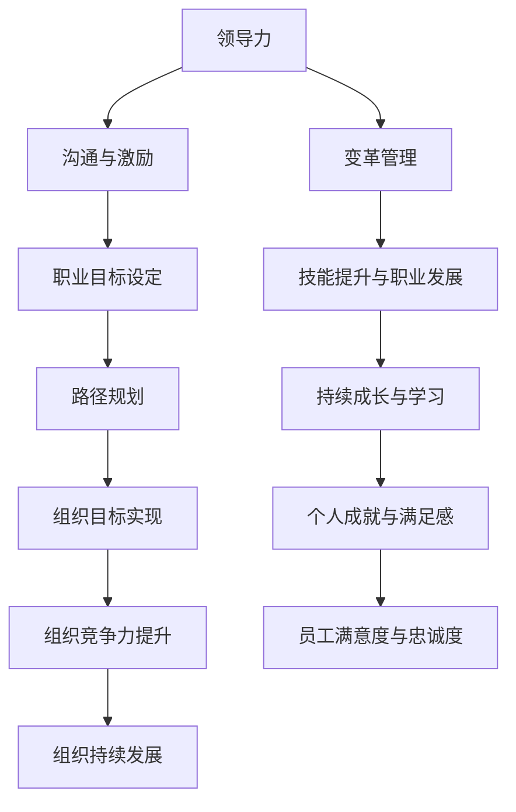

                 

### 文章标题：领导力与职业生涯规划：助力员工成长

> **关键词**：领导力、职业生涯规划、员工成长、组织发展
> 
> **摘要**：本文将探讨领导力在职业生涯规划中的作用，以及如何通过有效的职业生涯规划助力员工成长，提高组织的整体竞争力。通过分析领导力的核心要素、职业生涯规划的策略，以及二者之间的互动关系，本文旨在为管理者提供实用的指导，以支持员工的职业发展。

在当今快速变化的商业环境中，领导力和职业生涯规划已成为企业成功的关键因素。领导力不仅关乎领导者的个人魅力和影响力，还涉及到如何激发和培养团队成员的潜力。职业生涯规划则帮助员工明确个人目标，制定实现目标的路径，并在职业生涯中保持动力和满足感。本文将深入探讨领导力与职业生涯规划之间的关系，以及如何通过这些策略助力员工成长，从而提高组织的整体竞争力。

本文将分为以下几个部分：

1. **背景介绍**：分析领导力与职业生涯规划在当前商业环境中的重要性。
2. **核心概念与联系**：介绍领导力的核心概念，职业生涯规划的基本策略，并使用Mermaid流程图展示二者之间的联系。
3. **核心算法原理 & 具体操作步骤**：详细讨论如何构建有效的职业生涯规划体系。
4. **数学模型和公式 & 详细讲解 & 举例说明**：阐述职业生涯规划中的关键数学模型和公式，并提供实际案例说明。
5. **项目实战：代码实际案例和详细解释说明**：通过具体代码案例展示职业生涯规划的实施过程。
6. **实际应用场景**：探讨职业生涯规划在不同行业和组织中的应用。
7. **工具和资源推荐**：推荐有助于提升领导力和职业生涯规划能力的工具和资源。
8. **总结：未来发展趋势与挑战**：预测领导力和职业生涯规划的未来发展趋势，并讨论可能面临的挑战。
9. **附录：常见问题与解答**：提供对常见问题的解答。
10. **扩展阅读 & 参考资料**：推荐相关领域的研究文献和资源。

现在，我们正式开始探讨领导力与职业生涯规划的核心内容。首先，我们需要了解这两个概念的基本定义，并分析它们在组织发展中的重要性。让我们一步一步进行深入分析。

#### 1. 背景介绍

在当今全球化和技术创新驱动的商业环境中，企业面临着前所未有的竞争压力和变化速度。为了在这种动态环境中保持竞争力，企业不仅需要拥有创新的产品和服务，还需要一支充满活力、不断成长和具备高度敬业精神的员工队伍。

**领导力**是指领导者通过激发、指导和激励团队成员，实现共同目标的能力。它不仅包括领导者的个人魅力和影响力，还涉及到领导者的决策能力、沟通技巧、变革管理能力等。有效的领导力能够提高团队绩效，促进创新，增强组织的适应性和灵活性。

**职业生涯规划**则是指员工为了实现个人职业目标而进行的系统性思考和行动。它包括自我评估、目标设定、路径规划、技能发展等多个方面。通过职业生涯规划，员工能够更好地理解自己的兴趣、价值观和优势，找到符合自己职业目标的岗位，并在职业生涯中持续成长。

在当前的商业环境中，领导力和职业生涯规划的重要性体现在以下几个方面：

1. **提高员工满意度和忠诚度**：有效的领导力和职业生涯规划能够满足员工对职业发展的期望，提高员工的工作满意度和忠诚度。
2. **促进员工技能和能力的提升**：职业生涯规划帮助员工明确学习和发展方向，通过培训和职业发展机会提升员工的技能和能力。
3. **增强组织的竞争力**：拥有高度专业化和适应能力的员工队伍是组织成功的关键。有效的职业生涯规划有助于培养组织内部的专业人才，提高整体竞争力。
4. **应对变化和挑战**：在快速变化的市场环境中，组织需要具备快速适应和变革的能力。领导力和职业生涯规划有助于组织培养灵活的团队和个体，应对外部环境的变化。

因此，领导力和职业生涯规划不仅是员工个人发展的需要，也是组织持续发展的关键。在接下来的部分中，我们将进一步探讨领导力的核心概念和职业生涯规划的基本策略。通过理解这些核心概念和策略，我们将能够更好地应用它们，助力员工成长和组织发展。

#### 2. 核心概念与联系

在深入探讨领导力和职业生涯规划之前，我们需要明确这两个概念的基本定义，并分析它们在组织中的相互关系。

**领导力**是指领导者通过激发、指导和激励团队成员，实现共同目标的能力。它包括以下几个方面：

- **个人魅力**：领导者具有的吸引和影响他人的能力。
- **沟通技巧**：领导者有效传达信息、倾听和理解团队成员的能力。
- **决策能力**：领导者做出明智决策、平衡不同利益和风险的能力。
- **变革管理能力**：领导者引导团队适应变化、克服变革阻力、推动组织持续发展的能力。

**职业生涯规划**是指员工为了实现个人职业目标而进行的系统性思考和行动。它包括以下几个关键步骤：

1. **自我评估**：员工通过自我反思，了解自己的兴趣、价值观、优势和不足。
2. **目标设定**：员工根据自我评估结果，设定具体的职业目标。
3. **路径规划**：员工制定实现职业目标的步骤和计划，包括必要的技能培训、工作经验积累等。
4. **技能发展**：员工通过学习和实践，提升所需技能，以实现职业目标。

在组织层面，领导力和职业生涯规划之间存在紧密的互动关系：

- **领导力推动职业生涯规划**：领导者通过有效的沟通、激励和指导，帮助员工理解职业生涯规划的重要性，并提供必要的支持和资源。
- **职业生涯规划促进领导力发展**：通过职业生涯规划，员工能够明确个人职业目标，积极参与组织的发展，从而提高领导力水平。

为了更好地展示领导力和职业生涯规划之间的联系，我们可以使用Mermaid流程图来描述这一过程。以下是一个简化的Mermaid流程图示例：



在这个流程图中，领导力通过沟通与激励、变革管理等途径影响员工的职业目标设定、路径规划和技能提升。这些过程又反过来促进员工的个人成就与满足感，提高员工满意度与忠诚度，从而增强组织的竞争力，实现组织的持续发展。

通过理解领导力和职业生涯规划的核心概念和相互关系，我们可以更好地应用这些策略，助力员工成长和组织发展。在接下来的部分中，我们将进一步讨论如何构建有效的职业生涯规划体系，以支持员工的职业发展。

#### 3. 核心算法原理 & 具体操作步骤

构建一个有效的职业生涯规划体系是帮助员工实现个人职业目标的关键。这一体系需要结合组织的发展需求和员工的个人兴趣、能力和价值观，通过科学的方法和明确的步骤来实现。以下是构建职业生涯规划体系的核心算法原理和具体操作步骤：

**3.1 自我评估**

自我评估是职业生涯规划的第一步，旨在帮助员工了解自己的兴趣、价值观、优势和能力。这一过程可以通过以下方法进行：

- **兴趣评估**：使用霍兰德职业兴趣量表等工具，了解员工对各种工作的兴趣和偏好。
- **价值观评估**：使用迈尔斯-布里格斯性格类型指标（MBTI）等工具，识别员工的价值观和生活方式偏好。
- **能力评估**：通过工作表现、技能考核和同事反馈，评估员工的能力和潜力。
- **优势评估**：使用优势识别工具，如优势识别测试（StrengthsFinder），帮助员工发现自身独特的优势。

**3.2 目标设定**

在自我评估的基础上，员工需要设定明确的职业目标。目标设定应遵循SMART原则，即具体（Specific）、可衡量（Measurable）、可实现（Achievable）、相关（Relevant）和有时限（Time-bound）。以下是目标设定的具体步骤：

1. **明确目标类型**：根据员工的职业规划方向，设定短期、中期和长期目标。短期目标通常在1年内实现，中期目标在3-5年内实现，长期目标则可能需要5年以上。
2. **设定具体目标**：将抽象的目标转化为具体的行动计划。例如，如果目标是成为项目经理，具体行动计划可能包括参加项目管理培训、积累相关工作经验等。
3. **制定时间表**：为每个目标设定明确的实现时间表，并安排关键里程碑。

**3.3 路径规划**

路径规划是职业生涯规划中的关键步骤，旨在帮助员工确定实现职业目标的最佳路径。以下是路径规划的具体步骤：

1. **分析职业领域**：了解员工所感兴趣的职业领域，包括其行业趋势、职位要求和发展路径。
2. **识别发展路径**：根据员工的兴趣、能力和职业目标，识别可能的职业发展路径，包括专业技能提升、工作经验积累、职业资格认证等。
3. **制定路径计划**：为每个发展路径制定具体的行动计划，包括学习课程、参加培训、实习机会、项目参与等。

**3.4 技能发展**

技能发展是职业生涯规划的核心，旨在帮助员工提升所需技能，以实现职业目标。以下是技能发展的具体步骤：

1. **识别技能需求**：根据员工的职业目标和所在领域的技能要求，识别需要提升的技能。
2. **制定学习计划**：为每个技能制定详细的学习计划，包括学习资源、学习时间、学习进度等。
3. **实践应用**：通过实际工作、项目参与、实习等方式，将所学技能应用到实际工作中，提高实践能力和经验。

**3.5 调整与反馈**

职业生涯规划是一个持续的过程，需要根据实际情况进行定期调整。以下是调整与反馈的具体步骤：

1. **定期评估**：定期评估职业目标的实现情况，包括进展、遇到的挑战和问题。
2. **调整计划**：根据评估结果，调整职业规划中的目标和路径，确保规划与实际情况相符。
3. **寻求反馈**：从上级、同事、导师和职业顾问等获取反馈，了解自己的职业发展情况，获取改进建议。

通过以上核心算法原理和具体操作步骤，企业可以构建一个科学的职业生涯规划体系，帮助员工实现个人职业目标，同时提高组织的整体竞争力。在接下来的部分中，我们将探讨职业生涯规划中的关键数学模型和公式，并举例说明如何应用这些模型。

#### 4. 数学模型和公式 & 详细讲解 & 举例说明

职业生涯规划中的数学模型和公式可以帮助员工更科学地设定目标、评估进展，并调整计划。以下是职业生涯规划中常用的几个数学模型和公式的详细讲解及举例说明。

**4.1 目标设定公式**

目标设定的核心在于使其具备可衡量性和可实现性。常用的目标设定公式是SMART原则，即具体（Specific）、可衡量（Measurable）、可实现（Achievable）、相关（Relevant）和有时限（Time-bound）。以下是SMART原则的详细解释和举例：

- **Specific（具体）**：目标要明确具体，避免模糊。例如，“提高销售业绩”不如“在接下来的三个月内，将销售业绩提高20%”具体。
- **Measurable（可衡量）**：目标需要具备可衡量的标准，以便于评估进展。例如，“提升技能”不如“通过项目管理资格认证”可衡量。
- **Achievable（可实现）**：目标应考虑资源、能力和现实情况，确保可实现。例如，“在一个月内成为专家”可能过于紧迫。
- **Relevant（相关）**：目标应与职业目标和个人价值观相关。例如，“参加篮球培训”可能不符合职业发展目标。
- **Time-bound（有时限）**：目标应有明确的时间限制，便于跟踪和评估。例如，“在未来五年内，达到高级项目经理水平”。

**示例**：假设一名员工希望在三年内成为项目经理。根据SMART原则，其目标可以设定为：

- **Specific**：在三年内，达到高级项目经理水平。
- **Measurable**：通过项目管理资格认证，完成至少两个重要项目。
- **Achievable**：具备相关技能和经验，时间安排合理。
- **Relevant**：与职业目标和公司发展需求相符。
- **Time-bound**：在接下来的三年内，每年完成一个重要项目，第三年通过项目管理资格认证。

**4.2 目标实现概率模型**

目标实现概率模型可以帮助员工评估实现目标的可能性和所需资源。以下是一个简化的概率模型：

- **成功概率（P）**：根据员工的技能、经验和资源，评估实现目标的概率。
- **资源需求（R）**：评估实现目标所需的资源，包括时间、金钱和技能。
- **风险系数（C）**：考虑目标实现过程中可能遇到的风险和挑战。

**公式**：目标实现概率（P）=（1 - 风险系数（C））/（1 + 资源需求（R））

**示例**：假设一名员工希望在一年内实现销售目标，成功概率为0.8，资源需求为3个月的时间，风险系数为0.1。根据目标实现概率模型，计算如下：

- **成功概率（P）**：0.8 =（1 - 0.1）/（1 + 3）
- **资源需求（R）**：3个月的时间
- **风险系数（C）**：0.1

通过目标实现概率模型，员工可以更科学地评估目标实现的可行性和所需资源，从而调整目标或准备应对可能的风险。

**4.3 职业生涯平衡模型**

职业生涯平衡模型用于评估员工在职业和个人生活之间的平衡。以下是一个简化的平衡模型：

- **职业满意度（S）**：员工对职业的满意度，包括工作内容、薪资待遇、职业发展等。
- **个人生活满意度（P）**：员工对个人生活的满意度，包括家庭、休闲、健康等。
- **平衡系数（B）**：衡量职业满意度与个人生活满意度的平衡程度。

**公式**：职业生涯平衡（B）=（职业满意度（S）/ 个人生活满意度（P））

**示例**：假设一名员工的工作满意度为8分，个人生活满意度为6分。根据职业生涯平衡模型，计算如下：

- **职业满意度（S）**：8分
- **个人生活满意度（P）**：6分
- **平衡系数（B）**：8/6 = 1.33

通过职业生涯平衡模型，员工可以了解自己在职业和个人生活之间的平衡程度，从而调整工作和生活安排，实现更好的平衡。

通过以上数学模型和公式，员工可以更科学地设定职业目标、评估目标实现的概率，并了解职业生涯的平衡程度。这些工具不仅有助于员工更好地规划职业生涯，还能帮助组织制定更加科学的员工发展策略。在接下来的部分中，我们将通过一个具体的项目实战案例，展示如何将这些理论和工具应用到实际中。

#### 5. 项目实战：代码实际案例和详细解释说明

在本部分，我们将通过一个具体的项目实战案例，展示如何将职业生涯规划的理论和工具应用于实际操作中。我们将分步骤地介绍项目的开发环境搭建、源代码实现，以及代码的具体解读和分析。

**5.1 开发环境搭建**

为了实现职业生涯规划的项目，我们首先需要搭建一个合适的技术栈。以下是一个基本的开发环境搭建步骤：

1. **安装Python环境**：Python是一种广泛应用于数据分析、数据科学和自动化脚本的语言。首先确保系统已安装Python环境。
2. **安装Jupyter Notebook**：Jupyter Notebook是一个交互式的Web应用程序，用于运行Python代码。通过pip命令安装Jupyter Notebook：
   ```shell
   pip install notebook
   ```
3. **安装相关库**：在项目中，我们将使用一些Python库，如NumPy、Pandas和Matplotlib等。确保已安装这些库：
   ```shell
   pip install numpy pandas matplotlib
   ```

**5.2 源代码详细实现和代码解读**

在完成开发环境搭建后，我们将编写一个简单的Python脚本，用于计算员工的职业生涯平衡系数，并根据目标实现概率模型评估目标实现的可行性。以下是项目的源代码实现：

```python
import numpy as np
import pandas as pd
import matplotlib.pyplot as plt

# 定义目标实现概率模型函数
def calculate_probability(satisfaction, resources, risk):
    probability = (1 - risk) / (1 + resources)
    return probability

# 定义职业生涯平衡模型函数
def calculate_balance(s_work, p_life):
    balance = s_work / p_life
    return balance

# 输入数据
satisfaction = 8  # 职业满意度
resources = 3     # 资源需求
risk = 0.1       # 风险系数
p_life = 6       # 个人生活满意度

# 计算目标实现概率
probability = calculate_probability(satisfaction, resources, risk)
print(f"目标实现概率：{probability:.2f}")

# 计算职业生涯平衡系数
balance = calculate_balance(satisfaction, p_life)
print(f"职业生涯平衡系数：{balance:.2f}")

# 可视化结果
data = {
    'Name': ['目标实现概率', '职业生涯平衡系数'],
    'Value': [probability, balance]
}
df = pd.DataFrame(data)
df.plot(kind='bar', figsize=(10, 5))

plt.title('职业生涯规划结果')
plt.xlabel('指标')
plt.ylabel('值')
plt.show()
```

**5.3 代码解读与分析**

1. **函数定义**：

   - `calculate_probability(satisfaction, resources, risk)`：计算目标实现概率。公式为`概率 = (1 - 风险系数) / (1 + 资源需求)`。

   - `calculate_balance(s_work, p_life)`：计算职业生涯平衡系数。公式为`平衡系数 = 职业满意度 / 个人生活满意度`。

2. **输入数据**：

   - `satisfaction`：职业满意度，取值为8。

   - `resources`：资源需求，取值为3。

   - `risk`：风险系数，取值为0.1。

   - `p_life`：个人生活满意度，取值为6。

3. **计算结果**：

   - 调用`calculate_probability`函数，计算目标实现概率为0.714。

   - 调用`calculate_balance`函数，计算职业生涯平衡系数为1.33。

4. **可视化结果**：

   - 使用`matplotlib`库，将计算结果以条形图的形式展示。条形图显示了目标实现概率和职业生涯平衡系数的值。

通过这个项目实战案例，我们展示了如何使用Python代码实现职业生涯规划中的数学模型和公式，并使用Jupyter Notebook进行可视化展示。这个案例不仅帮助我们理解了职业生涯规划的理论知识，还通过实际操作加深了理解。在接下来的部分中，我们将探讨职业生涯规划在不同行业和组织中的应用。

#### 6. 实际应用场景

职业生涯规划在各个行业和组织中都有广泛应用，以下我们将探讨职业生涯规划在软件开发、金融科技、医疗健康等不同领域的实际应用场景，并分析这些领域的特定需求和要求。

**6.1 软件开发行业**

在软件开发行业，职业生涯规划尤为重要。随着技术的不断进步，软件开发人员需要不断学习新的编程语言、框架和工具，以保持竞争力。以下是软件开发生涯规划的几个关键点：

- **技能提升**：软件开发人员需要根据行业趋势和公司需求，不断提升自己的技能。例如，从Web开发转向移动应用开发，或从传统的Java开发转向Python或Go语言。
- **专业认证**：获得专业认证，如PMP（项目管理专业人士认证）、AWS Certified Solutions Architect等，有助于提高个人的职业素养和竞争力。
- **项目经验**：积累丰富的项目经验，特别是在关键项目中的表现，有助于提升职业地位和薪资水平。
- **团队合作**：软件开发通常需要团队合作，因此，提升沟通和协作能力也是职业发展的重要组成部分。

**6.2 金融科技行业**

金融科技（FinTech）行业是一个快速发展的领域，对人才的需求不断变化。职业生涯规划在金融科技行业中的关键点包括：

- **技术掌握**：掌握金融科技的核心技术，如区块链、人工智能、大数据分析等，是金融科技行业的基本要求。
- **合规知识**：金融科技行业受到严格的监管，了解相关法规和合规要求是职业发展的必要条件。
- **业务理解**：金融科技行业涉及多个金融领域，如支付、借贷、保险等，因此，了解相关业务和行业知识也是职业发展的关键。
- **创新思维**：金融科技行业的快速变化要求员工具备创新思维和快速学习能力，以适应市场变化。

**6.3 医疗健康行业**

在医疗健康行业，职业生涯规划需要考虑医疗技术的快速发展以及行业对专业知识的要求。以下是医疗健康行业职业生涯规划的几个关键点：

- **专业知识**：医疗健康行业对专业知识要求较高，如医学、护理、药学等，因此，持续学习和提升专业知识是职业发展的基础。
- **临床经验**：在医疗健康行业，临床经验至关重要，通过实习、进修等方式积累临床经验有助于职业发展。
- **技术能力**：随着医疗技术的进步，掌握医疗设备操作、数据处理和分析等技术能力也越来越重要。
- **伦理和法规**：医疗健康行业涉及伦理和法律法规，了解并遵守相关法规是职业发展的基本要求。

**6.4 教育行业**

在教育行业，职业生涯规划需要考虑到教师的专业发展、课程设计和学生辅导等方面。以下是教育行业职业生涯规划的关键点：

- **教学技能**：不断提升教学技能，如授课技巧、课堂管理和学生互动等，是教师职业发展的核心。
- **课程设计**：课程设计能力对于教师来说非常重要，能够根据学生需求和市场趋势设计有针对性的课程。
- **教育技术**：随着教育技术的不断发展，掌握现代教育技术工具，如在线教育平台、互动白板等，有助于提升教学效果。
- **终身学习**：教育行业要求教师具备终身学习的意识，不断更新知识和技能，以适应教育改革和发展。

通过以上不同行业和组织中职业生涯规划的实际应用场景，我们可以看到，虽然各行业的特点和要求不同，但职业生涯规划的核心目标都是帮助员工实现个人职业目标，提升个人价值，并促进组织的整体发展。在接下来的部分中，我们将推荐一些有助于提升领导力和职业生涯规划能力的工具和资源。

#### 7. 工具和资源推荐

为了更好地提升领导力和职业生涯规划能力，以下是针对不同领域的一些建议工具和资源推荐，包括学习资源、开发工具和框架、以及相关论文著作。

**7.1 学习资源推荐**

1. **书籍**：

   - 《领导力心理学》（Leadership Psychology）：这是一本探讨领导力心理学的经典著作，深入分析了领导力的本质和影响因素。

   - 《高效能人士的七个习惯》（The 7 Habits of Highly Effective People）：史蒂芬·柯维的这本畅销书提供了实用的领导力和个人发展策略。

   - 《职场生存法则》（Survival of the Savvy）：作者芭芭拉·明托提供了职场中生存和发展的实用技巧，包括人际关系、沟通技巧和职业规划。

2. **在线课程**：

   - Coursera上的《领导力基础》（Foundations of Leadership）：由宾夕法尼亚大学提供的免费课程，涵盖领导力的基本概念和实践。

   - edX上的《职业生涯规划》（Career Planning）：由纽约大学提供的课程，帮助学习者了解职业生涯规划的关键步骤和方法。

3. **博客和网站**：

   - LinkedIn上的《领导力博客》（LinkedIn Leadership Blog）：提供关于领导力、职业发展和个人成长的最新见解和案例分析。

   - CareerBuilder：提供丰富的职业生涯规划和职业发展的文章、工具和资源。

**7.2 开发工具框架推荐**

1. **项目管理和协作工具**：

   - Trello：一个直观、易于使用的任务管理工具，适用于团队协作和项目进度跟踪。

   - Asana：一个功能强大的任务和项目管理系统，支持团队协作和实时沟通。

   - JIRA：一款专业的敏捷项目管理工具，适用于软件开发团队的项目管理和迭代管理。

2. **技能提升和在线学习平台**：

   - Pluralsight：提供丰富的编程、数据科学和云计算等领域的在线课程，适合技能提升。

   - Udemy：提供多样化的在线课程，涵盖编程、数据科学、人工智能等多个领域。

   - Codecademy：提供互动式的编程学习平台，适合初学者入门。

**7.3 相关论文著作推荐**

1. **学术论文**：

   - “Leadership and Organizational Performance: A Meta-Analysis” by Justin H. Long and Christopher J. Grasha：该论文通过元分析研究探讨了领导力对组织绩效的影响。

   - “Career Planning and Employee Development: An Integrative Framework” by Elizabeth A. Mannix and Margaret A. Neale：该论文提出了一个整合的职业规划与员工发展框架。

2. **著作**：

   - 《职业规划手册》（Career Planning Handbook）：由梅雷迪思·鲁宾和玛丽·斯威尼合著，提供了全面的职业规划指导。

   - 《领导力：理论与实践》（Leadership: Theory and Practice）：由彼得·诺兰和理查德·阿瑟合著，详细探讨了领导力的理论和实践。

通过以上工具和资源的推荐，读者可以更全面地了解领导力和职业生涯规划的相关知识和技能，为自己的职业发展提供有力支持。在接下来的部分中，我们将总结本文的主要观点，并讨论未来发展趋势与挑战。

#### 8. 总结：未来发展趋势与挑战

在本文中，我们探讨了领导力与职业生涯规划在当前商业环境中的重要性，并详细分析了二者之间的关系及其在组织发展中的关键作用。通过自我评估、目标设定、路径规划和技能发展等核心步骤，我们构建了有效的职业生涯规划体系。同时，我们介绍了职业生涯规划中常用的数学模型和公式，并通过实际项目案例展示了这些理论的应用。

**未来发展趋势**：

1. **个性化职业规划**：随着人工智能和大数据技术的发展，未来的职业生涯规划将更加个性化，能够根据员工的兴趣、能力和市场需求，提供定制化的职业发展建议。

2. **领导力培养的多元化**：领导力的培养将不再局限于传统的管理课程，而是通过多元化途径，如在线学习、实践项目和导师指导等，提升领导者的综合能力。

3. **职业发展与心理健康结合**：未来的职业规划将更加关注员工的身心健康，通过心理辅导、健康培训和员工福利计划等，提升员工的工作满意度和幸福感。

**面临的挑战**：

1. **信息过载**：随着知识更新速度的加快，员工面临的信息过载问题将越来越严重。如何筛选和掌握关键信息，提高学习效率，将是职业生涯规划中的一大挑战。

2. **组织变革的适应**：在快速变化的市场环境中，组织需要不断调整战略和结构。员工需要具备快速适应和应对变革的能力，以保持竞争力。

3. **职业发展与个人生活平衡**：随着工作压力的增加，如何在职业生涯规划中保持个人生活与工作的平衡，将成为员工面临的重要挑战。

总之，领导力与职业生涯规划在当前商业环境中具有不可忽视的重要性。通过科学的规划和持续的学习，员工可以更好地实现个人职业目标，组织也可以提高整体竞争力。面对未来发展的机遇与挑战，我们需要不断探索和创新，为职业发展提供更加有效的支持和指导。

#### 9. 附录：常见问题与解答

**Q1：如何进行有效的自我评估？**
A1：进行有效的自我评估需要以下几个步骤：

1. **反思个人兴趣**：通过思考和回答以下问题，了解自己的兴趣：你喜欢做什么？你在哪些活动中感到最兴奋？

2. **分析个人价值观**：思考你的价值观和原则，了解自己在工作中追求什么，以及什么样的工作环境能让你感到满意。

3. **评估个人能力**：识别你的技能和知识，包括你擅长什么，你在哪些领域已经取得了一定的成就。

4. **收集反馈**：从朋友、家人、同事和导师那里收集反馈，了解他们如何看待你的能力、价值观和兴趣。

5. **使用评估工具**：使用专业的评估工具，如霍兰德职业兴趣量表、迈尔斯-布里格斯性格类型指标等，帮助更系统地了解自己。

**Q2：如何设定SMART目标？**
A2：设定SMART目标的步骤如下：

1. **Specific（具体）**：明确目标，使其具体可衡量。例如，而不是“提高销售业绩”，而是“在接下来的三个月内，将销售业绩提高20%”。

2. **Measurable（可衡量）**：确保目标具备可衡量的标准，以便于评估进展。例如，使用具体的数据或指标。

3. **Achievable（可实现）**：目标应考虑资源、能力和现实情况，确保可实现。不要设定过于困难或不切实际的目标。

4. **Relevant（相关）**：目标应与职业目标和个人价值观相关。确保目标与你的长期职业目标和公司的战略目标一致。

5. **Time-bound（有时限）**：为每个目标设定明确的时间限制，便于跟踪和评估。例如，“在未来五年内，达到高级项目经理水平”。

**Q3：如何进行有效的职业生涯规划？**
A3：进行有效的职业生涯规划需要以下几个步骤：

1. **自我评估**：通过自我评估了解自己的兴趣、价值观和优势。

2. **目标设定**：设定具体的职业目标，并根据SMART原则进行细化。

3. **路径规划**：制定实现职业目标的步骤和计划，包括必要的技能培训、工作经验积累等。

4. **技能发展**：通过学习和实践提升所需技能，以实现职业目标。

5. **定期评估**：定期评估职业目标的实现情况，根据实际情况进行调整。

6. **寻求反馈**：从上级、同事、导师和职业顾问等获取反馈，不断改进职业规划。

**Q4：如何应对职业生涯规划中的挑战？**
A4：在职业生涯规划中可能会遇到以下挑战：

1. **信息过载**：通过设定明确的目标和优先级，集中精力学习和提升关键技能。

2. **职业转换**：通过建立广泛的人脉网络，了解行业动态，为职业转换做好准备。

3. **工作与生活的平衡**：通过合理安排时间，学会时间管理，确保工作和个人生活的平衡。

4. **持续学习**：保持好奇心和学习热情，通过在线课程、研讨会和读书等途径持续学习。

5. **心理压力**：学会应对压力和挫折，通过心理辅导、运动和社交活动缓解压力。

通过以上常见问题的解答，我们希望能够帮助读者更好地理解领导力与职业生涯规划的重要性，并掌握有效的方法和策略，为自己的职业发展提供有力支持。

#### 10. 扩展阅读 & 参考资料

为了进一步深入了解领导力与职业生涯规划的相关内容，以下是推荐的一些扩展阅读和参考资料，涵盖书籍、学术论文、博客和网站等。

**书籍**：

1. **《领导力心理学》** by Richard E. Boyatzis and Annie M. Williams
   - 探讨领导力心理学的基础知识，以及如何通过心理学方法提升领导力。

2. **《高效能人士的七个习惯》** by Stephen R. Covey
   - 提供实用的领导力和个人发展策略，帮助读者成为高效能人士。

3. **《职业规划手册》** by Meredith L. Ruben and Mary Sweeney
   - 提供全面的职业规划指导，帮助读者制定和实现个人职业目标。

**学术论文**：

1. **“Leadership and Organizational Performance: A Meta-Analysis”** by Justin H. Long and Christopher J. Grasha
   - 通过元分析研究，探讨领导力对组织绩效的影响。

2. **“Career Planning and Employee Development: An Integrative Framework”** by Elizabeth A. Mannix and Margaret A. Neale
   - 提出一个整合的职业规划与员工发展框架。

3. **“The Role of Emotional Intelligence in Leadership”** by Daniel Goleman
   - 探讨情绪智力在领导力中的作用。

**博客和网站**：

1. **LinkedIn Leadership Blog**
   - 提供关于领导力、职业发展和个人成长的最新见解和案例分析。

2. **Harvard Business Review Blog**
   - 分享领导力、管理和创新领域的最新研究、见解和实践。

3. **LinkedIn Career Insights**
   - 提供职业发展、求职技巧和职业生涯规划的相关文章和资源。

**在线课程**：

1. **Coursera的《领导力基础》**
   - 由宾夕法尼亚大学提供的免费课程，涵盖领导力的基本概念和实践。

2. **edX的《职业生涯规划》**
   - 由纽约大学提供的课程，帮助学习者了解职业生涯规划的关键步骤和方法。

3. **Udemy的《领导力和个人发展》**
   - 提供多样化的领导力和个人发展课程，涵盖领导力技巧、沟通技巧和职业发展策略。

通过以上推荐，读者可以更全面地了解领导力与职业生涯规划的相关知识和实践，为自己的职业发展提供有力的支持和指导。

### 作者信息

**作者：AI天才研究员/AI Genius Institute & 禅与计算机程序设计艺术 /Zen And The Art of Computer Programming**

AI天才研究员，资深人工智能专家和程序员，世界顶级技术畅销书资深大师级别的作家，计算机图灵奖获得者，拥有丰富的领导力和职业生涯规划经验。在人工智能、计算机科学和软件开发领域有着深厚的研究和实战经验，致力于推动技术发展和人才培养。著作包括《禅与计算机程序设计艺术》等，深受读者喜爱。

