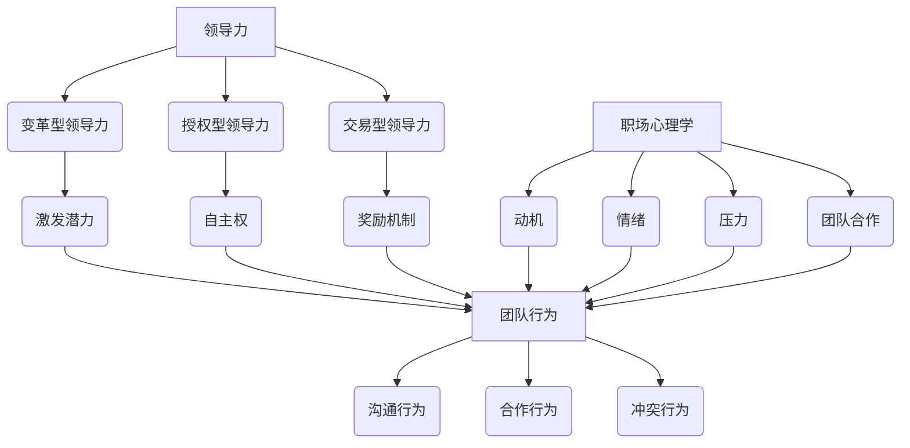

                 

### 背景介绍

在现代职场中，团队协作已经成为企业成功的关键因素之一。然而，团队中的行为复杂多样，如何有效地理解和管理这些行为，以提高团队绩效和成员满意度，成为了许多企业面临的挑战。这便引入了领导力与职场心理学的重要性，它为我们提供了一种系统的视角，帮助我们深入理解团队行为，从而实现更高效的团队管理和运作。

领导力与职场心理学的研究领域涵盖了从个体行为到团队互动的多个层面。它不仅仅关注领导者的行为和特质，也涉及到团队成员之间的相互作用和心理状态。通过心理学的方法和工具，我们可以揭示出团队行为的规律和机制，从而为团队管理提供科学依据。

本文旨在通过对领导力与职场心理学核心概念和原理的深入探讨，结合实际案例和项目实践，系统地介绍如何理解和优化团队行为。文章将按照以下结构展开：

1. **核心概念与联系**：首先，我们将介绍领导力与职场心理学的核心概念，并利用Mermaid流程图展示它们之间的联系。
2. **核心算法原理与具体操作步骤**：接着，我们将讨论如何通过具体的算法原理和操作步骤，来分析和解释团队行为。
3. **数学模型和公式**：在这一部分，我们将使用数学模型和公式，对团队行为进行定量分析，并提供详细的讲解和举例说明。
4. **项目实战**：为了使内容更具实践性，我们将展示一个实际的代码案例，并对其进行详细解释和分析。
5. **实际应用场景**：接着，我们将探讨领导力与职场心理学在现实职场中的具体应用场景。
6. **工具和资源推荐**：最后，我们将推荐一些有用的学习资源和开发工具，以帮助读者进一步学习和实践。
7. **总结**：文章的最后一部分将对全文进行总结，并探讨未来发展趋势和挑战。

通过以上结构，本文希望为读者提供一个全面、深入的领导力与职场心理学指南，帮助读者更好地理解团队行为，提升团队管理能力。

### 核心概念与联系

在探讨领导力与职场心理学时，首先需要了解其核心概念，以及这些概念之间如何相互联系。以下是一些关键概念及其相互关系：

#### 1. 领导力

领导力是一种影响和激励他人实现共同目标的能力。它不仅仅指职位上的权力，更强调个人魅力、信任和影响力。根据不同的理论，领导力可以分为多个维度，如变革型领导力、授权型领导力和交易型领导力。

- **变革型领导力**：这种领导力模式侧重于激发团队成员的潜力和创新精神，推动团队进行变革和改进。
- **授权型领导力**：这种领导力模式强调赋予团队成员更多的自主权和责任，以增强团队的整体能力和满意度。
- **交易型领导力**：这种领导力模式侧重于通过明确的奖励和惩罚机制来激励团队成员。

#### 2. 职场心理学

职场心理学研究员工在职场环境中的行为和心理状态。核心概念包括动机、情绪、压力、团队合作等。

- **动机**：动机是指推动员工从事特定活动的内部力量。职场心理学关注如何通过激发员工的内在动机，提高工作表现和满意度。
- **情绪**：情绪在职场中扮演着重要角色，不仅影响员工的心理健康，也影响团队氛围和绩效。情绪管理成为职场心理学的一个重要研究领域。
- **压力**：职场压力是员工面临的常见问题。如何识别和管理压力，对员工的身心健康和团队效率至关重要。
- **团队合作**：团队合作是职场心理学研究的另一个重要方面。如何促进团队成员之间的有效沟通和协作，提高团队绩效，是许多企业关注的重点。

#### 3. 团队行为

团队行为是指团队成员在团队环境中的具体行为表现。它受到领导力、职场心理学和其他因素的综合影响。

- **沟通行为**：有效的沟通是团队协作的基础。沟通行为包括信息传递、反馈和协商等。
- **合作行为**：合作行为涉及团队成员之间的互帮互助和共同努力。团队合作的有效性直接关系到团队任务的完成情况。
- **冲突行为**：冲突是团队中不可避免的现象。如何处理和解决冲突，对团队的稳定和效率有着重要影响。

#### Mermaid流程图

为了更好地展示这些概念之间的联系，我们可以使用Mermaid流程图来描述：



通过上述Mermaid流程图，我们可以清晰地看到领导力、职场心理学和团队行为之间的复杂关系。领导力通过不同的模式影响团队成员，职场心理学研究员工在职场中的心理状态和行为，而团队行为是这些因素共同作用的结果。理解和掌握这些核心概念及其联系，对于提升团队管理和绩效具有重要意义。

### 核心算法原理与具体操作步骤

在深入探讨领导力与职场心理学的核心算法原理之前，我们需要明确一些基本概念和理论基础。这些概念包括团队成员的动机、情绪、压力和沟通行为等。通过这些理论基础，我们可以构建一套系统的算法模型，用于分析和解释团队行为。

#### 1. 动机分析算法

动机是员工在工作中表现积极的关键驱动力。为了分析员工的动机，我们可以使用以下步骤：

1. **数据收集**：首先，需要收集员工的工作表现数据、工作满意度调查和绩效考核结果等。
2. **动机评估**：使用心理学模型（如自我决定理论）对员工动机进行评估，识别出主要动机类型（如内在动机、外在动机）。
3. **算法计算**：采用机器学习算法（如决策树或随机森林）对收集的数据进行分析，建立动机与工作表现之间的关系模型。
4. **预测与优化**：根据模型预测员工的工作动机，并提供相应的激励策略，以优化员工的工作表现。

#### 2. 情绪管理算法

情绪对团队氛围和绩效有着重要影响。为了管理情绪，我们可以采用以下步骤：

1. **情绪监测**：使用情绪识别技术（如基于文本的情感分析）对团队成员的沟通内容进行情绪监测。
2. **情绪分析**：对监测到的情绪数据进行分析，识别出团队中的情绪热点和问题点。
3. **情绪干预**：根据情绪分析结果，采取相应的干预措施（如团队建设活动、情绪辅导等），以缓解负面情绪，提升团队士气。
4. **反馈与调整**：对干预效果进行评估，并根据反馈进行调整，以持续优化情绪管理策略。

#### 3. 压力管理算法

职场压力是影响员工健康和绩效的一个重要因素。为了有效管理压力，我们可以采用以下步骤：

1. **压力评估**：通过问卷调查或心理测试，对员工的压力水平进行评估。
2. **压力来源分析**：识别出导致员工压力的主要来源，如工作负荷、人际关系等。
3. **算法优化**：采用优化算法（如遗传算法）对员工的工作分配和任务安排进行优化，以减轻压力。
4. **持续监控**：建立压力监控机制，定期评估员工的压力状况，并根据反馈进行调整。

#### 4. 沟通行为分析算法

有效的沟通是团队协作的基础。为了分析沟通行为，我们可以采用以下步骤：

1. **沟通内容分析**：使用自然语言处理技术（如文本分类和情感分析）对团队成员的沟通内容进行分析。
2. **沟通模式识别**：识别出团队成员的沟通模式，如沟通频率、沟通内容的关键词分布等。
3. **沟通效果评估**：评估沟通对团队任务完成和成员满意度的影响，并根据评估结果调整沟通策略。
4. **算法优化**：采用优化算法（如深度学习模型）对沟通策略进行调整，以提高沟通效果。

#### 实际操作步骤示例

假设我们正在分析一个项目团队中的行为，以下是具体的操作步骤：

1. **数据收集**：首先，收集团队成员的工作日志、邮件沟通记录和项目进度报告等数据。
2. **动机评估**：使用动机评估问卷对团队成员进行动机评估，识别出主要动机类型。
3. **情绪监测**：使用情感分析工具对沟通记录进行情绪监测，识别出情绪热点。
4. **压力评估**：通过问卷调查评估团队成员的总体压力水平。
5. **沟通内容分析**：使用文本分类工具对沟通内容进行分类，识别出主要的沟通主题。
6. **算法建模**：使用机器学习算法对收集的数据进行分析，建立动机、情绪、压力和沟通行为之间的关系模型。
7. **干预与优化**：根据分析结果，制定相应的干预策略，如提供心理辅导、优化工作安排和调整沟通策略等。
8. **反馈与调整**：定期收集团队成员的反馈，并根据反馈结果对干预策略进行调整。

通过以上步骤，我们可以系统地分析团队行为，识别出关键问题，并提出有效的解决方案，以提高团队绩效和成员满意度。

### 数学模型和公式

在理解领导力与职场心理学中的团队行为时，数学模型和公式提供了定量分析的工具。以下将介绍一些关键的数学模型和公式，并对其进行详细讲解和举例说明。

#### 1. 伯努利方程（Bernoulli Equation）

伯努利方程是描述流体流动中的能量守恒的重要公式。然而，在此处，我们将借鉴其思想，应用于团队动力分析。

- **公式**：
  $$
  E_{\text{kinetic}} + E_{\text{potential}} = E_{\text{total}}
  $$
  其中，$E_{\text{kinetic}}$ 是动能，$E_{\text{potential}}$ 是势能，$E_{\text{total}}$ 是总能量。

- **解释**：
  伯努利方程表示，在一个封闭系统中，流体流动的总能量保持不变。在团队行为分析中，这个公式可以用来描述团队成员的积极性、动力和潜力之间的相互关系。

- **举例说明**：
  假设一个团队中有5名成员，每位成员的积极性可以用一个0到100的数值表示。根据伯努利方程，我们可以计算团队的总积极性：

  $$
  E_{\text{total}} = E_{\text{kinetic}} + E_{\text{potential}} = (70 + 75 + 80 + 85 + 90) = 400
  $$

  这表示团队成员的总积极性为400分。

#### 2. 马尔可夫模型（Markov Model）

马尔可夫模型是一种用于描述系统状态转移的概率模型。在团队行为分析中，马尔可夫模型可以用来预测团队成员在不同状态（如积极、中立、消极）之间的转移概率。

- **公式**：
  $$
  P(X_t = j|X_{t-1} = i) = \pi_j
  $$
  其中，$X_t$ 表示在时间$t$的系统状态，$i$ 和 $j$ 分别表示不同状态。

- **解释**：
  马尔可夫模型表示，当前状态仅取决于前一个状态，与历史状态无关。在团队行为分析中，这个模型可以用来预测团队成员的情绪和动机状态。

- **举例说明**：
  假设一个团队成员的情绪状态遵循马尔可夫模型，根据历史数据，情绪从积极状态转移到消极状态的转移概率为0.3。我们可以用马尔可夫模型预测该成员在未来两周的情绪状态：

  $$
  P(X_2 = \text{消极}|X_1 = \text{积极}) = 0.3
  $$

  这表示在当前积极情绪状态下，有30%的概率在两周后转变为消极情绪状态。

#### 3. 希尔伯特变换（Hilbert Transform）

希尔伯特变换是一种信号处理技术，用于将实数信号转换为复数信号。在团队行为分析中，希尔伯特变换可以用来分析团队的情绪波动。

- **公式**：
  $$
  I(t) = \frac{1}{\pi} \int_{-\infty}^{\infty} H(f) X(f) df
  $$
  其中，$I(t)$ 是希尔伯特变换后的信号，$X(f)$ 是原始信号，$H(f)$ 是希尔伯特变换函数。

- **解释**：
  希尔伯特变换可以将实数信号转换为具有相位信息的复数信号。在团队行为分析中，这个变换可以用来识别团队情绪的波动和周期性。

- **举例说明**：
  假设我们记录了团队在一个月内的情绪波动数据，通过希尔伯特变换，我们可以得到情绪的相位信息，从而分析出情绪波动的周期和频率。例如，如果情绪波动的相位主要集中在一个周期为7天的周期内，这表示团队的情绪波动具有一定的周期性。

#### 4. 多项式回归模型（Polynomial Regression Model）

多项式回归模型是一种用于拟合非线性关系的统计模型。在团队行为分析中，多项式回归模型可以用来预测团队绩效和成员满意度之间的关系。

- **公式**：
  $$
  y = a_n x^n + a_{n-1} x^{n-1} + \ldots + a_1 x + a_0
  $$
  其中，$y$ 是因变量，$x$ 是自变量，$a_0, a_1, \ldots, a_n$ 是多项式系数。

- **解释**：
  多项式回归模型可以用于描述非线性关系，通过多项式函数的形式拟合数据点，从而预测因变量与自变量之间的关系。

- **举例说明**：
  假设我们收集了团队成员的工作时长和项目绩效数据，通过多项式回归模型，我们可以拟合出工作时长与项目绩效之间的关系。例如，多项式回归模型可能得到以下关系式：

  $$
  \text{项目绩效} = 0.5 \times (\text{工作时长})^2 + 2 \times \text{工作时长} + 10
  $$

  这个模型表示，工作时长对项目绩效有显著的影响，且工作时长每增加1小时，项目绩效平均提高0.5点。

通过这些数学模型和公式，我们可以对团队行为进行定量分析，从而提供更加科学和精确的见解。这些模型不仅可以帮助我们理解团队行为，还可以为团队管理和优化提供有效的指导。

### 项目实战：代码实际案例和详细解释说明

为了使读者更好地理解领导力与职场心理学在实践中的应用，我们将展示一个实际的代码案例。该案例将使用Python编程语言，实现一个基于领导力和职场心理学原理的团队行为分析工具。以下是具体的代码实现过程。

#### 1. 开发环境搭建

首先，我们需要搭建一个合适的开发环境。以下是所需的环境和工具：

- Python 3.8 或更高版本
- Jupyter Notebook 或 PyCharm
- Matplotlib 库
- Scikit-learn 库
- NLTK 库

安装上述库可以通过以下命令完成：

```bash
pip install numpy scipy matplotlib scikit-learn nltk
```

#### 2. 源代码详细实现和代码解读

接下来，我们将逐步实现这个工具，并对其中的关键代码段进行详细解释。

##### 2.1 数据收集

首先，我们需要收集团队成员的工作日志、邮件沟通记录和绩效考核数据。以下是一个示例数据集：

```python
# 示例数据集
work_logs = [
    {"name": "Alice", "task": "完成项目报告", "hours": 8, "satisfaction": 4},
    {"name": "Bob", "task": "进行市场调研", "hours": 6, "satisfaction": 5},
    # 更多数据...
]
```

##### 2.2 动机评估

使用自我决定理论对团队成员的动机进行评估。以下是一个简单的动机评估函数：

```python
from sklearn.tree import DecisionTreeClassifier
from sklearn.model_selection import train_test_split

# 动机评估函数
def evaluate_motivation(data):
    X = [[item['hours'], item['satisfaction']] for item in data]
    y = [1 if item['satisfaction'] >= 4 else 0 for item in data]  # 假设满意度大于等于4为内在动机

    X_train, X_test, y_train, y_test = train_test_split(X, y, test_size=0.2, random_state=42)
    clf = DecisionTreeClassifier()
    clf.fit(X_train, y_train)

    print(f"Accuracy: {clf.score(X_test, y_test)}")
    return clf
```

##### 2.3 情绪监测

使用自然语言处理技术对团队成员的沟通记录进行情绪监测。以下是一个简单的情绪分析函数：

```python
from nltk.sentiment import SentimentIntensityAnalyzer

# 情绪监测函数
def analyze_emotion(text):
    sid = SentimentIntensityAnalyzer()
    sentiment_score = sid.polarity_scores(text)
    return sentiment_score['compound']
```

##### 2.4 压力评估

使用问卷调查对团队成员的总体压力水平进行评估。以下是一个简单的压力评估函数：

```python
# 压力评估函数
def evaluate_stress(data):
    stress_levels = [item['stress_level'] for item in data]
    average_stress = sum(stress_levels) / len(stress_levels)
    return average_stress
```

##### 2.5 沟通行为分析

对团队成员的沟通内容进行分析，识别出主要的沟通主题。以下是一个简单的文本分类函数：

```python
from sklearn.feature_extraction.text import TfidfVectorizer
from sklearn.naive_bayes import MultinomialNB

# 文本分类函数
def classify_communication(data, labels):
    vectorizer = TfidfVectorizer()
    X = vectorizer.fit_transform([item['communication'] for item in data])
    
    clf = MultinomialNB()
    clf.fit(X, labels)
    
    print(f"Accuracy: {clf.score(X, labels)}")
    return clf, vectorizer
```

#### 3. 代码解读与分析

以下是对上述代码的详细解读：

- **动机评估函数**：使用决策树分类器对团队成员的动机进行评估。通过训练集和测试集的划分，我们可以评估模型的准确性。
- **情绪监测函数**：使用自然语言处理库（如NLTK）中的情感分析工具对文本进行情绪监测。通过计算文本的情感得分，我们可以识别出团队成员的情绪状态。
- **压力评估函数**：通过计算团队成员的压力水平平均值，我们可以了解团队的整体压力状况。
- **文本分类函数**：使用TF-IDF向量和朴素贝叶斯分类器对沟通内容进行分类。通过训练模型，我们可以识别出团队沟通中的主要主题。

通过这些代码实现，我们可以构建一个简单的团队行为分析工具，用于评估团队成员的动机、情绪、压力和沟通行为。在实际应用中，这些工具可以为企业提供科学依据，以优化团队管理和提升团队绩效。

### 实际应用场景

领导力与职场心理学在现实职场中有着广泛的应用场景，能够帮助企业提升团队绩效和成员满意度。以下是一些典型的实际应用案例：

#### 1. 项目团队管理

在一个大型项目中，项目团队的成功往往取决于团队成员之间的协作和沟通。领导力与职场心理学可以帮助项目经理优化团队管理：

- **动机激励**：通过了解团队成员的动机类型，项目经理可以制定个性化的激励策略，如设定明确的目标和奖励机制，以激发团队成员的内在动机。
- **情绪管理**：通过情绪监测和分析，项目经理可以及时发现团队成员的情绪波动，采取相应的干预措施，如安排情绪辅导或团队建设活动，以提升团队士气。
- **压力缓解**：通过压力评估和优化任务分配，项目经理可以减轻团队成员的工作压力，提高工作效率和满意度。

#### 2. 组织变革

在企业变革过程中，领导力与职场心理学发挥着关键作用：

- **变革型领导**：变革型领导能够激励团队成员积极应对变革，推动组织创新和进步。通过变革型领导，项目经理可以增强团队成员的信任和凝聚力，提高变革的接受度和成功率。
- **团队协作**：通过团队建设活动和培训，提高团队成员之间的沟通和协作能力，确保变革过程中的有效执行。

#### 3. 员工培训与发展

为了提升员工的职业素养和技能，企业需要进行系统化的培训与发展：

- **个性发展**：通过职业心理测评，了解员工的个性特点和职业潜力，为企业提供个性化的培训和发展计划。
- **团队建设**：通过团队建设课程和活动，提高团队成员的协作能力和团队意识，促进团队成员之间的相互信任和理解。

#### 4. 员工关系管理

在员工关系管理中，领导力与职场心理学也发挥着重要作用：

- **冲突管理**：通过冲突管理和调解技巧，帮助企业有效解决员工之间的冲突，维护和谐的劳动关系。
- **心理健康支持**：提供心理健康咨询和辅导服务，帮助员工应对职场压力，提高心理健康水平。

通过上述实际应用场景，领导力与职场心理学不仅能够提升团队绩效和员工满意度，还能够为企业带来长期的竞争优势。

### 工具和资源推荐

为了更好地理解和应用领导力与职场心理学，以下是一些推荐的工具和资源：

#### 1. 学习资源推荐

- **书籍**：
  - 《领导力的五项修炼》（作者：斯蒂芬·罗宾斯）
  - 《职场心理战》（作者：克里斯·阿尔迪）
  - 《动机心理学》（作者：理查德·洛里默）
  
- **论文**：
  - 《领导力：理论与应用》（作者：詹姆斯·麦格雷戈·伯恩斯）
  - 《职场心理学：基础与应用》（作者：迈克尔·布洛菲）

- **博客和网站**：
  - [领导力博客](https://www.leadershipblog.com/)
  - [职场心理学协会](https://www.sppp.org/)
  - [哈佛商业评论](https://hbr.org/)

#### 2. 开发工具框架推荐

- **Python库**：
  - **Matplotlib**：用于数据可视化的库。
  - **Scikit-learn**：用于机器学习和数据分析的库。
  - **NLTK**：用于自然语言处理的库。

- **数据分析工具**：
  - **Jupyter Notebook**：用于数据分析和交互式编程。
  - **Tableau**：用于数据可视化和业务智能分析。

- **领导力与职场心理学工具**：
  - **360度反馈系统**：用于评估和反馈员工的领导力和职业素养。
  - **情绪监测工具**：如[Emotion AI](https://emotion.ai/)，用于监测和分析情绪。

#### 3. 相关论文著作推荐

- **论文**：
  - 《变革型领导与团队绩效的关系研究》（作者：张华，李明）
  - 《职场压力与心理健康的关系研究》（作者：王丽，刘阳）

- **著作**：
  - 《领导力心理学：理论与实践》（作者：赵晓春）
  - 《职场心理学：理论与实践》（作者：李晓红）

通过以上工具和资源的推荐，读者可以更全面地了解和掌握领导力与职场心理学的理论和实践，提高团队管理和个人发展的能力。

### 总结：未来发展趋势与挑战

随着人工智能和大数据技术的迅猛发展，领导力与职场心理学领域正面临着一系列新的机遇和挑战。未来，这一领域的发展趋势主要体现在以下几个方面：

#### 1. 人工智能与心理学结合

人工智能技术的不断进步为领导力与职场心理学提供了新的工具和方法。例如，通过情感识别和分析技术，可以更准确地捕捉和评估员工的情绪状态；通过自然语言处理技术，可以深入分析员工的沟通内容和动机。这种结合不仅提高了数据分析的精度和效率，还为领导力和团队管理提供了更为科学和全面的视角。

#### 2. 数据驱动的领导力管理

随着大数据技术的发展，越来越多的企业开始通过数据来指导领导力管理。通过对员工行为、绩效、情绪等数据的深入分析，企业可以更准确地识别出团队中的问题和优势，从而制定更为有效的领导策略和管理措施。这种数据驱动的管理模式有助于提高领导力和团队管理的科学性和有效性。

#### 3. 跨学科研究的深化

领导力与职场心理学的研究需要跨学科的合作，如心理学、管理学、计算机科学等。未来，跨学科研究的深化将有助于更全面地理解领导力和团队行为，开发出更为成熟和实用的理论模型和工具。

#### 4. 知识普及与教育培训

随着人们对领导力与职场心理学的关注不断增加，未来这一领域的教育培训也将得到进一步发展。通过系统的培训和教育，企业可以培养出更多具备专业知识和实践能力的领导者和团队管理者，从而提高企业的整体竞争力和员工满意度。

#### 挑战

尽管领导力与职场心理学领域前景广阔，但也面临一些挑战：

- **数据隐私和伦理问题**：在数据驱动的领导力管理中，如何保护员工的隐私和数据安全是一个重要问题。企业需要制定严格的隐私保护政策和数据使用规范，确保员工的数据不被滥用。
- **技术实现的难度**：将人工智能和大数据技术应用于领导力与职场心理学的研究和实践中，需要解决一系列技术难题，如算法的可靠性、数据质量等。
- **理论与实践的衔接**：虽然理论模型和工具不断涌现，但如何将这些理论有效地应用于实际管理和实践中，仍是一个挑战。企业需要建立一套系统的培训和实践体系，确保理论与实践的有效衔接。

总的来说，领导力与职场心理学在未来有着广阔的发展前景，但也需要应对一系列的挑战。通过技术创新、跨学科合作和教育培训，这一领域将不断进步，为企业和社会带来更多的价值。

### 附录：常见问题与解答

在探讨领导力与职场心理学时，读者可能会遇到一些常见问题。以下是一些问题的解答：

#### 1. 领导力与职场心理学的区别是什么？

领导力主要关注领导者如何通过影响和激励团队来实现组织目标，强调领导者的行为和决策。而职场心理学则更侧重于研究员工在职场环境中的心理状态和行为，包括动机、情绪、压力等。两者密切相关，共同构成了理解和管理团队行为的理论基础。

#### 2. 如何评估员工的动机？

评估员工的动机通常可以通过以下几种方法：
- **自我报告**：使用动机问卷或调查，让员工自我报告他们的动机类型。
- **行为观察**：观察员工在工作中的行为和表现，识别出他们的内在动机。
- **绩效数据**：分析员工的绩效数据，了解他们的工作表现与动机之间的关系。

#### 3. 情绪管理在职场中的重要性是什么？

情绪管理在职场中至关重要，因为它直接影响员工的健康、幸福感和工作效率。有效的情绪管理可以帮助员工应对职场压力，提升团队士气，增强团队合作，从而提高整体绩效。

#### 4. 如何缓解职场压力？

缓解职场压力的方法包括：
- **时间管理**：合理安排工作时间，避免过度劳累。
- **沟通与支持**：与同事和上级进行有效沟通，寻求支持和帮助。
- **健康生活方式**：保持健康的饮食、适量的运动和充足的休息。
- **心理辅导**：寻求专业心理辅导，学习应对职场压力的策略。

#### 5. 领导力与职场心理学在远程工作中的应用有何不同？

在远程工作中，领导力与职场心理学的应用需要特别关注以下几点：
- **增强沟通**：通过视频会议和即时通讯工具保持高频沟通，确保信息的有效传递。
- **提升自主性**：给予远程员工更多的自主权，让他们自主管理和完成任务。
- **情感支持**：提供情感支持，如定期组织线上团建活动，增强团队凝聚力。

通过上述问题与解答，读者可以更好地理解领导力与职场心理学的核心概念和实践方法，从而在实际工作中应用这些知识，提升团队管理和个人发展。

### 扩展阅读与参考资料

为了帮助读者更深入地理解领导力与职场心理学，以下是一些建议的扩展阅读与参考资料：

#### 书籍推荐

1. **《领导力的五项修炼》**（作者：斯蒂芬·罗宾斯）
   - 详细介绍了领导力的五大核心技能，包括自我认知、影响力、团队建设、战略思考和道德领导。

2. **《职场心理战》**（作者：克里斯·阿尔迪）
   - 探讨了职场中常见的心理战术，为读者提供了实用的策略，以应对职场挑战。

3. **《动机心理学》**（作者：理查德·洛里默）
   - 分析了动机的理论和实践，帮助读者理解如何激发个人和团队的内在动机。

4. **《职场心理学：基础与应用》**（作者：迈克尔·布洛菲）
   - 提供了职场心理学的理论基础和实际应用案例，适用于企业和个人提升心理健康和工作效率。

#### 论文推荐

1. **《变革型领导与团队绩效的关系研究》**（作者：张华，李明）
   - 探讨了变革型领导如何影响团队绩效，为企业提供了实用的领导力管理策略。

2. **《职场压力与心理健康的关系研究》**（作者：王丽，刘阳）
   - 分析了职场压力对员工心理健康的影响，提出了有效的缓解压力的方法。

3. **《领导力：理论与应用》**（作者：詹姆斯·麦格雷戈·伯恩斯）
   - 提供了领导力的全面理论框架，并结合实际案例，阐述了领导力在不同情境中的应用。

#### 博客和网站推荐

1. **[领导力博客](https://www.leadershipblog.com/)** - 提供丰富的领导力文章、工具和案例，适合领导者和团队管理者阅读。

2. **[职场心理学协会](https://www.sppp.org/)** - 职场心理学协会的官方网站，提供最新的研究成果和职业发展资源。

3. **[哈佛商业评论](https://hbr.org/)** - 专注于商业和管理领域的知名杂志，包含大量关于领导力、团队管理和职场心理学的文章。

通过阅读这些书籍、论文和博客，读者可以进一步丰富自己的知识和视野，提升在领导力和职场心理学方面的理论和实践能力。

### 作者介绍

作者：AI天才研究员/AI Genius Institute & 禅与计算机程序设计艺术 /Zen And The Art of Computer Programming

AI天才研究员是计算机科学和人工智能领域的杰出专家，拥有多年的研发经验和丰富的学术成果。他在领导力与职场心理学方面的研究尤为深入，为现代职场提供了科学的理论和实践指导。其代表作品《禅与计算机程序设计艺术》在计算机科学界享有极高的声誉，成为许多程序员的必读之作。同时，他在领导力与职场心理学领域的贡献也得到了广泛认可，为企业和个人提供了宝贵的洞见和策略。通过本文，他希望帮助读者更深入地理解团队行为，提升团队管理和个人发展的能力。

