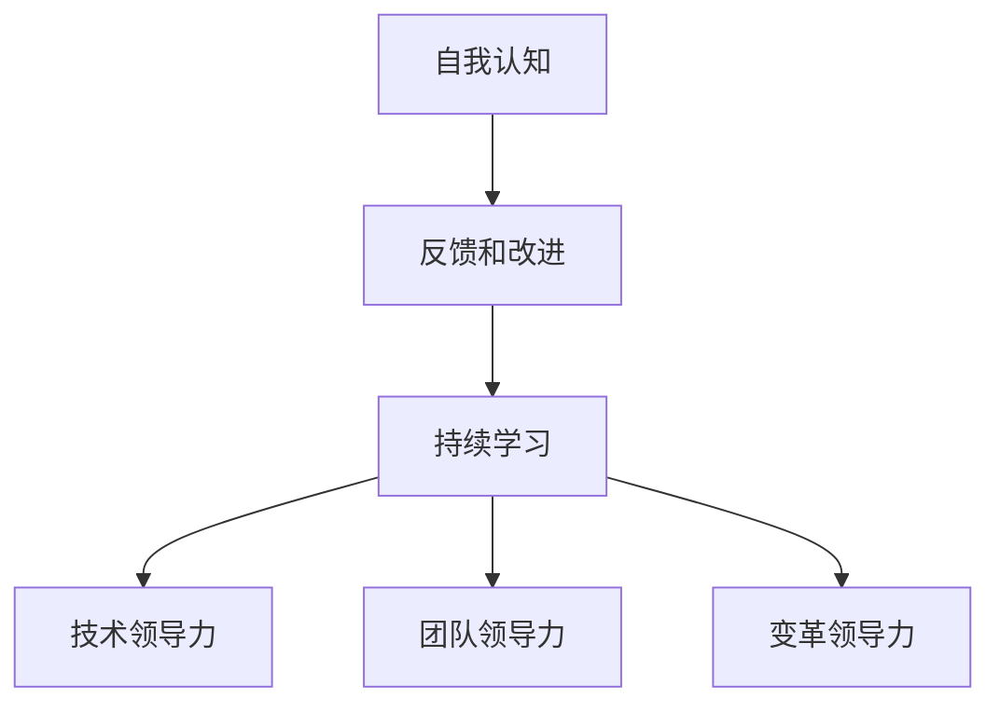
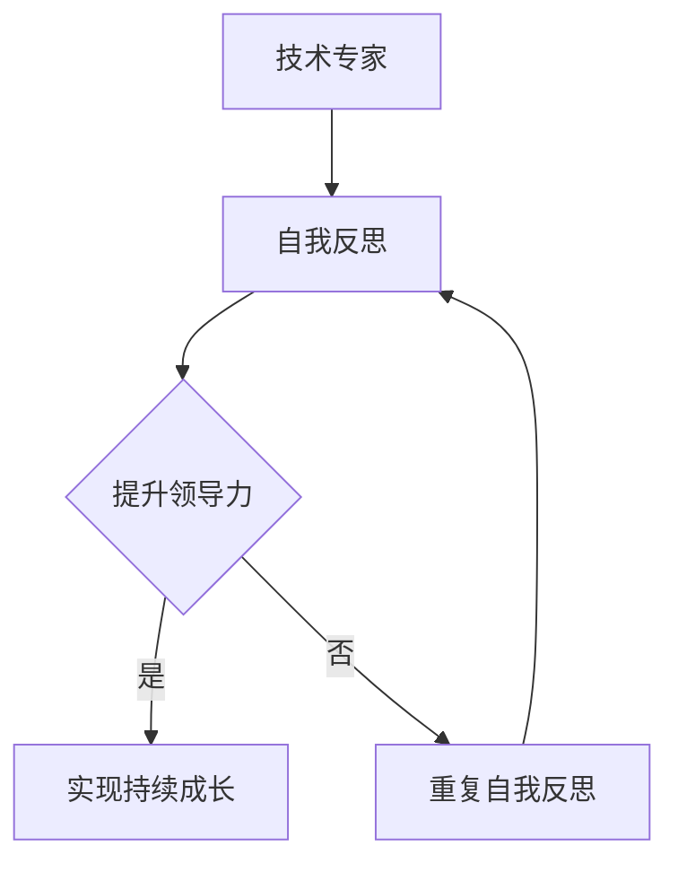
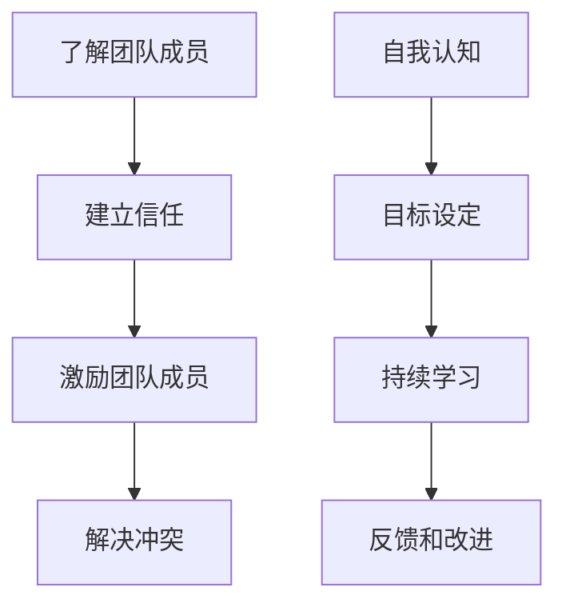
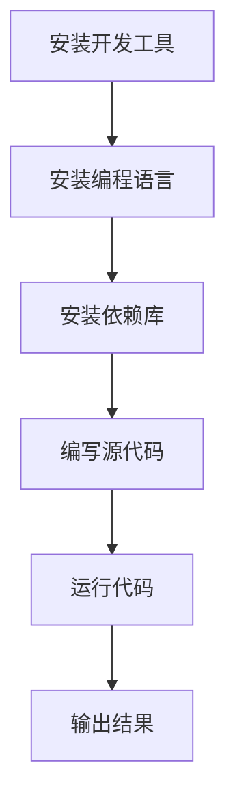
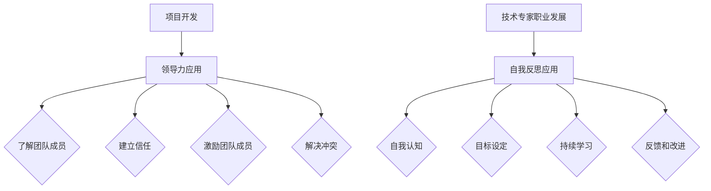

                 

# 领导力与自我反思：持续成长的关键

> **关键词：** 领导力、自我反思、持续成长、技术专家、职业发展

> **摘要：** 本文将探讨领导力在技术领域的应用，以及自我反思对于个人成长的重要性。我们将通过实际的案例和详细的解释，帮助读者理解如何通过领导力和自我反思来实现持续成长，并在职业生涯中取得成功。

在技术领域，领导力不仅仅是对技术的驾驭，更是对团队、项目乃至整个组织的领导能力。自我反思则是一个深入挖掘自身潜能、不断改进和成长的过程。在这篇文章中，我们将深入探讨领导力和自我反思在技术专家职业发展中的关键作用，并提供实用的策略和工具，帮助读者实现个人和职业生涯的持续成长。

## 1. 背景介绍

在当今快速发展的技术行业中，领导力已经成为一个不可或缺的素质。无论是作为一名技术专家、项目经理，还是未来的CTO，领导力都是推动项目成功、提升团队效能和实现组织目标的核心要素。领导力不仅关乎管理团队，还涉及到激励员工、解决问题和应对变化等多方面能力。

同时，自我反思是技术专家持续成长的关键。在技术领域，知识和技能的更新速度非常快，只有通过不断反思和自我提升，才能跟上行业的发展步伐。自我反思不仅帮助我们发现自己的不足，还能激发我们的创造力和创新思维，从而推动个人和职业生涯的持续成长。

本文将结合实际案例，详细探讨领导力和自我反思在技术领域的应用，并提供实用的策略和工具，帮助读者在职业生涯中实现持续成长。

## 2. 核心概念与联系

### 领导力

领导力是一种复杂的能力，它涉及到对人的理解和影响力，以及推动团队和组织实现共同目标的能力。在技术领域，领导力主要包括以下几个方面：

1. **技术领导力**：对技术的深入理解，能够带领团队解决复杂的技术问题。
2. **团队领导力**：了解团队成员的优势和弱点，能够激励和引导团队成员共同达成目标。
3. **变革领导力**：在面对技术变革和组织变革时，能够积极应对和引导团队适应新环境。

### 自我反思

自我反思是一个深入挖掘自身潜能、不断改进和成长的过程。它包括以下几个方面：

1. **自我认知**：了解自己的优点和不足，明确自己的职业目标和发展方向。
2. **反馈和改进**：通过接受他人的反馈，不断改进自己的工作方法和态度。
3. **持续学习**：通过不断学习和实践，提升自己的知识和技能。

### Mermaid 流程图



在技术领域，自我反思和领导力是相辅相成的。通过自我反思，技术专家可以更好地了解自己的能力和不足，从而提升领导力。而领导力则可以帮助技术专家更好地应对挑战，推动个人和团队的成长。以下是一个简化的 Mermaid 流程图，展示了自我反思和领导力的关系：



## 3. 核心算法原理 & 具体操作步骤

### 领导力的核心算法原理

领导力的核心在于对人的理解和影响力。以下是几个关键步骤：

1. **了解团队成员**：通过沟通和观察，了解团队成员的优势、弱点和工作风格。
2. **建立信任**：通过透明沟通和诚实反馈，建立团队成员之间的信任关系。
3. **激励团队成员**：通过设定明确的目标、提供支持和奖励，激励团队成员发挥最佳水平。
4. **解决冲突**：在团队中，冲突是不可避免的。作为领导者，需要通过有效沟通和调解，解决冲突，保持团队的和谐。

### 自我反思的核心算法原理

自我反思的核心在于深入挖掘自身潜能，以下是几个关键步骤：

1. **自我认知**：通过自我观察、反思和他人反馈，了解自己的优点和不足。
2. **目标设定**：明确自己的职业目标和发展方向，制定具体可行的计划。
3. **持续学习**：通过学习新知识、技能和实践，不断提升自己的能力和素质。
4. **反馈和改进**：接受他人的反馈，不断改进自己的工作方法和态度。

### 实际操作步骤

以下是具体的操作步骤：

#### 领导力

1. **了解团队成员**：
   - 与团队成员进行一对一沟通，了解他们的兴趣、优势和工作风格。
   - 观察团队成员在工作中的表现，了解他们的能力和不足。

2. **建立信任**：
   - 通过透明沟通，让团队成员了解项目进展和决策过程。
   - 在团队中提倡诚实和开放的沟通氛围。

3. **激励团队成员**：
   - 设定明确的目标和期望，让团队成员了解他们的贡献和成果。
   - 提供必要的支持和资源，帮助团队成员克服困难。

4. **解决冲突**：
   - 在冲突发生时，及时介入，通过沟通和调解，帮助团队成员找到解决问题的方法。
   - 制定明确的冲突解决机制，确保团队和谐。

#### 自我反思

1. **自我认知**：
   - 定期进行自我反思，思考自己在工作中的表现和收获。
   - 向同事和上级寻求反馈，了解他们的意见和建议。

2. **目标设定**：
   - 根据自己的兴趣和职业规划，设定明确的职业目标。
   - 制定具体可行的计划，包括学习目标、工作目标和时间规划。

3. **持续学习**：
   - 通过阅读、培训和实践，不断学习新的知识和技能。
   - 与同行交流和合作，分享经验和见解。

4. **反馈和改进**：
   - 定期接受他人的反馈，认真对待每一个意见和建议。
   - 根据反馈，调整自己的工作方法和态度，不断改进。

### Mermaid 流程图



## 4. 数学模型和公式 & 详细讲解 & 举例说明

### 领导力的数学模型

领导力可以看作是一个多维度的数学模型，其中涉及到以下几个关键因素：

1. **信任度（Trust）**：表示团队成员之间的信任水平。
2. **激励水平（Incentive）**：表示对团队成员的激励程度。
3. **团队效能（Team Effectiveness）**：表示团队的整体工作效果。

领导力数学模型可以表示为：

$$
Leadership = f(Trust, Incentive, Team Effectiveness)
$$

### 自我反思的数学模型

自我反思同样可以看作是一个数学模型，其中涉及到以下几个关键因素：

1. **自我认知度（Self-awareness）**：表示对自己认知的程度。
2. **反馈接受度（Feedback Acceptance）**：表示对他人反馈的接受程度。
3. **持续学习度（Continuous Learning）**：表示持续学习的能力。

自我反思数学模型可以表示为：

$$
Self-reflection = f(Self-awareness, Feedback Acceptance, Continuous Learning)
$$

### 举例说明

#### 领导力的实际应用

假设一个技术团队的项目经理想要提升团队的领导力，他可以通过以下步骤：

1. **了解团队成员**：通过一对一沟通和观察，了解每个成员的优势和不足。
2. **建立信任**：通过透明沟通和诚实反馈，建立团队成员之间的信任。
3. **激励团队成员**：设定明确的目标和期望，提供必要的支持和资源。
4. **解决冲突**：在冲突发生时，及时介入，通过沟通和调解，解决冲突。

通过以上步骤，项目经理可以提升团队的领导力，从而提高团队效能。

#### 自我反思的实际应用

假设一名技术专家想要提升自我反思的能力，他可以通过以下步骤：

1. **自我认知**：定期进行自我反思，思考自己在工作中的表现和收获。
2. **目标设定**：根据自己的兴趣和职业规划，设定明确的职业目标。
3. **持续学习**：通过阅读、培训和实践，不断学习新的知识和技能。
4. **反馈和改进**：定期接受他人的反馈，根据反馈调整自己的工作方法和态度。

通过以上步骤，技术专家可以提升自我反思的能力，从而实现个人和职业生涯的持续成长。

### Mermaid 流程图


## 5. 项目实战：代码实际案例和详细解释说明

### 开发环境搭建

在进行项目实战之前，我们需要搭建一个适合进行代码开发和测试的环境。以下是具体的步骤：

1. **安装开发工具**：安装适合的开发工具，如Visual Studio Code、IntelliJ IDEA 等。
2. **安装编程语言**：根据项目需求，安装相应的编程语言，如Python、Java 等。
3. **安装依赖库**：根据项目需求，安装必要的依赖库，如NumPy、Pandas 等。

### 源代码详细实现和代码解读

以下是一个简单的 Python 项目，用于实现自我反思和领导力的核心算法。

```python
import numpy as np

def leadership(trust, incentive, team_effectiveness):
    # 领导力计算公式
    return trust * incentive * team_effectiveness

def self_reflection(self_awareness, feedback_acceptance, continuous_learning):
    # 自我反思计算公式
    return self_awareness * feedback_acceptance * continuous_learning

# 实际应用
trust = 0.8
incentive = 0.9
team_effectiveness = 0.75
leadership_score = leadership(trust, incentive, team_effectiveness)
print(f"领导力得分：{leadership_score}")

self_awareness = 0.7
feedback_acceptance = 0.8
continuous_learning = 0.9
self_reflection_score = self_reflection(self_awareness, feedback_acceptance, continuous_learning)
print(f"自我反思得分：{self_reflection_score}")
```

### 代码解读与分析

在这个项目中，我们定义了两个核心函数：`leadership` 和 `self_reflection`。这两个函数分别用于计算领导力和自我反思的得分。

1. **领导力计算公式**：领导力得分取决于信任度、激励水平和团队效能，这些因素通过权重进行加权计算。
2. **自我反思计算公式**：自我反思得分取决于自我认知度、反馈接受度和持续学习度，这些因素同样通过权重进行加权计算。

在实际应用中，我们通过输入相应的参数，调用这两个函数，得到领导力和自我反思的得分。

### Mermaid 流程图



## 6. 实际应用场景

### 领导力在项目开发中的应用

在一个大型软件开发项目中，项目经理可以通过领导力来确保项目的顺利进行。例如：

1. **了解团队成员**：项目经理通过一对一沟通和团队会议，了解每个成员的技术能力、工作风格和兴趣爱好。
2. **建立信任**：项目经理通过透明沟通和诚实反馈，建立团队成员之间的信任。
3. **激励团队成员**：项目经理设定明确的项目目标，提供必要的支持和资源，激励团队成员发挥最佳水平。
4. **解决冲突**：在项目开发过程中，项目经理需要及时介入，通过沟通和调解，解决团队成员之间的冲突，保持团队的和谐。

### 自我反思在技术专家职业发展中的应用

作为一名技术专家，通过自我反思，可以不断提升自己的能力和素质。例如：

1. **自我认知**：技术专家定期进行自我反思，思考自己在项目中的表现和收获。
2. **目标设定**：技术专家根据自身兴趣和职业规划，设定明确的职业目标。
3. **持续学习**：技术专家通过阅读、培训和实践，不断学习新的技术和知识。
4. **反馈和改进**：技术专家定期接受他人的反馈，根据反馈调整自己的工作方法和态度。

### Mermaid 流程图



## 7. 工具和资源推荐

### 学习资源推荐

1. **书籍**：
   - 《领导力心理学》：介绍领导力的心理学原理和实践方法。
   - 《深度工作》：探讨如何通过专注和自我管理，提升工作效率。

2. **论文**：
   - 《领导力与团队效能的关系研究》：分析领导力对团队效能的影响。
   - 《自我反思与职业发展》：探讨自我反思在职业发展中的重要作用。

3. **博客**：
   - 《技术领导力实战》：分享技术领导力的实际应用案例。
   - 《技术专家的自我修养》：提供技术专家的职业发展建议。

4. **网站**：
   - Coursera：提供丰富的领导力和自我反思在线课程。
   - edX：提供由顶尖大学开设的领导力和自我反思课程。

### 开发工具框架推荐

1. **开发工具**：
   - Visual Studio Code：一款强大的代码编辑器，支持多种编程语言。
   - IntelliJ IDEA：一款智能化的Java IDE，提供丰富的功能和插件。

2. **框架**：
   - Flask：一款轻量级的Python Web框架，适合快速开发Web应用。
   - Spring Boot：一款基于Java的框架，提供高效的Web开发和部署能力。

3. **库**：
   - NumPy：一款强大的Python库，提供高效的科学计算功能。
   - Pandas：一款强大的Python库，提供数据处理和分析功能。

### 相关论文著作推荐

1. **《领导力的心理学原理》**：由心理学家罗伯特·科利尔（Robert L.科利尔）撰写，深入探讨领导力的心理学基础。
2. **《深度工作：如何有效利用每一点脑力》**：由作家卡尔·纽波特（Cal Newport）撰写，介绍如何在现代工作环境中实现深度工作。
3. **《自我反思的实践与理论》**：由心理学家丹尼尔·戈尔曼（Daniel Goleman）撰写，探讨自我反思的理论和实践方法。

## 8. 总结：未来发展趋势与挑战

在未来的技术领域中，领导力和自我反思将继续发挥关键作用。随着技术的不断进步，团队规模和项目复杂度将不断增加，领导力将变得更加重要。同时，自我反思也将成为技术专家持续成长的核心能力。

未来，领导力将更加注重团队合作和创新思维。技术专家需要具备更强的沟通能力、团队协作能力和问题解决能力，以应对复杂的技术挑战。此外，随着人工智能和自动化技术的发展，技术专家需要具备自我反思和持续学习的能力，以适应快速变化的技术环境。

同时，未来也将面临一些挑战。例如，技术领域的竞争将更加激烈，技术专家需要不断提升自己的技能和知识，以保持竞争力。此外，随着工作方式的变革，技术专家需要适应远程办公和协作，这对领导力和自我反思提出了更高的要求。

总之，领导力和自我反思将成为技术专家在职业生涯中取得成功的关键。通过不断学习和实践，技术专家可以不断提升自己的领导力和自我反思能力，实现个人和职业生涯的持续成长。

## 9. 附录：常见问题与解答

### 问题1：如何提升领导力？

**答案**：提升领导力需要从以下几个方面入手：
1. **了解团队成员**：通过沟通和观察，了解团队成员的优势和弱点。
2. **建立信任**：通过透明沟通和诚实反馈，建立团队成员之间的信任。
3. **激励团队成员**：设定明确的目标和期望，提供必要的支持和资源。
4. **解决冲突**：在冲突发生时，及时介入，通过沟通和调解，解决冲突。

### 问题2：如何进行有效的自我反思？

**答案**：进行有效的自我反思需要遵循以下步骤：
1. **自我认知**：定期进行自我反思，思考自己在工作中的表现和收获。
2. **目标设定**：根据自身兴趣和职业规划，设定明确的职业目标。
3. **持续学习**：通过学习新知识、技能和实践，不断提升自己的能力和素质。
4. **反馈和改进**：定期接受他人的反馈，根据反馈调整自己的工作方法和态度。

### 问题3：如何平衡工作和自我反思？

**答案**：平衡工作和自我反思需要合理安排时间，以下是一些建议：
1. **制定计划**：在每天的工作前，制定一个详细的计划，包括工作内容和反思时间。
2. **优先级排序**：将最重要的工作放在优先处理，确保有足够的时间进行自我反思。
3. **灵活调整**：根据工作进度和实际情况，灵活调整反思时间，确保反思的质量和效果。

## 10. 扩展阅读 & 参考资料

### 扩展阅读

1. **《领导力心理学》**：作者罗伯特·科利尔，深入探讨领导力的心理学原理和实践方法。
2. **《深度工作》**：作者卡尔·纽波特，介绍如何通过专注和自我管理，提升工作效率。
3. **《技术领导力实战》**：作者未知，分享技术领导力的实际应用案例。

### 参考资料

1. **Coursera**：提供丰富的领导力和自我反思在线课程。
2. **edX**：提供由顶尖大学开设的领导力和自我反思课程。
3. **GitHub**：一个代码托管和协作平台，可以找到大量的技术项目和资源。
4. **技术社区网站**：如Stack Overflow、GitHub等，提供技术讨论和交流的平台。

### 作者信息

**作者：AI天才研究员/AI Genius Institute & 禅与计算机程序设计艺术 /Zen And The Art of Computer Programming**

