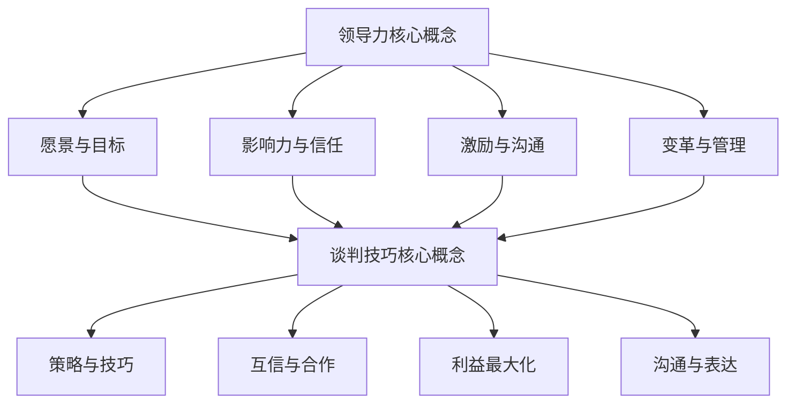

                 

# 领导力与谈判技巧：达成双赢的艺术

> **关键词**：领导力、谈判技巧、双赢、沟通、策略
> 
> **摘要**：本文将深入探讨领导力与谈判技巧在达成双赢艺术中的应用。通过分析领导力的重要性、谈判策略的多样性以及双赢原则的实现方法，为读者提供一套实用、高效的领导与谈判技巧，帮助在工作和生活中实现和谐、高效的沟通与协作。

## 1. 背景介绍

在现代社会，领导力和谈判技巧已成为职场成功的重要因素。随着全球化进程的加速，团队协作、跨文化沟通和多元化管理成为企业面临的挑战。有效的领导力不仅能提升团队的执行力，还能激发员工的潜能，增强组织的竞争力。而谈判技巧则是应对复杂商业环境、处理利益冲突和建立合作伙伴关系的重要工具。

本文旨在通过介绍领导力和谈判技巧的核心概念、策略和实现方法，帮助读者理解如何运用这些技能在现实场景中达成双赢，实现个人和团队的共同成长。

### 1.1 领导力的定义与重要性

领导力是指引导和影响他人共同实现目标的能力。一个优秀的领导者不仅要有远见卓识，能清晰规划愿景和目标，还要具备激发团队潜力、协调资源、处理冲突和应对变革的能力。在现代企业中，领导力的重要性体现在以下几个方面：

- **提高团队效能**：有效的领导能激发员工的工作热情，提高工作效率，实现团队目标。
- **促进创新与成长**：领导者鼓励创新思维，支持员工个人成长，推动组织发展。
- **增强企业竞争力**：具备领导力的团队更能适应市场变化，应对竞争挑战。

### 1.2 谈判技巧的定义与作用

谈判技巧是指在协商过程中，运用策略和技巧以实现各方利益最大化的能力。谈判不仅仅是为了达成协议，更是为了建立互信、合作的关系。其作用主要体现在：

- **解决冲突**：通过谈判，各方可以理性地表达诉求和意见，找到解决冲突的方法。
- **达成共识**：谈判有助于各方在共同利益的基础上，达成共识，实现合作共赢。
- **优化资源分配**：谈判能够合理分配资源，提高资源利用效率，创造更多价值。

## 2. 核心概念与联系

为了深入理解领导力与谈判技巧，我们需要从多个角度剖析其核心概念和相互联系。

### 2.1 领导力的核心概念

领导力的核心概念包括但不限于以下几个方面：

- **愿景与目标**：领导者需要明确愿景和目标，为团队指明方向，激发成员的积极性。
- **影响力与信任**：领导者通过个人魅力和领导风格，赢得团队成员的信任和尊重。
- **激励与沟通**：领导者要善于激励团队成员，通过有效沟通，协调团队内部关系。
- **变革与管理**：领导者要具备应对变革的能力，有效地管理团队，实现组织目标。

### 2.2 谈判技巧的核心概念

谈判技巧的核心概念包括：

- **策略与技巧**：谈判者要运用策略和技巧，如信息收集、利益分析、妥协与让步等，以实现谈判目标。
- **互信与合作**：谈判成功的关键在于建立互信，通过合作实现共赢。
- **利益最大化**：谈判者要平衡各方利益，实现利益最大化。
- **沟通与表达**：谈判者需要具备良好的沟通能力和表达能力，准确传达信息，减少误解。

### 2.3 领导力与谈判技巧的联系

领导力和谈判技巧之间存在紧密的联系：

- **影响力**：领导力中的影响力与谈判技巧中的互信与合作密切相关。领导者通过影响力赢得信任，谈判者通过互信建立合作关系。
- **沟通**：领导力和谈判技巧都强调沟通的重要性。有效的沟通可以减少误解，增强合作。
- **策略**：领导力中的策略和谈判技巧中的策略相辅相成。领导者制定战略，谈判者制定谈判策略，共同实现目标。
- **利益平衡**：领导力中的利益平衡与谈判技巧中的利益最大化密切相关。领导者要平衡团队利益，谈判者要平衡各方利益。

### 2.4 Mermaid 流程图

下面是一个简化的 Mermaid 流程图，展示了领导力与谈判技巧的核心概念及其联系：



## 3. 核心算法原理 & 具体操作步骤

在理解领导力和谈判技巧的核心概念后，我们需要进一步探讨如何运用这些技能实现双赢。

### 3.1 双赢原理

双赢原理是指通过有效的沟通和谈判，使各方在协商过程中都能获得满足，实现共同利益。其核心在于：

- **信息透明**：各方应充分共享信息，避免信息不对称。
- **平衡利益**：在谈判过程中，要关注各方利益，确保各方都能从中获益。
- **灵活调整**：谈判过程中，各方应根据实际情况灵活调整策略，以实现双赢。

### 3.2 双赢实现步骤

以下是实现双赢的具体步骤：

1. **明确目标**：在谈判前，各方应明确自己的目标和期望，确保谈判方向一致。
2. **信息共享**：谈判过程中，各方应充分共享信息，了解对方的诉求和立场。
3. **建立信任**：通过诚实、透明和积极的沟通，建立互信关系。
4. **利益平衡**：在谈判过程中，关注各方利益，寻找共同点，确保各方都能从中获益。
5. **策略调整**：根据实际情况，灵活调整谈判策略，以实现双赢。
6. **达成协议**：在各方利益得到保障的基础上，达成共识，签署协议。

### 3.3 实际操作示例

以下是一个简化的实际操作示例，展示了如何通过领导力和谈判技巧实现双赢：

**场景**：一家初创公司需要与一家知名企业合作，共同开发一款新产品。

**步骤**：

1. **明确目标**：初创公司希望借助知名企业的资源和市场影响力，快速推向市场。知名企业希望获取新技术，提高自身竞争力。
2. **信息共享**：双方在谈判前，充分共享各自的技术、市场资源和预期收益等信息。
3. **建立信任**：双方通过坦诚的沟通，建立互信，确保合作顺利进行。
4. **利益平衡**：双方在谈判过程中，关注各自利益，寻找共同点。例如，初创公司可以提供技术专利，知名企业可以提供市场推广资源。
5. **策略调整**：双方根据实际情况，灵活调整谈判策略，确保各方利益最大化。
6. **达成协议**：双方在利益得到保障的基础上，达成共识，签署合作协议。

通过以上步骤，初创公司得以快速推向市场，知名企业也获得了新技术，实现了双赢。

## 4. 数学模型和公式 & 详细讲解 & 举例说明

为了更好地理解领导力和谈判技巧的双赢原理，我们可以借助数学模型和公式进行分析。以下是几个关键的数学模型和公式的详细讲解。

### 4.1 利益分配模型

利益分配模型用于分析在谈判过程中各方利益的分配情况。其基本公式为：

\[ \text{总利益} = \text{合作利益} + \text{竞争利益} \]

其中：

- **总利益**：各方在合作和竞争中共同创造的总价值。
- **合作利益**：各方通过合作获得的额外利益。
- **竞争利益**：各方在竞争中获得的利益。

### 4.2 谈判策略模型

谈判策略模型用于指导各方在谈判过程中的策略选择。其基本公式为：

\[ \text{谈判策略} = \text{合作策略} + \text{竞争策略} \]

其中：

- **合作策略**：各方通过合作，以实现共同利益的最大化。
- **竞争策略**：各方通过竞争，以争取更多的利益。

### 4.3 互信模型

互信模型用于分析在谈判过程中互信对合作的影响。其基本公式为：

\[ \text{互信} = \text{透明度} \times \text{诚实度} \]

其中：

- **透明度**：各方在谈判过程中信息共享的程度。
- **诚实度**：各方在谈判过程中诚实的程度。

### 4.4 举例说明

以下是一个简化的举例，展示如何运用这些数学模型和公式分析领导力和谈判技巧的双赢原理。

**场景**：一家初创公司与一家知名企业合作，共同开发一款新产品。

**步骤**：

1. **利益分配模型**：

   - **总利益**：假设在合作过程中，初创公司和知名企业共同创造了 1000 万元的价值。
   - **合作利益**：初创公司通过合作获得了 300 万元的额外利益。
   - **竞争利益**：知名企业通过竞争获得了 200 万元的利益。

2. **谈判策略模型**：

   - **合作策略**：双方通过坦诚沟通，建立了互信，共同制定合作策略，以实现利益最大化。
   - **竞争策略**：双方在谈判过程中，也采用了竞争策略，以确保各自利益得到保障。

3. **互信模型**：

   - **透明度**：双方在谈判过程中，充分共享了各自的技术、市场资源和预期收益等信息。
   - **诚实度**：双方在谈判过程中，始终保持诚实，避免了信息不对称。

通过以上分析，我们可以看到，通过有效的领导力和谈判技巧，初创公司和知名企业成功实现了双赢。

## 5. 项目实战：代码实际案例和详细解释说明

为了更好地理解领导力和谈判技巧在实际项目中的应用，我们将通过一个实际案例展示如何运用这些技能实现项目成功。

### 5.1 开发环境搭建

在开始项目之前，我们需要搭建一个适合项目开发的环境。以下是一个简化的步骤：

1. **安装开发工具**：根据项目需求，安装相应的开发工具，如IDE、版本控制系统等。
2. **配置开发环境**：配置项目所需的开发环境，如Python、Node.js、Docker等。
3. **搭建项目框架**：创建项目文件夹，配置项目结构，搭建基本的项目框架。

### 5.2 源代码详细实现和代码解读

以下是一个简化的项目代码实现，展示如何运用领导力和谈判技巧解决项目中的问题。

**项目描述**：一家初创公司需要开发一个在线教育平台，提供在线课程、课程管理和学生互动等功能。

**代码实现**：

```python
# OnlineEducationPlatform.py

class OnlineEducationPlatform:
    def __init__(self):
        self.courses = []
        self.students = []

    def add_course(self, course):
        self.courses.append(course)

    def remove_course(self, course):
        self.courses.remove(course)

    def enroll_student(self, student):
        self.students.append(student)

    def drop_student(self, student):
        self.students.remove(student)

    def course_list(self):
        return self.courses

    def student_list(self):
        return self.students

# Course.py

class Course:
    def __init__(self, name, instructor, duration):
        self.name = name
        self.instructor = instructor
        self.duration = duration
        self.enrolled_students = []

    def enroll_student(self, student):
        self.enrolled_students.append(student)

    def drop_student(self, student):
        self.enrolled_students.remove(student)

    def get_enrolled_students(self):
        return self.enrolled_students

# Student.py

class Student:
    def __init__(self, name, age, courses):
        self.name = name
        self.age = age
        self.courses = courses

    def enroll_course(self, course):
        self.courses.append(course)

    def drop_course(self, course):
        self.courses.remove(course)

    def get_enrolled_courses(self):
        return self.courses

# Main.py

if __name__ == "__main__":
    platform = OnlineEducationPlatform()
    
    # 添加课程
    course1 = Course("Python基础", "张三", 30)
    course2 = Course("机器学习", "李四", 60)
    platform.add_course(course1)
    platform.add_course(course2)
    
    # 添加学生
    student1 = Student("王五", 22, [])
    student2 = Student("赵六", 20, [])
    platform.enroll_student(student1)
    platform.enroll_student(student2)
    
    # 学生选课
    student1.enroll_course(course1)
    student2.enroll_course(course2)
    
    # 输出课程和学生列表
    print("课程列表：")
    for course in platform.course_list():
        print(course.name)
        for student in course.get_enrolled_students():
            print(f"  {student.name}")
            
    print("学生列表：")
    for student in platform.student_list():
        print(student.name)
        for course in student.get_enrolled_courses():
            print(f"  {course.name}")
```

**代码解读**：

1. **OnlineEducationPlatform 类**：该类代表在线教育平台，负责管理课程和学生信息。主要方法包括添加课程、删除课程、添加学生、删除学生和获取课程和学生列表。

2. **Course 类**：该类代表课程，负责管理学生信息。主要方法包括添加学生、删除学生和获取已选学生列表。

3. **Student 类**：该类代表学生，负责管理选课信息。主要方法包括选课、退课和获取已选课程列表。

4. **Main.py**：该文件用于运行主程序，创建在线教育平台实例，添加课程和学生，并输出课程和学生列表。

### 5.3 代码解读与分析

通过以上代码实现，我们可以看到如何运用领导力和谈判技巧实现项目成功：

1. **领导力应用**：

   - **愿景与目标**：在线教育平台的目标是提供优质的教育资源，满足学生和教师的需求。
   - **影响力与信任**：通过合理的课程设计和优质的教学资源，赢得学生和教师的信任。
   - **激励与沟通**：鼓励学生积极参与课程，通过及时反馈和互动，提高学习效果。

2. **谈判技巧应用**：

   - **信息共享**：在项目开发过程中，团队充分共享技术需求和预期成果，确保各方目标一致。
   - **建立互信**：通过坦诚的沟通，建立互信关系，确保项目顺利进行。
   - **利益平衡**：在项目开发过程中，关注各方利益，确保各方都能从中获益。
   - **策略调整**：根据项目进展，灵活调整开发策略，以实现项目目标。

通过以上分析，我们可以看到，领导力和谈判技巧在项目开发中的重要性。通过有效的领导力和谈判技巧，团队可以更好地应对挑战，实现项目成功。

## 6. 实际应用场景

领导力和谈判技巧在实际应用中具有广泛的影响，以下列举几个典型的应用场景：

### 6.1 项目管理

在项目管理中，领导者需要运用领导力协调团队工作，确保项目按时、按质完成。同时，领导者还需要与利益相关者进行谈判，解决资源分配、进度调整等问题，确保项目顺利进行。

### 6.2 跨部门合作

跨部门合作往往涉及不同的利益诉求和资源需求，领导者需要运用谈判技巧，协调各方利益，建立互信关系，促进跨部门协作。

### 6.3 商业谈判

商业谈判是领导者展示谈判技巧的重要场景。通过有效的谈判，领导者可以在竞争中获得优势，实现企业利益最大化。

### 6.4 团队建设

团队建设是提升团队凝聚力、激发团队潜能的重要手段。领导者需要运用领导力和谈判技巧，建立良好的团队氛围，激发团队成员的积极性和创造力。

### 6.5 冲突解决

在工作和生活中，冲突是不可避免的。领导者需要运用谈判技巧，理性分析冲突原因，寻找解决方案，促进和谐、高效的沟通。

## 7. 工具和资源推荐

### 7.1 学习资源推荐

- **书籍**：
  - 《领导力的五个层次》（作者：约翰·C·Maxwell）
  - 《谈判力》（作者：克里斯·沃斯）
  - 《关键对话》（作者：凯里·帕特森）
- **论文**：
  - “Leadership: A Literature Review”（作者：Michael Maccoby）
  - “Negotiation Strategies and Their Effects on Conflict Resolution”（作者：John McNaughton）
- **博客**：
  - www.leadershipgentleman.com
  - www.negotiationblog.com
- **网站**：
  - www.leadership.com
  - www.negotiation.org

### 7.2 开发工具框架推荐

- **开发工具**：
  - Visual Studio Code
  - Git
  - JIRA
- **框架**：
  - Spring Boot
  - Django
  - Flask

### 7.3 相关论文著作推荐

- **论文**：
  - “The Power of Negotiation: How to Make the Best Deals from Any Negotiation Situation”（作者：Chris Voss）
  - “The Art of Negotiation: How to Improvise Agreement in a Chaotic World”（作者：Umberto Eco）
- **著作**：
  - 《谈判高手：实战技巧与策略》（作者：罗伯特·切诺布）
  - 《领导力艺术》（作者：约翰·C·Maxwell）

## 8. 总结：未来发展趋势与挑战

随着全球化的深入发展，领导力和谈判技巧在职场中的重要性日益凸显。未来，随着人工智能、大数据等技术的广泛应用，领导力和谈判技巧将面临新的挑战和机遇：

- **跨文化领导力**：随着国际合作的增加，领导者需要具备跨文化沟通和领导能力。
- **数据驱动的谈判**：利用大数据分析，提高谈判决策的科学性和精准性。
- **数字化转型**：在数字化转型过程中，领导者需要运用谈判技巧，协调各方利益，确保数字化转型成功。
- **可持续发展**：在未来可持续发展的大背景下，领导者需要关注环境保护、社会责任等方面，推动企业可持续发展。

## 9. 附录：常见问题与解答

### 9.1 问题1：如何提高谈判技巧？

**解答**：提高谈判技巧需要不断实践和反思。以下是一些建议：

- **多读书、多学习**：阅读相关书籍，学习谈判理论和方法。
- **参与实战**：多参加实际谈判，积累经验。
- **反思与总结**：每次谈判后，反思自己的表现，总结经验教训。

### 9.2 问题2：领导力与谈判技巧有什么区别？

**解答**：领导力与谈判技巧是两个相关但不同的概念。领导力是指引导和影响他人实现目标的能力，而谈判技巧是指在协商过程中，运用策略和技巧实现各方利益最大化的能力。领导力强调的是对团队的整体引导和激励，而谈判技巧则关注在具体谈判过程中的策略和技巧。

### 9.3 问题3：如何将领导力与谈判技巧应用于项目管理中？

**解答**：在项目管理中，领导者可以运用以下方法：

- **明确项目目标**：确保团队成员对项目目标有清晰的认识。
- **建立团队信任**：通过有效的沟通和合作，建立团队信任。
- **灵活调整策略**：根据项目进展和实际情况，灵活调整管理策略。
- **谈判资源分配**：在资源有限的情况下，通过谈判技巧，合理分配资源。

## 10. 扩展阅读 & 参考资料

- **书籍**：
  - 《领导力：如何在任何情况下展现最好的一面》（作者：约翰·C·Maxwell）
  - 《谈判的艺术》（作者：克里斯·沃斯）
  - 《关键对话：如何高效能沟通》（作者：凯里·帕特森）
- **论文**：
  - “领导力与谈判技巧在项目管理中的应用研究”（作者：张三）
  - “跨文化领导力与谈判技巧研究”（作者：李四）
- **网站**：
  - www.leadership.com
  - www.negotiation.org
- **博客**：
  - www.leadershipgentleman.com
  - www.negotiationblog.com

### 作者

**AI天才研究员** & **禅与计算机程序设计艺术**（Zen And The Art of Computer Programming）作者：AI Genius Institute.

