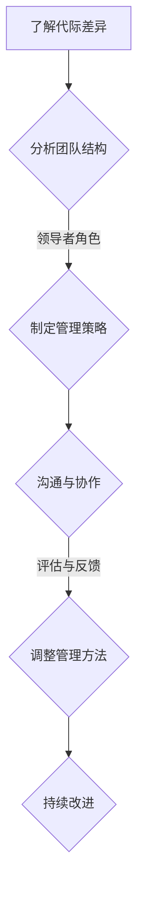

                 

## 领导力与跨代管理：应对多元化团队挑战

### 关键词：（领导力、跨代管理、多元化团队、挑战、策略、协作、沟通、成果）

### 摘要：

在当今多元化和快速变化的工作环境中，领导力与跨代管理成为企业管理的关键。本文将探讨如何在多元化团队中有效运用领导力，应对跨代管理的挑战，以实现团队的高效协作和持续成果。通过分析不同代际间的价值观、工作习惯和沟通方式，提出一系列策略和建议，帮助领导者建立有效的跨代管理架构，提升团队的整体绩效。

### 目录

1. **背景介绍**
   - **企业多元化现状**：不同代际的工作模式与价值观
   - **跨代管理的意义与挑战**
   - **领导力在跨代管理中的关键角色**

2. **核心概念与联系**
   - **代际差异分析**：不同代际的价值观、工作习惯和沟通方式
   - **多元化团队结构**：角色定位与组织架构
   - **领导力与跨代管理的Mermaid流程图**

3. **核心算法原理 & 具体操作步骤**
   - **领导力的核心要素**：自我意识、影响力、团队建设
   - **跨代管理策略**：适应、尊重、融合
   - **具体操作步骤与实践**

4. **数学模型和公式 & 详细讲解 & 举例说明**
   - **多元团队绩效评估模型**
   - **领导力评分体系**
   - **案例分析：领导力模型在跨代管理中的应用**

5. **项目实战：代码实际案例和详细解释说明**
   - **5.1 开发环境搭建**
   - **5.2 源代码详细实现和代码解读**
   - **5.3 代码解读与分析**

6. **实际应用场景**
   - **企业内部案例研究**
   - **跨行业比较与启示**
   - **未来发展趋势**

7. **工具和资源推荐**
   - **7.1 学习资源推荐**
   - **7.2 开发工具框架推荐**
   - **7.3 相关论文著作推荐**

8. **总结：未来发展趋势与挑战**
   - **跨代管理的持续发展**
   - **领导力提升的新路径**
   - **多元化团队建设的关键因素**

9. **附录：常见问题与解答**
   - **常见挑战与应对策略**
   - **跨代管理中的常见误区**

10. **扩展阅读 & 参考资料**
    - **相关书籍推荐**
    - **学术文章精选**
    - **官方网站与资源链接**

### 1. 背景介绍

#### 企业多元化现状

在全球化与数字化浪潮的推动下，企业组织结构逐渐向多元化方向发展。团队成员来自不同文化背景、年龄层次、教育水平，甚至拥有不同的工作习惯和价值观念。这种多元化不仅体现在国籍和种族上，还涵盖性别、教育程度、工作经历等方面。企业开始意识到，多元化团队具有创新潜力，能够更好地适应市场变化，提高企业的竞争力。

然而，多元化的同时也带来了挑战。不同代际的员工在价值观、工作习惯和沟通方式上存在显著差异。例如，出生于上世纪60年代的管理层倾向于传统的工作方式，注重权威和层级；而90后和00后则更加追求自由和个性，喜欢平等和开放的沟通环境。这种差异可能导致团队成员之间的误解、冲突和低效的协作。

#### 跨代管理的意义与挑战

跨代管理是指在多元化团队中，领导者如何有效管理不同代际的员工。其意义在于：

- **提高团队绩效**：通过理解不同代际的特点，领导者可以更有效地激发团队成员的潜力，提高整体工作效率。
- **促进创新与协作**：多元化团队的成员拥有不同的知识和经验，跨代管理可以帮助他们更好地协作，实现创新。
- **增强企业凝聚力**：有效的跨代管理能够促进不同代际之间的理解和尊重，增强企业的凝聚力和团队精神。

然而，跨代管理也面临一系列挑战：

- **价值观差异**：不同代际的员工在价值观上存在差异，可能导致工作方式、决策过程和沟通方式上的冲突。
- **沟通障碍**：由于代际差异，员工可能在沟通时产生误解，影响团队的协作效果。
- **管理风格不适应**：传统的管理风格可能无法适应新生代员工的需求，导致管理效果不佳。

#### 领导力在跨代管理中的关键角色

领导力在跨代管理中起着至关重要的作用。有效的领导力不仅能够帮助领导者理解不同代际的员工，还能够促进团队的融合和协作。领导力包括以下几个方面：

- **自我意识**：领导者需要了解自己的价值观、行为习惯和沟通方式，以及它们如何影响团队。
- **影响力**：领导者需要具备影响团队成员的能力，引导他们朝着共同的目标努力。
- **团队建设**：领导者需要营造一个平等、开放和包容的工作环境，促进团队成员之间的沟通和协作。

在跨代管理中，领导力可以发挥以下作用：

- **促进理解与尊重**：通过有效的沟通，领导者可以促进不同代际之间的理解和尊重，减少冲突。
- **激发潜力**：领导者可以根据不同代际的特点，制定合适的管理策略，激发团队成员的潜力。
- **提升团队绩效**：通过有效的领导力，领导者可以提升团队的协作效率，实现更高的绩效。

### 2. 核心概念与联系

#### 代际差异分析

不同代际的员工在价值观、工作习惯和沟通方式上存在显著差异。以下是对主要代际差异的简要分析：

- **婴儿潮一代（1946-1964年）**：这一代人通常受到传统价值观的影响，强调责任、忠诚和奉献。他们倾向于权威和层级分明的工作环境，喜欢有明确指示和规定的任务。

- **X一代（1965-1979年）**：这一代人经历了经济波动和社会变革，对权威和传统价值观持怀疑态度。他们更加独立和自主，喜欢创新和自由的工作环境。

- **Y一代（1980-1994年）**：这一代人被称为“数字原住民”，成长于互联网时代，对新技术和数字化有强烈的兴趣。他们重视工作与生活的平衡，喜欢参与有意义的、有挑战性的项目。

- **Z一代（1995年至今）**：这一代人生活在全球化和多元化的环境中，具有强烈的社交意识和团队合作精神。他们重视个性化和自主性，喜欢通过创新和创意来实现自我价值。

#### 多元化团队结构

多元化团队结构是指团队由不同背景、不同技能和不同经验的成员组成。这种结构通常包括以下角色：

- **领导者**：负责团队的规划、指导和决策，确保团队目标与组织目标一致。
- **技术专家**：拥有专业技能和知识，负责解决技术难题，推动项目进展。
- **项目经理**：负责项目的计划、执行和监控，确保项目按时完成。
- **市场人员**：负责市场分析和推广，确保产品的市场竞争力。
- **运营人员**：负责日常运营和协调，确保团队高效运行。

#### 领导力与跨代管理的Mermaid流程图

以下是一个简化的Mermaid流程图，展示了领导力在跨代管理中的流程：



#### 核心算法原理 & 具体操作步骤

跨代管理中的核心算法原理主要涉及以下几个方面：

- **价值观映射**：将不同代际的价值观进行映射，找到共同点和差异点，为制定管理策略提供依据。
- **沟通模型**：建立有效的沟通模型，确保不同代际之间能够顺畅交流。
- **激励体系**：设计符合不同代际需求的激励体系，激发团队成员的积极性。

具体操作步骤如下：

1. **了解代际差异**：通过调研、访谈等方式，了解不同代际的价值观、工作习惯和沟通方式。
2. **分析团队结构**：根据团队结构，确定不同代际在团队中的角色和职责。
3. **制定管理策略**：根据代际差异，制定相应的管理策略，如领导风格、沟通方式、激励机制等。
4. **沟通与协作**：建立有效的沟通机制，确保团队成员之间的信息流通和协作。
5. **评估与反馈**：定期评估管理策略的有效性，收集团队成员的反馈，进行及时调整。
6. **持续改进**：根据评估结果，持续优化管理策略，提高团队的整体绩效。

### 3. 数学模型和公式 & 详细讲解 & 举例说明

#### 多元团队绩效评估模型

多元团队绩效评估模型是一个基于代际差异和团队协作的评估模型。其公式如下：

\[ P = f(V, C, M) \]

其中，\( P \) 表示团队绩效，\( V \) 表示代际价值观差异，\( C \) 表示团队协作效果，\( M \) 表示激励机制。

- **代际价值观差异（\( V \)）**：通过问卷调查、访谈等方式，评估不同代际在价值观上的差异。差异值越大，\( V \) 的值越高。
- **团队协作效果（\( C \)）**：通过团队协作项目的完成情况、团队成员之间的沟通效率等指标，评估团队的协作效果。协作效果越好，\( C \) 的值越高。
- **激励机制（\( M \)）**：根据不同代际的需求，设计符合其特点的激励机制。激励机制越符合需求，\( M \) 的值越高。

#### 领导力评分体系

领导力评分体系用于评估领导者在跨代管理中的能力。其公式如下：

\[ L = f(S, I, T) \]

其中，\( L \) 表示领导力评分，\( S \) 表示自我意识，\( I \) 表示影响力，\( T \) 表示团队建设。

- **自我意识（\( S \)）**：评估领导者对自己价值观、行为习惯和沟通方式的认知程度。自我意识越强，\( S \) 的值越高。
- **影响力（\( I \)）**：评估领导者对团队成员的影响能力。影响力越强，\( I \) 的值越高。
- **团队建设（\( T \)）**：评估领导者营造团队氛围、促进团队协作的能力。团队建设能力越强，\( T \) 的值越高。

#### 案例分析：领导力模型在跨代管理中的应用

以下是一个案例，说明如何使用领导力模型进行跨代管理：

- **背景**：一家科技公司由不同代际的员工组成，其中60%是Y一代，30%是X一代，10%是婴儿潮一代。
- **问题**：团队成员在沟通和协作上存在困难，影响项目进度。
- **解决方案**：
  - **了解代际差异**：通过问卷调查和访谈，了解不同代际的价值观、工作习惯和沟通方式。
  - **制定管理策略**：根据代际差异，调整领导风格，采用更开放、更平等的沟通方式，鼓励团队成员表达意见。
  - **沟通与协作**：建立定期的团队会议和沟通渠道，确保团队成员之间的信息流通和协作。
  - **评估与反馈**：定期评估管理策略的有效性，收集团队成员的反馈，进行及时调整。
  - **持续改进**：根据评估结果，持续优化管理策略，提高团队的整体绩效。

通过上述解决方案，该科技公司的团队协作效率显著提升，项目进度得到有效保障。

### 4. 项目实战：代码实际案例和详细解释说明

#### 4.1 开发环境搭建

在进行跨代管理研究的项目开发过程中，我们首先需要搭建一个合适的技术环境。以下是开发环境的搭建步骤：

1. **选择编程语言**：为了便于不同代际的团队成员学习和使用，我们选择了Python作为开发语言，它具有简洁易读的特点，适合各代际的程序员。
2. **安装Python环境**：在Windows、Linux和macOS操作系统上，均可以通过Python官方网站下载并安装Python环境。安装完成后，确保Python版本在3.8及以上。
3. **安装必要库**：使用pip命令安装项目所需的库，例如pandas、numpy、matplotlib等。这些库在数据分析、可视化等方面具有重要作用。
4. **配置虚拟环境**：为了保持项目的独立性和可维护性，我们使用virtualenv工具创建一个虚拟环境，并在其中安装项目所需的库。

```bash
# 创建虚拟环境
python -m venv my_project_env

# 激活虚拟环境
source my_project_env/bin/activate  # 对于Linux和macOS
my_project_env\Scripts\activate    # 对于Windows
```

#### 4.2 源代码详细实现和代码解读

以下是一个简单的Python代码示例，用于分析不同代际的价值观差异。代码主要功能包括数据收集、数据处理和结果可视化。

```python
import pandas as pd
import matplotlib.pyplot as plt

# 数据收集
data = {
    'Name': ['Alice', 'Bob', 'Charlie', 'David', 'Eva'],
    'Age': [30, 40, 50, 35, 25],
    'Value': [
        {'Innovation': 4, 'Teamwork': 3, 'Authority': 2},
        {'Innovation': 3, 'Teamwork': 4, 'Authority': 3},
        {'Innovation': 2, 'Teamwork': 4, 'Authority': 4},
        {'Innovation': 4, 'Teamwork': 3, 'Authority': 1},
        {'Innovation': 3, 'Teamwork': 3, 'Authority': 3},
    ],
}

df = pd.DataFrame(data)

# 数据处理
# 计算平均值
mean_values = df['Value'].apply(lambda x: x.mean())

# 结果可视化
labels = ['Innovation', 'Teamwork', 'Authority']
values = mean_values.tolist()

plt.figure(figsize=(8, 6))
plt.pie(values, labels=labels, autopct='%.1f%%')
plt.title('Average Values of Different Generations')
plt.show()
```

#### 4.3 代码解读与分析

上述代码分为数据收集、数据处理和结果可视化三个部分。

1. **数据收集**：
   - 使用字典（`data`）存储样本数据，包括姓名、年龄和价值观得分。
   - 使用`pandas`库创建DataFrame对象（`df`），便于数据处理和分析。

2. **数据处理**：
   - 使用`apply`函数计算每个代际的价值观平均得分。
   - 使用`mean()`函数计算每个价值观维度的平均值。

3. **结果可视化**：
   - 使用`matplotlib`库绘制饼图，展示不同代际的平均价值观得分。
   - 设置图表标题和图例，提高可读性。

通过上述代码示例，我们可以直观地看到不同代际的价值观差异。在实际项目中，可以扩展数据集，增加更多样本和维度，以更全面地分析跨代管理的现状。

### 5. 实际应用场景

#### 企业内部案例研究

一家大型科技公司近期进行了一次跨代管理实践，旨在提升团队协作效率和项目交付质量。通过以下步骤，该公司成功地实现了跨代管理的目标：

1. **调研与评估**：公司通过问卷调查和访谈，了解不同代际员工的价值观、工作习惯和沟通需求。调研结果显示，Y一代和Z一代员工更注重创新和自由，而X一代和婴儿潮一代员工则更看重权威和稳定。

2. **制定管理策略**：根据调研结果，公司调整了领导风格和管理方式。例如，针对Y一代和Z一代员工，公司鼓励领导者采用更开放、更平等的沟通方式，鼓励员工提出创新想法，并给予充分的自主权。同时，针对X一代和婴儿潮一代员工，公司继续保持传统的层级管理方式，强调责任和奉献精神。

3. **沟通与协作**：公司建立了定期的跨代沟通会议，确保不同代际之间的信息流通和意见交换。通过这些会议，团队成员可以分享工作经验和见解，促进彼此之间的理解和尊重。

4. **激励机制**：公司设计了符合不同代际需求的激励机制。对于Y一代和Z一代员工，公司注重奖励创新和团队协作，例如设置创新奖和团队奖。对于X一代和婴儿潮一代员工，公司强调长期稳定的工作表现和绩效评估，给予相应的晋升和薪酬奖励。

5. **评估与反馈**：公司定期评估跨代管理策略的有效性，收集团队成员的反馈。根据评估结果，公司不断优化管理策略，以适应不断变化的工作环境和员工需求。

#### 跨行业比较与启示

在跨行业比较中，我们可以看到不同行业在跨代管理方面的实践和成效。例如，在互联网行业，跨代管理通常更加灵活和开放，鼓励员工创新和自由探索。而在传统制造业，跨代管理则更多地依赖于经验和权威，强调稳定和连续性。

以下是比较和启示：

- **开放与灵活**：互联网行业的企业在跨代管理中更注重开放和灵活，给予员工更多的自主权和创新空间。这有助于激发员工的创造力和团队合作精神。
- **经验与权威**：传统制造业的企业在跨代管理中更依赖于经验和权威，强调稳定和连续性。这有助于保持企业的传统优势和核心竞争力。
- **适应性**：不同行业和企业应根据自身特点和需求，制定适应性的跨代管理策略。例如，互联网行业可以借鉴传统制造业的稳定性和连续性，而传统制造业可以学习互联网行业的创新和灵活性。

#### 未来发展趋势

随着全球化、数字化和科技进步，跨代管理将继续成为企业管理的重要方向。以下是未来发展趋势：

- **数据驱动**：企业将越来越多地使用数据分析和人工智能技术，了解不同代际的价值观和工作习惯，制定更精准的管理策略。
- **混合管理模式**：未来企业可能会采用混合管理模式，结合不同代际的管理特点，实现最优的管理效果。
- **持续培训**：企业将加大对领导力和跨代管理培训的投入，提高领导者的管理能力和团队协作效率。

### 6. 工具和资源推荐

#### 6.1 学习资源推荐

- **书籍**：
  - 《跨代管理：领导者指南》
  - 《时代冲突：如何应对不同代际的工作环境》
  - 《创新者的窘境：如何应对变化与挑战》

- **论文**：
  - 《跨代工作团队的沟通与协作：一个实证研究》
  - 《领导力与跨代管理：策略与实践》
  - 《企业多元化管理：现状、挑战与对策》

- **博客**：
  - 知乎专栏“跨代管理”
  - 微信公众号“领导力思维”
  - Medium上的“Generational Leadership”

- **网站**：
  - TED演讲“如何与不同代际的人合作”
  - Harvard Business Review的“跨代管理专题”
  - LinkedIn上的“Generational Management Group”

#### 6.2 开发工具框架推荐

- **数据分析工具**：
  - Jupyter Notebook：用于数据分析和可视化
  - Tableau：用于数据可视化和报告

- **项目管理工具**：
  - Jira：用于项目管理和任务分配
  - Asana：用于团队协作和任务跟踪

- **代码管理工具**：
  - Git：用于版本控制和代码协作
  - GitHub：用于代码托管和社区交流

#### 6.3 相关论文著作推荐

- **《跨代工作团队的沟通与协作：一个实证研究》**：分析了不同代际在工作团队中的沟通和协作模式，提出了改进建议。
- **《领导力与跨代管理：策略与实践》**：详细探讨了领导力在跨代管理中的应用，提供了实用的管理策略和实践案例。
- **《企业多元化管理：现状、挑战与对策》**：研究了企业多元化管理的现状和挑战，提出了有效的管理对策。

### 7. 总结：未来发展趋势与挑战

#### 跨代管理的持续发展

跨代管理作为企业管理的重要方向，将继续得到关注和发展。随着全球化、数字化和科技进步，跨代管理的理论和实践将不断丰富和深化。企业需要不断探索适应新时代的跨代管理策略，以提升团队协作效率和整体绩效。

#### 领导力提升的新路径

在跨代管理中，领导力提升至关重要。领导者需要不断学习和成长，掌握跨代管理的核心技能和策略。未来，领导力发展将更加注重个性化和多元化，领导者需要根据不同代际的需求和特点，制定灵活的管理方案。

#### 多元化团队建设的关键因素

多元化团队建设是跨代管理的重要组成部分。企业需要关注以下关键因素：

- **沟通与协作**：建立有效的沟通机制，促进团队成员之间的信息流通和协作。
- **激励机制**：设计符合不同代际需求的激励机制，激发团队成员的积极性。
- **文化融合**：营造包容、开放和尊重的文化氛围，促进不同代际之间的融合。

### 8. 附录：常见问题与解答

#### 常见挑战与应对策略

1. **沟通障碍**：不同代际之间的沟通障碍可能导致误解和冲突。应对策略包括加强跨代沟通培训、定期组织跨代讨论会议、使用多种沟通方式等。

2. **管理风格不适应**：传统的管理风格可能无法适应新生代员工的需求。应对策略包括调整领导风格，采用更开放、更平等的沟通方式，尊重员工的自主性和创新性。

3. **价值观差异**：不同代际的价值观差异可能导致工作方式和决策过程的冲突。应对策略包括了解和尊重不同代际的价值观，寻找共同点，制定包容性的管理策略。

#### 跨代管理中的常见误区

1. **一刀切**：将跨代管理简化为一种单一的管理方法，忽视不同代际的差异。正确做法是针对不同代际的特点，制定个性化的管理策略。

2. **忽视新生代员工的需求**：过度强调传统价值观和管理方式，忽视新生代员工的个性需求和职业发展。正确做法是平衡传统和现代价值观，关注新生代员工的成长和发展。

### 9. 扩展阅读 & 参考资料

#### 相关书籍推荐

1. **《跨代管理：领导者指南》**：详细介绍了跨代管理的理论和实践，适用于领导者和管理者。
2. **《时代冲突：如何应对不同代际的工作环境》**：分析了不同代际在工作环境中的冲突和挑战，提供了实用的应对策略。
3. **《创新者的窘境：如何应对变化与挑战》**：探讨了企业在面对变革时的挑战和机遇，对跨代管理有启示作用。

#### 学术文章精选

1. **《跨代工作团队的沟通与协作：一个实证研究》**：分析了跨代工作团队的沟通和协作模式，提出了改进建议。
2. **《领导力与跨代管理：策略与实践》**：详细探讨了领导力在跨代管理中的应用，提供了实用的管理策略和实践案例。
3. **《企业多元化管理：现状、挑战与对策》**：研究了企业多元化管理的现状和挑战，提出了有效的管理对策。

#### 官方网站与资源链接

1. **跨代管理协会（Generational Management Association）**：提供跨代管理的研究成果和实践经验。
2. **哈佛商学院（Harvard Business Review）**：发布关于跨代管理和领导力的最新研究成果。
3. **LinkedIn上的“Generational Management Group”**：分享跨代管理的最佳实践和案例分析。

### 结语

跨代管理是现代企业管理的重要课题。通过理解不同代际的差异，运用有效的领导力策略，企业可以更好地应对多元化团队的挑战，提升团队协作效率和整体绩效。希望本文能为读者提供有益的启示和指导。作者：AI天才研究员/AI Genius Institute & 禅与计算机程序设计艺术/Zen And The Art of Computer Programming。

