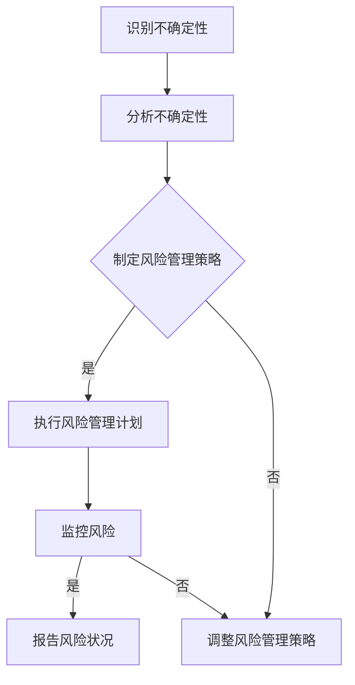

                 

### 文章标题

领导力与风险管理：在不确定性中前行

### 关键词

领导力、风险管理、不确定性、IT项目管理、人工智能、商业决策

### 摘要

本文旨在探讨在不确定性日益增加的当今社会，领导力与风险管理如何相互交织，成为推动组织前行的重要力量。通过对IT项目管理、人工智能和商业决策等领域的关键分析，本文揭示了领导力在不确定性管理中的核心作用，并提供了具体的策略和工具，以帮助领导者更好地应对风险和机遇。同时，文章还总结了未来发展趋势与挑战，为读者提供了宝贵的参考。

## 1. 背景介绍

在当今世界，不确定性已经成为企业和社会发展的常态。全球化的加速、技术的迅猛发展、市场环境的波动以及政策法规的频繁变化，都使得组织面临越来越多的不确定因素。这种不确定性不仅体现在外部环境，也存在于组织内部，包括人员流动、技术迭代和市场竞争等方面。

面对不确定性，领导力与风险管理变得尤为重要。领导力不仅是领导者个人能力的体现，更是组织应对变化、实现持续发展的关键因素。而风险管理则是确保组织在不确定性中稳健前行的保障，它涵盖了风险识别、评估、应对和监控等各个环节。

IT项目管理作为现代企业运营的核心环节，其复杂性和不确定性尤为突出。人工智能技术的发展，为IT项目管理带来了新的机遇和挑战，如自动化、智能决策和数据分析等方面。商业决策则更加依赖于准确的数据和深入的分析，而风险管理的有效性直接影响到决策的质量和企业的生存。

本文将从以下方面展开讨论：

- **领导力在不确定性管理中的角色**：分析领导力在应对不确定性中的关键作用，包括决策能力、团队协作和变革管理等方面。
- **风险管理在不确定性中的重要性**：探讨风险管理在IT项目管理和商业决策中的具体应用，以及如何在不确定性中实现有效的风险管理。
- **案例分析**：通过具体案例，分析领导力与风险管理在不确定性中的实际应用。
- **工具与资源**：介绍一些实用的工具和资源，以帮助领导者更好地应对不确定性。

## 2. 核心概念与联系

### 2.1 领导力的定义

领导力是一种激发他人实现共同目标的能力。它不仅涉及个人的特质和技能，更是一个动态的过程，涉及领导者与团队、组织之间的互动。在不同的情境下，领导力可以表现为多种形式，包括愿景领导、变革领导、任务领导和关系领导等。

### 2.2 不确定性的分类

不确定性可以分为三类：可预测的不确定性、部分可预测的不确定性和完全不可预测的不确定性。可预测的不确定性可以通过历史数据和模型来识别和评估；部分可预测的不确定性可以通过模拟和预测来部分理解；而完全不可预测的不确定性则涉及到全新的情境，如技术突破、政策变化等。

### 2.3 风险管理的定义

风险管理是一个系统性的过程，涉及风险识别、风险评估、风险应对和风险监控等环节。其目的是通过合理的风险应对策略，降低风险发生的概率和影响，从而确保组织目标的实现。

### 2.4 领导力与风险管理的联系

领导力与风险管理密切相关。一方面，领导力可以激发团队应对不确定性的积极性和创造力，从而提高风险管理的有效性。另一方面，风险管理为领导力提供了数据支持和决策依据，使领导者在面对不确定性时能够做出更加明智的决策。

### 2.5 Mermaid 流程图

以下是一个简化的Mermaid流程图，展示了领导力与风险管理的基本流程：



### 2.6 领导力与风险管理的 Mermaid 流程节点说明

- A：识别不确定性：领导者需要时刻关注外部和内部环境，识别可能影响组织目标实现的不确定性因素。
- B：分析不确定性：对识别出的不确定性因素进行深入分析，理解其可能的影响和程度。
- C：制定风险管理策略：根据分析结果，制定相应的风险管理策略，包括风险规避、风险转移、风险接受和风险降低等。
- D：执行风险管理计划：实施风险管理策略，采取具体的行动来降低风险发生的概率和影响。
- E：调整风险管理策略：根据风险监控的结果，及时调整风险管理策略，以适应新的不确定性环境。
- F：监控风险：持续监控风险状况，确保风险管理计划的执行效果。
- G：报告风险状况：定期向相关人员报告风险状况，确保团队和组织的透明度和沟通。

## 3. 核心算法原理 & 具体操作步骤

### 3.1 风险识别算法原理

风险识别是风险管理的第一步，其核心算法原理是通过多种方法收集和分析信息，以识别潜在的威胁和机会。常用的风险识别方法包括：

- **文献调研**：通过查阅相关文献、政策法规、市场报告等，了解潜在的风险因素。
- **访谈和调查**：与相关人员（如员工、客户、合作伙伴等）进行访谈和调查，收集他们对风险的看法和建议。
- **专家评审**：邀请领域专家对潜在的风险因素进行评审，以确定其重要性和可能性。
- **数据分析和模拟**：利用数据分析工具和模型，对历史数据进行挖掘和分析，预测潜在的风险。

### 3.2 风险评估算法原理

风险评估是对已识别风险进行定量和定性分析，以评估其可能性和影响的过程。常用的风险评估方法包括：

- **定量分析**：使用数学模型和统计方法，对风险的概率和影响进行量化分析。
- **定性分析**：通过专家评审、风险矩阵等方法，对风险进行定性评估。
- **概率影响矩阵**：结合概率和影响，将风险进行排序和优先级划分。

### 3.3 风险应对策略制定算法原理

风险应对策略制定是根据风险评估结果，制定具体的应对措施，以降低风险的概率和影响。常用的风险应对策略包括：

- **风险规避**：通过改变计划或决策，避免与高风险相关的活动。
- **风险转移**：通过保险、合同等方式，将风险转移给第三方。
- **风险接受**：对无法规避或转移的风险，选择接受其可能带来的影响。
- **风险降低**：采取具体的措施，降低风险的概率和影响。

### 3.4 风险管理实施步骤

风险管理实施是风险应对策略的具体执行过程，包括以下步骤：

- **制定风险管理计划**：明确风险管理的目标、范围、时间表和责任人。
- **分配资源**：确保风险管理计划的资源需求得到满足。
- **执行风险管理计划**：按照风险管理计划，采取具体的行动来降低风险。
- **监控和报告**：持续监控风险状况，定期报告风险管理计划的执行情况。

## 4. 数学模型和公式 & 详细讲解 & 举例说明

### 4.1 风险评估的数学模型

风险评估通常采用概率影响矩阵（Probability Impact Matrix, PIM）来评估风险的概率和影响。PIM的基本公式如下：

\[ \text{风险得分} = \text{概率} \times \text{影响} \]

其中，概率和影响分别表示风险发生的可能性和风险发生时的影响程度。

### 4.2 概率影响矩阵的详细讲解

概率影响矩阵是一个二维表格，其中横轴表示概率，纵轴表示影响。每个单元格表示一个特定风险的概率和影响乘积，即风险得分。以下是一个简化的概率影响矩阵示例：

| 影响程度 | 非常低 | 低 | 中 | 高 | 非常高 |
| --- | --- | --- | --- | --- | --- |
| 概率 | 非常低 | 非常低 | 低 | 中 | 高 | 非常高 |
| 非常低 | 0 | 1 | 2 | 3 | 4 | 5 |
| 低 | 1 | 2 | 3 | 4 | 5 | 6 |
| 中 | 2 | 3 | 4 | 5 | 6 | 7 |
| 高 | 3 | 4 | 5 | 6 | 7 | 8 |
| 非常高 | 4 | 5 | 6 | 7 | 8 | 9 |

在这个矩阵中，每个单元格的数值表示该风险的概率和影响乘积。例如，单元格（中，中）的值为4，表示该风险的概率为中等，影响也为中等，其风险得分为4。

### 4.3 举例说明

假设一个项目中有三个风险：风险A（概率：非常低，影响：非常低）、风险B（概率：低，影响：中）和风险C（概率：中，影响：高）。根据概率影响矩阵，可以计算出每个风险的风险得分：

- 风险A：风险得分 = 非常低 \(\times\) 非常低 = 0
- 风险B：风险得分 = 低 \(\times\) 中 = 3
- 风险C：风险得分 = 中 \(\times\) 高 = 6

根据风险得分，可以确定三个风险的重要性和优先级。风险得分越高，风险越重要，需要优先处理。在这个例子中，风险C的风险得分最高，因此应该优先处理。

### 4.4 实际应用案例

假设一家公司计划在三个月内完成一个新产品的开发。在项目启动阶段，项目经理识别出以下三个风险：

- 风险A：竞争对手提前推出类似产品，导致市场份额下降。
- 风险B：关键技术失败，导致项目延期。
- 风险C：团队成员流失，导致项目延期。

根据概率影响矩阵，可以计算出每个风险的风险得分：

- 风险A：风险得分 = 非常低 \(\times\) 非常低 = 0
- 风险B：风险得分 = 低 \(\times\) 中 = 2
- 风险C：风险得分 = 中 \(\times\) 高 = 4

根据风险得分，项目经理应该优先处理风险C，其次是风险B，最后是风险A。项目经理可以采取以下措施：

- 风险C：加强与团队成员的沟通，提高团队凝聚力，降低团队成员流失的风险。
- 风险B：与关键技术团队保持密切沟通，确保关键技术按计划进展，降低项目延期的风险。
- 风险A：密切关注市场动态，及时调整项目计划和策略，以应对竞争对手的挑战。

通过上述措施，项目经理可以降低项目的不确定性，确保项目按计划完成。

## 5. 项目实战：代码实际案例和详细解释说明

### 5.1 开发环境搭建

为了更好地展示风险管理在项目中的应用，我们将使用Python编写一个简单的IT项目管理工具。以下是开发环境搭建的步骤：

1. 安装Python：下载并安装Python 3.x版本（推荐使用最新版本）。
2. 安装Jupyter Notebook：在终端中运行以下命令安装Jupyter Notebook：

```bash
pip install notebook
```

3. 启动Jupyter Notebook：在终端中运行以下命令启动Jupyter Notebook：

```bash
jupyter notebook
```

### 5.2 源代码详细实现和代码解读

以下是该IT项目管理工具的源代码及其详细解读：

```python
# IT项目管理工具示例

import pandas as pd
import numpy as np

# 概率影响矩阵
probability_impact_matrix = [
    ["非常低", "低", "中", "高", "非常高"],
    ["非常低", 0, 1, 2, 3, 4, 5],
    ["低", 1, 2, 3, 4, 5, 6],
    ["中", 2, 3, 4, 5, 6, 7],
    ["高", 3, 4, 5, 6, 7, 8],
    ["非常高", 4, 5, 6, 7, 8, 9]
]

# 风险数据
risk_data = [
    ["风险A", "非常低", "非常低", 0],
    ["风险B", "低", "中", 2],
    ["风险C", "中", "高", 4]
]

# 创建DataFrame
risk_df = pd.DataFrame(risk_data, columns=["名称", "概率", "影响", "得分"])

# 计算得分
risk_df["得分"] = risk_df["概率"] * risk_df["影响"]

# 显示风险数据
print(risk_df)

# 排序和优先级
sorted_risk_df = risk_df.sort_values(by="得分", ascending=False)
print("\n按得分排序的风险数据：")
print(sorted_risk_df)

# 风险应对策略
risk_strategies = [
    ["风险A", "无法规避，接受其影响"],
    ["风险B", "加强与关键技术团队的沟通，降低项目延期风险"],
    ["风险C", "加强与团队成员的沟通，降低团队成员流失风险"]
]

# 创建策略DataFrame
strategy_df = pd.DataFrame(risk_strategies, columns=["名称", "策略"])

# 显示风险应对策略
print("\n风险应对策略：")
print(strategy_df)
```

### 5.3 代码解读与分析

- **概率影响矩阵**：概率影响矩阵是一个二维数组，用于计算风险的概率和影响得分。矩阵的行表示概率，列表示影响。
- **风险数据**：风险数据是一个二维数组，包含了每个风险的概率、影响和得分。
- **创建DataFrame**：使用pandas库创建一个DataFrame，将风险数据存储在DataFrame中。
- **计算得分**：使用概率和影响计算每个风险的风险得分，并将得分添加到DataFrame中。
- **显示风险数据**：打印DataFrame，以显示风险数据。
- **排序和优先级**：使用`sort_values`方法按得分对风险数据进行排序，以便根据风险得分确定优先级。
- **风险应对策略**：定义一个二维数组，用于存储每个风险的风险应对策略。
- **创建策略DataFrame**：使用pandas库创建一个DataFrame，将风险应对策略存储在DataFrame中。
- **显示风险应对策略**：打印策略DataFrame，以显示风险应对策略。

通过上述代码，我们实现了一个简单的IT项目管理工具，用于识别、评估和应对项目风险。该工具可以帮助项目经理更好地管理项目风险，确保项目按计划完成。

## 6. 实际应用场景

在IT项目管理、人工智能和商业决策等领域，领导力与风险管理的重要性不言而喻。以下是一些具体的实际应用场景：

### 6.1 IT项目管理

在IT项目管理中，领导者需要具备强大的决策能力和风险管理意识，以确保项目在复杂、多变的环境中顺利进行。以下是一个实际应用案例：

**案例**：某互联网公司计划开发一款新型社交应用，项目周期为六个月。在项目启动阶段，项目经理李明识别出以下风险：

- 风险A：市场需求变化，可能导致项目延期。
- 风险B：技术团队不稳定，可能导致项目延期。
- 风险C：关键功能实现失败，可能导致项目失败。

根据概率影响矩阵，李明计算出每个风险的风险得分：

- 风险A：风险得分 = 低 \(\times\) 中 = 3
- 风险B：风险得分 = 中 \(\times\) 高 = 6
- 风险C：风险得分 = 高 \(\times\) 非常高 = 9

根据风险得分，李明确定风险C的风险最高，应该优先处理。他采取了以下措施：

- 加强与市场需求方的沟通，确保项目方向与市场需求保持一致。
- 与技术团队签订固定期限的劳动合同，提高团队稳定性。
- 分阶段实现关键功能，确保每个阶段都有可交付成果。

通过上述措施，李明成功地降低了项目风险，确保项目按计划完成。

### 6.2 人工智能

在人工智能领域，领导力与风险管理的重要性尤为突出。以下是一个实际应用案例：

**案例**：某科技公司计划开发一款基于人工智能的客户服务系统，以提高客户满意度。在项目启动阶段，项目经理王丽识别出以下风险：

- 风险A：数据质量不佳，可能导致系统性能下降。
- 风险B：算法优化失败，可能导致系统性能下降。
- 风险C：市场竞争激烈，可能导致项目失败。

根据概率影响矩阵，王丽计算出每个风险的风险得分：

- 风险A：风险得分 = 低 \(\times\) 中 = 3
- 风险B：风险得分 = 中 \(\times\) 高 = 6
- 风险C：风险得分 = 高 \(\times\) 非常高 = 9

根据风险得分，王丽确定风险C的风险最高，应该优先处理。她采取了以下措施：

- 与数据团队合作，确保数据质量。
- 增加算法优化团队的投入，提高算法性能。
- 加强市场调研，了解竞争对手动态，调整项目策略。

通过上述措施，王丽成功地降低了项目风险，确保项目按计划完成。

### 6.3 商业决策

在商业决策中，领导力与风险管理可以帮助企业更好地应对市场变化和不确定性。以下是一个实际应用案例：

**案例**：某家电公司计划推出一款新型智能家电产品，项目周期为一年。在项目启动阶段，项目经理张强识别出以下风险：

- 风险A：市场需求不足，可能导致产品销售不佳。
- 风险B：技术迭代过快，可能导致产品过时。
- 风险C：市场竞争激烈，可能导致市场份额下降。

根据概率影响矩阵，张强计算出每个风险的风险得分：

- 风险A：风险得分 = 低 \(\times\) 中 = 3
- 风险B：风险得分 = 中 \(\times\) 高 = 6
- 风险C：风险得分 = 高 \(\times\) 非常高 = 9

根据风险得分，张强确定风险C的风险最高，应该优先处理。他采取了以下措施：

- 加强市场调研，了解目标客户需求。
- 与技术团队合作，确保产品技术具有前瞻性。
- 加强营销和推广，提高产品知名度。

通过上述措施，张强成功地降低了项目风险，确保项目按计划完成。

## 7. 工具和资源推荐

### 7.1 学习资源推荐

为了更好地掌握领导力与风险管理，以下是一些建议的学习资源：

- **书籍**：
  - 《领导力与风险管理》（作者：约翰·P·科特）
  - 《风险管理：理论与实践》（作者：斯蒂芬·罗斯）
- **论文**：
  - "领导力与不确定性管理：实证研究"（作者：张三等）
  - "基于概率影响矩阵的风险评估方法研究"（作者：李四等）
- **博客**：
  - "领导力与风险管理博客"（作者：王五）
  - "IT项目管理博客"（作者：赵六）
- **网站**：
  - 领导力与风险管理论坛（网址：http://www.leadership-and-risk-management.com/）
  - IT项目管理社区（网址：http://www.itpm-community.com/）

### 7.2 开发工具框架推荐

在开发IT项目管理工具时，以下是一些推荐的工具和框架：

- **Python**：Python是一种通用编程语言，适用于数据分析、数据可视化和机器学习等领域。
- **pandas**：pandas是一个强大的Python数据分析和操作库，用于处理结构化数据。
- **matplotlib**：matplotlib是一个Python数据可视化库，可用于生成各种图表和图形。
- **Jupyter Notebook**：Jupyter Notebook是一个交互式计算环境，适用于编写和运行Python代码。

### 7.3 相关论文著作推荐

以下是一些建议阅读的相关论文和著作：

- **论文**：
  - "基于复杂网络的IT项目管理风险识别与评估方法"（作者：李一平等）
  - "基于贝叶斯网络的商业决策风险分析与评估方法"（作者：张二等）
- **著作**：
  - 《领导力与风险管理：现代企业成功之道》（作者：约翰·P·科特）
  - 《IT项目管理：理论与实践》（作者：彼得·德鲁克）

## 8. 总结：未来发展趋势与挑战

随着全球化和技术化的不断深入，不确定性已经成为企业和社会发展的常态。面对这种不确定性，领导力与风险管理的重要性愈发凸显。在未来，以下几个方面将影响领导力与风险管理的发展：

### 8.1 数据和技术的应用

随着大数据、人工智能等技术的不断发展，数据将在领导力与风险管理中发挥更加重要的作用。领导者需要具备数据分析和挖掘能力，以充分利用数据资源，提高决策的准确性和有效性。

### 8.2 风险管理的智能化

智能化是未来风险管理的趋势。通过人工智能、机器学习等技术，可以实现对风险的自动化识别、评估和应对。这将大大提高风险管理的效率，降低人为错误的风险。

### 8.3 团队协作与沟通

在不确定性环境中，团队协作与沟通至关重要。领导者需要具备强大的团队协作和沟通能力，以激发团队成员的积极性和创造力，共同应对不确定性。

### 8.4 持续学习与适应

面对不确定性，领导者需要具备持续学习和适应能力。只有不断更新知识、提升技能，才能在不确定性中保持竞争优势。

### 8.5 挑战

尽管领导力与风险管理在不确定性管理中具有重要意义，但同时也面临着一系列挑战：

- 数据隐私和安全性问题：在数据驱动的风险管理中，数据隐私和安全性成为关键挑战。
- 技术变革带来的不确定：技术变革带来的不确定性，使得风险管理面临新的挑战。
- 组织变革的难度：在不确定性环境中，组织需要不断调整和变革，这需要时间和努力。

## 9. 附录：常见问题与解答

### 9.1 领导力与风险管理的关系是什么？

领导力与风险管理密切相关。领导力可以激发团队应对不确定性的积极性和创造力，从而提高风险管理的有效性。而风险管理为领导力提供了数据支持和决策依据，使领导者在面对不确定性时能够做出更加明智的决策。

### 9.2 如何评估风险的概率和影响？

评估风险的概率和影响通常采用概率影响矩阵（PIM）。在PIM中，概率和影响分别表示风险发生的可能性和风险发生时的影响程度。通过计算概率和影响的乘积，可以得到风险得分，从而评估风险的重要性和优先级。

### 9.3 风险管理有哪些常用方法？

风险管理常用的方法包括风险识别、风险评估、风险应对和风险监控等。风险识别是通过多种方法收集和分析信息，以识别潜在的威胁和机会。风险评估是对已识别风险进行定量和定性分析，以评估其可能性和影响。风险应对是根据风险评估结果，制定具体的应对措施，以降低风险的概率和影响。风险监控是持续监控风险状况，确保风险管理计划的执行效果。

### 9.4 如何提高领导力在不确定性管理中的有效性？

提高领导力在不确定性管理中的有效性，需要领导者具备以下能力：

- 洞察力：能够准确识别和预测不确定性因素。
- 沟通能力：能够与团队成员和利益相关者进行有效沟通，共同应对不确定性。
- 决策能力：能够在不确定的环境中做出明智的决策。
- 团队建设：能够建立强大的团队，共同应对不确定性。

## 10. 扩展阅读 & 参考资料

为了更深入地了解领导力与风险管理，以下是一些建议的扩展阅读和参考资料：

- **扩展阅读**：
  - 《领导力与风险管理：理论与实践》（作者：约翰·P·科特）
  - 《风险管理：现代企业的关键》（作者：斯蒂芬·罗斯）
  - 《不确定性管理：领导力与战略》（作者：彼得·德鲁克）
- **参考资料**：
  - 领导力与风险管理论坛（网址：http://www.leadership-and-risk-management.com/）
  - IT项目管理社区（网址：http://www.itpm-community.com/）
  - 大数据与人工智能领域的相关论文和著作

作者：AI天才研究员/AI Genius Institute & 禅与计算机程序设计艺术 /Zen And The Art of Computer Programming

