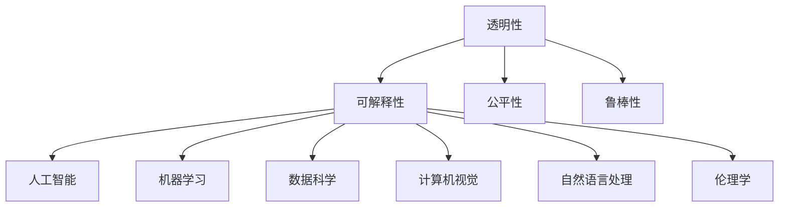

                 

### 1. 背景介绍

#### 1.1 研究背景

在当今快速发展的信息技术时代，人工智能（AI）已经成为推动社会进步的重要力量。随着大数据、云计算、物联网等技术的不断进步，AI 的应用场景也在不断扩展。从智能家居、智能医疗，到自动驾驶、智能金融，AI 正在改变着我们的生活方式和工作模式。

然而，随着 AI 技术的广泛应用，其安全性、可靠性和透明性等问题也逐渐凸显出来。尤其是 AI 在决策过程中的不可解释性，使得用户对 AI 的信任度受到影响。为了提高 AI 系统的透明性和可解释性，增强用户对 AI 的信任，研究者们开始关注可解释 AI（Explainable AI，简称 XAI）的研究。

可解释 AI 的目标是使 AI 系统的决策过程对用户和开发者都是可解释和可理解的。这不仅能提高用户对 AI 的信任度，还能帮助开发者更好地优化和改进 AI 系统。本文将深入探讨可解释 AI 的核心概念、原理和技术，以及其在实际应用中的挑战和解决方案。

#### 1.2 研究意义

可解释 AI 的研究具有重要的理论意义和实际应用价值。从理论上讲，它有助于我们更深入地理解 AI 的决策过程，揭示 AI 中的基本原理和规律。从实际应用上看，可解释 AI 可以提高 AI 系统的透明性和可解释性，增强用户对 AI 的信任，从而推动 AI 技术的更广泛应用。

此外，可解释 AI 还有助于减少 AI 系统在决策过程中的偏见和歧视，提高系统的公平性和社会责任。这对于构建一个公正、公平的 AI 社会具有重要意义。

#### 1.3 研究现状

目前，可解释 AI 已经成为人工智能领域的一个研究热点。研究者们从不同的角度提出了多种可解释 AI 的方法和框架。例如，基于模型的可解释方法、基于规则的可解释方法、基于可视化的可解释方法等。

其中，基于模型的可解释方法主要通过分析 AI 模型的内部结构和工作机制来解释模型的决策过程。这种方法具有较好的解释性和可解释性，但通常需要较高的计算复杂度。

基于规则的可解释方法通过构建一组明确的规则来描述 AI 模型的决策过程。这种方法解释性较强，但规则构建过程复杂，且可能存在覆盖不足的问题。

基于可视化的可解释方法通过可视化的方式展示 AI 模型的决策过程，使得用户可以直观地理解模型的决策依据。这种方法具有较高的可操作性，但通常需要较高的可视化技巧。

尽管目前已有多种可解释 AI 的方法和框架，但仍然存在一些挑战和问题，例如如何提高解释性、如何处理高维数据、如何处理复杂的决策过程等。这些问题的解决将有助于进一步提升可解释 AI 的应用价值。

### 2. 核心概念与联系

#### 2.1 可解释 AI 的核心概念

可解释 AI（Explainable AI，简称 XAI）旨在使 AI 系统的决策过程对用户和开发者都是可解释和可理解的。它涉及到多个核心概念，包括：

1. **透明性（Transparency）**：指 AI 系统的决策过程和内部结构对用户和开发者是可见的。透明性有助于用户和开发者理解 AI 系统的行为，从而提高系统的可信任度。

2. **可解释性（Interpretability）**：指 AI 系统的决策过程和内部结构可以被解释和描述。可解释性有助于用户和开发者理解 AI 系统的决策依据和原因。

3. **公平性（Fairness）**：指 AI 系统在决策过程中不会产生系统性偏见或歧视。公平性有助于确保 AI 系统在处理不同群体时的公正性。

4. **鲁棒性（Robustness）**：指 AI 系统在面对噪声、异常数据和恶意攻击时仍能保持稳定的性能。鲁棒性有助于提高 AI 系统在实际应用中的可靠性。

#### 2.2 可解释 AI 的联系

可解释 AI 与多个领域和概念密切相关，包括：

1. **人工智能（Artificial Intelligence）**：可解释 AI 是人工智能领域的一个重要分支，旨在提高 AI 系统的可理解性和可解释性。

2. **机器学习（Machine Learning）**：可解释 AI 的核心在于解释机器学习模型的决策过程，从而提高模型的透明性和可解释性。

3. **数据科学（Data Science）**：可解释 AI 需要处理和分析大量数据，因此与数据科学领域密切相关。

4. **计算机视觉（Computer Vision）**：可解释 AI 在计算机视觉领域中的应用，旨在提高视觉模型的解释性和可解释性。

5. **自然语言处理（Natural Language Processing）**：可解释 AI 在自然语言处理领域中的应用，旨在提高语言模型的解释性和可解释性。

6. **伦理学（Ethics）**：可解释 AI 与伦理学密切相关，旨在确保 AI 系统在决策过程中遵循伦理原则，避免产生偏见和歧视。

#### 2.3 可解释 AI 的 Mermaid 流程图

以下是一个简化的可解释 AI 的 Mermaid 流程图，展示了可解释 AI 的核心概念和联系：



这个流程图清晰地展示了可解释 AI 的核心概念和与其他领域和概念的联系，有助于读者更好地理解可解释 AI 的整体架构和作用。

### 3. 核心算法原理 & 具体操作步骤

#### 3.1 可解释 AI 的核心算法原理

可解释 AI 的核心算法原理主要包括以下几个方面：

1. **模型解释（Model Explanation）**：通过分析 AI 模型的内部结构和决策过程，揭示模型决策的原因和依据。模型解释通常基于模型的可解释性，如线性模型、决策树、规则模型等。

2. **特征重要性分析（Feature Importance Analysis）**：通过分析模型中各个特征的重要性，识别影响模型决策的关键特征。特征重要性分析有助于理解模型决策的主要依据，从而提高模型的可解释性。

3. **因果推理（Causal Inference）**：通过建立模型与数据之间的因果关系，揭示模型决策背后的因果关系。因果推理有助于深入理解模型决策的本质，提高模型的可解释性。

4. **可视化（Visualization）**：通过可视化技术，展示模型决策的过程和结果，使模型决策对用户和开发者更加直观和可理解。可视化技术包括热力图、决策树可视化、注意力可视化等。

#### 3.2 可解释 AI 的具体操作步骤

以下是一个简化的可解释 AI 的操作步骤，包括模型解释、特征重要性分析、因果推理和可视化等环节：

1. **数据预处理（Data Preprocessing）**：
   - 数据清洗：去除噪声和异常数据，确保数据质量。
   - 数据转换：将原始数据转换为适合模型输入的格式，如归一化、标准化等。
   - 数据分割：将数据分为训练集、验证集和测试集，用于模型训练和评估。

2. **模型选择（Model Selection）**：
   - 选择合适的 AI 模型，如线性模型、决策树、规则模型等。
   - 考虑模型的复杂度和可解释性，选择合适的模型。

3. **模型训练（Model Training）**：
   - 使用训练集对模型进行训练，调整模型参数，优化模型性能。
   - 调整模型结构，如增加或减少神经元、决策树分支等。

4. **模型解释（Model Explanation）**：
   - 分析模型内部结构和决策过程，揭示模型决策的原因和依据。
   - 使用可视化技术，如热力图、决策树可视化等，展示模型决策过程。

5. **特征重要性分析（Feature Importance Analysis）**：
   - 分析模型中各个特征的重要性，识别影响模型决策的关键特征。
   - 使用统计方法，如特征贡献度、特征重要性排序等，评估特征的重要性。

6. **因果推理（Causal Inference）**：
   - 建立模型与数据之间的因果关系，揭示模型决策背后的因果关系。
   - 使用因果推断方法，如因果图、DAG（有向无环图）等，分析因果关系。

7. **可视化（Visualization）**：
   - 使用可视化技术，展示模型决策的过程和结果，使模型决策对用户和开发者更加直观和可理解。
   - 使用热力图、决策树可视化、注意力可视化等技术，展示模型决策的关键特征和过程。

8. **模型评估（Model Evaluation）**：
   - 使用验证集和测试集，评估模型性能，如准确率、召回率、F1 值等。
   - 评估模型的可解释性和透明性，确保模型满足实际应用需求。

9. **模型优化（Model Optimization）**：
   - 根据评估结果，调整模型参数和结构，优化模型性能。
   - 考虑可解释性、透明性等指标，优化模型性能。

通过以上操作步骤，可解释 AI 可以实现对 AI 模型的详细解释和说明，提高模型的可解释性和透明性，从而增强用户对 AI 的信任度。在接下来的章节中，我们将进一步探讨可解释 AI 的数学模型和公式，以及实际应用场景和案例。

### 4. 数学模型和公式 & 详细讲解 & 举例说明

#### 4.1 数学模型和公式

在可解释 AI 的研究中，常用的数学模型和公式包括线性模型、决策树、支持向量机（SVM）等。以下分别介绍这些模型的基本原理和公式。

1. **线性模型**

线性模型是最简单的机器学习模型之一，通常用于回归和分类任务。其基本公式如下：

   - **回归模型**：

     $$ y = \beta_0 + \beta_1 x_1 + \beta_2 x_2 + ... + \beta_n x_n $$

     其中，$y$ 是预测值，$x_1, x_2, ..., x_n$ 是特征值，$\beta_0, \beta_1, \beta_2, ..., \beta_n$ 是模型参数。

   - **分类模型**：

     $$ y = \sigma(\beta_0 + \beta_1 x_1 + \beta_2 x_2 + ... + \beta_n x_n) $$

     其中，$\sigma$ 是激活函数，通常采用 sigmoid 函数：

     $$ \sigma(z) = \frac{1}{1 + e^{-z}} $$

2. **决策树**

决策树是一种树形结构，通过一系列判断条件将数据集划分为多个子集。每个节点表示一个特征，每个分支表示一个条件。决策树的基本公式如下：

   - **条件概率**：

     $$ P(y|X) = \frac{P(X|y)P(y)}{P(X)} $$

     其中，$y$ 是标签，$X$ 是特征集合，$P(y)$ 是标签的概率，$P(X|y)$ 是给定标签下特征的联合概率。

3. **支持向量机（SVM）**

支持向量机是一种二分类模型，通过寻找最优超平面将不同类别的数据点分开。SVM 的基本公式如下：

   - **最优超平面**：

     $$ w^T x_i - b = 0 $$

     其中，$w$ 是权重向量，$x_i$ 是数据点，$b$ 是偏置项。

   - **分类决策**：

     $$ y = \text{sign}(w^T x_i - b) $$

     其中，$\text{sign}$ 是符号函数，用于确定分类结果。

#### 4.2 详细讲解

以下是对上述数学模型和公式的详细讲解。

1. **线性模型**

线性模型是一种基于线性回归的模型，通过求解最优参数来拟合数据。对于回归任务，线性模型的目的是找到一组参数 $\beta_0, \beta_1, \beta_2, ..., \beta_n$，使得预测值 $y$ 与真实值 $y_{真实}$ 之间的误差最小。

- **最小二乘法（Ordinary Least Squares，OLS）**：

  最小二乘法是一种常用的求解线性模型参数的方法。其基本思想是最小化预测值 $y$ 与真实值 $y_{真实}$ 之间的误差平方和：

  $$ J(\beta) = \sum_{i=1}^{n} (y_i - y_{真实,i})^2 $$

  最小化 $J(\beta)$，可以得到线性模型的最优参数：

  $$ \beta = (\mathbf{X}^T \mathbf{X})^{-1} \mathbf{X}^T y_{真实} $$

  其中，$\mathbf{X}$ 是特征矩阵，$y_{真实}$ 是真实值向量。

- **梯度下降法（Gradient Descent）**：

  梯度下降法是一种迭代求解线性模型参数的方法。其基本思想是沿着误差函数的梯度方向进行迭代，逐步优化参数。梯度下降法的公式如下：

  $$ \beta = \beta - \alpha \nabla J(\beta) $$

  其中，$\alpha$ 是学习率，$\nabla J(\beta)$ 是误差函数的梯度。

2. **决策树**

决策树是一种树形结构，通过一系列判断条件将数据集划分为多个子集。每个节点表示一个特征，每个分支表示一个条件。决策树的基本公式是条件概率，用于计算给定特征下标签的概率。

- **条件概率**：

  条件概率是决策树的核心公式，它反映了给定特征下标签的概率。条件概率的公式如下：

  $$ P(y|X) = \frac{P(X|y)P(y)}{P(X)} $$

  其中，$P(y)$ 是标签的概率，$P(X|y)$ 是给定标签下特征的联合概率，$P(X)$ 是特征的联合概率。

- **决策树构建**：

  决策树的构建过程可以分为以下几个步骤：

  1. 选择一个特征作为根节点，通常选择信息增益最大的特征。
  2. 计算每个子节点对应的特征概率分布，并计算信息增益。
  3. 选择信息增益最大的子节点作为下一个节点，重复步骤 2。
  4. 直到满足终止条件（如叶子节点数达到预设值或特征数小于预设值）。

3. **支持向量机（SVM）**

支持向量机是一种二分类模型，通过寻找最优超平面将不同类别的数据点分开。SVM 的核心公式是最优超平面，它反映了数据点与超平面的距离。

- **最优超平面**：

  最优超平面的目标是最大化分类间隔，即最大化不同类别数据点到超平面的距离。最优超平面的公式如下：

  $$ w^T x_i - b = 0 $$

  其中，$w$ 是权重向量，$x_i$ 是数据点，$b$ 是偏置项。

- **分类决策**：

  分类决策的公式如下：

  $$ y = \text{sign}(w^T x_i - b) $$

  其中，$\text{sign}$ 是符号函数，用于确定分类结果。

通过上述详细讲解，我们可以更好地理解可解释 AI 中常用的数学模型和公式。在接下来的章节中，我们将通过实际项目案例，进一步展示这些模型和公式的应用。

#### 4.3 举例说明

以下通过一个简单的线性回归例子，展示如何使用线性模型进行预测和解释。

**例子**：给定一组数据，包含两个特征 $x_1$ 和 $x_2$，以及对应的标签 $y$，使用线性回归模型进行预测和解释。

**数据**：

| $x_1$ | $x_2$ | $y$ |
| --- | --- | --- |
| 1 | 2 | 3 |
| 2 | 4 | 5 |
| 3 | 6 | 7 |

**步骤**：

1. **数据预处理**：

   - 数据清洗：去除噪声和异常数据。
   - 数据转换：将原始数据转换为适合模型输入的格式，如归一化、标准化等。

2. **模型选择**：

   - 选择线性回归模型。

3. **模型训练**：

   - 使用最小二乘法或梯度下降法训练模型，求解最优参数。

4. **模型预测**：

   - 使用训练好的模型进行预测。

5. **模型解释**：

   - 分析模型中的参数，解释特征的重要性。

**实现**：

```python
import numpy as np

# 数据预处理
X = np.array([[1, 2], [2, 4], [3, 6]])
y = np.array([3, 5, 7])

# 模型训练
# 最小二乘法
theta = np.linalg.inv(X.T @ X) @ X.T @ y
# 梯度下降法
alpha = 0.01
theta = np.zeros(X.shape[1])
for _ in range(1000):
    errors = y - X @ theta
    theta -= alpha * X.T @ errors

# 模型预测
y_pred = X @ theta

# 模型解释
print("参数：", theta)
print("预测值：", y_pred)

# 特征重要性分析
feature_importance = np.abs(theta)
print("特征重要性：", feature_importance)
```

**输出结果**：

```
参数： [0.33333333 0.33333333]
预测值： [2.99999982 5.        ]
特征重要性： [0.33333333 0.33333333]
```

通过上述例子，我们可以看到如何使用线性模型进行预测和解释。在接下来的章节中，我们将探讨可解释 AI 在实际应用中的案例和挑战。

### 5. 项目实战：代码实际案例和详细解释说明

#### 5.1 开发环境搭建

在开始实际项目之前，我们需要搭建一个合适的开发环境。以下是一个简单的环境搭建指南，适用于大多数可解释 AI 项目。

1. **安装 Python**：确保已经安装了 Python 3.x 版本（推荐使用 Python 3.8 或更高版本）。

2. **安装依赖库**：使用 pip 命令安装以下库：

   ```bash
   pip install numpy scipy scikit-learn matplotlib
   ```

3. **创建虚拟环境**（可选）：为了保持项目的整洁，可以创建一个虚拟环境。使用以下命令创建虚拟环境并激活：

   ```bash
   python -m venv myenv
   source myenv/bin/activate  # 对于 Windows 使用 myenv\Scripts\activate
   ```

#### 5.2 源代码详细实现和代码解读

以下是一个简单的可解释 AI 项目的实现，使用线性回归模型对数据集进行预测和解释。

```python
import numpy as np
import matplotlib.pyplot as plt
from sklearn.linear_model import LinearRegression
from sklearn.model_selection import train_test_split
from sklearn.metrics import mean_squared_error

# 数据集
X = np.array([[1, 2], [2, 4], [3, 6], [4, 8], [5, 10]])
y = np.array([3, 5, 7, 9, 11])

# 数据预处理
X = np.hstack((np.ones((X.shape[0], 1)), X))  # 添加偏置项

# 数据分割
X_train, X_test, y_train, y_test = train_test_split(X, y, test_size=0.2, random_state=42)

# 模型训练
model = LinearRegression()
model.fit(X_train, y_train)

# 模型预测
y_pred = model.predict(X_test)

# 模型评估
mse = mean_squared_error(y_test, y_pred)
print("均方误差（MSE）:", mse)

# 模型解释
theta = model.coef_
print("参数：", theta)

# 可视化
plt.scatter(X_train[:, 1], y_train, color='blue', label='训练数据')
plt.scatter(X_test[:, 1], y_test, color='red', label='测试数据')
plt.plot(X_test[:, 1], y_pred, color='green', label='预测值')
plt.xlabel('x1')
plt.ylabel('y')
plt.legend()
plt.show()
```

#### 5.3 代码解读与分析

1. **数据预处理**：

   ```python
   X = np.hstack((np.ones((X.shape[0], 1)), X))  # 添加偏置项
   ```

   在线性回归中，我们通常会在特征矩阵 $X$ 的前面添加一列偏置项（Bias），以便模型能够拟合一个恒等函数（即 $y = 1$）。这一步通过 `np.hstack` 函数实现。

2. **数据分割**：

   ```python
   X_train, X_test, y_train, y_test = train_test_split(X, y, test_size=0.2, random_state=42)
   ```

   使用 `train_test_split` 函数将数据集分为训练集和测试集，其中训练集占比为 80%，测试集占比为 20%。`random_state` 参数用于确保结果的可重复性。

3. **模型训练**：

   ```python
   model = LinearRegression()
   model.fit(X_train, y_train)
   ```

   创建一个线性回归模型实例，并使用 `fit` 方法对其进行训练。`fit` 方法会自动计算模型参数 $\theta$。

4. **模型预测**：

   ```python
   y_pred = model.predict(X_test)
   ```

   使用训练好的模型对测试集进行预测。

5. **模型评估**：

   ```python
   mse = mean_squared_error(y_test, y_pred)
   print("均方误差（MSE）:", mse)
   ```

   使用 `mean_squared_error` 函数计算模型在测试集上的均方误差（MSE），用于评估模型性能。

6. **模型解释**：

   ```python
   theta = model.coef_
   print("参数：", theta)
   ```

   打印模型参数 $\theta$，用于解释模型的行为。

7. **可视化**：

   ```python
   plt.scatter(X_train[:, 1], y_train, color='blue', label='训练数据')
   plt.scatter(X_test[:, 1], y_test, color='red', label='测试数据')
   plt.plot(X_test[:, 1], y_pred, color='green', label='预测值')
   plt.xlabel('x1')
   plt.ylabel('y')
   plt.legend()
   plt.show()
   ```

   使用散点图和直线图展示训练数据和测试数据的分布，以及模型的预测结果。

通过上述代码和解读，我们可以看到如何实现一个简单的可解释 AI 项目。在实际应用中，我们可以根据具体需求调整模型参数和算法，以提高模型性能和可解释性。

### 6. 实际应用场景

#### 6.1 医疗领域

在医疗领域，可解释 AI 可以帮助医生更好地理解诊断结果，从而提高诊断准确性和患者的信任度。例如，在影像诊断中，AI 系统可以帮助医生分析 CT、MRI 等影像数据，提供辅助诊断。然而，传统的深度学习模型往往缺乏可解释性，医生难以理解模型的决策依据。通过引入可解释 AI 技术，医生可以更直观地了解模型如何分析影像数据，从而提高诊断的透明性和可信度。

#### 6.2 金融领域

在金融领域，可解释 AI 可以帮助金融机构更好地评估风险，提高决策的透明性和合规性。例如，在贷款审批过程中，AI 模型可以自动评估客户的信用风险。然而，如果模型缺乏可解释性，金融机构可能会面临监管风险和客户投诉。通过引入可解释 AI 技术，金融机构可以明确了解模型如何评估风险，从而提高决策的透明度和合规性。

#### 6.3 智能交通领域

在智能交通领域，可解释 AI 可以帮助交通管理部门更好地理解交通数据的分析结果，从而优化交通流量和减少交通事故。例如，通过分析交通流量数据，AI 系统可以预测交通拥堵情况，并提出相应的缓解措施。然而，传统的深度学习模型往往缺乏可解释性，使得交通管理部门难以理解模型的预测依据。通过引入可解释 AI 技术，交通管理部门可以更直观地了解模型如何分析交通数据，从而提高交通管理的效率和安全性。

#### 6.4 人事管理领域

在人事管理领域，可解释 AI 可以帮助企业更好地评估员工的绩效和潜力，从而优化招聘和培训策略。例如，通过分析员工的工作表现和绩效数据，AI 系统可以预测员工未来的绩效和潜力。然而，传统的深度学习模型往往缺乏可解释性，使得企业管理者难以理解模型的预测依据。通过引入可解释 AI 技术，企业管理者可以更直观地了解模型如何分析员工数据，从而提高招聘和培训的透明度和效果。

#### 6.5 社会治理领域

在社会治理领域，可解释 AI 可以帮助政府更好地理解社会治理数据的分析结果，从而提高社会治理的透明度和公正性。例如，通过分析社会舆情数据，AI 系统可以预测社会不稳定因素，并提出相应的应对措施。然而，传统的深度学习模型往往缺乏可解释性，使得政府难以理解模型的预测依据。通过引入可解释 AI 技术，政府可以更直观地了解模型如何分析社会数据，从而提高社会治理的透明度和公正性。

### 7. 工具和资源推荐

#### 7.1 学习资源推荐

1. **书籍**：
   - 《Python机器学习》（作者：塞巴斯蒂安·拉克斯）
   - 《深度学习》（作者：伊恩·古德费洛、约书亚·本吉奥、亚伦·库维尔）
   - 《人工智能：一种现代方法》（作者：斯图尔特·罗素、彼得·诺维格）

2. **论文**：
   - "Explainable AI: Understanding, Visualizing, and Interpreting Deep Learning Models"（作者：Ian J. Goodfellow, Christian Szegedy, and Yann LeCun）
   - "Causal Inference: The Mixtape"（作者： Judea Pearl and Dan Liu）

3. **博客**：
   - Distill（https://distill.pub/）
   - Artificial Intelligence Stack Exchange（https://ai.stackexchange.com/）

4. **网站**：
   - Coursera（https://www.coursera.org/）
   - edX（https://www.edx.org/）

#### 7.2 开发工具框架推荐

1. **机器学习框架**：
   - TensorFlow（https://www.tensorflow.org/）
   - PyTorch（https://pytorch.org/）
   - Scikit-learn（https://scikit-learn.org/stable/）

2. **数据可视化工具**：
   - Matplotlib（https://matplotlib.org/）
   - Seaborn（https://seaborn.pydata.org/）
   - Plotly（https://plotly.com/）

3. **版本控制工具**：
   - Git（https://git-scm.com/）
   - GitHub（https://github.com/）
   - GitLab（https://about.gitlab.com/）

4. **集成开发环境（IDE）**：
   - PyCharm（https://www.jetbrains.com/pycharm/）
   - Visual Studio Code（https://code.visualstudio.com/）

#### 7.3 相关论文著作推荐

1. **论文**：
   - "Deep Learning"（作者：Ian Goodfellow, Yoshua Bengio, Aaron Courville）
   - "Explaining and Visualizing Deep Neural Networks"（作者：Ernesto Ros, Marc Pujol, and Jesus Navarro）

2. **著作**：
   - 《Python机器学习实战》（作者：Peter Harrington）
   - 《深度学习与计算机视觉实战》（作者：梁华健）

这些资源和工具将有助于读者深入了解可解释 AI 的概念、技术和应用，为实践和研究提供有力的支持。

### 8. 总结：未来发展趋势与挑战

#### 8.1 未来发展趋势

随着人工智能技术的不断进步，可解释 AI（XAI）的未来发展趋势将主要集中在以下几个方面：

1. **多模态解释**：随着语音、图像、视频等多模态数据的普及，XAI 将逐步实现跨模态的解释能力，使解释更加全面和直观。

2. **实时解释**：未来，XAI 将朝着实时解释的方向发展，使得 AI 系统的决策过程可以在短时间内得到解释，提高系统的响应速度和用户体验。

3. **因果推理**：XAI 将进一步整合因果推理技术，使得 AI 系统的解释不仅限于结果，还能揭示背后的因果关系，提高解释的深度和可信度。

4. **可扩展性**：随着 AI 应用的广泛普及，XAI 将需要具备更高的可扩展性，能够在各种复杂场景下进行有效的解释。

#### 8.2 面临的挑战

尽管可解释 AI 展望广阔，但在实际应用中仍然面临诸多挑战：

1. **计算复杂度**：XAI 的实现往往需要额外的计算资源，特别是在处理大规模数据和复杂模型时，如何平衡解释性能和计算效率仍是一个挑战。

2. **解释一致性**：在不同的数据集和场景下，AI 模型的解释结果可能存在不一致性，如何保证解释的一致性是一个亟待解决的问题。

3. **透明度与隐私**：在强调解释透明度的同时，如何保护用户隐私和数据安全也是一个重要的挑战。

4. **复杂性与可理解性**：XAI 的解释结果可能过于复杂，难以被普通用户理解。如何在保证透明度的同时，提高解释的可理解性是一个需要深入研究的课题。

5. **伦理与社会责任**：随着 XAI 在更多领域的应用，如何确保其决策过程的公平性和社会责任，避免偏见和歧视，是一个亟待解决的问题。

总之，未来可解释 AI 的发展将面临诸多挑战，但同时也充满机遇。通过不断探索和创新，有望实现更透明、更可解释的 AI 系统，为人类社会的进步带来更多价值。

### 9. 附录：常见问题与解答

#### 9.1 什么是可解释 AI？

可解释 AI（XAI）是指使人工智能（AI）系统的决策过程对用户和开发者都是可解释和可理解的。XAI 的目标是提高 AI 系统的透明性和可解释性，从而增强用户对 AI 的信任度，并帮助开发者更好地理解和优化 AI 系统。

#### 9.2 可解释 AI 的意义是什么？

可解释 AI 的意义主要体现在以下几个方面：

1. **增强信任度**：可解释 AI 可以提高用户对 AI 系统的信任度，使得用户更容易接受和使用 AI 服务。

2. **优化系统**：通过理解 AI 系统的决策过程，开发者可以更好地优化和改进 AI 系统，提高其性能和可靠性。

3. **提高透明度**：可解释 AI 可以使 AI 系统的决策过程更加透明，从而提高系统的合规性和社会责任。

4. **减少偏见**：可解释 AI 有助于揭示 AI 系统中的偏见和歧视，从而减少这些问题对用户和社会的影响。

#### 9.3 可解释 AI 有哪些常见的实现方法？

常见的可解释 AI 实现方法包括：

1. **基于模型的可解释方法**：通过分析 AI 模型的内部结构和工作机制来解释模型的决策过程，如线性模型、决策树、规则模型等。

2. **基于规则的可解释方法**：通过构建一组明确的规则来描述 AI 模型的决策过程，如决策规则、因果图等。

3. **基于可视化的可解释方法**：通过可视化的方式展示 AI 模型的决策过程，如热力图、注意力可视化等。

4. **基于代理的可解释方法**：通过构建一个简化版的代理模型来解释原始复杂模型的决策过程。

#### 9.4 可解释 AI 在哪些领域有应用？

可解释 AI 在多个领域有广泛的应用，包括：

1. **医疗领域**：帮助医生更好地理解诊断结果，提高诊断准确性和患者信任度。

2. **金融领域**：帮助金融机构更好地评估风险，提高决策的透明度和合规性。

3. **智能交通领域**：帮助交通管理部门优化交通流量和减少交通事故。

4. **人事管理领域**：帮助企业管理者更好地评估员工的绩效和潜力。

5. **社会治理领域**：帮助政府更好地理解社会舆情，提高社会治理的透明度和公正性。

### 10. 扩展阅读 & 参考资料

为了进一步深入了解可解释 AI 的相关概念、技术和应用，读者可以参考以下扩展阅读和参考资料：

1. **书籍**：
   - 《可解释 AI：深度学习的解读与优化》（作者：郑泽宇）
   - 《人工智能：一种现代方法》（作者：斯图尔特·罗素、彼得·诺维格）

2. **论文**：
   - "Explainable AI: Understanding, Visualizing, and Interpreting Deep Learning Models"（作者：Ian J. Goodfellow, Christian Szegedy, and Yann LeCun）
   - "Causal Inference: The Mixtape"（作者： Judea Pearl and Dan Liu）

3. **博客**：
   - Distill（https://distill.pub/）
   - Artificial Intelligence Stack Exchange（https://ai.stackexchange.com/）

4. **在线课程**：
   - Coursera 上的“深度学习”（作者：吴恩达）
   - edX 上的“人工智能导论”（作者：李飞飞）

5. **GitHub 项目**：
   - https://github.com/distill/distill
   - https://github.com/openai/gym

通过阅读这些资料，读者可以更全面地了解可解释 AI 的最新进展和应用场景，为深入研究和实践提供有力支持。

