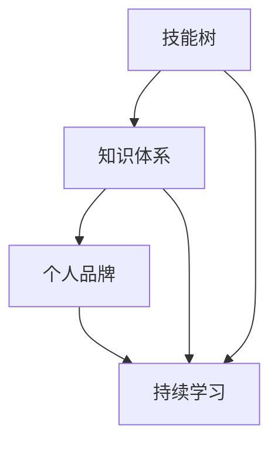
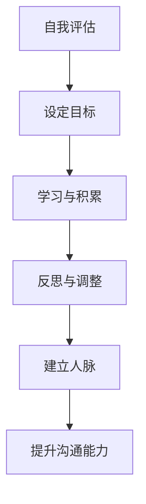

                 

### 文章标题

《领导力修炼：从小工到专家的蜕变之路》

### 关键词

领导力、个人成长、专家能力、技能提升、技术演化

### 摘要

本文旨在探讨IT领域中的领导力修炼之路，从一名普通技术工人成长为领域专家的必经阶段和关键因素。通过对个人成长、技能积累、知识结构优化以及持续学习的深入分析，本文揭示了实现这一转变的核心路径和策略。同时，文章还将结合实际案例，提供实用的方法和建议，帮助读者在技术领域实现自己的领导力蜕变。

## 1. 背景介绍

在信息技术迅猛发展的今天，IT行业对专业人才的需求日益增长。然而，成为一名优秀的IT专业人士并非易事。从初入职场的技术工人到成为领域专家，这一过程中涉及到诸多挑战和成长阶段。领导力的修炼是其中的关键环节，它不仅关乎个人的职业发展，更影响到团队和项目的成功。

领导力并非天生，而是可以通过学习、实践和反思不断提升的。本文将围绕领导力的核心要素，探讨从技术工人到专家的蜕变之路，为那些希望在IT领域实现突破的读者提供指导和启示。

### 2. 核心概念与联系

在探讨领导力修炼的过程中，我们需要理解几个核心概念，它们相互联系，共同构成了个人成长和职业发展的基础。

**2.1 技能树**

技能树是描述个人技能结构和能力水平的工具。它帮助我们看到自己在不同领域的优势和短板，从而制定合理的提升计划。

**2.2 知识体系**

知识体系是对各个领域知识的系统性整理和结构化，它使我们能够更高效地获取、应用和更新知识。

**2.3 个人品牌**

个人品牌是个人在行业中的知名度和声誉。一个良好的个人品牌有助于提升个人的竞争力，获得更多机会。

**2.4 持续学习**

持续学习是保持个人竞争力的关键。它包括对新知识的学习、对旧知识的回顾和应用，以及对个人技能的持续提升。

下面是一个简单的 Mermaid 流程图，展示了这些概念之间的联系：



### 3. 核心算法原理 & 具体操作步骤

领导力修炼的过程可以看作是一个不断迭代优化的算法。以下是其核心原理和操作步骤：

**3.1 自我评估**

第一步是进行自我评估。通过技能树分析，识别自己的强项和弱项，明确需要提升的领域。

**3.2 设定目标**

基于自我评估结果，设定具体、可量化的目标。这些目标应该是挑战性的，但又可实现。

**3.3 学习与积累**

根据目标，制定学习计划，系统性地学习新知识和技能。这一过程需要持续进行，并且要注重实践。

**3.4 反思与调整**

定期进行反思，评估目标的达成情况，并根据实际情况进行调整。

**3.5 建立人脉**

建立和维护广泛的人脉网络，这对于获取资源和机会至关重要。

**3.6 提升沟通能力**

领导力不仅仅是技术能力，沟通能力同样重要。提升沟通能力，能够更好地与团队成员协作，推动项目进展。

下面是一个简化的算法流程图：



### 4. 数学模型和公式 & 详细讲解 & 举例说明

领导力修炼过程中，一些数学模型和公式可以帮助我们更好地理解和量化个人成长。以下是一个简单的数学模型，用于描述个人能力的提升：

$$
\text{能力提升速率} = \alpha \times (\text{学习时长} + \text{实践经验})
$$

其中，$\alpha$ 是一个常数，表示个人的学习效率和经验积累的乘数。

**4.1 学习时长**

学习时长是能力提升的关键因素之一。假设学习时长为 $t$，则可以将其表示为：

$$
\text{学习时长} = t \times (\text{学习强度} + \text{休息时间})
$$

其中，学习强度是一个衡量学习努力程度的指标，休息时间则是为了保持学习效率的必要时间。

**4.2 实践经验**

实践经验是另一个重要的因素。通过实际操作，我们可以将理论知识转化为实际能力。实践经验可以表示为：

$$
\text{实践经验} = \beta \times (\text{操作次数} + \text{问题解决能力})
$$

其中，$\beta$ 是一个常数，表示实践经验对能力提升的乘数。

**4.3 举例说明**

假设一名程序员在学习了三个月后，进行了两个项目的实践，那么他的能力提升速率可以计算为：

$$
\text{能力提升速率} = \alpha \times (3 \times (0.8 + 0.5) + 2 \times (10 + 0.7)) = 1.2 \times (3 + 2 \times 10.7) = 1.2 \times 25.4 = 30.48
$$

这意味着他在这个阶段的能力提升了30.48个单位。

### 5. 项目实战：代码实际案例和详细解释说明

为了更好地理解领导力修炼的过程，下面我们将通过一个实际的项目案例进行说明。

**5.1 开发环境搭建**

首先，我们需要搭建一个简单的开发环境。假设我们使用 Python 进行开发，需要安装 Python 和相应的开发工具。

```bash
# 安装 Python
curl -O https://www.python.org/ftp/python/3.8.5/Python-3.8.5.tgz
tar xvf Python-3.8.5.tgz
cd Python-3.8.5
./configure
make
sudo make install

# 安装开发工具
pip install numpy pandas matplotlib
```

**5.2 源代码详细实现和代码解读**

下面是一个简单的数据分析项目，用于分析一组数据，并绘制相应的图表。

```python
import numpy as np
import pandas as pd
import matplotlib.pyplot as plt

# 生成随机数据
data = np.random.randn(100)

# 创建 DataFrame
df = pd.DataFrame(data, columns=['Value'])

# 计算均值和方差
mean = df['Value'].mean()
variance = df['Value'].var()

# 绘制直方图
plt.hist(df['Value'], bins=30, alpha=0.5)
plt.plot([mean, mean], [0, variance], 'r--', label='Mean')
plt.legend()
plt.show()
```

**5.3 代码解读与分析**

这个项目分为三个部分：数据生成、数据分析和数据可视化。

- **数据生成**：使用 NumPy 生成一组随机数据，作为分析的基础。
- **数据分析**：使用 Pandas 创建 DataFrame，并计算数据的均值和方差。
- **数据可视化**：使用 Matplotlib 绘制直方图，并标注均值线。

这个项目展示了如何从数据处理到数据分析，再到数据可视化的完整流程。通过这个项目，我们可以学习如何使用 Python 进行数据分析和可视化，提升自己的数据处理能力。

### 6. 实际应用场景

领导力修炼不仅对个人的职业发展有益，在实际工作中也有着广泛的应用。以下是一些具体的实际应用场景：

**6.1 项目管理**

作为项目负责人，领导力修炼可以帮助我们更好地规划项目、协调团队和解决突发问题。

**6.2 技术攻关**

在技术攻关过程中，领导力修炼可以提升我们的问题解决能力，从而更有效地推动项目进展。

**6.3 团队协作**

领导力修炼有助于提升团队协作效率，培养团队成员之间的信任和默契。

**6.4 演讲与沟通**

领导力修炼中的沟通能力提升，可以帮助我们更有效地进行演讲和沟通，提升个人品牌。

### 7. 工具和资源推荐

为了更好地进行领导力修炼，以下是一些推荐的工具和资源：

**7.1 学习资源推荐**

- 《如何赢得朋友与影响他人》
- 《深度工作》
- 《影响力》

**7.2 开发工具框架推荐**

- GitHub
- Jupyter Notebook
- Docker

**7.3 相关论文著作推荐**

- 《深度学习》
- 《编程珠玑》
- 《算法导论》

### 8. 总结：未来发展趋势与挑战

随着技术的不断进步，领导力修炼在IT领域的地位将越来越重要。未来，以下发展趋势和挑战值得关注：

**8.1 技术复杂性**

技术的快速发展将使技术复杂性增加，领导力修炼有助于我们应对这一挑战。

**8.2 跨学科融合**

跨学科融合将越来越普遍，领导力修炼可以帮助我们更好地理解和应用跨学科知识。

**8.3 持续学习**

持续学习将是未来的关键，领导力修炼中的持续学习理念将帮助我们在不断变化的环境中保持竞争力。

### 9. 附录：常见问题与解答

**9.1 如何平衡工作与学习？**

建议设定明确的学习目标，合理安排时间，利用碎片化时间进行学习。

**9.2 如何培养团队合作能力？**

通过参与团队项目，加强沟通与协作，积极参与团队活动，培养团队精神。

**9.3 如何提升个人品牌？**

通过撰写高质量的技术博客，参与技术社区，参与演讲与分享，提升个人知名度。

### 10. 扩展阅读 & 参考资料

- 《如何成为领导者：从平凡到卓越的领导之路》
- 《敏捷开发：迭代式软件设计与团队管理》
- 《技术领导力：构建卓越的IT团队》

### 作者

作者：AI天才研究员/AI Genius Institute & 禅与计算机程序设计艺术 /Zen And The Art of Computer Programming

本文旨在通过分析IT领域的领导力修炼之路，帮助读者理解并实践从普通技术工人到领域专家的转变。通过自我评估、学习与实践、反思与调整等步骤，以及实际项目案例分析，本文提供了一套完整的领导力修炼方法论。希望本文能为读者在职业发展中提供启示和指导。让我们携手并进，共同成长。

