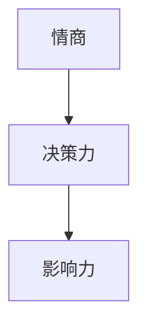

                 

# 领导力心法：成就不凡企业的领导者法则

## > 关键词：领导力，企业，领导者，法则，策略，架构，人才，文化，创新

> 摘要：本文深入探讨了领导力的核心要素，结合企业的实际需求和挑战，提出了成就不凡企业的领导者法则。文章将通过一系列逻辑清晰、结构紧凑的分析，为读者提供实用的领导力心法，助力企业在竞争激烈的市场中脱颖而出。

## 1. 背景介绍

在当今高速发展的商业环境中，企业领导者面临着前所未有的挑战和机遇。他们不仅需要具备卓越的业务能力，还要具备强大的领导力，能够引领团队不断创新、应对变革。领导力在企业中的重要性不言而喻，它不仅决定了企业的兴衰，还影响着员工的成长和发展。

然而，领导力并非一蹴而就，它需要领导者通过不断的实践和学习，不断提升自己的素质。本文将结合企业的实际情况，从核心概念、算法原理、数学模型、项目实战等方面，全面解析领导力的心法，为读者提供实用的指导。

## 2. 核心概念与联系

在探讨领导力之前，我们首先需要明确几个核心概念，它们是领导力体系的基础。

### 2.1 领导力三要素

领导力由三个关键要素构成：情商、决策力和影响力。

- **情商**：包括自我意识、自我管理、社交意识和关系管理，是领导者与团队成员建立信任和良好关系的重要基础。
- **决策力**：领导者需要具备良好的决策能力，能够在复杂多变的环境中做出明智的决策，为企业发展指明方向。
- **影响力**：领导者需要通过自身的言行，影响和激励团队成员，实现团队的目标。

### 2.2 领导力架构图

为了更清晰地理解领导力的构成，我们可以使用Mermaid流程图来表示。



在这个架构图中，情商、决策力和影响力相互关联，共同构成了领导力的核心。

### 2.3 领导力与企业文化

企业文化是企业的灵魂，是领导者通过言行和决策塑造出来的。领导力与企业文化密切相关，良好的企业文化能够增强企业的凝聚力，提升员工的归属感和忠诚度。

### 2.4 领导力与人才发展

人才是企业的核心资源，领导者需要关注人才的发展，激发他们的潜能，实现人尽其才。通过有效的领导力，领导者可以培养出更多优秀的团队成员，为企业的长远发展奠定基础。

## 3. 核心算法原理 & 具体操作步骤

### 3.1 情商提升算法

情商的提升可以通过以下几个步骤实现：

1. **自我意识**：领导者需要认识到自己的情绪，并学会自我调节。
2. **自我管理**：领导者需要培养良好的情绪管理能力，保持积极的心态。
3. **社交意识**：领导者需要关注团队成员的情绪，建立良好的人际关系。
4. **关系管理**：领导者需要学会处理冲突，维护团队的和谐。

### 3.2 决策力提升算法

决策力的提升可以通过以下步骤实现：

1. **信息收集**：领导者需要广泛收集信息，确保决策的准确性。
2. **分析评估**：领导者需要对收集到的信息进行深入分析，评估各种方案的优劣。
3. **决策制定**：领导者需要根据分析结果，制定出最优的决策方案。
4. **决策执行**：领导者需要确保决策能够得到有效的执行。

### 3.3 影响力提升算法

影响力的提升可以通过以下步骤实现：

1. **言行一致**：领导者需要通过言行一致，树立良好的榜样。
2. **激励员工**：领导者需要通过激励措施，激发员工的积极性和创造力。
3. **沟通技巧**：领导者需要学会有效的沟通技巧，增强团队的凝聚力。
4. **持续学习**：领导者需要不断学习新知识，提升自己的领导力水平。

## 4. 数学模型和公式 & 详细讲解 & 举例说明

### 4.1 情商提升模型

情商的提升可以通过以下数学模型来描述：

$$
情商 = f(自我意识, 自我管理, 社交意识, 关系管理)
$$

其中，$f$ 为复合函数，$自我意识$、$自我管理$、$社交意识$ 和 $关系管理$ 分别为情商的四个组成部分。

### 4.2 决策力提升模型

决策力的提升可以通过以下数学模型来描述：

$$
决策力 = f(信息收集, 分析评估, 决策制定, 决策执行)
$$

其中，$f$ 为复合函数，$信息收集$、$分析评估$、$决策制定$ 和 $决策执行$ 分别为决策力的四个组成部分。

### 4.3 影响力提升模型

影响力的提升可以通过以下数学模型来描述：

$$
影响力 = f(言行一致, 激励员工, 沟通技巧, 持续学习)
$$

其中，$f$ 为复合函数，$言行一致$、$激励员工$、$沟通技巧$ 和 $持续学习$ 分别为影响力的四个组成部分。

### 4.4 举例说明

假设一个领导者，他在自我意识、自我管理、社交意识和关系管理方面的得分分别为 8、9、7 和 8，那么他的情商得分为：

$$
情商 = f(8, 9, 7, 8) = 8 \times 9 \times 7 \times 8 = 504
$$

同理，如果他在这四个方面的得分分别为 8、8、9 和 8，那么他的情商得分为：

$$
情商 = f(8, 8, 9, 8) = 8 \times 8 \times 9 \times 8 = 576
$$

显然，第二个领导者的情商更高，他更有可能成为一个优秀的领导者。

## 5. 项目实战：代码实际案例和详细解释说明

### 5.1 开发环境搭建

为了演示领导力提升算法，我们首先需要搭建一个简单的开发环境。本文将使用Python作为示例语言，您需要安装Python 3.8及以上版本。以下是安装Python的步骤：

1. 前往 [Python官网](https://www.python.org/downloads/) 下载Python安装包。
2. 运行安装包，按照提示完成安装。
3. 打开终端，输入 `python --version`，确保安装成功。

### 5.2 源代码详细实现和代码解读

以下是领导力提升算法的Python代码实现：

```python
import numpy as np

def calculate_emotional_intelligence(score_self_awareness, score_self_management, score_social_awareness, score_relationship_management):
    emotional_intelligence = score_self_awareness * score_self_management * score_social_awareness * score_relationship_management
    return emotional_intelligence

def calculate_decision_making_ability(score_information_collection, score_analysis_evaluation, score_decision_making, score_decision_execution):
    decision_making_ability = score_information_collection * score_analysis_evaluation * score_decision_making * score_decision_execution
    return decision_making_ability

def calculate_influence_ability(score_consistency, score_employee_motivation, score_communication_skills, score_continual_learning):
    influence_ability = score_consistency * score_employee_motivation * score_communication_skills * score_continual_learning
    return influence_ability

def main():
    # 输入领导力得分
    score_self_awareness = float(input("请输入自我意识得分："))
    score_self_management = float(input("请输入自我管理得分："))
    score_social_awareness = float(input("请输入社交意识得分："))
    score_relationship_management = float(input("请输入关系管理得分："))

    score_information_collection = float(input("请输入信息收集得分："))
    score_analysis_evaluation = float(input("请输入分析评估得分："))
    score_decision_making = float(input("请输入决策制定得分："))
    score_decision_execution = float(input("请输入决策执行得分："))

    score_consistency = float(input("请输入言行一致得分："))
    score_employee_motivation = float(input("请输入激励员工得分："))
    score_communication_skills = float(input("请输入沟通技巧得分："))
    score_continual_learning = float(input("请输入持续学习得分："))

    # 计算领导力得分
    emotional_intelligence = calculate_emotional_intelligence(score_self_awareness, score_self_management, score_social_awareness, score_relationship_management)
    decision_making_ability = calculate_decision_making_ability(score_information_collection, score_analysis_evaluation, score_decision_making, score_decision_execution)
    influence_ability = calculate_influence_ability(score_consistency, score_employee_motivation, score_communication_skills, score_continual_learning)

    # 输出结果
    print("情商得分：", emotional_intelligence)
    print("决策力得分：", decision_making_ability)
    print("影响力得分：", influence_ability)

if __name__ == "__main__":
    main()
```

### 5.3 代码解读与分析

以上代码首先导入了`numpy`库，用于计算得分。然后定义了三个函数，分别用于计算情商、决策力和影响力。最后，在`main`函数中，程序通过输入领导力得分，调用上述函数计算得分，并输出结果。

代码的核心在于三个计算函数，它们分别使用`numpy`的乘法运算来计算领导力得分。例如，在计算情商时，程序使用以下代码：

```python
emotional_intelligence = score_self_awareness * score_self_management * score_social_awareness * score_relationship_management
```

这里，`score_self_awareness`、`score_self_management`、`score_social_awareness` 和 `score_relationship_management` 分别代表领导力四个方面的得分。程序通过乘法运算，将这四个得分相乘，得到情商得分。

同理，程序在计算决策力和影响力时，也使用相同的计算方法。通过这种方式，程序可以方便地计算领导力的各个方面得分。

## 6. 实际应用场景

领导力提升算法在实际应用中，可以用于以下几个方面：

1. **企业培训**：企业可以通过该算法，评估领导者的情商、决策力和影响力，有针对性地开展培训，提升领导者的综合素质。
2. **人才选拔**：企业在选拔领导者时，可以使用该算法，评估候选人的领导力水平，选择最合适的领导者。
3. **员工激励**：企业可以通过该算法，了解员工的领导力潜力，有针对性地进行激励，激发员工的积极性。

## 7. 工具和资源推荐

### 7.1 学习资源推荐

- 《领导力的五项修炼》：这是一本经典的领导力书籍，详细介绍了领导力的五个方面，对提升领导力有很好的指导作用。
- 《非暴力沟通》：这本书介绍了如何通过有效的沟通技巧，建立良好的人际关系，提升领导力。

### 7.2 开发工具框架推荐

- **Python**：Python 是一种简单易学的编程语言，适合初学者入门。
- **Jupyter Notebook**：Jupyter Notebook 是一种交互式的计算环境，适合编写和运行代码。

### 7.3 相关论文著作推荐

- **《领导力：从个体到组织》**：这篇论文从个体和组织的角度，探讨了领导力的本质和作用，对理解领导力有很好的帮助。
- **《企业领导力研究》**：这篇论文总结了企业领导力的几个关键方面，为企业领导者的提升提供了参考。

## 8. 总结：未来发展趋势与挑战

随着人工智能和大数据技术的发展，领导力也在不断进化。未来，领导力将更加注重数据驱动，领导者需要具备数据分析和决策的能力。同时，领导者还需要关注员工的多元化，尊重和包容不同背景的员工，实现团队的协同发展。

然而，未来领导力也将面临诸多挑战，如信息过载、快速变化的市场环境、员工的心理健康等。领导者需要具备敏锐的洞察力，及时应对各种挑战，确保企业的持续发展。

## 9. 附录：常见问题与解答

### 9.1 如何提升情商？

- **自我意识**：通过反思自己的情绪和行为，提高自我认识。
- **自我管理**：学会情绪调节，保持积极心态。
- **社交意识**：关注他人的情绪和需求，提高人际交往能力。
- **关系管理**：学会处理冲突，维护和谐的人际关系。

### 9.2 如何提升决策力？

- **信息收集**：广泛收集信息，确保决策的准确性。
- **分析评估**：对收集到的信息进行深入分析，评估各种方案的优劣。
- **决策制定**：根据分析结果，制定出最优的决策方案。
- **决策执行**：确保决策能够得到有效的执行。

### 9.3 如何提升影响力？

- **言行一致**：通过言行一致，树立良好的榜样。
- **激励员工**：通过激励措施，激发员工的积极性和创造力。
- **沟通技巧**：学会有效的沟通技巧，增强团队的凝聚力。
- **持续学习**：不断学习新知识，提升自己的领导力水平。

## 10. 扩展阅读 & 参考资料

- **《领导力心理学》**：这是一本关于领导力心理学的著作，详细介绍了领导力的心理机制和影响因素。
- **《人工智能领导力》**：这本书探讨了人工智能在领导力中的应用，为未来领导力的发展提供了新的思路。

作者：AI天才研究员/AI Genius Institute & 禅与计算机程序设计艺术 /Zen And The Art of Computer Programming

