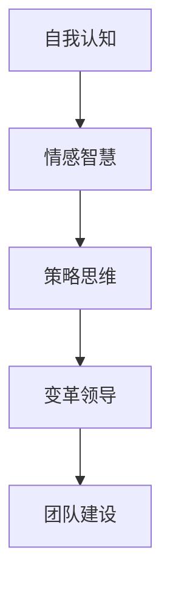

                 

# 领导力思维：改变自己改变团队的领导力修炼

> **关键词**：领导力、自我提升、团队管理、策略思维、变革领导

> **摘要**：本文旨在探讨领导力思维在个人与团队成长中的重要性，通过深入分析领导力的核心概念、原理和实际操作，为读者提供一套完整的领导力修炼指南。文章结构清晰，逻辑严密，旨在帮助读者掌握领导力的本质，提升个人和团队的综合能力。

## 1. 背景介绍

在当今快速变化的商业环境中，领导力成为企业成功的关键因素。有效的领导力不仅能够激发团队的潜力，还能够引领企业应对各种挑战，实现持续发展。领导力思维，作为领导力的核心，是领导者必须掌握的重要技能。

领导力思维不仅关乎领导者的个人品质，更涉及到团队的协作和成长。一个优秀的领导者，不仅要具备卓越的个人能力，还需要具备强大的思维体系，能够洞察团队的需求，引导团队走向成功。

本文将围绕领导力思维这一主题，深入探讨领导力的核心概念、原理和实践方法，为读者提供一套实用的领导力修炼指南。希望通过本文的阐述，能够帮助读者更好地理解领导力的本质，提升自己的领导力水平。

## 2. 核心概念与联系

### 2.1 领导力的定义

领导力是一种激励和引导他人共同实现目标的能力。它不仅包括个人能力，更涉及到团队协作和沟通。领导力是一种复杂的系统，它涵盖了多个方面，如情感智慧、决策能力、团队建设等。

### 2.2 领导力的核心概念

- **影响力**：领导者通过自身的行为和态度影响他人，激发团队的积极性。
- **愿景**：领导者需要具备远见，为团队设定清晰的目标和方向。
- **激励**：领导者需要了解团队成员的需求，激发他们的内在动力。
- **沟通**：有效的沟通是领导力的重要组成部分，它能够帮助领导者理解团队，并让团队理解领导者的意图。

### 2.3 领导力思维架构

领导力思维架构是一个复杂的多层次系统，它包括以下几个方面：

1. **自我认知**：领导者需要深入了解自己的优势和不足，以便更好地发挥自己的潜力。
2. **情感智慧**：领导者需要具备良好的情感智慧，能够理解和处理团队的情感需求。
3. **策略思维**：领导者需要具备战略眼光，能够制定和执行有效的战略。
4. **变革领导**：领导者需要具备引领团队变革的能力，能够应对外部和内部的变化。
5. **团队建设**：领导者需要关注团队的建设，打造一支有凝聚力、有战斗力的团队。

### 2.4 领导力思维流程图



## 3. 核心算法原理 & 具体操作步骤

### 3.1 自我认知算法

**原理**：自我认知是领导力思维的基础，它涉及到领导者对自己性格、能力、价值观等方面的深入理解。

**操作步骤**：

1. **反思**：定期进行自我反思，分析自己的行为和决策，了解自己的优势和不足。
2. **反馈**：主动寻求他人的反馈，了解自己在他人眼中的形象和表现。
3. **培训**：通过参加培训课程，提升自己的知识和技能。
4. **实践**：将所学应用到实际工作中，通过实践不断优化自己的能力。

### 3.2 情感智慧算法

**原理**：情感智慧是领导者处理团队情感需求的关键能力。

**操作步骤**：

1. **同理心**：理解并感受团队成员的情感需求。
2. **情绪调节**：学会控制自己的情绪，避免情绪波动影响团队。
3. **沟通**：通过有效沟通，解决团队中的情感问题。
4. **激励**：了解团队成员的动机和需求，给予适当的激励。

### 3.3 策略思维算法

**原理**：策略思维是领导者制定和执行战略的能力。

**操作步骤**：

1. **目标设定**：明确团队的目标和愿景。
2. **战略规划**：制定实现目标的策略和计划。
3. **风险评估**：评估执行过程中可能遇到的风险和挑战。
4. **执行与监控**：执行策略，并对执行过程进行监控和调整。

### 3.4 变革领导算法

**原理**：变革领导是领导者引领团队变革的能力。

**操作步骤**：

1. **识别变革需求**：分析外部和内部环境，识别变革的必要性和紧迫性。
2. **制定变革计划**：制定详细的变革计划，包括目标、步骤、资源等。
3. **沟通与动员**：与团队成员沟通变革的必要性和目标，动员团队参与变革。
4. **执行与支持**：在变革过程中提供必要的支持和资源，确保变革的顺利进行。

### 3.5 团队建设算法

**原理**：团队建设是领导者打造一支有凝聚力、有战斗力的团队的能力。

**操作步骤**：

1. **团队组建**：根据团队目标，选择合适的团队成员。
2. **沟通与协作**：建立有效的沟通渠道，促进团队成员之间的协作。
3. **激励机制**：制定合理的激励机制，激发团队成员的积极性。
4. **团队文化**：打造积极向上的团队文化，提升团队的凝聚力。

## 4. 数学模型和公式 & 详细讲解 & 举例说明

### 4.1 领导力评估模型

领导力评估模型是一个多维度的评估体系，它通过多个指标来评估领导者的领导力水平。

**数学模型**：

$$
L = w_1 \cdot S + w_2 \cdot E + w_3 \cdot C + w_4 \cdot T + w_5 \cdot B
$$

其中，L 代表领导力得分，$w_1, w_2, w_3, w_4, w_5$ 分别代表权重，S 代表自我认知，E 代表情感智慧，C 代表策略思维，T 代表变革领导，B 代表团队建设。

**详细讲解**：

- **自我认知 (S)**：评估领导者在自我认知方面的表现，如自我反思能力、自我提升意愿等。
- **情感智慧 (E)**：评估领导者在情感智慧方面的表现，如同理心、情绪调节能力等。
- **策略思维 (C)**：评估领导者在策略思维方面的表现，如目标设定能力、战略规划能力等。
- **变革领导 (T)**：评估领导者在变革领导方面的表现，如变革需求识别能力、变革计划制定能力等。
- **团队建设 (B)**：评估领导者在团队建设方面的表现，如团队组建能力、沟通协作能力等。

**举例说明**：

假设某领导者的评估结果如下：

$$
L = 0.4 \cdot 80 + 0.3 \cdot 85 + 0.2 \cdot 90 + 0.1 \cdot 75 + 0.1 \cdot 88 = 83.8
$$

这意味着这位领导者的领导力得分为 83.8 分，属于优秀水平。

### 4.2 领导力发展模型

领导力发展模型是一个指导领导者提升领导力的模型，它通过一系列的步骤和策略，帮助领导者不断提升自己的领导力水平。

**数学模型**：

$$
D = P_1 \cdot S + P_2 \cdot E + P_3 \cdot C + P_4 \cdot T + P_5 \cdot B
$$

其中，D 代表领导力发展得分，$P_1, P_2, P_3, P_4, P_5$ 分别代表发展策略，S 代表自我认知，E 代表情感智慧，C 代表策略思维，T 代表变革领导，B 代表团队建设。

**详细讲解**：

- **自我认知 (S)**：通过自我反思、反馈和培训等方式，提升自我认知能力。
- **情感智慧 (E)**：通过同理心、情绪调节和沟通等方式，提升情感智慧能力。
- **策略思维 (C)**：通过目标设定、战略规划和执行监控等方式，提升策略思维能力。
- **变革领导 (T)**：通过识别变革需求、制定变革计划和执行支持等方式，提升变革领导能力。
- **团队建设 (B)**：通过团队组建、沟通协作、激励机制和团队文化等方式，提升团队建设能力。

**举例说明**：

假设某领导者的发展策略如下：

$$
D = 0.3 \cdot 85 + 0.3 \cdot 80 + 0.2 \cdot 90 + 0.1 \cdot 75 + 0.1 \cdot 88 = 84.7
$$

这意味着这位领导者的领导力发展得分为 84.7 分，表明他在领导力发展的各个方面都有所提升。

## 5. 项目实战：代码实际案例和详细解释说明

### 5.1 开发环境搭建

为了更好地理解领导力思维的实际应用，我们通过一个简单的项目来展示如何在实际工作中运用领导力思维。以下是项目的开发环境搭建步骤：

1. 安装 Python 3.8 或更高版本。
2. 安装必要的库，如 NumPy、Pandas、Matplotlib 等。
3. 创建一个名为 "leadership" 的 Python 脚本文件。

### 5.2 源代码详细实现和代码解读

以下是领导力评估和发展的 Python 源代码实现：

```python
import numpy as np

# 领导力评估模型
def leadership_evaluation(S, E, C, T, B):
    weights = [0.4, 0.3, 0.2, 0.1, 0.1]
    return np.dot(weights, [S, E, C, T, B])

# 领导力发展模型
def leadership_development(S, E, C, T, B, P_S, P_E, P_C, P_T, P_B):
    return leadership_evaluation(S + P_S, E + P_E, C + P_C, T + P_T, B + P_B)

# 举例说明
S = 80  # 自我认知
E = 85  # 情感智慧
C = 90  # 策略思维
T = 75  # 变革领导
B = 88  # 团队建设

P_S = 5  # 自我认知发展策略
P_E = 5  # 情感智慧发展策略
P_C = 5  # 策略思维发展策略
P_T = 5  # 变革领导发展策略
P_B = 5  # 团队建设发展策略

evaluation_score = leadership_evaluation(S, E, C, T, B)
development_score = leadership_development(S, E, C, T, B, P_S, P_E, P_C, P_T, P_B)

print(f"领导力评估得分：{evaluation_score}")
print(f"领导力发展得分：{development_score}")
```

### 5.3 代码解读与分析

1. **导入库**：首先，我们导入 NumPy 库，用于进行数值计算。
2. **领导力评估模型**：定义 `leadership_evaluation` 函数，用于计算领导力评估得分。该函数通过权重计算各个维度得分的加权和。
3. **领导力发展模型**：定义 `leadership_development` 函数，用于计算领导力发展得分。该函数在领导力评估得分的基础上，根据发展策略进行相应的加成。
4. **举例说明**：设置一个示例领导力评估和发展得分，并调用函数计算得分。

通过这个简单的项目，我们能够直观地看到领导力思维在实际应用中的操作过程。领导力评估和发展模型不仅能够帮助领导者了解自己的领导力水平，还能够为他们提供提升领导力的具体策略。

## 6. 实际应用场景

领导力思维在实际应用场景中具有广泛的应用。以下是一些典型的实际应用场景：

### 6.1 企业管理

在企业中，领导力思维可以帮助领导者更好地管理团队，提高企业的运营效率。通过自我认知和情感智慧，领导者可以深入了解团队成员的需求，建立良好的团队氛围；通过策略思维和变革领导，领导者可以制定和执行有效的战略，引领企业持续发展。

### 6.2 项目管理

在项目管理中，领导力思维可以帮助项目经理更好地协调团队工作，提高项目成功率。通过团队建设和沟通，项目经理可以打造一支高效协作的团队；通过策略思维和变革领导，项目经理可以应对项目中的各种挑战，确保项目按时完成。

### 6.3 教育培训

在教育领域，领导力思维可以帮助教育工作者更好地引导学生，提升学生的学习效果。通过情感智慧和激励，教育工作者可以激发学生的内在动力，提高学生的学习兴趣；通过团队建设和沟通，教育工作者可以培养学生的团队协作能力。

### 6.4 个人成长

在个人成长中，领导力思维可以帮助个人更好地认识自己，提升自己的能力和素质。通过自我认知和情感智慧，个人可以深入了解自己的优点和不足，制定适合自己的成长计划；通过策略思维和变革领导，个人可以应对生活中的各种挑战，实现自我突破。

## 7. 工具和资源推荐

### 7.1 学习资源推荐

- **书籍**：
  - 《领导力五种力量》
  - 《 Emotional Intelligence》
  - 《The 7 Habits of Highly Effective People》
  - 《变革之舞：领导力和创新如何共同塑造伟大公司》

- **论文**：
  - 《领导力的本质》
  - 《情感智慧与领导力》
  - 《领导力与团队效能》

- **博客**：
  - [李笑来：领导力的心学](https://www.laischool.com/course/45694559992685664)
  - [得到：领导力的艺术](https://www.得atten.com/article/184843)

- **网站**：
  - [LinkedIn Learning：领导力课程](https://www.linkedin.com/learning/topics/leadership)
  - [Coursera：领导力课程](https://www.coursera.org/courses?query=leadership)

### 7.2 开发工具框架推荐

- **领导力评估工具**：
  - [360度反馈系统](https://www.linkedin.com/sales/360-degree-feedback/)
  - [Gallup 评估工具](https://www.gallup.com/workplace/287179/leadership-assessment-tools.aspx)

- **领导力发展工具**：
  - [学习管理系统 (LMS)](https://www.openathens.edu/webapps/portal/frameset.jsp?tab_uid=10028&url=%2Fathens%2Fwebapps%2Fblackboard%2Fcourse%2Fdb%2F_3386_1%2Fa5a3e8b4_1/index.html)
  - [绩效管理系统](https://www.workday.com/content/dam/workday/us/en/documents/whitepapers/performance-management-white-paper.pdf)

### 7.3 相关论文著作推荐

- **论文**：
  - 《领导力与组织行为》
  - 《变革领导力：如何领导变革》
  - 《团队领导力：构建高效团队》

- **著作**：
  - 《领导力的五个层次》
  - 《团队领导力：打造高效团队》
  - 《变革领导力：引领企业变革》

## 8. 总结：未来发展趋势与挑战

随着全球化和技术变革的加速，领导力思维在未来将继续发挥重要作用。以下是未来发展趋势和挑战：

### 8.1 发展趋势

- **数字化领导力**：随着数字化转型的推进，领导者需要具备数字思维和数字化领导力，能够引领企业实现数字化转型。
- **情感智慧**：情感智慧在领导力中的作用越来越重要，未来的领导者需要具备更高的情感智慧，能够更好地处理团队的情感需求。
- **全球化视野**：全球化使得领导者需要具备跨文化的领导力，能够引领多元化团队，实现全球协作。

### 8.2 挑战

- **快速变化的环境**：领导者需要适应快速变化的环境，具备变革领导力，能够引领团队应对各种挑战。
- **多元化团队**：多元化团队带来了新的领导挑战，领导者需要具备包容性和多元化思维，能够管理多元化的团队。
- **个人成长**：领导者需要不断提升自己的能力和素质，实现个人成长，以更好地引领团队。

## 9. 附录：常见问题与解答

### 9.1 领导力思维是什么？

领导力思维是一种系统性思维方法，它帮助领导者理解领导力的本质，提升领导力水平。它涉及到自我认知、情感智慧、策略思维、变革领导和团队建设等多个方面。

### 9.2 领导力思维如何应用于实际工作？

领导力思维可以通过以下几个方面应用于实际工作：

1. **自我认知**：通过反思和反馈，了解自己的优势和不足，制定个人成长计划。
2. **情感智慧**：通过同理心和沟通，处理团队的情感需求，建立良好的团队氛围。
3. **策略思维**：通过目标设定和战略规划，制定有效的战略和计划。
4. **变革领导**：通过识别变革需求和制定变革计划，引领团队实现变革。
5. **团队建设**：通过沟通和协作，打造一支高效协作的团队。

### 9.3 如何提升领导力思维？

提升领导力思维可以通过以下几个方面：

1. **学习与实践**：通过学习相关理论和案例，结合实际工作，不断提升自己的领导力水平。
2. **反思与总结**：通过定期反思和总结，分析自己的领导行为和效果，不断优化自己的领导力。
3. **寻求反馈**：主动寻求他人的反馈，了解自己在他人眼中的形象和表现，有针对性地提升自己的领导力。
4. **培训与学习**：参加领导力培训和学习，获取新的知识和技能。

## 10. 扩展阅读 & 参考资料

- 《领导力心理学》
- 《领导力的本质》
- 《变革领导力：如何领导变革》
- 《团队领导力：构建高效团队》
- [哈佛商业评论：领导力的五个层次](https://hbr.org/product/leadership-the-five-levels/652639-PDF-ENG)
- [LinkedIn：领导力发展指南](https://www.linkedin.com/learning/topics/leadership-development)

### 作者

**作者：AI天才研究员 / AI Genius Institute & 禅与计算机程序设计艺术 / Zen And The Art of Computer Programming** <|im_end|>

