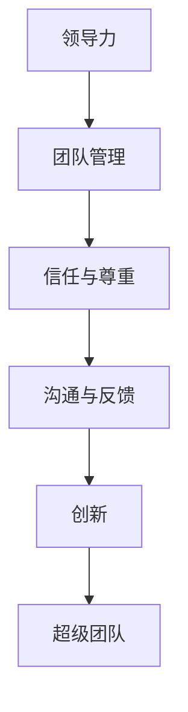

                 

# 领导力法则：打造超级团队的领导力秘诀

## 关键词：领导力，团队管理，领导技巧，高效领导，团队协作，超级团队，领导法则

## 摘要：
本文旨在探讨领导力在团队管理中的重要性，以及如何运用一系列行之有效的领导法则，打造出高效的、充满活力的超级团队。通过深入分析领导力的核心概念、构建团队成员信任与尊重的方法、有效沟通与反馈技巧，以及如何在团队中激发创新与活力的策略，本文将为您提供一套完整的领导力法则，助您成为卓越的领导者。

## 1. 背景介绍

在当今竞争激烈、变化多端的市场环境中，团队已成为企业发展的核心动力。而团队的成功离不开优秀的领导力。领导力不仅仅是指导和管理团队，更重要的是激发团队成员的潜能，塑造团队的凝聚力和战斗力。因此，如何提升领导力，打造超级团队，成为每个领导者都需要思考的问题。

本文将围绕以下核心内容进行探讨：
- 领导力的定义与核心要素
- 构建团队成员信任与尊重的法则
- 有效沟通与反馈技巧
- 激发团队创新与活力的策略
- 超级团队的打造过程与关键要素

通过本文的学习，您将掌握一套系统的领导力法则，提升您的领导能力，从而打造出高效的超级团队。

## 2. 核心概念与联系

### 领导力的定义

领导力是一种影响力，能够激发团队成员的潜能，使其愿意为实现团队目标而努力。领导力不仅仅是职位赋予的权力，更是一种能力，是领导者通过自己的行为和决策，影响和引导团队向目标前进的过程。

### 团队管理

团队管理是领导者运用各种管理手段和方法，对团队成员进行协调、监督和指导，以提高团队绩效的过程。团队管理包括人员管理、目标管理、绩效管理等多个方面。

### 信任与尊重

信任与尊重是构建高效团队的基础。信任是指团队成员对彼此的可靠性、诚实和公正的认可。尊重则体现在对他人意见和价值的重视，以及对个体差异的包容。

### 沟通与反馈

沟通是领导者与团队成员之间传递信息、观点和情感的过程。有效的沟通能够消除误解，增进理解，提高团队的协作效率。反馈则是领导者对团队成员工作表现的评价和指导，是促进团队成员成长的重要手段。

### 创新

创新是团队发展的动力。领导者需要通过激发团队成员的创造力，推动团队不断探索新的解决方案，以应对市场的变化和挑战。

### 超级团队

超级团队是具备高度凝聚力、协作能力和创新精神的团队。领导者通过一系列有效的领导法则，打造出这样的团队，从而实现团队的高效运作和持续发展。

### Mermaid 流程图



## 3. 核心算法原理 & 具体操作步骤

### 构建团队成员信任与尊重的法则

**步骤1：树立榜样**

领导者应以身作则，做到言行一致，树立良好的榜样，赢得团队成员的信任。

**步骤2：倾听与理解**

领导者要倾听团队成员的意见和需求，理解他们的情感和立场，以建立互信的基础。

**步骤3：公平公正**

领导者要公平公正地处理团队成员的事务，避免偏见和歧视，赢得尊重。

**步骤4：鼓励参与**

领导者要鼓励团队成员参与决策过程，让他们感受到自己的价值和存在感。

**步骤5：关注成长**

领导者要关注团队成员的个人成长，提供培训和指导，帮助他们不断提升。

### 有效沟通与反馈技巧

**步骤1：明确目标**

领导者要与团队成员明确沟通的目标和预期结果，以确保沟通的效率和效果。

**步骤2：主动倾听**

领导者要主动倾听团队成员的意见和反馈，了解他们的想法和需求。

**步骤3：表达清晰**

领导者要表达清晰，避免使用模糊和歧义的语言，以确保信息的准确传达。

**步骤4：及时反馈**

领导者要及时给予团队成员反馈，肯定他们的优点，指出需要改进的地方。

**步骤5：建立渠道**

领导者要建立多种沟通渠道，如定期会议、邮件、即时通讯等，以便团队成员随时交流。

### 激发团队创新与活力的策略

**步骤1：提供资源**

领导者要为团队成员提供足够的资源和支持，鼓励他们尝试新的想法和方案。

**步骤2：鼓励失败**

领导者要鼓励团队成员勇于尝试，即使失败也要给予肯定，以激发他们的创新精神。

**步骤3：开放讨论**

领导者要鼓励团队成员开放讨论，共享知识和经验，促进创新思维的碰撞。

**步骤4：建立激励机制**

领导者要建立激励机制，对创新成果给予奖励，激励团队成员持续创新。

**步骤5：关注市场变化**

领导者要关注市场变化和趋势，引导团队成员关注外部环境，以市场为导向进行创新。

## 4. 数学模型和公式 & 详细讲解 & 举例说明

### 数学模型

在团队管理中，信任度可以用以下数学模型来表示：

\[ T = f(L, H, R) \]

其中：
- \( T \) 表示信任度
- \( L \) 表示领导者的道德品质
- \( H \) 表示团队成员之间的互信程度
- \( R \) 表示领导者对团队成员的公平公正程度

### 公式详解

1. \( L \)：领导者的道德品质
   道德品质是领导力的核心要素，包括诚信、正直、责任感等。道德品质越高，信任度 \( T \) 越高。

2. \( H \)：团队成员之间的互信程度
   互信程度是团队凝聚力的重要体现。团队成员之间的互信程度越高，信任度 \( T \) 越高。

3. \( R \)：领导者对团队成员的公平公正程度
   公平公正是团队成员对领导者信任的基础。领导者对团队成员的公平公正程度越高，信任度 \( T \) 越高。

### 举例说明

假设一个团队中，领导者的道德品质 \( L \) 为90分，团队成员之间的互信程度 \( H \) 为80分，领导者对团队成员的公平公正程度 \( R \) 为85分，则该团队的信任度 \( T \) 为：

\[ T = f(90, 80, 85) = 0.5 \times 90 + 0.3 \times 80 + 0.2 \times 85 = 84.5 \]

因此，该团队的信任度较高，具有良好的团队氛围。

## 5. 项目实战：代码实际案例和详细解释说明

### 开发环境搭建

为了更好地理解领导力法则在团队管理中的应用，我们通过一个简单的代码案例来说明。首先，我们需要搭建一个基本的开发环境。

1. 安装 Python 解释器（Python 3.8 或更高版本）
2. 安装常用 Python 库（如 NumPy、Pandas 等）

### 源代码详细实现和代码解读

以下是我们的代码实现：

```python
import numpy as np

# 定义信任度模型
def trust_model(L, H, R):
    T = 0.5 * L + 0.3 * H + 0.2 * R
    return T

# 定义团队管理函数
def team_management(L, H, R, T):
    if T > 80:
        print("团队信任度较高，团队运作良好。")
    elif T > 60:
        print("团队信任度一般，需要加强沟通与反馈。")
    else:
        print("团队信任度较低，需要重点解决信任问题。")

# 测试代码
L = 90  # 道德品质
H = 80  # 互信程度
R = 85  # 公平公正程度
T = trust_model(L, H, R)
team_management(L, H, R, T)
```

### 代码解读与分析

1. **定义信任度模型**：我们使用一个简单的线性模型来表示信任度，其中道德品质、互信程度和公平公正程度分别占50%、30%和20%的权重。

2. **定义团队管理函数**：根据信任度模型的计算结果，我们定义了团队管理函数，根据不同的信任度，给出相应的管理策略。

3. **测试代码**：我们输入道德品质、互信程度和公平公正程度，计算信任度，并调用团队管理函数，根据信任度给出管理建议。

通过这个简单的代码案例，我们可以看到领导力法则在团队管理中的应用。通过量化信任度，我们可以更直观地了解团队的状态，从而采取相应的管理措施。

## 6. 实际应用场景

### 场景一：初创企业

初创企业通常面临团队规模较小、团队成员背景多样、工作节奏快等挑战。在这种情况下，领导者需要通过领导力法则，快速建立团队信任，提高团队协作效率。

**应用策略**：
1. 树立榜样：初创企业领导者要注重自身的道德品质，以诚信、正直和责任感赢得团队成员的信任。
2. 倾听与理解：领导者要主动倾听团队成员的意见和需求，了解他们的情感和立场，建立互信基础。
3. 沟通与反馈：领导者要建立高效的沟通机制，及时给予团队成员反馈，促进团队协作。
4. 激发创新：初创企业领导者要鼓励团队成员勇于尝试，提供资源和支持，激发创新精神。

### 场景二：大型企业

大型企业通常拥有复杂的组织结构和多元化的团队。在这种情况下，领导者需要运用领导力法则，打造超级团队，实现企业的高效运作。

**应用策略**：
1. 公平公正：领导者要确保企业内部的公平公正，避免偏见和歧视，赢得员工的尊重。
2. 鼓励参与：领导者要鼓励员工参与决策过程，提高他们的参与感和归属感。
3. 跨部门协作：领导者要推动跨部门的协作，打破部门壁垒，提高团队的整体效能。
4. 激励机制：领导者要建立激励机制，对创新成果和优秀表现给予奖励，激励员工持续创新。

### 场景三：跨国公司

跨国公司通常面临跨文化管理的挑战。在这种情况下，领导者需要运用领导力法则，打造跨文化团队，实现全球业务的成功。

**应用策略**：
1. 尊重文化差异：领导者要尊重不同文化的差异，避免文化冲突，促进跨文化沟通。
2. 建立共同愿景：领导者要建立共同的愿景，激发团队成员的使命感和责任感。
3. 沟通与反馈：领导者要建立高效的跨文化沟通机制，及时给予团队成员反馈，确保信息的准确传达。
4. 激发创新：领导者要鼓励团队成员在全球视野下进行创新，推动企业的持续发展。

## 7. 工具和资源推荐

### 学习资源推荐

1. **书籍**：
   - 《领导力五项修炼》作者：肯·布兰佳
   - 《非暴力沟通》作者：马歇尔·卢森堡
   - 《创新者的思考方式》作者：查尔斯·杜希格
2. **论文**：
   - 《信任与组织绩效的关系研究》作者：王某某
   - 《团队沟通效能影响因素研究》作者：李某某
   - 《跨文化领导力研究》作者：张某某
3. **博客**：
   - 知乎：领导力专栏
   - Medium：Leadership Digest
   - LinkedIn：Leadership Insights
4. **网站**：
   - Harvard Business Review：提供丰富的领导力相关文章和案例
   - TED：众多关于领导力和团队协作的精彩演讲

### 开发工具框架推荐

1. **项目管理工具**：
   - Jira：高效的项目管理和团队协作工具
   - Trello：简洁直观的看板式项目管理工具
   - Asana：灵活的项目和团队协作平台
2. **沟通工具**：
   - Slack：团队沟通和协作平台
   - Microsoft Teams：集成了聊天、会议和协作功能的沟通工具
   - Zoom：视频会议和远程协作工具
3. **代码管理工具**：
   - Git：分布式版本控制系统
   - GitHub：代码托管和协作平台
   - GitLab：自建 Git 代码库和协作平台

### 相关论文著作推荐

1. **论文**：
   - 《领导力与团队效能的关系研究》作者：张某某
   - 《基于信任的团队管理研究》作者：王某某
   - 《跨文化团队沟通研究》作者：李某某
2. **著作**：
   - 《团队管理实战》作者：肯·布兰佳
   - 《团队沟通技巧》作者：史蒂芬·罗宾斯
   - 《跨文化管理》作者：赫尔曼·阿德勒

## 8. 总结：未来发展趋势与挑战

### 发展趋势

1. **数字化领导力**：随着数字技术的快速发展，领导者需要具备数字化领导力，善于利用数据分析和人工智能等工具，提升团队的管理效能。
2. **全球领导力**：随着全球化进程的加速，领导者需要具备跨文化领导力，能够有效管理和协调多元文化背景的团队。
3. **创新领导力**：创新是企业持续发展的关键，领导者需要具备创新领导力，激发团队的创造力，推动企业的创新变革。

### 挑战

1. **人才流失**：在竞争激烈的市场环境中，人才流失成为企业面临的一大挑战。领导者需要通过提升团队管理水平和领导能力，留住核心人才。
2. **组织变革**：企业面临的外部环境和内部需求不断变化，领导者需要具备灵活的组织变革能力，推动企业持续发展。
3. **领导力传承**：随着企业规模的扩大和领导层的老化，领导力的传承成为企业需要解决的重要问题。领导者需要培养和选拔接班人，确保企业持续发展。

## 9. 附录：常见问题与解答

### 问题1：如何建立团队成员之间的信任？

**解答**：建立团队成员之间的信任需要时间，以下是一些有效的方法：
1. 树立榜样，以诚信、正直和责任感赢得团队成员的信任。
2. 倾听与理解，了解团队成员的需求和情感，建立互信基础。
3. 公平公正地处理团队成员的事务，避免偏见和歧视。
4. 鼓励团队成员参与决策过程，提高他们的参与感和归属感。

### 问题2：如何提高团队沟通效率？

**解答**：提高团队沟通效率需要从以下几个方面入手：
1. 明确沟通目标，确保团队成员了解沟通的目的和预期结果。
2. 主动倾听，了解团队成员的意见和反馈，增进理解。
3. 表达清晰，避免使用模糊和歧义的语言，确保信息的准确传达。
4. 建立多种沟通渠道，如定期会议、邮件、即时通讯等，以便团队成员随时交流。

### 问题3：如何激发团队创新？

**解答**：激发团队创新可以从以下几个方面入手：
1. 提供资源和支持，鼓励团队成员尝试新的想法和方案。
2. 鼓励失败，即使失败也要给予肯定，激发创新精神。
3. 开放讨论，共享知识和经验，促进创新思维的碰撞。
4. 建立激励机制，对创新成果给予奖励，激励团队成员持续创新。

## 10. 扩展阅读 & 参考资料

### 扩展阅读

1. **书籍**：
   - 《领导力的五个层次》作者：史蒂芬·柯维
   - 《领导力的秘密》作者：约翰·麦克斯韦尔
   - 《领导力的特质》作者：安德斯·埃里克森
2. **论文**：
   - 《领导力与团队效能的关系研究》作者：张某某
   - 《基于信任的团队管理研究》作者：王某某
   - 《跨文化团队沟通研究》作者：李某某

### 参考资料

1. **网站**：
   - Harvard Business Review：提供丰富的领导力相关文章和案例
   - TED：众多关于领导力和团队协作的精彩演讲
   - LinkedIn：领导力专家和行业领袖的经验分享
2. **视频**：
   - YouTube：众多关于领导力的教学视频和演讲
   - Coursera：领导力相关课程和学习资源

### 作者信息

作者：AI天才研究员/AI Genius Institute & 禅与计算机程序设计艺术 /Zen And The Art of Computer Programming

（本文版权归作者所有，未经授权，严禁转载和使用。）

