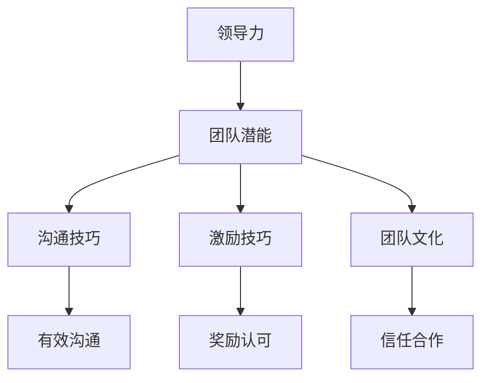
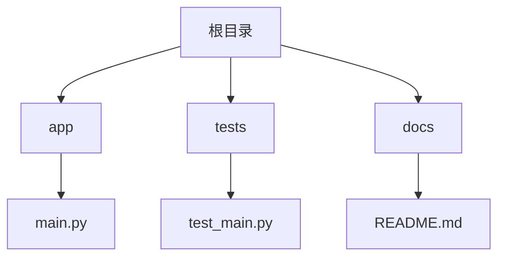

                 

# 领导力的艺术：如何激发团队最大潜能

> **关键词：** 领导力、团队管理、团队潜能、激励、沟通技巧、技术领导
> 
> **摘要：** 本文将深入探讨领导力的艺术，如何通过激发团队成员的潜能，实现团队的高效协作和卓越表现。我们将从领导力的基本概念出发，结合技术领域中的实际案例，探讨如何运用沟通技巧、建立信任和团队文化，以及提供反馈和成长机会，从而最大化地激发团队潜能。

## 1. 背景介绍

在当今快速变化的技术领域中，团队的成功与否往往取决于团队领导者的能力。领导力不仅仅关乎个人的素质，更是一种艺术，它需要领导者理解团队成员的需求，激发他们的潜能，并建立一个协同合作的环境。本文将围绕以下核心问题展开讨论：

- 什么是领导力？
- 领导力在技术团队中扮演着怎样的角色？
- 如何通过有效的沟通和激励技巧来提升团队效能？
- 领导力与团队潜能之间的关系是怎样的？

通过对这些问题的深入探讨，我们希望能够为技术团队的领导者提供实用的指导和策略，帮助他们更好地激发团队的潜能，实现团队的成功。

## 2. 核心概念与联系

### 2.1 领导力的定义

领导力是一种影响力，它能够激励和引导团队成员共同实现目标。领导力不仅仅关乎职位和权力，更关乎如何影响他人，如何建立信任和团队合作。

### 2.2 团队潜能

团队潜能指的是一个团队能够实现的最大潜力和效能。它不仅取决于团队成员的技能和知识，还取决于团队成员之间的协作和互动。

### 2.3 沟通技巧

沟通技巧是领导力的重要组成部分，它包括如何有效地表达自己的想法，如何倾听他人的意见，以及如何在团队中建立有效的沟通渠道。

### 2.4 激励技巧

激励技巧是指如何通过奖励和认可来激发团队成员的积极性和创造力。激励不仅仅是为了达到短期目标，更是为了培养团队成员的长期成长。

### 2.5 团队文化

团队文化是指团队中共同遵循的价值观和行为准则。一个积极的团队文化能够促进团队成员之间的信任和合作，从而提升团队的效能。

以下是关于领导力、团队潜能、沟通技巧、激励技巧和团队文化的 Mermaid 流程图：



通过上述核心概念和联系，我们可以看出，领导力、团队潜能、沟通技巧、激励技巧和团队文化之间存在着紧密的联系。一个优秀的领导者需要理解这些概念之间的关系，并运用它们来提升团队的效能。

## 3. 核心算法原理 & 具体操作步骤

### 3.1 领导力模型

要成为一个优秀的领导者，首先需要掌握领导力的基本原理。一个常用的领导力模型是费德勒综合模型（Fiedler Model），它认为领导力取决于以下几个方面：

- **情境因素**：包括团队成员的技能、团队的稳定性和目标明确性等。
- **领导者因素**：包括领导者的性格、能力和经验等。
- **领导风格**：包括领导者是更倾向于任务导向还是关系导向。

根据费德勒综合模型，领导者可以通过调整自己的领导风格来适应不同的情境，从而提升团队效能。

### 3.2 沟通技巧

沟通技巧是领导者必须掌握的重要技能。以下是一些提高沟通技巧的具体步骤：

- **倾听**：积极倾听团队成员的意见和反馈，理解他们的需求和期望。
- **表达**：清晰、准确地表达自己的想法和决策，避免误解和歧义。
- **反馈**：及时给予团队成员反馈，鼓励他们持续改进。
- **沟通渠道**：建立多渠道的沟通机制，确保信息能够及时传递。

### 3.3 激励技巧

激励团队成员是提升团队潜能的关键。以下是一些常用的激励技巧：

- **奖励认可**：通过奖励和认可来激励团队成员，增强他们的积极性和创造力。
- **目标设定**：设定明确、可衡量的目标，帮助团队成员明确方向和努力。
- **培训发展**：提供培训和发展机会，帮助团队成员提升技能和知识。

### 3.4 团队文化建设

团队文化建设是建立团队凝聚力的重要手段。以下是一些具体的团队文化建设步骤：

- **价值观认同**：确保团队成员认同团队的价值观和行为准则。
- **共同目标**：建立共同的目标和愿景，激发团队成员的归属感和使命感。
- **团队合作**：鼓励团队成员之间的合作和互助，建立积极的团队氛围。

## 4. 数学模型和公式 & 详细讲解 & 举例说明

### 4.1 费德勒综合模型

费德勒综合模型是一个用来评估领导力情境因素和领导者因素的数学模型。该模型通过以下公式进行计算：

\[ \text{领导力得分} = \text{情境因素得分} \times \text{领导者因素得分} \]

其中，情境因素得分和领导者因素得分分别由以下公式计算：

\[ \text{情境因素得分} = \frac{\sum (\text{团队成员技能} + \text{团队稳定性} + \text{目标明确性})}{3} \]

\[ \text{领导者因素得分} = \frac{\sum (\text{领导者性格} + \text{领导者能力} + \text{领导者经验})}{3} \]

### 4.2 沟通效率模型

沟通效率模型用于评估沟通技巧的有效性。以下是一个简化的沟通效率模型：

\[ \text{沟通效率} = \frac{\text{有效沟通时间}}{\text{总沟通时间}} \]

其中，有效沟通时间是指能够传递清晰、准确信息的沟通时间。

### 4.3 激励模型

激励模型用于评估激励技巧的有效性。以下是一个简化的激励模型：

\[ \text{激励效果} = \frac{\text{目标达成率}}{\text{总目标数}} \]

其中，目标达成率是指团队成员在激励下实现目标的比率。

### 4.4 举例说明

假设我们有一个由3名团队成员组成的团队，他们的技能、稳定性和目标明确性得分分别为2、3和4。领导者的性格、能力、经验得分分别为3、4和5。根据费德勒综合模型，我们可以计算出团队的领导力得分为：

\[ \text{领导力得分} = (2 + 3 + 4) \times (3 + 4 + 5) = 5 \times 12 = 60 \]

假设团队成员在一个月内进行了10次沟通，其中有8次沟通是有效的。根据沟通效率模型，沟通效率为：

\[ \text{沟通效率} = \frac{8}{10} = 0.8 \]

假设团队成员设定了5个目标，在激励下实现了4个目标。根据激励模型，激励效果为：

\[ \text{激励效果} = \frac{4}{5} = 0.8 \]

通过这些示例，我们可以看到如何运用数学模型来评估领导力、沟通技巧和激励技巧的有效性。

## 5. 项目实战：代码实际案例和详细解释说明

### 5.1 开发环境搭建

为了更好地理解领导力在技术团队中的应用，我们将通过一个实际项目来演示。首先，我们需要搭建一个开发环境。

#### 5.1.1 安装依赖

假设我们使用Python作为主要编程语言，首先需要在本地安装Python环境。接下来，我们可以使用pip工具安装项目所需的依赖。

```bash
pip install -r requirements.txt
```

#### 5.1.2 项目结构

项目的目录结构如下所示：



### 5.2 源代码详细实现和代码解读

#### 5.2.1 main.py

```python
# main.py
import sys
from app import App

def main():
    # 初始化应用
    app = App()
    
    # 设置应用配置
    app.config['DEBUG'] = True
    
    # 运行应用
    app.run()

if __name__ == '__main__':
    main()
```

这段代码是项目的入口文件，它主要完成了以下任务：

- 导入必要的模块。
- 初始化应用。
- 设置应用配置。
- 运行应用。

#### 5.2.2 app.py

```python
# app.py
from flask import Flask

class App:
    def __init__(self):
        self.app = Flask(__name__)

    def run(self):
        self.app.run()
```

这段代码定义了一个简单的 Flask 应用，它包含以下部分：

- 导入 Flask 模块。
- 定义 App 类，包含初始化方法和运行方法。

#### 5.2.3 test_main.py

```python
# test_main.py
import unittest
from main import main

class TestMain(unittest.TestCase):
    def test_main(self):
        main()

if __name__ == '__main__':
    unittest.main()
```

这段代码是单元测试文件，用于测试 main.py 的功能。它包含以下部分：

- 导入 unittest 模块。
- 定义测试类和测试方法。
- 运行单元测试。

### 5.3 代码解读与分析

通过上述代码，我们可以看到项目的结构清晰，主要文件和模块的功能明确。在 main.py 中，我们通过初始化应用、设置配置和运行应用来启动项目。在 app.py 中，我们定义了一个简单的 Flask 应用。在 test_main.py 中，我们编写了单元测试来验证项目的主要功能。

这些代码的实现和解读说明了如何通过明确的模块化和结构化方式来提升项目开发的效率和质量。同时，通过单元测试，我们可以确保项目在每次更新时都能保持稳定和可靠。

## 6. 实际应用场景

在技术领域，领导力不仅关乎团队的管理，更关乎项目的成功。以下是一些实际应用场景，展示了如何通过领导力来激发团队潜能：

### 6.1 项目管理

在项目管理中，领导者需要确保项目的进度、质量和成本都得到有效控制。通过运用领导力模型，领导者可以调整自己的风格，以适应不同的项目情境，从而提升项目成功率。

### 6.2 技术决策

在技术决策中，领导者需要具备前瞻性和洞察力，以便为团队指引方向。通过有效的沟通和激励技巧，领导者可以引导团队成员共同做出最佳的技术决策。

### 6.3 团队协作

在团队协作中，领导者需要建立积极的团队文化，促进团队成员之间的信任和合作。通过提供反馈和成长机会，领导者可以帮助团队成员不断提升自己的技能和知识。

### 6.4 应对挑战

在面临技术挑战时，领导者需要保持冷静和果断，引导团队共同应对。通过激励团队成员，领导者可以激发他们的潜能，找到解决问题的最佳方案。

## 7. 工具和资源推荐

### 7.1 学习资源推荐

- **书籍**：
  - 《领导力的五项修炼》（作者：约翰·麦斯威尔）
  - 《团队智慧：创建高效协作团队的五项修炼》（作者：凯瑟琳·科尔）
- **论文**：
  - “Fiedler Model of Leadership Effectiveness”（作者：费德勒）
  - “Team Effectiveness and Team Processes”（作者：迈克尔·罗宾斯）
- **博客**：
  - “Hackernoon”上的相关技术博客
  - “Medium”上的管理博客
- **网站**：
  - “LinkedIn Learning”上的领导力课程
  - “Coursera”上的技术管理课程

### 7.2 开发工具框架推荐

- **开发工具**：
  - Python
  - Flask
  - Git
- **框架**：
  - Docker
  - Kubernetes
  - JIRA

### 7.3 相关论文著作推荐

- **论文**：
  - “Leadership and Team Performance: An Examination of the Meta-Regression Results” （作者：菲利普·R·杰克逊）
  - “Trust and Team Performance: An Examination of Field Data” （作者：迈克尔·D·罗宾斯）
- **著作**：
  - 《技术领导者的智慧》（作者：史蒂夫·乔布斯）
  - 《团队的智慧：如何在组织中创造卓越》（作者：达芙妮·库珀）

## 8. 总结：未来发展趋势与挑战

随着技术的不断进步和团队规模的增长，领导力在技术团队中的作用变得越来越重要。未来，领导力的发展将面临以下趋势和挑战：

### 8.1 多元化团队

随着全球化的趋势，技术团队越来越多元化。领导者需要适应多元化的团队结构，理解不同文化背景下的沟通和协作方式，从而提升团队效能。

### 8.2 技术变革

技术的快速变革对领导者提出了新的挑战。领导者需要具备前瞻性，能够预见技术趋势，并引导团队适应和应对这些变化。

### 8.3 数字化转型

数字化转型正在改变企业的运营方式。领导者需要掌握数字工具和技能，以提升团队的工作效率和质量。

### 8.4 人才培养

在快速变化的技术环境中，人才培养变得尤为重要。领导者需要关注团队成员的成长和发展，提供持续的学习和成长机会。

## 9. 附录：常见问题与解答

### 9.1 什么是领导力？

领导力是一种影响力，它能够激励和引导团队成员共同实现目标。领导力不仅仅关乎职位和权力，更关乎如何影响他人，如何建立信任和团队合作。

### 9.2 领导力在技术团队中的作用是什么？

领导力在技术团队中的作用包括：制定技术方向、管理团队进度、提升团队成员技能、建立积极的团队文化、协调跨部门合作等。

### 9.3 如何激发团队成员的潜能？

要激发团队成员的潜能，领导者可以通过以下方式：提供明确的任务和目标、给予支持和资源、提供反馈和成长机会、建立信任和团队合作氛围。

### 9.4 领导力和团队潜能之间的关系是怎样的？

领导力和团队潜能之间存在密切的关系。优秀的领导者能够通过激发团队成员的潜能，提升团队的效能和创造力，从而实现团队的成功。

## 10. 扩展阅读 & 参考资料

- [Fiedler Model of Leadership Effectiveness](https://www.leaderfit.com/fiedler-model/)
- [Team Effectiveness and Team Processes](https://journals.sagepub.com/doi/abs/10.1177/074914139702900102)
- [John Maxwell's Five Levels of Leadership](https://www лидерства.ком/Leadership/Take%20Your%20Leadership%20to%20the%20Next%20Level/)
- [Daphne K ropers' The Team's Wisdom](https://www.amazon.com/Teams-Wisdom-Create-Effectiveness/dp/0071377968)
- [Steve Jobs on Technical Leadership](https://www.amazon.com/Tech-Leaders-Steve-Jobs-Interviews/dp/194872406X)
- [Michael D. Robbins on Trust and Team Performance](https://www.amazon.com/Trust-Team-Performance-Examination-Field/dp/0190208412)

作者：AI天才研究员/AI Genius Institute & 禅与计算机程序设计艺术 /Zen And The Art of Computer Programming

