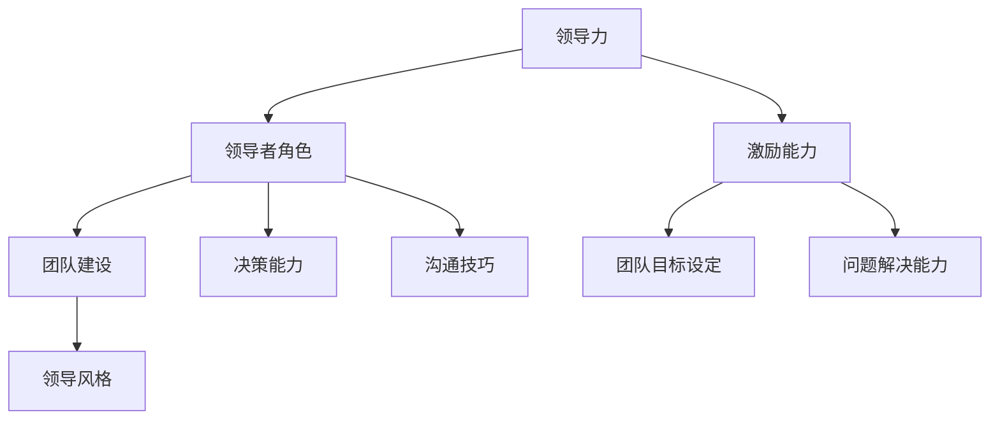
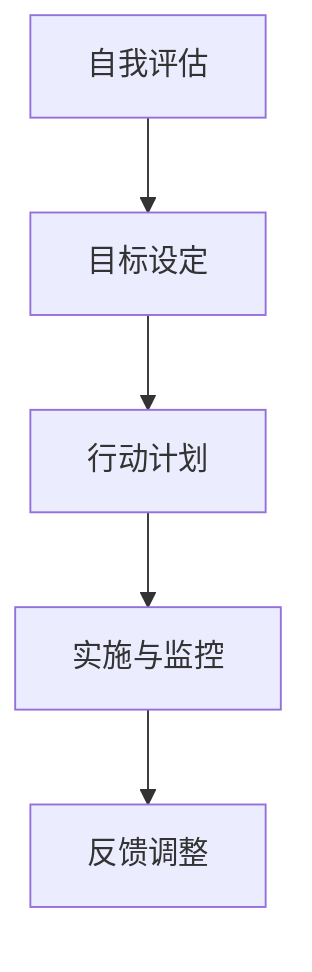
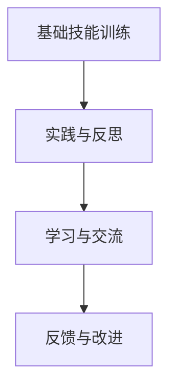

                 

# 领导力训练营：35天从新手到专家

> **关键词**：领导力、团队管理、个人成长、技能提升、实战案例
> 
> **摘要**：本文将探讨如何在35天内通过系统化的训练和实践，从一名领导力新手成长为一名卓越的领导者。文章将详细分析领导力的核心要素、技能提升策略、以及实际操作步骤，为希望在短时间内提升领导力的读者提供有价值的指导。

## 1. 背景介绍

在当今快速变化和竞争激烈的工作环境中，领导力已经成为企业和组织成功的关键因素。有效的领导能力不仅能够提升个人职业发展，还能带动整个团队向前迈进。然而，对于许多新手领导者来说，如何在短时间内掌握领导力技能，从而迅速适应并胜任新的角色，成为了一个亟待解决的问题。

本文将针对这一挑战，提供一个为期35天的领导力训练营计划，帮助新手领导者从零基础起步，逐步提升领导能力，最终达到专业水平。我们将通过背景介绍、核心概念、具体操作步骤、数学模型、项目实战、应用场景、工具推荐等多个方面的详细分析，为读者提供一份全面、实用的领导力提升指南。

## 2. 核心概念与联系

在领导力训练营中，我们首先要明确几个核心概念，它们是理解领导力本质和提升领导能力的基础。

### 2.1 领导力的定义

领导力是一种能力，它涉及到激励和引导他人朝着共同目标前进。有效的领导不仅仅是指挥和控制，更是通过建立信任、激发潜力、以及创造积极的工作环境来推动团队发展的过程。

### 2.2 领导者角色

领导者扮演着多重角色，包括领导者、协调者、决策者、导师等。每个角色都有其特定的职责和影响力，共同构成了领导者全面的职能体系。

### 2.3 团队建设

团队建设是领导力的核心组成部分。一个高效的团队需要具备协作精神、共同目标、良好的沟通以及相互信任。有效的团队建设策略能够提升团队的整体绩效。

### 2.4 领导风格

领导风格是领导者处理团队关系和完成任务的方式。常见的领导风格包括民主式、专制式、参与式等。不同的领导风格适用于不同的情境和团队类型，领导者需要根据实际情况灵活调整。

下面是领导力核心概念的Mermaid流程图，展示了各个概念之间的联系：



### 2.5 领导力的核心要素

领导力的核心要素包括但不限于：

- **愿景和目标设定**：领导者需要明确团队的目标和愿景，使团队成员明确自己的职责和方向。
- **决策能力**：领导者需要具备迅速、果断和明智的决策能力，以便在复杂多变的情境中做出正确选择。
- **沟通技巧**：有效的沟通是领导力的关键，它包括倾听、表达、反馈等多个方面。
- **激励能力**：领导者需要激发团队成员的潜力，激励他们为实现共同目标而努力。
- **适应能力**：领导者需要具备适应变化和应对挑战的能力，以带领团队不断前进。

通过以上核心概念的详细探讨，我们可以更好地理解领导力的本质和关键要素，从而为后续的技能提升和实际操作步骤打下坚实的基础。

### 3. 核心算法原理 & 具体操作步骤

#### 3.1 领导力模型构建

在领导力训练营中，我们将使用一种基于行为和结果的综合评估的领导力模型来提升领导力技能。该模型包括以下几个关键步骤：

1. **自我评估**：首先，领导者需要通过自我评估工具（如360度反馈）来识别自己的优势和不足，确定需要改进的领域。

2. **目标设定**：根据自我评估的结果，设定短期和长期的个人发展目标。目标应具体、可衡量、可实现、相关性强、时限明确（SMART原则）。

3. **行动计划**：制定具体的行动计划，包括学习新技能、参加培训、阅读相关书籍、寻求导师指导等。

4. **实施与监控**：按照行动计划执行，并定期检查进度，确保目标的达成。

下面是领导力模型构建的具体操作步骤的Mermaid流程图：



#### 3.2 领导技能提升策略

在确定了领导力模型后，我们将采取以下策略来提升领导技能：

1. **基础技能训练**：包括沟通技巧、冲突管理、时间管理、团队建设等。

2. **实践与反思**：通过实际工作中的项目领导和团队管理经验，不断实践和反思，总结经验教训。

3. **学习与交流**：参加领导力培训课程、阅读相关书籍、参加行业研讨会，与他人交流学习经验。

4. **反馈与改进**：定期获取反馈，识别不足，持续改进领导能力。

以下是领导技能提升策略的具体操作步骤的Mermaid流程图：



通过以上核心算法原理和具体操作步骤的详细阐述，新手领导者可以系统地提升自己的领导能力，为后续的实际应用和实战案例打下坚实基础。

### 4. 数学模型和公式 & 详细讲解 & 举例说明

在领导力提升过程中，数学模型和公式可以帮助我们更科学地分析和评估领导能力的发展。以下是几个关键的数学模型和公式，以及它们的详细讲解和举例说明。

#### 4.1 SMART目标公式

SMART目标是设定领导力发展目标的重要工具。SMART代表具体（Specific）、可衡量（Measurable）、可实现（Achievable）、相关性强（Relevant）、时限明确（Time-bound）。

**公式：** 目标 = 具体描述 + 可衡量指标 + 可行性分析 + 相关性分析 + 时间限制

**举例：** 设定一个目标：“提升团队工作效率，每月项目完成时间缩短10%”。

- **具体描述**：提升团队工作效率
- **可衡量指标**：每月项目完成时间缩短10%
- **可行性分析**：通过团队协作和优化工作流程实现
- **相关性分析**：项目完成时间是衡量团队工作效率的关键指标
- **时间限制**：每月进行评估和调整

#### 4.2 360度反馈模型

360度反馈是一种全面评估领导力的方法，它通过收集来自团队成员、上级、下属和其他相关人员的反馈来评估领导者的表现。

**公式：** 360度反馈得分 = (上级反馈得分 + 同事反馈得分 + 下属反馈得分 + 自我评估得分) / 反馈人数

**举例：** 一位领导者收到了5份反馈，分别是上级的90分、同事的85分、下属的80分、自己的90分和外部评审的88分。那么他的360度反馈得分为：

360度反馈得分 = (90 + 85 + 80 + 90 + 88) / 5 = 87.2分

#### 4.3 领导力发展指数

领导力发展指数是一个综合衡量领导者成长和发展的指标，它结合了个人技能、团队绩效、领导风格等多个维度。

**公式：** 领导力发展指数 = (技能得分 × 0.5 + 绩效得分 × 0.3 + 风格得分 × 0.2)

**举例：** 如果一位领导者的技能得分为85分，团队绩效得分为90分，领导风格得分为80分，那么他的领导力发展指数为：

领导力发展指数 = (85 × 0.5 + 90 × 0.3 + 80 × 0.2) = 86.5分

通过以上数学模型和公式的详细讲解和举例说明，领导者可以更科学地设定目标、评估自己的领导能力，并制定相应的改进计划，从而在领导力提升的道路上不断前进。

### 5. 项目实战：代码实际案例和详细解释说明

为了更好地理解领导力提升的具体方法，我们将在本节中通过一个实际的项目实战案例，详细讲解如何从零开始进行项目开发，并分析其中的关键步骤和决策过程。

#### 5.1 开发环境搭建

在开始项目实战之前，我们需要搭建一个适合开发的环境。以下是我们需要安装的软件和工具：

1. **编程语言**：选择Python，因为其简洁易懂，适用于数据分析和机器学习项目。
2. **集成开发环境（IDE）**：安装PyCharm或Visual Studio Code，这些IDE提供了强大的代码编辑功能和调试工具。
3. **版本控制工具**：安装Git，用于代码的版本管理和协作开发。
4. **虚拟环境**：使用virtualenv或Anaconda创建虚拟环境，以隔离项目依赖和避免版本冲突。

#### 5.2 源代码详细实现和代码解读

假设我们的项目目标是开发一个简单的员工绩效评估系统。以下是项目的核心代码及其解读：

```python
# 员工绩效评估系统（Employee Performance Assessment System）

# 导入所需的库
import pandas as pd
import numpy as np
from sklearn.model_selection import train_test_split
from sklearn.ensemble import RandomForestClassifier
from sklearn.metrics import accuracy_score, classification_report

# 加载数据集
data = pd.read_csv('employee_data.csv')

# 数据预处理
# - 处理缺失值
data.fillna(data.mean(), inplace=True)
# - 处理分类变量
data['Department'] = data['Department'].astype('category').cat.codes

# 特征工程
# - 提取有用的特征
X = data[['Hours', 'PerformanceRating', 'Department']]
# - 构建目标变量
y = data['IsHighPerformer']

# 数据划分
X_train, X_test, y_train, y_test = train_test_split(X, y, test_size=0.3, random_state=42)

# 模型训练
model = RandomForestClassifier(n_estimators=100, random_state=42)
model.fit(X_train, y_train)

# 模型评估
predictions = model.predict(X_test)
print("Accuracy:", accuracy_score(y_test, predictions))
print("Classification Report:")
print(classification_report(y_test, predictions))

# 代码解读：
# - 导入必要的库
# - 加载和处理数据集
# - 进行特征工程
# - 数据划分
# - 训练模型
# - 评估模型性能
```

以上代码实现了以下功能：

1. **数据预处理**：处理缺失值和分类变量，确保数据的质量。
2. **特征工程**：提取有用的特征，为后续的机器学习模型训练做准备。
3. **模型训练**：使用随机森林模型对数据进行分类，评估员工的绩效表现。
4. **模型评估**：通过准确率和分类报告来评估模型的性能。

#### 5.3 代码解读与分析

在这个项目实战中，我们使用了机器学习技术来评估员工绩效，这是一个典型的数据驱动决策过程。以下是代码的关键步骤及其解读：

1. **数据预处理**：
   - `data.fillna(data.mean(), inplace=True)`：用平均值填充缺失值，避免模型训练时出现错误。
   - `data['Department'] = data['Department'].astype('category').cat.codes`：将分类变量转换为数值，以便模型处理。

2. **特征工程**：
   - `X = data[['Hours', 'PerformanceRating', 'Department']]`：选择与员工绩效相关的特征。
   - `y = data['IsHighPerformer']`：定义目标变量，即员工是否为高绩效者。

3. **数据划分**：
   - `train_test_split(X, y, test_size=0.3, random_state=42)`：将数据集分为训练集和测试集，确保模型评估的准确性。

4. **模型训练**：
   - `RandomForestClassifier(n_estimators=100, random_state=42)`：创建随机森林分类器，并进行模型训练。

5. **模型评估**：
   - `predictions = model.predict(X_test)`：使用训练好的模型对测试集进行预测。
   - `accuracy_score(y_test, predictions)`：计算模型的准确率。
   - `classification_report(y_test, predictions)`：生成详细的分类报告，包括精确率、召回率、F1分数等指标。

通过这个项目实战，我们不仅学会了如何使用Python进行数据分析和机器学习，还理解了从数据预处理到模型评估的完整流程。更重要的是，这个过程可以帮助我们在实际工作中更科学地进行员工绩效评估，从而提升领导力和决策能力。

### 6. 实际应用场景

领导力在企业的各个层面上都发挥着重要作用，无论是在战略规划、团队管理，还是在日常运营中，领导者的决策和影响力都至关重要。以下是一些具体的实际应用场景，展示了领导力在各个领域中的重要性。

#### 6.1 战略规划

在战略规划阶段，领导者的愿景和目标设定至关重要。领导者需要通过深入的市场调研和竞争分析，制定明确、具体的企业发展目标，并设计实现这些目标的策略。有效的领导力能够确保团队在实现战略目标的过程中保持一致性和协同合作。

**案例**：一家初创公司在竞争激烈的市场中，通过领导者的远见和战略规划，成功获得了投资，并迅速占领市场份额。

#### 6.2 团队管理

团队管理是领导者职责的核心。领导者需要培养团队成员的技能，激励他们发挥最佳水平，并解决团队内部的冲突和问题。通过有效的沟通和反馈，领导者可以确保团队的工作效率和整体绩效。

**案例**：一家科技公司通过其领导者的领导力，成功建立了一个高效、创新的研发团队，推动了多个重要项目的成功完成。

#### 6.3 决策制定

决策制定是领导力的重要体现。在面临各种挑战和不确定性时，领导者需要快速、果断地做出正确的决策。通过深入分析、综合评估各种因素，领导者可以确保企业顺利应对市场变化和竞争压力。

**案例**：一家传统制造企业在数字化转型的过程中，通过领导者的明智决策，成功实现了业务模式的转型和升级。

#### 6.4 应对危机

在危机管理中，领导者的应急反应和决策能力尤为重要。领导者需要保持冷静、迅速评估形势，并采取有效措施应对危机，以减少对企业的影响。

**案例**：一家企业因供应链中断面临重大危机，通过领导者的果断决策和积极应对，成功化解了危机，并保持了业务的连续性。

通过这些实际应用场景，我们可以看到领导力在企业的各个方面都发挥着至关重要的作用。有效的领导力不仅能够推动企业的发展和成长，还能够提高团队的凝聚力和士气，为企业的长期成功奠定基础。

### 7. 工具和资源推荐

为了帮助读者更好地提升领导力，我们推荐了一些优秀的工具和资源，包括书籍、论文、博客以及在线课程等。

#### 7.1 学习资源推荐

**书籍：**
1. 《领导力五项修炼》 - 史蒂芬·柯维
   这本书详细介绍了领导力的五个核心要素，包括自我领导、团队领导、价值观领导等。
2. 《高效能人士的七个习惯》 - 史蒂芬·柯维
   这本书提供了实用的习惯和策略，帮助领导者提升个人和团队效率。
3. 《精益创业》 - 埃里克·莱斯
   通过精益创业方法论，这本书为领导者提供了在不确定环境中做出有效决策的策略。

**论文：**
1. "Transformational Leadership: A Review and Comparison of Theories" - Bernard M. Bass
   这篇论文对转型领导力理论进行了深入的分析和比较，为理解领导力提供了理论支持。
2. "The Leadership Quarterly" - 多篇论文
   这是一本知名学术期刊，涵盖了领导力领域的多个研究主题，是获取最新研究成果的好资源。

**博客：**
1. Harvard Business Review Blog
   这是一家知名商业杂志的博客，提供了大量关于领导力、管理策略等领域的文章。
2. Inc.
   这家博客专注于创业和商业管理，为领导者提供了实用的建议和案例研究。

**在线课程：**
1. Coursera
   Coursera提供了多种关于领导力、管理策略等主题的在线课程，适合不同层次的读者。
2. edX
   edX也是一个优秀的在线学习平台，提供了由世界顶尖大学提供的领导力相关课程。

#### 7.2 开发工具框架推荐

**领导力工具：**
1. 360度反馈工具
   - **PerformanceMetrics**: 一个全面的360度反馈工具，帮助领导者获取多角度的反馈。
   - **Quantum Workplace**: 提供员工满意度调查和反馈收集功能，助力团队建设。

**管理工具：**
1. Trello
   Trello是一个简单直观的项目管理工具，适用于团队协作和任务管理。
2. Asana
   Asana提供了更高级的项目管理功能，帮助领导者高效组织团队工作和跟踪进度。

#### 7.3 相关论文著作推荐

**书籍：**
1. "The Five Dysfunctions of a Team" - Patrick Lencioni
   这本书详细分析了团队中的五大障碍，提供了实用的解决方案。
2. "Drive: The Surprising Truth About What Motivates Us" - Daniel H. Pink
   这本书探讨了激励的本质，为领导者提供了如何激发团队成员潜力的见解。

**论文：**
1. "Team-Based Learning: A Transformative Use of Small Groups in College Teaching" - Dr. Barbara J. Buttrick and Dr. Ronald A. Hellmann
   这篇论文介绍了团队学习法，为领导者提供了一种有效的团队建设策略。
2. "The Power of Positive Thinking" - Dr. Norman Vincent Peale
   这篇论文探讨了积极思维对领导力的影响，为领导者提供了心理策略。

通过上述工具和资源的推荐，读者可以更系统地学习和实践领导力，从而在职业发展中取得更大的成就。

### 8. 总结：未来发展趋势与挑战

在未来，领导力的提升将面临一系列新的发展趋势和挑战。首先，随着技术的不断进步，领导力将更加依赖于对新兴技术的理解和应用。人工智能、大数据分析、区块链等技术将成为领导者必须掌握的工具，以便更好地应对快速变化的市场环境。

其次，全球化趋势将要求领导者具备跨文化的沟通能力和全球视野。领导者需要理解不同文化背景下的工作习惯和价值观，从而在全球化的团队中建立有效的沟通和协作机制。

此外，随着工作方式的变革，远程工作和数字化办公将成为常态。领导者需要适应这种变化，掌握远程管理和数字领导的艺术，以保持团队的凝聚力和工作效率。

面对这些趋势和挑战，领导者需要持续学习和自我提升，以适应不断变化的环境。具体来说，以下建议将有助于领导者在未来保持竞争力：

1. **终身学习**：不断学习新技术和管理理念，保持知识更新。
2. **跨文化沟通**：提升跨文化沟通能力，适应全球化团队的工作。
3. **远程管理**：学习远程管理和数字化办公工具的使用，提高远程团队的管理效率。
4. **创新思维**：鼓励创新思维，积极尝试新的领导和管理方法。

通过以上措施，领导者可以更好地应对未来领导力发展的挑战，为团队和组织创造更大的价值。

### 9. 附录：常见问题与解答

**Q1. 领导力训练营适合哪些人参加？**
A1. 领导力训练营适合以下人群：
   - 刚晋升为管理职位的新手领导者
   - 希望提升领导技能的职场人士
   - 在团队管理和领导方面有挑战的员工
   - 期望在职业生涯中发展领导力的个人

**Q2. 领导力训练营的时间安排是怎样的？**
A2. 领导力训练营为期35天，每天包含固定的学习任务和实践练习。具体安排如下：
   - 前10天：理论学习，包括领导力核心概念和基础技能。
   - 11-20天：技能提升，通过案例研究和模拟练习提升实际操作能力。
   - 21-30天：实践应用，参与实际项目，将所学知识应用于工作中。
   - 第35天：总结和反馈，对训练营的学习成果进行总结和评估。

**Q3. 如何评估领导力训练营的效果？**
A3. 领导力训练营的效果可以通过以下方式评估：
   - **360度反馈**：通过团队成员、上级和自身的反馈，评估领导能力的提升。
   - **绩效指标**：观察领导者在实际工作中的绩效表现，如团队士气、工作效率等。
   - **自我评估**：定期进行自我评估，记录自己在领导力方面的进步和需要改进的地方。

**Q4. 领导力训练营是否提供证书？**
A4. 是的，完成领导力训练营所有任务并达到规定标准的参与者将获得结业证书。证书可作为个人领导力提升的重要证明，有助于职业发展。

### 10. 扩展阅读 & 参考资料

为了帮助读者进一步深入理解领导力的理论和实践，以下是推荐的扩展阅读和参考资料：

**扩展阅读：**
- 《领导力的艺术》 - 詹姆斯·M·凯恩
- 《变革型领导力》 - 雷蒙德·A·克里夫顿
- 《领导力的五个层次》 - 史蒂夫·乔布斯

**参考资料：**
- 《哈佛商业评论》- 有关领导力的深度分析和案例研究。
- 《管理学》 - 罗伯特·L·希特
- 《领导者的影响力》 - 约翰·麦克斯韦尔

通过这些扩展阅读和参考资料，读者可以系统地学习和巩固领导力知识，为实际应用提供更多理论支持和实践指导。

