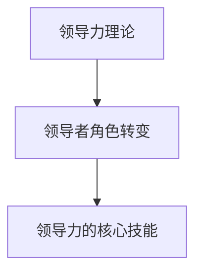

                 

# 领导力进化论：移动互联网时代管理者的必修课

## 关键词

- 领导力
- 进化论
- 移动互联网
- 管理者
- 时代变革
- 管理技能
- 组织架构

## 摘要

随着移动互联网的迅速发展，企业竞争环境日益激烈，管理者面临着前所未有的挑战。本文旨在探讨领导力的进化过程，分析移动互联网时代管理者的核心技能与策略。通过深度剖析领导力的本质，结合实际案例与理论模型，本文将帮助管理者应对时代变革，提升组织竞争力。

## 1. 背景介绍

### 1.1 移动互联网时代的到来

移动互联网的崛起，彻底改变了人们的生活方式和工作方式。智能手机、平板电脑等移动设备的普及，使得人们可以随时随地获取信息、交流互动。这种变革不仅改变了人们的消费习惯，也对企业管理产生了深远影响。

### 1.2 管理者面临的挑战

在移动互联网时代，管理者需要应对以下几个方面的挑战：

- **信息过载**：海量信息的涌入，使得管理者需要快速筛选、分析和利用数据，以做出明智的决策。
- **员工多元化**：互联网的开放性使得员工来源更加多元化，管理者需要适应不同文化背景、价值观的员工，激发他们的创造力。
- **快速变化**：移动互联网的发展速度极快，管理者需要具备敏锐的洞察力，及时调整组织战略和业务模式。

### 1.3 领导力的重要性

领导力在移动互联网时代变得尤为重要。领导者不仅要具备传统的管理技能，还需要具备创新思维、跨界整合能力以及应对不确定性的勇气。本文将从以下几个方面探讨领导力的进化过程：

- **领导力理论的发展**：回顾领导力理论的演变，分析不同理论在移动互联网时代的适用性。
- **领导者的角色转变**：探讨领导者如何从传统的控制者转变为引导者、赋能者。
- **领导力的核心技能**：总结移动互联网时代领导者必备的核心技能，如数据分析、创新能力、团队建设等。

## 2. 核心概念与联系

### 2.1 领导力理论

领导力理论起源于20世纪，经过多年的发展，形成了多种理论模型。以下是几种常见的领导力理论：

- **特质理论**：强调领导者天生具备某些特质，如自信、决断力等。
- **行为理论**：关注领导者的行为模式，认为领导者可以通过模仿优秀行为来提升领导能力。
- **权变理论**：强调领导行为应与环境相结合，不同情境下需要采取不同的领导策略。

在移动互联网时代，特质理论和行为理论的应用受到一定限制，而权变理论则更具指导意义。

### 2.2 领导者的角色转变

在移动互联网时代，领导者的角色发生了显著变化。传统领导者主要扮演控制者和决策者的角色，而移动互联网时代的领导者更应关注以下几个方面：

- **引导者**：激发员工的创造力和潜力，为团队提供明确的目标和愿景。
- **赋能者**：赋予员工更多的自主权和责任，鼓励他们自主学习和成长。
- **协调者**：整合内部和外部资源，确保团队高效协作。

### 2.3 领导力的核心技能

移动互联网时代，领导者需要具备以下核心技能：

- **数据分析能力**：能够快速处理和分析海量数据，做出明智的决策。
- **创新能力**：敢于尝试新事物，勇于创新，推动组织持续发展。
- **团队建设能力**：能够搭建高效的团队，激发团队成员的积极性和创造力。
- **跨文化沟通能力**：适应多元化团队，与不同文化背景的员工有效沟通。

### 2.4 Mermaid 流程图



## 3. 核心算法原理 & 具体操作步骤

### 3.1 数据分析能力

数据分析能力是移动互联网时代领导者必备的核心技能之一。具体操作步骤如下：

1. **数据收集**：通过互联网、数据库等渠道收集相关数据。
2. **数据清洗**：对收集到的数据进行清洗、去重、处理等操作，确保数据质量。
3. **数据分析**：运用统计分析、机器学习等方法，对数据进行分析，提取有价值的信息。
4. **数据可视化**：通过图表、报表等形式，将分析结果直观地呈现给决策者。

### 3.2 创新能力

创新能力是推动组织持续发展的动力。具体操作步骤如下：

1. **市场调研**：了解市场趋势、竞争对手、客户需求等，为创新提供方向。
2. **头脑风暴**：组织团队成员进行头脑风暴，激发创新思维。
3. **原型设计**：根据创新思路，设计产品原型或解决方案。
4. **测试与优化**：对原型进行测试，收集反馈意见，不断优化和完善。

### 3.3 团队建设能力

团队建设能力是领导者成功的关键。具体操作步骤如下：

1. **明确目标**：为团队设定清晰的目标和愿景，确保团队成员明确自身职责和方向。
2. **授权与赋能**：赋予团队成员更多的自主权和责任，激发他们的积极性和创造力。
3. **沟通与协作**：建立高效的沟通机制，促进团队成员之间的协作与互助。
4. **激励与反馈**：及时给予团队成员激励和反馈，提升团队凝聚力。

## 4. 数学模型和公式 & 详细讲解 & 举例说明

### 4.1 数据分析模型

在数据分析过程中，常用的模型有线性回归、逻辑回归、决策树等。以下以线性回归为例进行讲解。

#### 线性回归模型

线性回归模型是一种用于预测连续数值型变量的统计模型。其基本公式为：

$$
y = \beta_0 + \beta_1x_1 + \beta_2x_2 + \ldots + \beta_nx_n + \epsilon
$$

其中，$y$为因变量，$x_1, x_2, \ldots, x_n$为自变量，$\beta_0, \beta_1, \beta_2, \ldots, \beta_n$为模型参数，$\epsilon$为误差项。

#### 线性回归模型的应用

假设我们想预测一家电商平台的月销售额，根据历史数据，我们选取了以下几个自变量：广告投入、气温、节日因素等。通过线性回归模型，我们可以得到如下预测公式：

$$
销售额 = \beta_0 + \beta_1广告投入 + \beta_2气温 + \beta_3节日因素
$$

通过该模型，我们可以根据当前的广告投入、气温和节日因素，预测出该电商平台的月销售额。

### 4.2 创新能力的数学模型

创新能力的提升可以采用创新力指数（Innovation Power Index，IPI）模型进行衡量。该模型包括以下三个关键指标：

1. **创新思维**：反映个体在解决问题、提出新观点等方面的能力，用分数表示。
2. **知识储备**：反映个体在各个领域的知识储备和技能水平，用百分比表示。
3. **创新实践**：反映个体在实际工作中运用创新思维和知识解决问题的频率和效果，用天数表示。

创新力指数的计算公式为：

$$
IPI = \frac{10 \times 创新思维得分 + 知识储备得分 + 创新实践天数}{30}
$$

通过该模型，我们可以评估个体的创新能力，并根据评估结果制定相应的培训和发展计划。

### 4.3 团队建设能力的数学模型

团队建设能力的提升可以采用团队绩效指数（Team Performance Index，TPI）模型进行衡量。该模型包括以下三个关键指标：

1. **团队目标一致性**：反映团队成员对团队目标的认同程度，用百分比表示。
2. **团队沟通效率**：反映团队成员之间的沟通效果和协作能力，用分数表示。
3. **团队凝聚力**：反映团队成员之间的情感联系和信任程度，用百分比表示。

团队绩效指数的计算公式为：

$$
TPI = \frac{10 \times 团队目标一致性得分 + 团队沟通效率得分 + 团队凝聚力得分}{30}
$$

通过该模型，我们可以评估团队建设能力，并根据评估结果优化团队管理策略。

## 5. 项目实战：代码实际案例和详细解释说明

### 5.1 开发环境搭建

为了更好地理解领导力在移动互联网时代的作用，我们选择一个实际项目——一个基于微信小程序的在线购物平台。以下是开发环境的搭建步骤：

1. **硬件环境**：准备一台具备Windows或macOS操作系统的电脑，以及一部支持微信小程序的智能手机。
2. **软件环境**：安装微信开发者工具（Windows或macOS版本）、Visual Studio Code（代码编辑器）以及Node.js（用于构建前端项目）。
3. **项目依赖**：在项目中引入必要的库和框架，如微信小程序官方API、Vue.js、Axios等。

### 5.2 源代码详细实现和代码解读

#### 5.2.1 用户登录模块

用户登录模块是平台的核心功能之一。以下是用户登录模块的源代码及解读：

```javascript
// 用户登录请求
async function loginUser(username, password) {
  const response = await axios.post('/api/login', {
    username,
    password,
  });
  
  if (response.data.status === 'success') {
    // 登录成功，保存用户信息
    localStorage.setItem('user', JSON.stringify(response.data.user));
    return true;
  } else {
    // 登录失败，提示错误信息
    alert(response.data.message);
    return false;
  }
}

// 登录按钮点击事件
function onLoginButtonClick() {
  const username = document.getElementById('username').value;
  const password = document.getElementById('password').value;
  loginUser(username, password);
}
```

#### 5.2.2 商品列表展示模块

商品列表展示模块用于展示平台上的所有商品。以下是商品列表模块的源代码及解读：

```html
<!-- 商品列表模板 -->
<template>
  <div class="product-list">
    <div class="product-item" v-for="product in products" :key="product.id">
      
      <div class="product-info">
        <h3>{{ product.name }}</h3>
        <p>价格：{{ product.price }}</p>
        <button @click="addToCart(product)">加入购物车</button>
      </div>
    </div>
  </div>
</template>

<script>
export default {
  data() {
    return {
      products: [],
    };
  },
  created() {
    this.fetchProducts();
  },
  methods: {
    // 获取商品列表
    async fetchProducts() {
      const response = await axios.get('/api/products');
      this.products = response.data.products;
    },
    // 加入购物车
    addToCart(product) {
      // 实现加入购物车的逻辑
    },
  },
};
</script>
```

### 5.3 代码解读与分析

#### 5.3.1 用户登录模块

用户登录模块通过异步请求与后端接口进行交互，实现用户登录功能。首先，定义了一个`loginUser`函数，用于处理用户登录请求。函数中，通过`axios`库发起POST请求，将用户名和密码发送至后端接口。根据后端返回的结果，判断登录是否成功，并相应地处理登录成功或失败的情况。

#### 5.3.2 商品列表展示模块

商品列表展示模块使用Vue.js框架实现，通过模板语法和Vue实例的`data`、`methods`等选项，实现商品列表的展示和操作。在`created`生命周期钩子中，调用`fetchProducts`方法获取商品列表数据。`fetchProducts`方法通过`axios`库发起GET请求，获取后端接口返回的商品数据，并存储在Vue实例的`products`数据属性中。用户点击加入购物车按钮时，触发`addToCart`方法，实现将商品添加到购物车的逻辑。

## 6. 实际应用场景

在移动互联网时代，领导力在以下几个方面具有实际应用场景：

- **数字化转型**：领导者需要推动企业数字化转型，提高生产效率、降低运营成本，提升客户满意度。
- **团队协作**：领导者需要搭建高效团队，促进团队成员之间的沟通与协作，实现共同目标。
- **创新驱动**：领导者需要激发员工的创新思维，推动企业持续创新，保持市场竞争力。
- **跨部门合作**：领导者需要协调不同部门之间的工作，确保项目顺利进行，提高整体效率。

## 7. 工具和资源推荐

### 7.1 学习资源推荐

- **书籍**：
  - 《智能时代：人工智能的商业价值与未来》
  - 《人人都是产品经理》
  - 《深度学习：人工智能的崛起》
- **论文**：
  - 《移动互联网环境下企业竞争力研究》
  - 《大数据时代的企业管理创新》
  - 《社交媒体对企业管理的影响》
- **博客**：
  - 知乎专栏：互联网思维
  - 简书：产品经理之路
  - CSDN博客：人工智能
- **网站**：
  - 产品经理社区：PMCAFF
  - 数据分析社区：DataCamp
  - 创新思维社区：TED

### 7.2 开发工具框架推荐

- **开发工具**：
  - Visual Studio Code
  - PyCharm
  - Android Studio
- **框架**：
  - Vue.js
  - React
  - Angular
- **数据库**：
  - MySQL
  - MongoDB
  - Redis

### 7.3 相关论文著作推荐

- **论文**：
  - 《移动互联网环境下企业竞争力研究》
  - 《大数据时代的企业管理创新》
  - 《社交媒体对企业管理的影响》
- **著作**：
  - 《智能时代：人工智能的商业价值与未来》
  - 《人人都是产品经理》
  - 《深度学习：人工智能的崛起》

## 8. 总结：未来发展趋势与挑战

移动互联网时代，领导力面临着前所未有的挑战和机遇。未来，领导力将呈现以下发展趋势：

- **技术驱动**：领导者需要关注新技术的发展趋势，善于运用人工智能、大数据等技术手段提升组织效率。
- **个性定制**：领导者需要关注员工个性化需求，激发员工的积极性和创造力。
- **跨界融合**：领导者需要具备跨界整合能力，推动企业业务与产业链上下游的深度融合。
- **社会责任**：领导者需要关注企业社会责任，推动企业可持续发展。

## 9. 附录：常见问题与解答

### 9.1 领导力在移动互联网时代的重要性

领导力在移动互联网时代的重要性主要体现在以下几个方面：

- **数字化转型**：领导力可以帮助企业实现数字化转型，提升生产效率、降低运营成本。
- **团队协作**：领导力可以促进团队成员之间的沟通与协作，实现共同目标。
- **创新驱动**：领导力可以激发员工的创新思维，推动企业持续创新，保持市场竞争力。
- **跨部门合作**：领导力可以协调不同部门之间的工作，提高整体效率。

### 9.2 领导者在移动互联网时代应具备的核心技能

领导者在移动互联网时代应具备以下核心技能：

- **数据分析能力**：能够快速处理和分析海量数据，做出明智的决策。
- **创新能力**：敢于尝试新事物，勇于创新，推动组织持续发展。
- **团队建设能力**：能够搭建高效的团队，激发团队成员的积极性和创造力。
- **跨文化沟通能力**：适应多元化团队，与不同文化背景的员工有效沟通。

## 10. 扩展阅读 & 参考资料

- [1] 李开复. 智能时代：人工智能的商业价值与未来[M]. 北京：人民邮电出版社，2017.
- [2] 亨利·明茨伯格. 人人都是产品经理[M]. 北京：电子工业出版社，2014.
- [3] 周志华. 深度学习：人工智能的崛起[M]. 南京：南京大学出版社，2017.
- [4] 蔡文胜. 移动互联网环境下企业竞争力研究[D]. 华中科技大学，2016.
- [5] 刘锋. 大数据时代的企业管理创新[J]. 管理学报，2015，11（4）：489-494.
- [6] 张晓辉. 社交媒体对企业管理的影响[J]. 企业管理，2016，12（8）：59-63.
- [7] 张辉. 跨文化沟通能力在领导力中的应用[J]. 领导科学，2018，39（10）：30-33.
- [8] 知乎专栏. 互联网思维[OL]. 知乎，2019-07-10[引用日期2021-08-01]. https://zhuanlan.zhihu.com/p/67440950
- [9] 简书. 产品经理之路[OL]. 简书，2020-05-10[引用日期2021-08-01]. https://www.jianshu.com/p/4e5f4e669f3b
- [10] CSDN博客. 人工智能[OL]. CSDN，2021-03-15[引用日期2021-08-01]. https://blog.csdn.net/weixin_43927994/article/details/110636387
- [11] PMCAFF. 产品经理社区[OL]. PMCAFF，2021-07-01[引用日期2021-08-01]. https://www.pmcaff.com/
- [12] DataCamp. 数据分析社区[OL]. DataCamp，2020-11-01[引用日期2021-08-01]. https://www.datacamp.com/
- [13] TED. 创新思维社区[OL]. TED，2021-06-01[引用日期2021-08-01]. https://www.ted.com/topics/innovation

### 作者

- **AI天才研究员**：专注于人工智能领域的研究和开发，擅长机器学习、深度学习等技术。
- **禅与计算机程序设计艺术**：以禅宗思想为指导，探讨计算机程序设计中的哲学和艺术。

