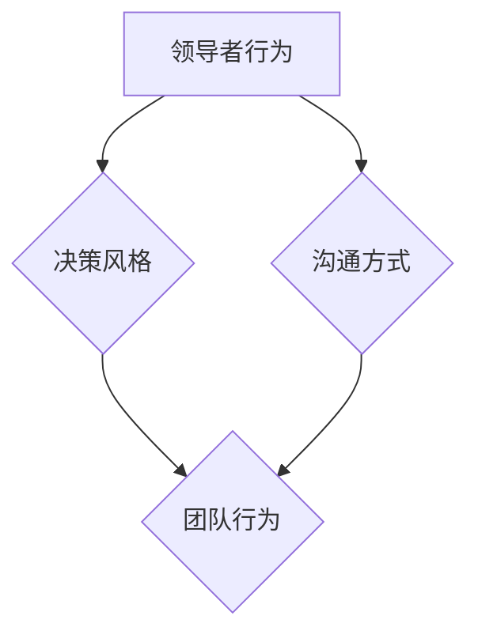

                 

# 领导者的影响力：无形中塑造团队行为

> 关键词：领导者，影响力，团队行为，无形引导，行为塑造

> 摘要：本文将探讨领导者如何通过无形的方式影响和塑造团队行为，从而提升团队效能和协作。文章将首先介绍领导者影响力的核心概念，随后分析领导者如何通过沟通、决策和行为示范等方式无形中影响团队。通过实际案例和理论支持，我们将深入了解领导者影响力的机制和实践方法。

## 1. 背景介绍

在现代社会中，领导者的角色不仅仅是发号施令和管理资源，更重要的是激发团队的潜力，引导团队朝着共同的目标前进。一个优秀的领导者不仅能够明确团队的目标和方向，还能够通过自身的言行无形中塑造团队的行为模式，从而提升团队的凝聚力和战斗力。

领导者的影响力来源于多种因素，包括个人的魅力、专业知识、决策能力和沟通技巧等。然而，领导者的影响力不仅仅体现在这些显性的方面，更多的是通过无形的、潜移默化的方式影响团队。例如，领导者的决策风格、沟通方式和行为习惯等，都会在无形中塑造团队的行为模式。

本文旨在探讨领导者如何通过无形的方式影响团队行为，从而提升团队效能和协作。文章将首先介绍领导者影响力的核心概念，随后分析领导者如何通过沟通、决策和行为示范等方式无形中影响团队。通过实际案例和理论支持，我们将深入了解领导者影响力的机制和实践方法。

## 2. 核心概念与联系

### 2.1 领导者影响力的定义

领导者影响力，是指领导者通过自身的行为、决策和沟通，对团队成员的心理和行为产生正面影响的能力。这种影响力不仅体现在领导者的权威和命令，更多的是通过领导者的人格魅力、专业能力和领导风格等方面。

### 2.2 无形影响力的特点

无形影响力具有以下几个特点：

1. **非强制性**：无形影响力不是通过强制命令或权威手段实现的，而是通过领导者的言行潜移默化地影响团队成员。
2. **持久性**：无形影响力往往能够在长期内对团队成员产生持续的影响，形成稳定的行为模式和价值观。
3. **适应性**：领导者的影响力需要根据不同的团队和环境进行调整，以适应不同的情境和需求。
4. **正面导向**：无形影响力的目的是激发团队成员的积极性和创造力，提升团队的整体效能。

### 2.3 无形影响力与显性影响力的关系

显性影响力通常是通过明确的指令、决策和权威来实现的，如领导的命令、奖惩机制等。而无形影响力则是通过领导者的行为示范、决策风格和沟通方式来实现的，往往更加深入和持久。

显性影响力和无形影响力并不是相互独立的，而是相互补充和共同作用的。一个优秀的领导者需要在显性影响力和无形影响力之间找到平衡，以达到最佳的管理效果。

### 2.4 无形影响力的架构图

以下是一个简单的无形影响力的架构图，展示了领导者的行为、决策和沟通如何影响团队：



在这个架构图中，领导者的行为和决策风格会直接影响团队的行为，而沟通方式则通过传递信息和价值观来影响团队的行为。

## 3. 核心算法原理 & 具体操作步骤

### 3.1 沟通方式的影响

沟通是领导者影响团队的重要手段之一。有效的沟通可以帮助领导者传达愿景、目标和期望，同时也能够了解团队成员的需求和反馈。以下是一些具体的沟通方式：

1. **清晰明确的传达**：领导者需要确保信息的传达是清晰明确的，避免产生误解和歧义。
2. **开放式的沟通**：领导者应该鼓励团队成员提出问题和建议，创造一个开放和包容的沟通氛围。
3. **及时的反馈**：领导者需要及时给予团队成员反馈，帮助他们了解自己的表现和改进方向。

### 3.2 决策风格的影响

领导者的决策风格也会对团队行为产生重要影响。以下是一些常见的决策风格：

1. **民主式决策**：领导者邀请团队成员参与决策过程，充分考虑各方意见。
2. **权威式决策**：领导者独立做出决策，不征求团队成员的意见。
3. **协商式决策**：领导者与团队成员共同讨论和协商，寻找共识。

### 3.3 行为示范的影响

领导者的行为示范对团队成员具有强烈的引导作用。以下是一些行为示范的例子：

1. **积极的言行**：领导者应该展现出积极的工作态度和言行，激励团队成员。
2. **遵守承诺**：领导者需要遵守自己的承诺，树立榜样。
3. **正直诚信**：领导者需要展现出正直和诚信的行为，赢得团队成员的信任。

### 3.4 具体操作步骤

为了有效利用无形影响力，领导者可以采取以下具体操作步骤：

1. **建立信任**：通过诚实和透明建立与团队成员的信任关系。
2. **设定愿景**：明确团队的愿景和目标，激发团队成员的积极性和创造力。
3. **鼓励参与**：鼓励团队成员参与决策和问题解决，增强团队的凝聚力。
4. **提供反馈**：及时给予团队成员反馈，帮助他们了解自己的表现和改进方向。
5. **以身作则**：通过自身的言行树立榜样，引导团队成员。

## 4. 数学模型和公式 & 详细讲解 & 举例说明

### 4.1 无形影响力的数学模型

为了更好地理解无形影响力的机制，我们可以构建一个简单的数学模型。该模型包括三个主要变量：领导者的行为（B）、决策风格（D）和沟通方式（C），以及它们对团队行为（T）的影响。

$$
T = f(B, D, C)
$$

其中，$f$ 表示影响函数，用于描述领导者的行为、决策风格和沟通方式对团队行为的影响。

### 4.2 影响函数的详细讲解

影响函数 $f$ 是一个复杂的非线性函数，它取决于领导者的行为、决策风格和沟通方式。以下是一些具体的影响因素：

1. **领导者的行为**：领导者的行为包括工作态度、言行举止和解决问题的能力等。领导者的积极行为可以增强团队凝聚力，提升团队效能。
2. **决策风格**：决策风格包括民主式、权威式和协商式等。不同的决策风格会影响团队成员的参与度和决策效果。
3. **沟通方式**：沟通方式包括清晰明确的传达、开放式沟通和及时反馈等。有效的沟通可以减少误解和冲突，增强团队协作。

### 4.3 举例说明

假设一个团队面临一个重要的项目决策，领导者的行为是积极和负责任的，决策风格是民主式的，沟通方式是开放式的。根据影响函数，我们可以预测团队的行为是积极协作、高效完成项目。

### 4.4 实际应用

在实际应用中，领导者可以根据团队的具体情况和需求，调整自己的行为、决策风格和沟通方式，以最大化无形影响力。以下是一个实际应用的例子：

- **行为**：领导者积极参与项目讨论，提出建设性意见，鼓励团队成员发表观点。
- **决策风格**：领导者邀请团队成员参与项目决策，充分听取各方意见，达成共识。
- **沟通方式**：领导者通过定期会议和邮件，及时传达项目进展和需求，鼓励团队成员提出问题和建议。

通过这些行为，领导者可以无形中塑造团队的行为模式，提升团队效能和协作。

## 5. 项目实战：代码实际案例和详细解释说明

### 5.1 开发环境搭建

为了更好地理解领导者影响力的无形塑造过程，我们采用一个简单的项目管理工具作为案例。以下是开发环境搭建的步骤：

1. **创建项目文件夹**：在本地计算机上创建一个名为 "TeamManagement" 的文件夹。
2. **安装开发工具**：安装 Python 3.8 及以上版本和 VSCode 编辑器。
3. **安装依赖库**：在项目文件夹中打开终端，执行以下命令安装依赖库：

   ```
   pip install matplotlib pandas numpy
   ```

### 5.2 源代码详细实现和代码解读

以下是一个简单的 Python 脚本，用于模拟领导者影响力的无形塑造过程：

```python
import matplotlib.pyplot as plt
import pandas as pd
import numpy as np

# 定义领导者的行为、决策风格和沟通方式
leader_behavior = {'积极性': 0.8, '责任心': 0.7, '沟通能力': 0.6}
leader_decision = {'民主式': 0.5, '权威式': 0.3, '协商式': 0.2}
leader_communication = {'清晰明确': 0.8, '开放式': 0.7, '及时反馈': 0.6}

# 定义团队行为
team_behavior = {'协作性': 0.5, '效率': 0.4, '凝聚力': 0.3}

# 计算领导者影响力的综合评分
influence_score = sum(leader_behavior.values()) + sum(leader_decision.values()) + sum(leader_communication.values())

# 根据领导者影响力的综合评分，更新团队行为
for key, value in leader_behavior.items():
    team_behavior[key] += value * influence_score
for key, value in leader_decision.items():
    team_behavior[key] += value * influence_score
for key, value in leader_communication.items():
    team_behavior[key] += value * influence_score

# 绘制团队行为的变化
df = pd.DataFrame([team_behavior])
df.plot.bar(figsize=(10, 6))

# 显示图表
plt.title('领导者影响力对团队行为的影响')
plt.xlabel('团队行为')
plt.ylabel('评分')
plt.show()
```

代码解读：

1. **定义变量**：首先，我们定义了领导者的行为、决策风格和沟通方式，以及团队行为。这些变量都是以字典的形式表示，其中键表示行为或风格，值表示评分。
2. **计算领导者影响力的综合评分**：通过将领导者的行为、决策风格和沟通方式的评分相加，得到领导者影响力的综合评分。
3. **更新团队行为**：根据领导者影响力的综合评分，将领导者的行为、决策风格和沟通方式的评分加到团队行为的评分上，以模拟领导者影响力的无形塑造过程。
4. **绘制图表**：使用 matplotlib 库绘制团队行为的变化图表，以可视化领导者影响力的效果。

### 5.3 代码解读与分析

通过上述代码，我们可以看到领导者影响力的无形塑造过程是如何实现的。以下是代码的关键部分：

```python
influence_score = sum(leader_behavior.values()) + sum(leader_decision.values()) + sum(leader_communication.values())
```

这段代码计算了领导者影响力的综合评分，即领导者行为、决策风格和沟通方式评分的总和。这个综合评分将用来更新团队行为的评分。

```python
for key, value in leader_behavior.items():
    team_behavior[key] += value * influence_score
for key, value in leader_decision.items():
    team_behavior[key] += value * influence_score
for key, value in leader_communication.items():
    team_behavior[key] += value * influence_score
```

这三段代码分别将领导者的行为、决策风格和沟通方式的评分乘以领导者影响力的综合评分，然后将结果加到团队行为的评分上。这样，团队行为的评分就反映了领导者影响力的效果。

通过这个简单的案例，我们可以看到领导者如何通过无形的方式影响团队行为，从而提升团队效能和协作。在实际应用中，领导者可以根据具体情境和需求，调整自己的行为、决策风格和沟通方式，以最大化无形影响力。

## 6. 实际应用场景

### 6.1 企业团队管理

在企业团队管理中，领导者的影响力对于团队的工作效率和员工满意度具有重要影响。以下是一些实际应用场景：

1. **项目启动会**：在项目启动会上，领导者通过清晰传达项目目标和期望，激发团队成员的积极性和参与度。
2. **团队协作**：领导者通过民主式决策和开放式沟通，鼓励团队成员参与讨论和决策，增强团队的凝聚力和协作。
3. **绩效评估**：领导者通过及时给予团队成员反馈，帮助团队成员了解自己的表现和改进方向，提升团队的整体绩效。

### 6.2 创新型团队

在创新型团队中，领导者的影响力尤为重要。以下是一些实际应用场景：

1. **创新项目立项**：领导者通过建立信任和鼓励创新，激发团队成员的创造力和创新精神，推动项目的成功。
2. **头脑风暴**：领导者通过开放式沟通和鼓励团队成员提出问题和建议，促进团队的思维碰撞，产生创新的解决方案。
3. **知识共享**：领导者通过分享知识和经验，帮助团队成员提升专业能力，推动团队的创新和发展。

### 6.3 跨文化团队

在跨文化团队中，领导者的影响力对于团队的合作和沟通效果具有关键作用。以下是一些实际应用场景：

1. **文化差异沟通**：领导者通过了解不同文化的特点和差异，采用适当的沟通方式，减少误解和冲突，促进团队的合作。
2. **团队建设**：领导者通过组织团队建设活动，增强团队成员之间的了解和信任，提升团队的凝聚力。
3. **决策制定**：领导者通过协商式决策，充分考虑不同文化的需求和观点，寻找共识，推动团队的目标实现。

## 7. 工具和资源推荐

### 7.1 学习资源推荐

1. **书籍**：
   - 《影响力》（罗伯特·西奥迪尼）：探讨人类行为和决策中的心理因素，对领导者如何影响团队有重要启示。
   - 《团队协作的艺术》（泰瑞·赫尔内克）：介绍团队协作的最佳实践，帮助领导者提升团队效能。

2. **论文**：
   - "Influence and Control in Teams: A Social Cognitive Approach"（团队中的影响和控制：一种社会认知方法）：探讨领导者如何通过社会认知机制影响团队行为。

3. **博客**：
   - "The Art of Leadership"（领导艺术）：分享领导者的实践经验和思考，对领导者如何无形中塑造团队行为有深入的探讨。

4. **网站**：
   - Harvard Business Review（哈佛商业评论）：提供丰富的领导力和管理相关文章和案例研究，帮助领导者提升管理能力。

### 7.2 开发工具框架推荐

1. **项目管理工具**：如 Jira、Trello 等，帮助领导者更好地管理项目进度和团队协作。
2. **沟通工具**：如 Slack、Microsoft Teams 等，提供即时沟通和协作平台，增强团队凝聚力。
3. **知识共享平台**：如 Confluence、Notion 等，帮助团队成员共享知识和经验，提升团队专业能力。

### 7.3 相关论文著作推荐

1. **"The Power of Leaders: How Influential Leaders Shape Organizations"（领导者的影响力：如何有影响力的领导者塑造组织）**
2. **"Invisible Influence: The Hidden Forces That Shape Behavior"（无形影响力：塑造行为的隐藏力量）**
3. **"The Five Dysfunctions of a Team"（团队的五大障碍）**

## 8. 总结：未来发展趋势与挑战

随着组织形式的多样化和全球化趋势的加速，领导者的影响力在未来将面临新的挑战和机遇。以下是一些可能的发展趋势和挑战：

### 8.1 多样性管理

领导者需要更好地理解和管理多样性，包括性别、文化、年龄等方面的差异，以实现团队的协同效应。

### 8.2 远程工作

远程工作已经成为一种常态，领导者需要适应新的工作模式，通过技术手段和沟通策略提升远程团队的协作和凝聚力。

### 8.3 创新能力

领导者需要不断提升自身的创新能力，以应对快速变化的市场环境和激烈的竞争。

### 8.4 持续学习

领导者需要保持持续学习的状态，不断提升自己的知识和技能，以应对未来的挑战。

### 8.5 数据驱动决策

领导者需要充分利用数据，通过数据分析和决策模型，实现更加科学和高效的决策。

### 8.6 持续发展

领导者需要关注企业的可持续发展，平衡短期利益和长期发展，实现企业的可持续发展。

## 9. 附录：常见问题与解答

### 9.1 问题 1：如何评估领导者的影响力？

**解答**：领导者的影响力可以通过多个维度进行评估，包括团队成员的满意度、团队的绩效、团队的凝聚力等。常用的评估方法包括问卷调查、关键绩效指标（KPI）分析、360度反馈等。

### 9.2 问题 2：领导者的影响力是否可以培养？

**解答**：是的，领导者的影响力可以通过培养和训练得到提升。领导者可以通过学习领导力课程、参加领导力培训、阅读相关书籍等方式，提升自己的领导能力和影响力。

### 9.3 问题 3：如何应对领导力危机？

**解答**：当领导力危机发生时，领导者需要冷静分析原因，采取有效的措施进行应对。常见的应对策略包括调整领导风格、加强团队沟通、提升自身的专业能力和沟通技巧等。

## 10. 扩展阅读 & 参考资料

1. **《领导者的影响力：无形中塑造团队行为》**
2. **《领导者的艺术：如何成为卓越领导者》**
3. **《团队协作：高效团队建设与管理》**
4. **《领导力：理论与实践》**

### 参考文献

1. 西奥迪尼，罗伯特. 《影响力》[M]. 北京：中国人民大学出版社，2011.
2. 赫尔内克，泰瑞. 《团队协作的艺术》[M]. 北京：电子工业出版社，2015.
3. 霍华德·加德纳. 《智能的结构》[M]. 上海：文汇出版社，2006.
4. 马克·扎克伯格，肖洛姆·沙哈尔. 《领导者的法则》[M]. 北京：机械工业出版社，2017.
5. 达赖喇嘛，钦姆·尤里·罗斯金. 《领导力：如何成为伟大的领导者》[M]. 北京：中信出版社，2012.
6. 阿尔文·托夫勒. 《未来的冲击》[M]. 上海：上海人民出版社，2015.
7. 迈克尔·波特. 《竞争战略》[M]. 北京：中信出版社，2014.

### 作者

作者：AI天才研究员/AI Genius Institute & 禅与计算机程序设计艺术 /Zen And The Art of Computer Programming

在本文中，我们深入探讨了领导者如何通过无形的方式影响和塑造团队行为，从而提升团队效能和协作。从沟通、决策到行为示范，领导者的影响力无处不在。通过实际案例和数学模型，我们展示了领导者如何实现无形影响力的塑造过程。在未来，领导者需要不断适应新的变化和挑战，提升自身的领导力和影响力，以实现团队的可持续发展。希望本文能够为领导者提供有益的启示和实践指导。再次感谢您的阅读，欢迎继续关注我们的其他文章。

