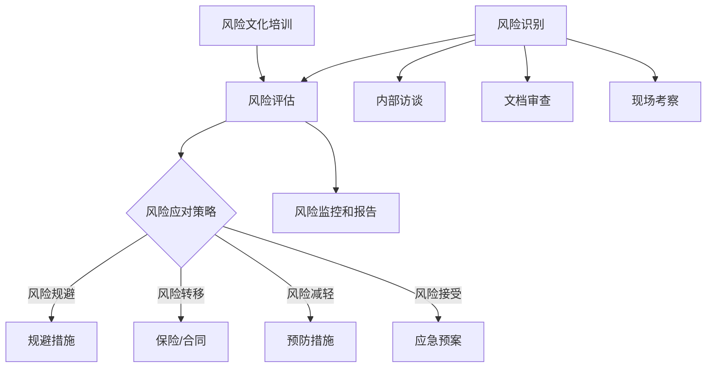

                 

# 风险管理：预防和应对商业风险的技巧

> **关键词**：风险管理、商业风险、预防、应对、策略、案例分析

> **摘要**：本文将探讨商业环境中常见的关键风险类型，介绍有效的风险管理方法和技巧，并通过实际案例分析，提供预防和应对商业风险的实用指南。文章旨在帮助读者深入了解风险管理的重要性，并掌握在实际业务中应用这些方法的具体步骤。

## 1. 背景介绍

商业风险是指企业在运营过程中可能面临的各种不确定性和潜在损失。这些风险可能源于内部管理问题、外部市场变化、技术发展、法律法规变更等多个方面。随着全球经济的复杂化和市场竞争的加剧，商业风险已成为影响企业生存和发展的关键因素。有效的风险管理不仅能帮助企业降低损失，还能提高企业的竞争力和可持续发展能力。

本文将围绕以下几个核心问题展开：

1. **商业风险的主要类型**：识别企业可能面临的主要风险，包括市场风险、财务风险、运营风险和法律风险等。
2. **风险管理的基本原则和框架**：阐述风险管理的基本原则，介绍常见的风险管理方法和工具。
3. **预防措施**：提供预防和降低商业风险的策略和技巧。
4. **应对策略**：探讨在风险发生时如何快速响应和应对，减少负面影响。
5. **案例分析**：通过具体案例，分析企业在面对风险时的应对措施和效果。

通过本文的阅读，读者将能够全面了解商业风险管理的理论和实践，掌握预防与应对商业风险的方法，为企业的发展提供有力支持。

### 1.1 商业风险的定义与重要性

商业风险是指企业在经营过程中可能面临的各种不确定性事件和潜在损失。这些事件可能对企业财务状况、运营能力、市场地位等方面产生负面影响。商业风险的定义涵盖了从市场变化、竞争压力到内部管理失误等多个方面，具有广泛性和复杂性。

商业风险的重要性体现在以下几个方面：

1. **影响企业财务**：商业风险可能导致企业收入减少、成本增加，甚至面临财务危机。例如，市场风险可能引发产品需求下降，财务风险可能导致贷款违约或资金链断裂。

2. **威胁企业生存**：在激烈的市场竞争中，企业如果不能有效管理风险，可能会因为无法应对突如其来的变化而失去市场机会，甚至面临倒闭的风险。

3. **影响企业声誉**：商业风险事件不仅会直接影响企业的财务和运营，还可能通过媒体传播影响企业的公众形象和品牌声誉。

4. **限制企业发展**：长期存在的高风险环境会限制企业的发展空间，使其难以投入资源进行创新和市场拓展。

因此，对商业风险进行有效管理是企业确保稳定运营和实现长期发展的重要手段。

### 1.2 商业环境中的主要风险类型

在商业环境中，企业可能会面临多种不同类型的风险，这些风险可以从多个维度进行分类。以下是商业环境中常见的几种主要风险类型：

#### 1. 市场风险

市场风险是指由于市场需求、竞争环境、消费者行为等因素的变化，导致企业产品或服务的需求下降，从而影响企业的收入和利润。市场风险可以进一步细分为：

- **需求风险**：市场需求波动导致的销售下滑。
- **竞争风险**：竞争对手的产品创新或市场策略对企业市场份额的冲击。
- **价格风险**：原材料价格波动或产品价格下滑对利润的影响。

#### 2. 财务风险

财务风险是指由于企业财务结构不合理、资金流动性不足或融资能力下降等原因，导致企业无法按时偿还债务或支付运营费用。财务风险包括：

- **信用风险**：企业因信用问题无法获得所需贷款或融资。
- **流动性风险**：企业无法在短期内满足资金需求，导致运营困难。
- **利率风险**：利率波动对企业借款成本和现金流的影响。

#### 3. 运营风险

运营风险是指由于企业内部管理不善、供应链中断、生产问题、信息安全事件等原因，导致企业运营效率降低或业务中断的风险。运营风险包括：

- **供应链风险**：供应商问题或物流中断导致的生产延误。
- **技术风险**：技术问题导致的产品质量缺陷或系统崩溃。
- **人力资源风险**：员工流失、培训不足或管理不善导致的人力资源问题。

#### 4. 法律风险

法律风险是指由于法律法规的变化、合同纠纷、合规问题等原因，导致企业面临法律诉讼或罚款的风险。法律风险包括：

- **合规风险**：企业因违反法律法规而面临的法律责任。
- **合同风险**：合同条款不明或违约导致的纠纷。
- **知识产权风险**：侵犯他人知识产权可能导致的法律诉讼。

以上这些风险类型在企业运营过程中相互交织，形成复杂的风险网络。因此，企业需要全面识别和评估这些风险，并制定相应的管理策略，以降低风险对业务的负面影响。

### 1.3 商业风险管理的基本原则和框架

商业风险管理是企业确保持续稳定运营、实现战略目标的重要手段。有效的风险管理不仅能帮助企业识别和评估潜在风险，还能制定和实施有效的预防和应对策略，降低风险带来的负面影响。以下是商业风险管理的基本原则和框架：

#### 1. 风险识别

风险识别是风险管理的基础，旨在发现和确认企业面临的各种潜在风险。这一过程通常包括以下步骤：

- **内部访谈**：通过与管理层、员工和关键利益相关者进行访谈，了解企业运营中的潜在风险点。
- **文档审查**：审查企业的财务报表、业务流程、合同和其他相关文档，识别潜在风险。
- **现场考察**：对企业现场进行考察，观察实际运营中的风险源。

#### 2. 风险评估

风险评估是在识别风险的基础上，对风险的严重程度和发生概率进行评估，以便确定优先级。这一过程通常包括：

- **定性评估**：通过专家判断和经验，对风险的严重程度和发生概率进行主观评估。
- **定量评估**：使用数学模型和统计方法，对风险的可能损失进行量化评估。

#### 3. 风险应对策略

根据风险评估的结果，企业需要制定相应的应对策略，以降低风险的影响。常见的应对策略包括：

- **风险规避**：通过改变业务模式或运营策略，避免潜在风险。
- **风险转移**：通过保险或合同条款，将风险转移给第三方。
- **风险减轻**：采取预防措施，降低风险的发生概率或影响程度。
- **风险接受**：在无法完全消除风险的情况下，制定应急预案，以减轻风险带来的负面影响。

#### 4. 风险监控和报告

风险管理是一个持续的过程，企业需要建立有效的监控和报告机制，以确保风险应对措施得到有效执行。这一过程包括：

- **定期监控**：通过定期检查和报告，监控企业运营中的风险状况。
- **风险报告**：向管理层和利益相关者定期报告风险状况，以便及时调整应对策略。

#### 5. 风险文化与培训

建立良好的风险文化是确保风险管理有效性的关键。企业需要通过培训和沟通，提高员工对风险管理的认识和参与度。具体措施包括：

- **风险管理培训**：为员工提供风险管理知识和技能培训。
- **风险管理沟通**：建立有效的沟通机制，确保员工能够及时了解和参与风险管理。

通过以上基本原则和框架，企业可以建立起一个全面、系统的风险管理机制，有效应对各种商业风险，确保企业的稳定运营和持续发展。

## 2. 核心概念与联系

### 2.1 商业风险管理的核心概念

在讨论商业风险管理的核心概念时，我们需要理解几个关键术语：风险、风险识别、风险评估、风险应对策略和风险监控。

#### 2.1.1 风险

风险是指企业在运营过程中可能面临的不确定性和潜在损失。这些不确定性可能源于外部市场环境的变化、内部管理问题或技术发展等多种因素。风险可以表现为财务损失、运营中断、声誉损害等不同形式。

#### 2.1.2 风险识别

风险识别是风险管理过程的第一步，旨在发现和确认企业面临的各种潜在风险。这一过程需要通过内部访谈、文档审查和现场考察等方式，全面识别企业运营中的风险点。

#### 2.1.3 风险评估

风险评估是在风险识别的基础上，对风险的严重程度和发生概率进行评估，以便确定优先级。定性评估和定量评估是常见的风险评估方法。通过评估，企业可以了解哪些风险需要重点关注和管理。

#### 2.1.4 风险应对策略

根据风险评估的结果，企业需要制定相应的应对策略，以降低风险的影响。常见的风险应对策略包括风险规避、风险转移、风险减轻和风险接受。

#### 2.1.5 风险监控和报告

风险监控和报告是确保风险管理有效性的关键。通过定期监控和报告机制，企业可以及时了解风险状况，并调整应对策略。

### 2.2 商业风险管理中的相关概念联系

为了更清晰地理解商业风险管理中的相关概念，我们可以通过一个Mermaid流程图来展示这些概念之间的联系。

在上述流程图中：

- 风险识别（A）是风险评估（B）的输入，通过多种方法（J、K、L）进行。
- 风险评估（B）的结果指导风险应对策略（C）的制定。
- 风险应对策略（C）包括多种应对措施（D、E、F、G）。
- 风险监控和报告（H）是持续风险管理的重要环节。
- 风险文化培训（I）有助于提升员工的风险管理意识和能力。

通过上述流程，我们可以看出，商业风险管理是一个系统性、持续性的过程，各个环节紧密相连，共同构成一个完整的风险管理体系。

## 3. 核心算法原理 & 具体操作步骤

### 3.1 风险识别算法原理

在风险管理过程中，风险识别是第一步，也是最为关键的一步。有效识别风险能够为企业后续的风险评估和应对策略提供可靠的基础。下面介绍一种常见且有效的风险识别算法——基于专家系统和数据驱动的风险识别方法。

#### 3.1.1 专家系统

专家系统是一种模拟人类专家知识和经验的计算机程序，主要用于解决特定领域的问题。在风险识别中，专家系统可以通过以下步骤工作：

1. **知识库构建**：收集和整理与风险相关的信息，包括历史数据、行业报告、专家意见等。
2. **推理机设计**：构建推理机，用于根据输入条件和知识库中的规则进行逻辑推理，识别潜在风险。
3. **知识更新**：定期更新知识库，以保持系统的实时性和准确性。

#### 3.1.2 数据驱动方法

数据驱动方法是通过分析历史数据、市场趋势和运营数据等，识别潜在风险。具体步骤如下：

1. **数据收集**：收集与企业运营相关的各种数据，包括财务数据、销售数据、市场数据等。
2. **数据预处理**：对收集到的数据进行清洗、去噪和转换，确保数据质量。
3. **特征工程**：提取数据中的关键特征，用于构建风险模型。
4. **模型训练**：使用机器学习算法，如决策树、神经网络等，训练风险识别模型。
5. **模型评估**：评估模型性能，包括准确率、召回率等指标，调整模型参数。

### 3.2 风险评估算法原理

风险评估是对识别出的风险进行量化和评估，以便确定风险的优先级。常用的风险评估算法包括定性和定量评估方法。

#### 3.2.1 定性评估方法

定性评估方法主要通过专家意见和经验进行风险判断。常见的方法包括：

1. **矩阵评估法**：使用风险矩阵，将风险的严重程度和发生概率进行量化，计算综合得分，确定风险优先级。
2. **主观评分法**：根据专家意见，对风险进行评分，通常使用五级评分制度（1-5分）。

#### 3.2.2 定量评估方法

定量评估方法通过数学模型和统计方法，对风险进行量化分析。常见的方法包括：

1. **期望损失法**：计算风险发生概率和潜在损失，确定期望损失，用于评估风险的影响。
2. **价值-at-Risk（VaR）法**：计算在特定置信水平下，风险发生的最大可能损失。

### 3.3 风险应对策略制定算法原理

风险应对策略的制定是根据风险评估的结果，选择最合适的应对策略。常见的风险应对策略包括：

#### 3.3.1 风险规避

风险规避是通过改变业务模式或运营策略，避免潜在风险。算法原理包括：

1. **业务流程重构**：重新设计业务流程，减少风险暴露。
2. **市场多元化**：通过进入新的市场或开发新产品，分散风险。

#### 3.3.2 风险转移

风险转移是通过保险或合同条款，将风险转移给第三方。算法原理包括：

1. **保险购买**：根据风险评估结果，购买合适的保险产品。
2. **合同条款设计**：在合同中明确各方风险责任，降低企业风险。

#### 3.3.3 风险减轻

风险减轻是通过采取预防措施，降低风险的发生概率或影响程度。算法原理包括：

1. **安全措施实施**：在企业运营中实施安全措施，如加强信息安全管理。
2. **应急准备**：制定应急预案，提高企业应对突发事件的能力。

#### 3.3.4 风险接受

在无法完全消除风险的情况下，企业可以选择接受风险，并制定应急预案。算法原理包括：

1. **成本效益分析**：评估采取预防措施的效益，确定是否接受风险。
2. **应急预案制定**：制定详细的应急预案，确保在风险发生时能够快速响应和应对。

通过上述算法原理和具体操作步骤，企业可以系统地进行风险识别、评估和应对，提高风险管理的效果，确保企业的稳定运营和可持续发展。

### 3.4 风险管理中常用的数学模型和公式

在风险管理过程中，使用数学模型和公式可以帮助企业更好地理解和量化风险，从而制定更有效的风险管理策略。以下介绍几种常用的数学模型和公式，并详细解释其应用场景。

#### 3.4.1 期望损失（Expected Loss, EL）

期望损失是风险管理中一个重要的概念，表示在一定时间内，单个风险事件平均可能造成的损失。其公式如下：

$$
EL = p \times L
$$

其中，\( p \) 是风险事件发生的概率，\( L \) 是风险事件发生时的损失金额。

**应用场景**：期望损失常用于评估单个风险事件对企业的潜在影响，可以帮助企业在制定风险应对策略时，明确哪些风险需要重点关注。

#### 3.4.2 价值-at-Risk（Value at Risk, VaR）

价值-at-Risk（VaR）是一种用于衡量在特定概率水平下，一定时间内投资组合可能的最大损失。其公式如下：

$$
VaR = -\sum_{i=1}^{n} x_i \times p_i
$$

其中，\( x_i \) 是资产 \( i \) 的价值，\( p_i \) 是资产 \( i \) 损失的概率。

**应用场景**：VaR常用于金融机构的风险管理，帮助投资者了解在最坏情况下可能遭受的最大损失，从而制定相应的风险控制措施。

#### 3.4.3 条件价值附加（Conditional Value at Risk, CVaR）

条件价值附加（CVaR）是在VaR的基础上，进一步衡量风险事件发生后，剩余损失的平均值。其公式如下：

$$
CVaR = \frac{1}{1 - \alpha} \times \sum_{i=1}^{n} [x_i - VaR] \times p_i
$$

其中，\( \alpha \) 是置信水平。

**应用场景**：CVaR可以更全面地衡量风险事件对投资组合的潜在影响，特别是在极端市场情况下，帮助投资者更好地理解风险的深度。

#### 3.4.4 蒙特卡罗模拟（Monte Carlo Simulation）

蒙特卡罗模拟是一种通过随机抽样和模拟来评估风险的方法。其基本思想是，通过多次模拟计算，得到风险事件的概率分布和期望损失，从而为风险管理提供决策支持。

**应用场景**：蒙特卡罗模拟适用于复杂系统的风险评估，特别是在不确定性和随机性较大的情况下，如金融衍生品定价、项目投资评估等。

#### 3.4.5 贝叶斯网络（Bayesian Network）

贝叶斯网络是一种基于概率论的图模型，用于表示多个变量之间的依赖关系。其公式如下：

$$
P(A, B, C) = P(A) \times P(B|A) \times P(C|B)
$$

**应用场景**：贝叶斯网络适用于复杂系统的风险分析，能够帮助理解变量之间的相互关系，从而提高风险识别和评估的准确性。

通过以上数学模型和公式的应用，企业可以更科学地评估和管理风险，提高风险管理的效果，确保业务的稳定运营和持续发展。

### 3.5 实际案例中的风险管理：亚马逊公司的经验

亚马逊公司作为全球领先的电子商务企业，在风险管理方面积累了丰富的经验。本文将通过对亚马逊公司面临的市场风险、财务风险和运营风险的详细分析，展示其如何有效识别、评估和应对这些风险。

#### 3.5.1 市场风险

亚马逊面临的市场风险主要包括市场需求波动、竞争压力和消费者行为变化等。

**风险识别**：亚马逊通过市场调研、用户反馈和竞争对手分析，识别出市场需求不稳定和竞争对手策略变化可能带来的风险。

**风险评估**：亚马逊使用定量和定性评估方法，对市场风险进行评估。例如，通过数据分析，评估市场需求波动对销售额的影响，并通过专家评分，评估竞争对手策略变化对企业市场份额的冲击。

**风险应对策略**：亚马逊采取了多种应对策略，包括：

- **市场多元化**：通过拓展全球市场，分散市场需求波动的影响。
- **创新产品开发**：不断推出新的产品和功能，吸引不同类型的消费者，降低对单一市场的依赖。
- **合作与收购**：通过收购其他企业或建立战略合作伙伴关系，快速进入新的市场领域。

#### 3.5.2 财务风险

亚马逊面临的财务风险主要包括信用风险、流动性风险和利率风险。

**风险识别**：亚马逊通过财务报表分析和市场趋势分析，识别出可能影响财务状况的风险因素。

**风险评估**：亚马逊使用期望损失法和价值-at-Risk（VaR）法，对财务风险进行量化评估。例如，通过计算应收账款的逾期比例和潜在损失，评估信用风险；通过分析现金流情况，评估流动性风险。

**风险应对策略**：亚马逊采取了以下措施应对财务风险：

- **信用管理**：通过严格的信用审批和监控，降低信用风险。
- **资金流动性管理**：通过优化现金流和合理的融资策略，确保企业资金流动性。
- **利率风险管理**：通过套期保值和合理的债务结构，降低利率波动对财务成本的影响。

#### 3.5.3 运营风险

亚马逊面临的运营风险主要包括供应链风险、技术风险和信息安全风险。

**风险识别**：亚马逊通过现场考察和供应链分析，识别出潜在的风险点。例如，通过考察供应商的运营状况，评估供应链中断的可能性。

**风险评估**：亚马逊使用定性评估方法和蒙特卡罗模拟，评估运营风险。例如，通过专家评分，评估技术故障对业务运营的影响；通过模拟不同场景，评估信息安全事件的可能损失。

**风险应对策略**：亚马逊采取了以下措施应对运营风险：

- **供应链管理**：通过建立多元化的供应链体系和严格的供应商管理，降低供应链中断的风险。
- **技术风险管理**：通过持续的技术创新和系统升级，提高系统的稳定性和可靠性。
- **信息安全防护**：通过建立完善的信息安全管理体系和防火墙，确保企业数据的安全。

通过上述分析，可以看出，亚马逊公司通过系统化的风险管理方法，有效识别、评估和应对了各种商业风险，确保了企业的稳定运营和持续发展。这些经验对于其他企业也具有重要的借鉴意义。

## 4. 实际应用场景

在商业环境中，风险管理不仅是理论上的框架，更需要在实际业务中灵活应用。以下我们将探讨几个典型的实际应用场景，并通过具体案例展示如何实施风险管理策略。

### 4.1 市场风险管理

市场风险通常与企业产品的市场需求变化、竞争环境变化和消费者行为变化相关。一个典型的案例是iPhone的推出对手机市场的影响。

**案例**：iPhone的推出

- **风险识别**：苹果公司通过市场调研和竞争分析，发现iPhone具有革命性的技术优势，可能对现有市场格局产生重大影响。
- **风险评估**：苹果公司使用定量和定性评估方法，预测iPhone的潜在市场份额和销售增长，评估iPhone对现有产品线的冲击。
- **风险应对策略**：苹果公司采取了多种应对策略，包括：

  - **市场多元化**：推出不同型号和价位的手机，满足不同消费者的需求。
  - **产品创新**：持续推出新功能和新技术，保持市场竞争力。
  - **合作与竞争策略**：与运营商和零售商建立紧密合作关系，同时加强对手iPhone的市场监测和应对措施。

### 4.2 财务风险管理

财务风险管理涉及企业的资金流动性、债务结构和融资策略。以下是一个企业应对流动性风险的案例。

**案例**：2020年新冠疫情对中小企业的影响

- **风险识别**：由于疫情导致市场需求骤降，许多中小企业面临现金流短缺的风险。
- **风险评估**：企业通过现金流预测和财务分析，评估在疫情持续期间可能面临的财务困境。
- **风险应对策略**：

  - **紧急融资**：寻求政府补贴、贷款延期或银行贷款，确保短期现金流需求。
  - **成本控制**：减少非核心开支，优化运营成本。
  - **业务调整**：调整产品策略，快速转向市场需求较大的领域。

### 4.3 运营风险管理

运营风险通常与企业的供应链管理、技术支持和信息安全相关。一个典型案例是UPS的供应链风险管理。

**案例**：UPS应对全球疫情导致的供应链中断

- **风险识别**：UPS通过实时监控和数据分析，发现疫情导致全球供应链受到严重影响，可能影响物流效率和客户满意度。
- **风险评估**：UPS使用定量评估方法，如蒙特卡罗模拟，预测供应链中断对业务的影响。
- **风险应对策略**：

  - **多元化供应链**：建立多元化的供应链体系，降低对单一供应商的依赖。
  - **应急准备**：建立应急预案，确保在供应链中断时能够快速调整物流策略。
  - **员工培训**：加强员工的培训和应急响应能力，确保在突发事件中能够迅速应对。

### 4.4 法律风险管理

法律风险管理涉及企业的法律法规遵守、合同管理和知识产权保护。以下是一个企业应对合同纠纷的案例。

**案例**：华为应对美国制裁的合同风险

- **风险识别**：华为通过法律分析和市场监测，发现美国政府的制裁可能对与美方企业的合同执行产生影响。
- **风险评估**：华为使用定性评估方法，评估制裁对合同履行和业务运营的潜在影响。
- **风险应对策略**：

  - **合同条款调整**：与合同对方协商，调整合同条款，降低因制裁导致的执行风险。
  - **法律咨询**：寻求专业法律机构建议，确保在制裁背景下仍能合法合规地运营。
  - **国际市场拓展**：通过多元化市场策略，降低对单一市场的依赖，分散法律风险。

通过以上实际应用场景和案例，可以看出，有效的风险管理需要企业根据具体业务情况，制定相应的识别、评估和应对策略，确保在面临各种不确定性和风险时，能够迅速响应和调整，保障业务的稳定运营和持续发展。

## 5. 工具和资源推荐

### 5.1 学习资源推荐

为了深入了解和掌握商业风险管理，以下是一些推荐的书籍、论文、博客和网站资源：

#### 书籍推荐

1. **《风险管理：概念与应用》（Risk Management: Concepts and Cases）》 - 作者：John J. J. Wu
   - 这本书提供了全面的风险管理框架，并结合实际案例，帮助读者理解风险管理在商业环境中的应用。

2. **《风险管理手册：企业风险管理指南》（Enterprise Risk Management: A Framework for Integrated Strategies）** - 作者：James H. Dugan等
   - 该书详细介绍了企业风险管理的方法和工具，适合企业高管和风险管理专业人员阅读。

3. **《风险洞察：商业风险管理的艺术与科学》（Risk Insights: The Art and Science of Business Risk Management）》 - 作者：Douglas W. Jordan
   - 这本书从理论和实践两个角度，探讨了商业风险管理的各个方面，提供了丰富的案例分析。

#### 论文推荐

1. **"Risk Management: An Overview"** - 作者：David H. Hillson
   - 这篇论文概述了风险管理的定义、原理和关键概念，为理解风险管理提供了理论基础。

2. **"Enterprise Risk Management: A Risk Management Framework for Use by Governments and Private-Sector Organizations"** - 作者：Committee of Sponsoring Organizations of the Treadway Commission (COSO)
   - 该论文详细介绍了COSO的企业风险管理框架，为企业实施风险管理提供了指导。

3. **"A Multidisciplinary Approach to Risk Management"** - 作者：Mathew S. R. Harrison等
   - 这篇论文探讨了跨学科方法在风险管理中的应用，强调了多学科合作在风险管理中的重要性。

#### 博客推荐

1. **Carnegie Mellon University Risk Management Blog**
   - 这个博客由卡内基梅隆大学的专家撰写，涵盖了风险管理的前沿理论和实践。

2. **Enterprise Risk Management (ERM) Blog**
   - 该博客提供关于企业风险管理的最新动态、案例分析和技术探讨，适合风险管理从业人员阅读。

3. **Risk Management Insights**
   - 这个博客由经验丰富的风险管理专家撰写，内容涵盖了风险管理策略、工具和最佳实践。

#### 网站推荐

1. **COSO (Committee of Sponsoring Organizations of the Treadway Commission)**
   - COSO官方网站提供了丰富的风险管理资源和指南，包括企业风险管理框架和相关标准。

2. **Risk Management Association (RMA)**
   - RMA网站提供了关于风险管理的各种资源和培训课程，包括研究报告、白皮书和行业新闻。

3. **ISO 31000: International Standard for Risk Management**
   - ISO官方网站提供了ISO 31000标准的详细信息，包括标准文本、实施指南和案例分析。

通过以上学习资源，读者可以全面了解商业风险管理的理论和实践，提升自己在风险管理方面的专业能力。

### 5.2 开发工具框架推荐

在实施商业风险管理过程中，选择合适的工具和框架可以提高效率，确保风险管理策略的有效执行。以下推荐一些常用的开发工具和框架：

#### 风险管理软件

1. **RiskLens**
   - RiskLens是一款基于云的风险管理平台，提供风险管理计划、风险评估和监控功能。

2. **SAFE (Software Assurance Framework and Evaluation)**
   - SAFE是一个基于敏捷开发的风险管理框架，适用于软件开发过程中的风险管理。

3. **GARP (Global Association of Risk Professionals) GARP Framework**
   - GARP框架是一个全面的风险管理框架，包括风险管理策略、流程和工具，适合企业级应用。

#### 数据分析工具

1. **Tableau**
   - Tableau是一个强大的数据可视化工具，可以帮助企业通过图表和仪表盘直观地展示风险数据。

2. **Power BI**
   - Power BI是微软提供的商业智能工具，提供丰富的数据分析和报告功能，适合企业内部使用。

3. **R**
   - R是一种统计编程语言，广泛用于数据分析和统计建模，适合进行复杂的风险评估和预测分析。

#### 风险管理平台

1. **Open Risk Management Platform (ORMP)**
   - ORMP是一个开源的风险管理平台，提供风险识别、评估、监控和报告等功能。

2. **Risk Management System (RMS)**
   - RMS是一个商业级的风险管理平台，支持多种风险管理模型和算法，适合大型企业使用。

3. **Riskalyze**
   - Riskalyze是一个智能化的风险管理工具，提供实时风险评估和投资组合优化功能。

通过使用这些开发工具和框架，企业可以更高效地实施风险管理策略，确保风险管理的系统化和持续性。

### 5.3 相关论文著作推荐

在风险管理领域，以下是一些具有深远影响的相关论文和著作，它们为理论研究者和实践者提供了丰富的知识和见解：

1. **“Enterprise Risk Management: A Framework for Integrating Enterprise Risk Management” by Committee of Sponsoring Organizations of the Treadway Commission (COSO)**
   - 这篇论文提出了COSO的企业风险管理框架，成为风险管理领域的重要理论依据，指导了众多企业的风险管理实践。

2. **“A Framework for Enterprise Risk Management” by John J. J. Wu**
   - John J. J. Wu的论文详细阐述了企业风险管理的基本原则和实施步骤，为学者和实践者提供了具体指导。

3. **“Risk Management and Decision Making” by David H. Hillson**
   - 这本著作探讨了风险管理的理论和实践，特别关注决策过程中的风险管理，为理解和应用风险管理提供了深刻见解。

4. **“The Economics of Risk and Time” by David V. Droge and John J. J. Wu**
   - 该论文结合经济学理论和风险管理实践，分析了风险与时间的关系，为风险管理提供了新的视角。

5. **“A Multidisciplinary Approach to Risk Management” by Mathew S. R. Harrison等**
   - 这篇论文强调了跨学科方法在风险管理中的重要性，提出了综合性的风险管理策略。

6. **“Risk Management in the Financial Services Industry” by Basel Committee on Banking Supervision**
   - Basel委员会发布的这份报告详细介绍了金融服务业的风险管理原则和实践，对全球金融行业具有深远影响。

通过阅读这些论文和著作，读者可以深入理解风险管理的理论和实践，提升在风险管理领域的专业水平。

## 8. 总结：未来发展趋势与挑战

商业风险管理在当前和未来都面临着诸多机遇和挑战。随着全球经济一体化、技术进步和市场竞争的加剧，风险管理不仅成为企业稳定运营和实现可持续发展的关键，也成为各国政府和社会关注的焦点。以下是商业风险管理未来发展趋势和面临的挑战：

### 8.1 发展趋势

1. **技术驱动的风险管理**：人工智能、大数据和区块链等先进技术的应用，将极大地提升风险管理的效率和精度。通过数据驱动的风险评估和预测模型，企业可以更加精准地识别和应对潜在风险。

2. **全面风险管理体系**：越来越多的企业开始意识到，单一领域或单一维度的风险管理不足以应对复杂的商业环境。未来的发展趋势将是构建全面的风险管理体系，涵盖市场风险、财务风险、运营风险、法律风险等多个方面。

3. **风险文化的培育**：风险管理不仅是管理层的责任，更需要全体员工的参与和认同。未来，企业将更加注重培养风险文化，通过培训和宣传，提高员工的风险意识和风险管理能力。

4. **国际化风险管理**：全球化使得企业面临的风险类型和来源更加多样化和复杂化。企业需要建立国际化的风险管理策略，以应对跨国运营中的风险。

### 8.2 面临的挑战

1. **数据隐私和安全**：随着数据收集和分析的广泛应用，数据隐私和安全问题日益突出。企业需要确保在收集和使用数据时遵守相关法律法规，保护客户和企业的隐私。

2. **复杂性和不确定性**：商业环境的不确定性和复杂性不断增加，企业面临的风险类型和来源更加多样。有效的风险管理需要企业具备强大的分析能力和快速响应能力。

3. **法律法规的变化**：全球各国法律法规不断变化，企业需要及时跟进并调整风险管理策略，以适应新的法律环境。

4. **资源限制**：许多企业在风险管理方面面临资源限制，包括人力、资金和技术等。有效的风险管理需要企业在资源有限的情况下，合理分配和管理资源。

总之，未来商业风险管理将更加依赖于技术进步和全员参与，同时面临数据隐私和安全、复杂性和不确定性等多重挑战。企业需要不断学习和适应，以提升风险管理的能力和效果，确保在复杂多变的商业环境中保持竞争优势。

## 9. 附录：常见问题与解答

### 9.1 什么是商业风险？

商业风险是指企业在经营过程中可能面临的各种不确定性和潜在损失。这些不确定性可能源于市场变化、管理问题、技术发展等多个方面。商业风险包括市场风险、财务风险、运营风险和法律风险等。

### 9.2 风险管理的基本原则是什么？

风险管理的基本原则包括：

1. **全面性**：风险管理应覆盖企业运营的各个方面，包括市场、财务、运营和法律风险。
2. **系统性**：风险管理应形成一个系统化的流程，包括风险识别、风险评估、风险应对和风险监控。
3. **持续改进**：风险管理是一个持续的过程，需要根据环境变化和企业发展不断调整和优化。
4. **全员参与**：风险管理不仅是管理层的责任，也需要全体员工的参与和认同。

### 9.3 风险评估有哪些方法？

风险评估的方法包括：

1. **定性评估**：通过专家判断和经验，对风险的严重程度和发生概率进行主观评估。
2. **定量评估**：使用数学模型和统计方法，对风险的可能损失进行量化评估。
3. **矩阵评估法**：使用风险矩阵，将风险的严重程度和发生概率进行量化，计算综合得分。
4. **期望损失法**：计算风险发生概率和潜在损失，确定期望损失。
5. **价值-at-Risk（VaR）法**：计算在特定置信水平下，风险发生的最大可能损失。
6. **蒙特卡罗模拟**：通过随机抽样和模拟，评估风险事件的概率分布和期望损失。

### 9.4 如何应对商业风险？

常见的风险应对策略包括：

1. **风险规避**：通过改变业务模式或运营策略，避免潜在风险。
2. **风险转移**：通过保险或合同条款，将风险转移给第三方。
3. **风险减轻**：采取预防措施，降低风险的发生概率或影响程度。
4. **风险接受**：在无法完全消除风险的情况下，制定应急预案，以减轻风险带来的负面影响。

### 9.5 风险管理中常用的工具和技术有哪些？

常用的风险管理工具和技术包括：

1. **专家系统**：模拟人类专家的知识和经验，用于风险识别和评估。
2. **数据分析工具**：如Tableau、Power BI等，用于数据可视化和分析。
3. **风险管理软件**：如RiskLens、SAFE、GARP Framework等，提供风险管理计划、风险评估和监控功能。
4. **数据分析模型**：如蒙特卡罗模拟、期望损失法、价值-at-Risk（VaR）法等，用于量化风险评估。
5. **风险管理平台**：如ORMP、RMS、Riskalyze等，提供全面的风险管理功能。

## 10. 扩展阅读 & 参考资料

为了更深入地了解商业风险管理的理论和实践，以下是一些扩展阅读和参考资料：

### 参考书籍

1. **《风险管理：概念与应用》（Risk Management: Concepts and Cases）** - 作者：John J. J. Wu
2. **《风险管理手册：企业风险管理指南》（Enterprise Risk Management: A Framework for Integrated Strategies）** - 作者：James H. Dugan等
3. **《风险洞察：商业风险管理的艺术与科学》（Risk Insights: The Art and Science of Business Risk Management）》 - 作者：Douglas W. Jordan

### 学术论文

1. **“Risk Management: An Overview”** - 作者：David H. Hillson
2. **“Enterprise Risk Management: A Framework for Use by Governments and Private-Sector Organizations”** - 作者：Committee of Sponsoring Organizations of the Treadway Commission (COSO)
3. **“A Multidisciplinary Approach to Risk Management”** - 作者：Mathew S. R. Harrison等

### 在线资源

1. **COSO官方网站**：提供企业风险管理框架和相关资源。
2. **Risk Management Association (RMA)官方网站**：提供风险管理资源和培训课程。
3. **ISO 31000官方网站**：提供国际标准ISO 31000的详细信息。

### 开发工具和框架

1. **RiskLens**：基于云的风险管理平台。
2. **SAFE（Software Assurance Framework and Evaluation）**：适用于软件开发过程中的风险管理框架。
3. **GARP Framework**：全面的风险管理框架。

通过以上扩展阅读和参考资料，读者可以进一步深化对商业风险管理的理解和应用。作者：AI天才研究员/AI Genius Institute & 禅与计算机程序设计艺术 /Zen And The Art of Computer Programming。

