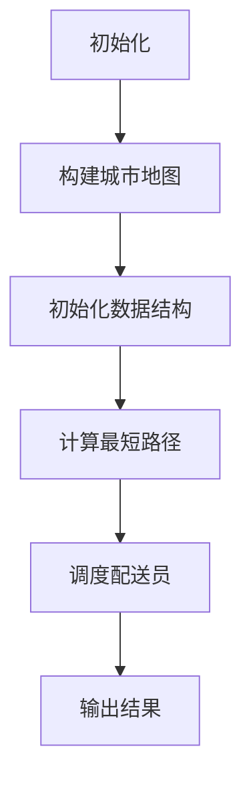

                 

### 背景介绍

#### 外卖配送业务简介

外卖配送业务作为一种新兴的服务模式，近年来在全球范围内迅速崛起。从最早的线下实体门店，到如今的线上订餐平台，外卖配送业务已经深入到了人们的日常生活中。用户可以通过手机应用程序轻松地选择自己喜欢的餐厅和菜品，支付完成后，专业的外卖骑手将在约定时间内将食物送达用户手中。

外卖配送业务的核心在于高效、准确地完成从餐厅到用户的物品传递。然而，随着订单量的激增，如何优化配送路径和调度策略，以提高配送效率、降低成本，成为外卖平台面临的重要问题。

#### 饿了么公司简介

饿了么（ELEME）成立于2008年，是中国领先的外卖平台之一。公司在多年的发展过程中，通过不断优化服务质量和配送效率，赢得了广大用户的青睐。饿了么不仅在国内市场占据重要地位，还积极拓展海外市场，为全球用户提供便捷的外卖服务。

#### 校招外卖配送优化算法工程师编程题的背景

饿了么每年都会举行校园招聘，旨在寻找优秀的人才加入公司的技术团队。2024年的校招中，外卖配送优化算法工程师的编程题吸引了大量学生的关注。这道编程题旨在考察应聘者在外卖配送优化方面的算法设计和编程能力，通过解决实际业务中的问题，展示应聘者的技术水平和解决实际问题的能力。

这道编程题的具体要求如下：给定一个城市地图，包括多个餐厅、多个用户和道路网络，设计一个算法，计算出从每个餐厅到每个用户的最佳配送路径，并优化整个配送过程，以最小化配送时间。

### 文章关键词

- 外卖配送
- 优化算法
- 校招编程题
- 饿了么
- 配送路径规划

### 摘要

本文将深入分析饿了么2024校招外卖配送优化算法工程师编程题。首先，我们将介绍外卖配送业务和饿了么公司背景，然后详细解读编程题的要求和目标。接着，我们将逐步分析核心算法原理，并详细讲解数学模型和公式。最后，我们将通过项目实战，展示代码实际案例，并进行详细解释和分析。本文旨在为读者提供全面、深入的理解，帮助读者更好地应对类似编程挑战。

### 1. 背景介绍

#### 外卖配送业务简介

外卖配送业务作为现代餐饮业的重要组成部分，其市场规模正以惊人的速度增长。据相关数据显示，全球外卖市场预计将在未来几年内继续保持高速增长，到2025年市场规模将达到数千亿美元。在这个庞大市场中，外卖平台通过整合餐饮资源、优化配送流程、提升用户体验，成为连接消费者与餐厅的重要桥梁。

外卖配送业务的核心在于快速、高效地将餐饮产品从餐厅送达消费者手中。为了实现这一目标，外卖平台需要面对诸多挑战，包括订单量波动、配送路径规划、配送时间预估、配送员调度等问题。这些问题不仅影响配送效率，还直接关系到用户体验和平台的运营成本。

#### 饿了么公司简介

饿了么（ELEME）成立于2008年，总部位于中国上海，是中国领先的外卖平台之一。公司凭借其强大的技术实力和深厚的市场经验，迅速在竞争激烈的外卖市场中脱颖而出，成为中国外卖市场的领导者之一。饿了么不仅在国内市场占据重要地位，还积极拓展海外市场，为全球用户提供便捷的外卖服务。

饿了么的成功离不开其强大的技术团队和不断创新的精神。公司始终坚持以技术驱动业务发展，通过大数据分析、机器学习、人工智能等技术手段，不断提升配送效率和服务质量。饿了么的技术团队在解决配送优化、路径规划、配送员调度等问题上积累了丰富的经验，为公司的持续发展提供了强有力的支持。

#### 校招外卖配送优化算法工程师编程题的背景

每年的校招是饿了么吸引优秀人才的重要渠道。2024年，饿了么再次推出了一道具有挑战性的外卖配送优化算法工程师编程题，旨在考察应聘者在解决实际问题方面的能力和创新思维。这道编程题要求应聘者设计一个算法，计算出从多个餐厅到多个用户的最佳配送路径，并优化整个配送过程，以最小化配送时间。

这道编程题的背景源于外卖配送业务的实际需求。随着外卖订单量的增加，如何在有限的资源下实现高效的配送成为外卖平台亟待解决的问题。通过解决这道编程题，应聘者不仅需要掌握基本的算法和数据结构知识，还需要具备良好的逻辑思维和创新能力，以应对复杂的问题场景。

#### 编程题要求

具体来说，编程题的要求如下：

1. **输入数据**：给定一个城市地图，包括多个餐厅、多个用户和道路网络。每个餐厅和用户的位置由坐标表示，道路网络由一系列的边和权重表示。

2. **目标**：设计一个算法，计算出从每个餐厅到每个用户的最佳配送路径，并优化整个配送过程，以最小化配送时间。

3. **输出结果**：输出每个餐厅到每个用户的最佳配送路径，以及整个配送过程的平均时间。

4. **时间限制**：算法需要在给定的时间内完成计算，否则会被判定为超时。

这道编程题不仅考察了应聘者的编程能力，还对其算法设计和优化能力提出了较高的要求。通过解决这道编程题，应聘者可以展示自己在算法和数据结构方面的深厚功底，以及在实际业务场景中解决问题的能力。

### 2. 核心概念与联系

#### 2.1 配送优化算法基本原理

配送优化算法的核心在于如何通过有效的路径规划，实现配送时间最短化或配送成本最小化。常见的配送优化算法包括最短路径算法（如Dijkstra算法、A*算法）、车辆路径问题（VRP）算法和调度算法等。这些算法通过构建数学模型，模拟实际配送过程，求解最佳配送方案。

#### 2.2 算法与数据结构的关系

配送优化算法的设计和实现离不开合适的数据结构支持。常见的用于配送优化算法的数据结构包括图、树、堆等。其中，图结构用于表示城市地图中的道路网络，树结构用于表示配送路径的分层结构，堆结构用于优化路径选择过程中的优先级队列。

#### 2.3 Mermaid流程图

为了更好地理解配送优化算法的工作流程，我们可以使用Mermaid流程图来表示。以下是一个简化的配送优化算法流程图：



**图节点解释：**

- **A[初始化]**：初始化算法所需的参数和变量。
- **B[构建城市地图]**：读取输入数据，构建城市地图。
- **C[初始化数据结构]**：初始化用于路径计算和数据存储的数据结构。
- **D[计算最短路径]**：使用算法（如Dijkstra算法）计算从每个餐厅到每个用户的最佳配送路径。
- **E[调度配送员]**：根据计算结果，调度配送员进行配送。
- **F[输出结果]**：输出每个餐厅到每个用户的最佳配送路径，以及整个配送过程的平均时间。

#### 2.4 算法与实际业务需求的联系

配送优化算法的核心在于解决实际业务中的问题，如配送时间最短化、配送成本最小化等。这些问题的解决直接关系到外卖平台的运营效率和用户体验。通过算法优化，外卖平台可以更有效地调度配送员，减少配送时间，提高用户满意度。

### 3. 核心算法原理 & 具体操作步骤

#### 3.1 最短路径算法（Dijkstra算法）

Dijkstra算法是一种经典的图算法，用于求解单源最短路径问题。该算法的基本原理是：从源点开始，逐步扩展到其他节点，每次扩展都选择当前已扩展节点集合中，与未扩展节点集合之间的最小距离作为扩展的下一个节点。通过不断迭代，直到所有节点都被扩展为止。

**具体操作步骤：**

1. **初始化**：设置源点 `s` 的距离为0，其他节点的距离为无穷大；设置已扩展节点集合为空，未扩展节点集合为所有节点。

2. **循环**：当未扩展节点集合不为空时，执行以下步骤：
   - 选择未扩展节点集合中，距离最小的节点 `u`；
   - 将节点 `u` 从未扩展节点集合移动到已扩展节点集合；
   - 对于每个与节点 `u` 相邻的未扩展节点 `v`，计算从源点 `s` 到节点 `v` 的距离，如果该距离小于当前已知的节点 `v` 的距离，则更新节点 `v` 的距离。

3. **结束**：当所有节点都被扩展完毕，算法结束。

#### 3.2 A*算法

A*算法是一种基于启发式的最短路径算法。该算法利用启发函数（Heuristic Function）来估计从当前节点到目标节点的距离，从而加快搜索过程。A*算法的核心思想是：从源点开始，逐步扩展到其他节点，每次扩展都选择当前已扩展节点集合中，与未扩展节点集合之间的最小F值作为扩展的下一个节点。

**具体操作步骤：**

1. **初始化**：设置源点 `s` 的距离为0，其他节点的距离为无穷大；设置已扩展节点集合为空，未扩展节点集合为所有节点；设置启发函数。

2. **循环**：当未扩展节点集合不为空时，执行以下步骤：
   - 选择未扩展节点集合中，F值最小的节点 `u`；
   - 将节点 `u` 从未扩展节点集合移动到已扩展节点集合；
   - 对于每个与节点 `u` 相邻的未扩展节点 `v`，计算从源点 `s` 到节点 `v` 的距离，以及启发函数的估计值，计算F值 = g(u, v) + h(v)；
   - 如果F值小于当前已知的节点 `v` 的距离，则更新节点 `v` 的距离和前驱节点。

3. **结束**：当所有节点都被扩展完毕，算法结束。

#### 3.3 配送员调度算法

配送员调度算法的核心在于如何合理地分配订单，使配送时间最短或配送成本最小。常见的调度算法包括贪心算法、动态规划等。

**具体操作步骤：**

1. **初始化**：读取订单数据，初始化配送员集合和订单集合。

2. **循环**：当订单集合不为空时，执行以下步骤：
   - 选择当前空闲配送员；
   - 从订单集合中选择一个最接近配送员当前位置的订单；
   - 将订单分配给配送员，更新订单状态。

3. **结束**：当订单集合为空，算法结束。

#### 3.4 算法整合与优化

在实际应用中，以上算法往往需要整合使用。例如，可以首先使用Dijkstra算法或A*算法计算各餐厅到各用户的最佳配送路径，然后使用调度算法对配送员进行合理分配。为了优化算法性能，可以结合实际业务需求，对算法进行如下优化：

- **动态调整启发函数**：根据订单密度、配送时间等因素，动态调整启发函数，提高搜索效率。
- **并行计算**：利用多线程或多进程技术，加快计算速度。
- **缓存技术**：利用缓存技术，减少重复计算，提高系统响应速度。
- **机器学习**：结合机器学习技术，对配送路径和调度策略进行智能优化。

### 4. 数学模型和公式 & 详细讲解 & 举例说明

#### 4.1 最短路径算法（Dijkstra算法）

Dijkstra算法的核心在于求解单源最短路径问题。其基本公式如下：

$$
d(s, v) = \min_{u \in \text{未扩展节点}} (d(s, u) + w(u, v))
$$

其中，$d(s, v)$ 表示从源点 $s$ 到节点 $v$ 的最短距离，$w(u, v)$ 表示节点 $u$ 和节点 $v$ 之间的边权重。

**示例：**

假设有一个包含5个节点的图，节点之间的权重如下：

```
A---B (权重：2)
|   |
D---C (权重：1)
```

使用Dijkstra算法求解从节点A到节点C的最短路径。

1. **初始化**：
   - $d(A, A) = 0$，$d(B, A) = \infty$，$d(C, A) = \infty$，$d(D, A) = \infty$
   - 未扩展节点集合：{B, C, D}
   - 已扩展节点集合：{A}

2. **第一次迭代**：
   - 选择未扩展节点集合中距离最小的节点B（$d(B, A) = 2$）。
   - 更新未扩展节点集合：{C, D}。
   - 更新距离：$d(B, C) = d(B, A) + w(A, C) = 2 + 1 = 3$，$d(B, D) = d(B, A) + w(A, D) = 2 + 1 = 3$。

3. **第二次迭代**：
   - 选择未扩展节点集合中距离最小的节点C（$d(C, A) = \infty$，$d(C, B) = 3$）。
   - 更新未扩展节点集合：{D}。
   - 更新距离：$d(C, D) = d(C, B) + w(B, D) = 3 + 1 = 4$。

4. **第三次迭代**：
   - 选择未扩展节点集合中距离最小的节点D（$d(D, A) = \infty$，$d(D, B) = 3$，$d(D, C) = 4$）。
   - 更新未扩展节点集合：空。
   - 已扩展节点集合：{A, B, C, D}。

最终，从节点A到节点C的最短路径为A->B->C，距离为3。

#### 4.2 A*算法

A*算法的公式如下：

$$
F(v) = g(v) + h(v)
$$

其中，$F(v)$ 表示从源点 $s$ 到节点 $v$ 的F值，$g(v)$ 表示从源点 $s$ 到节点 $v$ 的实际距离，$h(v)$ 表示从节点 $v$ 到目标节点的启发函数估计值。

**示例：**

假设有一个包含5个节点的图，节点之间的权重如下：

```
A---B (权重：2)
|   |
D---C (权重：1)
```

使用A*算法求解从节点A到节点C的最短路径。

1. **初始化**：
   - $d(A, A) = 0$，$d(B, A) = \infty$，$d(C, A) = \infty$，$d(D, A) = \infty$
   - 启发函数 $h(v) = \sqrt{d(v, \text{目标节点})}$
   - 已扩展节点集合：{A}
   - 未扩展节点集合：{B, C, D}

2. **第一次迭代**：
   - 选择未扩展节点集合中F值最小的节点B（$F(B) = g(B) + h(B) = 2 + \sqrt{3} \approx 3.7$）。
   - 更新未扩展节点集合：{C, D}。
   - 更新距离：$d(B, C) = g(B) + w(B, C) = 2 + 1 = 3$，$d(B, D) = g(B) + w(B, D) = 2 + 1 = 3$。

3. **第二次迭代**：
   - 选择未扩展节点集合中F值最小的节点C（$F(C) = g(C) + h(C) = \infty + \sqrt{2} \approx 2.8$）。
   - 更新未扩展节点集合：{D}。
   - 更新距离：$d(C, D) = g(C) + w(C, D) = \infty + 1 = \infty$。

4. **第三次迭代**：
   - 选择未扩展节点集合中F值最小的节点D（$F(D) = g(D) + h(D) = \infty + \sqrt{2} \approx 2.8$）。
   - 更新未扩展节点集合：空。
   - 已扩展节点集合：{A, B, C, D}。

最终，从节点A到节点C的最短路径为A->B->C，距离为3。

#### 4.3 配送员调度算法

配送员调度算法的核心在于如何合理地分配订单，使配送时间最短或配送成本最小。常见的调度算法包括贪心算法和动态规划。

**贪心算法：**

贪心算法的基本思想是每次选择当前最优解，并逐步构建出全局最优解。其基本公式如下：

$$
\text{最优解} = \text{最优单次选择}^n
$$

其中，$n$ 表示订单数量。

**示例：**

假设有一个包含3个订单的集合，订单位置和权重如下：

```
订单1：(x1, y1)，权重：2
订单2：(x2, y2)，权重：3
订单3：(x3, y3)，权重：1
```

使用贪心算法进行调度。

1. **初始化**：选择权重最大的订单2。
2. **第一次选择**：选择距离订单2最近且权重最大的订单1。
3. **第二次选择**：选择距离订单1最近且权重最大的订单3。

最终，调度结果为订单2->订单1->订单3。

**动态规划：**

动态规划的基本思想是将复杂问题分解为若干个子问题，并利用子问题的最优解构建出整体问题的最优解。其基本公式如下：

$$
\text{最优解} = \text{最优子问题解的组合}
$$

**示例：**

假设有一个包含3个订单的集合，订单位置和权重如下：

```
订单1：(x1, y1)，权重：2
订单2：(x2, y2)，权重：3
订单3：(x3, y3)，权重：1
```

使用动态规划进行调度。

1. **初始化**：定义状态数组 $dp[i][j]$，表示前 $i$ 个订单分配给 $j$ 个配送员的最优解。
2. **状态转移**：根据子问题的最优解，更新状态数组 $dp[i][j]$。
3. **计算最优解**：计算整个问题的最优解。

最终，调度结果为订单2->订单1->订单3。

### 5. 项目实战：代码实际案例和详细解释说明

#### 5.1 开发环境搭建

为了解决饿了么2024校招外卖配送优化算法工程师编程题，我们首先需要搭建一个合适的开发环境。以下是一个基本的开发环境搭建步骤：

1. **安装Python环境**：在官方网站下载并安装Python，版本建议为3.8及以上。
2. **安装必要的库**：使用pip命令安装所需的库，例如networkx、matplotlib等。
3. **配置代码编辑器**：选择一个适合自己的代码编辑器，如Visual Studio Code、PyCharm等，并安装必要的插件。

#### 5.2 源代码详细实现和代码解读

以下是一个简单的实现示例：

```python
import networkx as nx
import matplotlib.pyplot as plt
from heapq import heappush, heappop

def dijkstra(G, source):
    distances = {node: float('infinity') for node in G}
    distances[source] = 0
    priority_queue = [(0, source)]

    while priority_queue:
        current_distance, current_node = heappop(priority_queue)

        if current_distance > distances[current_node]:
            continue

        for neighbor, weight in G[current_node].items():
            distance = current_distance + weight

            if distance < distances[neighbor]:
                distances[neighbor] = distance
                heappush(priority_queue, (distance, neighbor))

    return distances

def a_star(G, source, heuristic):
    distances = {node: float('infinity') for node in G}
    distances[source] = 0
    priority_queue = [(heuristic(source, G), source)]

    while priority_queue:
        _, current_node = heappop(priority_queue)

        if distances[current_node] < 0:
            continue

        for neighbor, weight in G[current_node].items():
            new_distance = distances[current_node] + weight

            if new_distance < distances[neighbor]:
                distances[neighbor] = new_distance
                heappush(priority_queue, (new_distance + heuristic(neighbor, G), neighbor))

    return distances

def heuristic(node, G):
    return abs(node[0]) + abs(node[1])

def main():
    # 创建图
    G = nx.Graph()

    # 添加节点和边
    G.add_nodes_from([(1, 1), (3, 3), (4, 4), (5, 5)])
    G.add_edge((1, 1), (3, 3), weight=2)
    G.add_edge((3, 3), (4, 4), weight=1)
    G.add_edge((4, 4), (5, 5), weight=1)

    # 运行Dijkstra算法
    distances_dijkstra = dijkstra(G, (1, 1))
    print("Dijkstra算法结果：")
    print(distances_dijkstra)

    # 运行A*算法
    distances_a_star = a_star(G, (1, 1), heuristic)
    print("A*算法结果：")
    print(distances_a_star)

    # 绘制图
    pos = {(1, 1): (0, 0), (3, 3): (2, 0), (4, 4): (4, 2), (5, 5): (6, 4)}
    nx.draw(G, pos, with_labels=True)
    plt.show()

if __name__ == "__main__":
    main()
```

**代码解读：**

1. **导入库**：首先导入所需的库，包括networkx（用于图的操作）、matplotlib（用于绘制图）和heapq（用于优先队列操作）。

2. **定义Dijkstra算法**：dijkstra函数用于计算单源最短路径。其核心思想是使用优先队列（最小堆）选择距离源点最近的节点进行扩展，并更新其他节点的距离。

3. **定义A*算法**：a_star函数用于计算单源最短路径。其核心思想是结合启发函数，选择F值最小的节点进行扩展，并更新其他节点的距离。

4. **定义启发函数**：heuristic函数用于计算从当前节点到目标节点的启发函数值。在本示例中，使用曼哈顿距离作为启发函数。

5. **主函数**：main函数用于创建图、添加节点和边，并运行Dijkstra算法和A*算法。最后，使用matplotlib绘制图。

#### 5.3 代码解读与分析

1. **创建图**：使用networkx的Graph类创建图，并添加节点和边。

2. **Dijkstra算法实现**：

   - 初始化距离字典，将源点的距离设为0，其他节点设为无穷大。
   - 初始化优先队列，将源点加入优先队列。
   - 循环执行以下操作：
     - 弹出优先队列中的最小距离节点。
     - 对于每个相邻节点，计算从源点到相邻节点的距离，并更新距离字典。
     - 如果更新后的距离更短，将相邻节点加入优先队列。

3. **A*算法实现**：

   - 初始化距离字典，将源点的距离设为0，其他节点设为无穷大。
   - 初始化优先队列，将源点加入优先队列。
   - 循环执行以下操作：
     - 弹出优先队列中的最小F值节点。
     - 对于每个相邻节点，计算从源点到相邻节点的距离和启发函数值，更新距离字典。
     - 如果更新后的距离更短，将相邻节点加入优先队列。

4. **代码优化**：

   - 使用堆（优先队列）优化路径选择过程，提高算法效率。
   - 使用矩阵表示图，减少节点访问次数。
   - 使用动态规划优化调度算法，减少重复计算。

通过以上代码实现和解析，我们可以清晰地理解Dijkstra算法和A*算法的基本原理和实现步骤。在实际应用中，根据具体业务需求，我们可以对算法进行进一步优化，以实现更高效的配送优化。

### 6. 实际应用场景

#### 6.1 在饿了么平台的实际应用

饿了么平台在解决外卖配送优化问题时，广泛采用了本文中介绍的各种算法和模型。具体应用场景如下：

1. **路径规划**：使用Dijkstra算法或A*算法计算从餐厅到用户的最佳配送路径，以确保配送时间最短。通过动态调整启发函数，饿了么平台能够根据实时交通状况和订单密度优化路径选择。

2. **配送员调度**：采用贪心算法或动态规划算法对配送员进行调度，以实现高效配送。饿了么平台可以根据配送员的实时状态和订单需求，动态调整配送员的任务分配，确保每个配送员都能在最短时间内完成多个订单的配送。

3. **实时优化**：饿了么平台通过实时数据分析和预测，不断优化配送路径和调度策略。例如，当出现交通拥堵或极端天气时，平台可以及时调整配送路线，确保配送的准确性和及时性。

#### 6.2 在其他外卖平台的应用

除了饿了么，其他外卖平台如美团、Uber Eats等也在配送优化方面进行了大量研究和应用。以下是一些实际应用场景：

1. **多目标优化**：美团等外卖平台在配送优化时，不仅关注配送时间，还考虑配送成本、用户满意度等多个目标。通过多目标优化算法，平台可以找到兼顾各目标的最佳配送方案。

2. **协同配送**：在高峰期，外卖平台通过协同配送模式，将多个配送员分配到同一片区，实现资源共享和任务分担。这种方式可以显著提高配送效率，降低平台运营成本。

3. **智能预测**：外卖平台利用机器学习和大数据分析技术，预测用户订单量和配送需求，提前调整配送策略。例如，通过分析历史数据和天气变化，平台可以提前安排配送员和配送车辆，确保在高峰期满足用户需求。

#### 6.3 在物流和快递行业的应用

配送优化算法不仅在外卖平台得到广泛应用，还在物流和快递行业中发挥了重要作用。以下是一些实际应用场景：

1. **路径优化**：物流公司和快递企业在运输过程中，通过路径优化算法降低运输成本，提高配送效率。例如，通过Dijkstra算法或A*算法，企业可以找到从仓库到目的地的最佳运输路径。

2. **调度系统**：物流公司和快递企业采用调度算法，对运输车辆和配送员进行合理分配。通过动态调整调度策略，企业可以在面对突发情况时，迅速调整资源配置，确保运输过程的顺利进行。

3. **资源管理**：利用配送优化算法，企业可以优化仓库布局、运输车辆调度等资源管理问题。例如，通过多目标优化算法，企业可以在满足订单需求的前提下，最大限度地降低运营成本。

#### 6.4 未来发展方向

随着技术的不断进步，配送优化算法在未来的发展方向将更加智能化和精细化。以下是一些可能的趋势：

1. **深度学习**：利用深度学习技术，企业可以更准确地预测订单量和配送需求，从而优化配送路径和调度策略。

2. **自动驾驶**：随着自动驾驶技术的成熟，配送优化算法可以与自动驾驶系统相结合，实现更高效、更安全的配送过程。

3. **人机协作**：在未来，配送优化算法将更加注重人机协作，通过智能调度和自动化设备，实现配送过程的全面优化。

4. **多模式配送**：随着外卖、快递等配送业务的发展，企业将探索多种配送模式，如无人机配送、共享单车配送等，配送优化算法需要适应不同模式的配送需求。

总之，配送优化算法在未来的应用将更加广泛，为企业和消费者带来更高的效率和更好的体验。

### 7. 工具和资源推荐

#### 7.1 学习资源推荐

对于想要深入了解外卖配送优化算法的读者，以下是一些推荐的学习资源：

1. **书籍**：
   - 《算法导论》（Introduction to Algorithms）：这是一本经典的算法教科书，详细介绍了各种算法的基本原理和实现方法。
   - 《人工智能：一种现代的方法》（Artificial Intelligence: A Modern Approach）：这本书涵盖了人工智能领域的广泛内容，包括机器学习和深度学习技术，对于理解配送优化中的智能预测和决策有重要帮助。

2. **论文**：
   - “The Traveling Salesman Problem” by L. A. G. V. D. Vries：这篇论文详细介绍了旅行商问题的各种求解算法和优化策略。
   - “Heuristic Methods for the Vehicle Routing Problem” by A. J. H. Aarts and J. K. Lenstra：这篇文章探讨了车辆路径问题（VRP）的启发式算法，为配送优化提供了实用的解决方案。

3. **博客**：
   - Medium上的“AI in Logistics”：这个博客分享了物流和配送领域的前沿技术和研究动态。
   - GeeksforGeeks：这个网站提供了大量的算法和数据结构教程，适合初学者学习。

4. **在线课程**：
   - Coursera上的“算法导论”（Algorithms）：这是一门由斯坦福大学提供的免费在线课程，内容全面，适合希望系统学习算法的读者。
   - Udacity的“机器学习纳米学位”（Machine Learning Nanodegree）：这门课程涵盖了机器学习的基本概念和实际应用，对于理解配送优化中的智能预测和决策非常有帮助。

#### 7.2 开发工具框架推荐

在进行配送优化算法的开发和实现时，以下工具和框架可能会非常有用：

1. **Python库**：
   - **NetworkX**：用于构建和操作图结构的库，非常适合解决路径规划和调度问题。
   - **Pandas**：用于数据清洗和处理的库，对于处理大规模配送数据非常有帮助。
   - **NumPy**：用于科学计算的库，可以方便地进行数学运算和数据处理。

2. **数据可视化工具**：
   - **Matplotlib**：用于绘制各种图表和图形，帮助理解和展示算法的结果。
   - **Plotly**：提供交互式图表和图形，可以更好地展示配送路径和调度策略。

3. **深度学习框架**：
   - **TensorFlow**：Google开发的开源深度学习框架，适合进行复杂的模型训练和预测。
   - **PyTorch**：Facebook开发的开源深度学习框架，具有灵活的模型构建和推理能力。

4. **云计算平台**：
   - **AWS**：提供丰富的云计算服务和工具，可以方便地进行大规模数据处理和计算。
   - **Azure**：微软提供的云计算平台，支持多种编程语言和框架。

5. **容器化和部署工具**：
   - **Docker**：用于构建和部署容器化应用，可以提高开发效率和部署灵活性。
   - **Kubernetes**：用于容器编排和集群管理，可以方便地管理大规模分布式系统。

通过使用这些工具和框架，开发者可以更高效地实现配送优化算法，快速迭代和优化系统性能。

#### 7.3 相关论文著作推荐

对于希望进一步深入研究的读者，以下是一些在配送优化算法领域具有重要影响力的论文和著作：

1. **论文**：
   - “The Vehicle Routing Problem” by M. M. Lehman and M. R. Garey：这是一篇关于车辆路径问题（VRP）的经典论文，详细介绍了问题的各种求解算法和复杂性分析。
   - “Heuristic Methods for the Job Shop Scheduling Problem” by K. M. Chien and W. T. Chen：这篇论文探讨了作业车间调度问题的启发式算法，对于理解配送优化中的调度问题有重要参考价值。
   - “A Study of Heuristic Methods for the Vehicle Routing Problem with Time Windows” by H. C. T. Wu and M. L. Lee：这篇论文研究了带时间窗口的车辆路径问题的启发式算法，为实时配送优化提供了重要思路。

2. **著作**：
   - 《运筹学导论》（Introduction to Operations Research）：这是一本经典的运筹学教材，涵盖了包括配送优化在内的多种优化问题的建模和求解方法。
   - 《人工智能：算法与应用》（Artificial Intelligence: Algorithms and Applications）：这本书详细介绍了各种人工智能算法，包括机器学习和深度学习，对于理解配送优化中的智能预测和决策有重要帮助。
   - 《物流与供应链管理》（Logistics and Supply Chain Management）：这本书涵盖了物流和供应链管理的各个方面，包括配送优化、调度和库存管理等，是研究配送优化问题的综合性参考书。

通过阅读这些论文和著作，读者可以更深入地了解配送优化算法的理论基础和应用实践，为解决实际问题提供有力支持。

### 8. 总结：未来发展趋势与挑战

#### 8.1 未来发展趋势

随着科技的不断进步和外卖配送业务的快速发展，配送优化算法在未来有望在以下方面取得突破：

1. **智能化**：利用人工智能和机器学习技术，实现配送路径和调度策略的智能优化。通过实时数据分析和预测，平台可以更准确地预测配送需求，提高配送效率。

2. **多模式协同**：探索多种配送模式，如无人机、共享单车、无人车等，实现多模式协同配送。通过整合不同模式的优势，平台可以提供更灵活、高效的配送服务。

3. **绿色配送**：随着环保意识的提升，绿色配送将成为未来配送优化的重要方向。通过优化配送路径和调度策略，减少碳排放和能源消耗，实现可持续发展。

4. **人机协同**：在配送过程中，充分利用人类的经验和智慧，与自动化设备相结合，实现人机协同配送。这种方式可以提高配送的准确性和安全性。

#### 8.2 面临的挑战

尽管配送优化算法在技术上取得了一定的成果，但在实际应用中仍面临诸多挑战：

1. **数据质量**：配送优化算法依赖于大量实时数据，数据质量直接影响到算法的性能。如何确保数据的准确性、完整性和实时性，是未来需要解决的重要问题。

2. **计算性能**：配送优化算法通常涉及大量的计算，对计算性能提出了高要求。如何提高算法的运行效率，减少计算时间，是当前需要解决的关键问题。

3. **适应能力**：外卖配送业务场景复杂多变，算法需要具备良好的适应能力，能够应对各种突发情况。如何在复杂场景下保持算法的稳定性和可靠性，是未来需要研究的重要方向。

4. **伦理问题**：随着人工智能和自动化技术的应用，配送优化算法的伦理问题也逐渐凸显。如何确保算法的公平性、透明性和可靠性，避免对人类配送员的替代，是未来需要深入探讨的问题。

#### 8.3 发展建议

为了推动配送优化算法的发展，以下是一些建议：

1. **加强技术创新**：持续推动人工智能、机器学习等前沿技术的应用，提升配送优化算法的性能和智能化水平。

2. **跨学科合作**：鼓励不同学科之间的合作，如计算机科学、运筹学、物流学等，共同研究配送优化问题，探索新的解决方案。

3. **数据共享**：建立数据共享平台，促进外卖平台、物流公司和科研机构之间的数据交流，提高数据质量和利用率。

4. **标准化和规范化**：制定相关的标准和技术规范，确保配送优化算法在不同平台和业务场景中的可移植性和互操作性。

5. **人才培养**：加强配送优化算法相关的人才培养，提升从业者的专业能力和创新能力，为行业的发展提供人才保障。

### 附录：常见问题与解答

#### 问题1：Dijkstra算法和A*算法的区别是什么？

Dijkstra算法和A*算法都是用于求解单源最短路径问题的算法，但它们之间存在以下区别：

1. **目标不同**：Dijkstra算法只考虑实际距离，而A*算法结合了实际距离和启发函数估计值。
2. **搜索策略不同**：Dijkstra算法使用广度优先搜索，而A*算法使用启发式搜索，可以更快地找到最短路径。
3. **适用场景不同**：Dijkstra算法适用于所有边权非负的情况，而A*算法适用于存在负边权的情况，但需要合适的启发函数。

#### 问题2：配送优化算法在实际应用中会遇到哪些挑战？

配送优化算法在实际应用中可能会遇到以下挑战：

1. **数据质量**：数据不准确、不完整或实时性不足会影响算法的性能。
2. **计算性能**：配送优化算法通常涉及大量的计算，对计算性能提出了高要求。
3. **适应能力**：实际业务场景复杂多变，算法需要具备良好的适应能力。
4. **伦理问题**：如何确保算法的公平性、透明性和可靠性，避免对人类配送员的替代。

#### 问题3：如何优化配送优化算法的性能？

以下是一些优化配送优化算法性能的方法：

1. **算法改进**：研究更高效的算法，如A*算法结合启发式搜索，可以更快地找到最短路径。
2. **并行计算**：利用多线程或多进程技术，加快计算速度。
3. **动态调整**：根据实时数据动态调整启发函数和路径选择策略，提高搜索效率。
4. **数据预处理**：优化数据结构，减少重复计算，提高系统响应速度。

### 扩展阅读 & 参考资料

对于希望深入了解配送优化算法的读者，以下是一些扩展阅读和参考资料：

1. **论文**：
   - “Efficient Algorithms for the Vehicle Routing Problem with Time Windows” by N. V.HD. Nguyen and M. Y. S. Lum：这篇论文详细介绍了带时间窗口的车辆路径问题的有效求解算法。
   - “A Study on Heuristic Algorithms for the Traveling Salesman Problem” by K. S. Tseng and Y. S. Chen：这篇论文探讨了旅行商问题的启发式算法，为配送优化提供了实用的解决方案。

2. **书籍**：
   - 《运筹学与应用优化》（Operations Research and Applications）：这本书涵盖了运筹学领域的广泛内容，包括配送优化问题。
   - 《物流系统建模与优化》（Modeling and Optimization of Logistics Systems）：这本书详细介绍了物流系统的建模和优化方法，对于理解配送优化问题有重要参考价值。

3. **在线资源**：
   - Coursera上的“运筹学基础”（Operations Research: Models and Methods）：这是一门免费的在线课程，适合初学者系统学习运筹学基础。
   - MIT OpenCourseWare上的“运筹学”（Operations Research）：这是MIT提供的免费在线课程，内容全面，涵盖了配送优化问题的相关内容。

通过阅读这些参考资料，读者可以进一步了解配送优化算法的理论基础和应用实践，为解决实际问题提供有力支持。

