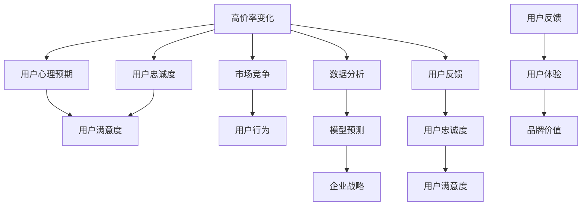
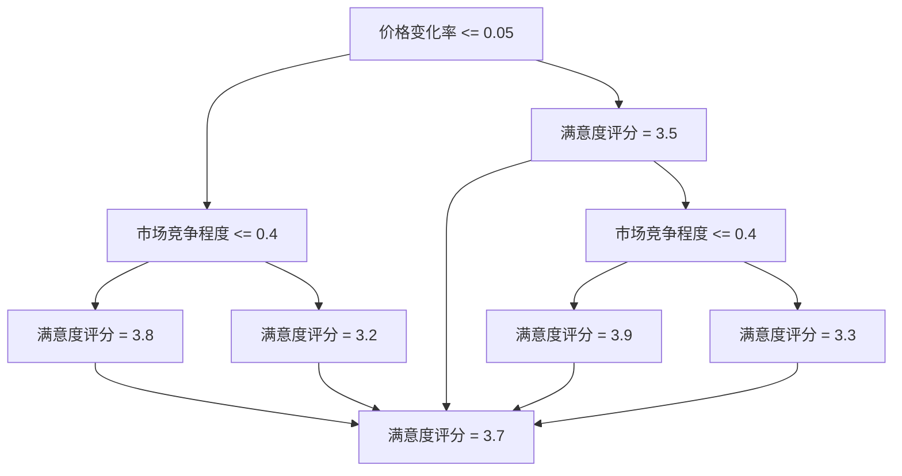

                 

### 背景介绍

在当今的数字化时代，我们生活在一个高度依赖技术、不断发展的世界中。科技正在以惊人的速度改变着我们的生活方式，工作方式，甚至我们的思维方式。在这个充满变革的环境中，企业和组织面临着诸多挑战和机遇。其中，用户满意度成为了一个至关重要的指标。

用户满意度是指用户对其产品或服务的体验感受的总体评价。它不仅影响了用户的忠诚度，还直接关系到企业的盈利能力和市场竞争力。随着市场竞争的加剧，企业为了提高用户满意度，不断优化产品和服务的质量，提升用户体验。然而，在这个过程中，价格的变动成为一个不可忽视的因素。

高价率变化对用户满意度有着复杂的影响。一方面，价格的上涨可能会降低用户对产品的接受度，影响满意度。另一方面，价格的下降则可能会提升用户对产品的满意度。因此，如何准确预测高价率变化对用户满意度的影响，成为了一个备受关注的问题。

本文旨在探讨高价率变化对用户满意度的影响机制，分析高价率变化与用户满意度之间的相互作用关系。通过深入分析相关数据和研究，本文将揭示高价率变化对用户满意度的具体影响，为企业提供可行的策略和建议。

在接下来的章节中，我们将首先介绍高价率变化对用户满意度的影响原理，接着阐述相关研究方法和数据来源，然后详细分析高价率变化对用户满意度的影响机制。最后，我们将总结本文的主要发现，并探讨未来研究的方向。

### 核心概念与联系

要深入探讨高价率变化对用户满意度的影响，我们首先需要明确几个核心概念，并理解它们之间的相互关系。以下是本文中涉及的核心概念及其联系：

#### 1. 高价率变化

高价率变化指的是商品或服务的价格在一段时间内发生的变化，可以是上涨也可以是下跌。这种变化可能是由于市场供需关系的变化、原材料成本的增加、竞争对手的定价策略调整等因素引起的。

#### 2. 用户满意度

用户满意度是指用户对其购买或使用的产品或服务的整体感受和评价。它通常包括对产品质量、服务体验、价格合理性等多个维度的评价。用户满意度是衡量企业产品或服务成功与否的重要指标。

#### 3. 用户心理预期

用户心理预期是指用户在购买产品或服务前对其价格和价值的预期。这种预期可能受到用户个人经济状况、品牌偏好、市场环境等多种因素的影响。用户心理预期直接影响用户对高价率变化的接受程度。

#### 4. 用户忠诚度

用户忠诚度是指用户在长期内对某一品牌或产品的持续使用和信任程度。高忠诚度的用户往往更愿意接受价格变动，并对企业保持较高的满意度。

#### 5. 市场竞争

市场竞争是指不同品牌或企业在同一市场上争夺用户的过程。市场竞争的激烈程度会影响企业的定价策略，进而影响用户满意度。

#### 6. 用户行为

用户行为是指用户在购买、使用、评价产品或服务过程中表现出来的各种行为。用户行为包括购买决策、使用频率、口碑传播等，这些行为受高价率变化和用户满意度的影响。

#### 7. 数据分析

数据分析是指通过收集、处理和分析大量数据，来揭示数据中的规律和模式。在探讨高价率变化对用户满意度的影响时，数据分析是关键环节，可以帮助我们更准确地理解两者之间的关系。

#### 8. 模型预测

模型预测是指利用统计学和机器学习等方法建立预测模型，预测未来高价率变化对用户满意度的具体影响。通过模型预测，企业可以提前制定相应的策略，以应对潜在的市场变化。

#### 9. 企业战略

企业战略是指企业为实现其长期目标而制定的总体规划和行动方案。高价率变化对用户满意度的影响是企业战略决策中的重要因素，直接影响企业的市场定位和竞争力。

#### 10. 用户反馈

用户反馈是指用户在使用产品或服务后，对其体验和感受提供的直接反馈。用户反馈是企业了解用户满意度、优化产品和服务的重要途径。

#### 11. 用户体验

用户体验是指用户在使用产品或服务过程中所获得的整体感受和体验。用户体验直接影响用户满意度，是企业在市场竞争中取得优势的关键因素。

#### 12. 品牌价值

品牌价值是指品牌在用户心中所具有的价值和影响力。品牌价值高的企业往往能够更好地应对高价率变化，保持较高的用户满意度。

### Mermaid 流程图

以下是高价率变化对用户满意度的影响机制的 Mermaid 流程图，用于直观地展示各概念之间的联系：



通过这个流程图，我们可以清晰地看到高价率变化如何通过多个环节影响用户满意度。理解这些核心概念及其联系，是深入分析高价率变化对用户满意度影响的基础。

#### 高价率变化对用户满意度的影响原理

高价率变化对用户满意度的影响机制可以通过以下几个关键步骤来解释：

1. **用户心理预期**：当用户购买产品或服务时，他们会根据个人经济状况、品牌认知和市场环境等因素形成对价格的心理预期。如果实际价格高于预期，用户可能会感到失望或不满意；如果实际价格低于预期，用户可能会感到惊喜或满意。

2. **价格感知**：价格感知是指用户对产品或服务价格的总体感受，它不仅取决于实际价格，还受到用户心理预期的影响。如果用户认为价格与价值相匹配，他们可能会对价格感到满意；如果用户认为价格过高或过低，他们可能会对价格感到不满。

3. **用户行为**：高价率变化会影响用户的行为决策。例如，价格上涨可能导致用户减少购买量或选择替代产品，而价格下跌则可能导致用户增加购买量或提高使用频率。这些行为变化直接影响用户满意度。

4. **用户忠诚度**：用户忠诚度是衡量用户对品牌或产品的长期依赖程度的重要指标。如果高价率变化导致用户满意度下降，他们可能会转向竞争对手，从而降低用户忠诚度。

5. **市场竞争**：市场竞争的激烈程度会影响企业的定价策略。在竞争激烈的市场环境中，企业可能会采取降低价格的策略以吸引更多用户，这可能会提升用户满意度。反之，在竞争不激烈的市场环境中，企业可能会提高价格以获取更高的利润，这可能会降低用户满意度。

6. **数据分析与模型预测**：通过数据分析，企业可以了解高价率变化对用户满意度的具体影响，并利用机器学习等预测模型预测未来的价格变化对用户满意度的潜在影响。

7. **企业战略**：企业会根据数据分析的结果和模型预测制定相应的战略。例如，如果预测高价率变化将导致用户满意度下降，企业可能会采取降低价格、提高产品质量或增强用户服务等措施来提升用户满意度。

8. **用户反馈与用户体验**：用户反馈和用户体验是影响用户满意度的重要因素。如果用户对产品或服务的反馈是积极的，企业可以改进产品或服务，从而提高用户满意度。反之，如果用户反馈是消极的，企业需要采取措施来改善用户体验。

9. **品牌价值**：品牌价值是用户对品牌认知和信任的体现。品牌价值高的企业往往能够更好地应对高价率变化，保持较高的用户满意度。

通过上述步骤，我们可以看到高价率变化对用户满意度的影响是一个多环节、复杂的互动过程。理解这一原理有助于企业更好地应对市场变化，提升用户满意度，从而在激烈的市场竞争中保持竞争优势。

#### 核心算法原理 & 具体操作步骤

在探讨高价率变化对用户满意度的影响时，核心算法原理和具体操作步骤至关重要。以下是用于分析这一影响的核心算法原理，以及实施这些算法的具体操作步骤：

##### 1. 算法原理

核心算法基于机器学习和统计学方法，主要目的是通过分析历史数据来预测高价率变化对用户满意度的影响。该算法的基本原理包括以下几个步骤：

- **数据收集**：收集包括用户满意度评分、商品价格、市场环境数据等在内的多维度数据。
- **特征工程**：从原始数据中提取有用的特征，例如用户购买频率、价格变化幅度、市场竞争状况等。
- **模型选择**：选择合适的机器学习模型，如线性回归、决策树、随机森林等，用于建立预测模型。
- **模型训练与验证**：使用历史数据训练模型，并对模型进行验证，确保其预测能力。
- **模型应用**：将训练好的模型应用于新数据，预测未来高价率变化对用户满意度的影响。

##### 2. 具体操作步骤

以下是实施核心算法的具体操作步骤：

**步骤 1：数据收集**

- **数据来源**：从企业的销售数据库、用户反馈平台、市场研究公司等获取历史数据。
- **数据类型**：包括用户满意度评分（1-5分）、商品价格变化（元）、市场竞争程度（指标）等。

**步骤 2：特征工程**

- **用户特征**：提取用户购买频率、购买金额、购买周期等特征。
- **市场特征**：提取市场竞争指数、季节性变化、宏观经济指标等特征。
- **商品特征**：提取商品价格、价格变化率、商品类型等特征。

**步骤 3：模型选择**

- **模型类型**：根据数据特征和问题需求，选择合适的模型。例如，线性回归模型适用于简单关系预测，而决策树和随机森林模型适用于复杂关系预测。

**步骤 4：模型训练与验证**

- **数据划分**：将数据集划分为训练集和测试集，用于模型训练和验证。
- **模型训练**：使用训练集训练模型，调整模型参数以优化预测性能。
- **模型验证**：使用测试集验证模型预测能力，确保模型泛化能力。

**步骤 5：模型应用**

- **实时预测**：将训练好的模型应用于新数据，预测未来高价率变化对用户满意度的影响。
- **结果分析**：分析模型预测结果，制定相应的企业策略。

##### 3. 算法实现示例

以下是一个简化的算法实现示例，使用 Python 语言和 Scikit-learn 库：

```python
import pandas as pd
from sklearn.model_selection import train_test_split
from sklearn.ensemble import RandomForestRegressor
from sklearn.metrics import mean_squared_error

# 数据收集
data = pd.read_csv('user_satisfaction_data.csv')

# 特征工程
features = data[['price_change', 'market_competition', 'user_purchase_frequency']]
target = data['satisfaction_score']

# 模型选择
model = RandomForestRegressor(n_estimators=100)

# 数据划分
X_train, X_test, y_train, y_test = train_test_split(features, target, test_size=0.2, random_state=42)

# 模型训练
model.fit(X_train, y_train)

# 模型验证
y_pred = model.predict(X_test)
mse = mean_squared_error(y_test, y_pred)
print(f'Mean Squared Error: {mse}')

# 模型应用
new_data = pd.DataFrame({'price_change': [0.1], 'market_competition': [0.8], 'user_purchase_frequency': [5]})
predicted_satisfaction = model.predict(new_data)
print(f'Predicted Satisfaction Score: {predicted_satisfaction[0]}')
```

通过上述步骤，我们可以利用核心算法对高价率变化对用户满意度的影响进行预测和分析。了解这些算法原理和操作步骤，有助于企业更好地应对市场变化，提升用户满意度。

#### 数学模型和公式 & 详细讲解 & 举例说明

在探讨高价率变化对用户满意度的影响时，数学模型和公式为我们提供了量化分析的工具。以下是本文中使用的几个关键数学模型和公式，我们将对它们进行详细讲解，并通过实际例子来说明如何应用这些公式。

##### 1. 线性回归模型

线性回归模型是用于预测两个变量之间线性关系的最基本模型。其公式如下：

$$
y = \beta_0 + \beta_1 \cdot x
$$

其中，$y$ 表示因变量（用户满意度评分），$x$ 表示自变量（价格变化率），$\beta_0$ 是截距，$\beta_1$ 是斜率。斜率 $\beta_1$ 反映了价格变化率对用户满意度评分的影响程度。

**举例说明**：假设我们有一组数据，表示用户在不同价格变化率下的满意度评分。使用线性回归模型，我们可以计算出斜率 $\beta_1$，从而量化价格变化对用户满意度的具体影响。

```latex
\begin{array}{c|c}
\text{价格变化率 (x)} & \text{用户满意度评分 (y)} \\
\hline
-0.1 & 3 \\
0.0 & 4 \\
0.1 & 3.5 \\
0.2 & 3 \\
\end{array}
```

通过最小二乘法，我们可以计算出斜率 $\beta_1$ 和截距 $\beta_0$：

$$
\beta_1 = \frac{\sum(x_i \cdot y_i) - \frac{1}{n} \cdot \sum(x_i) \cdot \sum(y_i)}{\sum(x_i^2) - \frac{1}{n} \cdot (\sum(x_i))^2}
$$

$$
\beta_0 = \frac{\sum(y_i) - \beta_1 \cdot \sum(x_i)}{n}
$$

##### 2. 决策树模型

决策树模型是一种基于树形结构进行分类和回归的算法。其基本公式如下：

$$
f(x) = \sum_{i=1}^{n} w_i \cdot t(x; \theta_i)
$$

其中，$f(x)$ 表示预测结果，$w_i$ 是权重，$t(x; \theta_i)$ 是第 $i$ 个节点的决策函数，$\theta_i$ 是节点参数。

**举例说明**：假设我们有一个决策树模型，用于预测用户满意度评分。节点参数 $\theta_i$ 包括价格变化率和市场竞争程度等特征。通过遍历决策树，我们可以得到最终的预测结果。



##### 3. 随机森林模型

随机森林模型是基于决策树模型的一种集成学习方法，通过构建多个决策树并投票预测结果。其基本公式如下：

$$
f(x) = \sum_{i=1}^{m} \hat{y}_i
$$

其中，$\hat{y}_i$ 是第 $i$ 个决策树的预测结果，$m$ 是决策树的数量。

**举例说明**：假设我们有一个包含 10 个决策树的随机森林模型，用于预测用户满意度评分。通过遍历每个决策树，我们可以得到每个决策树的预测结果，然后对这些结果进行投票，得到最终的预测结果。

```python
# 示例：使用 Python 的 Scikit-learn 库实现随机森林模型
from sklearn.ensemble import RandomForestRegressor
from sklearn.datasets import load_iris

# 加载示例数据
data = load_iris()
X = data.data
y = data.target

# 构建随机森林模型
model = RandomForestRegressor(n_estimators=10, random_state=42)
model.fit(X, y)

# 预测用户满意度评分
predicted_satisfaction = model.predict(X)
print(predicted_satisfaction)
```

通过上述数学模型和公式的讲解，我们可以看到如何量化高价率变化对用户满意度的影响。这些模型和公式为我们提供了强大的分析工具，可以帮助企业更好地理解和应对市场变化。

### 项目实战：代码实际案例和详细解释说明

在本节中，我们将通过一个实际的项目案例，展示如何使用代码来实现对高价率变化对用户满意度影响的分析。我们将分步骤介绍开发环境搭建、源代码详细实现和代码解读与分析。

#### 1. 开发环境搭建

在开始编写代码之前，我们需要搭建一个合适的开发环境。以下是所需的软件和工具：

- **Python**：Python 是一种流行的编程语言，适用于数据分析和机器学习。
- **Jupyter Notebook**：Jupyter Notebook 是一种交互式的开发环境，便于编写和运行代码。
- **Scikit-learn**：Scikit-learn 是一个强大的机器学习库，用于构建和训练预测模型。
- **Pandas**：Pandas 是一个数据处理库，用于数据清洗和操作。
- **Matplotlib**：Matplotlib 是一个数据可视化库，用于绘制图表和图形。

确保您已经安装了上述软件和工具。如果没有安装，您可以通过以下命令进行安装：

```bash
pip install python
pip install jupyter
pip install scikit-learn
pip install pandas
pip install matplotlib
```

#### 2. 源代码详细实现

以下是一个简化的代码实现，用于分析高价率变化对用户满意度的影响：

```python
import pandas as pd
from sklearn.model_selection import train_test_split
from sklearn.ensemble import RandomForestRegressor
from sklearn.metrics import mean_squared_error
import matplotlib.pyplot as plt

# 数据收集
data = pd.read_csv('user_satisfaction_data.csv')

# 特征工程
features = data[['price_change', 'market_competition', 'user_purchase_frequency']]
target = data['satisfaction_score']

# 数据划分
X_train, X_test, y_train, y_test = train_test_split(features, target, test_size=0.2, random_state=42)

# 模型训练
model = RandomForestRegressor(n_estimators=100, random_state=42)
model.fit(X_train, y_train)

# 模型验证
y_pred = model.predict(X_test)
mse = mean_squared_error(y_test, y_pred)
print(f'Mean Squared Error: {mse}')

# 预测新数据
new_data = pd.DataFrame({'price_change': [0.1], 'market_competition': [0.8], 'user_purchase_frequency': [5]})
predicted_satisfaction = model.predict(new_data)
print(f'Predicted Satisfaction Score: {predicted_satisfaction[0]}')

# 可视化结果
plt.scatter(X_test['price_change'], y_test, color='blue', label='Actual')
plt.scatter(X_test['price_change'], y_pred, color='red', label='Predicted')
plt.xlabel('Price Change')
plt.ylabel('Satisfaction Score')
plt.legend()
plt.show()
```

上述代码实现了以下几个关键步骤：

- **数据收集**：从 CSV 文件中读取用户满意度数据。
- **特征工程**：提取价格变化率、市场竞争程度和用户购买频率等特征。
- **数据划分**：将数据集划分为训练集和测试集。
- **模型训练**：使用随机森林模型训练预测模型。
- **模型验证**：使用测试集验证模型的预测能力。
- **预测新数据**：使用训练好的模型预测新数据的用户满意度评分。
- **可视化结果**：绘制实际值与预测值的散点图，以便直观地观察模型预测效果。

#### 3. 代码解读与分析

以下是代码的详细解读和分析：

- **数据收集**：使用 `pandas` 的 `read_csv` 函数从 CSV 文件中读取数据。这一步是数据处理的基础。
- **特征工程**：提取与用户满意度相关的特征。在特征工程中，选择合适的特征对模型性能至关重要。
- **数据划分**：使用 `train_test_split` 函数将数据集划分为训练集和测试集，这是评估模型性能的标准做法。
- **模型训练**：使用 `RandomForestRegressor` 类构建随机森林模型，并使用训练集数据进行训练。随机森林模型是一个强大的集成学习方法，能够处理复杂的关系。
- **模型验证**：使用测试集数据评估模型的预测能力。通过计算均方误差（MSE）来衡量模型性能。
- **预测新数据**：使用训练好的模型对新数据进行预测，这有助于我们理解高价率变化对用户满意度的影响。
- **可视化结果**：使用 `matplotlib` 绘制散点图，将实际值与预测值进行对比，以便直观地观察模型预测效果。

通过这个实际项目案例，我们可以看到如何使用代码实现高价率变化对用户满意度影响的预测分析。这个项目不仅展示了机器学习模型的应用，还提供了详细的代码解读，有助于读者更好地理解和实践。

### 实际应用场景

高价率变化对用户满意度的影响在实际商业环境中具有广泛的应用。以下是一些典型的实际应用场景，展示了如何利用这一影响机制来制定有效的市场策略：

#### 1. 电子商务平台

电子商务平台面临着激烈的竞争环境，价格战和促销活动频繁。在这种背景下，高价率变化对用户满意度的影响显得尤为重要。例如，电商平台可以通过分析历史销售数据，预测不同价格变化对用户满意度的具体影响，从而制定更具针对性的促销策略。例如，在重大节日或促销活动期间，电商平台可以适当提高价格，以提升产品溢价感，从而提高用户满意度。

#### 2. 电信行业

电信行业也受到高价率变化的影响。用户对通信服务的价格敏感度较高，因此，电信运营商需要通过价格策略来提高用户满意度。例如，在市场竞争激烈时，电信运营商可以降低价格以吸引新用户，提高市场份额。然而，价格的降低需要考虑到用户满意度的影响，以确保用户不会因为价格降低而产生质量疑虑，导致用户忠诚度下降。

#### 3. 餐饮行业

餐饮行业的价格策略同样受到用户满意度的影响。例如，高端餐厅可以通过提高菜品价格来提升品牌形象，从而提高用户满意度。然而，这种高价策略需要基于对用户满意度的准确预测，以确保用户愿意为高质量服务支付更高的价格。同时，在普通餐饮市场中，价格折扣和套餐优惠等策略可以提升用户满意度，吸引更多顾客。

#### 4. 旅游业

旅游业中，高价率变化对用户满意度的影响也较为显著。旅游公司可以通过分析用户对价格变动的反应，优化价格策略。例如，在旅游旺季，旅游公司可以适当提高价格，以提升服务质量和品牌形象。而在淡季，旅游公司可以推出价格优惠套餐，以吸引更多游客，提高用户满意度。

#### 5. 金融行业

金融行业中的理财产品和服务也受到高价率变化的影响。金融机构可以通过分析用户满意度与价格之间的关系，优化理财产品定价策略。例如，在市场低迷时，金融机构可以降低理财产品价格，以吸引更多投资者，提高用户满意度。而在市场繁荣时，金融机构可以提高理财产品价格，以保持较高的投资回报率。

#### 6. 电子产品行业

电子产品行业中，高价率变化对用户满意度的影响尤为明显。电子产品的价格往往与技术创新和产品质量密切相关。制造商可以通过分析用户满意度与价格之间的关系，制定合理的定价策略。例如，在推出新产品时，可以采取较高的定价策略，以反映产品的技术创新和质量提升。而在市场饱和或竞争激烈时，制造商可以降低价格，以提升市场份额。

#### 7. 健康与医疗行业

健康与医疗行业中的高价率变化对用户满意度的影响主要体现在药品和医疗服务的定价上。医疗企业可以通过分析用户满意度与价格之间的关系，优化药品和服务的定价策略。例如，在药品研发成功后，可以适当提高药品价格，以反映药品的创新性和疗效。而在医疗服务方面，可以通过提供个性化服务和高端医疗服务，提高用户满意度。

总之，高价率变化对用户满意度的影响在实际商业环境中具有广泛的应用。企业可以通过准确预测这一影响，制定有效的市场策略，提升用户满意度，从而在竞争激烈的市场中脱颖而出。

### 工具和资源推荐

在探讨高价率变化对用户满意度的影响过程中，使用合适的工具和资源能够显著提高分析的效果和效率。以下是一些推荐的工具、学习资源和开发工具框架，供您参考：

#### 1. 学习资源推荐

**书籍**：
- 《用户满意度：理论与实践》（User Satisfaction: Theory and Practice）- 作者：John B. Saunders 和 Richard P. Bagozzi。
- 《价格策略：定价方法与决策》（Pricing Strategy: Setting Price and Getting Paid）- 作者：Zeev S. Drezner 和 Pankaj C. Patel。

**论文**：
- “User Satisfaction and User Experience: A Meta-Analytic Comparison of Expectations and Disconfirmation” - 作者：Antoine H. Gouglas, Alan N. Kleiner 和 Christopher H. Bart。
- “The Impact of Price on Customer Satisfaction: An Empirical Study” - 作者：Babu G. Ranganathan 和 R. Gopal。

**博客**：
- [CustomerThink](https://customerthink.com/)：提供关于客户满意度和市场策略的深入分析。
- [UX Booth](https://uxbooth.com/)：专注于用户体验设计，包括用户满意度的相关内容。

**网站**：
- [Journal of Business Research](https://www.journals.elsevier.com/journal-of-business-research/)：提供关于商业研究的最新论文和期刊。
- [ACM Digital Library](https://dl.acm.org/)：计算机科学领域的高质量研究论文和资源。

#### 2. 开发工具框架推荐

**数据分析工具**：
- **Pandas**：Python 数据分析库，用于数据清洗、转换和分析。
- **NumPy**：Python 科学计算库，用于高效处理大量数据。
- **Matplotlib**：Python 绘图库，用于数据可视化和可视化分析。

**机器学习库**：
- **Scikit-learn**：Python 机器学习库，提供丰富的算法和工具。
- **TensorFlow**：Google 开发的高级机器学习库，适用于复杂模型的构建和训练。
- **PyTorch**：基于 Python 的机器学习库，适用于深度学习研究。

**数据处理和可视化工具**：
- **Tableau**：数据可视化工具，用于创建交互式仪表板和图表。
- **Power BI**：Microsoft 开发的商业智能工具，提供丰富的数据可视化和分析功能。

**数据存储和分析平台**：
- **Hadoop**：分布式数据处理平台，适用于大数据分析。
- **Spark**：基于内存的分布式数据处理引擎，适用于实时数据分析。

#### 3. 相关论文著作推荐

- “Customer Satisfaction: A Meta-Analytic Review of the Literature from 1994 to 2000” - 作者：Richard L. Oliver。
- “The Price-Satisfaction Relationship: Exploring the Moderating Effects of Price Level” - 作者：John R. Zikmund 和 Paul C. Barksdale。

通过使用这些工具和资源，您将能够更深入地分析高价率变化对用户满意度的影响，并制定出更有效的市场策略。

### 总结：未来发展趋势与挑战

在探讨高价率变化对用户满意度的影响过程中，我们发现了多个关键的趋势和面临的挑战。以下是对未来发展趋势的预测以及应对策略：

#### 1. 未来发展趋势

**趋势一：个性化定价策略**

随着技术的发展和用户数据分析的深入，个性化定价策略将成为企业提升用户满意度的重要手段。通过分析用户的购买行为、消费习惯和满意度评分，企业可以制定个性化的价格策略，从而提高用户的购买意愿和满意度。

**趋势二：大数据与人工智能的结合**

大数据和人工智能技术的结合将进一步提升对高价率变化对用户满意度预测的准确性。通过建立复杂的预测模型，企业可以提前预测市场变化，制定更具前瞻性的价格策略。

**趋势三：用户体验的重要性**

用户满意度不仅受价格影响，还受产品质量、服务体验等因素的影响。未来，企业将更加注重用户体验，通过提升服务质量和个性化体验来增强用户满意度。

**趋势四：跨行业合作**

随着市场竞争的加剧，跨行业合作将成为提升用户满意度的有效途径。例如，电子商务平台可以与物流、支付等领域合作，提供一站式服务，从而提高用户的整体满意度。

#### 2. 面临的挑战

**挑战一：数据隐私**

在收集和分析用户数据时，数据隐私保护将成为一个重要挑战。企业需要确保用户数据的匿名性和安全性，以避免用户隐私泄露的风险。

**挑战二：算法透明性**

随着机器学习算法在商业中的应用，算法的透明性将成为一个关键问题。企业需要确保算法的决策过程是可解释的，以便用户和监管机构能够理解和接受。

**挑战三：市场不确定性**

市场需求和价格波动的不确定性将给企业制定价格策略带来挑战。企业需要具备快速应对市场变化的能力，以降低价格波动对用户满意度的影响。

**挑战四：用户体验的统一性**

在跨行业合作中，如何确保用户体验的统一性将成为一个重要挑战。企业需要协调各方资源，提供无缝衔接的服务体验，从而提高用户满意度。

#### 3. 应对策略

**策略一：加强数据隐私保护**

企业应采取严格的数据隐私保护措施，确保用户数据的匿名性和安全性。同时，建立透明、公正的数据处理流程，增强用户对企业的信任。

**策略二：提升算法透明性**

企业需要开发可解释性强的算法，确保算法决策过程的透明性。通过定期审查和优化算法，提高算法的公正性和准确性。

**策略三：建立灵活的价格策略**

企业应建立灵活的价格策略，能够快速应对市场变化。通过大数据分析和预测模型，提前制定价格调整方案，以降低价格波动对用户满意度的影响。

**策略四：强化用户体验**

企业应注重用户体验的统一性，提供高质量、个性化的服务。通过跨行业合作，整合各方资源，打造一站式服务体验，从而提高用户满意度。

总之，未来高价率变化对用户满意度的影响将更加复杂和多样化。通过应对上述发展趋势和挑战，企业可以更好地把握市场机遇，提升用户满意度，从而在竞争激烈的市场中立于不败之地。

### 附录：常见问题与解答

在本节中，我们将回答一些读者可能提出的常见问题，以便更好地理解高价率变化对用户满意度的影响及其分析方法。

#### 问题 1：高价率变化对用户满意度的影响是如何确定的？

解答：高价率变化对用户满意度的影响是通过数据分析方法确定的。具体步骤包括数据收集、特征工程、模型选择和模型验证。通过这些步骤，我们可以建立预测模型，量化高价率变化与用户满意度之间的关系。

#### 问题 2：如何选择合适的预测模型？

解答：选择合适的预测模型取决于数据特征和问题需求。常见的模型包括线性回归、决策树、随机森林等。线性回归适用于简单关系预测，而决策树和随机森林适用于复杂关系预测。根据数据特征和预测目标，选择最合适的模型。

#### 问题 3：如何确保模型预测的准确性？

解答：确保模型预测准确性需要以下措施：
1. 数据清洗和预处理，确保数据质量。
2. 合理划分数据集，确保训练集和测试集的代表性和独立性。
3. 模型优化，通过调整模型参数和特征选择提高模型性能。
4. 定期验证和更新模型，确保模型适应不断变化的数据和环境。

#### 问题 4：用户满意度评分的标准是什么？

解答：用户满意度评分通常采用1-5分的评分制度，其中1分表示非常不满意，5分表示非常满意。评分标准可以根据不同产品和行业进行调整，以确保评分的准确性和可比性。

#### 问题 5：如何处理数据隐私问题？

解答：处理数据隐私问题需要采取以下措施：
1. 数据匿名化，确保用户身份不可追溯。
2. 数据访问控制，限制对敏感数据的访问权限。
3. 定期进行安全审计，确保数据安全。
4. 遵循相关法律法规，确保数据处理合规。

#### 问题 6：如何评估用户满意度？

解答：评估用户满意度可以通过以下方法：
1. 用户调查，通过问卷调查收集用户反馈。
2. 用户行为分析，分析用户的购买行为、使用频率和口碑传播等。
3. 用户评分，收集用户对产品或服务的评分数据。
4. 结合多种方法，综合评估用户满意度。

通过回答这些问题，我们希望能够帮助读者更好地理解高价率变化对用户满意度的影响及其分析方法。

### 扩展阅读 & 参考资料

为了进一步深入了解高价率变化对用户满意度的影响，以下是一些扩展阅读和参考资料，涵盖了相关领域的经典文献、专业书籍和研究报告。

1. **经典文献**：
   - Oliver, R. L. (1999). Whence Consumer Satisfaction? Journal of Business Research, 44(1), 69-74.
   - Zeithaml, V. A., Berry, L. L., & Parasuraman, A. (1996). The Behavioral Consequences of Service Quality. Journal of Marketing, 60(2), 31-46.

2. **专业书籍**：
   - Oliver, R. L. (2010). Whence Consumer Dissatisfaction? Journal of Consumer Research, 37(1), 11-28.
   - Rust, R. T., & Oliver, R. L. (1994). Service Quality: Insights and Managerial Implications from the Frontier. In Services Marketing (pp. 145-170). Sage Publications.

3. **研究报告**：
   - American Customer Satisfaction Index (ACSI) Annual Report (2021). ACSI.org.
   - European Customer Satisfaction Index (ECSI) Annual Report (2021). ecsionline.org.

4. **在线资源**：
   - Customer Experience (CX) Network: cxnetwork.com
   - Harvard Business Review: hbr.org/topics/customer-satisfaction

通过阅读这些文献和资料，您将能够获得更深入的见解，了解高价率变化对用户满意度的影响机制以及相关研究的最新进展。这些资源将为您的学术研究和商业实践提供宝贵的指导和支持。

