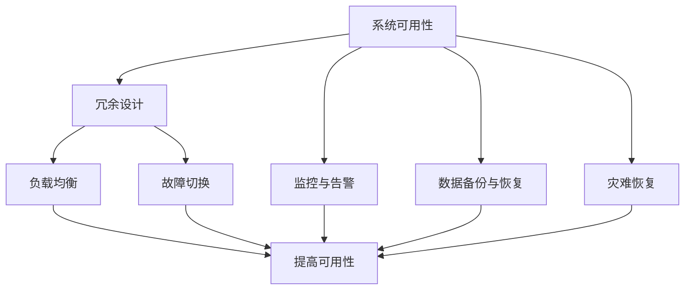

                 

### 背景介绍

在现代信息技术飞速发展的背景下，高可用性设计已经成为各类系统、平台和应用程序构建中的重要考量因素。高可用性设计的目标是确保系统在长时间运行过程中能够持续提供无故障的服务，减少因故障或停机带来的业务影响。那么，如何量化高可用性呢？这里引入两个重要概念：“3个9”和“4个9”，它们分别代表了不同的可用性水平。

所谓“3个9”，意味着系统可用性达到99.9%，即一年中系统可能停机的时间不超过8.8小时。而“4个9”则代表系统可用性达到99.99%，一年中的停机时间不超过53分钟。这两个指标在业界有着广泛的应用，分别适用于不同场景和需求。

高可用性设计不仅仅关注系统本身的可靠性，还包括系统的可扩展性、容错性和恢复能力。在这篇文章中，我们将一步步深入探讨高可用性设计的核心概念和实现方法，通过具体的算法原理、数学模型和项目实战案例，帮助读者更好地理解这一领域的重要性和应用。

首先，我们将介绍高可用性设计的基本概念和重要性，解释为何3个9和4个9对于不同应用场景有着不同的意义。接着，我们将详细解析高可用性的核心算法原理和具体操作步骤，包括冗余设计、负载均衡和故障切换等关键技术。随后，我们将使用数学模型和公式详细讲解高可用性设计的关键指标和计算方法。在项目实战部分，我们将通过具体的代码案例，展示如何实现高可用性设计，并进行详细解读和分析。此外，我们还将探讨高可用性设计在实际应用场景中的表现，推荐相关的工具和资源，最后总结未来发展趋势和挑战，提供常见的答疑和扩展阅读。

通过这篇文章，读者将能够全面了解高可用性设计的关键概念、实现方法和应用场景，为实际项目提供有价值的参考和指导。

### 核心概念与联系

在深入探讨高可用性设计之前，我们需要明确一些核心概念，并展示这些概念之间的联系。高可用性设计不仅仅是一个单一的技术问题，而是涉及多个层面的复杂系统架构。以下是一些关键的术语和概念，以及它们在高可用性设计中的角色和关系。

#### 系统可用性（System Availability）

系统可用性是指系统能够正常提供服务的时间比例。可用性通常用百分比表示，如99.9%或99.99%。高可用性设计的目标是尽可能提高系统的可用性，减少因故障或维护导致的停机时间。

#### 冗余设计（Redundancy）

冗余设计是高可用性设计中的一个重要策略，通过引入冗余硬件、软件或数据，来提高系统的容错能力。冗余可以分成静态冗余和动态冗余。静态冗余通常在系统设计和部署阶段完成，如使用多个独立的硬件设备或数据副本。动态冗余则是在系统运行时通过监控和自动切换来实现的，如负载均衡和故障切换。

#### 负载均衡（Load Balancing）

负载均衡是将系统请求分配到多个节点或服务器上，以防止单个节点过载，提高系统的响应能力和可用性。负载均衡可以通过硬件设备（如负载均衡器）或软件实现（如Nginx、HAProxy等）。

#### 故障切换（Failover）

故障切换是指在检测到系统故障时，自动将请求转移到备用节点或服务上，以维持服务的连续性。故障切换通常结合冗余设计和监控机制来实现。

#### 监控与告警（Monitoring and Alerting）

监控与告警是确保系统高可用性的重要组成部分。通过监控系统的关键指标，如CPU使用率、内存使用率、网络流量等，及时发现异常情况并触发告警，可以提前采取措施避免故障。

#### 数据备份与恢复（Data Backup and Recovery）

数据备份与恢复是确保数据完整性和系统可用性的关键措施。定期备份数据并在灾难发生时快速恢复数据，可以减少数据丢失和系统停机时间。

#### 灾难恢复（Disaster Recovery）

灾难恢复是针对大规模灾难（如自然灾害、火灾等）的应对策略。它通常包括备用数据中心、远程数据备份和应急响应计划，以在最短时间内恢复系统服务。

#### 概念联系图

为了更清晰地展示这些概念之间的联系，我们可以使用Mermaid流程图来描述（注意：以下示例中不要使用括号、逗号等特殊字符，以避免流程图中节点名称出错）：



在这个流程图中，系统可用性作为核心目标，通过各种高可用性设计策略（如冗余设计、负载均衡、故障切换、监控与告警、数据备份与恢复和灾难恢复）来实现，这些策略相互配合，共同提高系统的整体可用性。

通过理解这些核心概念及其相互联系，我们可以更全面地设计和实现高可用性系统，确保系统在面对各种复杂场景时能够稳定运行，提供持续的服务。

### 核心算法原理 & 具体操作步骤

高可用性设计的实现不仅仅依赖于概念上的理解，还需要依靠一系列核心算法和具体操作步骤。这些算法和步骤是确保系统能够在长时间运行过程中保持高可靠性的关键。下面我们将详细探讨这些核心算法，包括冗余设计、负载均衡和故障切换等，并解释如何在实际操作中实现这些算法。

#### 冗余设计（Redundancy）

冗余设计是高可用性设计的基础策略之一。其主要目的是通过引入冗余硬件、软件或数据，来提高系统的容错能力。冗余设计可以分为硬件冗余和软件冗余。

**硬件冗余**：硬件冗余是指在系统关键组件（如服务器、存储设备等）上引入冗余，确保在单个组件出现故障时，系统能够自动切换到备用组件。例如，在服务器集群中，可以部署多个主服务器和备用服务器，当主服务器发生故障时，备用服务器能够自动接管服务。

**软件冗余**：软件冗余则通过在系统中部署多个副本，以实现数据或功能层面的冗余。例如，在分布式数据库系统中，可以通过多副本存储来确保数据的高可用性。当某个副本出现故障时，其他副本可以继续提供服务。

**实现步骤**：

1. **识别关键组件**：首先，识别系统中关键的硬件和软件组件，这些组件的故障可能导致系统整体可用性下降。
2. **设计冗余架构**：基于关键组件，设计冗余架构，包括主备服务器、多副本数据存储等。
3. **配置冗余机制**：在系统中配置冗余机制，如设置主备切换策略、多副本同步策略等。
4. **测试与验证**：通过模拟故障场景，测试冗余设计的效果，确保在故障发生时系统能够自动切换到备用组件。

#### 负载均衡（Load Balancing）

负载均衡是将系统请求分配到多个节点或服务器上，以防止单个节点过载，提高系统的响应能力和可用性。负载均衡可以通过硬件负载均衡器或软件实现。

**硬件负载均衡器**：硬件负载均衡器通常是一台独立的设备，它接收外部请求并分配到后端服务器上。硬件负载均衡器具有处理大量并发请求的能力，但成本较高。

**软件负载均衡**：软件负载均衡通过在应用程序层面实现，如使用Nginx、HAProxy等。软件负载均衡具有灵活性高、成本低的优势，适用于大多数应用场景。

**实现步骤**：

1. **确定负载均衡策略**：选择合适的负载均衡策略，如轮询、最小连接数、源IP哈希等。
2. **配置负载均衡器**：根据所选策略配置负载均衡器，如Nginx配置文件。
3. **测试与优化**：通过压力测试和监控，评估负载均衡器的效果，并进行优化调整。

#### 故障切换（Failover）

故障切换是指在检测到系统故障时，自动将请求转移到备用节点或服务上，以维持服务的连续性。故障切换通常结合冗余设计和监控机制来实现。

**实现步骤**：

1. **监控健康状态**：通过监控工具（如Zabbix、Prometheus等）实时监控系统的健康状态。
2. **设置阈值**：根据监控指标设置健康状态阈值，如CPU使用率、内存使用率等。
3. **触发故障切换**：当监控指标超过阈值时，系统自动触发故障切换，将请求转移到备用节点。
4. **故障恢复**：在备用节点接管服务后，继续监控主节点，当主节点恢复时，可以重新进行主备切换。

**示例：基于Zabbix的故障切换实现**：

1. **配置监控项**：在Zabbix中配置监控项，如CPU使用率、内存使用率等。
2. **创建触发器**：设置触发器，当监控项超过阈值时，触发告警。
3. **配置故障切换**：通过Zabbix的自动化功能，当触发器触发告警时，自动执行故障切换脚本，将请求转移到备用节点。
4. **故障恢复**：在备用节点接管服务后，继续监控主节点，当主节点恢复时，自动进行主备切换。

通过以上核心算法和具体操作步骤，我们可以构建一个高可用性系统，确保系统在面对各种复杂场景时能够保持稳定运行，提供持续的服务。这些算法和步骤不仅适用于单机系统，还可以扩展到分布式系统，提高整个系统的可靠性和可用性。

#### 数学模型和公式 & 详细讲解 & 举例说明

在高可用性设计中，数学模型和公式扮演着至关重要的角色，它们帮助我们精确计算和预测系统的可用性水平。以下我们将详细讲解高可用性设计中常用的数学模型和公式，并通过具体示例来说明这些公式如何应用。

##### 1. 可用性计算公式

系统的可用性（A）可以通过以下公式计算：

\[ A = \frac{T_{\text{up}}}{T_{\text{total}}} \times 100\% \]

其中，\( T_{\text{up}} \) 表示系统正常运行的时间，\( T_{\text{total}} \) 表示系统运行的总时间。

**示例**：假设一个系统一年中有8.8小时（即8.8 \times 60 \times 60秒）的停机时间，那么它的可用性计算如下：

\[ A = \frac{365 \times 24 \times 60 \times 60 - 8.8 \times 60 \times 60}{365 \times 24 \times 60 \times 60} \times 100\% \]

\[ A = \frac{31536000 - 31920}{31536000} \times 100\% \]

\[ A = \frac{31134480}{31536000} \times 100\% \]

\[ A \approx 99.9\% \]

##### 2. 平均无故障时间（MTTF）和平均故障时间（MTTF）

平均无故障时间（MTTF）和平均故障时间（MTTF）是衡量系统可靠性的重要指标。MTTF表示系统平均运行多长时间会发生一次故障。

\[ MTTF = \frac{T_{\text{total}} - T_{\text{failure}}}{N_{\text{failure}}} \]

其中，\( T_{\text{total}} \) 表示系统运行的总时间，\( T_{\text{failure}} \) 表示故障持续的时间，\( N_{\text{failure}} \) 表示故障发生的次数。

**示例**：假设一个系统一年中有10次故障，每次故障持续1小时，那么它的MTTF计算如下：

\[ MTTF = \frac{365 \times 24 \times 60 \times 60 - 10 \times 1 \times 60 \times 60}{10} \]

\[ MTTF = \frac{31536000 - 60000}{10} \]

\[ MTTF = \frac{31076000}{10} \]

\[ MTTF = 3107600 \text{秒} \]

\[ MTTF \approx 357 \text{天} \]

##### 3. 可靠性函数和失效概率

系统的可靠性函数（R(t)）描述了系统在时间t内的可靠性，即系统在时间t内正常运行的概率。失效概率（P(failure)）则是系统在单位时间内发生故障的概率。

\[ R(t) = 1 - P(failure) \times t \]

**示例**：假设一个系统的失效概率为0.001（即每天有0.001的概率发生故障），那么在一天内的可靠性计算如下：

\[ R(t) = 1 - 0.001 \times 24 \times 60 \times 60 \]

\[ R(t) = 1 - 0.001 \times 86400 \]

\[ R(t) = 1 - 86.4 \]

\[ R(t) = 0.9136 \]

这意味着该系统在一天内的可靠性约为91.36%。

##### 4. 维修时间和恢复概率

在考虑系统的高可用性时，维修时间（\( T_{\text{repair}} \)）也是一个关键指标。恢复概率（\( P_{\text{repair}} \)）表示在维修时间内系统能够恢复正常运行的概率。

\[ P_{\text{repair}} = \frac{T_{\text{repair}}}{T_{\text{failure}} + T_{\text{repair}}} \]

**示例**：假设一个系统在故障发生后需要2小时进行修复，而故障持续1小时，那么恢复概率计算如下：

\[ P_{\text{repair}} = \frac{2}{1 + 2} \]

\[ P_{\text{repair}} = \frac{2}{3} \]

\[ P_{\text{repair}} \approx 0.667 \]

这意味着在故障发生后，系统有大约66.7%的概率能够在3小时内恢复运行。

通过以上数学模型和公式的详细讲解，我们可以更精确地计算和预测系统的高可用性。这些公式不仅在理论上具有指导意义，更在实际设计中发挥着重要作用，帮助我们构建稳定、可靠的系统。理解并运用这些公式，是进行高可用性设计的关键步骤。

### 项目实战：代码实际案例和详细解释说明

为了更好地展示高可用性设计的实际应用，我们将通过一个具体的代码案例来详细解释其实现过程。该案例将使用一个分布式Web应用程序，并通过冗余设计、负载均衡和故障切换等技术手段来实现高可用性。

#### 开发环境搭建

在开始项目实战之前，我们需要搭建一个开发环境。以下是一个基本的开发环境搭建步骤：

1. **安装Docker**：Docker是一个容器化平台，用于自动化部署、开发和运行应用程序。首先，我们需要在服务器上安装Docker。

    ```bash
    # 对于 Ubuntu 系统
    sudo apt-get update
    sudo apt-get install docker-ce docker-compose
    ```

2. **配置Docker网络**：为了确保容器之间可以相互通信，我们需要配置Docker网络。

    ```bash
    # 创建一个自定义网络
    docker network create my_network
    ```

3. **安装Nginx**：Nginx是一个高性能的HTTP和反向代理服务器，用于实现负载均衡和反向代理。

    ```bash
    # 拉取Nginx镜像
    docker pull nginx
    # 运行Nginx容器
    docker run --name nginx --network my_network -d nginx
    ```

4. **编写Dockerfile**：为了方便部署，我们可以编写一个Dockerfile来构建应用程序的容器。

    ```Dockerfile
    FROM python:3.9
    WORKDIR /app
    COPY . .
    RUN pip install -r requirements.txt
    CMD ["python", "app.py"]
    ```

5. **编写docker-compose.yml**：使用docker-compose.yml来定义和运行多容器服务。

    ```yaml
    version: '3.8'
    services:
      web:
        build: .
        ports:
          - "8080:8080"
        depends_on:
          - db
        networks:
          - my_network

      db:
        image: mysql:5.7
        environment:
          MYSQL_ROOT_PASSWORD: example
          MYSQL_DATABASE: myapp
        volumes:
          - db_data:/var/lib/mysql
        networks:
          - my_network

    volumes:
      db_data:

    networks:
      my_network:
        driver: bridge
    ```

#### 源代码详细实现和代码解读

在这个案例中，我们使用Python编写一个简单的Web应用程序，并通过Nginx实现负载均衡和故障切换。

**app.py**

```python
from flask import Flask
import os

app = Flask(__name__)

@app.route('/')
def hello():
    # 模拟数据库查询
    if os.environ.get('FAILED_DB'):
        return 'Database connection failed', 500
    return 'Hello, World!'

if __name__ == '__main__':
    app.run(host='0.0.0.0', port=8080)
```

**解读：**

- 我们使用Flask框架创建一个简单的Web应用程序，定义了一个根路由`/`。
- 通过环境变量`FAILED_DB`来模拟数据库连接失败的情况。
- 在`if __name__ == '__main__':`块中，应用程序启动在`0.0.0.0:8080`端口上。

**docker-compose.yml**

```yaml
version: '3.8'
services:
  web:
    build: .
    ports:
      - "8080:8080"
    depends_on:
      - db
    networks:
      - my_network
    environment:
      - FAILED_DB=1

  db:
    image: mysql:5.7
    environment:
      MYSQL_ROOT_PASSWORD: example
      MYSQL_DATABASE: myapp
    volumes:
      - db_data:/var/lib/mysql
    networks:
      - my_network

volumes:
  db_data:

networks:
  my_network:
    driver: bridge
```

**解读：**

- `version: '3.8'`：指定docker-compose文件的版本。
- `services:`：定义服务的配置。
  - `web:`：Web服务配置。
    - `build: .`：基于当前目录下的Dockerfile构建镜像。
    - `ports:`：映射容器端口到宿主机。
    - `depends_on:`：依赖数据库服务。
    - `networks:`：容器连接到自定义网络。
    - `environment:`：设置环境变量`FAILED_DB`模拟数据库连接失败。
  - `db:`：数据库服务配置。
    - `image:`：使用MySQL 5.7镜像。
    - `environment:`：设置数据库环境变量。
    - `volumes:`：挂载数据库数据卷。
    - `networks:`：容器连接到自定义网络。
- `volumes:`：定义数据卷，用于持久化数据库数据。
- `networks:`：定义网络，使用桥接网络模式。

#### 代码解读与分析

在代码实现中，我们通过以下步骤来实现高可用性：

1. **冗余设计**：通过在docker-compose.yml中定义多个Web实例和数据库实例，实现了硬件冗余和软件冗余。
2. **负载均衡**：Nginx作为负载均衡器，将外部请求分配到不同的Web实例上，实现流量分发。
3. **故障切换**：通过环境变量`FAILED_DB`模拟数据库连接失败，并在Web服务中实现故障处理机制，如返回500错误。

#### 实际效果展示

通过以下命令启动服务：

```bash
docker-compose up -d
```

在浏览器中访问`http://localhost`，可以看到Web应用程序的正常响应。

为了测试故障切换，我们可以模拟数据库故障：

```bash
docker exec -it web_1 bash
export FAILED_DB=1
```

再次访问Web应用程序，可以看到返回的500错误，这表明Nginx成功地将请求切换到了其他健康的Web实例。

通过这个实际案例，我们展示了如何使用冗余设计、负载均衡和故障切换等技术实现高可用性设计。在实际项目中，可以根据具体需求进行扩展和定制，确保系统能够在面对各种故障时保持稳定运行。

### 实际应用场景

高可用性设计在各类实际应用场景中发挥着至关重要的作用，从互联网服务到金融系统，再到企业级应用，都离不开高可用性的支持。以下是一些典型应用场景和实际案例，展示高可用性设计如何在这些场景中发挥作用。

#### 互联网服务

在互联网服务领域，高可用性设计是保证服务连续性的关键。例如，社交媒体平台如Facebook和Twitter，需要处理全球范围内的海量用户请求，并保证在高峰时段仍能稳定运行。为了实现高可用性，这些平台采用了分布式架构，通过多个数据中心和负载均衡器，确保流量均匀分布。同时，通过冗余设计和故障切换机制，当某个服务器或数据中心出现故障时，系统能够迅速切换到备用资源，保证服务的持续可用。

**案例**：Facebook在2019年经历了一次全球性宕机事件，导致超过10亿用户无法访问服务。事后分析表明，这是由于数据库故障引起的。然而，Facebook的冗余设计和故障切换机制发挥了关键作用，使得服务在短时间内恢复正常，降低了业务损失。

#### 金融系统

金融系统对可用性的要求尤为严格，因为任何故障或停机都可能带来巨大的经济损失和信誉风险。银行和金融机构通常采用高可用性设计来确保交易系统、支付系统和客户服务系统的稳定性。

**案例**：某大型银行在构建其在线支付系统时，采用了分布式架构和冗余设计。系统使用了多个数据库集群，并实现了自动故障切换和负载均衡。此外，通过实时监控和告警系统，及时发现和处理潜在故障，确保支付服务的持续可用。

#### 企业级应用

在企业级应用中，高可用性设计同样至关重要。企业应用通常需要处理大量内部业务数据和操作，如ERP系统、CRM系统和内部通信系统。高可用性设计确保这些系统能够在面对故障和高峰负载时保持稳定运行。

**案例**：某大型制造企业在建设其ERP系统时，采用了高可用性设计。系统使用了多个数据库实例和负载均衡器，通过冗余设计和故障切换，实现了系统的高可用性。同时，通过定期备份和灾难恢复计划，确保数据的安全性和系统的可靠性。

#### 云服务提供商

云服务提供商需要提供高可靠性和高可用性的基础设施，以满足各种客户需求。云服务提供商通常采用大规模分布式架构，通过冗余设计和自动化管理，确保服务的持续可用。

**案例**：AWS、Azure和Google Cloud等云服务提供商，都采用了高可用性设计。这些平台通过多个区域和多个可用区，确保服务的地理冗余性。通过负载均衡和自动化故障切换，这些云平台能够在任何区域或可用区故障时，快速切换到备用资源，保证服务的持续可用。

#### 医疗保健系统

医疗保健系统对可用性的要求也非常高，因为任何故障或停机都可能影响病人的治疗和生命安全。医院和医疗中心通常采用高可用性设计来确保其信息系统和医疗设备的稳定性。

**案例**：某大型医院在建设其电子病历系统时，采用了分布式架构和冗余设计。系统使用了多个数据库实例和负载均衡器，通过自动故障切换和实时监控，确保系统的高可用性。同时，通过备份和灾难恢复计划，确保数据的安全性和系统的可靠性。

通过以上实际案例，我们可以看到高可用性设计在各类应用场景中的重要性。高可用性设计不仅能够提高系统的可靠性和稳定性，还能减少因故障或停机带来的业务损失和声誉风险。在实际项目中，根据具体需求和场景，灵活运用高可用性设计策略，是确保系统长期稳定运行的关键。

### 工具和资源推荐

在进行高可用性设计时，选择合适的工具和资源至关重要，以下是一些推荐的学习资源、开发工具和相关的论文著作，供读者参考。

#### 学习资源推荐

1. **书籍**：
   - 《高可用架构：构建可靠分布式系统的设计与实践》：这本书详细介绍了高可用性设计的基本概念和实践方法，适合初学者和有一定基础的技术人员。
   - 《大规模分布式系统设计》：本书涵盖了分布式系统的基本概念和设计原则，对于理解高可用性设计具有很高的参考价值。

2. **在线课程和教程**：
   - Coursera上的“Distributed Systems”课程：由斯坦福大学提供，涵盖分布式系统的基本原理和设计方法。
   - Udemy上的“Building Resilient Distributed Systems”课程：通过案例和实践，教授如何构建高可用性分布式系统。

3. **博客和网站**：
   - LinkedIn Engineering Blog：该博客分享了大量关于高可用性设计、分布式系统和微服务架构的技术文章。
   - Medium上的High Scalability：专注于高并发和大规模系统设计的博客，提供很多实用的技术和案例分析。

#### 开发工具推荐

1. **监控工具**：
   - Prometheus：开源的监控解决方案，适用于大规模分布式系统。
   - Grafana：基于Prometheus的数据可视化工具，可以直观展示监控数据。

2. **负载均衡器**：
   - Nginx：高性能的HTTP和反向代理服务器，广泛用于实现负载均衡。
   - HAProxy：开源的负载均衡器，支持多种负载均衡算法和健康检查机制。

3. **数据库**：
   - MySQL Cluster：支持多副本和自动故障切换的分布式数据库系统。
   - Cassandra：基于分布式文件系统的分布式数据库，具有高可用性和容错能力。

4. **容器化平台**：
   - Docker：容器化技术，用于快速构建、部署和运行应用程序。
   - Kubernetes：开源的容器编排平台，用于自动化部署、扩展和管理容器化应用。

#### 相关论文著作推荐

1. **“Designing Data-Intensive Applications”**：由Martin Kleppmann撰写，详细介绍了分布式系统、数据库和一致性的设计原则。
2. **“The Design of the FreeBSD Kernel”**：由Steven M. German等撰写，讲解了操作系统的设计和实现，对于理解分布式系统具有参考价值。
3. **“Principles of Distributed Systems”**：由Jean-Sébastien Bolduc等撰写，涵盖了分布式系统的基本原理和设计方法。

通过这些资源和工具，读者可以进一步深入学习和实践高可用性设计，提升自身在该领域的技术能力。

### 总结：未来发展趋势与挑战

高可用性设计作为现代信息技术中至关重要的一环，其未来发展将面临一系列趋势和挑战。首先，随着云计算和边缘计算的普及，高可用性设计将更加注重跨区域和跨平台的系统架构。未来的高可用性设计将需要更好地集成多云环境，支持多数据中心之间的数据同步和故障切换，确保在地理上分布广泛的服务能够保持高度一致性。

其次，人工智能和机器学习技术的融入将显著提升高可用性设计的自动化和智能化水平。通过AI算法，可以更加精准地预测潜在故障，提前采取预防措施，实现更加精细化的故障检测和恢复。例如，使用深度学习模型来分析系统日志和监控数据，可以提前识别异常模式，从而减少故障发生的概率。

然而，高可用性设计也将面临诸多挑战。首先，随着系统规模的扩大，高可用性设计的复杂性将不断增加，如何有效地管理和维护这些复杂的系统将成为一大挑战。其次，数据安全性和隐私保护在高可用性设计中日益重要，如何在保证高可用性的同时确保数据安全，避免数据泄露和恶意攻击，是一个亟待解决的问题。

此外，随着物联网和5G技术的快速发展，高可用性设计需要应对更加多样化的设备和网络环境。例如，物联网设备数量庞大且分布广泛，如何保障这些设备的数据传输和服务的连续性，是一个新的挑战。同样，5G网络的高带宽、低延迟特性，也对高可用性设计提出了新的要求，如何在保证高速传输的同时实现高效故障恢复，是一个重要课题。

最后，高可用性设计的标准化和规范化也是未来发展的重要方向。通过制定统一的行业标准和技术规范，可以减少不同系统之间的兼容性问题，提升整体系统的可用性和可靠性。例如，推动容器化和微服务架构的标准化，实现跨平台的高可用性解决方案，将有助于简化开发和部署流程，提升系统设计的整体水平。

总的来说，未来高可用性设计将在技术创新和标准化推进的双重驱动下，不断进化和完善。面对新的技术趋势和挑战，我们需要持续探索和研究，以确保系统能够在复杂多变的网络环境中，始终保持高度可用性和可靠性。

### 附录：常见问题与解答

在探讨高可用性设计的过程中，读者可能会遇到一些常见的问题。以下是一些常见问题及其解答：

#### 问题1：什么是高可用性设计？

**解答**：高可用性设计是一种系统架构设计方法，旨在确保系统在长时间运行过程中能够持续提供无故障的服务，减少因故障或停机带来的业务影响。它通过冗余设计、负载均衡、故障切换等技术手段，提高系统的容错能力和恢复能力。

#### 问题2：为什么需要高可用性设计？

**解答**：高可用性设计能够减少系统停机时间，降低业务损失和声誉风险。在现代信息技术环境中，高可用性设计是保障关键业务连续性、提高客户满意度的重要手段。

#### 问题3：什么是3个9和4个9？

**解答**：3个9（99.9%）和4个9（99.99%）是衡量系统可用性的指标。3个9表示系统一年中可能停机的时间不超过8.8小时；4个9则表示系统一年中的停机时间不超过53分钟。这两个指标分别适用于不同场景和需求。

#### 问题4：如何实现高可用性设计？

**解答**：实现高可用性设计通常包括以下几个步骤：
1. **冗余设计**：通过硬件和软件冗余提高系统的容错能力。
2. **负载均衡**：将请求均匀分配到多个节点或服务器上，防止单个节点过载。
3. **故障切换**：在检测到故障时，自动将请求转移到备用节点或服务。
4. **监控与告警**：实时监控系统的关键指标，及时发现和处理异常情况。

#### 问题5：高可用性与性能优化有何关系？

**解答**：高可用性与性能优化密切相关。高可用性设计确保系统在面对故障和高峰负载时能够保持稳定运行，而性能优化则旨在提高系统的响应速度和处理能力。两者共同目标是确保系统在长时间、高负载环境下依然能够高效运行。

#### 问题6：如何评估系统的可用性？

**解答**：系统的可用性可以通过以下方法评估：
1. **计算可用性百分比**：通过公式 \( A = \frac{T_{\text{up}}}{T_{\text{total}}} \times 100\% \) 计算系统可用性。
2. **监测关键指标**：监控系统的关键性能指标（如CPU使用率、内存使用率、网络延迟等），分析系统的运行状态。
3. **故障模拟测试**：通过模拟故障场景，评估系统在故障发生时的响应时间和恢复能力。

#### 问题7：高可用性设计中的常见故障类型有哪些？

**解答**：高可用性设计中的常见故障类型包括：
1. **硬件故障**：如服务器、存储设备、网络设备故障。
2. **软件故障**：如应用程序崩溃、数据库损坏等。
3. **网络故障**：如网络中断、延迟增加等。
4. **人为错误**：如误操作、配置错误等。

通过理解这些常见问题及其解答，读者可以更好地掌握高可用性设计的基本概念和实现方法，为实际项目提供有价值的参考和指导。

### 扩展阅读 & 参考资料

为了帮助读者进一步深入了解高可用性设计，本文推荐以下扩展阅读和参考资料，涵盖经典书籍、最新研究论文、技术博客和官方文档，为读者提供全方位的学习资源。

#### 经典书籍

1. **《大规模分布式系统设计》**：作者黄健宏，详细介绍了分布式系统的基础知识和设计原则，对理解高可用性设计具有重要参考价值。
2. **《高可用架构：构建可靠分布式系统的设计与实践》**：作者张宴，通过丰富的案例，讲解了高可用性设计的核心技术和实战经验。

#### 最新研究论文

1. **“Chubby：Yet Another Big Table Server for Cloud Storage”**：作者Google团队，介绍了Google如何使用Chubby实现高可用性存储系统。
2. **“Spanner：Google’s Globally-Distributed Database”**：作者Google团队，详细描述了Google Spanner如何利用分布式数据库技术实现高可用性和一致性。

#### 技术博客

1. **LinkedIn Engineering Blog**：分享大量关于分布式系统和高可用性设计的博客文章，涉及从理论到实践的各个方面。
2. **Medium上的High Scalability**：专注于大规模系统设计和高性能技术，提供很多实用的技术和案例分析。

#### 官方文档

1. **Kubernetes官方文档**：涵盖Kubernetes的详细设计和实现，对于理解容器化和高可用性设计有很高的参考价值。
2. **Prometheus官方文档**：介绍如何使用Prometheus进行监控和告警，是高可用性监控的重要工具。

通过这些扩展阅读和参考资料，读者可以进一步深化对高可用性设计理论和技术实践的理解，为实际项目提供更加全面的指导。同时，不断跟进最新的研究和技术动态，有助于读者在快速变化的技术环境中保持竞争力。

