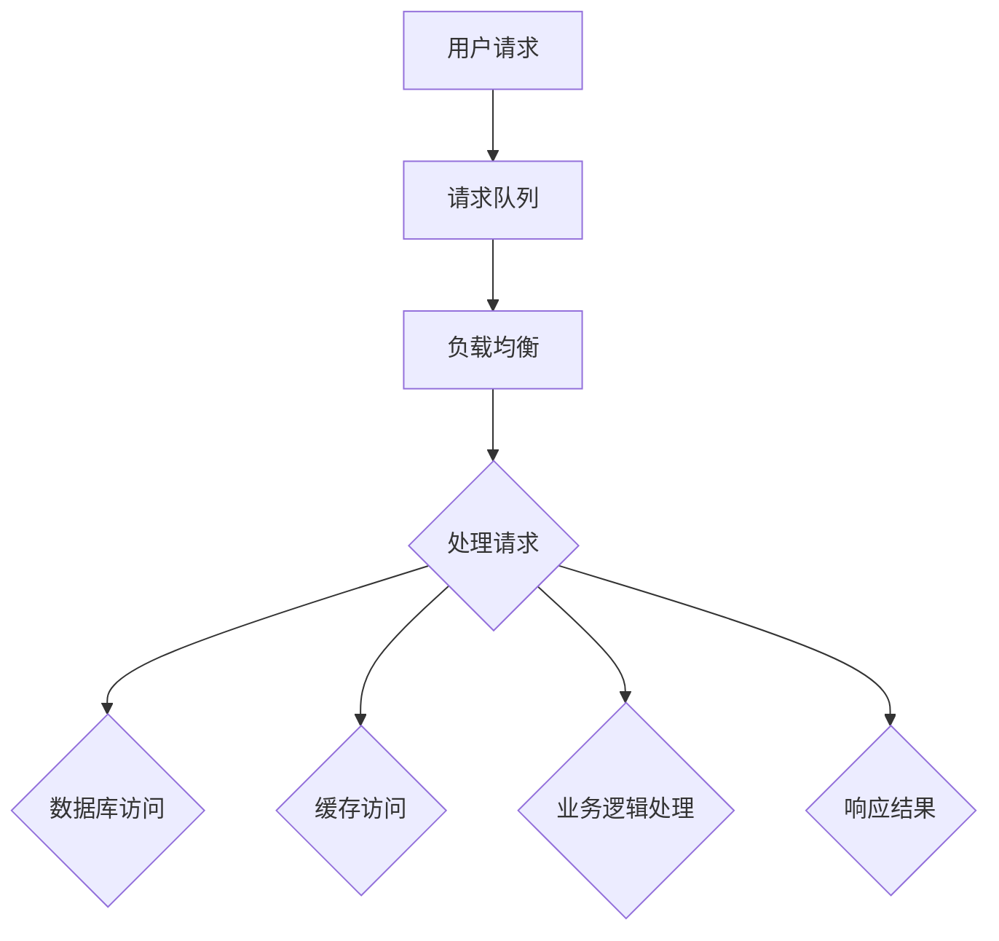

                 

# 高吞吐量系统的性能优化

> 关键词：性能优化、吞吐量、高并发、系统架构、算法、数学模型、实际应用、工具推荐

> 摘要：本文旨在探讨高吞吐量系统的性能优化策略，从背景介绍、核心概念、算法原理、数学模型、实际应用、工具推荐等多个角度进行分析。通过深入剖析，帮助读者理解并掌握提升系统性能的方法和技巧，以应对日益增长的高并发业务需求。

## 1. 背景介绍

在现代互联网时代，随着业务规模和用户数量的不断增长，系统的吞吐量成为衡量其性能的重要指标。高吞吐量系统可以快速响应大量并发请求，满足用户对即时性和稳定性的需求。然而，在实际开发过程中，如何优化系统性能以实现高吞吐量，成为了一个复杂而重要的课题。

性能优化不仅关系到用户体验，还直接影响着企业的运营效率和成本控制。一个高效的高吞吐量系统，可以在保证服务质量的同时，降低硬件资源消耗，提升资源利用效率。因此，深入研究性能优化策略，对于提升系统竞争力具有重要意义。

## 2. 核心概念与联系

为了更好地理解高吞吐量系统的性能优化，我们首先需要明确一些核心概念：

### 2.1. 吞吐量

吞吐量（Throughput）是指系统在单位时间内处理请求的数量。提高吞吐量意味着系统能够更快地处理请求，缩短用户等待时间，提升用户体验。

### 2.2. 并发

并发（Concurrency）是指多个任务在同一时间段内同时执行的能力。在高并发场景下，系统需要同时处理多个请求，这要求系统具备高并发处理能力。

### 2.3. 性能指标

性能指标包括响应时间、吞吐量、资源利用率、稳定性等。这些指标反映了系统的性能表现，也是衡量优化效果的重要依据。

### 2.4. 系统架构

系统架构是指系统各组件的组成及其相互关系。一个合理的系统架构有助于提升系统性能，降低复杂度。

### 2.5. 算法

算法是解决问题的步骤和方法。选择合适的算法对于优化系统性能至关重要。

### 2.6. 数学模型

数学模型是描述问题的一种数学表达式。通过数学模型，我们可以更准确地分析和优化系统性能。

下面是一个使用Mermaid绘制的系统架构流程图：



在上述流程图中，用户请求经过负载均衡器分配到各个处理节点，处理节点包括数据库访问、缓存访问、业务逻辑处理等。通过优化这些环节，可以提高系统的吞吐量。

## 3. 核心算法原理 & 具体操作步骤

### 3.1. 负载均衡

负载均衡（Load Balancing）是将请求分配到多个处理节点的一种技术。负载均衡可以有效地避免单点瓶颈，提高系统吞吐量。常用的负载均衡算法包括：

#### 3.1.1. 轮询算法

轮询算法（Round Robin）是最简单的负载均衡算法。它按照顺序将请求分配到各个节点，每个节点轮流处理请求。

#### 3.1.2. 最少连接算法

最少连接算法（Least Connections）将请求分配到当前连接数最少的节点。这种方式可以确保每个节点的工作负载相对均衡。

#### 3.1.3. 加权轮询算法

加权轮询算法（Weighted Round Robin）为每个节点分配不同的权重，权重越高的节点处理更多的请求。

### 3.2. 缓存

缓存（Caching）是将经常访问的数据存储在内存中，以减少数据库访问次数。常用的缓存算法包括：

#### 3.2.1. 最少最近使用算法

最少最近使用算法（Least Recently Used，LRU）将最近最少访问的数据淘汰出缓存。这种方式可以确保缓存中的数据总是最新的。

#### 3.2.2. 概率缓存算法

概率缓存算法（Probability Cache）根据数据访问概率动态调整缓存大小。访问概率高的数据优先缓存。

### 3.3. 数据库优化

数据库优化是提高系统吞吐量的关键环节。以下是一些常用的数据库优化方法：

#### 3.3.1. 查询优化

查询优化（Query Optimization）通过优化SQL查询语句，减少数据库访问次数和查询时间。

#### 3.3.2. 索引优化

索引优化（Index Optimization）通过创建合适的索引，提高数据查询速度。

#### 3.3.3. 分库分表

分库分表（Sharding）将数据拆分到多个数据库和表中，降低单库单表的负载。

### 3.4. 业务逻辑优化

业务逻辑优化（Business Logic Optimization）通过改进业务处理流程，提高系统吞吐量。以下是一些常见的方法：

#### 3.4.1. 异步处理

异步处理（Asynchronous Processing）将耗时较长的业务逻辑异步执行，避免阻塞请求。

#### 3.4.2. 服务拆分

服务拆分（Service Splitting）将大而全的服务拆分为多个小而美的服务，降低系统复杂度。

#### 3.4.3. 限流和熔断

限流（Rate Limiting）和熔断（Circuit Breaker）是应对高并发场景的有效手段。限流可以控制请求速率，避免系统过载；熔断可以切断故障服务，防止连锁反应。

## 4. 数学模型和公式 & 详细讲解 & 举例说明

### 4.1. 吞吐量计算模型

吞吐量（Throughput）可以通过以下公式计算：

\[ \text{Throughput} = \frac{\text{处理请求的数量}}{\text{处理时间}} \]

其中，处理请求的数量表示单位时间内处理的请求数量，处理时间表示处理每个请求所需的时间。

### 4.2. 并发度计算模型

并发度（Concurrency）可以通过以下公式计算：

\[ \text{Concurrency} = \frac{\text{系统总处理能力}}{\text{单个节点的处理能力}} \]

其中，系统总处理能力表示系统在单位时间内能够处理的总请求数量，单个节点的处理能力表示每个节点在单位时间内能够处理的请求数量。

### 4.3. 资源利用率计算模型

资源利用率（Resource Utilization）可以通过以下公式计算：

\[ \text{Resource Utilization} = \frac{\text{实际使用资源}}{\text{总资源}} \]

其中，实际使用资源表示系统在单位时间内实际使用的资源量，总资源表示系统可用的总资源量。

### 4.4. 示例说明

假设一个系统有10个处理节点，每个节点在单位时间内可以处理100个请求。系统总处理能力为1000个请求/单位时间。现有1000个请求需要处理。

\[ \text{Throughput} = \frac{1000}{1} = 1000 \text{个请求/单位时间} \]

\[ \text{Concurrency} = \frac{1000}{100} = 10 \]

\[ \text{Resource Utilization} = \frac{10 \times 100}{10 \times 1000} = 10\% \]

通过优化，将每个节点的处理能力提升到200个请求/单位时间，系统总处理能力提升到2000个请求/单位时间。

\[ \text{Throughput} = \frac{2000}{1} = 2000 \text{个请求/单位时间} \]

\[ \text{Concurrency} = \frac{2000}{200} = 10 \]

\[ \text{Resource Utilization} = \frac{10 \times 200}{10 \times 2000} = 10\% \]

可以看到，吞吐量提升了，但并发度和资源利用率没有变化。这意味着系统可以更快地处理请求，但节点之间的负载均衡仍然需要优化。

## 5. 项目实战：代码实际案例和详细解释说明

### 5.1. 开发环境搭建

在本项目实战中，我们使用Java语言和Spring Boot框架进行开发。首先，需要搭建开发环境：

1. 安装Java开发工具包（JDK）
2. 安装集成开发环境（IDE，如IntelliJ IDEA）
3. 创建Spring Boot项目

### 5.2. 源代码详细实现和代码解读

以下是项目的主要代码实现和解读：

#### 5.2.1. 负载均衡器

```java
@Configuration
public class LoadBalancerConfig {

    @Bean
    public LoadBalancer loadBalancer() {
        return new RoundRobinLoadBalancer();
    }
}
```

该配置类定义了一个轮询算法的负载均衡器。在实际应用中，可以根据需求选择不同的负载均衡算法。

#### 5.2.2. 请求处理器

```java
@Service
public class RequestProcessor {

    @Autowired
    private LoadBalancer loadBalancer;

    public void processRequest(String requestId) {
        String nodeName = loadBalancer.selectNode();
        System.out.println("Request " + requestId + " processed by node " + nodeName);
    }
}
```

该类实现了请求处理逻辑。通过调用负载均衡器的`selectNode()`方法，将请求分配到不同的处理节点。

#### 5.2.3. 节点处理逻辑

```java
@Service
public class NodeProcessor {

    public void processRequest(String requestId) {
        // 处理业务逻辑
        System.out.println("Processing request " + requestId);
        // 处理数据库查询
        System.out.println("Querying database for request " + requestId);
        // 处理缓存查询
        System.out.println("Querying cache for request " + requestId);
        // 响应结果
        System.out.println("Response for request " + requestId + " sent");
    }
}
```

该类实现了节点处理逻辑，包括业务逻辑、数据库查询、缓存查询和响应结果。在实际应用中，可以根据需求进行扩展和优化。

### 5.3. 代码解读与分析

通过上述代码实现，我们可以看到：

1. 负载均衡器将请求分配到不同的处理节点。
2. 请求处理器负责调用负载均衡器，并将请求转发给相应的节点处理。
3. 节点处理逻辑包括业务逻辑、数据库查询、缓存查询和响应结果。

这些组件共同构成了一个高吞吐量系统的基本架构。在实际应用中，可以根据具体需求进行扩展和优化。

## 6. 实际应用场景

高吞吐量系统在实际应用中具有广泛的应用场景，以下是一些典型的例子：

### 6.1. 电商平台

电商平台需要处理海量的商品查询、订单处理、支付等请求，要求系统具备高吞吐量和高并发处理能力。

### 6.2. 社交平台

社交平台需要实时处理用户发布的内容、评论、私信等请求，同时支持大规模用户同时在线。

### 6.3. 金融系统

金融系统需要处理大量的交易、转账、查询等请求，要求系统具备高稳定性和高并发处理能力。

### 6.4. 物流系统

物流系统需要实时处理包裹查询、状态更新、配送等请求，要求系统具备高实时性和高吞吐量。

### 6.5. 游戏平台

游戏平台需要处理用户的登录、游戏数据存储、在线交互等请求，要求系统具备高并发处理能力和低延迟。

## 7. 工具和资源推荐

为了更好地进行高吞吐量系统的性能优化，以下是一些实用的工具和资源推荐：

### 7.1. 学习资源推荐

1. 《高性能MySQL》：全面介绍MySQL数据库的优化方法和技巧。
2. 《深入理解计算机系统》：深入讲解计算机系统的工作原理和优化策略。
3. 《大型分布式网站技术架构》：介绍分布式系统的设计原则和优化方法。

### 7.2. 开发工具框架推荐

1. Spring Boot：流行的Java开发框架，提供一站式解决方案。
2. Hibernate：强大的ORM框架，用于数据库查询优化。
3. Redis：高性能的内存缓存系统，用于缓存优化。

### 7.3. 相关论文著作推荐

1. 《大话并发编程》：详细讲解并发编程的核心概念和优化技巧。
2. 《分布式系统原理与范型》：深入探讨分布式系统的设计和优化策略。
3. 《计算机网络》：全面介绍计算机网络的工作原理和优化方法。

## 8. 总结：未来发展趋势与挑战

随着云计算、大数据、人工智能等技术的快速发展，高吞吐量系统在互联网领域的重要性日益凸显。未来，高吞吐量系统的性能优化将呈现以下发展趋势：

1. **云原生技术**：云原生技术如容器化、微服务、服务网格等，将为高吞吐量系统提供更灵活、高效的架构和优化手段。
2. **智能化优化**：通过机器学习和人工智能技术，实现自动化性能优化，提高系统的自适应能力和智能化水平。
3. **分布式架构**：分布式架构将继续成为高吞吐量系统的主要架构模式，通过分布式计算和存储优化，提升系统的整体性能。

然而，面对不断增长的业务需求和复杂的技术挑战，高吞吐量系统的性能优化也将面临以下挑战：

1. **资源瓶颈**：随着业务规模的增长，资源瓶颈将愈加突出，如何合理分配和调度资源成为关键问题。
2. **一致性挑战**：分布式系统的一致性保证是一个复杂的问题，如何在保证高性能的同时，确保数据一致性仍需深入研究。
3. **安全性问题**：高吞吐量系统面临的安全风险更大，如何确保系统的安全性和稳定性是亟待解决的问题。

总之，未来高吞吐量系统的性能优化将是一个长期而持续的课题，需要持续探索和改进。

## 9. 附录：常见问题与解答

### 9.1. 问题1：什么是高吞吐量系统？

高吞吐量系统是指在单位时间内能够处理大量请求的系统，其核心指标是吞吐量和并发度。

### 9.2. 问题2：如何提高系统吞吐量？

提高系统吞吐量的方法包括：优化系统架构、优化算法、缓存数据、优化数据库查询、异步处理等。

### 9.3. 问题3：负载均衡有哪些常用算法？

常用的负载均衡算法包括轮询算法、最少连接算法、加权轮询算法等。

### 9.4. 问题4：如何优化数据库性能？

优化数据库性能的方法包括：查询优化、索引优化、分库分表等。

### 9.5. 问题5：什么是异步处理？

异步处理是一种处理请求的方法，将耗时较长的操作异步执行，避免阻塞主线程。

## 10. 扩展阅读 & 参考资料

1. 《高性能MySQL》：[https://book.douban.com/subject/26707281/](https://book.douban.com/subject/26707281/)
2. 《深入理解计算机系统》：[https://book.douban.com/subject/10546119/](https://book.douban.com/subject/10546119/)
3. 《大型分布式网站技术架构》：[https://book.douban.com/subject/26564054/](https://book.douban.com/subject/26564054/)
4. 《大话并发编程》：[https://book.douban.com/subject/26972136/](https://book.douban.com/subject/26972136/)
5. 《分布式系统原理与范型》：[https://book.douban.com/subject/25863044/](https://book.douban.com/subject/25863044/)
6. 《计算机网络》：[https://book.douban.com/subject/1085330/](https://book.douban.com/subject/1085330/)

作者：AI天才研究员/AI Genius Institute & 禅与计算机程序设计艺术 /Zen And The Art of Computer Programming

本文版权所有，未经授权禁止转载。如需转载，请联系作者获取授权。谢谢合作！<|im_end|>

