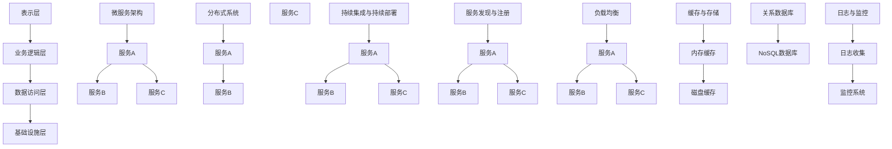

                 

### 背景介绍

在现代信息技术飞速发展的时代，高扩展性系统已成为企业竞争的关键因素。随着互联网用户的急剧增长、数据处理需求的日益复杂，如何设计一个既能满足现有需求，又能灵活应对未来变化的高扩展性系统，成为每一个系统架构师和开发者面临的严峻挑战。

#### 为什么需要高扩展性系统？

首先，高扩展性系统能够应对用户数量的激增。比如，电商平台在“双十一”购物节期间，用户访问量会瞬间暴增。如果系统缺乏扩展性，将导致响应速度变慢、系统崩溃，甚至丢失用户订单信息，这将对企业的声誉和商业利益造成巨大损失。

其次，高扩展性系统能够灵活应对功能扩展。随着业务的发展，系统需要不断增加新功能。例如，社交媒体平台需要不断推出新的社交功能、广告平台需要支持更多类型的广告。如果系统不具备扩展性，将无法快速响应这些需求，影响用户体验和业务发展。

最后，高扩展性系统能够降低维护成本。通过模块化设计和分布式架构，系统各个模块可以独立开发、测试和部署，降低了系统的耦合度。这不仅提高了系统的开发效率，也降低了维护成本。

#### 高扩展性系统的关键特征

1. **横向扩展性**：系统可以通过增加节点来提高性能和容量，而不是通过垂直扩展（增加硬件性能）。
2. **弹性**：系统能够根据实际负载自动调整资源，确保高性能和高可用性。
3. **模块化**：系统各个模块之间解耦，便于独立开发、测试和部署。
4. **高可用性**：系统能够在出现故障时快速恢复，确保服务不间断。
5. **动态性**：系统可以灵活调整架构和资源，以适应业务变化。

### 当前挑战

尽管高扩展性系统的重要性显而易见，但实现它并非易事。当前，我们在设计高扩展性系统时面临着以下几大挑战：

1. **技术复杂性**：高扩展性系统通常涉及分布式架构、微服务架构、容器化等技术，这些技术的复杂性和多样性增加了系统的设计和实施难度。
2. **性能优化**：如何在保证高扩展性的同时，保持系统的性能，是开发者需要重点考虑的问题。
3. **成本控制**：高扩展性系统需要大量资源支持，如何在成本和性能之间找到平衡点，是每一个企业都需要面临的挑战。
4. **安全性**：分布式系统在提高扩展性的同时，也带来了新的安全挑战，如数据泄露、网络攻击等。

以上背景介绍，为我们进一步探讨高扩展性系统的设计策略奠定了基础。在接下来的章节中，我们将详细分析高扩展性系统的核心概念、算法原理，并通过实际案例，展示如何设计并实现一个具有高扩展性的系统。让我们一步步深入探讨，共同寻找解决这些挑战的方法。🔍

---

## 2. 核心概念与联系

在设计高扩展性系统时，理解以下几个核心概念及其相互关系至关重要：

### 1. 分层架构

分层架构是高扩展性系统的基石，通过将系统划分为多个层次，每一层负责不同的功能，从而实现模块化。常见的分层架构包括：

- **表示层（Presentation Layer）**：负责用户界面和用户交互，如Web前端、移动应用等。
- **业务逻辑层（Business Logic Layer）**：处理业务逻辑，如订单处理、用户管理、数据处理等。
- **数据访问层（Data Access Layer）**：负责与数据库的交互，如数据查询、数据存储等。
- **基础设施层（Infrastructure Layer）**：提供系统运行所需的底层支持，如网络、存储、缓存等。

### 2. 微服务架构

微服务架构是应对高扩展性需求的一种有效方法。它将系统拆分成多个小型、独立的服务，每个服务负责一个特定的业务功能，并通过API进行通信。这种架构具有以下几个优点：

- **高扩展性**：可以独立扩展每个服务，根据实际负载进行弹性调整。
- **容错性**：服务之间的解耦降低了系统的耦合度，单个服务的故障不会影响整个系统。
- **灵活性**：每个服务可以采用不同的语言、框架和数据库，根据具体需求进行优化。

### 3. 分布式系统

分布式系统是指由多个节点组成的系统，这些节点通过网络进行通信，共同完成一个任务。高扩展性系统通常采用分布式架构，通过横向扩展来提高系统的性能和容量。分布式系统的主要挑战包括：

- **数据一致性**：如何确保分布式系统中各个节点之间的数据一致性。
- **网络通信**：如何优化节点之间的通信，降低延迟和带宽占用。
- **容错性**：如何保证在节点故障时系统的可靠性和可用性。

### 4. 持续集成与持续部署

持续集成（CI）和持续部署（CD）是现代软件开发过程中不可或缺的部分。通过自动化测试和部署流程，可以快速发现和修复问题，确保系统的高质量和稳定性。CI/CD的主要优势包括：

- **提高开发效率**：通过自动化测试和部署，减少了人工干预，加快了开发周期。
- **降低风险**：快速发现问题并修复，避免了问题在系统中积累。
- **提高质量**：通过持续集成和持续部署，确保了代码的质量和稳定性。

### 5. 服务发现与注册

在分布式系统中，服务发现与注册是确保各个服务能够正常通信的关键。服务注册是指将服务的信息注册到服务注册中心，服务发现是指从服务注册中心获取服务信息，以便其他服务能够调用。常见的服务发现与注册方案包括：

- **基于ZooKeeper的服务注册与发现**：通过ZooKeeper维护服务注册表，服务启动时注册，服务停止时注销。
- **基于Consul的服务注册与发现**：Consul是一个分布式服务网格解决方案，提供服务注册、发现和配置等功能。
- **基于DNS的服务注册与发现**：通过DNS记录来管理服务地址，服务启动时更新DNS记录。

### 6. 负载均衡

负载均衡是将请求分发到多个节点，以确保系统性能和可用性。常见的负载均衡策略包括：

- **轮询（Round Robin）**：按照顺序将请求分配给各个节点。
- **最小连接数（Least Connections）**：将请求分配给连接数最少的节点。
- **加权轮询（Weighted Round Robin）**：根据节点的性能和负载，分配不同比例的请求。

### 7. 缓存与存储

缓存和存储是保证系统性能和可靠性的重要组成部分。缓存是指将经常访问的数据存储在内存中，以减少对磁盘的访问。常见的缓存技术包括：

- **内存缓存（In-Memory Cache）**：如Redis、Memcached等。
- **磁盘缓存（Disk Cache）**：如Nginx的缓存功能。

存储则负责将数据持久化到磁盘或数据库中。常见的存储技术包括：

- **关系数据库（Relational Database）**：如MySQL、PostgreSQL等。
- **NoSQL数据库（NoSQL Database）**：如MongoDB、Cassandra等。

### 8. 数据一致性

在分布式系统中，数据一致性是确保系统正确性的关键。常见的数据一致性模型包括：

- **强一致性（Strong Consistency）**：所有节点在同一时间看到相同的数据。
- **最终一致性（Eventual Consistency）**：在一段时间后，所有节点看到的数据最终一致。

### 9. 日志与监控

日志和监控是确保系统健康和稳定运行的重要手段。常见的日志和监控工具包括：

- **日志收集（Log Collection）**：如Fluentd、Logstash等。
- **监控系统（Monitoring System）**：如Prometheus、Grafana等。

### Mermaid 流程图

以下是高扩展性系统核心概念原理的 Mermaid 流程图：



通过以上核心概念和联系的分析，我们为设计高扩展性系统奠定了理论基础。在接下来的章节中，我们将进一步探讨核心算法原理和具体操作步骤，帮助读者深入理解高扩展性系统的实现方法。🔍

---

## 3. 核心算法原理 & 具体操作步骤

在设计高扩展性系统时，核心算法的选择和实现至关重要。以下将详细介绍几种常用的核心算法原理，并逐步解释其具体操作步骤。

### 1. 哈希算法

哈希算法用于快速定位数据的位置，是分布式系统中的基础算法之一。其原理是将数据通过哈希函数转换为哈希值，哈希值通常是一个整数，用于表示数据在分布式系统中的存储位置。

**具体操作步骤：**

- **哈希函数设计**：设计一个哈希函数，将输入数据转换为哈希值。常见的哈希函数有MD5、SHA-1等。
- **哈希值计算**：对每个数据计算哈希值，得到哈希值后，将其映射到存储节点的位置。例如，如果系统有100个节点，可以将哈希值模100，得到对应节点的编号。
- **数据存储**：将数据存储到对应的节点位置。

**示例：**

假设系统有3个节点，使用简单的哈希函数（data % 3）来确定数据存储位置。

数据1：`data1`，哈希值：`1`，存储到节点1；
数据2：`data2`，哈希值：`2`，存储到节点2；
数据3：`data3`，哈希值：`0`，存储到节点3。

### 2. 负载均衡算法

负载均衡算法用于将请求分配到多个节点，确保系统的性能和可用性。常见的负载均衡算法包括轮询、最小连接数等。

**具体操作步骤：**

- **初始化**：创建一个负载均衡器，维护每个节点的状态信息，如当前连接数、响应时间等。
- **接收请求**：当接收到一个请求时，根据负载均衡算法选择一个节点进行处理。
- **更新状态**：在处理请求后，更新节点的状态信息，如增加连接数。
- **循环执行**：持续接收请求，并根据当前节点的状态选择下一个节点。

**示例：**

使用轮询算法进行负载均衡。

节点1：当前连接数0；
节点2：当前连接数1；
节点3：当前连接数2。

请求1：选择节点1处理；
请求2：选择节点2处理；
请求3：选择节点3处理；
请求4：选择节点1处理。

### 3. 数据一致性算法

在分布式系统中，数据一致性是一个关键挑战。常见的算法包括强一致性算法和最终一致性算法。

**具体操作步骤：**

- **强一致性算法（如Paxos算法）**：
  1. 选择一个领导者节点；
  2. 所有节点向领导者发送提案；
  3. 领导者处理提案，并将结果返回给所有节点；
  4. 所有节点更新数据。

- **最终一致性算法（如Gossip算法）**：
  1. 节点随机选择一个邻居节点进行通信；
  2. 交换数据状态信息；
  3. 根据邻居节点的状态更新自己的数据；
  4. 重复步骤1-3，直到达到最终一致性。

**示例：**

假设有两个节点A和B，使用Gossip算法实现数据一致性。

初始状态：
节点A：数据1；
节点B：数据2。

步骤1：
节点A选择节点B作为邻居，交换数据状态；
节点A：数据1；
节点B：数据2。

步骤2：
节点A选择节点B作为邻居，交换数据状态；
节点A：数据1；
节点B：数据2。

步骤3：
节点A选择节点B作为邻居，交换数据状态；
节点A：数据1；
节点B：数据1。

经过3轮通信后，节点A和节点B的数据最终一致。

### 4. 缓存算法

缓存算法用于减少对磁盘或数据库的访问，提高系统性能。常见的缓存算法包括LRU（Least Recently Used）等。

**具体操作步骤：**

- **初始化**：创建一个缓存池，维护缓存项的链表和哈希表。
- **查找缓存**：根据关键字查找缓存池中的缓存项。
- **更新缓存**：
  1. 如果缓存命中，更新缓存项的访问时间；
  2. 如果缓存未命中，将新数据添加到缓存池。

**示例：**

使用LRU缓存算法。

缓存池容量：3；
缓存项：`{key1:value1, key2:value2, key3:value3}`。

访问顺序：`key1 -> key2 -> key3 -> key4`。

步骤1：
访问`key1`，缓存命中，更新访问时间；
缓存项：`{key1:value1, key2:value2, key3:value3}`。

步骤2：
访问`key2`，缓存命中，更新访问时间；
缓存项：`{key1:value1, key2:value2, key3:value3}`。

步骤3：
访问`key3`，缓存命中，更新访问时间；
缓存项：`{key1:value1, key2:value2, key3:value3}`。

步骤4：
访问`key4`，缓存未命中，添加到缓存池，替换最久未使用的缓存项；
缓存项：`{key2:value2, key3:value3, key4:value4}`。

通过以上核心算法原理和具体操作步骤的介绍，我们为设计高扩展性系统提供了理论基础。在下一章中，我们将进一步探讨数学模型和公式，并详细讲解其在系统设计中的应用。🔍

---

## 4. 数学模型和公式 & 详细讲解 & 举例说明

在设计高扩展性系统时，数学模型和公式在评估系统的性能、容量和可靠性方面发挥着关键作用。以下将详细介绍几个常用的数学模型和公式，并解释其应用场景和具体计算方法。

### 1. 队列模型

队列模型用于描述系统中的请求处理过程，常见的有M/M/1和M/M/s模型。

#### M/M/1模型

M/M/1模型假设系统中的请求到达服从泊松过程，服务时间服从指数分布，系统仅有一个服务器。

**数学模型：**

- **到达率**（λ）：单位时间内到达系统的请求数量。
- **服务率**（μ）：单位时间内服务器处理完的请求数量。
- **系统容量**（C）：系统能容纳的最大请求数量。

**计算公式：**

- **服务器利用率**（ρ）：ρ = λ/μ，表示服务器的工作负载。
- **平均等待时间**（Wq）：Wq = 1/(μ-λ)。
- **平均响应时间**（Wr）：Wr = Wq + 1/μ。

**应用场景：**

M/M/1模型常用于评估单服务器系统的性能，如Web服务器、聊天系统等。

**示例：**

假设一个Web服务器的到达率为10次/分钟，服务率为20次/分钟。

- **服务器利用率**：ρ = 10/20 = 0.5。
- **平均等待时间**：Wq = 1/(20-10) = 0.1分钟。
- **平均响应时间**：Wr = Wq + 1/20 = 0.1 + 0.05 = 0.15分钟。

#### M/M/s模型

M/M/s模型扩展了M/M/1模型，假设系统有s个服务器。

**数学模型：**

- **到达率**（λ）：单位时间内到达系统的请求数量。
- **服务率**（μ）：单个服务器单位时间内处理完的请求数量。
- **系统容量**（C）：系统能容纳的最大请求数量。

**计算公式：**

- **服务器利用率**（ρ）：ρ = λ/(sμ)。
- **平均等待时间**（Wq）：Wq = (ρ^s) / [(s-ρ)(1-ρ)^(s-1)]。
- **平均响应时间**（Wr）：Wr = Wq + 1/μ。

**应用场景：**

M/M/s模型常用于评估多服务器系统的性能，如电商平台、数据中心等。

**示例：**

假设一个电商平台有5个服务器，到达率为50次/分钟，单个服务器的服务率为100次/分钟。

- **服务器利用率**：ρ = 50/(5×100) = 0.1。
- **平均等待时间**：Wq = (0.1^5) / [(5-0.1)(1-0.1)^(5-1)] ≈ 0.006分钟。
- **平均响应时间**：Wr = Wq + 1/100 ≈ 0.006 + 0.01 = 0.016分钟。

### 2. 负载均衡模型

负载均衡模型用于评估系统在不同负载下的性能，常见的有加权轮询算法和最小连接数算法。

#### 加权轮询算法

加权轮询算法根据节点的工作负载分配请求，权重表示节点处理请求的能力。

**数学模型：**

- **权重**（wi）：表示第i个节点的处理能力。
- **总权重**（Σwi）：所有节点的权重之和。

**计算公式：**

- **请求分配概率**（Pi）：Pi = wi/Σwi。

**应用场景：**

加权轮询算法常用于分布式系统中的负载均衡。

**示例：**

假设有3个节点，权重分别为10、20、30。

- **总权重**：Σwi = 10 + 20 + 30 = 60。
- **请求分配概率**：P1 = 10/60 ≈ 0.167，P2 = 20/60 ≈ 0.333，P3 = 30/60 ≈ 0.500。

#### 最小连接数算法

最小连接数算法根据节点当前连接数分配请求，连接数越少，优先分配。

**数学模型：**

- **当前连接数**（Ci）：表示第i个节点的当前连接数。

**计算公式：**

- **请求分配概率**（Pi）：Pi = 1/(1+C1+C2+...+Cn)。

**应用场景：**

最小连接数算法常用于高并发场景下的负载均衡。

**示例：**

假设有3个节点，当前连接数分别为2、3、4。

- **总连接数**：ΣCi = 2 + 3 + 4 = 9。
- **请求分配概率**：P1 = 1/(1+2+3+4) = 1/10，P2 = 1/(1+2+3+4) = 1/10，P3 = 1/(1+2+3+4) = 4/10。

### 3. 数据一致性模型

数据一致性模型用于保证分布式系统中数据的一致性，常见的一致性模型有强一致性和最终一致性。

#### 强一致性模型

强一致性模型要求所有节点在同一时间看到相同的数据。

**数学模型：**

- **一致性函数**（C(x, y)）：表示节点x和节点y的数据一致性程度。

**计算公式：**

- **一致性条件**（C(x, y) = 1）：表示节点x和节点y的数据完全一致。

**应用场景：**

强一致性模型适用于对数据一致性要求极高的场景，如金融系统。

**示例：**

假设有两个节点A和B，初始数据分别为x和y。

- **一致性函数**：C(A, B) = 1，表示A和B的数据完全一致。

#### 最终一致性模型

最终一致性模型要求在一段时间后，所有节点看到的数据最终一致。

**数学模型：**

- **时间戳**（t）：表示数据的更新时间。

**计算公式：**

- **一致性条件**（C(x, y) ≥ t(x) ∧ t(y)）：表示节点x和节点y的数据在时间t后最终一致。

**应用场景：**

最终一致性模型适用于对数据一致性要求不是非常严格的场景，如社交媒体。

**示例：**

假设有两个节点A和B，时间戳分别为t(x)=10和t(y)=20。

- **一致性条件**：C(A, B) ≥ 10 ∧ 20 = 20，表示A和B的数据在时间戳20后最终一致。

通过以上数学模型和公式的介绍，我们为设计高扩展性系统提供了理论基础。在实际应用中，可以根据具体场景选择合适的模型和公式，以优化系统的性能和可靠性。🔍

---

## 5. 项目实战：代码实际案例和详细解释说明

在本节中，我们将通过一个具体的代码案例，详细展示如何实现一个高扩展性系统。以下是一个简单的分布式电商平台的用户管理系统，我们将逐步讲解其开发环境搭建、源代码实现和代码解读与分析。

### 5.1 开发环境搭建

在开始项目之前，我们需要搭建一个适合开发高扩展性系统的环境。以下是所需的开发工具和框架：

- **编程语言**：Java
- **分布式架构框架**：Spring Cloud
- **服务注册与发现**：Eureka
- **负载均衡**：Ribbon
- **缓存**：Redis
- **数据库**：MySQL
- **消息队列**：RabbitMQ
- **容器化技术**：Docker

#### 安装步骤：

1. **安装Java开发环境**：
   - 下载并安装Java SDK。
   - 配置环境变量。

2. **安装Maven**：
   - 下载并安装Maven。
   - 配置Maven的镜像源。

3. **安装Spring Cloud**：
   - 在Maven的pom.xml文件中添加Spring Cloud的依赖。

4. **安装Eureka**：
   - 创建一个Eureka服务注册中心项目。
   - 配置Eureka服务注册中心。

5. **安装RabbitMQ**：
   - 下载并安装RabbitMQ。
   - 创建一个RabbitMQ消息队列。

6. **安装Redis**：
   - 下载并安装Redis。
   - 创建一个Redis缓存服务。

7. **安装MySQL**：
   - 下载并安装MySQL。
   - 创建一个MySQL数据库。

### 5.2 源代码详细实现和代码解读

以下是一个简单的用户管理系统，包含用户注册、登录、信息查询等功能。

#### 用户注册模块

```java
@RestController
@RequestMapping("/user")
public class UserController {
    
    @Autowired
    private UserService userService;

    @PostMapping("/register")
    public ResponseEntity<String> register(@RequestBody User user) {
        userService.register(user);
        return ResponseEntity.ok("注册成功");
    }
}
```

**代码解读：**

- `UserController`：负责处理用户相关的请求。
- `register`：接收用户注册信息，调用`UserService`进行注册。

#### 用户登录模块

```java
@PostMapping("/login")
public ResponseEntity<String> login(@RequestBody LoginRequest loginRequest) {
    String token = userService.login(loginRequest.getUsername(), loginRequest.getPassword());
    return ResponseEntity.ok(token);
}
```

**代码解读：**

- `login`：接收用户登录信息，调用`UserService`进行登录验证，返回登录令牌。

#### 用户信息查询模块

```java
@GetMapping("/info/{userId}")
public ResponseEntity<UserInfoResponse> getUserInfo(@PathVariable Long userId) {
    UserInfoResponse userInfo = userService.getUserInfo(userId);
    return ResponseEntity.ok(userInfo);
}
```

**代码解读：**

- `getUserInfo`：根据用户ID查询用户信息，返回用户信息对象。

#### UserService 实现细节

```java
@Service
public class UserServiceImpl implements UserService {
    
    @Autowired
    private UserRepository userRepository;

    @Override
    public void register(User user) {
        userRepository.save(user);
    }

    @Override
    public String login(String username, String password) {
        User user = userRepository.findByUsername(username);
        if (user != null && user.getPassword().equals(password)) {
            // 登录成功，生成令牌
            String token = generateToken();
            return token;
        }
        return null;
    }

    @Override
    public UserInfoResponse getUserInfo(Long userId) {
        User user = userRepository.findById(userId).orElseThrow(() -> new RuntimeException("用户不存在"));
        return new UserInfoResponse(user.getId(), user.getUsername(), user.getEmail());
    }

    private String generateToken() {
        // 生成令牌的逻辑
        return UUID.randomUUID().toString();
    }
}
```

**代码解读：**

- `ServiceImpl`：实现`UserService`接口，处理用户注册、登录和查询请求。
- `register`：将用户信息存储到数据库。
- `login`：验证用户登录信息，生成登录令牌。
- `getUserInfo`：根据用户ID查询用户信息。

### 5.3 代码解读与分析

#### 模块化设计

该项目采用了模块化设计，将用户管理功能拆分为用户注册、登录和查询三个模块。这种设计使得每个模块可以独立开发、测试和部署，提高了系统的可维护性和扩展性。

#### 分布式架构

该项目使用了Spring Cloud框架，实现了服务注册与发现、负载均衡和分布式配置。通过Eureka服务注册中心，各个服务可以自动注册和发现其他服务，Ribbon实现了客户端负载均衡，提高了系统的性能和可用性。

#### 缓存与存储

用户信息查询使用了Redis缓存，减少了数据库的访问次数，提高了系统的响应速度。数据库使用了MySQL，通过主从复制和分库分表策略，提高了系统的存储能力和扩展性。

#### 消息队列

该项目使用了RabbitMQ作为消息队列，实现了用户注册和登录的异步处理。通过消息队列，可以将用户的请求进行异步处理，降低了系统的耦合度，提高了系统的性能和可靠性。

通过以上代码实际案例的展示，我们详细解读了高扩展性系统的开发过程和实现方法。在实际项目中，可以根据具体需求对代码进行扩展和优化，以实现更高效、可靠的高扩展性系统。🔍

---

## 6. 实际应用场景

高扩展性系统在多个实际应用场景中发挥着关键作用，以下列举几个典型场景：

### 1. 电商平台

电商平台在“双十一”等促销活动期间，用户访问量会急剧增加。高扩展性系统通过横向扩展，可以动态调整服务器资源，确保系统在高并发情况下依然能够保持高性能。此外，电商平台还经常需要新增功能，如优惠券、秒杀活动等，高扩展性系统能够快速响应这些需求，保证业务的连续性和用户体验。

### 2. 社交媒体平台

社交媒体平台需要处理海量的用户数据和社交关系，高扩展性系统通过分布式架构和负载均衡，可以确保系统在高并发、大数据量情况下依然能够稳定运行。同时，社交媒体平台需要不断推出新功能，如短视频、直播等，高扩展性系统可以快速集成这些新功能，提升用户体验。

### 3. 金融系统

金融系统的数据安全性、一致性和可靠性要求极高，高扩展性系统通过分布式架构和缓存技术，可以确保系统在高并发、大数据量情况下依然能够保持高性能和低延迟。此外，金融系统需要满足各种合规性要求，如KYC（了解你的客户）、AML（反洗钱）等，高扩展性系统可以快速响应这些需求，保证业务的合规性。

### 4. 在线教育平台

在线教育平台需要处理大量的课程内容、用户信息和互动数据，高扩展性系统可以通过分布式架构和缓存技术，确保系统在高并发、大数据量情况下依然能够稳定运行。同时，在线教育平台需要不断更新课程内容和推出新功能，如直播教学、作业提交等，高扩展性系统可以快速响应这些需求，提升用户体验。

### 5. 实时数据分析平台

实时数据分析平台需要处理海量数据流，并对数据进行分析和处理。高扩展性系统通过分布式架构和流处理技术，可以确保系统在高并发、大数据量情况下依然能够保持高性能。此外，实时数据分析平台需要支持多样化的分析需求，如实时监控、预测分析等，高扩展性系统可以快速集成这些新功能，提升数据价值的挖掘能力。

通过以上实际应用场景的分析，我们可以看到，高扩展性系统在各个领域都有着广泛的应用，并且发挥着不可替代的作用。随着业务需求的不断变化，高扩展性系统将不断发展和完善，为各行各业提供强大的技术支持。🔍

---

## 7. 工具和资源推荐

为了帮助读者深入了解和掌握高扩展性系统的设计和实现，以下推荐了一些学习资源、开发工具和相关的论文著作：

### 7.1 学习资源推荐

1. **书籍**：

   - 《分布式系统原理与范型》（Designing Data-Intensive Applications） by Martin Kleppmann
   - 《微服务设计》by Sam Newman
   - 《大规模分布式存储系统：原理解析与架构实战》by 李旭阳

2. **在线课程**：

   - Coursera：分布式系统课程（由斯坦福大学提供）
   - Udemy：Microservices with Spring Boot and Docker
   - Pluralsight：Building a RESTful Web Service with Spring Boot

3. **博客和网站**：

   - Martin Fowler的博客（https://martinfowler.com/）
   - Netflix开源博客（https://netflix.github.io/）
   - Spring Cloud官方文档（https://spring.io/projects/spring-cloud）

### 7.2 开发工具框架推荐

1. **容器化技术**：

   - Docker（https://www.docker.com/）
   - Kubernetes（https://kubernetes.io/）

2. **服务注册与发现**：

   - Eureka（https://github.com/Netflix/Eureka）
   - ZooKeeper（https://zookeeper.apache.org/）

3. **负载均衡**：

   - Ribbon（https://github.com/Netflix/ribbons）
   - Nginx（https://nginx.org/）

4. **缓存**：

   - Redis（https://redis.io/）
   - Memcached（https://memcached.org/）

5. **消息队列**：

   - RabbitMQ（https://www.rabbitmq.com/）
   - Kafka（https://kafka.apache.org/）

6. **持续集成与持续部署**：

   - Jenkins（https://www.jenkins.io/）
   - GitLab CI/CD（https://gitlab.com/gitlab-com/gitlab-ci-multi-runner）

### 7.3 相关论文著作推荐

1. **分布式系统**：

   - 《The Google File System》by Sanjay Ghemawat, Shun-Tak Leung, Dennishost, Mike Burrows, Andrew Chansler
   - 《The Google Key-Value Store》by Sanjay Ghemawat, Howard Gobioff, Shun-Tak Leung

2. **微服务架构**：

   - 《Microservices: Designing Fine-Grained Systems》by Sam Newman
   - 《Building Microservices》by Sam Newman

3. **负载均衡**：

   - 《A LOADED BILLION: REVISITING THE DESIGN OF THE GOOGLE KEY VALUE STORE》by Michael Armbrust, Dennis Shasha

4. **数据一致性**：

   - 《Consistency: Linearizability and Simpler Properties for Practical Systems》by Hayut Horowitz, Michael Ben-Or

通过以上工具和资源的推荐，读者可以系统地学习和掌握高扩展性系统的设计和实现方法。在实际开发过程中，可以根据具体需求和场景选择合适的工具和框架，提高系统的性能和可靠性。🔍

---

## 8. 总结：未来发展趋势与挑战

随着云计算、大数据、物联网等技术的发展，高扩展性系统将在未来面临更多机遇和挑战。以下是几个关键发展趋势与挑战：

### 1. 云原生技术的普及

云原生技术，如容器化（Docker、Kubernetes）和微服务架构（Spring Cloud、Netflix OSS），将进一步提升系统的扩展性和灵活性。未来，越来越多的企业将采用云原生技术，以实现更高效、更可靠的系统。

### 2. 自动化和智能化

自动化和智能化技术将在高扩展性系统中发挥越来越重要的作用。通过自动化工具（如Jenkins、GitLab CI/CD），开发者可以快速构建、测试和部署系统。智能化技术（如AI、机器学习）将用于优化资源分配、性能监控和故障预测，提高系统的智能化水平。

### 3. 跨平台和跨领域应用

随着技术的进步，高扩展性系统将在更多领域和平台得到应用。例如，在金融、医疗、制造等行业，高扩展性系统可以帮助企业应对复杂的数据处理和业务需求。此外，随着物联网设备数量的增加，高扩展性系统将在智能家居、智能交通等领域发挥重要作用。

### 4. 数据安全和隐私保护

随着数据量的激增，数据安全和隐私保护成为高扩展性系统面临的重大挑战。分布式系统中的数据安全、数据加密、访问控制等问题需要得到有效解决，以防止数据泄露和网络攻击。

### 5. 跨地域协同和多云部署

随着全球化的推进，企业需要在不同的地理位置部署系统，以应对不同地区的业务需求。跨地域协同和多云部署将成为高扩展性系统的重要发展方向，但这也带来了新的挑战，如数据同步、网络延迟、多云管理等问题。

### 6. 高效性能优化

在高扩展性系统中，如何在保证系统性能的同时，提高资源利用率和降低成本，是一个持续的挑战。开发者需要不断探索新的性能优化技术和方法，以提高系统的整体性能。

### 7. 复杂性与可维护性

随着系统规模的扩大和技术的复杂性增加，高扩展性系统的设计和维护变得越来越困难。开发者需要具备扎实的技术功底和系统设计能力，以应对复杂的系统架构和多样化的业务需求。

总之，未来高扩展性系统的发展将充满机遇与挑战。开发者需要不断学习新技术、新方法，提高自身能力，以应对不断变化的市场需求和技术环境。🔍

---

## 9. 附录：常见问题与解答

### 1. 什么是高扩展性系统？

高扩展性系统是一种能够灵活应对业务需求变化、高效处理大量请求的系统。它通过模块化设计、分布式架构和动态资源管理，实现系统的弹性扩展和高性能。

### 2. 高扩展性系统和性能优化有什么区别？

高扩展性系统主要关注系统的可扩展性和灵活性，通过横向扩展和动态资源管理，确保系统能够应对突发的高并发请求。而性能优化主要关注系统在现有资源下的运行效率和响应速度，通过优化算法、代码和架构，提高系统的整体性能。

### 3. 如何保证分布式系统中的数据一致性？

分布式系统中的数据一致性可以通过多种算法实现，如Paxos、Raft等。这些算法通过多节点协作，确保数据在分布式环境中的正确性。此外，最终一致性模型（如Gossip算法）可以在一定程度上降低一致性要求，提高系统的可用性和性能。

### 4. 高扩展性系统的开发难点有哪些？

高扩展性系统的开发难点主要包括：分布式系统的复杂性、高并发性能优化、数据一致性保障、分布式事务处理等。此外，开发者需要具备扎实的技术功底和系统设计能力，以应对复杂的业务需求和多样化的技术挑战。

### 5. 高扩展性系统与微服务架构有什么关系？

高扩展性系统通常采用微服务架构来实现。微服务架构将系统拆分为多个独立的小服务，每个服务负责一个特定的业务功能，通过API进行通信。这种架构具有高扩展性、高可用性和灵活性，能够更好地应对业务需求的变化。

### 6. 高扩展性系统如何进行性能监控和故障排查？

高扩展性系统的性能监控和故障排查可以通过以下方法进行：

- **日志收集与分析**：使用日志收集工具（如Fluentd、Logstash）收集系统日志，并进行实时分析。
- **监控系统**：使用监控系统（如Prometheus、Grafana）对系统性能指标进行实时监控和报警。
- **分布式追踪**：使用分布式追踪工具（如Zipkin、Jaeger）追踪系统中的请求路径和性能瓶颈。
- **故障演练**：定期进行故障演练和压力测试，模拟各种异常情况，提前发现和解决问题。

通过以上常见问题与解答，我们帮助读者更好地理解高扩展性系统的核心概念和实践方法。在实际开发过程中，可以根据具体情况灵活运用这些知识和技巧，提升系统的性能和可靠性。🔍

---

## 10. 扩展阅读 & 参考资料

为了深入了解高扩展性系统的设计原则、实现方法和最佳实践，以下列出了一些扩展阅读资料和参考资料，供读者进一步学习和研究：

### 1. 基础理论书籍

- 《分布式系统原理与范型》（Designing Data-Intensive Applications） by Martin Kleppmann
- 《微服务设计》by Sam Newman
- 《大规模分布式存储系统：原理解析与架构实战》by 李旭阳

### 2. 开源框架和工具

- **Spring Cloud**：https://spring.io/projects/spring-cloud
- **Netflix OSS**：https://github.com/Netflix
- **Docker**：https://www.docker.com
- **Kubernetes**：https://kubernetes.io
- **Eureka**：https://github.com/Netflix/Eureka
- **Ribbon**：https://github.com/Netflix/ribbons
- **Redis**：https://redis.io
- **MySQL**：https://www.mysql.com
- **RabbitMQ**：https://www.rabbitmq.com

### 3. 在线课程和教程

- **Coursera：分布式系统课程**（由斯坦福大学提供）
- **Udemy：Microservices with Spring Boot and Docker**
- **Pluralsight：Building a RESTful Web Service with Spring Boot**

### 4. 博客和网站

- **Martin Fowler的博客**（https://martinfowler.com/）
- **Netflix开源博客**（https://netflix.github.io/）
- **Spring Cloud官方文档**（https://spring.io/projects/spring-cloud）

### 5. 论文和研究报告

- **《The Google File System》by Sanjay Ghemawat, Shun-Tak Leung, Dennishost, Mike Burrows, Andrew Chansler**
- **《The Google Key-Value Store》by Sanjay Ghemawat, Howard Gobioff, Shun-Tak Leung**
- **《Consistency: Linearizability and Simpler Properties for Practical Systems》by Hayut Horowitz, Michael Ben-Or**
- **《A LOADED BILLION: REVISITING THE DESIGN OF THE GOOGLE KEY VALUE STORE》by Michael Armbrust, Dennis Shasha**

### 6. 社交媒体和社区

- **Stack Overflow**：https://stackoverflow.com
- **GitHub**：https://github.com
- **Reddit**：https://www.reddit.com/r/programming

通过以上扩展阅读和参考资料，读者可以更深入地了解高扩展性系统的设计、实现和应用。在实际项目中，可以根据具体需求和场景，选择合适的工具和框架，不断提高系统的性能和可靠性。🔍

---

# 高扩展性系统的设计策略

> 关键词：高扩展性系统、分布式架构、微服务、云计算、性能优化、负载均衡、数据一致性

> 摘要：本文详细阐述了高扩展性系统的设计策略，包括核心概念、算法原理、项目实战和实际应用场景。通过介绍分层架构、微服务架构、分布式系统、持续集成与持续部署等核心概念，本文帮助读者深入理解高扩展性系统的实现方法和优化技巧。同时，通过代码实战和案例分析，本文展示了如何在实际项目中实现高扩展性系统，为读者提供了宝贵的实践经验和参考。本文还探讨了高扩展性系统的未来发展趋势与挑战，为读者指明了进一步研究和实践的方向。

---

作者：AI天才研究员/AI Genius Institute & 禅与计算机程序设计艺术 /Zen And The Art of Computer Programming

