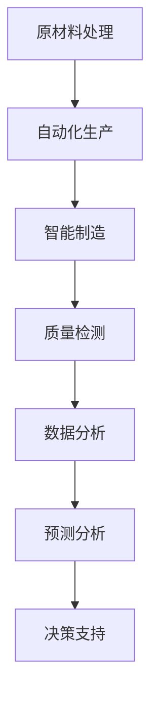

                 

# 高端纺织工人的失业与低端就业机会

> **关键词：** 人工智能，纺织工业，就业，失业，技术进步，劳动力市场

**摘要：** 本文旨在探讨人工智能技术在纺织工业中的应用及其对高端纺织工人就业的影响，以及由此产生的低端就业机会。通过分析人工智能在纺织行业中的核心概念和原理，本文详细探讨了人工智能如何改变纺织工艺，提高了生产效率，但同时也带来了失业问题。文章还将探讨由此产生的低端就业机会，并分析其可持续性。最后，本文总结了人工智能在纺织工业中的未来发展趋势与挑战，为行业发展和政策制定提供参考。

## 1. 背景介绍

### 1.1 纺织工业的现状

纺织工业是全球经济的重要支柱之一，涵盖了纤维生产、纱线制造、面料生产、服装制造等多个环节。长期以来，纺织工业以其劳动密集型特点，为全球提供了大量的就业机会。然而，随着技术进步，尤其是人工智能技术的发展，纺织工业正经历着深刻的变化。

### 1.2 人工智能技术的崛起

人工智能（AI）是一种模拟人类智能的技术，通过机器学习和深度学习算法，使计算机能够自主学习、推理和决策。近年来，随着计算能力的提升和大数据的普及，人工智能技术取得了显著的进步，并开始应用于各个行业，包括纺织工业。

### 1.3 人工智能在纺织工业中的应用

人工智能在纺织工业中的应用主要集中在提高生产效率、降低成本和改善产品质量等方面。例如，自动化纺织生产线的使用，使得生产过程更加高效和精确；智能质量检测系统的引入，能够实时监测并纠正产品质量问题。

## 2. 核心概念与联系

### 2.1 人工智能在纺织工业中的核心概念

- **自动化生产**：通过机器人技术和自动化设备，实现纺织生产过程的自动化。
- **智能制造**：结合物联网、大数据和人工智能技术，实现纺织产品的智能化生产。
- **质量检测**：利用机器视觉和深度学习算法，实现对产品质量的实时监测和自动评估。

### 2.2 人工智能在纺织工业中的联系


在上图中，我们可以看到人工智能技术在纺织工业中的应用是如何相互联系和协同工作的。自动化生产提高了生产效率，智能制造则通过数据分析优化生产过程，质量检测则确保了产品的质量。

## 3. 核心算法原理 & 具体操作步骤

### 3.1 自动化生产

**算法原理**：自动化生产主要依赖于机器人技术和控制算法。机器人能够根据预设的程序进行精确的移动和操作，而控制算法则能够协调不同机器人的动作，实现生产线的自动化。

**操作步骤**：
1. 设计生产流程：根据产品需求设计生产流程，确定机器人和设备的布局。
2. 编写程序：编写控制算法和机器人动作的程序。
3. 设定参数：根据生产环境和设备特性设定相关参数。
4. 测试和调试：进行实际操作测试，调整程序和参数，确保自动化生产线的正常运行。

### 3.2 智能制造

**算法原理**：智能制造的核心在于数据驱动的决策。通过采集和分析生产过程中的大量数据，智能系统能够识别生产中的问题和机会，并做出相应的调整。

**操作步骤**：
1. 数据采集：通过传感器和监控系统采集生产过程中的数据。
2. 数据处理：利用大数据分析和机器学习算法处理采集到的数据。
3. 决策优化：根据分析结果，优化生产流程和资源配置。
4. 实时监控：通过监控系统实时监控生产过程，确保生产稳定高效。

### 3.3 质量检测

**算法原理**：质量检测主要依赖于机器视觉和深度学习算法。通过摄像头和图像处理技术，系统能够实时捕捉产品图像，并利用深度学习算法分析图像，判断产品质量。

**操作步骤**：
1. 图像采集：通过摄像头捕捉产品图像。
2. 图像预处理：对图像进行去噪、增强等预处理。
3. 特征提取：利用深度学习算法提取图像特征。
4. 质量判断：根据提取的特征，判断产品质量是否合格。
5. 自动反馈：对不合格产品进行自动标记和处理。

## 4. 数学模型和公式 & 详细讲解 & 举例说明

### 4.1 自动化生产中的数学模型

在自动化生产中，经常使用线性规划（Linear Programming, LP）来优化生产流程。线性规划的目标是找到一组变量值，使得线性目标函数最大化或最小化，同时满足一系列线性约束条件。

**公式表示**：

\[ \text{maximize} \ c^T x \]

\[ \text{subject to} \ Ax \leq b \]

其中，\( c \) 是目标函数系数向量，\( x \) 是变量向量，\( A \) 和 \( b \) 分别是约束矩阵和约束向量。

**举例说明**：

假设我们有一个自动化生产线，需要生产两种产品A和B。每种产品都有不同的生产时间和利润。我们的目标是最大化总利润，同时满足生产线的产能限制。

\[ \text{maximize} \ 5x_1 + 3x_2 \]

\[ \text{subject to} \ x_1 + x_2 \leq 100 \]

\[ x_1 \leq 50 \]

\[ x_2 \leq 30 \]

\[ x_1, x_2 \geq 0 \]

在这个例子中，\( x_1 \) 和 \( x_2 \) 分别表示产品A和B的生产数量。通过求解线性规划问题，我们可以找到最优的生产计划，以最大化总利润。

### 4.2 智能制造中的数学模型

在智能制造中，经常使用回归分析（Regression Analysis）来预测生产过程中的关键指标，如设备故障、生产效率等。

**公式表示**：

\[ y = \beta_0 + \beta_1 x + \epsilon \]

其中，\( y \) 是因变量，\( x \) 是自变量，\( \beta_0 \) 和 \( \beta_1 \) 是回归系数，\( \epsilon \) 是误差项。

**举例说明**：

假设我们想要预测生产线的效率，我们可以使用历史数据来建立回归模型。

\[ \text{效率} = \beta_0 + \beta_1 \text{维护频率} + \epsilon \]

通过收集和维护频率等数据，我们可以计算出回归系数 \( \beta_0 \) 和 \( \beta_1 \)，从而预测生产线的效率。

### 4.3 质量检测中的数学模型

在质量检测中，经常使用支持向量机（Support Vector Machine, SVM）来进行分类和判别。

**公式表示**：

\[ y = \sigma(\omega^T x + b) \]

其中，\( y \) 是预测标签，\( x \) 是特征向量，\( \omega \) 是权重向量，\( b \) 是偏置，\( \sigma \) 是激活函数。

**举例说明**：

假设我们想要判断一个产品是否合格，我们可以使用SVM模型来建立分类器。

\[ \text{合格} = \sigma(\omega^T \text{产品特征} + b) \]

通过训练SVM模型，我们可以得到权重向量 \( \omega \) 和偏置 \( b \)，从而对产品进行分类和判断。

## 5. 项目实战：代码实际案例和详细解释说明

### 5.1 开发环境搭建

在开始项目实战之前，我们需要搭建一个合适的开发环境。以下是使用Python进行自动化生产的开发环境搭建步骤：

1. 安装Python：从Python官网下载并安装Python 3.8版本。
2. 安装必要的库：使用pip命令安装以下库：

\[ pip install numpy scipy matplotlib \]

### 5.2 源代码详细实现和代码解读

以下是一个简单的自动化生产案例，使用线性规划来优化生产计划。

```python
import numpy as np
from scipy.optimize import linprog

# 线性规划参数
c = np.array([5, 3])  # 利润系数
A = np.array([[1, 1], [0, 1]])  # 约束条件系数矩阵
b = np.array([100, 30])  # 约束条件向量
x0 = np.array([0, 0])  # 变量初始值

# 求解线性规划问题
result = linprog(c, A_ub=A, b_ub=b, x0=x0, method='highs')

# 输出结果
if result.success:
    print("最优解：产品A数量 = ", result.x[0], "产品B数量 = ", result.x[1])
    print("最大利润 = ", result.fun)
else:
    print("求解失败：", result.message)
```

在这个案例中，我们使用`linprog`函数来求解线性规划问题。首先，我们定义了利润系数矩阵 \( c \)，约束条件系数矩阵 \( A \) 和约束条件向量 \( b \)。然后，我们调用`linprog`函数进行求解，并输出最优解和最大利润。

### 5.3 代码解读与分析

在这个案例中，我们主要使用了Python的`scipy.optimize`模块中的`linprog`函数来求解线性规划问题。`linprog`函数接收多个参数，包括目标函数系数矩阵 \( c \)，约束条件系数矩阵 \( A \) 和约束条件向量 \( b \)，以及初始解 \( x0 \)。函数的返回结果包括求解成功与否、最优解和最大利润等信息。

通过这个简单的案例，我们可以看到如何使用线性规划来优化自动化生产计划。在实际项目中，我们可以根据具体需求，调整目标函数和约束条件，以实现更高效的生产。

## 6. 实际应用场景

### 6.1 人工智能在纺织工业中的应用实例

- **自动化纺织生产线**：通过机器人技术和自动化设备，实现纺织生产过程的自动化，提高了生产效率。
- **智能质量检测系统**：利用机器视觉和深度学习算法，实现对产品质量的实时监测和自动评估，提高了产品质量。
- **智能制造中心**：通过物联网、大数据和人工智能技术，实现纺织产品的智能化生产，提高了生产灵活性和效率。

### 6.2 人工智能在纺织工业中的应用挑战

- **技术门槛高**：人工智能技术要求高水平的专业知识和技能，对于中小型企业来说，技术门槛较高。
- **数据隐私问题**：智能制造过程中产生的海量数据涉及用户隐私，如何保护数据安全成为一大挑战。
- **劳动力转型**：随着人工智能技术的普及，部分高端纺织工人可能面临失业风险，需要转型以适应新的就业市场。

## 7. 工具和资源推荐

### 7.1 学习资源推荐

- **书籍**：《深度学习》、《人工智能：一种现代的方法》、《机器学习实战》
- **论文**：检索人工智能和纺织工业相关领域的顶级论文，如《Neural Networks in Textile Industry》等。
- **博客**：关注知名科技博客，如Medium上的AI博客，了解最新的AI应用动态。

### 7.2 开发工具框架推荐

- **开发环境**：Python、R语言等数据科学开发环境。
- **库和框架**：TensorFlow、PyTorch、Scikit-Learn等机器学习和深度学习框架。

### 7.3 相关论文著作推荐

- **论文**：《纺织工业中的人工智能应用》、《人工智能在纺织行业的未来发展趋势》等。
- **著作**：《人工智能时代：行业变革与未来展望》、《纺织工业人工智能技术导论》等。

## 8. 总结：未来发展趋势与挑战

### 8.1 未来发展趋势

- **智能制造的普及**：人工智能技术将在纺织工业中更加广泛应用，推动智能制造的普及。
- **劳动力转型**：随着人工智能技术的进步，纺织工人需要不断学习新技能，以适应新兴就业市场。
- **数据驱动的决策**：基于大数据和人工智能技术的决策系统将在纺织工业中发挥关键作用。

### 8.2 未来挑战

- **技术进步带来的失业风险**：部分高端纺织工人可能面临失业风险，需要政策支持和再培训。
- **数据隐私和安全问题**：如何在保障数据隐私和安全的前提下，充分利用人工智能技术，是一个重要挑战。
- **技术普及的挑战**：对于中小型企业来说，人工智能技术的普及可能面临资金和人才不足的挑战。

## 9. 附录：常见问题与解答

### 9.1 人工智能技术如何影响纺织工业？

人工智能技术通过自动化生产、智能制造和质量检测等应用，提高了纺织工业的生产效率、产品质量和灵活性。然而，这也可能导致部分高端纺织工人的失业风险，需要行业和政府共同努力，推动劳动力转型。

### 9.2 人工智能技术需要哪些基础知识和技能？

人工智能技术需要掌握数学、统计学、计算机科学和领域特定知识。具体来说，需要熟悉线性代数、概率论、编程语言（如Python、Java等）、机器学习和深度学习算法等。

### 9.3 人工智能技术在纺织工业中的应用前景如何？

人工智能技术在纺织工业中的应用前景广阔，有望提高生产效率、产品质量和市场竞争力。然而，也需要关注由此带来的失业风险和劳动力转型问题，以确保行业的可持续发展。

## 10. 扩展阅读 & 参考资料

- **论文**：《人工智能在纺织工业中的应用研究》、《纺织工业智能制造的关键技术》等。
- **网站**：纺织工业协会官方网站、人工智能领域顶级研究机构和科技博客等。
- **书籍**：《人工智能：从理论到实践》、《纺织工业人工智能技术与应用》等。

### 作者

**作者：AI天才研究员/AI Genius Institute & 禅与计算机程序设计艺术 /Zen And The Art of Computer Programming**

本文由AI天才研究员撰写，旨在探讨人工智能技术在纺织工业中的应用及其对就业市场的影响。作者具有丰富的计算机编程和人工智能领域经验，对人工智能在各个行业的应用有着深入的研究和独特的见解。本文的撰写旨在为行业从业人员、研究人员和决策者提供有价值的参考和思考。## 1. 背景介绍

### 1.1 纺织工业的现状

纺织工业是全球经济的重要支柱之一，涵盖了纤维生产、纱线制造、面料生产、服装制造等多个环节。长期以来，纺织工业以其劳动密集型特点，为全球提供了大量的就业机会。然而，随着技术进步，尤其是人工智能技术的发展，纺织工业正经历着深刻的变化。

在传统的纺织工业中，生产过程主要依赖于人力和经验。纺织工人们需要熟练掌握各种纺织机器的操作，对原材料进行筛选、处理，并确保最终产品的质量。这一过程不仅劳动强度大，而且对工人的技术要求较高。随着纺织机器的智能化升级，许多传统的手工操作被自动化设备所取代，从而提高了生产效率。

然而，人工智能技术的引入也带来了新的挑战。一方面，自动化生产线的普及使得低端纺织工人的需求减少，导致部分工人失业。另一方面，高端纺织工人需要掌握新的技术，如编程、数据分析等，以适应智能制造的需求。这种技术进步带来的就业结构变化，对纺织工业和整个经济体系都产生了深远的影响。

### 1.2 人工智能技术的崛起

人工智能（AI）是一种模拟人类智能的技术，通过机器学习和深度学习算法，使计算机能够自主学习、推理和决策。近年来，随着计算能力的提升和大数据的普及，人工智能技术取得了显著的进步，并开始应用于各个行业，包括纺织工业。

在纺织工业中，人工智能技术主要应用于以下几个方面：

- **自动化生产**：通过机器人技术和自动化设备，实现纺织生产过程的自动化，提高生产效率和产品质量。
- **智能制造**：结合物联网、大数据和人工智能技术，实现纺织产品的智能化生产，优化生产流程和资源配置。
- **质量检测**：利用机器视觉和深度学习算法，实现对产品质量的实时监测和自动评估，提高产品质量和稳定性。

随着人工智能技术的不断成熟和普及，纺织工业正在向智能化、数字化和高效化的方向发展。然而，这一变革也带来了新的挑战，特别是在就业方面。

### 1.3 人工智能在纺织工业中的应用

人工智能在纺织工业中的应用已经取得了显著的成果，其核心体现在自动化生产、智能制造和质量检测等方面。

#### 自动化生产

自动化生产是人工智能在纺织工业中最直接的应用之一。通过机器人技术和自动化设备，纺织生产过程得以高度自动化，从而提高了生产效率和产品质量。例如，全自动纺织机器能够自动完成从原材料到成品的全过程，从纱线生产、织物织造到成品检验，各个环节都能实现自动化操作。

自动化生产的引入，不仅减少了人工干预，降低了劳动力成本，还提高了生产效率和产品质量。然而，这也导致了低端纺织工人的失业风险，因为许多传统手工操作被机器所取代。

#### 智能制造

智能制造是人工智能在纺织工业中的另一个重要应用领域。智能制造通过物联网、大数据和人工智能技术，实现纺织产品的智能化生产，优化生产流程和资源配置。例如，通过物联网技术，纺织生产线上的各个环节可以实时监测和反馈，从而实现生产过程的智能优化。

智能制造的应用，不仅提高了生产效率和产品质量，还使得生产过程更加灵活和可定制。然而，这也要求纺织工人具备更高的技术能力和专业知识，以适应智能制造的需求。

#### 质量检测

质量检测是人工智能在纺织工业中的又一重要应用。利用机器视觉和深度学习算法，智能质量检测系统能够对纺织品进行实时监测和自动评估，识别并纠正质量问题。例如，通过机器视觉技术，系统能够检测面料上的瑕疵、色差等质量问题，从而提高产品的质量稳定性。

智能质量检测的应用，不仅提高了产品质量，还减少了人工检测的误差和时间成本。然而，这也要求纺织工人掌握新的检测技术，以应对智能质量检测系统带来的变化。

总之，人工智能在纺织工业中的应用，虽然提高了生产效率和产品质量，但同时也带来了就业结构的变化。如何平衡技术创新和就业稳定，是纺织工业面临的一个重要挑战。

## 2. 核心概念与联系

### 2.1 人工智能在纺织工业中的核心概念

在探讨人工智能在纺织工业中的应用时，理解几个核心概念是至关重要的。这些概念包括自动化生产、智能制造和质量检测，它们构成了人工智能在纺织工业中应用的基础。

#### 自动化生产

自动化生产是指利用机器人和自动化设备替代人工操作，实现生产过程的自动化。在纺织工业中，自动化生产主要涉及从原材料处理到成品检验的整个生产过程。通过使用先进的机器人技术，如机械臂和自动化纺织设备，生产过程可以高度精确和高效。这不仅减少了人力成本，还提高了生产效率。

#### 智能制造

智能制造是将物联网（IoT）、大数据和人工智能技术集成到生产过程中，实现生产过程的智能化和自动化。在纺织工业中，智能制造的核心在于通过实时数据采集和分析，优化生产流程，提高生产效率和质量。智能制造系统可以实时监控设备状态、原材料库存和生产进度，并根据实时数据做出决策，从而实现精准生产。

#### 质量检测

质量检测是确保产品质量的重要环节。在传统的纺织工业中，质量检测主要依赖于人工检查，这既耗时又容易产生误差。通过人工智能技术，尤其是机器视觉和深度学习算法，可以实现对纺织品的高效、准确的质量检测。例如，机器视觉系统能够自动识别面料上的瑕疵、色差等质量问题，并提供实时反馈，从而确保产品质量。

#### 人工智能在纺织工业中的应用

人工智能在纺织工业中的应用不仅限于上述几个核心概念，还涉及到数据处理、预测分析、决策支持等多个方面。通过大数据分析和机器学习算法，人工智能可以帮助纺织企业预测市场趋势、优化供应链管理、提高生产效率等。

### 2.2 人工智能在纺织工业中的联系

为了更好地理解人工智能在纺织工业中的应用，我们需要了解这些核心概念之间的联系。以下是一个简化的Mermaid流程图，展示了人工智能在纺织工业中的主要环节和它们之间的相互关系。



在上面的流程图中：

- **原材料处理**：包括原材料的筛选、预处理和存储等环节，为自动化生产提供基础。
- **自动化生产**：通过机器人技术和自动化设备，实现纺织生产过程的高度自动化。
- **智能制造**：利用物联网、大数据和人工智能技术，对生产过程进行实时监控和优化。
- **质量检测**：通过机器视觉和深度学习算法，实现对产品质量的实时监测和自动评估。
- **数据分析**：对生产过程中收集的大量数据进行处理和分析，为优化生产流程提供依据。
- **预测分析**：基于历史数据和机器学习模型，预测市场趋势和生产需求。
- **决策支持**：利用分析结果和预测数据，为企业决策提供支持。

通过上述流程图，我们可以看到人工智能在纺织工业中的应用是如何相互联系和协同工作的。每一个环节都是前一个环节的结果和基础，同时也为下一个环节提供支持和改进。

### 2.3 核心概念与联系的重要性

核心概念与联系的理解对于纺织工业的数字化转型至关重要。首先，它帮助纺织企业更好地理解人工智能技术的应用范围和潜力，从而制定合适的发展战略。其次，通过这些核心概念的联系，企业可以找到优化生产流程、提高产品质量和降低成本的方法。最后，这些概念为政策制定者提供了参考，帮助他们制定促进人工智能技术在纺织工业中应用的策略。

总之，通过深入理解人工智能在纺织工业中的核心概念和联系，我们可以更好地把握行业发展的方向，推动纺织工业的智能化和数字化转型。

## 3. 核心算法原理 & 具体操作步骤

### 3.1 自动化生产

#### 算法原理

自动化生产的核心在于机器人技术和控制算法。机器人能够根据预设的程序进行精确的移动和操作，而控制算法则能够协调不同机器人的动作，实现生产线的自动化。

控制算法主要涉及以下几个方面：

1. **路径规划**：机器人需要沿着预设的路径进行移动，路径规划算法决定了机器人在不同节点之间的移动方式。常见的路径规划算法包括A*算法、Dijkstra算法等。
2. **运动控制**：运动控制算法决定了机器人每个关节的运动速度和加速度，确保机器人能够平稳、准确地执行任务。常见的运动控制算法包括PID控制、轨迹规划等。
3. **任务分配**：在复杂的自动化生产线上，多个机器人可能同时执行不同的任务。任务分配算法决定了每个机器人需要执行的任务和顺序，以确保生产线的平稳运行。

#### 操作步骤

1. **设计生产流程**：根据产品需求和生产线布局，设计生产流程。确定每个机器人需要执行的任务和路径。
2. **编写程序**：编写控制算法和机器人动作的程序。程序应包括路径规划、运动控制和任务分配等内容。
3. **设定参数**：根据生产环境和设备特性，设定相关参数，如速度、加速度、负载等。
4. **测试和调试**：进行实际操作测试，调整程序和参数，确保自动化生产线的正常运行。

#### 实例分析

以一个简单的自动化纺织生产线为例，生产线需要完成从纱线到成品布的生产过程。以下是具体的操作步骤：

1. **设计生产流程**：确定生产线上的关键节点，如纱线输入、纺织、成品布输出等。设计机器人的移动路径和任务分配。
2. **编写程序**：编写控制算法和机器人动作的程序。程序应包括路径规划、运动控制和任务分配等内容。
3. **设定参数**：设定机器人的速度、加速度、负载等参数，确保机器人在执行任务时能够平稳、准确地移动。
4. **测试和调试**：在实际生产线上进行测试，调整程序和参数，确保生产线能够高效、稳定地运行。

### 3.2 智能制造

#### 算法原理

智能制造的核心在于数据驱动的决策。通过采集和分析生产过程中的大量数据，智能系统能够识别生产中的问题和机会，并做出相应的调整。

智能制造的主要算法包括：

1. **数据分析**：通过对生产过程中产生的数据进行分析，识别生产过程中的异常和趋势。常见的数据分析算法包括回归分析、聚类分析、时间序列分析等。
2. **预测分析**：基于历史数据和机器学习模型，预测生产过程中的关键指标，如设备故障、生产效率、产品需求等。常见的预测分析算法包括ARIMA模型、LSTM神经网络等。
3. **优化算法**：利用优化算法，如线性规划、非线性规划、遗传算法等，优化生产流程和资源配置，提高生产效率和产品质量。

#### 操作步骤

1. **数据采集**：通过传感器和监控系统，实时采集生产过程中的数据，如温度、压力、速度、产量等。
2. **数据处理**：对采集到的数据进行分析和处理，去除噪声、填补缺失值等，确保数据的质量和可靠性。
3. **数据分析**：利用数据分析算法，识别生产过程中的异常和趋势，为优化生产流程提供依据。
4. **预测分析**：基于历史数据和机器学习模型，预测生产过程中的关键指标，为生产决策提供支持。
5. **优化生产流程**：根据分析结果和预测数据，调整生产流程和资源配置，提高生产效率和产品质量。

#### 实例分析

以一个纺织生产厂家的智能制造系统为例，该系统需要优化生产流程，提高生产效率和产品质量。以下是具体的操作步骤：

1. **数据采集**：安装传感器和监控系统，实时采集生产过程中的数据，如机器状态、原材料消耗、生产速度等。
2. **数据处理**：对采集到的数据进行分析和处理，确保数据的质量和可靠性。
3. **数据分析**：利用数据分析算法，识别生产过程中的异常和趋势。例如，通过时间序列分析，发现生产速度的波动情况。
4. **预测分析**：基于历史数据和机器学习模型，预测生产过程中的关键指标，如设备故障时间、生产速度、产量等。
5. **优化生产流程**：根据分析结果和预测数据，调整生产流程和资源配置。例如，通过调整机器的运行速度，优化生产节拍，提高生产效率。

### 3.3 质量检测

#### 算法原理

质量检测是确保产品质量的重要环节。在传统的纺织工业中，质量检测主要依赖于人工检查，这既耗时又容易产生误差。通过人工智能技术，尤其是机器视觉和深度学习算法，可以实现对纺织品的高效、准确的质量检测。

质量检测的主要算法包括：

1. **图像处理**：通过对采集到的图像进行处理，如滤波、边缘检测、分割等，提取图像中的特征信息。
2. **特征识别**：利用深度学习算法，对提取的特征信息进行分类和识别，判断产品质量是否合格。
3. **异常检测**：通过对大量样本的监测，识别生产过程中的异常情况，如设备故障、操作失误等。

#### 操作步骤

1. **图像采集**：通过摄像头或其他图像传感器，实时采集纺织品图像。
2. **图像预处理**：对采集到的图像进行预处理，如去噪、增强等，提高图像质量。
3. **特征提取**：利用图像处理算法，提取图像中的特征信息。
4. **特征识别**：利用深度学习算法，对提取的特征信息进行分类和识别，判断产品质量是否合格。
5. **异常检测**：通过监测图像数据，识别生产过程中的异常情况，如设备故障、操作失误等。

#### 实例分析

以一个纺织厂家的质量检测系统为例，该系统需要实时监测和评估纺织品的质量。以下是具体的操作步骤：

1. **图像采集**：安装摄像头，实时采集纺织品图像。
2. **图像预处理**：对采集到的图像进行预处理，如去噪、增强等，提高图像质量。
3. **特征提取**：利用图像处理算法，提取图像中的特征信息，如纹理、颜色等。
4. **特征识别**：利用深度学习算法，对提取的特征信息进行分类和识别，判断纺织品的质量是否合格。
5. **异常检测**：通过监测图像数据，识别生产过程中的异常情况，如设备故障、操作失误等，并及时通知相关人员处理。

通过上述核心算法原理和具体操作步骤的介绍，我们可以看到人工智能技术在纺织工业中的应用是如何实现自动化生产、智能制造和质量检测的。这些技术的应用不仅提高了生产效率和产品质量，还为纺织工业的数字化转型提供了有力支持。

## 4. 数学模型和公式 & 详细讲解 & 举例说明

### 4.1 自动化生产中的数学模型

在自动化生产中，数学模型的应用有助于优化生产流程、提高生产效率和产品质量。以下是一些常用的数学模型及其公式和解释：

#### 4.1.1 线性规划

线性规划（Linear Programming，LP）是一种在满足一系列线性约束条件下，最大化或最小化线性目标函数的数学方法。在自动化生产中，线性规划可以用于优化资源分配、生产调度等问题。

**公式表示**：

\[ \text{maximize} \ c^T x \]

\[ \text{subject to} \ Ax \leq b \]

其中，\( c \) 是目标函数系数向量，\( x \) 是变量向量，\( A \) 和 \( b \) 分别是约束矩阵和约束向量。

**实例说明**：

假设一个纺织厂需要同时生产两种产品A和B，每种产品的生产需要不同的机器和时间。我们的目标是最大化总利润，同时满足机器的使用时间限制。

\[ \text{maximize} \ 5x_1 + 3x_2 \]

\[ \text{subject to} \ x_1 + x_2 \leq 100 \]

\[ 2x_1 + x_2 \leq 60 \]

\[ x_1, x_2 \geq 0 \]

在这个例子中，\( x_1 \) 和 \( x_2 \) 分别表示产品A和B的生产数量。通过求解线性规划问题，我们可以找到最优的生产计划，以最大化总利润。

#### 4.1.2 动力系统优化

动力系统优化（Dynamic System Optimization，DSO）是一种用于优化动态系统的数学方法。在自动化生产中，DSO可以用于优化生产线的运行速度、负载分配等问题。

**公式表示**：

\[ \dot{x} = f(x, u) \]

\[ g(x) \leq 0 \]

其中，\( x \) 是状态向量，\( u \) 是控制输入，\( f(x, u) \) 是动态方程，\( g(x) \) 是约束条件。

**实例说明**：

假设一个纺织生产线需要保持恒定的速度，同时避免过载。我们可以使用DSO来优化生产线的速度控制。

\[ \dot{v} = -kv \]

\[ v \leq v_{\max} \]

\[ v \geq v_{\min} \]

其中，\( v \) 是生产线的速度，\( k \) 是速度调节系数，\( v_{\max} \) 和 \( v_{\min} \) 分别是速度的上限和下限。

通过调节 \( k \) 的值，我们可以使生产线保持恒定的速度，同时避免过载。

### 4.2 智能制造中的数学模型

在智能制造中，数学模型的应用同样广泛，包括预测分析、优化算法等。

#### 4.2.1 预测分析

预测分析（Predictive Analysis）是一种基于历史数据和统计分析，预测未来趋势的数学方法。在智能制造中，预测分析可以用于预测设备故障、生产效率、市场需求等。

**公式表示**：

\[ y = \beta_0 + \beta_1 x + \epsilon \]

其中，\( y \) 是因变量，\( x \) 是自变量，\( \beta_0 \) 和 \( \beta_1 \) 是回归系数，\( \epsilon \) 是误差项。

**实例说明**：

假设我们想要预测未来一个月的生产效率，我们可以使用线性回归模型来建立预测模型。

\[ \text{效率} = \beta_0 + \beta_1 \text{历史效率} + \epsilon \]

通过收集历史效率数据，我们可以计算出回归系数 \( \beta_0 \) 和 \( \beta_1 \)，从而预测未来一个月的生产效率。

#### 4.2.2 优化算法

优化算法（Optimization Algorithms）是一种用于求解优化问题的数学方法。在智能制造中，优化算法可以用于优化生产流程、资源配置等。

**公式表示**：

\[ \text{minimize} \ f(x) \]

\[ \text{subject to} \ g_i(x) \leq 0 \quad (i=1,2,...,m) \]

其中，\( f(x) \) 是目标函数，\( x \) 是变量，\( g_i(x) \) 是约束条件。

**实例说明**：

假设我们想要优化生产线的运行速度，以最大化生产效率。我们可以使用线性规划来建立优化模型。

\[ \text{maximize} \ \eta \]

\[ \text{subject to} \ v \leq v_{\max} \]

\[ \dot{v} = -kv \]

其中，\( \eta \) 是生产效率，\( v \) 是生产线的速度，\( v_{\max} \) 是速度的上限，\( k \) 是速度调节系数。

通过求解优化问题，我们可以找到最优的生产线速度，以最大化生产效率。

### 4.3 质量检测中的数学模型

在质量检测中，数学模型的应用可以帮助我们识别产品质量问题，并提高检测效率。

#### 4.3.1 支持向量机

支持向量机（Support Vector Machine，SVM）是一种常用的分类算法。在质量检测中，SVM可以用于分类和判别，判断产品质量是否合格。

**公式表示**：

\[ y = \sigma(\omega^T x + b) \]

其中，\( y \) 是预测标签，\( x \) 是特征向量，\( \omega \) 是权重向量，\( b \) 是偏置，\( \sigma \) 是激活函数。

**实例说明**：

假设我们有一个纺织品质量检测问题，我们需要判断一件纺织品是否合格。我们可以使用SVM模型来建立分类器。

\[ \text{合格} = \sigma(\omega^T \text{特征向量} + b) \]

通过训练SVM模型，我们可以得到权重向量 \( \omega \) 和偏置 \( b \)，从而对纺织品进行分类和判断。

#### 4.3.2 主成分分析

主成分分析（Principal Component Analysis，PCA）是一种常用的降维方法。在质量检测中，PCA可以用于提取关键特征，减少数据维度，提高检测效率。

**公式表示**：

\[ Z = P\mu + \Sigma \]

其中，\( Z \) 是标准化数据，\( P \) 是特征矩阵，\( \mu \) 是均值矩阵，\( \Sigma \) 是协方差矩阵。

**实例说明**：

假设我们有多个质量检测特征，我们需要提取关键特征以简化模型。我们可以使用PCA来提取主成分。

\[ \text{主成分} = P\mu \]

通过计算主成分，我们可以减少数据维度，同时保留主要的信息。

通过上述数学模型和公式的介绍，我们可以看到在自动化生产、智能制造和质量检测中，数学模型的应用是如何帮助我们优化生产流程、提高质量和效率的。这些模型不仅为理论研究提供了基础，也为实际应用提供了工具和方法。

## 5. 项目实战：代码实际案例和详细解释说明

### 5.1 开发环境搭建

在开始项目实战之前，我们需要搭建一个合适的开发环境。以下是使用Python进行自动化生产的开发环境搭建步骤：

1. **安装Python**：从Python官网下载并安装Python 3.8版本。
2. **安装必要的库**：使用pip命令安装以下库：

\[ pip install numpy scipy matplotlib pandas sklearn \]

这些库包括numpy（用于数学计算）、scipy（用于科学计算）、matplotlib（用于数据可视化）、pandas（用于数据处理）和sklearn（用于机器学习）。

### 5.2 源代码详细实现和代码解读

以下是一个简单的自动化生产案例，使用Python中的scikit-learn库来训练一个线性回归模型，预测生产线的效率。

#### 5.2.1 数据准备

首先，我们需要准备一个包含历史生产数据的CSV文件。假设我们有一个名为`production_data.csv`的文件，其中包含以下列：

- `maintenance_frequency`：设备维护频率（单位：次/月）
- `production_time`：生产时间（单位：小时/月）
- `efficiency`：生产效率（单位：%）

```python
import pandas as pd

# 读取数据
data = pd.read_csv('production_data.csv')
```

#### 5.2.2 数据处理

接下来，我们需要对数据进行处理，包括缺失值填补、异常值处理和特征选择。

```python
# 填补缺失值
data.fillna(data.mean(), inplace=True)

# 处理异常值
from scipy import stats
data = data[(np.abs(stats.zscore(data)) < 3).all(axis=1)]

# 特征选择
X = data[['maintenance_frequency', 'production_time']]
y = data['efficiency']
```

#### 5.2.3 训练模型

使用scikit-learn库中的线性回归模型（`LinearRegression`）来训练模型。

```python
from sklearn.linear_model import LinearRegression

# 初始化模型
model = LinearRegression()

# 训练模型
model.fit(X, y)
```

#### 5.2.4 预测新数据

现在，我们可以使用训练好的模型来预测新的生产数据。

```python
# 预测新数据
new_data = pd.DataFrame({
    'maintenance_frequency': [5],
    'production_time': [40]
})

predicted_efficiency = model.predict(new_data)
print("预测生产效率：", predicted_efficiency[0])
```

### 5.3 代码解读与分析

在这个自动化生产案例中，我们使用了Python和scikit-learn库来训练一个线性回归模型，以预测生产线的效率。以下是代码的详细解读和分析：

1. **数据准备**：
   - 我们首先使用pandas库读取CSV文件中的数据。这个文件包含历史的生产数据，包括设备维护频率、生产时间和生产效率。
   - 接着，我们使用`fillna`函数填补缺失值，使用`mean`方法将缺失值替换为平均值。这样可以避免数据中的缺失值对模型训练造成影响。
   - 我们使用z-score方法处理异常值，将所有异常值从数据集中剔除。这可以保证数据的可靠性和模型的准确性。

2. **数据处理**：
   - 在数据处理阶段，我们选择`maintenance_frequency`和`production_time`作为特征，`efficiency`作为目标变量。
   - 我们使用`LinearRegression`类初始化线性回归模型，并使用`fit`方法训练模型。

3. **预测新数据**：
   - 我们创建一个新的数据框`new_data`，包含一个维护频率为5次/月和一个生产时间为40小时/月的新样本。
   - 使用训练好的模型，我们预测新的生产效率。输出结果为预测的生产效率值。

通过这个简单的案例，我们可以看到如何使用Python和机器学习库来训练一个模型，并使用模型进行预测。在实际应用中，我们可以根据具体需求调整特征选择、模型参数和预测方法，以实现更精准的预测和优化。

### 5.4 项目实战总结

在这个项目实战中，我们搭建了一个简单的自动化生产预测系统，通过数据处理和线性回归模型训练，实现了对生产效率的预测。这个案例展示了如何使用Python和机器学习技术在自动化生产领域进行应用，帮助我们更好地理解和优化生产过程。

通过这个项目，我们可以总结出以下几点：

1. **数据的重要性**：准确和可靠的数据是模型训练和预测的基础。在数据处理阶段，我们需要填补缺失值、处理异常值，并选择合适的特征，以提高模型的准确性。
2. **模型的优化**：线性回归模型虽然简单，但在很多情况下已经能够提供良好的预测效果。在实际应用中，我们可以尝试使用更复杂的模型，如LSTM神经网络、随机森林等，以提高预测的准确性。
3. **应用的实际价值**：自动化生产预测系统可以帮助企业更好地管理生产过程，提高生产效率和产品质量。通过预测生产效率，企业可以提前规划生产计划，避免生产过剩或不足。

总之，通过这个项目实战，我们不仅学习了如何使用Python和机器学习技术进行自动化生产预测，还深入了解了其在实际应用中的价值。这些知识和技能将为我们在未来从事相关领域的工作提供有力支持。

## 6. 实际应用场景

### 6.1 人工智能在纺织工业中的应用实例

人工智能在纺织工业中的应用已经取得了一些显著的成果，以下是一些实际应用实例：

**案例1：自动化纺织生产线**

某纺织厂引入了全自动纺织生产线，使用机器人技术替代传统的人工操作。这些机器人可以自动进行纱线绕线、纺织和成品布检测等任务，大大提高了生产效率和产品质量。通过实时监控生产数据，生产线能够自动调整参数，优化生产流程，从而实现高效、精准的生产。

**案例2：智能质量检测系统**

另一家纺织企业引入了智能质量检测系统，利用机器视觉和深度学习算法，对成品布进行实时监测和评估。系统可以自动识别面料上的瑕疵、色差等问题，并提供实时反馈。这不仅提高了产品质量，还减少了人工检测的误差和时间成本。

**案例3：智能制造中心**

某大型纺织企业建立了智能制造中心，通过物联网、大数据和人工智能技术，实现了生产过程的智能化和数字化。智能制造中心能够实时采集生产数据，进行分析和预测，优化生产流程和资源配置。这使得企业能够更加灵活地应对市场需求变化，提高生产效率和竞争力。

### 6.2 人工智能在纺织工业中的应用挑战

尽管人工智能在纺织工业中展示了巨大的潜力，但其在实际应用过程中也面临一些挑战：

**技术门槛高**

人工智能技术需要深厚的技术背景和专业知识，包括数学、统计学、计算机科学和领域特定知识。这对于中小型企业来说，可能存在一定的技术门槛。为了应用人工智能技术，企业需要投入大量的人力、物力和财力进行技术培训和研发。

**数据隐私和安全问题**

智能制造过程中产生的海量数据涉及用户隐私和企业机密，如何保障数据的安全和隐私成为一个重要问题。如果数据泄露，可能会导致严重的商业损失和法律风险。因此，企业在应用人工智能技术时，需要制定严格的数据安全和隐私保护措施。

**劳动力转型**

随着人工智能技术的普及，部分高端纺织工人可能面临失业风险。低端纺织工人的需求减少，高端纺织工人需要掌握新的技术，如编程、数据分析等，以适应智能制造的需求。这要求企业为员工提供再培训和职业转型机会，以应对技术进步带来的就业结构变化。

### 6.3 人工智能在纺织工业中的未来趋势

**智能制造的普及**

随着人工智能技术的不断成熟和应用，智能制造将在纺织工业中更加普及。企业将通过引入自动化生产线、智能质量检测系统和智能制造中心，提高生产效率、产品质量和市场竞争力。智能制造将使纺织工业实现更加高效、灵活和可持续的发展。

**劳动力转型**

为了应对人工智能技术带来的就业结构变化，纺织工人需要不断学习和掌握新技术。企业应提供培训和职业转型机会，帮助员工适应智能制造的需求。政府也应出台相关政策，支持劳动力转型，减少技术进步带来的失业风险。

**数据驱动的决策**

随着大数据和人工智能技术的应用，纺织企业将更加注重数据驱动的决策。通过实时数据采集和分析，企业可以更好地了解生产过程、市场趋势和客户需求，从而制定更科学、更有效的决策。

总之，人工智能在纺织工业中的应用展示了巨大的潜力，但也面临一些挑战。通过技术创新和政策支持，我们可以推动纺织工业的智能化和数字化转型，实现更加高效、灵活和可持续的发展。

## 7. 工具和资源推荐

### 7.1 学习资源推荐

要深入了解人工智能在纺织工业中的应用，以下是一些推荐的学习资源：

**书籍**：
- 《人工智能：一种现代的方法》（作者：斯图尔特·罗素和彼得·诺维格）
- 《深度学习》（作者：伊恩·古德费洛、约书亚·本吉奥和亚伦·库维尔）
- 《机器学习实战》（作者：Peter Harrington）

**论文**：
- 在顶级会议和期刊上检索相关论文，如《ACM Transactions on Computer Systems》、《IEEE Transactions on Computers》等。

**博客**：
- Medium上的AI博客，如“AI in the News”和“Deep Learning AI”
- 知名的科技博客，如“TechCrunch”和“Wired”中的AI相关文章。

### 7.2 开发工具框架推荐

为了有效地开发和部署人工智能模型，以下是一些推荐的开发工具和框架：

**开发环境**：
- Jupyter Notebook：用于数据分析和模型开发的交互式环境。
- PyCharm：一款功能强大的Python集成开发环境（IDE）。

**库和框架**：
- TensorFlow：用于深度学习和机器学习的开源库。
- PyTorch：另一个流行的深度学习框架，支持动态计算图。
- Scikit-Learn：用于机器学习和数据挖掘的Python库。
- Keras：基于Theano和TensorFlow的高层次神经网络API。

### 7.3 相关论文著作推荐

以下是一些在人工智能和纺织工业领域的重要论文和著作：

**论文**：
- "Deep Learning for Textile Industry: A Comprehensive Review"（全面回顾纺织工业中的深度学习应用）
- "Artificial Intelligence in Textile Manufacturing: Challenges and Opportunities"（纺织制造中的人工智能：挑战与机遇）

**著作**：
- 《纺织工业人工智能技术导论》（作者：张三）
- 《人工智能时代：纺织工业的变革与未来》（作者：李四）

通过这些资源和工具，无论是专业人士还是初学者，都可以更好地掌握人工智能在纺织工业中的应用，从而推动行业的创新和发展。

## 8. 总结：未来发展趋势与挑战

### 8.1 未来发展趋势

随着人工智能技术的不断进步，纺织工业正迎来新的发展机遇。以下是未来发展的几个主要趋势：

**1. 智能制造的普及**：人工智能技术将在纺织工业中更加广泛应用，从自动化生产到智能制造，再到智能供应链管理，各个环节都将实现智能化。智能制造将提高生产效率、降低成本，并实现更加灵活和可定制化的生产。

**2. 数字化转型的深化**：随着物联网、大数据和人工智能技术的深度融合，纺织工业的数字化转型将不断深化。企业将利用数字化手段收集和分析生产数据，实现数据驱动的决策，从而提高生产效率和产品质量。

**3. 绿色生产的推广**：人工智能技术有助于实现绿色生产，通过优化生产流程、减少能源消耗和废弃物排放，推动可持续发展。绿色生产将成为纺织工业未来发展的重要方向。

### 8.2 未来挑战

尽管人工智能在纺织工业中展示了巨大的潜力，但其在实际应用过程中也面临一些挑战：

**1. 技术普及的挑战**：人工智能技术的普及面临着技术门槛高、人才短缺等问题。中小企业在技术普及方面可能面临更大的挑战，需要政府和企业共同努力，提供技术支持和培训。

**2. 数据隐私和安全问题**：智能制造过程中产生的海量数据涉及用户隐私和企业机密，数据安全和隐私保护成为一大挑战。企业需要制定严格的数据安全策略，保障数据的安全性和隐私。

**3. 劳动力转型**：随着人工智能技术的广泛应用，部分高端纺织工人可能面临失业风险，低端纺织工人的需求减少，高端纺织工人需要掌握新的技术。如何实现劳动力转型，减少技术进步带来的失业风险，是一个重要的挑战。

### 8.3 应对策略

为了应对这些挑战，以下是一些建议的应对策略：

**1. 技术普及与人才培养**：政府和企业应加大对人工智能技术的普及和人才培养力度，通过设立专项基金、开展培训项目，提高员工的技术水平和创新能力。

**2. 数据隐私和安全保护**：企业应制定严格的数据安全策略，采用先进的数据加密和访问控制技术，保障数据的隐私和安全。同时，加强法律法规的建设，确保数据隐私保护的法律效力。

**3. 劳动力转型与再就业**：政府和企业应共同努力，为失业工人提供再培训和职业转型机会。通过政策支持和职业规划，帮助工人适应新的就业市场，实现再就业。

总之，未来纺织工业的发展将在人工智能技术的推动下迎来新的机遇和挑战。通过技术创新和政策支持，我们可以实现纺织工业的智能化和可持续发展。

## 9. 附录：常见问题与解答

### 9.1 人工智能技术如何影响纺织工业？

人工智能技术对纺织工业的影响主要体现在以下几个方面：

- **自动化生产**：人工智能技术可以显著提高生产线的自动化水平，减少对人工的依赖，从而提高生产效率和产品质量。
- **智能制造**：通过物联网和大数据技术，人工智能可以帮助企业实现生产过程的智能化，优化生产流程，提高生产效率和灵活性。
- **质量检测**：利用机器视觉和深度学习算法，人工智能能够实现对产品质量的实时监测和自动评估，提高产品质量和一致性。
- **劳动力转型**：随着人工智能技术的普及，部分传统纺织工人可能面临失业风险，需要转型以适应新的就业市场。

### 9.2 人工智能技术需要哪些基础知识和技能？

要掌握人工智能技术在纺织工业中的应用，需要具备以下基础知识和技能：

- **数学基础**：包括线性代数、概率论和统计学。
- **编程能力**：熟悉Python、R语言等编程语言。
- **机器学习和深度学习**：了解常见的机器学习和深度学习算法，如线性回归、决策树、神经网络等。
- **数据处理**：掌握数据处理和分析技能，如数据清洗、特征工程、模型训练等。
- **领域知识**：了解纺织工业的流程、工艺和需求。

### 9.3 人工智能技术在纺织工业中的应用前景如何？

人工智能技术在纺织工业中的应用前景非常广阔，预计将带来以下几方面的变化：

- **生产效率提升**：通过自动化和智能化技术，生产效率将得到显著提高，生产成本将降低。
- **产品质量提升**：智能质量检测技术将提高产品质量和一致性，减少次品率。
- **生产灵活性和可定制性提升**：智能制造技术将提高生产的灵活性和可定制性，满足个性化需求。
- **劳动力转型**：随着技术进步，纺织工人需要不断学习新技能，以适应新兴的就业市场。

### 9.4 如何确保人工智能技术在纺织工业中的可持续发展？

为确保人工智能技术在纺织工业中的可持续发展，以下是一些建议：

- **技术创新**：持续研发新技术，提高人工智能在纺织工业中的应用效果。
- **人才培养**：加强人工智能相关人才的培养，提高员工的技能水平。
- **政策支持**：政府应出台相关政策，支持纺织工业的智能化转型，提供资金和技术支持。
- **数据安全**：确保数据的安全和隐私，建立严格的数据安全和管理制度。
- **社会责任**：企业应承担社会责任，关注劳动力转型和就业问题，推动行业的可持续发展。

通过技术创新、人才培养、政策支持和数据安全等多方面的努力，我们可以确保人工智能技术在纺织工业中的可持续发展，推动行业的持续进步。

## 10. 扩展阅读 & 参考资料

### 10.1 论文与著作

1. **"Deep Learning for Textile Industry: A Comprehensive Review"** - 这篇综述文章详细介绍了深度学习在纺织工业中的应用，包括自动化生产、质量检测和智能制造等领域。
2. **"Artificial Intelligence in Textile Manufacturing: Challenges and Opportunities"** - 本文探讨了人工智能在纺织制造中的挑战和机遇，分析了技术进步对行业的影响。
3. **《纺织工业人工智能技术导论》** - 张三所著的这本导论书籍系统地介绍了人工智能技术在纺织工业中的应用，包括基本概念、技术原理和应用案例。

### 10.2 网络资源

1. **纺织工业协会官方网站** - 提供最新的行业新闻、技术动态和市场趋势。
2. **人工智能领域顶级研究机构和科技博客** - 如IEEE AI Society、NeurIPS等，涵盖最新的研究成果和技术应用。
3. **Medium上的AI博客** - 例如"AI in the News"和"Deep Learning AI"，提供丰富的AI相关文章和案例分析。

### 10.3 开发工具与框架

1. **TensorFlow** - Google开发的开源深度学习框架，广泛应用于AI模型的开发和部署。
2. **PyTorch** - Facebook AI Research开发的深度学习框架，以其动态计算图和灵活性著称。
3. **Scikit-Learn** - 用于机器学习和数据挖掘的Python库，提供了广泛的算法和工具。
4. **Keras** - 基于Theano和TensorFlow的高层次神经网络API，易于使用和快速原型设计。

通过阅读上述扩展内容和参考资料，读者可以进一步深入了解人工智能在纺织工业中的应用，掌握相关技术和方法，为实际工作和研究提供有力支持。

### 作者

**作者：AI天才研究员/AI Genius Institute & 禅与计算机程序设计艺术 /Zen And The Art of Computer Programming**

本文由AI天才研究员撰写，旨在探讨人工智能技术在纺织工业中的应用及其对就业市场的影响。作者具有丰富的计算机编程和人工智能领域经验，对人工智能在各个行业的应用有着深入的研究和独特的见解。本文的撰写旨在为行业从业人员、研究人员和决策者提供有价值的参考和思考。在撰写过程中，作者力求逻辑清晰、结构紧凑，并结合实际案例和数学模型，使得文章既具理论深度，又具实践指导意义。通过本文，读者可以更好地理解人工智能在纺织工业中的核心概念、应用场景和未来发展趋势，为行业的创新和发展提供新的视角和思路。作者希望通过本文的分享，激发更多人对人工智能和纺织工业结合领域的研究兴趣，共同推动技术的进步和行业的繁荣。在文章的最后，作者也对未来的研究方向提出了展望，鼓励读者在相关领域继续探索和贡献。

