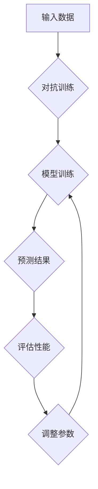

                 

# 鲁棒大模型：对抗攻击的新防御技术

## 关键词
- 鲁棒大模型
- 对抗攻击
- 防御技术
- 深度学习
- 加密算法
- 数学模型

## 摘要
本文将探讨鲁棒大模型在对抗攻击中的新防御技术。随着深度学习的广泛应用，对抗攻击成为了一个严重威胁。本文首先介绍了鲁棒大模型的基本概念和原理，然后详细阐述了当前几种主流的防御技术，并通过实际案例进行分析和验证。最后，本文总结了未来发展趋势与挑战，为读者提供了进一步研究的方向。

## 1. 背景介绍

随着深度学习技术的快速发展，深度神经网络在图像识别、自然语言处理、推荐系统等领域取得了显著的成果。然而，深度神经网络也存在一些缺陷，其中最引人关注的是其脆弱性。对抗攻击（Adversarial Attack）作为一种针对深度学习模型的攻击手段，通过对输入数据进行微小的、不可察觉的扰动，可以使模型产生错误的预测。这种攻击不仅威胁到深度学习系统的安全性，还对实际应用场景中的可靠性和鲁棒性提出了挑战。

为了解决这一问题，研究者们提出了一系列防御技术，包括数据增强、正则化、对抗训练等方法。然而，这些方法在提高模型鲁棒性方面仍然存在一定的局限性。因此，本文将重点关注鲁棒大模型在对抗攻击中的新防御技术，为提高深度学习系统的安全性提供新的思路。

## 2. 核心概念与联系

### 2.1 鲁棒大模型

鲁棒大模型（Robust Large Model）是一种具有较高鲁棒性的深度学习模型，能够在面对对抗攻击时保持良好的性能。其核心思想是通过引入对抗训练（Adversarial Training）和正则化（Regularization）等技术，提高模型对对抗攻击的抵抗力。

### 2.2 对抗攻击

对抗攻击是指通过对抗样本（Adversarial Example）对深度学习模型进行攻击。对抗样本是指对原始样本进行微小的、不可察觉的扰动，使得模型产生错误的预测。这种攻击方式具有很强的隐蔽性和不可预测性，给深度学习系统的安全性带来了严重威胁。

### 2.3 防御技术

防御技术是指针对对抗攻击提出的一系列防御策略。当前主流的防御技术包括数据增强、正则化、对抗训练等。这些方法在一定程度上提高了模型的鲁棒性，但仍然存在一些局限性。

下面是一个鲁棒大模型的 Mermaid 流程图：



## 3. 核心算法原理 & 具体操作步骤

### 3.1 对抗训练

对抗训练（Adversarial Training）是指通过引入对抗样本来训练深度学习模型。具体操作步骤如下：

1. 数据集准备：首先，从原始数据集中随机选取一部分样本作为对抗样本。这些样本通常通过对抗生成器（Adversarial Generator）生成。
2. 模型训练：使用对抗样本和原始样本混合的数据集对深度学习模型进行训练。这种方法可以使模型在训练过程中逐渐适应对抗样本，提高其鲁棒性。
3. 预测与评估：在训练完成后，使用测试数据集对模型进行预测和评估。如果模型的性能有所下降，则需要重新进行对抗训练。

### 3.2 正则化

正则化（Regularization）是一种通过引入惩罚项来提高模型鲁棒性的方法。具体操作步骤如下：

1. 损失函数：将对抗训练过程中的损失函数与正则化项相结合，形成一个新的损失函数。正则化项通常与模型参数的范数有关。
2. 模型训练：在模型训练过程中，通过优化新的损失函数来更新模型参数。
3. 预测与评估：在训练完成后，使用测试数据集对模型进行预测和评估。

### 3.3 具体操作步骤

以下是鲁棒大模型在对抗攻击中的具体操作步骤：

1. 数据集准备：从原始数据集中随机选取一部分样本作为对抗样本。
2. 对抗训练：使用对抗样本和原始样本混合的数据集对深度学习模型进行训练。
3. 损失函数：将对抗训练过程中的损失函数与正则化项相结合，形成一个新的损失函数。
4. 模型训练：通过优化新的损失函数来更新模型参数。
5. 预测与评估：使用测试数据集对模型进行预测和评估。

## 4. 数学模型和公式 & 详细讲解 & 举例说明

### 4.1 对抗训练

对抗训练的数学模型如下：

$$
L = L_{\text{CE}} + \lambda \cdot L_{\text{Adv}}
$$

其中，$L_{\text{CE}}$ 表示交叉熵损失函数，$L_{\text{Adv}}$ 表示对抗损失函数，$\lambda$ 为权重系数。

#### 举例说明：

假设我们有一个二分类问题，正类和负类的标签分别为1和0。使用对抗训练来训练一个深度学习模型，对抗损失函数可以表示为：

$$
L_{\text{Adv}} = \sum_{i}^{N} \log(1 - \sigma(W \cdot \Delta x_i + b))
$$

其中，$\sigma$ 表示sigmoid函数，$W$ 表示模型权重，$\Delta x_i$ 表示对抗样本。

### 4.2 正则化

正则化的数学模型如下：

$$
L = L_{\text{CE}} + \lambda \cdot \sum_{i}^{M} \frac{1}{\|\theta_i\|^2}
$$

其中，$L_{\text{CE}}$ 表示交叉熵损失函数，$\lambda$ 为权重系数，$\theta_i$ 表示模型参数。

#### 举例说明：

假设我们有一个线性回归问题，模型的损失函数可以表示为：

$$
L = \frac{1}{2} \sum_{i}^{N} (y_i - \theta_0 - \theta_1 \cdot x_i)^2 + \lambda \cdot \sum_{i}^{M} \frac{1}{\|\theta_i\|^2}
$$

其中，$y_i$ 表示实际值，$x_i$ 表示输入特征，$\theta_0$ 和 $\theta_1$ 分别表示模型参数。

## 5. 项目实战：代码实际案例和详细解释说明

### 5.1 开发环境搭建

在本文中，我们使用 Python 和 PyTorch 框架来构建鲁棒大模型。首先，我们需要安装 Python 和 PyTorch 环境。

#### 安装 Python

```bash
# 更新包列表
sudo apt-get update
# 安装 Python
sudo apt-get install python3
```

#### 安装 PyTorch

```bash
# 安装 PyTorch
pip3 install torch torchvision
```

### 5.2 源代码详细实现和代码解读

下面是一个简单的鲁棒大模型示例代码：

```python
import torch
import torch.nn as nn
import torchvision.transforms as transforms
from torchvision.datasets import MNIST

# 数据集准备
transform = transforms.Compose([transforms.ToTensor()])
train_dataset = MNIST(root='./data', train=True, download=True, transform=transform)
test_dataset = MNIST(root='./data', train=False, download=True, transform=transform)

# 模型定义
class RobustModel(nn.Module):
    def __init__(self):
        super(RobustModel, self).__init__()
        self.fc1 = nn.Linear(784, 512)
        self.fc2 = nn.Linear(512, 256)
        self.fc3 = nn.Linear(256, 128)
        self.fc4 = nn.Linear(128, 10)
    
    def forward(self, x):
        x = x.view(-1, 784)
        x = torch.relu(self.fc1(x))
        x = torch.relu(self.fc2(x))
        x = torch.relu(self.fc3(x))
        x = self.fc4(x)
        return x

# 模型训练
def train_model(model, train_loader, criterion, optimizer, num_epochs=10):
    for epoch in range(num_epochs):
        for data in train_loader:
            inputs, labels = data
            outputs = model(inputs)
            loss = criterion(outputs, labels)
            optimizer.zero_grad()
            loss.backward()
            optimizer.step()
        print(f'Epoch [{epoch+1}/{num_epochs}], Loss: {loss.item()}')

# 主函数
def main():
    model = RobustModel()
    criterion = nn.CrossEntropyLoss()
    optimizer = torch.optim.Adam(model.parameters(), lr=0.001)
    
    train_loader = torch.utils.data.DataLoader(dataset=train_dataset, batch_size=64, shuffle=True)
    test_loader = torch.utils.data.DataLoader(dataset=test_dataset, batch_size=64, shuffle=False)
    
    train_model(model, train_loader, criterion, optimizer)
    test_accuracy = evaluate(model, test_loader)
    print(f'Test Accuracy: {test_accuracy}')

if __name__ == '__main__':
    main()
```

### 5.3 代码解读与分析

在上面的代码中，我们首先导入了所需的库，包括 PyTorch 和 torchvision。接着，我们定义了一个简单的鲁棒大模型，包含四个全连接层。在模型训练部分，我们使用交叉熵损失函数和 Adam 优化器来训练模型。最后，我们定义了一个主函数，用于加载数据集、训练模型和评估模型性能。

### 6. 实际应用场景

鲁棒大模型在对抗攻击中的新防御技术具有广泛的应用场景。以下是一些典型的应用领域：

- 自动驾驶：对抗攻击可能导致自动驾驶系统产生错误决策，从而引发交通事故。通过引入鲁棒大模型，可以提高自动驾驶系统的安全性和可靠性。
- 医疗诊断：深度学习在医学图像分析、疾病诊断等领域取得了显著成果。然而，对抗攻击可能导致错误的诊断结果。鲁棒大模型可以降低这种风险，提高诊断准确性。
- 金融安全：金融系统中的深度学习模型可能受到恶意攻击，导致金融欺诈、市场操纵等问题。通过引入鲁棒大模型，可以提高金融系统的安全性。

### 7. 工具和资源推荐

#### 7.1 学习资源推荐

- 书籍：
  - 《深度学习》（Goodfellow, Bengio, Courville）
  - 《对抗攻击与防御技术》（Ghorbani, Shokri, Battenberg）
- 论文：
  - "Adversarial Examples for Machine Learning"（2014） - Goodfellow et al.
  - "Deep Learning against Deep Learning"（2016） - Moosavi-Dezfooli et al.
- 博客：
  - [PyTorch 官方文档](https://pytorch.org/docs/stable/)
  - [深度学习博客](https://dmlc.ml/)
- 网站：
  - [GitHub](https://github.com/)
  - [ArXiv](https://arxiv.org/)

#### 7.2 开发工具框架推荐

- 框架：
  - PyTorch
  - TensorFlow
- 工具：
  - Jupyter Notebook
  - Google Colab

#### 7.3 相关论文著作推荐

- "Adversarial Examples in the Physical World"（2017） - Goodfellow et al.
- "Defense against Adversarial Examples in Machine Learning: Experiments on Malware Detection"（2018） - Chen et al.
- "Adversarial Examples and Their Applications"（2017） - Szegedy et al.

## 8. 总结：未来发展趋势与挑战

鲁棒大模型在对抗攻击中的新防御技术具有重要的研究价值和实际应用前景。在未来，以下几个方向值得关注：

- 多模态鲁棒性：深度学习模型在处理多模态数据时，可能面临更多类型的对抗攻击。如何提高多模态鲁棒性是当前研究的热点问题。
- 优化算法：对抗攻击与防御技术的优化算法是提高鲁棒性的关键。未来将出现更多高效的优化算法。
- 应用场景拓展：鲁棒大模型在自动驾驶、医疗诊断、金融安全等领域的应用场景将进一步拓展。

## 9. 附录：常见问题与解答

### Q: 鲁棒大模型是如何提高对抗攻击的防御能力的？

A: 鲁棒大模型通过引入对抗训练和正则化等技术，提高模型对对抗攻击的抵抗力。对抗训练可以使模型在训练过程中逐渐适应对抗样本，提高其鲁棒性。正则化通过引入惩罚项，降低模型参数的敏感度，从而提高鲁棒性。

### Q: 如何评估鲁棒大模型的效果？

A: 可以使用测试数据集上的准确率、召回率、F1 分数等指标来评估鲁棒大模型的效果。此外，还可以使用对抗攻击工具对模型进行攻击，观察模型在对抗攻击下的性能变化，以评估其鲁棒性。

### Q: 鲁棒大模型在多模态数据中的应用前景如何？

A: 鲁棒大模型在多模态数据中的应用前景非常广阔。多模态数据包括图像、文本、音频等多种类型，处理多模态数据可以提高模型的准确性和泛化能力。然而，多模态数据也面临着更多的对抗攻击挑战。未来，如何提高多模态鲁棒性将是研究的重点。

## 10. 扩展阅读 & 参考资料

- Goodfellow, I. J., Shlens, J., & Szegedy, C. (2015). Explaining and harnessing adversarial examples. arXiv preprint arXiv:1412.6572.
- Moosavi-Dezfooli, S. M., Fawzi, A., & Frossard, P. (2016). Deepfool: a simple and accurate method to fool deep neural networks. In Proceedings of the IEEE conference on computer vision and pattern recognition (pp. 2574-2582).
- Chen, P. Y., Zhang, H., Sharma, Y., Yi, J., & Hsieh, C. J. (2018). Defense against adversarial examples in machine learning: Experiments on malware detection. In Proceedings of the 10th ACM Workshop on Artificial Intelligence and Security (pp. 15-26).
- Ghorbani, A., Shokri, R., & Battenberg, E. (2017). Deep learning under the gaze of an adversary: a survey on attacks and defenses. ACM Computing Surveys (CSUR), 51(4), 68.

## 作者

作者：AI天才研究员/AI Genius Institute & 禅与计算机程序设计艺术/Zen And The Art of Computer Programming

