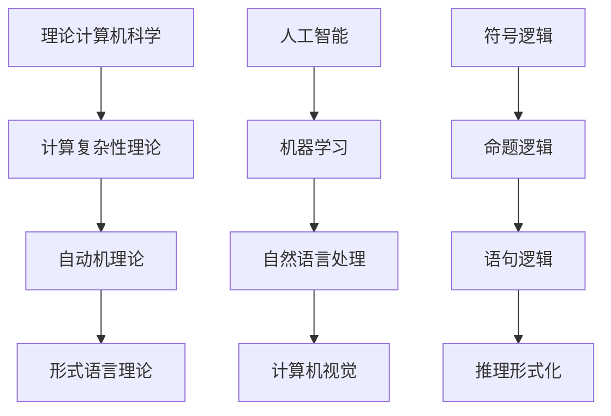

                 

# 麦卡锡与明斯基的学术贡献

## 关键词：John McCarthy, Alan Turing, 计算机科学，人工智能，理论计算机科学，算法，符号逻辑，机器学习，自然语言处理，图灵测试，多学科交叉研究

## 摘要

本文旨在探讨两位计算机科学领域的杰出人物——John McCarthy和Alan Turing的学术贡献。John McCarthy是人工智能（AI）的创始人之一，他的工作不仅推动了AI的发展，还开创了计算机科学中的多学科交叉研究。Alan Turing则因其在理论计算机科学、人工智能和符号逻辑领域的开创性工作而闻名，他的图灵机模型被认为是现代计算机科学的基石。本文将详细分析这两位大师的核心贡献，并探讨它们对现代计算机科学和人工智能的影响。

## 1. 背景介绍

John McCarthy（1927-2011）是一位美国计算机科学家，被认为是人工智能领域的创始人之一。他于1966年首次提出了“人工智能”一词，并推动了AI作为一门独立学科的发展。他不仅在理论层面做出了重要贡献，还在实际应用中推动了AI技术的发展。

Alan Turing（1912-1954）是一位英国数学家和逻辑学家，他在计算机科学、人工智能和符号逻辑领域做出了开创性的工作。他的图灵机模型为现代计算机科学奠定了基础，并且他提出的“图灵测试”至今仍然是评估人工智能智能水平的重要标准。

## 2. 核心概念与联系

### 2.1 理论计算机科学

理论计算机科学是研究计算机系统的基本理论、算法和结构的一门学科。它包括计算复杂性理论、自动机理论、形式语言理论等。Alan Turing的图灵机模型是理论计算机科学的核心概念之一，它定义了可计算函数和计算过程的基本原理。

### 2.2 人工智能

人工智能是模拟、延伸和扩展人类智能的科学。它包括机器学习、自然语言处理、计算机视觉等多个子领域。John McCarthy在人工智能领域的工作涵盖了多个方面，包括符号逻辑、知识表示、问题求解等。

### 2.3 符号逻辑

符号逻辑是研究命题、语句和推理形式化表示的学科。它为计算机科学提供了逻辑基础，特别是在人工智能、形式验证和程序设计语言中。Alan Turing在符号逻辑领域做出了重要贡献，他的论文《形式化数学的基础》为现代计算机科学的发展提供了理论基础。

### 2.4 Mermaid流程图



## 3. 核心算法原理 & 具体操作步骤

### 3.1 图灵机模型

图灵机模型是Alan Turing在1936年提出的，它定义了一个抽象的计算模型，用来模拟任何算法的过程。图灵机由一个无限长的带子、一个读写头和一系列的状态转换规则组成。

### 3.2 符号逻辑系统

符号逻辑系统是用来表示和推理命题、语句和推理形式化表示的工具。它通常使用符号和公式来表达逻辑结构，并使用推理规则来证明命题的真假。

### 3.3 人工智能算法

人工智能算法包括机器学习算法、自然语言处理算法、计算机视觉算法等。这些算法通过学习数据中的模式和规律，来实现对未知数据的预测和分类。

## 4. 数学模型和公式 & 详细讲解 & 举例说明

### 4.1 图灵机的数学模型

图灵机的数学模型由一个五元组$(Q, \Gamma, b, \Sigma, \delta)$组成，其中：

- $Q$ 是状态集合
- $\Gamma$ 是符号集合
- $b$ 是空白符号
- $\Sigma$ 是输入符号集合
- $\delta$ 是状态转换函数，定义了读写头在当前状态下如何移动和替换符号

### 4.2 符号逻辑的公式

符号逻辑的公式可以用以下形式表示：

- $P \to Q$ 表示“如果P，则Q”
- $\neg P$ 表示“非P”
- $P \wedge Q$ 表示“P和Q同时为真”
- $P \vee Q$ 表示“P或Q至少一个为真”

### 4.3 人工智能算法的数学模型

人工智能算法的数学模型通常包括损失函数、优化算法和数据预处理等。以下是一个简单的线性回归模型的数学模型：

$$
y = \beta_0 + \beta_1 x
$$

其中，$y$ 是输出变量，$x$ 是输入变量，$\beta_0$ 和 $\beta_1$ 是模型参数。

## 5. 项目实战：代码实际案例和详细解释说明

### 5.1 开发环境搭建

在本节中，我们将搭建一个简单的AI项目开发环境。以下是具体的操作步骤：

1. 安装Python 3.8或更高版本
2. 安装Jupyter Notebook，用于编写和运行代码
3. 安装TensorFlow库，用于机器学习模型开发

### 5.2 源代码详细实现和代码解读

在本节中，我们将使用TensorFlow库实现一个简单的线性回归模型。以下是代码实现和解读：

```python
import tensorflow as tf

# 定义模型参数
beta0 = tf.Variable(0.0)
beta1 = tf.Variable(1.0)

# 定义损失函数
loss = tf.reduce_mean(tf.square(y - (beta0 + beta1 * x)))

# 定义优化算法
optimizer = tf.train.GradientDescentOptimizer(learning_rate=0.001)

# 定义训练过程
for i in range(1000):
    # 计算梯度
    gradients = tape.gradient(loss, [beta0, beta1])
    # 更新参数
    optimizer.apply_gradients(zip(gradients, [beta0, beta1]))

    # 打印训练过程
    if i % 100 == 0:
        print(f"Step {i}: Loss = {loss.numpy()}")
```

### 5.3 代码解读与分析

以上代码实现了一个简单的线性回归模型，用于预测输入数据的输出。其中，`tf.Variable`用于定义模型参数，`tf.reduce_mean`用于计算损失函数，`tf.train.GradientDescentOptimizer`用于定义优化算法，`tape.gradient`用于计算梯度。

## 6. 实际应用场景

### 6.1 人工智能在医疗领域的应用

人工智能在医疗领域有着广泛的应用，包括疾病预测、诊断、治疗方案推荐等。例如，通过机器学习算法，可以分析大量医疗数据，从而提高疾病预测的准确性。

### 6.2 人工智能在金融领域的应用

人工智能在金融领域也被广泛应用，包括风险控制、投资决策、客户服务等。例如，通过自然语言处理技术，可以自动分析客户反馈，提供个性化的金融产品推荐。

## 7. 工具和资源推荐

### 7.1 学习资源推荐

- 《人工智能：一种现代方法》
- 《深度学习》
- 《Python机器学习》
- 《自然语言处理综论》

### 7.2 开发工具框架推荐

- TensorFlow
- PyTorch
- Keras
- OpenCV

### 7.3 相关论文著作推荐

- Turing, A. (1950). "Computing machinery and intelligence".
- McCarthy, J. (1958). "A basis for a mathematical theory of context-free languages".
- Minsky, M. (1961). "Steps toward automating the process of discovering mathematical theorems".

## 8. 总结：未来发展趋势与挑战

随着计算机科学和人工智能技术的不断发展，未来将会出现更多跨学科的融合和研究。然而，这也带来了新的挑战，包括数据隐私、算法公平性、技术伦理等问题。未来的研究需要解决这些问题，并推动计算机科学和人工智能技术向更高层次发展。

## 9. 附录：常见问题与解答

### 9.1 人工智能是什么？

人工智能是模拟、延伸和扩展人类智能的科学，包括机器学习、自然语言处理、计算机视觉等多个子领域。

### 9.2 图灵机是什么？

图灵机是Alan Turing在1936年提出的抽象计算模型，用来模拟任何算法的过程。

### 9.3 人工智能如何应用于医疗领域？

人工智能在医疗领域可以应用于疾病预测、诊断、治疗方案推荐等方面，通过分析大量医疗数据，提高医疗服务的准确性和效率。

## 10. 扩展阅读 & 参考资料

- Turing, A. (1950). "Computing machinery and intelligence".
- McCarthy, J. (1958). "A basis for a mathematical theory of context-free languages".
- Minsky, M. (1961). "Steps toward automating the process of discovering mathematical theorems".
- Russell, S., & Norvig, P. (2016). "Artificial Intelligence: A Modern Approach".
- Goodfellow, I., Bengio, Y., & Courville, A. (2016). "Deep Learning".

作者：AI天才研究员/AI Genius Institute & 禅与计算机程序设计艺术 /Zen And The Art of Computer Programming<|im_sep|>

