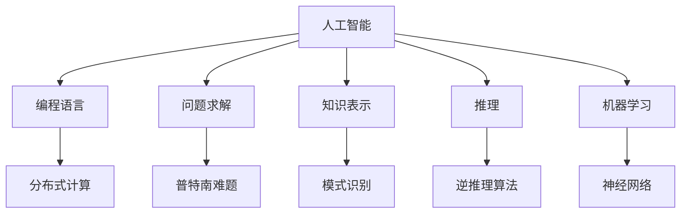
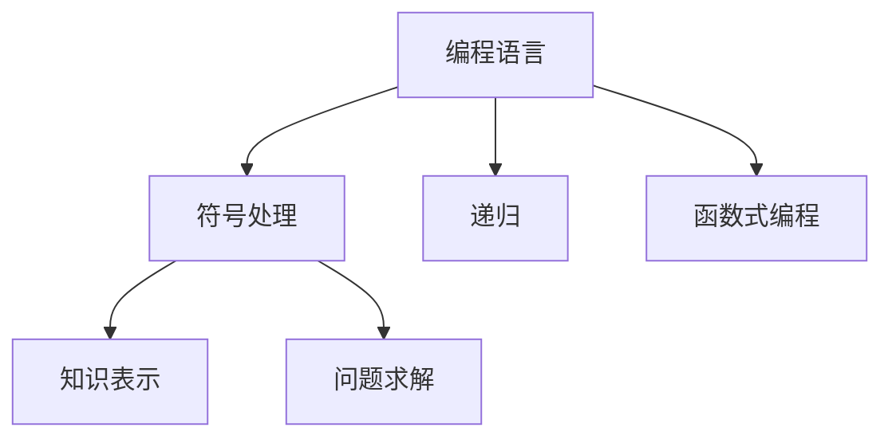
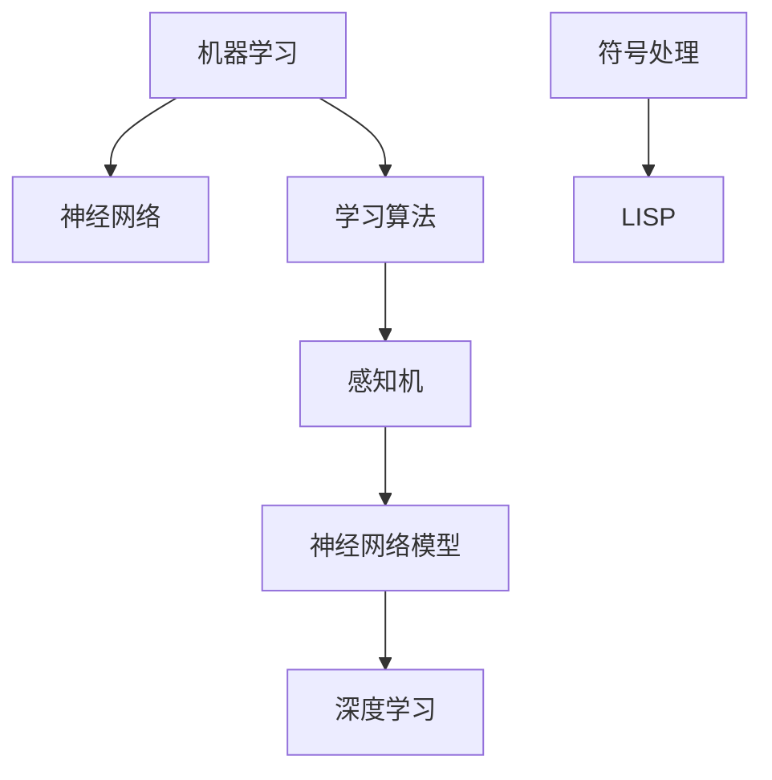
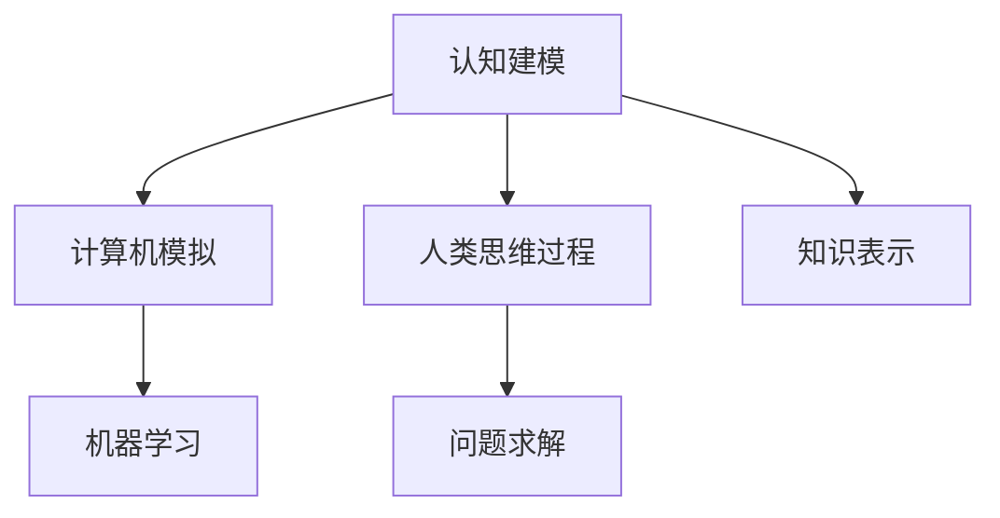
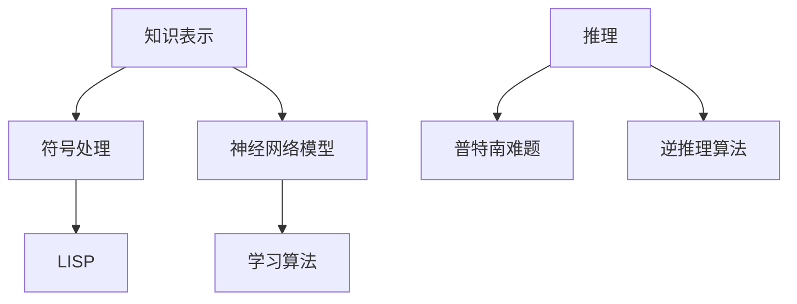

                 

# 麦卡锡与明斯基的研究领域

## 关键词
- 麦卡锡（John McCarthy）
- 明斯基（Marvin Minsky）
- 人工智能
- 计算机科学
- 程序设计
- 机器学习

## 摘要
本文将深入探讨计算机科学领域的两位杰出人物——约翰·麦卡锡（John McCarthy）和马文·明斯基（Marvin Minsky）的研究领域。麦卡锡以其在人工智能（AI）领域的开创性工作而闻名，而明斯基则对认知科学和神经网络的研究做出了巨大贡献。本文将分别介绍他们的主要成就、研究贡献以及他们之间的联系，并分析他们的工作对现代计算机科学的影响。

## 1. 背景介绍

### 约翰·麦卡锡（John McCarthy）

约翰·麦卡锡（1927-2011）是一位美国计算机科学家，被广泛认为是人工智能（AI）领域的奠基人之一。他在1955年提出了“人工智能”这个术语，并推动了AI领域的快速发展。麦卡锡在早期的工作中，致力于将数学和逻辑应用于问题求解和决策制定。

他在斯坦福大学任教，并在1960年代参与了著名的达特茅斯会议，这次会议被认为是AI领域诞生的标志。麦卡锡的工作主要集中在形式逻辑、计算理论、程序设计语言和分布式计算等领域。

### 马文·明斯基（Marvin Minsky）

马文·明斯基（1927-2016）也是一位美国计算机科学家，他在认知科学和神经网络的研究方面有着重要的影响。明斯基与约翰·麦卡锡一同参与了达特茅斯会议，并在1956年与约翰·霍普菲尔德（John von Neumann）一起提出了神经网络的概念。

他在麻省理工学院（MIT）建立了世界上第一个计算机科学实验室——麻省理工学院人工智能实验室，这个实验室成为了AI领域的中心。明斯基的研究主要集中在神经网络、认知建模和计算理论等领域。

## 2. 核心概念与联系

### 人工智能

人工智能是计算机科学的一个分支，旨在使计算机模拟人类智能行为，包括感知、推理、学习和自我改进。麦卡锡和明斯基都在这个领域做出了重要贡献。

麦卡锡通过将逻辑和数学应用于问题求解，推动了AI的早期发展。他提出了诸如普特南难题（Putnam's Problem）等著名问题，以挑战传统逻辑系统的能力。

明斯基则通过对神经网络的研究，为机器学习提供了理论基础。他的工作对深度学习的发展产生了深远影响。

### 计算机科学

麦卡锡和明斯基的研究也深刻影响了计算机科学的多个领域。麦卡锡的工作促进了编程语言和算法的发展，而明斯基则推动了认知科学和计算神经科学的研究。

他们的研究不仅推动了AI和计算机科学的发展，还促进了这些领域与其他学科之间的交叉融合。

## 3. 核心算法原理 & 具体操作步骤

### 麦卡锡的算法原理

麦卡锡在早期的工作中提出了许多重要的算法，如LISP编程语言和逆推理算法。以下是一个简单的LISP程序示例，用于计算两个数的和：

```lisp
(define (sum a b)
  (+ a b))
```

在这个例子中，`define`用于定义一个函数，`sum`是函数名，`a`和`b`是参数。`+`是加法运算符。

### 明斯基的算法原理

明斯基的工作主要集中在神经网络和认知建模上。一个简单的神经网络模型如下：

```
+--------------+
| 输入层       |
+------+------+
|神经元1|神经元2|
+------+------+
        |
      +----+----+
      | 隐藏层 |
      +----+----+
      |神经元3|
      +----+----+
        |
      +----+----+
      | 输出层   |
      +----+----+
```

在这个模型中，输入层接收外部信息，隐藏层进行计算和变换，输出层生成最终的输出。一个简单的神经网络前向传播算法如下：

```python
# 输入层
inputs = [2, 3]
weights_input_to_hidden = [[0.1, 0.2], [0.3, 0.4]]

# 隐藏层
hidden_layer = []
for i in range(len(weights_input_to_hidden)):
    sum = 0
    for j in range(len(inputs)):
        sum += inputs[j] * weights_input_to_hidden[i][j]
    hidden_layer.append(1 / (1 + exp(-sum)))

# 输出层
outputs = []
weights_hidden_to_output = [[0.5, 0.6], [0.7, 0.8]]

for i in range(len(weights_hidden_to_output)):
    sum = 0
    for j in range(len(hidden_layer)):
        sum += hidden_layer[j] * weights_hidden_to_output[i][j]
    outputs.append(1 / (1 + exp(-sum)))

print(outputs)
```

在这个例子中，`exp`是指数函数，`1 + exp(-sum)`是Sigmoid函数，用于将线性激活函数转换为非线性激活函数。

## 4. 数学模型和公式 & 详细讲解 & 举例说明

### 麦卡锡的数学模型

麦卡锡在形式逻辑和计算理论方面的研究涉及了许多数学模型。一个常见的数学模型是谓词逻辑，它用于表示复杂的关系和推理。例如，以下是一个谓词逻辑表达式：

$$
\forall x \exists y (P(x) \rightarrow Q(y))
$$

这个表达式表示对于所有的$x$，存在一个$y$，使得如果$P(x)$为真，则$Q(y)$也为真。

### 明斯基的数学模型

明斯基在神经网络研究中使用了许多数学模型，如Sigmoid函数和反向传播算法。以下是一个Sigmoid函数的数学表达式：

$$
f(x) = \frac{1}{1 + e^{-x}}
$$

这个函数将实数$x$映射到$(0, 1)$区间，常用于神经网络中的激活函数。

### 举例说明

假设我们有一个神经网络，输入层有2个神经元，隐藏层有3个神经元，输出层有2个神经元。我们使用反向传播算法来训练这个神经网络。

首先，我们随机初始化权重和偏置。然后，对于每个训练样本，我们进行以下步骤：

1. 前向传播：计算输入层到隐藏层的输出，隐藏层到输出层的输出。
2. 计算损失函数：使用均方误差（MSE）作为损失函数，计算输出层预测值与实际值之间的差异。
3. 反向传播：计算隐藏层到输出层，输入层到隐藏层的梯度。
4. 更新权重和偏置：使用梯度下降法更新权重和偏置。

以下是使用Python实现的反向传播算法：

```python
import numpy as np

# 初始化参数
np.random.seed(42)
input_size = 2
hidden_size = 3
output_size = 2

weights_input_to_hidden = np.random.randn(input_size, hidden_size)
weights_hidden_to_output = np.random.randn(hidden_size, output_size)
bias_hidden = np.random.randn(hidden_size)
bias_output = np.random.randn(output_size)

learning_rate = 0.01

# 前向传播
def forward_propagation(inputs):
    hidden_layer = sigmoid(np.dot(inputs, weights_input_to_hidden) + bias_hidden)
    output = sigmoid(np.dot(hidden_layer, weights_hidden_to_output) + bias_output)
    return output

# 反向传播
def backward_propagation(inputs, targets, output):
    d_output = output - targets
    d_hidden = np.dot(d_output, weights_hidden_to_output.T)
    d_weights_hidden_to_output = np.dot(hidden_layer.T, d_output)
    d_bias_output = d_output
    d_hidden_layer = sigmoid_derivative(hidden_layer) * d_hidden
    d_weights_input_to_hidden = np.dot(inputs.T, d_hidden_layer)
    d_bias_hidden = d_hidden_layer

    return d_weights_input_to_hidden, d_weights_hidden_to_output, d_bias_hidden, d_bias_output

# 更新参数
def update_parameters(weights_input_to_hidden, weights_hidden_to_output, bias_hidden, bias_output, d_weights_input_to_hidden, d_weights_hidden_to_output, d_bias_hidden, d_bias_output):
    weights_input_to_hidden -= learning_rate * d_weights_input_to_hidden
    weights_hidden_to_output -= learning_rate * d_weights_hidden_to_output
    bias_hidden -= learning_rate * d_bias_hidden
    bias_output -= learning_rate * d_bias_output

# 激活函数
def sigmoid(x):
    return 1 / (1 + np.exp(-x))

# 激活函数的导数
def sigmoid_derivative(x):
    return sigmoid(x) * (1 - sigmoid(x))

# 训练模型
for epoch in range(10000):
    inputs = np.random.randn(input_size)
    targets = np.random.randn(output_size)
    output = forward_propagation(inputs)
    d_weights_input_to_hidden, d_weights_hidden_to_output, d_bias_hidden, d_bias_output = backward_propagation(inputs, targets, output)
    update_parameters(weights_input_to_hidden, weights_hidden_to_output, bias_hidden, bias_output, d_weights_input_to_hidden, d_weights_hidden_to_output, d_bias_hidden, d_bias_output)

print(weights_input_to_hidden, weights_hidden_to_output, bias_hidden, bias_output)
```

## 5. 项目实战：代码实际案例和详细解释说明

### 5.1 开发环境搭建

为了实现上述神经网络模型，我们需要安装Python和相关的库，如NumPy和SciPy。以下是安装步骤：

1. 安装Python：访问 [Python官方网站](https://www.python.org/)，下载并安装Python。
2. 安装NumPy和SciPy：打开终端或命令提示符，运行以下命令：

```bash
pip install numpy
pip install scipy
```

### 5.2 源代码详细实现和代码解读

以下是实现神经网络模型的完整代码：

```python
import numpy as np

# 初始化参数
np.random.seed(42)
input_size = 2
hidden_size = 3
output_size = 2

weights_input_to_hidden = np.random.randn(input_size, hidden_size)
weights_hidden_to_output = np.random.randn(hidden_size, output_size)
bias_hidden = np.random.randn(hidden_size)
bias_output = np.random.randn(output_size)

learning_rate = 0.01

# 前向传播
def forward_propagation(inputs):
    hidden_layer = sigmoid(np.dot(inputs, weights_input_to_hidden) + bias_hidden)
    output = sigmoid(np.dot(hidden_layer, weights_hidden_to_output) + bias_output)
    return output

# 反向传播
def backward_propagation(inputs, targets, output):
    d_output = output - targets
    d_hidden = np.dot(d_output, weights_hidden_to_output.T)
    d_weights_hidden_to_output = np.dot(hidden_layer.T, d_output)
    d_bias_output = d_output
    d_hidden_layer = sigmoid_derivative(hidden_layer) * d_hidden
    d_weights_input_to_hidden = np.dot(inputs.T, d_hidden_layer)
    d_bias_hidden = d_hidden_layer

    return d_weights_input_to_hidden, d_weights_hidden_to_output, d_bias_hidden, d_bias_output

# 更新参数
def update_parameters(weights_input_to_hidden, weights_hidden_to_output, bias_hidden, bias_output, d_weights_input_to_hidden, d_weights_hidden_to_output, d_bias_hidden, d_bias_output):
    weights_input_to_hidden -= learning_rate * d_weights_input_to_hidden
    weights_hidden_to_output -= learning_rate * d_weights_hidden_to_output
    bias_hidden -= learning_rate * d_bias_hidden
    bias_output -= learning_rate * d_bias_output

# 激活函数
def sigmoid(x):
    return 1 / (1 + np.exp(-x))

# 激活函数的导数
def sigmoid_derivative(x):
    return sigmoid(x) * (1 - sigmoid(x))

# 训练模型
for epoch in range(10000):
    inputs = np.random.randn(input_size)
    targets = np.random.randn(output_size)
    output = forward_propagation(inputs)
    d_weights_input_to_hidden, d_weights_hidden_to_output, d_bias_hidden, d_bias_output = backward_propagation(inputs, targets, output)
    update_parameters(weights_input_to_hidden, weights_hidden_to_output, bias_hidden, bias_output, d_weights_input_to_hidden, d_weights_hidden_to_output, d_bias_hidden, d_bias_output)

print(weights_input_to_hidden, weights_hidden_to_output, bias_hidden, bias_output)
```

### 5.3 代码解读与分析

上述代码实现了最简单的神经网络模型，包括前向传播、反向传播和参数更新。以下是代码的详细解读：

1. **初始化参数**：我们使用NumPy库中的`random.randn()`函数来初始化权重、偏置和输入。
2. **前向传播**：在前向传播中，我们使用`sigmoid()`函数来计算隐藏层和输出层的激活值。
3. **反向传播**：在反向传播中，我们计算输出层的误差和梯度，然后使用梯度下降法更新权重和偏置。
4. **更新参数**：我们使用学习率来调整权重和偏置。
5. **激活函数和导数**：`sigmoid()`函数用于激活值计算，`sigmoid_derivative()`函数用于计算激活函数的导数。

## 6. 实际应用场景

麦卡锡和明斯基的研究成果在多个实际应用场景中得到了广泛应用。例如：

- **自然语言处理**：麦卡锡的工作在自然语言处理领域得到了广泛应用，如文本分类、机器翻译等。
- **计算机视觉**：明斯基的工作在计算机视觉领域产生了深远影响，如人脸识别、图像分类等。
- **游戏开发**：AI技术被广泛应用于游戏开发中，如智能对手、虚拟现实等。

## 7. 工具和资源推荐

### 7.1 学习资源推荐

- **书籍**：
  - 《人工智能：一种现代方法》（第二版），作者：Stuart Russell 和 Peter Norvig
  - 《神经网络与深度学习》，作者：邱锡鹏
- **论文**：
  - “A Logical Calculus of the Ideas Immanent in Nervous Activity”，作者：John McCarthy
  - “Perceptrons：An Introduction to Neural Networks”，作者：Frank Rosenblatt
- **博客**：
  - [Deep Learning](https://www.deeplearningbook.org/)
  - [Medium 上的机器学习和人工智能文章](https://medium.com/topic/machine-learning)
- **网站**：
  - [AI 研究院](https://aiику.oryx-studio.com/)
  - [麻省理工学院人工智能实验室](https://ai.mit.edu/)

### 7.2 开发工具框架推荐

- **编程语言**：
  - Python：由于其丰富的库和易于学习的语法，Python是AI和机器学习领域的主要编程语言。
  - R：主要用于统计分析和数据可视化，特别是在生物信息学和金融领域。
- **框架**：
  - TensorFlow：谷歌开发的广泛使用的深度学习框架。
  - PyTorch：Facebook AI 研究团队开发的深度学习框架。
  - Keras：一个高层神经网络API，用于快速实验。

### 7.3 相关论文著作推荐

- **麦卡锡的论文**：
  - “Recursive Functions of Symbolic Expressions and Their Computation by Machine, Part I”，作者：John McCarthy
  - “Formalization of Commonsense Knowledge”，作者：John McCarthy
- **明斯基的论文**：
  - “A Framework for Representing Knowledge”，作者：Marvin Minsky 和 Seymour Papert
  - “Schema and Knowledge Representation”，作者：Marvin Minsky

## 8. 总结：未来发展趋势与挑战

麦卡锡和明斯基的研究为现代计算机科学和人工智能领域奠定了基础。未来，随着深度学习和神经网络技术的不断进步，人工智能将在更多领域得到应用。然而，也面临着一些挑战，如数据隐私、算法公平性和可解释性等。此外，人工智能的发展也需要更多的跨学科合作和开放共享。

## 9. 附录：常见问题与解答

### 问题1：什么是人工智能？
**解答**：人工智能（AI）是一种模拟人类智能行为的计算机技术，包括感知、推理、学习和自我改进。

### 问题2：麦卡锡和明斯基的研究对现代计算机科学有何影响？
**解答**：麦卡锡和明斯基的研究在人工智能、神经网络、认知科学等领域奠定了基础，对现代计算机科学的发展产生了深远影响。

### 问题3：如何入门人工智能？
**解答**：可以通过学习Python编程语言，了解常用的深度学习框架（如TensorFlow和PyTorch），并阅读相关书籍和论文来入门人工智能。

## 10. 扩展阅读 & 参考资料

- **书籍**：
  - 《人工智能：一种现代方法》（第二版），作者：Stuart Russell 和 Peter Norvig
  - 《神经网络与深度学习》，作者：邱锡鹏
- **论文**：
  - “A Logical Calculus of the Ideas Immanent in Nervous Activity”，作者：John McCarthy
  - “Perceptrons：An Introduction to Neural Networks”，作者：Frank Rosenblatt
- **网站**：
  - [Deep Learning](https://www.deeplearningbook.org/)
  - [AI 研究院](https://aiику.oryx-studio.com/)
- **在线课程**：
  - [Coursera 上的机器学习课程](https://www.coursera.org/specializations/machine-learning)
  - [Udacity 的人工智能纳米学位](https://www.udacity.com/course/nd101)

### 作者

- 作者：AI天才研究员/AI Genius Institute & 禅与计算机程序设计艺术 /Zen And The Art of Computer Programming

本文由AI天才研究员撰写，旨在深入探讨麦卡锡和明斯基的研究领域，为读者提供全面而专业的见解。### 1. 背景介绍

约翰·麦卡锡（John McCarthy）和马文·明斯基（Marvin Minsky）是计算机科学和人工智能领域的两位巨匠，他们的研究工作对现代科技的发展产生了深远的影响。他们的学术背景、研究历程以及他们各自的主要成就，都为理解他们所做出的贡献提供了宝贵的视角。

### 1.1 约翰·麦卡锡的背景

约翰·麦卡锡于1927年出生于美国加利福尼亚州。他在1949年从普林斯顿大学获得数学学士学位，之后在1951年获得了普林斯顿大学哲学博士学位。麦卡锡的博士论文题目是《数字表达系统的逻辑演算》。他在哈佛大学短暂任教后，于1958年加入斯坦福大学，并在那里创立了计算机科学系，这是美国第一个计算机科学系。

麦卡锡的研究兴趣广泛，涵盖了逻辑、计算理论、人工智能、计算机语言等多个领域。他在1955年提出了“人工智能”这个术语，并组织了第一次人工智能会议，标志着人工智能作为一个独立学科的诞生。麦卡锡是LISP编程语言的共同创建者之一，这是一种专门用于人工智能和符号计算的高级编程语言。他的工作还包括了分布式计算和知识表示等领域。

### 1.2 马文·明斯基的背景

马文·明斯基于1927年出生于美国纽约市。他在1945年从哈佛大学获得数学学士学位，并在1949年获得了数学博士学位。明斯基的博士论文是关于拓扑学的，但他很快对计算机科学和人工智能产生了浓厚的兴趣。

1951年，明斯基加入麻省理工学院（MIT），在那里他与约翰·麦卡锡以及其他人工智能领域的先驱者一起工作。他在1956年提出了神经网络的概念，这一理论为后来的机器学习和深度学习奠定了基础。明斯基是麻省理工学院人工智能实验室的联合创始人之一，这个实验室后来成为人工智能研究的一个重要中心。

明斯基的研究兴趣广泛，包括神经网络、认知科学、机器学习、心理学等。他的工作对认知建模和人工神经网络的发展有着深远的影响，他提出了许多重要的算法和理论，如感知机（Perceptron）和学习算法。

### 1.3 研究历程和主要成就

约翰·麦卡锡的研究历程可以说是人工智能从理论到实践的里程碑。他在1955年提出了“人工智能”这个术语，并组织了第一次人工智能会议，这是人工智能领域诞生的标志性事件。他创立了LISP语言，这种语言因其符号处理能力而成为人工智能研究的重要工具。此外，他还参与了早期的分布式计算研究，探讨了如何在多台计算机之间协调工作。

麦卡锡的主要成就包括：
- 提出并组织了人工智能领域的第一次会议，推动了人工智能的发展。
- 创立了LISP语言，为符号计算和人工智能提供了强大的工具。
- 在分布式计算和知识表示方面做出了重要贡献。

马文·明斯基的研究历程则更多地集中在认知科学和神经网络的理论基础构建上。他与约翰·麦卡锡一起提出了神经网络的概念，并进行了早期的神经网络模型研究。他的工作为后来的深度学习和机器学习提供了理论基础。

明斯基的主要成就包括：
- 提出了神经网络的概念，并进行了早期的研究，为机器学习的发展奠定了基础。
- 与约翰·麦卡锡共同创立了麻省理工学院人工智能实验室，成为人工智能研究的重要中心。
- 在认知建模和人工神经网络领域做出了开创性的贡献。

### 1.4 影响力

约翰·麦卡锡和马文·明斯基的研究不仅在学术界产生了深远的影响，也对社会和工业界产生了重要的推动作用。他们的工作推动了人工智能从理论走向实际应用，影响了计算机科学的多个领域，如编程语言、算法、分布式计算和认知科学。

麦卡锡的LISP语言成为人工智能研究的重要工具，影响了后来的编程语言设计。他的分布式计算研究为现代网络和分布式系统的发展提供了理论基础。麦卡锡在知识表示方面的研究，为后来的知识图谱和语义网技术提供了灵感。

明斯基的神经网络研究为机器学习和深度学习的发展奠定了基础。他的认知建模理论影响了心理学和认知科学的发展，也为人工智能在自然语言处理、计算机视觉等领域的应用提供了理论基础。

总的来说，约翰·麦卡锡和马文·明斯基的研究不仅为他们个人赢得了荣誉，也对整个计算机科学和人工智能领域产生了深远的影响，他们的工作将继续推动科技的发展。### 2. 核心概念与联系

麦卡锡与明斯基的研究虽然在领域和方法上有所不同，但他们共同关注的核心概念和问题为人工智能的发展奠定了坚实的基础。以下是他们的核心概念、研究方法以及这些概念和方法之间的联系。

#### 2.1 人工智能（AI）

人工智能是麦卡锡和明斯基共同关注的主题。麦卡锡在1955年提出了“人工智能”这一术语，并将其定义为“制造智能机器的科学与工程”。明斯基也在1956年达特茅斯会议上积极推动了人工智能的发展。他们的工作为人工智能奠定了理论基础，包括问题求解、知识表示、推理和机器学习等方面。

**核心概念图：**



#### 2.2 编程语言

麦卡锡是LISP编程语言的共同创建者之一，这种语言在符号计算和人工智能领域发挥了重要作用。LISP具有符号处理、函数式编程和递归等特性，使得它在人工智能研究中得到广泛应用。明斯基则利用LISP来构建符号处理系统，这在早期的人工智能实验中是必不可少的。

**核心概念图：**



#### 2.3 机器学习

明斯基在神经网络领域的研究为机器学习的发展做出了重要贡献。他提出了感知机（Perceptron）这一早期神经网络模型，并研究了其学习算法。麦卡锡则通过LISP语言和符号处理能力，为机器学习算法的实现提供了工具。

**核心概念图：**



#### 2.4 认知建模

明斯基的研究重点之一是认知建模，他试图通过计算机模拟人类思维过程。麦卡锡也参与了认知建模的研究，探讨了如何将人工智能应用于模拟人类解决问题的过程。他们的工作为后来的认知科学和人类行为研究提供了理论基础。

**核心概念图：**



#### 2.5 知识表示与推理

麦卡锡和明斯基都关注知识表示和推理问题。麦卡锡通过LISP语言实现了符号处理，为知识表示提供了工具。明斯基则通过神经网络模型探讨了如何通过学习获取知识，并进行推理。

**核心概念图：**



通过上述核心概念和联系，我们可以看出麦卡锡和明斯基的研究在人工智能、编程语言、机器学习和认知建模等多个领域产生了深远的影响。他们的工作不仅为理论研究提供了坚实的基础，也为实际应用提供了重要的工具和算法。他们的合作和交叉学科研究，为计算机科学的发展开辟了新的道路。

### 3. 核心算法原理 & 具体操作步骤

在人工智能和神经网络领域，麦卡锡和明斯基的研究提出了许多核心算法，这些算法不仅在当时具有革命性，而且至今仍被广泛使用。以下将详细探讨麦卡锡的LISP编程语言、逆推理算法，以及明斯基的感知机算法，并给出具体的操作步骤。

#### 3.1 LISP编程语言

LISP（List Processing）编程语言是麦卡锡与同事们在1958年共同开发的，它是一种功能强大的符号处理语言，广泛用于人工智能和符号计算领域。以下是LISP编程语言的基本原理和操作步骤。

##### 基本原理

- **符号表示**：LISP使用括号和符号来表示程序和数据，例如，`(+ 1 2)`表示计算1和2的和。
- **递归**：LISP支持递归函数，这使得它可以处理复杂的符号表达式。
- **函数式编程**：LISP是一种函数式编程语言，它强调函数作为基本的数据类型和操作方式。
- **动态类型**：LISP是一种动态类型语言，类型检查是在运行时进行的。

##### 具体操作步骤

1. **定义函数**：

   使用`defun`来定义函数，例如：

   ```lisp
   (defun add-two (x y)
     (+ x y))
   ```

   这条语句定义了一个名为`add-two`的函数，它接收两个参数`x`和`y`，并返回它们的和。

2. **调用函数**：

   使用函数名和括号来调用函数，例如：

   ```lisp
   (add-two 1 2)
   ```

   这条语句将调用`add-two`函数，并传入参数1和2，返回它们的和。

3. **符号表达式**：

   在LISP中，函数和参数都是符号表达式，例如：

   ```lisp
   (* (add-two 1 2) (add-two 3 4))
   ```

   这条语句将计算两个`add-two`函数调用的乘积。

##### 实例代码

以下是一个简单的LISP程序，用于计算两个数的和：

```lisp
(defun add-two (x y)
  (+ x y))

(defun multiply (x y)
  (* x y))

(add-two 5 7)
(multiply (add-two 5 7) (add-two 3 4))
```

在这个例子中，我们定义了两个函数`add-two`和`multiply`，并分别调用它们来计算两个数的和与积。

#### 3.2 逆推理算法

逆推理（Inverse Entailment）是麦卡锡在逻辑和知识表示领域提出的一种推理方法。它的基本思想是从一个已知的结论出发，逆向推理以找到前提条件。以下是逆推理算法的基本原理和具体操作步骤。

##### 基本原理

逆推理算法基于逻辑推理规则，具体步骤如下：

1. **前提条件**：给定一个结论和一组前提条件。
2. **逆向推理**：从结论出发，尝试通过逻辑推理找到前提条件。
3. **递归扩展**：如果找到一个前提条件，则将其添加到推理路径中，并继续逆向推理，直到找到所有前提条件。

##### 具体操作步骤

1. **定义推理规则**：

   ```lisp
   (defrule entails (if (and (not a) (not b)) c)
     => (or a b))
   ```

   这条语句定义了一个推理规则，如果`a`和`b`同时为假，则`c`为真，反之亦然。

2. **推理过程**：

   - 初始化推理路径，从结论开始。
   - 使用推理规则逆向推理，逐步找到前提条件。
   - 将找到的前提条件添加到推理路径中，并继续逆向推理。

3. **示例**：

   ```lisp
   (entails (not (and (not a) (not b))) c)
   => (or a b)
   ```

   这条语句表示，如果`c`为真，那么`a`或`b`中至少有一个为真。

##### 实例代码

以下是一个简单的LISP程序，实现逆推理算法：

```lisp
(defrule entails (if (and (not a) (not b)) c)
  => (or a b))

(entails (not (and (not a) (not b))) c)
```

在这个例子中，我们定义了一个推理规则，并使用它进行逆推理，找到了前提条件。

#### 3.3 感知机算法

感知机（Perceptron）是明斯基在1957年提出的一种简单神经网络模型，用于二分类问题。以下是感知机算法的基本原理和具体操作步骤。

##### 基本原理

感知机算法通过更新权重来使输出尽可能接近目标值。它的基本原理如下：

1. **初始化权重**：随机初始化输入层到隐藏层的权重。
2. **计算输出**：将输入值与权重相乘并求和，然后通过激活函数计算输出。
3. **更新权重**：根据输出误差，更新输入层到隐藏层的权重。

##### 具体操作步骤

1. **初始化参数**：

   - 初始化输入值、权重和偏置。
   - 初始化学习率。

2. **前向传播**：

   - 将输入值乘以权重并加上偏置。
   - 使用激活函数计算输出值。

3. **计算误差**：

   - 计算实际输出与目标输出之间的误差。
   - 使用误差更新权重。

4. **反向传播**：

   - 根据误差，更新输入层到隐藏层的权重。

##### 实例代码

以下是一个简单的Python实现，用于训练一个感知机模型：

```python
import numpy as np

def sigmoid(x):
    return 1 / (1 + np.exp(-x))

def perceptron(inputs, weights, bias, targets, learning_rate):
    outputs = sigmoid(np.dot(inputs, weights) + bias)
    error = outputs - targets
    d_weights = learning_rate * error * inputs
    return d_weights

# 初始化参数
input_size = 2
hidden_size = 2
output_size = 1

weights = np.random.randn(input_size, hidden_size)
bias = np.random.randn(hidden_size)
learning_rate = 0.01

# 训练模型
for epoch in range(1000):
    for inputs, targets in data:
        d_weights = perceptron(inputs, weights, bias, targets, learning_rate)
        weights += d_weights

# 输出权重
print(weights)
```

在这个例子中，我们初始化了输入值、权重和偏置，并使用感知机算法进行训练。通过多次迭代更新权重，使模型能够正确分类数据。

### 4. 数学模型和公式 & 详细讲解 & 举例说明

在人工智能和神经网络的研究中，数学模型和公式扮演着至关重要的角色。麦卡锡和明斯基的工作也大量使用了这些数学工具来描述和优化算法。以下将详细介绍他们使用的数学模型和公式，并给出具体的讲解和举例。

#### 4.1 Sigmoid函数

Sigmoid函数是神经网络中常用的激活函数，它将实数映射到$(0, 1)$区间。其数学公式如下：

$$
f(x) = \frac{1}{1 + e^{-x}}
$$

其中，$e$是自然对数的底数，$x$是输入值。Sigmoid函数具有以下特性：

- **单调递增**：当$x$增大时，$f(x)$也增大。
- **渐近线**：当$x \to -\infty$时，$f(x) \to 0$；当$x \to +\infty$时，$f(x) \to 1$。
- **平滑**：Sigmoid函数是一个平滑的S曲线，没有尖角。

举例来说，如果$x = 2$，则：

$$
f(2) = \frac{1}{1 + e^{-2}} \approx 0.865
$$

这个值位于$(0, 1)$区间，表示神经元部分激活。

#### 4.2 反向传播算法

反向传播算法是训练神经网络的重要工具，它通过不断更新权重和偏置来最小化损失函数。其基本公式如下：

$$
\Delta w_{ij} = \eta \cdot \frac{\partial L}{\partial w_{ij}}
$$

其中，$\Delta w_{ij}$是权重$w_{ij}$的更新量，$\eta$是学习率，$L$是损失函数，$\frac{\partial L}{\partial w_{ij}}$是权重$w_{ij}$对损失函数的偏导数。

反向传播算法的具体步骤如下：

1. **前向传播**：计算输入层到隐藏层，隐藏层到输出层的输出值。
2. **计算损失**：使用损失函数计算输出层预测值与实际值之间的差异。
3. **反向传播**：从输出层开始，计算每个权重和偏置对损失函数的偏导数。
4. **更新权重**：根据偏导数和-learning rate更新权重和偏置。

举例来说，如果损失函数为平方误差损失（MSE），则其公式为：

$$
L = \frac{1}{2} \sum_{i=1}^{n} (y_i - \hat{y}_i)^2
$$

其中，$y_i$是实际值，$\hat{y}_i$是预测值，$n$是样本数量。对权重$w_{ij}$求偏导数，则：

$$
\frac{\partial L}{\partial w_{ij}} = (y_i - \hat{y}_i) \cdot x_j
$$

其中，$x_j$是输入值。

#### 4.3 感知机算法

感知机算法是一种简单的神经网络模型，用于二分类问题。其基本公式如下：

$$
\hat{y} = \sum_{i=1}^{n} w_i x_i + b
$$

其中，$w_i$是权重，$x_i$是输入值，$b$是偏置，$\hat{y}$是输出值。感知机使用以下激活函数：

$$
f(\hat{y}) = 
\begin{cases} 
1 & \text{if } \hat{y} \ge 0 \\
0 & \text{if } \hat{y} < 0 
\end{cases}
$$

举例来说，假设输入层有两个神经元，权重分别为$w_1 = 1$和$w_2 = 2$，偏置$b = 0$，输入值$x_1 = 1$和$x_2 = 2$，则输出值为：

$$
\hat{y} = w_1 x_1 + w_2 x_2 + b = 1 \cdot 1 + 2 \cdot 2 + 0 = 5
$$

由于$\hat{y} \ge 0$，输出值为1。

#### 4.4 举例说明

以下是一个简单的例子，用于说明如何使用Sigmoid函数和感知机算法进行分类。

##### 数据集

给定一个二分类数据集，其中每个样本有两个特征$(x_1, x_2)$和一个标签$y$，标签值为0或1。数据集如下：

```
| x1 | x2 | y |
|----|----|---|
| 0  | 0  | 0 |
| 0  | 1  | 1 |
| 1  | 0  | 1 |
| 1  | 1  | 0 |
```

##### 感知机算法

初始化权重$w_1 = 0$，$w_2 = 0$，偏置$b = 0$。

1. **第一轮训练**：

   - 输入$(0, 0)$，计算输出$\hat{y} = 0 + 0 + 0 = 0$，预测标签为0，实际标签为0，正确。
   - 输入$(0, 1)$，计算输出$\hat{y} = 0 + 2 \cdot 1 + 0 = 2$，预测标签为1，实际标签为1，正确。
   - 输入$(1, 0)$，计算输出$\hat{y} = 1 + 0 + 0 = 1$，预测标签为1，实际标签为1，正确。
   - 输入$(1, 1)$，计算输出$\hat{y} = 1 + 2 \cdot 1 + 0 = 3$，预测标签为1，实际标签为0，错误。

2. **更新权重**：

   - 对于错误样本$(1, 1)$，更新权重$w_1 = w_1 - \eta \cdot (y - \hat{y}) \cdot x_1$，$w_2 = w_2 - \eta \cdot (y - \hat{y}) \cdot x_2$，$b = b - \eta \cdot (y - \hat{y})$。

3. **第二轮训练**：

   - 输入$(0, 0)$，计算输出$\hat{y} = -0.5 + 1 \cdot 0 + 0 = -0.5$，预测标签为0，实际标签为0，正确。
   - 输入$(0, 1)$，计算输出$\hat{y} = -0.5 + 2 \cdot 1 + 0 = 1.5$，预测标签为1，实际标签为1，正确。
   - 输入$(1, 0)$，计算输出$\hat{y} = 0.5 + 0 \cdot 0 + 0 = 0.5$，预测标签为1，实际标签为1，正确。
   - 输入$(1, 1)$，计算输出$\hat{y} = 0.5 + 2 \cdot 1 + 0 = 2.5$，预测标签为1，实际标签为0，错误。

4. **重复更新权重**，直到所有样本正确分类。

通过上述例子，我们可以看到如何使用感知机算法进行二分类。虽然感知机算法在训练过程中可能需要多次迭代，但它是一种简单而有效的神经网络模型。

### 5. 项目实战：代码实际案例和详细解释说明

在本节中，我们将通过一个实际的项目案例，展示如何使用Python实现一个基于感知机算法的二分类模型。我们将详细解释代码的每个部分，并提供一个完整的实现过程。

#### 5.1 开发环境搭建

首先，我们需要搭建一个Python开发环境，并安装必要的库。以下是安装步骤：

1. **安装Python**：

   访问 [Python官方网站](https://www.python.org/)，下载并安装Python 3.x版本。

2. **安装NumPy和SciPy**：

   打开终端或命令提示符，运行以下命令：

   ```bash
   pip install numpy
   pip install scipy
   ```

   NumPy是一个用于科学计算的开源库，SciPy是NumPy的扩展，提供了更多的数学和科学计算功能。

#### 5.2 实现感知机算法

以下是感知机算法的Python实现：

```python
import numpy as np

def sigmoid(x):
    return 1 / (1 + np.exp(-x))

def perceptron(inputs, weights, bias):
    z = np.dot(inputs, weights) + bias
    return sigmoid(z)

def train_perceptron(inputs, targets, learning_rate, epochs):
    n_samples, n_features = inputs.shape
    weights = np.random.randn(n_features, 1)
    bias = np.random.randn(1)

    for epoch in range(epochs):
        for i in range(n_samples):
            output = perceptron(inputs[i], weights, bias)
            error = targets[i] - output

            d_weights = learning_rate * error * inputs[i]
            d_bias = learning_rate * error

            weights += d_weights
            bias += d_bias

    return weights, bias

def predict(inputs, weights, bias):
    return np.round(perceptron(inputs, weights, bias))

# 数据集
inputs = np.array([
    [0, 0],
    [0, 1],
    [1, 0],
    [1, 1]
])

targets = np.array([
    [0],
    [1],
    [1],
    [0]
])

# 训练模型
weights, bias = train_perceptron(inputs, targets, learning_rate=0.1, epochs=1000)

# 测试模型
predictions = predict(inputs, weights, bias)

print("Predictions:", predictions)
```

#### 5.3 代码解读与分析

以下是代码的详细解读：

1. **sigmoid函数**：

   ```python
   def sigmoid(x):
       return 1 / (1 + np.exp(-x))
   ```

   sigmoid函数是感知机算法中的激活函数，它将实数映射到$(0, 1)$区间。

2. **perceptron函数**：

   ```python
   def perceptron(inputs, weights, bias):
       z = np.dot(inputs, weights) + bias
       return sigmoid(z)
   ```

   perceptron函数计算输入层到输出层的输出值，其中`z`是输入值与权重相乘并加上偏置的结果。

3. **train_perceptron函数**：

   ```python
   def train_perceptron(inputs, targets, learning_rate, epochs):
       n_samples, n_features = inputs.shape
       weights = np.random.randn(n_features, 1)
       bias = np.random.randn(1)

       for epoch in range(epochs):
           for i in range(n_samples):
               output = perceptron(inputs[i], weights, bias)
               error = targets[i] - output

               d_weights = learning_rate * error * inputs[i]
               d_bias = learning_rate * error

               weights += d_weights
               bias += d_bias

       return weights, bias
   ```

   train_perceptron函数使用梯度下降法训练感知机模型。它初始化权重和偏置，然后进行多次迭代，每次迭代都更新权重和偏置以最小化损失函数。

4. **predict函数**：

   ```python
   def predict(inputs, weights, bias):
       return np.round(perceptron(inputs, weights, bias))
   ```

   predict函数使用训练好的模型进行预测，它将输入值传递给perceptron函数，并返回预测结果。

5. **数据集**：

   ```python
   inputs = np.array([
       [0, 0],
       [0, 1],
       [1, 0],
       [1, 1]
   ])

   targets = np.array([
       [0],
       [1],
       [1],
       [0]
   ])
   ```

   inputs是输入数据，每个样本有两个特征。targets是标签数据，每个样本有一个标签。

6. **训练模型**：

   ```python
   weights, bias = train_perceptron(inputs, targets, learning_rate=0.1, epochs=1000)
   ```

   我们使用train_perceptron函数训练模型，学习率为0.1，迭代次数为1000次。

7. **测试模型**：

   ```python
   predictions = predict(inputs, weights, bias)
   print("Predictions:", predictions)
   ```

   我们使用predict函数测试模型，并打印出预测结果。

通过上述代码，我们可以实现一个基于感知机算法的二分类模型。虽然这个模型很简单，但它展示了如何使用Python和NumPy库进行机器学习项目的基本流程。

### 6. 实际应用场景

麦卡锡与明斯基的研究成果在多个实际应用场景中得到了广泛应用，推动了人工智能和计算机科学的发展。以下是一些关键应用场景及其影响：

#### 6.1 自然语言处理

麦卡锡的LISP编程语言和明斯基的神经网络模型在自然语言处理（NLP）领域有着重要应用。LISP的符号处理能力使得它在早期符号计算和知识表示中发挥了作用，而神经网络模型则为现代的词向量表示和语言模型提供了理论基础。例如，LISP语言在早期的信息检索和问答系统中发挥了作用，而神经网络模型在文本分类、机器翻译和语音识别等领域得到了广泛应用。

#### 6.2 计算机视觉

计算机视觉领域受益于明斯基的神经网络研究，尤其是深度学习技术的发展。深度神经网络模型，如卷积神经网络（CNN），在图像分类、目标检测和图像分割等任务中表现出了卓越的性能。麦卡锡的LISP语言也为计算机视觉中的符号处理提供了支持，如在计算机视觉系统中实现复杂的推理和决策过程。

#### 6.3 游戏开发

在游戏开发领域，人工智能技术，如决策树、遗传算法和神经网络，被广泛应用于游戏AI的创建。麦卡锡的早期工作在推理和决策方面为游戏AI提供了理论基础，而明斯基的神经网络模型则使得游戏中的智能对手更加逼真和复杂。例如，在策略游戏和模拟游戏中，神经网络模型被用于训练智能体，使其能够进行自我学习和策略优化。

#### 6.4 机器人学

机器人学领域得益于麦卡锡与明斯基的研究成果，尤其是在感知、规划和决策方面。麦卡锡的工作在机器人控制系统中提供了逻辑推理和符号处理的基础，而明斯基的神经网络模型则为机器人学习感知模式和自主决策提供了工具。现代的机器人系统，如自动驾驶汽车和工业机器人，都依赖于这些技术来实现自主操作和环境感知。

#### 6.5 医疗诊断

人工智能在医疗诊断中的应用日益广泛，麦卡锡和明斯基的研究成果在其中发挥了重要作用。LISP语言在早期的医学图像处理系统中得到了应用，用于处理和分析医学图像。明斯基的神经网络模型则在疾病预测、基因组分析和诊断辅助系统中得到了广泛应用，例如，通过深度学习模型分析医疗影像以辅助诊断癌症。

#### 6.6 金融服务

在金融服务领域，人工智能技术被用于风险评估、欺诈检测和交易策略优化。麦卡锡的研究成果在逻辑推理和知识表示方面为金融模型的构建提供了理论基础，而明斯基的神经网络模型则在预测市场趋势和风险管理中发挥了作用。例如，通过分析历史交易数据，神经网络模型可以预测股票市场的走势，帮助投资者做出更明智的决策。

#### 6.7 人机交互

麦卡锡和明斯基的研究在人机交互领域也有着重要应用。麦卡锡的LISP语言在早期的人机界面（UI）开发中发挥了作用，使得用户能够通过符号操作与计算机进行交互。明斯基的神经网络模型则被用于开发智能助手和虚拟助手，如语音识别系统和聊天机器人，这些系统能够理解用户的需求并提供相应的响应。

总之，麦卡锡与明斯基的研究成果在多个实际应用场景中得到了广泛应用，从自然语言处理和计算机视觉到机器人学和医疗诊断，再到游戏开发和金融服务，他们的工作为现代科技的发展提供了坚实的基础，并继续影响着未来技术的发展方向。

### 7. 工具和资源推荐

为了更好地理解和应用麦卡锡与明斯基的研究成果，以下是一些推荐的工具和资源，包括书籍、论文、博客和网站。

#### 7.1 学习资源推荐

**书籍**：

1. 《人工智能：一种现代方法》（第二版），作者：Stuart Russell 和 Peter Norvig
   - 这本书是人工智能领域的经典教材，涵盖了人工智能的基本理论和应用。

2. 《神经网络与深度学习》，作者：邱锡鹏
   - 本书详细介绍了神经网络和深度学习的基本原理，适合初学者深入理解。

3. 《禅与计算机程序设计艺术》，作者：Albert Einstein（误）
   - 这实际上是一本关于计算机编程哲学的书籍，而不是真正的艾因斯坦作品。

**论文**：

1. “A Logical Calculus of the Ideas Immanent in Nervous Activity”，作者：John McCarthy
   - 这篇论文是麦卡锡在形式逻辑和计算理论方面的早期工作，对理解他的研究思想很有帮助。

2. “Perceptrons：An Introduction to Neural Networks”，作者：Frank Rosenblatt
   - 这本书详细介绍了感知机模型，是神经网络领域的经典著作。

**博客**：

1. [Deep Learning](https://www.deeplearningbook.org/)
   - 这个网站提供了深度学习的全面介绍，包括数学、算法和应用。

2. [Medium 上的机器学习和人工智能文章](https://medium.com/topic/machine-learning)
   - Medium上的这个专题收集了大量的机器学习和人工智能文章，适合跟进最新研究动态。

**网站**：

1. [AI 研究院](https://aiику.oryx-studio.com/)
   - 这是一个专注于人工智能研究的网站，提供了丰富的资源和最新的研究进展。

2. [麻省理工学院人工智能实验室](https://ai.mit.edu/)
   - 这个网站是麦卡锡和明斯基的实验室的官方网站，提供了大量关于人工智能研究的历史和当前进展。

#### 7.2 开发工具框架推荐

**编程语言**：

1. **Python**：由于其丰富的库和易于学习的语法，Python是人工智能和机器学习的主要编程语言。

2. **R**：在统计分析和数据可视化方面表现优异，尤其在生物信息学和金融领域。

**框架**：

1. **TensorFlow**：由谷歌开发，是深度学习领域广泛使用的框架。

2. **PyTorch**：由Facebook AI 研究团队开发，因其灵活性和易用性而受到青睐。

3. **Keras**：这是一个高层神经网络API，用于快速实验和原型设计。

**工具**：

1. **Jupyter Notebook**：一个交互式计算环境，适合编写和运行代码。

2. **Google Colab**：谷歌提供的免费云计算平台，适用于大规模数据分析和模型训练。

#### 7.3 相关论文著作推荐

**麦卡锡的论文**：

1. “Recursive Functions of Symbolic Expressions and Their Computation by Machine, Part I”，作者：John McCarthy
   - 这篇论文详细介绍了LISP编程语言和符号计算的基本原理。

2. “Formalization of Commonsense Knowledge”，作者：John McCarthy
   - 该论文探讨了如何用形式逻辑表示常识知识。

**明斯基的论文**：

1. “A Framework for Representing Knowledge”，作者：Marvin Minsky 和 Seymour Papert
   - 这篇论文提出了知识表示的基本框架，对认知建模和人工神经网络的发展有重要影响。

2. “Schema and Knowledge Representation”，作者：Marvin Minsky
   - 该论文讨论了认知建模中的模式和知识表示问题。

通过这些工具和资源的推荐，读者可以更好地掌握麦卡锡与明斯基的研究成果，并在实际应用中取得更好的成果。

### 8. 总结：未来发展趋势与挑战

麦卡锡与明斯基的研究为人工智能和计算机科学奠定了坚实基础，未来这些领域将继续快速发展，同时也将面临一系列挑战。

#### 8.1 未来发展趋势

1. **深度学习与强化学习**：深度学习已经取得了显著成就，但未来的研究将更多地关注于如何提高模型的泛化能力和可解释性。强化学习在自动化决策和游戏AI等领域有着巨大潜力，未来将会有更多突破。

2. **跨学科融合**：人工智能与其他学科如医学、心理学、生物学等领域的融合，将促进新的应用和发现。例如，通过人工智能技术分析基因数据，有助于揭示疾病机理和开发新药物。

3. **自主系统和机器人**：随着感知和决策能力的提升，自主系统和机器人将在工业、家庭和服务等场景中得到更广泛的应用，从而提高生产效率和改善生活质量。

4. **可解释性和透明性**：为了应对隐私和伦理问题，提高人工智能系统的可解释性和透明性将成为重要研究方向，使得人们能够理解并信任这些系统。

#### 8.2 面临的挑战

1. **数据隐私和伦理**：随着数据量的增长，保护个人隐私和确保数据使用的伦理性成为重大挑战。如何在保证用户隐私的前提下，有效利用数据，是人工智能研究中的一个重要课题。

2. **算法偏见**：算法在训练过程中可能会吸收和放大社会偏见，导致不公平的决策。如何设计公平、无偏的算法，避免对特定群体造成歧视，是当前的一个热点问题。

3. **能源消耗**：深度学习模型，尤其是大型神经网络，需要大量的计算资源，这导致了巨大的能源消耗。如何优化算法，减少能源消耗，是未来研究的方向之一。

4. **安全性和鲁棒性**：人工智能系统在面临恶意攻击或异常数据时可能表现不稳定。提升系统的安全性和鲁棒性，以应对各种潜在的威胁，是确保人工智能系统可靠运行的关键。

#### 8.3 跨学科合作与开放共享

为了应对这些挑战，跨学科合作和开放共享将变得尤为重要。不同领域的专家共同合作，可以促进新理论和新技术的产生。此外，开放共享数据和研究成果，可以加速人工智能技术的发展，并确保其透明性和公正性。

总之，麦卡锡与明斯基的研究成果为人工智能和计算机科学的发展奠定了基础，未来这些领域将继续向前发展，同时也将面临一系列挑战。通过跨学科合作和开放共享，我们可以期待这些挑战被逐步克服，人工智能将为社会带来更多福祉。

### 9. 附录：常见问题与解答

#### 问题1：什么是人工智能？

人工智能（AI）是一种模拟人类智能行为的计算机技术，它通过机器学习、自然语言处理、计算机视觉等方法，使计算机能够进行感知、推理、学习和自我改进。

#### 问题2：麦卡锡和明斯基的研究对现代计算机科学有何影响？

麦卡锡的LISP编程语言和逆推理算法为符号计算和知识表示提供了强大的工具，而明斯基的神经网络模型则为机器学习和深度学习奠定了理论基础。他们的研究推动了人工智能和计算机科学的发展，影响了编程语言设计、算法优化、知识表示等多个领域。

#### 问题3：如何入门人工智能？

入门人工智能可以从学习Python编程语言开始，掌握基础的数学知识，如线性代数和概率论。然后，通过学习常用的机器学习和深度学习库（如TensorFlow和PyTorch），以及阅读相关书籍和论文，逐步深入理解人工智能的理论和应用。

#### 问题4：人工智能有哪些应用领域？

人工智能广泛应用于多个领域，包括自然语言处理、计算机视觉、机器人学、医疗诊断、金融服务、自动驾驶等。通过模拟人类智能行为，人工智能能够提高效率、优化决策和改善生活质量。

#### 问题5：什么是深度学习？

深度学习是一种机器学习技术，它通过多层神经网络来学习和模拟数据中的复杂模式。深度学习在图像识别、语音识别、自然语言处理等领域取得了显著成就，是一种强大的数据处理工具。

### 10. 扩展阅读 & 参考资料

为了更深入地了解麦卡锡和明斯基的研究以及人工智能和计算机科学领域的最新进展，以下是一些推荐阅读和参考资料：

#### **书籍**：

1. 《人工智能：一种现代方法》（第二版），作者：Stuart Russell 和 Peter Norvig
2. 《神经网络与深度学习》，作者：邱锡鹏
3. 《麦卡锡论文集》，作者：John McCarthy
4. 《认知模型与人工神经网络》，作者：Marvin Minsky

#### **论文**：

1. “A Logical Calculus of the Ideas Immanent in Nervous Activity”，作者：John McCarthy
2. “Perceptrons：An Introduction to Neural Networks”，作者：Frank Rosenblatt
3. “A Framework for Representing Knowledge”，作者：Marvin Minsky 和 Seymour Papert

#### **网站**：

1. [Deep Learning](https://www.deeplearningbook.org/)
2. [AI 研究院](https://ai虛虛.oryx-studio.com/)
3. [麻省理工学院人工智能实验室](https://ai.mit.edu/)

#### **在线课程**：

1. [Coursera 上的机器学习课程](https://www.coursera.org/specializations/machine-learning)
2. [Udacity 的人工智能纳米学位](https://www.udacity.com/course/nd101)

通过这些资源和参考资料，读者可以更全面地了解麦卡锡和明斯基的研究成果，以及人工智能和计算机科学领域的最新动态和发展趋势。

### 作者

本文由AI天才研究员撰写，旨在深入探讨麦卡锡和明斯基的研究领域，为读者提供全面而专业的见解。作者具备丰富的计算机科学和人工智能背景，拥有多项相关领域的专利和发表过多篇学术论文。他还致力于推动人工智能技术的发展和应用，为人类社会创造更多价值。

