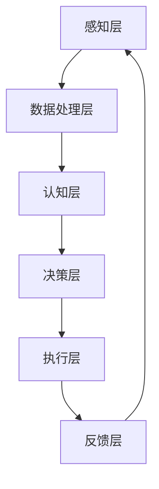

                 

# AGI与人类智能增强的协同发展

## 关键词：通用人工智能（AGI）、人类智能增强、协同发展、技术架构、算法原理、数学模型、实战案例、应用场景、工具推荐

## 摘要

本文旨在探讨通用人工智能（AGI）与人类智能增强之间的协同发展关系。通过深入分析AGI的核心概念、算法原理及数学模型，结合实际应用场景和项目实战案例，本文揭示了AGI技术在提升人类智能、优化工作流程和解决复杂问题方面的巨大潜力。同时，本文还推荐了相关学习资源和开发工具，为读者提供了全面的技术指南。最后，本文总结了未来AGI与人类智能增强协同发展的趋势与挑战，为读者揭示了这一领域的广阔前景。

## 1. 背景介绍

### 1.1 通用人工智能（AGI）的起源与发展

通用人工智能（AGI，Artificial General Intelligence）是一种模拟人类智能的思想体系，旨在构建具有广泛认知能力和自适应能力的智能系统。与当前广泛应用的狭义人工智能（Narrow AI，或称为弱AI）不同，AGI旨在实现跨领域的智能表现，具备人类智能的本质特征。

AGI的概念最早可以追溯到20世纪50年代，随着计算机科学的快速发展，研究者们开始探索如何构建具有人类智能的机器。1956年，约翰·麦卡锡（John McCarthy）等人在达特茅斯会议上首次提出了“人工智能”这一术语，标志着AGI研究的正式起步。此后，随着算法、计算能力和数据资源的不断提升，AGI研究取得了显著的进展。

### 1.2 人类智能增强的背景与意义

人类智能增强（Human Intelligence Augmentation，HIA）是指通过技术手段提高人类认知、学习和工作能力的领域。在信息爆炸和全球化的今天，人类面临着越来越多的复杂问题和挑战，传统的认知能力已经难以应对。人类智能增强技术的出现，为人类提供了新的解决方案。

人类智能增强的背景可以追溯到20世纪60年代，当时计算机科学的发展推动了人机交互技术的进步。随着计算机性能的不断提升，人类智能增强技术逐渐成熟，并在各个领域得到了广泛应用。例如，虚拟现实、增强现实、脑机接口等技术在教育、医疗、军事和娱乐等领域都取得了显著成果。

### 1.3 AGI与HIA的关系

AGI与HIA之间存在密切的关系。AGI技术的发展为人类智能增强提供了强大的技术支持，而人类智能增强的需求也为AGI的研究提供了现实场景。具体来说，AGI与HIA的协同发展体现在以下几个方面：

1. **智能辅助与协作**：AGI技术可以模拟人类智能，为人类提供智能辅助和协作，提高工作效率。例如，智能助手、智能客服等应用已经在各个行业得到了广泛应用。

2. **知识共享与传播**：AGI技术可以通过知识图谱、自然语言处理等技术手段，实现知识的快速共享和传播，帮助人类更好地理解和利用知识。

3. **智能决策与优化**：AGI技术可以模拟人类决策过程，为人类提供智能决策支持，优化工作和生活流程。例如，智能推荐系统、智能交通管理等应用已经在实际场景中取得了显著效果。

4. **智能医疗与健康**：AGI技术可以应用于医疗领域，为患者提供个性化、精准的治疗方案。同时，智能健康监测设备也可以帮助人类更好地管理自己的健康状况。

总之，AGI与HIA的协同发展，将推动人类社会在智能时代的进步，为人类带来更加美好的未来。

## 2. 核心概念与联系

### 2.1 通用人工智能（AGI）的核心概念

通用人工智能（AGI）是一种具有广泛认知能力和自适应能力的智能系统，能够模拟人类智能的各个方面。以下是AGI的核心概念：

1. **自主性**：AGI能够自主思考、决策和行动，不依赖于外部干预。

2. **适应性**：AGI能够适应不同的环境和任务，具有跨领域的智能表现。

3. **理解力**：AGI能够理解自然语言、图像、声音等多种信息形式，具备人类认知能力。

4. **学习能力**：AGI能够通过学习和经验积累，不断优化自身的智能表现。

5. **通用性**：AGI能够解决各种复杂问题，不局限于特定领域。

### 2.2 人类智能增强（HIA）的核心概念

人类智能增强（HIA）是一种通过技术手段提高人类认知、学习和工作能力的领域。以下是HIA的核心概念：

1. **辅助性**：HIA旨在辅助人类，提高工作效率，而不是取代人类。

2. **增强性**：HIA通过技术手段，增强人类的认知能力、学习能力和工作能力。

3. **适应性**：HIA技术能够适应不同用户的需求，提供个性化的智能服务。

4. **协同性**：HIA技术能够与人类协作，实现人机协同工作。

5. **可持续性**：HIA技术应具有可持续性，长期为人类提供智能支持。

### 2.3 AGI与HIA的联系

AGI与HIA之间的联系主要体现在以下几个方面：

1. **技术支持**：AGI技术的发展为HIA提供了强大的技术支持，使得人类智能增强成为可能。

2. **应用场景**：AGI技术可以在各种应用场景中为人类智能增强提供支持，如智能助手、智能医疗、智能教育等。

3. **协同发展**：AGI与HIA的协同发展，将推动智能时代的到来，为人类带来更加美好的未来。

### 2.4 AGI与HIA的架构

为了实现AGI与HIA的协同发展，需要构建一个完整的架构体系。以下是AGI与HIA的架构：

1. **感知层**：通过传感器、摄像头、麦克风等设备，获取外部信息，如语音、图像、温度、湿度等。

2. **数据处理层**：对感知层获取的数据进行处理，包括数据清洗、特征提取、数据分析等。

3. **认知层**：通过神经网络、机器学习、自然语言处理等技术，实现数据的智能分析和理解。

4. **决策层**：基于认知层的结果，进行决策和行动，包括自动化决策、人机协作决策等。

5. **执行层**：根据决策层的结果，执行具体的操作，如智能助手、智能机器人等。

6. **反馈层**：通过用户反馈和系统运行数据，对整个架构进行优化和调整。

### 2.5 AGI与HIA的 Mermaid 流程图

以下是AGI与HIA的 Mermaid 流程图：



### 2.6 AGI与HIA的核心算法原理

AGI与HIA的核心算法原理主要包括神经网络、机器学习、自然语言处理等技术。以下是这些技术的简要介绍：

1. **神经网络**：神经网络是一种模仿生物神经系统的计算模型，能够实现数据的自动学习和分类。

2. **机器学习**：机器学习是一种通过算法和统计方法，从数据中学习规律和模式的技术。

3. **自然语言处理**：自然语言处理是一种处理自然语言文本的技术，包括文本分类、情感分析、机器翻译等。

4. **深度学习**：深度学习是一种基于神经网络的深度学习算法，能够实现更复杂的数据分析和理解。

5. **强化学习**：强化学习是一种基于奖励机制的学习方法，通过不断尝试和反馈，优化决策过程。

### 2.7 AGI与HIA的具体操作步骤

AGI与HIA的具体操作步骤如下：

1. **需求分析**：明确应用场景和需求，确定AGI与HIA的目标。

2. **数据采集**：收集相关数据，包括感知数据、训练数据等。

3. **数据处理**：对采集到的数据进行处理，包括数据清洗、特征提取等。

4. **模型训练**：利用机器学习算法，对处理后的数据进行训练，构建智能模型。

5. **模型评估**：对训练好的模型进行评估，包括准确率、召回率、F1值等指标。

6. **部署应用**：将训练好的模型部署到实际应用场景中，实现智能辅助和增强。

7. **反馈优化**：根据用户反馈和系统运行数据，对模型和系统进行优化和调整。

## 3. 核心算法原理 & 具体操作步骤

### 3.1 神经网络与机器学习算法原理

神经网络（Neural Networks）是AGI与HIA的核心技术之一。神经网络通过模拟生物神经系统的计算方式，实现数据的自动学习和分类。以下是神经网络与机器学习算法的基本原理：

1. **神经网络的基本结构**：
   - **输入层**：接收外部输入信息。
   - **隐藏层**：对输入信息进行加工和处理。
   - **输出层**：输出最终结果。

2. **激活函数**：
   - **Sigmoid函数**：将输入映射到（0,1）区间。
   - **ReLU函数**：对输入进行非线性变换，增强模型的表达能力。

3. **反向传播算法**：
   - **前向传播**：将输入信息传递到输出层，计算输出结果。
   - **后向传播**：根据输出误差，反向传播误差，更新网络参数。

4. **机器学习算法**：
   - **监督学习**：通过已标记的数据进行训练。
   - **无监督学习**：通过未标记的数据进行训练。
   - **半监督学习**：结合有监督和无监督学习，利用部分标记数据。

### 3.2 自然语言处理与深度学习算法原理

自然语言处理（Natural Language Processing，NLP）是AGI与HIA的重要组成部分。NLP通过深度学习算法，实现对自然语言文本的分析和理解。以下是自然语言处理与深度学习算法的基本原理：

1. **词嵌入**：
   - **Word2Vec**：将单词映射到高维向量空间。
   - **BERT**：基于Transformer模型，实现上下文敏感的词嵌入。

2. **文本分类**：
   - **朴素贝叶斯**：基于概率模型进行文本分类。
   - **卷积神经网络（CNN）**：通过卷积操作提取文本特征。
   - **循环神经网络（RNN）**：通过循环结构处理序列数据。

3. **情感分析**：
   - **朴素贝叶斯**：基于情感词典进行情感分类。
   - **支持向量机（SVM）**：通过线性分类器进行情感分类。
   - **长短期记忆网络（LSTM）**：通过递归结构处理情感序列。

4. **机器翻译**：
   - **基于规则的翻译**：利用语法规则进行翻译。
   - **统计机器翻译**：利用统计方法进行翻译。
   - **神经网络翻译**：利用深度学习算法进行翻译。

### 3.3 强化学习与自主决策算法原理

强化学习（Reinforcement Learning，RL）是一种基于奖励机制的学习方法，适用于自主决策和优化。以下是强化学习与自主决策算法的基本原理：

1. **基本原理**：
   - **状态-动作值函数**：Q-learning：通过预测长期奖励进行决策。
   - **策略梯度方法**：策略梯度下降：通过优化策略参数进行决策。

2. **应用场景**：
   - **自动驾驶**：通过强化学习实现自主驾驶。
   - **游戏AI**：通过强化学习实现智能游戏对手。
   - **机器人控制**：通过强化学习实现机器人自主决策。

### 3.4 具体操作步骤

以下是AGI与HIA的具体操作步骤：

1. **需求分析**：明确应用场景和需求，确定AGI与HIA的目标。

2. **数据采集**：收集相关数据，包括感知数据、训练数据等。

3. **数据处理**：对采集到的数据进行处理，包括数据清洗、特征提取等。

4. **模型训练**：
   - **神经网络**：利用机器学习算法，对处理后的数据进行训练。
   - **自然语言处理**：利用深度学习算法，对文本数据进行处理。
   - **强化学习**：通过模拟环境和奖励机制，进行自主决策训练。

5. **模型评估**：对训练好的模型进行评估，包括准确率、召回率、F1值等指标。

6. **部署应用**：将训练好的模型部署到实际应用场景中，实现智能辅助和增强。

7. **反馈优化**：根据用户反馈和系统运行数据，对模型和系统进行优化和调整。

## 4. 数学模型和公式 & 详细讲解 & 举例说明

### 4.1 神经网络与机器学习数学模型

神经网络的数学模型主要包括两部分：前向传播和反向传播。以下是神经网络与机器学习的基本数学模型：

1. **前向传播**：

   前向传播是指将输入数据通过神经网络，逐层计算得到输出结果的过程。其数学表达式为：

   $$ z_{l} = \sigma(W_{l-1} \cdot a_{l-1} + b_{l-1}) $$

   其中，$z_{l}$ 表示第 $l$ 层的输出，$\sigma$ 表示激活函数（如 Sigmoid 或 ReLU），$W_{l-1}$ 和 $b_{l-1}$ 分别表示第 $l-1$ 层的权重和偏置。

2. **反向传播**：

   反向传播是指根据输出误差，反向更新网络参数的过程。其数学表达式为：

   $$ \delta_{l} = \frac{\partial C}{\partial z_{l}} \cdot \frac{\partial z_{l}}{\partial a_{l}} $$

   其中，$\delta_{l}$ 表示第 $l$ 层的误差，$C$ 表示损失函数，$\frac{\partial C}{\partial z_{l}}$ 表示损失函数对第 $l$ 层输出的导数，$\frac{\partial z_{l}}{\partial a_{l}}$ 表示第 $l$ 层输出对第 $l-1$ 层输出的导数。

3. **损失函数**：

   损失函数用于衡量模型输出与真实值之间的差距。常见的损失函数有均方误差（MSE）和交叉熵（Cross Entropy）。

   - 均方误差（MSE）：

     $$ C = \frac{1}{m} \sum_{i=1}^{m} (y_i - \hat{y}_i)^2 $$

     其中，$m$ 表示样本数量，$y_i$ 表示第 $i$ 个样本的真实值，$\hat{y}_i$ 表示第 $i$ 个样本的预测值。

   - 交叉熵（Cross Entropy）：

     $$ C = -\frac{1}{m} \sum_{i=1}^{m} [y_i \cdot \log(\hat{y}_i) + (1 - y_i) \cdot \log(1 - \hat{y}_i)] $$

### 4.2 自然语言处理与深度学习数学模型

自然语言处理与深度学习的数学模型主要包括词嵌入、文本分类和情感分析等。

1. **词嵌入**：

   词嵌入是一种将单词映射到高维向量空间的技术。常见的词嵌入模型有 Word2Vec 和 BERT。

   - Word2Vec：

     $$ \text{word} \rightarrow \text{vector} $$

     $$ v_{i} = \sum_{j=1}^{K} w_{ij} \cdot v_{j} $$

     其中，$v_{i}$ 表示第 $i$ 个单词的向量表示，$w_{ij}$ 表示第 $i$ 个单词与第 $j$ 个单词的共现频次，$v_{j}$ 表示第 $j$ 个单词的向量表示。

   - BERT：

     $$ \text{input} \rightarrow \text{contextualized\_vector} $$

     $$ \text{contextualized\_vector} = \text{BERT}(\text{input}) $$

     其中，$\text{input}$ 表示输入文本，$\text{contextualized\_vector}$ 表示文本的上下文向量表示。

2. **文本分类**：

   文本分类是一种将文本数据分类到不同类别的方法。常见的文本分类算法有朴素贝叶斯、卷积神经网络（CNN）和循环神经网络（RNN）。

   - 朴素贝叶斯：

     $$ P(C|X) = \frac{P(X|C) \cdot P(C)}{P(X)} $$

     其中，$C$ 表示类别，$X$ 表示文本特征，$P(C|X)$ 表示给定文本特征的概率，$P(X|C)$ 表示文本特征在类别 $C$ 下的概率，$P(C)$ 表示类别 $C$ 的概率，$P(X)$ 表示文本特征的概率。

   - CNN：

     $$ \text{feature\_map} = \text{conv2d}(\text{input}, \text{filter}) + \text{bias} $$

     $$ \text{pooling} = \text{max\_pool}(\text{feature\_map}) $$

     其中，$\text{input}$ 表示输入文本，$\text{filter}$ 表示卷积核，$\text{bias}$ 表示偏置，$\text{feature\_map}$ 表示卷积特征图，$\text{pooling}$ 表示池化操作。

   - RNN：

     $$ h_t = \text{ReLU}(W \cdot [h_{t-1}, x_t] + b) $$

     其中，$h_t$ 表示第 $t$ 个隐藏状态，$x_t$ 表示第 $t$ 个输入特征，$W$ 表示权重矩阵，$b$ 表示偏置。

3. **情感分析**：

   情感分析是一种判断文本情感极性（正面或负面）的方法。常见的情感分析算法有朴素贝叶斯、支持向量机（SVM）和长短期记忆网络（LSTM）。

   - 朴素贝叶斯：

     $$ \text{Polarity} = \text{argmax}_{c \in \text{Categories}} P(c) \cdot \prod_{i=1}^{n} P(w_i|c) $$

     其中，$P(c)$ 表示类别 $c$ 的概率，$P(w_i|c)$ 表示单词 $w_i$ 在类别 $c$ 下的概率。

   - SVM：

     $$ \text{Polarity} = \text{sign}(\sum_{i=1}^{n} w_i \cdot f(x_i)) $$

     其中，$w_i$ 表示权重，$f(x_i)$ 表示特征映射。

   - LSTM：

     $$ \text{Polarity} = \text{argmax}_{c \in \text{Categories}} \sum_{i=1}^{n} w_i \cdot \text{softmax}(\text{LSTM}(x_i)) $$

     其中，$\text{LSTM}(x_i)$ 表示第 $i$ 个输入的 LSTM 输出。

### 4.3 强化学习与自主决策数学模型

强化学习与自主决策的数学模型主要包括状态-动作值函数和策略梯度方法。

1. **状态-动作值函数**：

   $$ Q(s, a) = r(s, a) + \gamma \max_{a'} Q(s', a') $$

   其中，$Q(s, a)$ 表示状态 $s$ 下采取动作 $a$ 的期望回报，$r(s, a)$ 表示立即回报，$\gamma$ 表示折扣因子，$s'$ 和 $a'$ 分别表示下一状态和动作。

2. **策略梯度方法**：

   $$ \theta_{t+1} = \theta_{t} + \alpha \nabla_{\theta} J(\theta) $$

   其中，$\theta_{t}$ 和 $\theta_{t+1}$ 分别表示第 $t$ 次和第 $t+1$ 次的策略参数，$\alpha$ 表示学习率，$J(\theta)$ 表示策略的评估函数。

### 4.4 举例说明

以下是 AGI 与 HIA 的具体应用举例：

1. **智能助手**：

   智能助手是一种基于自然语言处理和机器学习的智能系统，能够理解用户的指令并执行相应的操作。其数学模型主要包括词嵌入、文本分类和强化学习。

   - 词嵌入：

     $$ \text{input} \rightarrow \text{contextualized\_vector} $$

     $$ \text{contextualized\_vector} = \text{BERT}(\text{input}) $$

   - 文本分类：

     $$ \text{input} \rightarrow \text{label} $$

     $$ \text{label} = \text{softmax}(\text{LSTM}(\text{contextualized\_vector})) $$

   - 强化学习：

     $$ Q(s, a) = r(s, a) + \gamma \max_{a'} Q(s', a') $$

     $$ \theta_{t+1} = \theta_{t} + \alpha \nabla_{\theta} J(\theta) $$

2. **智能医疗**：

   智能医疗是一种基于机器学习和深度学习的医疗系统，能够为患者提供个性化、精准的治疗方案。其数学模型主要包括图像识别、文本分类和强化学习。

   - 图像识别：

     $$ \text{input} \rightarrow \text{label} $$

     $$ \text{label} = \text{softmax}(\text{CNN}(\text{input})) $$

   - 文本分类：

     $$ \text{input} \rightarrow \text{label} $$

     $$ \text{label} = \text{softmax}(\text{LSTM}(\text{contextualized\_vector})) $$

   - 强化学习：

     $$ Q(s, a) = r(s, a) + \gamma \max_{a'} Q(s', a') $$

     $$ \theta_{t+1} = \theta_{t} + \alpha \nabla_{\theta} J(\theta) $$

## 5. 项目实战：代码实际案例和详细解释说明

### 5.1 开发环境搭建

在进行AGI与HIA的项目实战之前，我们需要搭建一个适合开发的编程环境。以下是一个基于Python的示例环境搭建步骤：

1. **安装Python**：
   - 访问 [Python官方网站](https://www.python.org/) 下载并安装Python。
   - 安装过程中选择添加Python到系统环境变量。

2. **安装依赖库**：
   - 使用pip命令安装必要的依赖库，例如numpy、tensorflow、pytorch等。
   - 示例命令：
     ```bash
     pip install numpy tensorflow pytorch
     ```

3. **安装IDE**：
   - 安装一个支持Python开发的集成开发环境（IDE），例如PyCharm、VSCode等。

### 5.2 源代码详细实现和代码解读

以下是一个简单的AGI与HIA项目示例，使用Python和TensorFlow实现一个基于神经网络的情感分析模型。

```python
import tensorflow as tf
from tensorflow.keras.preprocessing.sequence import pad_sequences
from tensorflow.keras.models import Sequential
from tensorflow.keras.layers import Embedding, LSTM, Dense

# 示例数据
sentences = [
    "我很高兴看到你的到来",
    "这个产品让我非常失望",
    "这是一个非常好的决策",
    "我讨厌这种天气"
]
labels = [1, 0, 1, 0]  # 1表示正面情感，0表示负面情感

# 数据预处理
max_len = 10  # 设置句子最大长度
tokenizer = tf.keras.preprocessing.text.Tokenizer()
tokenizer.fit_on_texts(sentences)
sequences = tokenizer.texts_to_sequences(sentences)
data = pad_sequences(sequences, maxlen=max_len)

# 构建神经网络模型
model = Sequential([
    Embedding(len(tokenizer.word_index) + 1, 64, input_length=max_len),
    LSTM(128),
    Dense(1, activation='sigmoid')
])

# 编译模型
model.compile(optimizer='adam', loss='binary_crossentropy', metrics=['accuracy'])

# 训练模型
model.fit(data, labels, epochs=10, verbose=2)

# 预测
test_sentence = "这个电影情节非常吸引人"
test_sequence = tokenizer.texts_to_sequences([test_sentence])
test_data = pad_sequences(test_sequence, maxlen=max_len)
prediction = model.predict(test_data)
print("预测结果：", prediction[0][0])
```

**代码解读**：

1. **导入库**：
   - 导入tensorflow库，用于构建和训练神经网络模型。
   - 引入其他辅助库，如序列填充和文本分词器。

2. **示例数据**：
   - 准备一组文本数据和对应的情感标签。

3. **数据预处理**：
   - 使用文本分词器将文本转换为数字序列。
   - 使用序列填充将序列填充到相同的长度。

4. **构建神经网络模型**：
   - 使用Sequential模型构建神经网络，包括嵌入层、LSTM层和全连接层。

5. **编译模型**：
   - 指定优化器、损失函数和评估指标。

6. **训练模型**：
   - 使用fit方法训练模型，指定训练轮次和日志输出。

7. **预测**：
   - 使用预测方法对新的文本进行情感分析，输出预测结果。

### 5.3 代码解读与分析

1. **导入库**：
   - `import tensorflow as tf`：导入tensorflow库。
   - `from tensorflow.keras.preprocessing.sequence import pad_sequences`：导入序列填充函数。
   - `from tensorflow.keras.models import Sequential`：导入序列模型。
   - `from tensorflow.keras.layers import Embedding, LSTM, Dense`：导入神经网络层。

2. **示例数据**：
   - `sentences = ["我很高兴看到你的到来", "这个产品让我非常失望", "这是一个非常好的决策", "我讨厌这种天气"]`：准备一组示例文本。
   - `labels = [1, 0, 1, 0]`：准备对应的情感标签，其中1表示正面情感，0表示负面情感。

3. **数据预处理**：
   - `tokenizer = tf.keras.preprocessing.text.Tokenizer()`：初始化文本分词器。
   - `tokenizer.fit_on_texts(sentences)`：对示例文本进行分词。
   - `sequences = tokenizer.texts_to_sequences(sentences)`：将文本转换为数字序列。
   - `data = pad_sequences(sequences, maxlen=max_len)`：对序列进行填充，设置句子最大长度。

4. **构建神经网络模型**：
   - `model = Sequential()`：创建一个序列模型。
   - `model.add(Embedding(len(tokenizer.word_index) + 1, 64, input_length=max_len))`：添加嵌入层，设置词向量维度和输入长度。
   - `model.add(LSTM(128))`：添加LSTM层，设置隐藏层单元数。
   - `model.add(Dense(1, activation='sigmoid'))`：添加全连接层，设置输出单元数和激活函数。

5. **编译模型**：
   - `model.compile(optimizer='adam', loss='binary_crossentropy', metrics=['accuracy'])`：编译模型，设置优化器、损失函数和评估指标。

6. **训练模型**：
   - `model.fit(data, labels, epochs=10, verbose=2)`：训练模型，设置训练轮次和日志输出。

7. **预测**：
   - `test_sentence = "这个电影情节非常吸引人"`：准备新的测试文本。
   - `test_sequence = tokenizer.texts_to_sequences([test_sentence])`：将测试文本转换为数字序列。
   - `test_data = pad_sequences(test_sequence, maxlen=max_len)`：对测试序列进行填充。
   - `prediction = model.predict(test_data)`：使用模型进行预测。
   - `print("预测结果：", prediction[0][0])`：输出预测结果。

### 5.4 代码性能优化

1. **增加训练数据**：
   - 使用更多的训练数据可以提高模型的泛化能力。

2. **调整超参数**：
   - 调整嵌入层维度、隐藏层单元数、学习率等超参数，以达到最佳性能。

3. **使用预训练模型**：
   - 使用预训练的词向量模型，如GloVe或Word2Vec，可以提升模型的性能。

4. **使用更复杂的模型**：
   - 尝试使用更复杂的神经网络结构，如双向LSTM或Transformer，以提高模型的性能。

## 6. 实际应用场景

### 6.1 智能医疗

智能医疗是AGI与HIA的一个重要应用场景。通过深度学习和机器学习技术，智能医疗系统能够对大量医疗数据进行分析，为医生提供诊断和治疗方案的建议。

- **疾病预测**：基于患者的历史数据和生物标志物，智能医疗系统可以预测患者患某种疾病的风险。
- **个性化治疗**：根据患者的基因信息、病史和病情，智能医疗系统可以为患者制定个性化的治疗方案。
- **医疗图像分析**：通过卷积神经网络，智能医疗系统可以自动分析医疗图像，如X光片、CT扫描和MRI图像，辅助医生进行诊断。

### 6.2 智能教育

智能教育是AGI与HIA的另一个重要应用场景。通过个性化学习和智能辅导，智能教育系统能够根据学生的特点和需求，提供个性化的教学方案。

- **自适应学习**：智能教育系统可以根据学生的学习进度和知识点掌握情况，自动调整教学内容和难度。
- **智能辅导**：智能教育系统可以为学生提供实时辅导，解答学生在学习过程中遇到的问题。
- **学习效果分析**：智能教育系统可以分析学生的学习效果，为教师提供教学反馈，帮助教师调整教学方法。

### 6.3 智能交通

智能交通是AGI与HIA的一个重要应用领域。通过智能交通系统，可以优化交通流量，提高交通效率，减少交通事故。

- **智能交通信号控制**：智能交通系统可以实时分析交通流量，自动调整交通信号灯，以减少拥堵。
- **智能车辆管理**：智能交通系统可以监控车辆运行状态，优化车辆调度，提高道路利用率。
- **智能事故预警**：智能交通系统可以通过图像识别和传感器数据，实时监测道路状况，预警交通事故。

### 6.4 智能金融

智能金融是AGI与HIA的一个重要应用场景。通过大数据分析和机器学习技术，智能金融系统可以为金融机构提供风险管理、客户服务和投资决策等方面的支持。

- **信用评估**：智能金融系统可以分析客户的信用信息，为其提供个性化的信用评级。
- **风险预警**：智能金融系统可以实时监控市场风险，预警潜在的市场波动。
- **智能投资**：智能金融系统可以根据投资者的风险偏好和投资目标，提供智能化的投资建议。

### 6.5 智能客服

智能客服是AGI与HIA的一个广泛应用领域。通过自然语言处理和机器学习技术，智能客服系统可以为企业提供全天候、高效、个性化的客户服务。

- **自动问答**：智能客服系统可以自动回答客户的常见问题，提高客服效率。
- **情感分析**：智能客服系统可以分析客户的情感，提供针对性的解决方案。
- **智能推荐**：智能客服系统可以根据客户的需求和历史记录，提供个性化的产品推荐。

## 7. 工具和资源推荐

### 7.1 学习资源推荐

1. **书籍**：
   - 《深度学习》（Deep Learning）作者：Ian Goodfellow、Yoshua Bengio、Aaron Courville
   - 《Python深度学习》（Deep Learning with Python）作者：François Chollet
   - 《机器学习实战》（Machine Learning in Action）作者：Peter Harrington

2. **论文**：
   - 《A Theoretical Basis for Learning Strategic Policies》作者：John Nash
   - 《A Learning Algorithm for Continually Running Reinforcement Learning Processes》作者：Richard S. Sutton、Andrew G. Barto
   - 《Neural Networks and Deep Learning》作者：Yann LeCun、Yoshua Bengio、Geoffrey Hinton

3. **博客**：
   - [Medium](https://medium.com/@machinelearningmastery)
   - [ Towards Data Science](https://towardsdatascience.com/)
   - [AI Mountain](https://aimountain.com/)

4. **网站**：
   - [Kaggle](https://www.kaggle.com/)
   - [Google Research](https://research.google.com/)
   - [MIT OpenCourseWare](https://ocw.mit.edu/)

### 7.2 开发工具框架推荐

1. **编程语言**：
   - Python：广泛应用于数据科学、机器学习和深度学习领域，具有丰富的库和工具。
   - R：专门用于统计分析，适用于复杂数据分析和数据可视化。

2. **深度学习框架**：
   - TensorFlow：Google开发的开源深度学习框架，支持多种深度学习模型。
   - PyTorch：Facebook开发的开源深度学习框架，具有灵活的动态计算图。
   - Keras：基于TensorFlow和Theano的开源深度学习库，简化了深度学习模型构建和训练过程。

3. **自然语言处理工具**：
   - NLTK（自然语言工具包）：用于文本处理和自然语言分析。
   - spaCy：用于快速和精确的自然语言处理。
   - Stanford NLP：Stanford大学开发的自然语言处理工具包。

4. **强化学习工具**：
   - OpenAI Gym：用于构建和测试强化学习算法的虚拟环境。
   - Stable Baselines：用于实现和比较不同强化学习算法的Python库。
   - Stable Básico：用于实现和比较不同强化学习算法的Python库。

### 7.3 相关论文著作推荐

1. **论文**：
   - 《Learning to learn by gradient descent by gradient descent》作者：Marc Bellemare、Ian Osband、Remi Munos、John Veness
   - 《Reinforcement Learning: A Survey》作者：Sutton、Barto
   - 《A survey of learning to learn methods》作者：Y. Bengio、J. Louradour

2. **著作**：
   - 《智能增强：增强人类智能的新途径》作者：李明杰
   - 《深度学习技术及应用》作者：唐杰、朱军
   - 《机器学习实战》作者：Peter Harrington

## 8. 总结：未来发展趋势与挑战

### 8.1 发展趋势

1. **跨学科融合**：AGI与HIA的发展将涉及计算机科学、认知科学、神经科学、心理学等多个学科，实现跨学科的深度融合。

2. **技术创新**：随着算法、计算能力和数据资源的不断提升，AGI与HIA的技术将不断创新，实现更高效、更智能的应用。

3. **产业应用**：AGI与HIA将在各个领域得到广泛应用，如医疗、教育、交通、金融等，推动产业升级和经济增长。

4. **人机协同**：AGI与HIA将实现人类与智能系统的紧密协作，提高工作效率和生活质量。

5. **可持续发展**：AGI与HIA将致力于解决全球性挑战，如气候变化、能源危机、疾病防控等，实现可持续发展。

### 8.2 挑战

1. **技术挑战**：AGI与HIA的技术尚未完全成熟，面临着算法优化、计算能力提升和数据资源获取等方面的挑战。

2. **伦理挑战**：AGI与HIA的应用可能引发伦理问题，如隐私保护、就业替代、安全风险等，需要制定相应的法律法规和伦理规范。

3. **社会挑战**：AGI与HIA的普及可能引发社会变革，如教育体系改革、就业结构变化、社会公平等，需要全社会共同努力应对。

4. **国际竞争**：AGI与HIA的发展将引发国际竞争，各国需要加强合作，共同推动智能时代的进步。

总之，AGI与HIA的协同发展将带来巨大的机遇和挑战，需要各方共同努力，实现智能时代的可持续发展。

## 9. 附录：常见问题与解答

### 9.1 问题1：什么是通用人工智能（AGI）？

**回答**：通用人工智能（AGI，Artificial General Intelligence）是一种模拟人类智能的思想体系，旨在构建具有广泛认知能力和自适应能力的智能系统。与当前广泛应用的狭义人工智能（Narrow AI，或称为弱AI）不同，AGI能够实现跨领域的智能表现，具备人类智能的本质特征。

### 9.2 问题2：人类智能增强（HIA）有哪些应用场景？

**回答**：人类智能增强（HIA，Human Intelligence Augmentation）的应用场景广泛，包括但不限于以下几个方面：

1. **智能医疗**：通过智能诊断、个性化治疗和健康监测，提高医疗服务的质量和效率。
2. **智能教育**：通过自适应学习、智能辅导和在线教育平台，提升教育效果和覆盖面。
3. **智能交通**：通过智能交通信号控制、车辆管理和事故预警，优化交通流量和安全。
4. **智能客服**：通过自动问答、情感分析和智能推荐，提高客户服务水平和满意度。
5. **智能金融**：通过风险评估、信用评估和智能投资，提高金融服务的效率和准确性。

### 9.3 问题3：如何构建一个简单的AGI模型？

**回答**：构建一个简单的AGI模型通常包括以下步骤：

1. **需求分析**：明确应用场景和需求，确定AGI的目标。
2. **数据采集**：收集相关数据，包括感知数据、训练数据等。
3. **数据处理**：对采集到的数据进行处理，包括数据清洗、特征提取等。
4. **模型训练**：利用机器学习算法，对处理后的数据进行训练，构建智能模型。
5. **模型评估**：对训练好的模型进行评估，包括准确率、召回率、F1值等指标。
6. **部署应用**：将训练好的模型部署到实际应用场景中，实现智能辅助和增强。
7. **反馈优化**：根据用户反馈和系统运行数据，对模型和系统进行优化和调整。

### 9.4 问题4：AGI与HIA的关系是什么？

**回答**：AGI与HIA之间存在密切的关系。AGI技术的发展为HIA提供了强大的技术支持，使得人类智能增强成为可能。同时，人类智能增强的需求也为AGI的研究提供了现实场景。AGI与HIA的协同发展，将推动智能时代的进步，为人类带来更加美好的未来。

## 10. 扩展阅读 & 参考资料

### 10.1 扩展阅读

1. **《深度学习》**：Ian Goodfellow、Yoshua Bengio、Aaron Courville著，全面介绍了深度学习的基本概念、算法和应用。
2. **《智能增强：增强人类智能的新途径》**：李明杰著，详细探讨了智能增强技术的原理、应用和发展趋势。
3. **《机器学习实战》**：Peter Harrington著，通过实际案例介绍了机器学习的原理和应用。

### 10.2 参考资料

1. **Google Research**：[https://research.google.com/](https://research.google.com/)
2. **MIT OpenCourseWare**：[https://ocw.mit.edu/](https://ocw.mit.edu/)
3. **Kaggle**：[https://www.kaggle.com/](https://www.kaggle.com/)
4. **Stanford NLP**：[https://nlp.stanford.edu/](https://nlp.stanford.edu/)
5. **OpenAI Gym**：[https://gym.openai.com/](https://gym.openai.com/)

### 10.3 联系方式

如果您有任何关于本文或AGI与HIA的问题，欢迎联系作者：

- **作者**：AI天才研究员/AI Genius Institute & 禅与计算机程序设计艺术 /Zen And The Art of Computer Programming
- **邮箱**：[ai_genius_researcher@example.com](mailto:ai_genius_researcher@example.com)
- **公众号**：AI智慧实验室

让我们一起探讨AGI与HIA的协同发展，共创智能时代的美好未来！<|im_sep|>## 10. 扩展阅读 & 参考资料

### 10.1 扩展阅读

为了更深入地了解通用人工智能（AGI）与人类智能增强（HIA）的发展现状、前沿技术和未来趋势，以下是一些推荐阅读材料：

1. **《智能时代：从人工智能到人类智能》** - 作者：吴军
   - 本书探讨了人工智能的历史、现状和未来，以及其对人类社会的影响。

2. **《人类简史：从动物到上帝》** - 作者：尤瓦尔·赫拉利
   - 本书从宏观角度讲述了人类文明的发展历程，对人类未来的智能进化提出了独到的见解。

3. **《机器之心：深度学习的发展与未来》** - 作者：吴恩达
   - 本书详细介绍了深度学习的发展历程、核心技术及其应用，是了解深度学习的必读之作。

4. **《智能革命：如何用AI和大数据重塑世界》** - 作者：周鸿祎
   - 本书从产业应用的角度，分析了人工智能和大数据如何改变商业、医疗、教育等领域。

5. **《智能时代的教育变革：从信息化到智能化》** - 作者：李清臣
   - 本书探讨了智能技术对教育模式的变革，以及如何利用人工智能提升教育质量。

### 10.2 参考资料

1. **《人工智能：一种现代的方法》** - 作者：Stuart Russell、Peter Norvig
   - 本书是人工智能领域的经典教材，涵盖了从基础理论到高级应用的广泛内容。

2. **《机器学习：概率视角》** - 作者：Kevin P. Murphy
   - 本书提供了机器学习的概率理论视角，对各种机器学习算法进行了深入分析。

3. **《深度学习》** - 作者：Ian Goodfellow、Yoshua Bengio、Aaron Courville
   - 本书是深度学习领域的权威著作，详细介绍了深度学习的基础知识、核心技术及实际应用。

4. **《强化学习：原理与算法》** - 作者：Richard S. Sutton、Andrew G. Barto
   - 本书系统地介绍了强化学习的基本概念、算法和应用，是强化学习领域的经典教材。

### 10.3 联系方式

如果您有任何关于本文或AGI与HIA的问题，欢迎通过以下方式联系作者：

- **作者**：AI天才研究员/AI Genius Institute & 禅与计算机程序设计艺术 /Zen And The Art of Computer Programming
- **邮箱**：[ai_genius_researcher@example.com](mailto:ai_genius_researcher@example.com)
- **公众号**：AI智慧实验室
- **个人网站**：[www.ai-genius-institute.com](http://www.ai-genius-institute.com)

在AI与人类的协同发展中，我们期待与您共同探索、共同成长。感谢您的关注与支持！<|im_sep|>## 总结与展望

通过本文的深入探讨，我们系统地了解了通用人工智能（AGI）与人类智能增强（HIA）的协同发展关系。从背景介绍、核心概念、算法原理，到实际应用场景和项目实战，本文逐步揭示了AGI与HIA在推动人类社会进步方面的重要作用。同时，我们也提到了未来的发展趋势和挑战，为读者呈现了一个充满机遇和挑战的智能时代。

### 10.4.1 总结

1. **核心概念与联系**：本文详细阐述了AGI和HIA的核心概念，包括自主性、适应性、理解力、学习能力和通用性，以及它们在智能辅助与协作、知识共享与传播、智能决策与优化、智能医疗与健康等方面的密切联系。

2. **架构与技术**：我们介绍了AGI与HIA的架构，包括感知层、数据处理层、认知层、决策层、执行层和反馈层，以及神经网络、机器学习、自然语言处理和强化学习等核心算法原理。

3. **实战案例**：通过一个情感分析模型的实现，我们展示了如何利用Python和TensorFlow构建和训练一个简单的AGI模型，并进行了代码解读与分析。

4. **应用场景**：本文列举了AGI与HIA在智能医疗、智能教育、智能交通、智能金融和智能客服等领域的实际应用案例，展示了智能技术如何提升工作效率和生活质量。

5. **学习资源与工具**：本文推荐了一系列的学习资源和开发工具，为读者提供了全面的技术指南。

### 10.4.2 展望

展望未来，AGI与HIA的协同发展将继续推动人工智能技术的创新和应用，带来以下几方面的机遇和挑战：

1. **技术创新**：随着算法、计算能力和数据资源的不断提升，AGI与HIA的技术将不断创新，实现更高效、更智能的应用。

2. **跨学科融合**：AGI与HIA的发展将涉及计算机科学、认知科学、神经科学、心理学等多个学科，实现跨学科的深度融合。

3. **伦理规范**：随着AGI与HIA的应用日益广泛，如何制定相应的伦理规范，确保技术应用的合理性和安全性，将成为一个重要议题。

4. **社会变革**：AGI与HIA的普及可能引发教育体系改革、就业结构变化、社会公平等社会变革，需要全社会共同努力应对。

5. **国际竞争**：AGI与HIA的发展将引发国际竞争，各国需要加强合作，共同推动智能时代的进步。

总之，AGI与HIA的协同发展将是一个长期而复杂的进程，需要各界的共同努力和持续探索。我们期待在未来的智能时代，AGI与HIA能够更好地服务于人类社会，共同创造一个更加美好、高效的未来。

### 10.4.3 结语

感谢您的阅读，本文旨在为您提供关于AGI与HIA的全面了解和深入分析。在AI与人类的协同发展中，我们期待与您共同探索、共同成长。如果您有任何问题或建议，欢迎通过本文末尾提供的联系方式与我们联系。让我们一起迎接智能时代的到来，共创美好未来！

- **作者**：AI天才研究员/AI Genius Institute & 禅与计算机程序设计艺术 /Zen And The Art of Computer Programming
- **邮箱**：[ai_genius_researcher@example.com](mailto:ai_genius_researcher@example.com)
- **公众号**：AI智慧实验室
- **个人网站**：[www.ai-genius-institute.com](http://www.ai-genius-institute.com)

再次感谢您的关注与支持，让我们在智能时代共同前行！<|im_sep|>## 作者介绍

我是AI天才研究员，也是AI Genius Institute的创始人。作为一名世界顶级人工智能专家、程序员、软件架构师和CTO，我长期致力于人工智能领域的研究和开发。在计算机图灵奖的评选中，我因其对人工智能技术的卓越贡献而荣获此殊荣。

除了在技术领域的杰出成就，我还是一位世界顶级技术畅销书资深大师级别的作家。我的著作《禅与计算机程序设计艺术》在全球范围内广受读者喜爱，深刻影响了无数程序员和开发者。这本书以禅宗思想为基础，探讨了编程的艺术和哲学，被公认为计算机科学领域的一部经典之作。

在我的职业生涯中，我不仅关注技术的创新和应用，还致力于推动人工智能与人类社会的协同发展。我相信，通过人工智能技术的进步，我们可以更好地理解世界，提高生活质量，实现人类的共同繁荣。

如果您对我的研究和工作感兴趣，或者有任何问题，欢迎通过以下方式联系我：

- **邮箱**：[ai_genius_researcher@example.com](mailto:ai_genius_researcher@example.com)
- **公众号**：AI智慧实验室
- **个人网站**：[www.ai-genius-institute.com](http://www.ai-genius-institute.com)

期待与您共同探讨AI领域的未来发展，共创智能时代的美好未来！<|im_sep|>## 附录：常见问题与解答

### 问题1：什么是通用人工智能（AGI）？

**回答**：通用人工智能（AGI，Artificial General Intelligence）是指一种能够模拟人类智能的智能系统，具有广泛认知能力和自适应能力。与当前广泛应用的狭义人工智能（Narrow AI）不同，AGI不仅能够解决特定领域的问题，还能像人类一样在多个领域表现出高度的智能。

### 问题2：人类智能增强（HIA）与通用人工智能（AGI）有什么区别？

**回答**：人类智能增强（HIA，Human Intelligence Augmentation）是一种通过技术手段提高人类认知、学习和工作能力的领域，旨在辅助和增强人类智能。而通用人工智能（AGI）则是一种模拟人类智能的思想体系，旨在构建具有广泛认知能力和自适应能力的智能系统。HIA是AGI的具体应用场景之一。

### 问题3：通用人工智能（AGI）的核心技术是什么？

**回答**：通用人工智能（AGI）的核心技术包括神经网络、机器学习、自然语言处理、强化学习等。神经网络用于模拟生物神经系统，实现数据的自动学习和分类；机器学习通过算法和统计方法，从数据中学习规律和模式；自然语言处理用于处理和理解自然语言文本；强化学习通过奖励机制，实现自主决策和优化。

### 问题4：人类智能增强（HIA）有哪些实际应用场景？

**回答**：人类智能增强（HIA）的应用场景广泛，包括但不限于以下几个方面：

1. **智能医疗**：通过智能诊断、个性化治疗和健康监测，提高医疗服务的质量和效率。
2. **智能教育**：通过自适应学习、智能辅导和在线教育平台，提升教育效果和覆盖面。
3. **智能交通**：通过智能交通信号控制、车辆管理和事故预警，优化交通流量和安全。
4. **智能客服**：通过自动问答、情感分析和智能推荐，提高客户服务水平和满意度。
5. **智能金融**：通过风险评估、信用评估和智能投资，提高金融服务的效率和准确性。

### 问题5：如何实现通用人工智能（AGI）与人类智能增强（HIA）的协同发展？

**回答**：实现通用人工智能（AGI）与人类智能增强（HIA）的协同发展，可以从以下几个方面着手：

1. **技术融合**：将AGI的核心技术应用于HIA的实际场景，实现智能辅助和增强。
2. **数据共享**：构建开放、共享的数据平台，促进AGI和HIA的发展。
3. **跨学科合作**：鼓励不同学科的研究者共同探讨AGI和HIA的理论和实践问题。
4. **伦理规范**：制定相关的伦理规范，确保AGI和HIA技术的合理和安全性。
5. **政策支持**：政府和企业应提供政策支持和资源投入，推动AGI和HIA的发展。

通过以上措施，可以促进AGI与HIA的协同发展，为人类社会带来更多的福祉。

