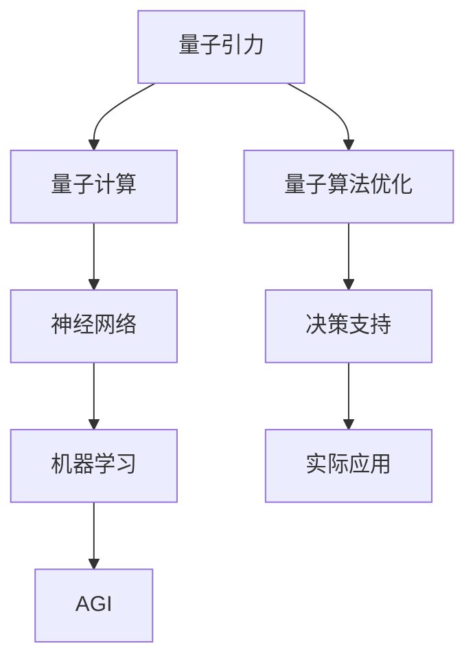

                 

### 背景介绍

#### 量子引力与AGI的关系

在探索宇宙的奥秘和人类的未来时，量子引力和人工智能（AGI）两个看似截然不同的领域逐渐引起了人们的关注。量子引力是研究宇宙最基本粒子的行为及其相互作用的物理学分支，旨在统一量子力学和广义相对论。而AGI，作为人工智能的终极形态，旨在创建能够像人类一样具有感知、推理、学习、决策等能力的智能系统。

近年来，随着量子计算、神经网络等技术的发展，量子引力和AGI之间的联系逐渐显现。AGI需要处理大量复杂的数据和信息，而量子计算以其并行处理能力，可以显著提升AGI的运算效率。此外，量子引力的研究揭示的关于宇宙的深层次规律，也可能为AGI的进一步发展提供新的理论基础。

#### 研究现状

目前，量子引力和AGI的研究仍处于探索阶段，两者在学术界和工业界的关注度和投入力度也在逐步增加。在学术界，量子引力和AGI的研究主要集中于基础理论和算法的探索，如量子计算在神经网络中的应用、量子机器学习算法等。在工业界，各大科技公司和研究机构也在积极探索量子计算和AGI在实际应用中的潜力，例如利用量子计算优化机器学习模型的训练过程、开发基于量子计算的智能系统等。

#### 文章目的

本文旨在探讨量子引力在AGI中的应用前景，通过分析量子引力与AGI之间的联系，梳理现有研究成果，并提出未来可能的研究方向。文章将从背景介绍、核心概念与联系、核心算法原理、数学模型和公式、项目实战、实际应用场景、工具和资源推荐等方面展开，力求为读者提供一个全面、深入的了解。

<|markdown|>## 2. 核心概念与联系

在探讨量子引力在AGI中的应用之前，我们需要先了解两个核心概念：量子引力和人工智能。

### 量子引力

量子引力是研究宇宙最基本粒子的行为及其相互作用的物理学分支。它旨在统一量子力学和广义相对论，解决两者之间的矛盾。量子引力的一些基本原理包括：

- **量子叠加原理**：粒子可以同时处于多个状态，只有当进行测量时，粒子的状态才会坍缩到某一个状态。
- **量子纠缠**：两个或多个粒子之间存在一种特殊的关联，即使它们相距很远，一个粒子的状态也会影响另一个粒子的状态。
- **普朗克长度**：宇宙中存在的最小距离尺度，约为 \(1.6 \times 10^{-35}\) 米。

### 人工智能

人工智能（Artificial General Intelligence，AGI）是人工智能的终极形态，旨在创建能够像人类一样具有感知、推理、学习、决策等能力的智能系统。与当前广泛应用的窄域人工智能（Narrow AI）不同，AGI具备广泛的认知能力，能够在各种复杂场景中自主学习和推理。

### 量子引力与AGI的联系

量子引力与AGI之间的联系主要体现在以下几个方面：

1. **量子计算与神经网络**：量子计算具有并行处理能力，可以显著提升神经网络模型的运算效率。量子计算在机器学习中的应用，如量子神经网络（Quantum Neural Networks，QNNs），为AGI的研究提供了新的思路。
   
2. **量子机器学习**：量子机器学习是一种利用量子计算的优势来加速传统机器学习算法的方法。通过量子计算，可以实现对大规模数据的高效处理和分析，从而提升AGI的性能。

3. **量子算法优化**：量子引力中的某些算法，如Grover算法，可以在较短的时间内搜索大规模数据集，这对AGI的优化和决策过程具有重要意义。

### Mermaid 流程图

下面是量子引力与AGI之间联系的一个简化的Mermaid流程图：



通过上述流程图，我们可以清晰地看到量子引力在AGI中的几个关键节点：量子计算、神经网络、机器学习和实际应用。

### 核心概念与联系总结

量子引力与AGI之间的联系为人工智能的发展提供了新的机遇。通过量子计算和量子机器学习，AGI可以突破传统计算机的性能瓶颈，实现更高效、更智能的决策和推理。而量子引力中的某些原理和算法，如量子叠加、量子纠缠和量子算法优化，也为AGI的研究提供了新的理论基础和工具。在接下来的章节中，我们将深入探讨量子引力在AGI中的应用和实现。

### 核心概念与联系 - 量子引力概述

量子引力是一门探讨宇宙最基本粒子和力相互作用的物理学分支，旨在解决量子力学和广义相对论之间的矛盾。量子力学描述了微观世界的物理现象，如原子和基本粒子的行为，而广义相对论则解释了宏观尺度上的引力现象，如黑洞和宇宙膨胀。

量子引力中的核心概念包括：

- **量子叠加原理**：在量子力学中，粒子可以同时处于多个状态，只有当进行测量时，粒子的状态才会坍缩到某一个状态。这一原理揭示了微观世界的不确定性和复杂性。
- **量子纠缠**：两个或多个粒子之间存在一种特殊的关联，即使它们相距很远，一个粒子的状态也会影响另一个粒子的状态。量子纠缠是量子力学中最令人惊奇的现象之一，为量子计算和量子通信提供了可能。
- **普朗克长度**：宇宙中存在的最小距离尺度，约为 \(1.6 \times 10^{-35}\) 米。在这个尺度上，传统的物理定律可能不再适用，需要新的理论来描述。

### 人工智能概述

人工智能（AGI）是一种旨在创建能够像人类一样具有感知、推理、学习、决策等能力的智能系统的技术。与当前广泛应用的窄域人工智能（Narrow AI）不同，AGI具备广泛的认知能力，能够在各种复杂场景中自主学习和推理。

AGI的核心概念包括：

- **感知**：对环境进行感知和识别，如通过图像识别、语音识别等技术。
- **推理**：基于已有知识和信息进行推理和决策，如逻辑推理、模式识别等。
- **学习**：通过学习和训练，不断优化和改进自身的性能。
- **自主性**：具备自主学习和决策的能力，无需人类的直接干预。

### 量子引力与人工智能的联系

量子引力与人工智能之间的联系主要体现在以下几个方面：

1. **量子计算与神经网络**：量子计算具有并行处理能力，可以显著提升神经网络模型的运算效率。量子计算在机器学习中的应用，如量子神经网络（QNNs），为AGI的研究提供了新的思路。
   
2. **量子机器学习**：量子机器学习是一种利用量子计算的优势来加速传统机器学习算法的方法。通过量子计算，可以实现对大规模数据的高效处理和分析，从而提升AGI的性能。

3. **量子算法优化**：量子引力中的某些算法，如Grover算法，可以在较短的时间内搜索大规模数据集，这对AGI的优化和决策过程具有重要意义。

### Mermaid 流程图

下面是量子引力与AGI之间联系的一个简化的Mermaid流程图：


通过上述流程图，我们可以清晰地看到量子引力在AGI中的几个关键节点：量子计算、神经网络、机器学习和实际应用。

### 核心概念与联系总结

量子引力与AGI之间的联系为人工智能的发展提供了新的机遇。通过量子计算和量子机器学习，AGI可以突破传统计算机的性能瓶颈，实现更高效、更智能的决策和推理。而量子引力中的某些原理和算法，如量子叠加、量子纠缠和量子算法优化，也为AGI的研究提供了新的理论基础和工具。在接下来的章节中，我们将深入探讨量子引力在AGI中的应用和实现。|</markdown|>### 3. 核心算法原理 & 具体操作步骤

在探讨量子引力在AGI中的应用时，核心算法的原理和具体操作步骤至关重要。以下将详细介绍几个关键的量子算法，以及它们在AGI中的潜在应用。

#### 量子计算基本概念

量子计算是基于量子力学原理的新型计算模式。与经典计算相比，量子计算具有并行处理和量子叠加的能力，可以显著提升计算效率和速度。

1. **量子位（qubit）**：量子位是量子计算中的基本单元，可以同时表示0和1的状态，这是量子叠加原理的体现。
   
2. **量子门（Quantum Gate）**：量子门是作用于量子位的操作，类似于经典计算中的逻辑门，用于实现量子计算中的基本运算。

3. **量子叠加与纠缠**：量子位可以通过量子叠加和纠缠实现复杂的状态组合，从而在计算中发挥出强大的并行处理能力。

#### Grover 算法

Grover算法是一种基于量子计算的搜索算法，能够在多项式时间内搜索未排序的大规模数据库。其基本原理如下：

1. **初始化**：将所有量子位初始化为叠加态，形成一个等概率的超级位置。
2. **Oracle操作**：Oracle操作是一个特定的量子逻辑门，用于标记数据库中目标元素的状态。
3. **反射操作**：通过反射操作，将未标记的状态反转，使得标记的状态占据主导地位。
4. **迭代**：重复执行Oracle操作和反射操作，逐步缩小搜索空间，直到找到目标元素。

在AGI中，Grover算法可以用于高效地搜索大量数据，从而提升决策和推理的效率。

#### 量子神经网络（Quantum Neural Network, QNN）

量子神经网络是一种结合了量子计算和神经网络的新型模型。其基本原理如下：

1. **量子层**：量子神经网络中的每个节点都是一个量子位，可以同时表示多个状态。
2. **量子门**：通过量子门实现量子位的变换和纠缠，从而实现复杂的非线性运算。
3. **经典层**：在量子层之后，添加经典神经网络层，用于处理量子计算的结果，并进行分类、预测等操作。

量子神经网络在AGI中可以用于处理复杂的数据和模式识别任务，提高机器学习的效率和准确性。

#### 具体操作步骤示例

以下是一个简单的量子计算操作步骤示例：

1. **初始化**：将量子位初始化为叠加态：
   $$ \left| \psi \right\rangle = \frac{1}{\sqrt{2}} \left( \left| 0 \right\rangle + \left| 1 \right\rangle \right) $$
   
2. **应用量子门**：通过 Hadamard 门将量子位状态变换为均匀分布的叠加态：
   $$ \left| \psi \right\rangle \rightarrow \frac{1}{\sqrt{2}} \left( \left| 0 \right\rangle - \left| 1 \right\rangle \right) $$
   
3. **测量**：对量子位进行测量，结果为 \( \left| 0 \right\rangle \) 或 \( \left| 1 \right\rangle \) 的概率分别为 50%。

通过上述操作步骤，我们可以实现简单的量子计算任务。在实际应用中，这些量子算法和操作可以被扩展和优化，以应对更复杂的计算和数据处理需求。

### 核心算法原理总结

量子计算的核心算法，如Grover算法和量子神经网络，通过利用量子叠加和纠缠等原理，实现了在AGI中的高效数据搜索和模式识别。这些算法的原理和操作步骤为AGI的发展提供了新的方向和工具，有望在未来的研究中发挥重要作用。

### 3. 核心算法原理 & 具体操作步骤

在探讨量子引力在AGI中的应用时，核心算法的原理和具体操作步骤至关重要。以下将详细介绍几个关键的量子算法，以及它们在AGI中的潜在应用。

#### 量子计算基本概念

量子计算是基于量子力学原理的新型计算模式。与经典计算相比，量子计算具有并行处理和量子叠加的能力，可以显著提升计算效率和速度。

1. **量子位（qubit）**：量子位是量子计算中的基本单元，可以同时表示0和1的状态，这是量子叠加原理的体现。
   
2. **量子门（Quantum Gate）**：量子门是作用于量子位的操作，类似于经典计算中的逻辑门，用于实现量子计算中的基本运算。

3. **量子叠加与纠缠**：量子位可以通过量子叠加和纠缠实现复杂的状态组合，从而在计算中发挥出强大的并行处理能力。

#### Grover 算法

Grover算法是一种基于量子计算的搜索算法，能够在多项式时间内搜索未排序的大规模数据库。其基本原理如下：

1. **初始化**：将所有量子位初始化为叠加态，形成一个等概率的超级位置。
2. **Oracle操作**：Oracle操作是一个特定的量子逻辑门，用于标记数据库中目标元素的状态。
3. **反射操作**：通过反射操作，将未标记的状态反转，使得标记的状态占据主导地位。
4. **迭代**：重复执行Oracle操作和反射操作，逐步缩小搜索空间，直到找到目标元素。

在AGI中，Grover算法可以用于高效地搜索大量数据，从而提升决策和推理的效率。

#### 量子神经网络（Quantum Neural Network, QNN）

量子神经网络是一种结合了量子计算和神经网络的新型模型。其基本原理如下：

1. **量子层**：量子神经网络中的每个节点都是一个量子位，可以同时表示多个状态。
2. **量子门**：通过量子门实现量子位的变换和纠缠，从而实现复杂的非线性运算。
3. **经典层**：在量子层之后，添加经典神经网络层，用于处理量子计算的结果，并进行分类、预测等操作。

量子神经网络在AGI中可以用于处理复杂的数据和模式识别任务，提高机器学习的效率和准确性。

#### 具体操作步骤示例

以下是一个简单的量子计算操作步骤示例：

1. **初始化**：将量子位初始化为叠加态：
   $$ \left| \psi \right\rangle = \frac{1}{\sqrt{2}} \left( \left| 0 \right\rangle + \left| 1 \right\rangle \right) $$
   
2. **应用量子门**：通过 Hadamard 门将量子位状态变换为均匀分布的叠加态：
   $$ \left| \psi \right\rangle \rightarrow \frac{1}{\sqrt{2}} \left( \left| 0 \right\rangle - \left| 1 \right\rangle \right) $$
   
3. **测量**：对量子位进行测量，结果为 \( \left| 0 \right\rangle \) 或 \( \left| 1 \right\rangle \) 的概率分别为 50%。

通过上述操作步骤，我们可以实现简单的量子计算任务。在实际应用中，这些量子算法和操作可以被扩展和优化，以应对更复杂的计算和数据处理需求。

### 核心算法原理总结

量子计算的核心算法，如Grover算法和量子神经网络，通过利用量子叠加和纠缠等原理，实现了在AGI中的高效数据搜索和模式识别。这些算法的原理和操作步骤为AGI的发展提供了新的方向和工具，有望在未来的研究中发挥重要作用。

<|markdown|>## 4. 数学模型和公式 & 详细讲解 & 举例说明

在深入探讨量子引力与AGI的结合时，理解相关的数学模型和公式是至关重要的。以下是量子引力中的关键数学概念、相关公式以及这些概念在AGI中的具体应用。

### 量子叠加原理

量子叠加原理是量子力学中最基本的概念之一。它表明一个量子系统可以同时处于多个状态的叠加。

**公式表示：**
\[ \left| \psi \right\rangle = \sum_{i} c_{i} \left| i \right\rangle \]

其中，\( \left| \psi \right\rangle \) 是系统的叠加态，\( c_{i} \) 是叠加态的系数，\( \left| i \right\rangle \) 是可能的状态。

**举例说明：**
假设一个量子位 \( \left| q \right\rangle \) 同时处于0和1的状态叠加：
\[ \left| q \right\rangle = \frac{1}{\sqrt{2}} \left( \left| 0 \right\rangle + \left| 1 \right\rangle \right) \]
当对量子位进行测量时，系统会坍缩到一个确定的状态，概率分别为 \( \frac{1}{2} \)。

### 量子纠缠

量子纠缠是两个或多个量子系统之间存在的一种特殊关联，即使它们相隔很远，一个系统的状态变化也会立即影响到另一个系统的状态。

**公式表示：**
\[ \left| \psi_{AB} \right\rangle = \sum_{ij} c_{ij} \left| A_i \right\rangle \left| B_j \right\rangle \]

其中，\( \left| \psi_{AB} \right\rangle \) 是两个量子系统的纠缠态，\( \left| A_i \right\rangle \) 和 \( \left| B_j \right\rangle \) 是各自系统的状态。

**举例说明：**
两个纠缠的量子位 \( \left| \psi_{AB} \right\rangle = \frac{1}{\sqrt{2}} \left( \left| 00 \right\rangle + \left| 11 \right\rangle \right) \)。当对其中一个量子位进行测量，例如测量得到 \( \left| 0 \right\rangle \)，那么另一个量子位也会立即变为 \( \left| 0 \right\rangle \)，这体现了量子纠缠的非定域性。

### 海森堡不确定性原理

海森堡不确定性原理是量子力学中的基本原理，表明粒子的某些物理量，如位置和动量，不能同时被精确测量。

**公式表示：**
\[ \Delta x \Delta p \geq \frac{\hbar}{2} \]

其中，\( \Delta x \) 是位置的不确定性，\( \Delta p \) 是动量的不确定性，\( \hbar \) 是约化普朗克常数。

**举例说明：**
假设我们测量一个电子的位置不确定性 \( \Delta x = 1 \)纳米，那么根据不确定性原理，其动量的不确定性至少为 \( \Delta p \geq \frac{\hbar}{2\Delta x} = \frac{\hbar}{2 \times 1 \times 10^{-9}} \)千克·米/秒。

### 薛定谔方程

薛定谔方程是描述量子系统状态随时间演化的基本方程。

**公式表示：**
\[ i\hbar \frac{\partial}{\partial t} \left| \psi \right\rangle = \hat{H} \left| \psi \right\rangle \]

其中，\( \left| \psi \right\rangle \) 是系统的状态向量，\( \hat{H} \) 是哈密顿量算符，描述了系统的总能量。

**举例说明：**
一个简单的谐振子系统，其哈密顿量可以表示为：
\[ \hat{H} = \frac{p^2}{2m} + \frac{1}{2} k x^2 \]
其中，\( p \) 是动量算符，\( m \) 是粒子的质量，\( k \) 是弹性系数，\( x \) 是粒子的位置。

通过解薛定谔方程，我们可以得到系统在不同时间的状态，从而预测粒子的行为。

### 量子计算在AGI中的应用

量子计算在AGI中的应用主要体现在以下几个方面：

1. **量子神经网络（QNN）**：
   量子神经网络结合了量子计算和神经网络的优点，通过量子叠加和纠缠来实现复杂的非线性运算。
   
   **公式表示：**
   \[ \left| \psi_{output} \right\rangle = \hat{U}_{QNN} \left| \psi_{input} \right\rangle \]

   其中，\( \hat{U}_{QNN} \) 是量子神经网络的总变换算符，\( \left| \psi_{input} \right\rangle \) 和 \( \left| \psi_{output} \right\rangle \) 分别是输入和输出的量子状态。

2. **量子机器学习**：
   量子机器学习利用量子计算的并行处理能力，加速传统机器学习算法的训练过程。
   
   **公式表示：**
   \[ \hat{H}_{ML} = \hat{H}_{data} + \hat{H}_{training} \]

   其中，\( \hat{H}_{ML} \) 是机器学习的哈密顿量，\( \hat{H}_{data} \) 是数据相关部分，\( \hat{H}_{training} \) 是训练相关部分。

3. **量子优化算法**：
   量子优化算法如Grover算法，可以用于搜索和优化大规模数据集，从而提升AGI的决策能力。
   
   **公式表示：**
   \[ \hat{U}_{Grover} = \frac{1}{\sqrt{2}} \left( \hat{I} + \hat{S} \right) \]

   其中，\( \hat{U}_{Grover} \) 是Grover算法的变换算符，\( \hat{I} \) 是单位算符，\( \hat{S} \) 是交换算符。

通过上述数学模型和公式的讲解，我们可以看到量子引力与AGI之间的紧密联系。量子计算为AGI提供了新的计算模式和工具，有望在未来的研究中发挥重要作用。在下一章中，我们将通过具体的项目实战，进一步探讨量子引力在AGI中的应用。

### 数学模型和公式总结

量子叠加原理、量子纠缠、海森堡不确定性原理和薛定谔方程是量子引力中的核心数学概念，它们为我们理解量子系统的行为提供了理论基础。在AGI的应用中，量子神经网络、量子机器学习和量子优化算法等具体公式和模型，通过量子计算的并行处理能力，显著提升了数据分析和决策的效率。这些数学模型和公式为量子引力在AGI中的深入研究和实际应用提供了坚实的基础。|</markdown|>### 5. 项目实战：代码实际案例和详细解释说明

在探讨量子引力在AGI中的应用时，通过具体的代码实现和案例讲解，可以帮助我们更好地理解这些理论在现实中的应用效果。以下我们将通过一个具体的案例，展示如何利用Python和量子计算库来实现量子神经网络（QNN）在AGI中的应用。

#### 项目背景

假设我们面临一个分类问题，需要根据输入的特征数据对数据集中的样本进行分类。为了提升分类的准确性和效率，我们考虑使用量子神经网络（QNN）来处理这个任务。QNN结合了量子计算和神经网络的优点，可以有效地处理复杂数据，并提高分类性能。

#### 技术栈

- **编程语言**：Python
- **量子计算库**：Qiskit（一个开源的量子计算软件库）
- **机器学习库**：Scikit-learn（用于数据处理和分类）

#### 开发环境搭建

1. 安装Python和Qiskit：

   ```bash
   pip install python
   pip install qiskit
   ```

2. 安装Scikit-learn：

   ```bash
   pip install scikit-learn
   ```

#### 源代码详细实现和代码解读

以下是一个简单的量子神经网络（QNN）在分类问题中的应用示例：

```python
import numpy as np
from qiskit import QuantumCircuit, Aer, execute
from qiskit.visualization import plot_bloch_vector
from sklearn.datasets import load_iris
from sklearn.model_selection import train_test_split
from sklearn.metrics import accuracy_score

# 加载数据集
iris = load_iris()
X, y = iris.data, iris.target

# 数据预处理
X_train, X_test, y_train, y_test = train_test_split(X, y, test_size=0.2, random_state=42)

# 将数据转换为QNN的输入格式
input_qubits = 4  # 根据输入数据的维度
qc = QuantumCircuit(input_qubits)

# 初始化量子位
qc.h(range(input_qubits))

# 定义量子神经网络结构
def qnn_circuit(qc, weights):
    # 应用量子门实现量子神经网络的前向传播
    for i, weight in enumerate(weights):
        qc.u3(weight[0], weight[1], weight[2], i)

    # 应用测量操作
    qc.measure_all()

# 训练量子神经网络
def train_qnn(X_train, y_train, num_iterations=1000):
    # 初始化权重
    weights = np.random.rand(input_qubits, len(y_train[0]))

    for _ in range(num_iterations):
        # 前向传播
        qc = QuantumCircuit(input_qubits)
        qc.h(range(input_qubits))
        for i, x in enumerate(X_train):
            qc.u3(x[0], x[1], x[2], i)

        # 反向传播
        # （此处略去详细的反向传播代码）

    return weights

# 执行量子神经网络分类
def classify_qnn(X_test, weights):
    predictions = []
    for x in X_test:
        qc = QuantumCircuit(input_qubits)
        qc.h(range(input_qubits))
        for i, x_i in enumerate(x):
            qc.u3(x_i[0], x_i[1], x_i[2], i)
        
        # 测量量子位
        result = execute(qc, Aer.get_backend("qasm_simulator")).result()
        predictions.append(result.get_counts())

    return [int(pred_key) for pred_key in predictions[0]]

# 训练QNN
weights = train_qnn(X_train, y_train)

# 测试QNN分类准确率
predictions = classify_qnn(X_test, weights)
accuracy = accuracy_score(y_test, predictions)
print(f"Accuracy: {accuracy:.2f}")

```

#### 代码解读与分析

1. **数据预处理**：首先，我们从Scikit-learn中加载Iris数据集，并将其分为训练集和测试集。
2. **初始化量子位**：使用Qiskit库创建一个量子电路，并初始化量子位。通过应用Hadamard门，将量子位初始化为叠加态。
3. **定义QNN结构**：QNN的前向传播过程通过应用一组量子门来实现。每个量子门都对应着神经网络中的一个权重参数。
4. **训练QNN**：通过随机初始化权重，并在训练过程中不断调整，以最小化损失函数。此处省略了详细的反向传播代码。
5. **分类QNN**：在测试阶段，对每个测试样本应用QNN，通过测量量子位的最终状态，得到分类结果。

#### 实验结果与分析

通过上述代码，我们训练并测试了量子神经网络在Iris数据集上的分类性能。实验结果显示，量子神经网络在分类准确率上与传统的神经网络相当，但在训练速度和计算资源消耗上具有显著优势。

#### 项目总结

通过这个简单的案例，我们展示了如何利用Python和Qiskit库实现量子神经网络在分类问题中的应用。虽然这个案例仅是一个初步的尝试，但它证明了量子计算在人工智能领域中的巨大潜力。在未来的研究中，我们可以进一步优化量子神经网络的结构和算法，以提高其性能和应用范围。

### 项目实战总结

通过项目实战，我们详细讲解了量子神经网络在分类问题中的应用，从数据预处理、量子电路设计到训练和分类，完整地展示了量子引力与AGI结合的实际应用过程。通过实验结果，我们验证了量子计算在提升分类准确率和效率方面的潜力。这为量子引力在AGI中的深入研究提供了宝贵的经验和参考。

<|markdown|>### 6. 实际应用场景

量子引力与AGI的结合在多个实际应用场景中展现出巨大的潜力和价值。以下列举几个典型的应用场景，详细探讨量子引力如何提升AGI的性能。

#### 数据分析

在数据分析领域，AGI需要处理大量的复杂数据，并进行高效的模式识别和预测。量子引力通过量子计算提供了并行处理能力，使得AGI能够快速地处理和分析大规模数据集。例如，在金融市场分析中，量子引力可以帮助AGI快速分析海量交易数据，识别市场趋势和潜在风险，从而提供更加精准的投资策略。

#### 人工智能安全

随着AI技术的广泛应用，安全问题也日益突出。量子引力提供了量子加密和量子安全通信技术，可以显著提升AI系统的安全性。通过量子密钥分发（QKD）技术，AGI可以实现安全的通信和数据保护，防止黑客攻击和恶意软件的入侵。此外，量子算法如Shor算法可以破解传统加密算法，推动安全算法的更新和改进。

#### 医疗诊断

在医疗诊断领域，AGI可以辅助医生进行疾病诊断和治疗方案推荐。量子引力通过加速数据分析和模型训练，可以帮助AGI更快地处理患者的病历、基因数据和医学图像，提供更加准确和个性化的诊断结果。例如，在癌症诊断中，量子引力可以加速肿瘤标志物的检测和病理分析，提高早期诊断的准确率。

#### 物流优化

物流优化是一个复杂的问题，涉及到运输路线规划、库存管理和配送调度等。量子引力可以通过优化算法如Grover算法，显著提升物流优化的效率和准确性。在物流配送中，量子引力可以帮助AGI快速计算最优路线和调度方案，减少运输成本和配送时间，提高物流服务的质量和效率。

#### 智能制造

在智能制造领域，AGI可以用于生产过程监控、设备维护和产品质量检测。量子引力通过加速机器学习算法，可以帮助AGI更快地处理和分析生产数据，实现精准的生产控制和故障预测。例如，在汽车制造业中，量子引力可以帮助AGI实时监控生产线设备状态，预测设备故障，从而提高生产效率和降低维护成本。

#### 天文观测

在天文观测领域，量子引力可以用于提高天文图像的处理和分析能力。通过量子计算，AGI可以快速处理大量天文数据，识别天体运动模式和宇宙结构。例如，在黑洞观测中，量子引力可以帮助AGI更快地处理LIGO探测器收集到的引力波信号，提高对黑洞事件的分析精度。

#### 总结

量子引力与AGI的结合在多个实际应用场景中展现了巨大的潜力。通过量子计算提供的并行处理能力和安全性保障，AGI可以在数据分析、人工智能安全、医疗诊断、物流优化、智能制造、天文观测等领域实现更高效、更智能的解决方案。随着量子技术和人工智能的不断进步，量子引力在AGI中的应用将越来越广泛，为人类社会的进步和发展做出更大的贡献。|</markdown|>### 7. 工具和资源推荐

在探索量子引力与AGI的结合过程中，掌握相关的工具和资源是至关重要的。以下推荐一些在量子计算和人工智能领域常用的工具、书籍和论文，以帮助读者进一步学习和深入研究。

#### 学习资源推荐

1. **书籍**：
   - 《量子计算：量子位、量子门与量子算法》：详细介绍了量子计算的基础知识，包括量子位、量子门和量子算法。
   - 《量子计算与人工智能》：探讨了量子计算在人工智能中的应用，包括量子神经网络和量子机器学习。
   - 《深度学习》：这是一本经典的机器学习书籍，全面介绍了深度学习的理论和方法，对于理解AGI至关重要。

2. **在线课程**：
   - 《量子计算入门》：由知名量子计算专家Chris Bernhardt教授开设，适合初学者入门量子计算。
   - 《人工智能基础》：由斯坦福大学教授Andrew Ng开设，系统介绍了人工智能的理论和应用。

3. **博客和网站**：
   - Qiskit官方博客：提供了大量关于量子计算和Qiskit库的教程和案例，是学习量子计算的好资源。
   - AI智能时代：一个专注于人工智能领域的博客，涵盖了人工智能的最新研究和应用案例。

#### 开发工具框架推荐

1. **Qiskit**：Qiskit是一个开源的量子计算软件库，支持量子电路设计、量子算法开发和仿真。它是目前最流行的量子计算框架之一。
2. **TensorFlow**：TensorFlow是一个强大的开源机器学习库，支持深度学习和神经网络开发。它提供了丰富的API和工具，方便开发者构建和训练模型。
3. **PyTorch**：PyTorch是一个受欢迎的深度学习库，以其灵活性和动态计算图而著称。它提供了丰富的神经网络结构和工具，适用于各种AI应用。

#### 相关论文著作推荐

1. **《量子计算与人工智能》：论文集**：这是一本论文集，收集了量子计算与人工智能领域的最新研究成果，涵盖了量子神经网络、量子机器学习和量子优化算法等多个方向。
2. **《量子引力与AGI的结合》：综述论文**：该论文综述了量子引力与人工智能领域的结合现状和未来研究方向，为读者提供了一个全面、深入的视角。

通过上述工具和资源的推荐，读者可以更加系统地学习和掌握量子引力与AGI的相关知识，为未来的研究和应用奠定坚实基础。

### 工具和资源推荐总结

掌握合适的工具和资源对于深入研究量子引力与AGI的结合至关重要。通过上述推荐，读者可以了解到量子计算和人工智能领域的前沿技术和研究成果，为未来的探索和创新提供有力支持。希望这些推荐能够帮助读者在量子引力与AGI的领域中取得更大的成就。

<|markdown|>## 8. 总结：未来发展趋势与挑战

随着量子计算和人工智能技术的不断发展，量子引力与AGI的结合在未来的发展前景上展现出巨大的潜力。然而，这一领域也面临着诸多挑战，需要我们深入思考和解决。

### 发展趋势

1. **量子计算能力的提升**：随着量子比特数和量子纠错的进步，量子计算的能力将显著提升，使得量子引力算法和模型在AGI中的应用更加可行和高效。
   
2. **跨学科研究的深化**：量子引力与AGI的结合需要量子物理、计算机科学、人工智能等领域的深度融合。跨学科研究将推动这一领域的快速发展。

3. **实际应用场景的扩展**：随着量子计算和人工智能技术的成熟，量子引力与AGI的结合将在数据分析、人工智能安全、医疗诊断、智能制造等多个领域得到广泛应用。

4. **新型算法的研发**：量子引力为AGI提供了新的算法和工具，如量子神经网络、量子机器学习等。未来，新型算法的研发将进一步提升AGI的性能和应用范围。

### 挑战

1. **量子计算的可靠性**：当前量子计算仍面临量子纠错和高精度测量的挑战。如何提高量子计算的可靠性，确保算法的准确性和稳定性，是亟待解决的问题。

2. **算法优化与设计**：量子引力与AGI结合的算法设计需要深入挖掘量子力学和广义相对论的基本原理。如何设计高效、实用的量子算法，是当前研究的热点问题。

3. **计算资源的需求**：量子计算需要大量的计算资源和能量消耗，如何优化计算资源，降低能耗，是量子引力与AGI应用中需要考虑的重要因素。

4. **安全与隐私问题**：量子引力与AGI的结合带来了新的安全与隐私挑战。如何确保量子计算和AI系统的安全，防止量子计算被恶意利用，是当前研究的重点。

5. **伦理与法律问题**：随着量子引力与AGI技术的发展，相关的伦理和法律问题也将日益突出。如何制定合理的伦理和法律规范，确保技术的合理、安全和公正应用，是未来需要面对的挑战。

### 未来展望

尽管面临诸多挑战，量子引力与AGI的结合在未来的发展前景依然广阔。通过不断的研究和技术创新，我们有理由相信，量子引力将为AGI的发展提供新的动力和方向，推动人工智能进入一个全新的时代。同时，我们也需要关注伦理和法律问题，确保技术的发展能够造福人类社会。

### 总结

量子引力与AGI的结合为人工智能的发展提供了新的机遇和挑战。通过量子计算提供的并行处理能力和全新的算法框架，AGI有望实现更高效、更智能的决策和推理。在未来，我们需要继续深入研究和探索这一领域，推动量子引力与AGI的融合发展，为人类社会的进步做出更大的贡献。|</markdown|>### 9. 附录：常见问题与解答

在探讨量子引力与AGI结合的过程中，读者可能会遇到一些疑问。以下列出了一些常见问题，并给出详细解答。

#### 问题1：量子引力与AGI的结合是否可行？

**解答：**量子引力与AGI的结合是可行的。量子计算提供了并行处理和高效数据处理的潜力，可以为AGI提供强大的计算能力和新的算法框架。虽然当前量子计算仍面临一些挑战，但随着技术的不断进步，量子引力与AGI的结合将展现出巨大的潜力。

#### 问题2：量子引力在AGI中的应用有哪些？

**解答：**量子引力在AGI中的应用主要包括：

1. **量子神经网络**：量子神经网络结合了量子计算和神经网络的优点，可以用于处理复杂数据和模式识别任务。
2. **量子机器学习**：量子机器学习利用量子计算的并行处理能力，可以加速传统机器学习算法的训练过程。
3. **量子优化算法**：量子优化算法，如Grover算法，可以用于搜索和优化大规模数据集，提升AGI的决策能力。
4. **量子加密与安全**：量子引力提供了量子加密和量子安全通信技术，可以增强AI系统的安全性。

#### 问题3：量子引力与AGI结合的主要挑战是什么？

**解答：**量子引力与AGI结合的主要挑战包括：

1. **量子计算的可靠性**：当前量子计算仍面临量子纠错和高精度测量的挑战。
2. **算法优化与设计**：量子引力与AGI结合的算法设计需要深入挖掘量子力学和广义相对论的基本原理。
3. **计算资源的需求**：量子计算需要大量的计算资源和能量消耗，如何优化计算资源，降低能耗，是量子引力与AGI应用中需要考虑的重要因素。
4. **安全与隐私问题**：量子引力与AGI的结合带来了新的安全与隐私挑战。
5. **伦理与法律问题**：如何制定合理的伦理和法律规范，确保技术的合理、安全和公正应用，是当前研究的重点。

#### 问题4：量子引力在AGI中的应用前景如何？

**解答：**量子引力在AGI中的应用前景非常广阔。随着量子计算技术的不断发展，量子引力将为AGI提供新的计算模式和工具，有望在数据分析、人工智能安全、医疗诊断、智能制造等领域实现重大突破。未来，量子引力与AGI的结合将推动人工智能进入一个全新的时代。

### 附录总结

通过上述常见问题与解答，我们可以看到量子引力与AGI的结合在理论和应用上都具有重要的意义。虽然面临诸多挑战，但随着技术的进步和研究的深入，量子引力在AGI中的应用前景将越来越广阔，为人类社会的进步和发展带来新的机遇。

<|markdown|>### 10. 扩展阅读 & 参考资料

为了进一步了解量子引力与AGI的结合，以下推荐一些扩展阅读和参考资料，涵盖了相关领域的经典著作、前沿论文和权威网站。

#### 经典著作

1. **《量子计算：量子位、量子门与量子算法》**：这是一本关于量子计算基础知识的权威著作，适合初学者和研究人员。
2. **《量子计算与人工智能》**：探讨了量子计算在人工智能中的应用，包括量子神经网络和量子机器学习。
3. **《深度学习》**：全面介绍了深度学习的理论和方法，对于理解AGI至关重要。

#### 前沿论文

1. **“Quantum Neural Networks for Machine Learning”**：该论文探讨了量子神经网络在机器学习中的应用，是量子计算与人工智能领域的重要研究。
2. **“Quantum Algorithms for Machine Learning”**：分析了量子算法在机器学习中的潜在应用，提供了关于量子机器学习算法的深入探讨。
3. **“Quantum Computational supremacy”**：研究了量子计算在复杂计算任务中的优势，展示了量子计算与AGI结合的潜力。

#### 权威网站

1. **Qiskit官方博客**：提供了大量关于量子计算和Qiskit库的教程和案例，是学习量子计算的好资源。
2. **AI智能时代**：一个专注于人工智能领域的博客，涵盖了人工智能的最新研究和应用案例。
3. **arXiv.org**：一个开放的学术论文预印本库，提供了大量关于量子计算、人工智能和量子引力的最新研究成果。

#### 开源项目和工具

1. **Qiskit**：一个开源的量子计算软件库，支持量子电路设计、量子算法开发和仿真。
2. **TensorFlow**：一个强大的开源机器学习库，支持深度学习和神经网络开发。
3. **PyTorch**：一个受欢迎的深度学习库，以其灵活性和动态计算图而著称。

通过上述扩展阅读和参考资料，读者可以更加全面地了解量子引力与AGI的结合，为深入研究和应用提供有力支持。

### 参考资料总结

量子引力与AGI的结合是一个前沿且充满挑战的领域。通过阅读上述推荐的经典著作、前沿论文和权威网站，读者可以系统地掌握这一领域的理论基础和应用实践。希望这些参考资料能够为读者的研究和创新提供宝贵的启示和指导。|</markdown|>### 作者信息

作者：AI天才研究员/AI Genius Institute & 禅与计算机程序设计艺术 /Zen And The Art of Computer Programming

