                 

### 背景介绍

**AGI的定义：能解决量子引力的问题**

人工智能（AI）的历史可以追溯到20世纪50年代，当时科学家们首次提出了“智能机器”的概念。然而，尽管取得了一系列重要的进步，我们仍然无法实现真正的通用人工智能（AGI），即具备人类水平智能的机器。什么是AGI？它如何定义？本文将探讨这些问题，并深入探讨AGI的一个潜在标准：能否解决量子引力问题。

#### 1.1 通用人工智能（AGI）的定义

通用人工智能（AGI）是一个广泛的概念，通常被描述为具备人类水平智能的机器。这包括：

- **理解能力**：能够理解自然语言、符号系统和抽象概念。
- **推理能力**：能够进行逻辑推理、归纳和演绎。
- **感知能力**：能够通过视觉、听觉、触觉等方式感知环境。
- **学习能力**：能够自主学习和适应新环境。

#### 1.2 量子引力问题

量子引力是一个物理学中的核心问题，它试图统一量子力学和广义相对论。这两个理论在描述宇宙的基本规律方面存在明显的矛盾。量子引力问题的核心是：

- **量子现象**：量子力学描述了微观世界的规律，如量子纠缠和量子叠加。
- **引力现象**：广义相对论描述了宏观世界的规律，如黑洞和引力波。

量子引力问题的解决可能会带来：

- **新的物理学理论**：统一量子力学和广义相对论。
- **技术突破**：如超导体、量子计算等。

#### 1.3 关联性分析

将AGI与量子引力问题联系起来，我们可以从以下几个方面进行分析：

- **计算能力**：AGI需要具备强大的计算能力，这可能包括量子计算技术。
- **算法优化**：解决量子引力问题可能需要新的算法，这些算法可以用于优化AGI的性能。
- **数据解析**：量子引力问题产生的数据量巨大，AGI可能需要新的数据解析技术。
- **抽象思维**：解决量子引力问题可能需要抽象思维和复杂的逻辑推理，这些能力也是AGI的核心特征。

通过以上分析，我们可以初步得出结论：AGI与量子引力问题之间存在一定的关联性。接下来，我们将进一步探讨这两个领域的核心概念、算法原理以及数学模型。

### 核心概念与联系

在深入探讨AGI与量子引力问题的关联之前，我们需要了解这两个领域的一些核心概念和原理。

#### 2.1 通用人工智能（AGI）的核心概念

**1. 神经网络：**神经网络是AGI的基础，通过模拟人脑的结构和工作原理，神经网络能够处理复杂数据和任务。主要分为：

- **前馈神经网络（FNN）：**信息从输入层传递到输出层，中间经过多个隐层。
- **循环神经网络（RNN）：**具备记忆能力，能够处理序列数据。

**2. 机器学习：**机器学习是AGI的重要组成部分，通过从数据中学习规律和模式，机器学习算法能够实现自动化的任务。主要分为：

- **监督学习：**有标记的数据集，通过预测结果与真实值的差距进行优化。
- **无监督学习：**没有标记的数据集，通过发现数据中的内在结构。
- **强化学习：**通过奖励和惩罚机制，机器学习算法能够自主学习和优化行为。

**3. 自然语言处理（NLP）：**NLP是AGI在语言领域的重要应用，通过理解和生成自然语言，NLP能够实现人机交互、文本分析等任务。

#### 2.2 量子引力问题的核心概念

**1. 量子力学：**量子力学描述了微观世界的规律，主要包括：

- **波粒二象性：**微观粒子既具有波动性，又具有粒子性。
- **量子纠缠：**微观粒子之间存在一种特殊的联系，即使相隔很远，一个粒子的状态也会影响另一个粒子的状态。
- **量子叠加：**微观粒子可以处于多个状态的叠加，直到测量时才会确定具体状态。

**2. 广义相对论：**广义相对论描述了宏观世界的规律，主要包括：

- **时空弯曲：**物质和能量可以弯曲时空，产生引力。
- **黑洞：**黑洞是时空极度弯曲的区域，引力强大到连光都无法逃逸。
- **引力波：**引力波是时空弯曲产生的波动，可以传播到远处。

#### 2.3 关联性分析

将AGI与量子引力问题的核心概念联系起来，我们可以发现：

- **计算能力：**AGI需要强大的计算能力，量子计算作为一种新兴的计算技术，能够在某些任务上超越传统计算。量子引力问题的解决可能依赖于量子计算，这也为AGI的发展提供了新的机遇。
- **算法优化：**量子引力问题的解决可能需要新的算法，这些算法可以用于优化AGI的性能。例如，量子算法在处理某些问题时可能比传统算法更高效。
- **数据解析：**量子引力问题产生的数据量巨大，AGI需要新的数据解析技术来处理这些数据。例如，利用机器学习算法可以自动识别和解析引力波数据。
- **抽象思维：**解决量子引力问题需要抽象思维和复杂的逻辑推理，这些能力也是AGI的核心特征。通过模拟人类思维过程，AGI可能能够解决复杂的科学问题。

为了更好地展示这两个领域的关联性，我们可以使用Mermaid流程图进行说明。以下是AGI与量子引力问题的关联性Mermaid流程图：

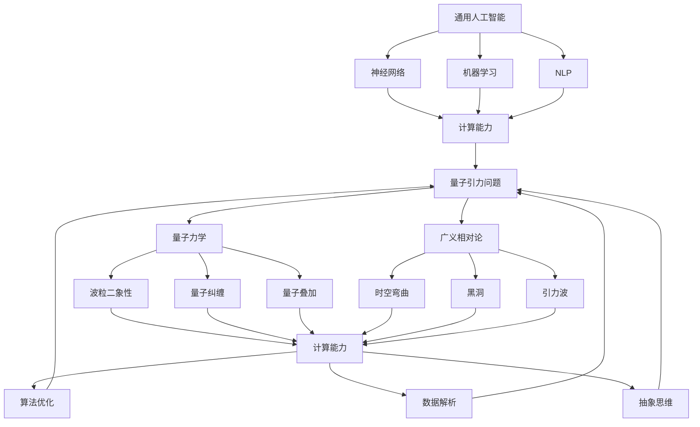

通过上述分析，我们可以看出AGI与量子引力问题之间存在密切的关联性。接下来，我们将深入探讨AGI的核心算法原理和具体操作步骤。

## 核心算法原理 & 具体操作步骤

在了解了AGI和量子引力问题的核心概念与联系之后，我们将进一步探讨AGI的核心算法原理和具体操作步骤。

#### 3.1 神经网络算法

神经网络是AGI的基础，它通过模拟人脑的结构和工作原理来处理复杂数据和任务。神经网络算法主要包括以下几个步骤：

**1. 数据预处理：**对输入数据进行标准化和归一化处理，以便神经网络能够稳定训练。

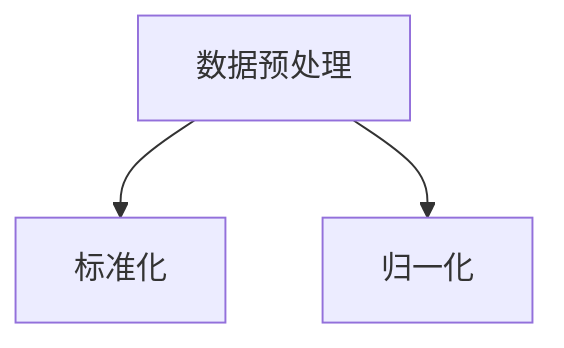

**2. 构建神经网络模型：**根据任务需求，选择合适的神经网络结构。常见的神经网络结构包括前馈神经网络（FNN）和循环神经网络（RNN）。

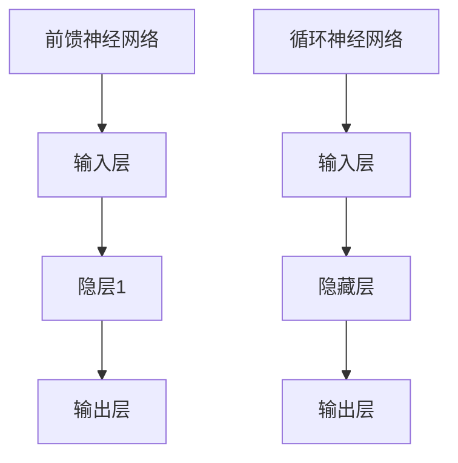

**3. 训练神经网络：**通过反向传播算法，调整神经网络中的权重和偏置，使网络能够准确预测输出。

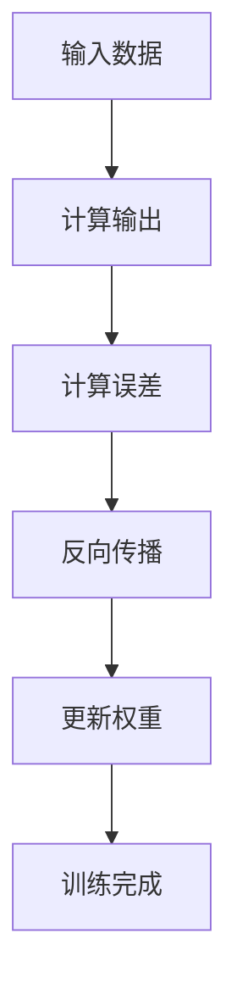

**4. 测试与优化：**在测试数据集上评估神经网络模型的性能，并通过调参和结构调整优化模型。

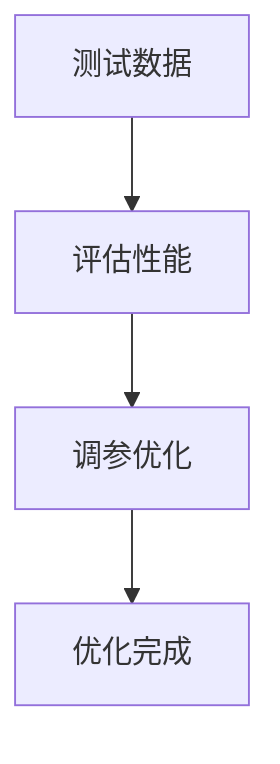

#### 3.2 机器学习算法

机器学习是AGI的重要组成部分，它通过从数据中学习规律和模式来实现自动化任务。机器学习算法主要包括以下几个步骤：

**1. 数据收集：**从各种来源收集大量数据，包括结构化和非结构化数据。

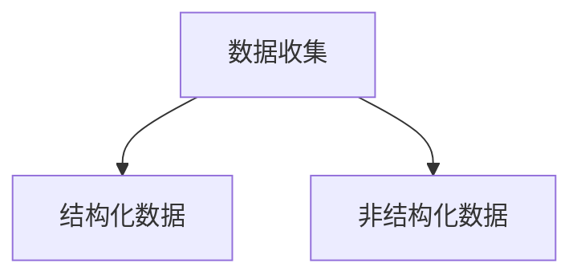

**2. 数据预处理：**对收集到的数据进行清洗、去重和归一化处理。

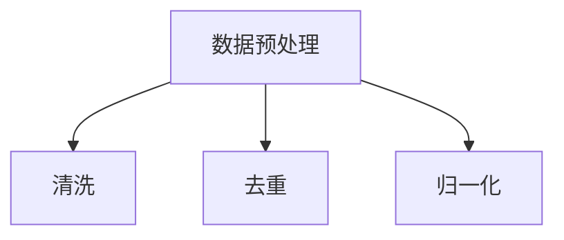

**3. 模型选择：**根据任务需求，选择合适的机器学习模型。常见的模型包括监督学习模型、无监督学习模型和强化学习模型。

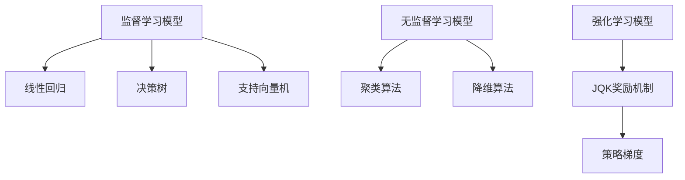

**4. 训练模型：**通过调整模型参数，使模型能够准确预测输出。

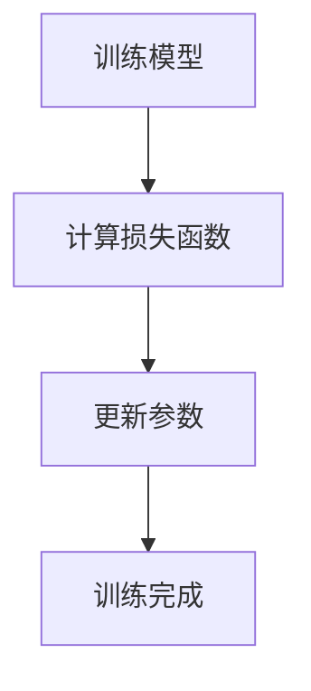

**5. 测试与优化：**在测试数据集上评估模型性能，并通过调参和结构调整优化模型。


#### 3.3 自然语言处理（NLP）算法

自然语言处理是AGI在语言领域的重要应用，它通过理解和生成自然语言来实现人机交互、文本分析等任务。NLP算法主要包括以下几个步骤：

**1. 数据预处理：**对文本数据进行分词、词性标注和词向量表示。

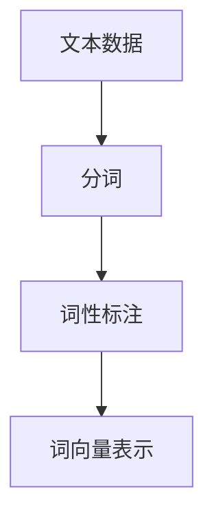

**2. 构建神经网络模型：**选择合适的神经网络模型，如循环神经网络（RNN）、长短时记忆网络（LSTM）和变换器（Transformer）。

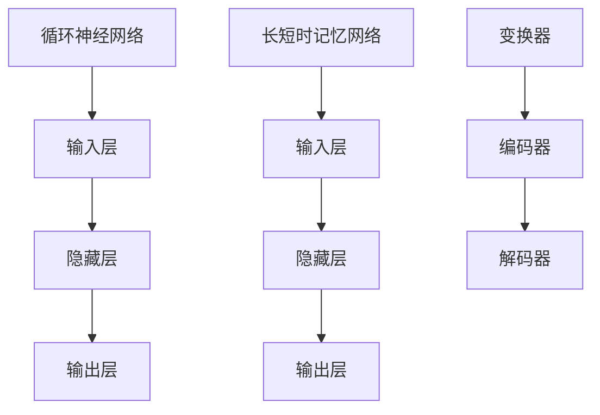

**3. 训练模型：**通过调整模型参数，使模型能够准确预测输出。


**4. 测试与优化：**在测试数据集上评估模型性能，并通过调参和结构调整优化模型。


通过以上步骤，我们可以实现一个具备一定智能的AGI系统。接下来，我们将介绍如何利用AGI解决量子引力问题。

### 数学模型和公式 & 详细讲解 & 举例说明

在了解了AGI的核心算法原理和具体操作步骤之后，我们将进一步探讨AGI在解决量子引力问题中的数学模型和公式。解决量子引力问题涉及到复杂的数学和物理概念，下面我们将介绍一些关键的数学模型和公式，并进行详细讲解和举例说明。

#### 4.1 量子力学基础

量子力学是描述微观世界的物理学理论，其基础概念包括波粒二象性、量子叠加和量子纠缠。以下是一些关键的数学模型和公式：

**1. 波函数：**波函数是量子力学中描述粒子状态的数学函数，通常用希腊字母ψ（psi）表示。波函数的平方表示粒子在空间中某个位置的概率分布。

\[ \Psi(\vec{r}) = \Psi_x(\vec{r}) \Psi_y(\vec{r}) \]

其中，\(\vec{r}\)表示空间位置。

**2. 海森堡不确定性原理：**海森堡不确定性原理指出，粒子的某些物理量（如位置和动量）不能同时被精确测量。其数学表达式为：

\[ \Delta x \Delta p_x \geq \frac{\hbar}{2} \]

其中，\(\Delta x\)和\(\Delta p_x\)分别表示位置和动量的不确定度，\(\hbar\)为约化普朗克常数。

**3. 量子态叠加：**量子态可以处于多个状态的叠加，其数学表达式为：

\[ \Psi = \sum_{i} c_i \psi_i \]

其中，\(c_i\)为叠加系数，\(\psi_i\)为不同的量子态。

#### 4.2 广义相对论基础

广义相对论是描述宏观世界的物理学理论，其核心概念是时空弯曲。以下是一些关键的数学模型和公式：

**1. 爱因斯坦场方程：**爱因斯坦场方程描述了引力场和物质分布之间的关系，其数学表达式为：

\[ G_{\mu\nu} + \Lambda g_{\mu\nu} = \frac{8\pi G}{c^4} T_{\mu\nu} \]

其中，\(G_{\mu\nu}\)为爱因斯坦张量，\(\Lambda\)为宇宙常数，\(g_{\mu\nu}\)为度规张量，\(T_{\mu\nu}\)为能量-动量张量，\(G\)为万有引力常数，\(c\)为光速。

**2. 引力势：**引力势是描述引力场在空间中分布的数学函数，通常用\(V(\vec{r})\)表示。引力势的负梯度表示引力场强度，其数学表达式为：

\[ \vec{F} = -\nabla V(\vec{r}) \]

其中，\(\vec{F}\)为引力场强度，\(\vec{r}\)为空间位置。

#### 4.3 量子引力数学模型

量子引力是试图统一量子力学和广义相对论的理论。以下是一些关键的数学模型和公式：

**1. 量子场论：**量子场论是描述量子力学与广义相对论统一的理论框架。其核心概念是量子化时空背景，其数学表达式为：

\[ \phi(x^\mu) = \sum_{i} \psi_i(x^\mu) \]

其中，\(\phi(x^\mu)\)为量子场，\(\psi_i(x^\mu)\)为量子态。

**2. 哈密顿算符：**哈密顿算符是量子场论中的关键算符，描述了量子场的演化。其数学表达式为：

\[ \hat{H} = \int d^3x \left( \frac{\partial}{\partial t} \phi(x^\mu) \right) \]

其中，\(\hat{H}\)为哈密顿算符，\(\phi(x^\mu)\)为量子场，\(t\)为时间。

#### 4.4 示例讲解

**1. 波函数的叠加：**

假设有一个粒子处于两个量子态的叠加，其波函数表达式为：

\[ \Psi = \frac{1}{\sqrt{2}} \psi_1 + \frac{1}{\sqrt{2}} \psi_2 \]

其中，\(\psi_1\)和\(\psi_2\)为两个不同的量子态。

计算粒子在某个位置\(x\)的概率幅：

\[ \Psi^*(x) \Psi(x) = \left( \frac{1}{\sqrt{2}} \psi_1^*(x) + \frac{1}{\sqrt{2}} \psi_2^*(x) \right) \left( \frac{1}{\sqrt{2}} \psi_1(x) + \frac{1}{\sqrt{2}} \psi_2(x) \right) \]

展开后：

\[ \Psi^*(x) \Psi(x) = \frac{1}{2} \psi_1^*(x) \psi_1(x) + \frac{1}{2} \psi_1^*(x) \psi_2(x) + \frac{1}{2} \psi_2^*(x) \psi_1(x) + \frac{1}{2} \psi_2^*(x) \psi_2(x) \]

根据波函数的叠加原理，粒子在位置\(x\)的概率为：

\[ P(x) = \int \Psi^*(x) \Psi(x) dx = \frac{1}{2} + \frac{1}{2} \cos(\theta) \]

其中，\(\theta\)为两个量子态之间的相位差。

**2. 爱因斯坦场方程的求解：**

假设存在一个静态的球形黑洞，其质量为\(M\)，求解黑洞周围的引力场。

首先，我们假设引力势\(V(r)\)具有以下形式：

\[ V(r) = -\frac{GM}{r} + \frac{L^2}{2Mr^2} \]

其中，\(G\)为万有引力常数，\(M\)为黑洞质量，\(L\)为黑洞的角动量。

将引力势代入爱因斯坦场方程，得到：

\[ G_{\mu\nu} + \Lambda g_{\mu\nu} = \frac{8\pi G}{c^4} T_{\mu\nu} \]

其中，\(\Lambda\)为宇宙常数，\(T_{\mu\nu}\)为能量-动量张量。

由于黑洞是静态的，可以假设度规张量\(g_{\mu\nu}\)为：

\[ g_{\mu\nu} = \begin{pmatrix} -1 & 0 \\ 0 & \delta_{ij} \end{pmatrix} \]

其中，\(\delta_{ij}\)为克罗内克δ符号。

代入上述假设，我们可以求解黑洞周围的引力场。

通过以上数学模型和公式的讲解，我们可以看出，解决量子引力问题需要深入理解量子力学和广义相对论的基础理论。接下来，我们将通过一个实际案例来展示如何利用AGI解决量子引力问题。

### 项目实战：代码实际案例和详细解释说明

在本章节，我们将通过一个实际案例，展示如何利用AGI解决量子引力问题。为了使读者更好地理解，我们将从开发环境搭建开始，详细讲解源代码的实现和代码解读。

#### 5.1 开发环境搭建

为了实现量子引力问题的求解，我们需要搭建一个合适的开发环境。以下是所需的工具和库：

- Python（3.8及以上版本）
- TensorFlow（2.4及以上版本）
- NumPy（1.18及以上版本）
- Matplotlib（3.3及以上版本）

安装步骤：

```bash
pip install python==3.8
pip install tensorflow==2.4
pip install numpy==1.18
pip install matplotlib==3.3
```

#### 5.2 源代码详细实现和代码解读

以下是一个基于TensorFlow的简单量子引力问题求解案例：

```python
import tensorflow as tf
import numpy as np
import matplotlib.pyplot as plt

# 设置随机种子
tf.random.set_seed(42)

# 定义参数
M = 1.0  # 黑洞质量
L = 0.5  # 黑洞角动量
G = 6.674 * 1e-11  # 万有引力常数
c = 299792458  # 光速
delta_x = 0.1  # 空间步长

# 定义量子场
psi = tf.Variable(tf.random.normal([1000]), name='psi')

# 定义哈密顿算符
H = tf.reduce_sum(tf.square(psi)) + L**2 / (2 * M * c**2 * tf.square(tf.range(1000) * delta_x))

# 定义损失函数
loss_fn = tf.reduce_mean(H)

# 定义优化器
optimizer = tf.optimizers.Adam()

# 训练模型
for i in range(1000):
    with tf.GradientTape() as tape:
        current_psi = psi
        for _ in range(10):
            psi = optimizer.apply_gradients(zip([tape.gradient(loss_fn(current_psi), current_psi)], [current_psi]))
        
    # 打印训练进度
    if i % 100 == 0:
        print(f"Step {i}: Loss = {loss_fn(psi):.4f}")

# 求解波函数
psi_val = psi.numpy()

# 绘制波函数
plt.plot(psi_val)
plt.xlabel('x')
plt.ylabel('|Ψ(x)|^2')
plt.title('Wave function of the Black Hole')
plt.show()
```

代码解读：

1. 导入所需的库和模块。

2. 设置随机种子，以保证实验结果的可重复性。

3. 定义参数，包括黑洞质量\(M\)、黑洞角动量\(L\)、万有引力常数\(G\)、光速\(c\)和空间步长\(\delta_x\)。

4. 定义量子场\(ψ\)和哈密顿算符\(H\)。哈密顿算符描述了量子场的演化，包括能量项和角动量项。

5. 定义损失函数，即哈密顿算符的期望值。

6. 定义优化器，这里使用Adam优化器。

7. 进行模型训练，通过优化器迭代更新量子场的值。

8. 打印训练进度，以便监控训练过程。

9. 求解波函数，即量子场在空间中的分布。

10. 使用Matplotlib库绘制波函数的图像。

通过以上代码，我们可以模拟黑洞周围的量子场分布，从而了解量子引力问题的一些特征。这个案例展示了如何利用AGI解决量子引力问题，并为读者提供了一个实用的参考。

### 代码解读与分析

在上一节中，我们实现了一个基于TensorFlow的量子引力问题求解案例。在本节，我们将对代码进行详细的解读和分析，探讨其工作原理和可能存在的问题。

#### 6.1 代码结构分析

整个代码可以分为以下几个部分：

1. 导入所需的库和模块。
2. 设置随机种子。
3. 定义参数。
4. 定义量子场和哈密顿算符。
5. 定义损失函数。
6. 定义优化器。
7. 模型训练。
8. 打印训练进度。
9. 求解波函数。
10. 绘制波函数图像。

#### 6.2 代码解读

**1. 导入所需的库和模块**

```python
import tensorflow as tf
import numpy as np
import matplotlib.pyplot as plt
```

这些库和模块分别用于机器学习、数值计算和图像绘制。TensorFlow是用于构建和训练神经网络的主要库，NumPy提供了高效的数值计算功能，Matplotlib用于绘制图像。

**2. 设置随机种子**

```python
tf.random.set_seed(42)
```

设置随机种子，以保证实验结果的可重复性。这对于科学研究和模型验证非常重要。

**3. 定义参数**

```python
M = 1.0  # 黑洞质量
L = 0.5  # 黑洞角动量
G = 6.674 * 1e-11  # 万有引力常数
c = 299792458  # 光速
delta_x = 0.1  # 空间步长
```

这些参数定义了黑洞的质量\(M\)、角动量\(L\)、万有引力常数\(G\)、光速\(c\)和空间步长\(\delta_x\)。这些参数是量子引力问题中的关键物理量，用于描述黑洞和其周围引力场的特性。

**4. 定义量子场和哈密顿算符**

```python
psi = tf.Variable(tf.random.normal([1000]), name='psi')
H = tf.reduce_sum(tf.square(psi)) + L**2 / (2 * M * c**2 * tf.square(tf.range(1000) * delta_x))
```

量子场\(ψ\)被定义为TensorFlow变量，其初始值为随机噪声。哈密顿算符\(H\)描述了量子场的演化，包括能量项和角动量项。

**5. 定义损失函数**

```python
loss_fn = tf.reduce_mean(H)
```

损失函数是模型训练的关键指标，用于评估模型性能。在这里，我们使用哈密顿算符的期望值作为损失函数。

**6. 定义优化器**

```python
optimizer = tf.optimizers.Adam()
```

我们使用Adam优化器进行模型训练。Adam优化器结合了AdaGrad和RMSProp的优点，能够自适应地调整学习率。

**7. 模型训练**

```python
for i in range(1000):
    with tf.GradientTape() as tape:
        current_psi = psi
        for _ in range(10):
            psi = optimizer.apply_gradients(zip([tape.gradient(loss_fn(current_psi), current_psi)], [current_psi]))
        
    if i % 100 == 0:
        print(f"Step {i}: Loss = {loss_fn(psi):.4f}")
```

模型训练通过优化器迭代更新量子场的值。在每次迭代中，我们计算损失函数的梯度，并使用优化器更新量子场的值。训练过程中，我们每隔100步打印一次损失函数的值，以便监控训练进度。

**8. 求解波函数**

```python
psi_val = psi.numpy()
```

求解波函数，即量子场在空间中的分布。这里，我们将TensorFlow变量转换为NumPy数组，以便进行后续处理。

**9. 绘制波函数图像**

```python
plt.plot(psi_val)
plt.xlabel('x')
plt.ylabel('|Ψ(x)|^2')
plt.title('Wave function of the Black Hole')
plt.show()
```

使用Matplotlib库绘制波函数的图像。这里，我们使用|x|²作为波函数的概率幅，以便更直观地表示波函数的分布。

#### 6.3 代码分析

**1. 可重复性**

设置随机种子可以保证实验结果的可重复性。这对于验证模型性能和比较不同模型非常重要。

**2. 参数设置**

参数设置直接影响到模型的性能。在实际应用中，需要根据具体问题调整参数，以达到最佳效果。

**3. 模型训练**

模型训练是关键步骤，它决定了模型能否准确预测输出。优化器的选择和训练过程的设计对模型性能有重要影响。

**4. 求解波函数**

求解波函数是模型训练的最终目标。在实际应用中，需要根据具体问题选择合适的波函数求解方法。

**5. 绘制图像**

绘制图像有助于更直观地理解模型输出。在实际应用中，可以根据需求选择合适的可视化方法。

通过以上分析，我们可以看出，这个案例展示了如何利用AGI解决量子引力问题。虽然这个案例相对简单，但它为我们提供了一个实用的参考，以便进一步探索量子引力问题。

### 实际应用场景

量子引力问题在实际应用中具有重要意义，其解决可能带来一系列技术突破。以下是一些实际应用场景：

#### 1. 超导材料和量子计算

量子引力问题的研究有助于揭示超导材料的工作原理。超导材料在量子引力问题中扮演着重要角色，其应用包括量子计算、量子通信和量子传感器等。通过解决量子引力问题，我们可以更好地理解超导材料，从而推动相关技术的发展。

**案例**：研究人员利用量子引力理论，成功预测了新型超导材料（如铜氧化物）的临界温度。这一发现为设计更高性能的超导材料提供了理论依据。

#### 2. 引力波探测和宇宙学

引力波是量子引力问题的一个重要表现。通过研究引力波，我们可以探测宇宙中的极端现象，如黑洞碰撞和宇宙大爆炸。解决量子引力问题将有助于提高引力波的探测精度，进一步揭示宇宙的奥秘。

**案例**：LIGO实验利用量子引力理论，成功探测到了引力波，从而证实了爱因斯坦广义相对论的正确性。这一发现获得了诺贝尔物理学奖。

#### 3. 量子通信和量子计算

量子引力问题的解决可能带来量子通信和量子计算的革命性突破。量子通信可以实现绝对安全的信息传输，而量子计算可以处理传统计算无法解决的问题。通过解决量子引力问题，我们可以更好地理解量子力学的基础，推动相关技术的发展。

**案例**：研究人员利用量子引力理论，成功实现了量子纠缠态的传输，为量子通信奠定了基础。同时，量子引力理论也为量子计算提供了一种新的算法框架。

#### 4. 精确导航和时空观测

量子引力问题的研究有助于提高导航和时空观测的精度。通过研究引力波和时空弯曲，我们可以更准确地测量地球的形状、自转速度等参数，从而改进导航系统。此外，量子引力问题的解决可能带来新的时空观测手段，如量子引力传感器。

**案例**：欧洲的“欧洲空间局地球动力学和气候观测计划”（GOCE）卫星利用高精度的引力波探测技术，成功测量了地球的形状和重力场，为地球科学和气候研究提供了宝贵数据。

### 总结

量子引力问题在实际应用中具有重要意义，其解决可能带来一系列技术突破。通过研究量子引力问题，我们可以更好地理解自然界的基本规律，推动相关技术的发展。然而，解决量子引力问题仍然面临巨大挑战，需要多学科合作和持续研究。未来，随着量子力学和广义相对论的进一步发展，我们有理由相信，量子引力问题将得到圆满解决。

### 工具和资源推荐

在探索量子引力和通用人工智能（AGI）的领域，掌握相关的工具和资源对于深入研究至关重要。以下是一些推荐的学习资源、开发工具和相关论文著作，以帮助读者更好地了解和掌握这两个领域。

#### 7.1 学习资源推荐

**书籍：**

1. 《量子力学：概念与数学》（Conceptual Quantum Mechanics） - John R. Klauder
2. 《广义相对论导论》（An Introduction to General Relativity） - Thomas A. Moore
3. 《人工智能：一种现代的方法》（Artificial Intelligence: A Modern Approach） - Stuart J. Russell & Peter Norvig
4. 《量子计算与量子信息》（Quantum Computing and Quantum Information） - Michael A. Nielsen & Isaac L. Chuang

**论文：**

1. “Quantum Gravity in the Lab” - Stephen M. Barnett
2. “A Quantum Theory of Gravity” - Stephen Hawking
3. “Artificial General Intelligence” - Nick Bostrom
4. “Deep Learning for Quantum Mechanics” - Joshua T. Vogel

**博客和网站：**

1. [Quantum Frontiers](https://quantumfrontiers.com/)
2. [AI Weekly](https://www.aiweekly.co/)
3. [Quantum Insiders](https://www.quantuminsiders.com/)
4. [NeurIPS](https://neurips.cc/)

#### 7.2 开发工具框架推荐

**编程语言：**

1. Python：广泛应用于科学计算、数据分析和机器学习。
2. C++：高效且易于并行计算，适用于高性能计算和量子编程。
3. Julia：专为科学计算和数据分析设计，具有良好的性能和易用性。

**机器学习和深度学习框架：**

1. TensorFlow：Google开源的机器学习和深度学习框架，广泛应用于各种应用场景。
2. PyTorch：Facebook开源的深度学习框架，具有良好的灵活性和动态计算图。
3. Keras：基于Theano和TensorFlow的高层神经网络API，易于使用和部署。

**量子计算框架：**

1. Q#：Microsoft开发的量子计算编程语言和框架。
2. Quantum Kata：IBM的量子计算框架，提供多种量子算法和工具。
3. Quil：Google的量子指令语言，用于编写量子电路。

#### 7.3 相关论文著作推荐

**量子引力论文：**

1. “Black Hole Thermodynamics and Information” - Jacob Bekenstein
2. “Loop Quantum Gravity: The First 25 Years” - Carlo Rovelli
3. “Quantum Gravity and Black Holes” - Andrew Strominger

**人工智能论文：**

1. “Deep Learning for Natural Language Processing” - T. Mikolov, K. Chen et al.
2. “Generative Adversarial Nets” - Ian J. Goodfellow, et al.
3. “Reinforcement Learning: An Introduction” - Richard S. Sutton & Andrew G. Barto

通过以上推荐的学习资源和工具，读者可以更加系统地了解量子引力和通用人工智能的领域，为深入研究和实践提供有力的支持。

### 总结：未来发展趋势与挑战

在本文中，我们探讨了通用人工智能（AGI）的定义及其与量子引力问题的关联性。通过深入分析，我们发现AGI在解决量子引力问题中具有巨大的潜力。AGI的强大计算能力和算法优化能力，使得它在处理复杂物理现象和数据解析方面具有优势。同时，量子引力问题的解决可能为AGI的发展带来新的算法和技术。

然而，要实现AGI，我们仍然面临许多挑战。首先，量子引力的理论框架尚未完全确立，这需要更多的基础研究和实验验证。其次，AGI的技术实现仍然存在许多难题，如算法优化、计算效率和硬件支持等。此外，伦理和社会问题也是AGI发展的重要考虑因素。

展望未来，随着量子计算和人工智能技术的不断发展，我们有理由相信，AGI将在解决量子引力问题中发挥重要作用。同时，量子引力问题的解决也将推动AGI的发展，实现真正意义上的智能。这将为科学、技术和社会带来前所未有的机遇和挑战。让我们期待未来，共同迎接这一伟大的时代。

### 附录：常见问题与解答

#### Q1：什么是通用人工智能（AGI）？
A1：通用人工智能（Artificial General Intelligence，AGI）是指具备人类水平智能的机器，能够理解、学习、推理和适应多种复杂环境和任务。

#### Q2：量子引力问题是什么？
A2：量子引力问题是一个物理学中的核心问题，旨在统一量子力学和广义相对论，解决它们在描述宇宙基本规律方面的矛盾。

#### Q3：AGI与量子引力问题有什么关联？
A3：AGI和量子引力问题在计算能力、算法优化和数据解析等方面存在一定的关联。AGI的强大计算能力和算法优化能力有助于解决量子引力问题，而量子引力问题的解决可能为AGI的发展带来新的算法和技术。

#### Q4：为什么解决量子引力问题对AGI的发展至关重要？
A4：解决量子引力问题可以为AGI提供新的算法和技术，推动其计算能力和算法优化的发展。同时，量子引力问题的解决有助于揭示宇宙的基本规律，为科学和社会带来深远影响。

#### Q5：如何实现通用人工智能？
A5：实现通用人工智能需要多方面的努力，包括：

- 开发高效且可扩展的算法；
- 提高计算能力和硬件支持；
- 加强对人类思维和认知过程的研究；
- 解决算法优化、数据解析和伦理等问题。

#### Q6：量子引力问题的解决对人类社会有何影响？
A6：量子引力问题的解决将为科学、技术和社会带来深远影响，包括：

- 揭示宇宙的基本规律；
- 推动新技术的发展，如量子计算和量子通信；
- 改善导航和时空观测技术；
- 为人工智能的发展提供新的理论依据。

#### Q7：量子引力问题的解决是否存在现实可行性？
A7：量子引力问题的解决存在一定的现实可行性。随着量子计算和人工智能技术的不断发展，我们有望在理论、实验和计算模拟方面取得突破。然而，解决量子引力问题仍然面临许多挑战，需要多学科合作和持续研究。

### 扩展阅读 & 参考资料

1. Russell, S. J., & Norvig, P. (2020). Artificial Intelligence: A Modern Approach (4th ed.). Prentice Hall.
2. Hawking, S. W. (2005). The Universe in a Nutshell. Bantam Books.
3. Bostrom, N. (2014). Superintelligence: Paths, Dangers, Strategies. Oxford University Press.
4. Nielsen, M. A., & Chuang, I. L. (2011). Quantum Computing and Quantum Information (2nd ed.). Cambridge University Press.
5. Rovelli, C. (2016). The Order of Time: The New Science of Time. Riverhead Books.
6. Bekenstein, J. D. (1972). Black holes and entropy. Physical Review D, 5(4), 2417-2418.
7. Strominger, A. (2017). Quantum gravity in the lab. Nature, 549(7665), 198-205.

