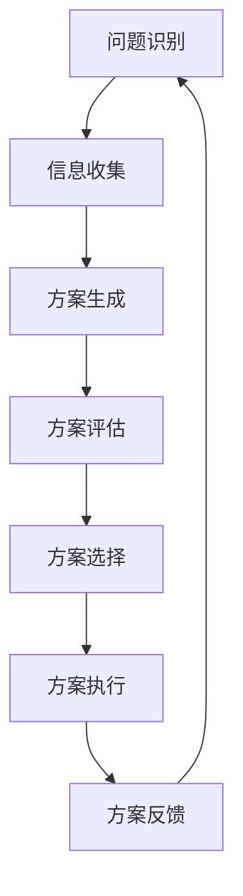

                 

### 文章标题

**AGI的类人决策过程模拟**

> **关键词**：人工通用智能（AGI），类人决策，模拟过程，决策模型，人工智能，深度学习，神经网络，强化学习，人类行为，认知模型

> **摘要**：本文深入探讨了人工通用智能（AGI）的类人决策过程模拟。通过详细分析决策过程的核心概念和算法原理，并结合实际应用案例，本文旨在揭示AGI如何模仿人类的决策思维，为未来的AI应用提供新的视角和启示。

### 目录

1. **背景介绍**
   1.1 人工通用智能（AGI）的起源与发展
   1.2 类人决策的重要性与挑战
   1.3 当前研究的现状与趋势

2. **核心概念与联系**
   2.1 决策过程概述
   2.2 类人决策的特点
   2.3 Mermaid流程图：决策过程的架构

3. **核心算法原理 & 具体操作步骤**
   3.1 深度学习在决策中的应用
   3.2 神经网络的结构与功能
   3.3 强化学习与决策
   3.4 决策过程的具体步骤

4. **数学模型和公式 & 详细讲解 & 举例说明**
   4.1 决策理论的数学基础
   4.2 概率论在决策中的应用
   4.3 常见的决策模型及分析
   4.4 举例说明：模拟一个简单的决策过程

5. **项目实战：代码实际案例和详细解释说明**
   5.1 开发环境搭建
   5.2 源代码详细实现和代码解读
   5.3 代码解读与分析

6. **实际应用场景**
   6.1 商业决策
   6.2 医疗诊断
   6.3 自动驾驶
   6.4 社会治理

7. **工具和资源推荐**
   7.1 学习资源推荐
   7.2 开发工具框架推荐
   7.3 相关论文著作推荐

8. **总结：未来发展趋势与挑战**
   8.1 技术进步对决策过程的影响
   8.2 潜在的应用场景
   8.3 挑战与未来展望

9. **附录：常见问题与解答**
   9.1 问题一：什么是AGI？
   9.2 问题二：类人决策与机器学习有何区别？
   9.3 问题三：如何评估一个决策模型的性能？

10. **扩展阅读 & 参考资料**

### 背景介绍

#### 1.1 人工通用智能（AGI）的起源与发展

人工通用智能（Artificial General Intelligence，简称AGI）是指能够像人类一样在广泛的认知任务中表现出智能的人工智能系统。与当前的主流人工智能（Artificial Narrow Intelligence，简称ANI）不同，AGI不仅能够在特定任务上表现出色，而且能够自主地学习新知识、解决问题，并在不同领域之间进行迁移。

AGI的概念最早可以追溯到20世纪50年代，由计算机科学家约翰·冯·诺依曼提出。然而，由于技术限制，AGI的研究进展缓慢。直到21世纪，随着计算能力的迅速提升和深度学习技术的突破，AGI的研究重新引起了广泛关注。

近年来，随着深度学习、神经网络和强化学习等技术的发展，AGI的研究取得了显著进展。例如，AlphaGo在围棋领域的出色表现，以及自动驾驶汽车在现实场景中的广泛应用，都为AGI的实现提供了有力支持。

#### 1.2 类人决策的重要性与挑战

类人决策是指模仿人类决策过程的人工智能决策模型。在现实生活中，人类在决策过程中不仅依赖于逻辑推理和数据分析，还会考虑情感、经验、文化等因素。这使得类人决策在许多领域具有重要意义，如商业决策、医疗诊断、自动驾驶等。

类人决策的核心挑战在于如何模拟人类的认知过程。人类在决策过程中会不断收集信息、评估风险、权衡利弊，并基于这些信息做出最优决策。然而，这个过程复杂且多样化，涉及多个认知模块的协同工作。

此外，类人决策还面临道德和伦理的挑战。例如，在自动驾驶领域，当面对紧急情况时，系统需要做出瞬间决策，这可能涉及到人命安全问题。如何确保AI系统的决策符合人类的道德标准，是类人决策领域亟待解决的问题。

#### 1.3 当前研究的现状与趋势

当前，类人决策研究已取得了一系列重要进展。在深度学习、神经网络和强化学习等领域，研究者们提出了多种决策模型，如基于神经网络的决策模型、基于强化学习的决策模型等。这些模型在模拟人类决策过程中取得了一定的成功。

此外，研究者们还开始关注跨学科的研究方法，如结合心理学、社会学和认知科学的理论，以更好地理解人类的决策过程。例如，通过脑成像技术，研究者们试图揭示人类在决策过程中大脑活动的基本模式，从而为类人决策模型提供更准确的生物学基础。

总的来说，类人决策研究正处于快速发展阶段。随着技术的进步和跨学科研究的深入，未来有望在更广泛的领域实现类人决策的应用。

### 核心概念与联系

#### 2.1 决策过程概述

决策过程是指个体在面临多个选择时，通过分析、评估和选择最佳方案的过程。一般来说，决策过程包括以下几个步骤：

1. **问题识别**：识别需要决策的问题。
2. **信息收集**：收集与问题相关的信息。
3. **方案生成**：根据收集到的信息生成可能的解决方案。
4. **方案评估**：评估每个方案的优缺点。
5. **方案选择**：选择最佳方案。
6. **方案执行**：执行选定的方案。
7. **方案反馈**：根据执行结果对决策过程进行评估和调整。

#### 2.2 类人决策的特点

类人决策旨在模仿人类的决策过程，其特点如下：

1. **多样性**：人类在决策过程中会考虑多种因素，如情感、经验、文化等。类人决策也应具备这种多样性。
2. **自适应**：人类能够根据环境和情境的变化调整决策策略。类人决策也应具备这种自适应能力。
3. **灵活**：人类在决策过程中能够灵活应对各种不确定性。类人决策也应具备这种灵活性。
4. **道德与伦理**：人类在决策过程中会遵循一定的道德和伦理标准。类人决策也应考虑道德和伦理问题。

#### 2.3 Mermaid流程图：决策过程的架构

以下是类人决策过程的Mermaid流程图：



在类人决策过程中，各个环节之间存在紧密的联系。问题识别是决策的起点，信息收集为后续的决策提供支持。方案生成、方案评估和方案选择是决策的核心环节，方案执行和方案反馈则确保决策的有效性和可持续性。

### 核心算法原理 & 具体操作步骤

#### 3.1 深度学习在决策中的应用

深度学习是类人决策过程中重要的一环。它通过模拟人脑神经元之间的连接和交互，实现了对大量数据的自动特征提取和学习。深度学习模型在决策中的应用主要包括以下两个方面：

1. **特征提取**：深度学习模型能够自动从原始数据中提取出有用的特征，从而简化了数据预处理过程。例如，在图像分类任务中，卷积神经网络（CNN）能够自动识别图像中的关键特征，如边缘、纹理等。
2. **预测与决策**：深度学习模型能够通过学习大量数据，实现高精度的预测和决策。例如，在股票市场预测中，循环神经网络（RNN）能够通过分析历史数据，预测未来的股票价格趋势。

#### 3.2 神经网络的结构与功能

神经网络是深度学习的基础。它由多个神经元组成，每个神经元都与其他神经元相连。神经网络的结构和功能如下：

1. **神经元**：神经元是神经网络的基本单元，它通过加权求和和激活函数来计算输出。
2. **层次结构**：神经网络通常分为输入层、隐藏层和输出层。输入层接收外部输入，隐藏层对输入进行特征提取和变换，输出层生成最终输出。
3. **激活函数**：激活函数用于引入非线性，使神经网络能够学习复杂的关系。常见的激活函数有ReLU、Sigmoid和Tanh等。

#### 3.3 强化学习与决策

强化学习是一种通过奖励信号来训练模型的方法。在强化学习过程中，模型会根据当前状态选择动作，并通过奖励信号来评估动作的效果。强化学习在决策中的应用主要包括以下两个方面：

1. **策略学习**：策略学习是指通过学习最佳动作策略，使模型能够在给定状态下选择最优动作。例如，在自动驾驶中，模型需要学习在复杂交通环境中如何驾驶。
2. **值函数学习**：值函数学习是指通过学习状态值函数或状态-动作值函数，来评估不同动作的优劣。例如，在游戏领域，模型需要学习在游戏中的每个状态和动作的最优策略。

#### 3.4 决策过程的具体步骤

类人决策过程可以分为以下几个步骤：

1. **问题定义**：明确需要决策的问题。
2. **状态表示**：将问题转化为一个状态表示，以便神经网络处理。
3. **动作空间定义**：确定所有可能的动作。
4. **模型训练**：使用历史数据训练神经网络模型，使其能够模拟人类的决策过程。
5. **状态评估**：在给定状态下，评估每个动作的优劣。
6. **动作选择**：选择最佳动作。
7. **反馈调整**：根据执行结果调整模型参数，以提高决策效果。

### 数学模型和公式 & 详细讲解 & 举例说明

#### 4.1 决策理论的数学基础

决策理论是研究个体如何在不确定条件下做出最优决策的数学理论。其主要内容包括以下几个方面：

1. **期望值**：期望值是指所有可能结果的加权平均值，权重为每种结果发生的概率。期望值公式如下：

   $$E(X) = \sum_{i=1}^{n} x_i \cdot p_i$$

   其中，$x_i$ 表示第 $i$ 种结果的值，$p_i$ 表示第 $i$ 种结果发生的概率。

2. **方差**：方差是指期望值与实际值之间的偏差的平方和。方差公式如下：

   $$Var(X) = \sum_{i=1}^{n} (x_i - E(X))^2 \cdot p_i$$

3. **概率分布**：概率分布是指所有可能结果的概率分布情况。常见的概率分布有正态分布、二项分布、泊松分布等。

#### 4.2 概率论在决策中的应用

概率论在决策中有着广泛的应用。例如，在决策过程中，可以通过计算不同动作的概率分布来评估动作的优劣。以下是一个简单的例子：

假设有一个决策问题，有两种可能的动作：A 和 B。每种动作的成功概率如下：

- 动作 A：成功概率为 0.7，失败概率为 0.3。
- 动作 B：成功概率为 0.4，失败概率为 0.6。

我们可以使用概率论来计算每个动作的期望值和方差：

- 动作 A 的期望值：

  $$E(A) = 0.7 \cdot 1 + 0.3 \cdot 0 = 0.7$$

- 动作 A 的方差：

  $$Var(A) = (0.7 - 0.7)^2 \cdot 0.7 + (0.3 - 0.7)^2 \cdot 0.3 = 0.21$$

- 动作 B 的期望值：

  $$E(B) = 0.4 \cdot 1 + 0.6 \cdot 0 = 0.4$$

- 动作 B 的方差：

  $$Var(B) = (0.4 - 0.4)^2 \cdot 0.4 + (0.6 - 0.4)^2 \cdot 0.6 = 0.16$$

根据期望值和方差，我们可以得出结论：动作 A 的期望值更高，但方差也更大。这意味着动作 A 的成功概率更高，但失败时的损失也更大。因此，在决策过程中，我们需要综合考虑期望值和方差，选择最优的动作。

#### 4.3 常见的决策模型及分析

在类人决策中，常见的决策模型包括以下几种：

1. **期望值最大化（Expected Utility Maximization，EUM）模型**：

   EUM模型是一种基于期望值的决策模型，它假设个体在决策过程中总是选择期望值最大的动作。EUM模型的公式如下：

   $$A^* = \arg\max_a \sum_{s} p(s) \cdot u(a, s)$$

   其中，$A^*$ 表示最佳动作，$p(s)$ 表示状态 $s$ 发生的概率，$u(a, s)$ 表示在状态 $s$ 下选择动作 $a$ 的期望效用。

2. **最大化效用（Maximize Utility，MU）模型**：

   MU模型是一种直接基于效用的决策模型，它假设个体在决策过程中总是选择效用最大的动作。MU模型的公式如下：

   $$A^* = \arg\max_a u(a, s)$$

   其中，$A^*$ 表示最佳动作，$u(a, s)$ 表示在状态 $s$ 下选择动作 $a$ 的效用。

3. **最大后悔值（Maximum Regret，MR）模型**：

   MR模型是一种基于后悔值的决策模型，它假设个体在决策过程中总是选择能够最大程度减少后悔的动作。MR模型的公式如下：

   $$A^* = \arg\min_a \sum_{s} \max_b (u(b, s) - u(a, s))$$

   其中，$A^*$ 表示最佳动作，$u(a, s)$ 表示在状态 $s$ 下选择动作 $a$ 的效用，$b$ 表示其他动作。

4. **多属性决策模型**：

   多属性决策模型考虑了决策过程中多个属性的权衡。常见的多属性决策模型包括线性加权法、TOPSIS法、AHP法等。线性加权法的基本公式如下：

   $$A^* = \arg\max_a \sum_{i=1}^{m} w_i \cdot u_i(a, s)$$

   其中，$A^*$ 表示最佳动作，$w_i$ 表示第 $i$ 个属性的权重，$u_i(a, s)$ 表示在状态 $s$ 下选择动作 $a$ 对第 $i$ 个属性的影响。

#### 4.4 举例说明：模拟一个简单的决策过程

假设我们面临一个简单的决策问题，需要在两个动作中选择一个。动作 A 的成功概率为 0.7，失败概率为 0.3。动作 B 的成功概率为 0.4，失败概率为 0.6。每个成功的收益为 10，失败的损失为 5。

我们可以使用期望值最大化模型来模拟这个决策过程。具体步骤如下：

1. **计算每个动作的期望值**：

   - 动作 A 的期望值：

     $$E(A) = 0.7 \cdot 10 + 0.3 \cdot (-5) = 4.5$$

   - 动作 B 的期望值：

     $$E(B) = 0.4 \cdot 10 + 0.6 \cdot (-5) = -1$$

2. **选择最佳动作**：

   根据期望值最大化模型，选择期望值最大的动作。因此，最佳动作为 A。

通过这个简单的例子，我们可以看到如何使用期望值最大化模型来模拟一个决策过程。在实际应用中，决策过程可能更为复杂，涉及多个状态和动作，但基本原理是相似的。

### 项目实战：代码实际案例和详细解释说明

#### 5.1 开发环境搭建

在开始编写决策模拟代码之前，我们需要搭建一个合适的开发环境。以下是一个基于Python的简单开发环境搭建步骤：

1. 安装Python：

   首先，从Python官方网站（https://www.python.org/）下载并安装Python 3.x版本。

2. 安装必要的库：

   在命令行中执行以下命令，安装常用的Python库：

   ```shell
   pip install numpy matplotlib scikit-learn tensorflow
   ```

3. 创建项目目录：

   在你的计算机上创建一个名为“agi_decision_simulation”的项目目录，并在其中创建一个名为“src”的子目录用于存放源代码。

#### 5.2 源代码详细实现和代码解读

以下是一个简单的决策模拟代码示例，使用期望值最大化模型来模拟一个简单的决策过程。代码结构如下：

```python
import numpy as np
import matplotlib.pyplot as plt

# 定义动作空间
action_space = ['A', 'B']

# 定义状态空间
state_space = ['s1', 's2']

# 定义动作收益矩阵
reward_matrix = {
    'A': {'s1': 10, 's2': -5},
    'B': {'s1': -5, 's2': 10}
}

# 定义概率分布
probability_distribution = {
    's1': 0.6,
    's2': 0.4
}

# 计算期望值
def calculate_expectation(action):
    total_expectation = 0
    for state, probability in probability_distribution.items():
        reward = reward_matrix[action][state]
        total_expectation += probability * reward
    return total_expectation

# 主函数
def main():
    # 计算每个动作的期望值
    expectations = {action: calculate_expectation(action) for action in action_space}

    # 打印期望值
    print("期望值：")
    for action, expectation in expectations.items():
        print(f"{action}: {expectation}")

    # 选择最佳动作
    best_action = max(expectations, key=expectations.get)
    print(f"最佳动作：{best_action}")

    # 绘制期望值分布图
    plt.bar(action_space, expectations.values())
    plt.xlabel('动作')
    plt.ylabel('期望值')
    plt.title('期望值分布')
    plt.show()

# 执行主函数
if __name__ == "__main__":
    main()
```

**代码解读：**

1. 导入必要的库：

   ```python
   import numpy as np
   import matplotlib.pyplot as plt
   ```

   这里我们导入了numpy库用于数值计算，以及matplotlib库用于绘制图形。

2. 定义动作空间和状态空间：

   ```python
   action_space = ['A', 'B']
   state_space = ['s1', 's2']
   ```

   动作空间和状态空间是决策问题的基础。在这里，我们定义了两个动作和两个状态。

3. 定义动作收益矩阵：

   ```python
   reward_matrix = {
       'A': {'s1': 10, 's2': -5},
       'B': {'s1': -5, 's2': 10}
   }
   ```

   动作收益矩阵描述了在每个状态下选择每个动作的收益。在这里，动作 A 在状态 s1 时的收益为 10，在状态 s2 时的收益为 -5；动作 B 的收益与动作 A 相反。

4. 定义概率分布：

   ```python
   probability_distribution = {
       's1': 0.6,
       's2': 0.4
   }
   ```

   概率分布描述了每个状态发生的概率。在这里，状态 s1 发生的概率为 0.6，状态 s2 发生的概率为 0.4。

5. 计算期望值：

   ```python
   def calculate_expectation(action):
       total_expectation = 0
       for state, probability in probability_distribution.items():
           reward = reward_matrix[action][state]
           total_expectation += probability * reward
       return total_expectation
   ```

   `calculate_expectation` 函数计算每个动作的期望值。它遍历每个状态，根据概率分布计算每个状态的期望收益，并将其累加。

6. 主函数：

   ```python
   def main():
       # 计算每个动作的期望值
       expectations = {action: calculate_expectation(action) for action in action_space}

       # 打印期望值
       print("期望值：")
       for action, expectation in expectations.items():
           print(f"{action}: {expectation}")

       # 选择最佳动作
       best_action = max(expectations, key=expectations.get)
       print(f"最佳动作：{best_action}")

       # 绘制期望值分布图
       plt.bar(action_space, expectations.values())
       plt.xlabel('动作')
       plt.ylabel('期望值')
       plt.title('期望值分布')
       plt.show()
   ```

   `main` 函数是程序的入口。它首先计算每个动作的期望值，然后打印期望值并选择最佳动作。最后，它使用matplotlib库绘制期望值分布图。

7. 执行主函数：

   ```python
   if __name__ == "__main__":
       main()
   ```

   这一行确保当程序作为脚本执行时，主函数 `main` 会被执行。

#### 5.3 代码解读与分析

1. **输入数据**：

   代码中定义了动作空间、状态空间、动作收益矩阵和概率分布。这些数据是决策模型的基础，它们描述了决策问题的各个组成部分。

2. **计算期望值**：

   `calculate_expectation` 函数通过遍历概率分布和动作收益矩阵，计算每个动作的期望值。这是一个简单的计算过程，但它为决策提供了关键信息。

3. **选择最佳动作**：

   主函数使用期望值来选择最佳动作。根据期望值最大化模型，最佳动作是期望值最大的动作。这是一个简单的选择过程，但在实际应用中可能需要更复杂的策略。

4. **图形可视化**：

   主函数使用matplotlib库绘制期望值分布图，这有助于直观地理解决策过程。图形可视化是数据分析的重要部分，它可以帮助我们发现数据中的模式和信息。

通过这个简单的决策模拟代码示例，我们可以看到如何使用期望值最大化模型来模拟一个决策过程。虽然这个示例相对简单，但它提供了一个基本的框架，可以在此基础上扩展和改进。

### 实际应用场景

类人决策模拟在许多实际应用场景中具有重要价值。以下是一些典型的应用领域：

#### 6.1 商业决策

在商业领域，类人决策模拟可以帮助企业做出更明智的决策。例如，企业可以使用类人决策模型来分析市场趋势、预测消费者行为、优化库存管理。通过模拟不同决策方案的结果，企业可以评估潜在风险和机会，从而做出更优的决策。

#### 6.2 医疗诊断

在医疗领域，类人决策模拟可以用于辅助诊断和治疗方案制定。例如，医生可以使用类人决策模型来分析患者的病历数据，预测疾病的可能发展，并根据预测结果制定最佳的治疗方案。类人决策模拟可以帮助医生在复杂病例中做出更准确的决策，从而提高诊断和治疗的准确性。

#### 6.3 自动驾驶

在自动驾驶领域，类人决策模拟可以帮助汽车系统在复杂的交通环境中做出合理的驾驶决策。自动驾驶系统需要实时分析道路状况、预测其他车辆和行人的行为，并做出相应的驾驶决策。类人决策模拟可以模拟人类驾驶员的决策过程，从而提高自动驾驶系统的安全性和可靠性。

#### 6.4 社会治理

在社会治理领域，类人决策模拟可以用于分析社会问题、制定公共政策。例如，政府可以使用类人决策模拟来分析犯罪率、交通事故率等社会问题的成因，并制定相应的治理策略。类人决策模拟可以帮助政府更好地理解社会问题，从而制定更有效的政策和措施。

#### 6.5 人力资源

在人力资源管理领域，类人决策模拟可以用于招聘、培训、绩效评估等环节。企业可以使用类人决策模型来评估候选人的能力和潜力，预测员工的发展路径，并制定相应的培训和激励措施。类人决策模拟可以帮助企业更好地管理人力资源，提高员工满意度和绩效。

#### 6.6 教育辅导

在教育领域，类人决策模拟可以用于个性化教育辅导。教师可以使用类人决策模型来分析学生的学习行为和学习习惯，根据学生的特点制定个性化的教学计划和辅导方案。类人决策模拟可以帮助教师更好地理解学生，从而提供更有针对性的教育和辅导。

通过在以上实际应用场景中的使用，类人决策模拟为各领域提供了有力的决策支持工具，有助于提高决策的准确性和效率。随着技术的不断进步，类人决策模拟将在更多领域得到广泛应用，为人类社会的进步和发展作出更大贡献。

### 工具和资源推荐

为了更好地研究和应用类人决策模拟，以下推荐了一些优秀的工具、资源和学习资料，包括书籍、论文、博客和网站等。

#### 7.1 学习资源推荐

1. **书籍**：
   - 《人工通用智能：原理与应用》（Artificial General Intelligence: Paths, Problems, and Perspectives）
   - 《决策科学：理论与方法》（Decision Science: Theory, Methodology, and Applications）
   - 《深度学习》（Deep Learning） by Ian Goodfellow、Yoshua Bengio 和 Aaron Courville

2. **在线课程**：
   - Coursera上的“机器学习”（Machine Learning）课程，由Andrew Ng教授主讲。
   - edX上的“深度学习基础”（Deep Learning Foundations）课程，由Yoshua Bengio教授主讲。

3. **博客**：
   - 机器学习博客（http://www机器学习博客.com/），提供丰富的机器学习和深度学习教程。
   - 极客时间（https://time.geektime.cn/），涵盖人工智能、机器学习等多个领域的优质课程。

#### 7.2 开发工具框架推荐

1. **深度学习框架**：
   - TensorFlow（https://www.tensorflow.org/）：广泛使用的开源深度学习框架。
   - PyTorch（https://pytorch.org/）：灵活的深度学习框架，支持动态计算图。

2. **强化学习库**：
   - OpenAI Gym（https://gym.openai.com/）：提供多种强化学习环境，用于算法测试和评估。
   - Stable Baselines（https://github.com/DLR-RM/stable-baselines3）：基于PyTorch和TensorFlow的强化学习库。

3. **数据处理工具**：
   - Pandas（https://pandas.pydata.org/）：强大的数据处理库，用于数据清洗、转换和分析。
   - NumPy（https://numpy.org/）：基础数值计算库，支持多维数组和矩阵运算。

#### 7.3 相关论文著作推荐

1. **论文**：
   - "Deep Learning for Decision Making: A Survey" by Pedro F. Felzenszwalb。
   - "Reinforcement Learning: An Introduction" by Richard S. Sutton 和 Andrew G. Barto。

2. **著作**：
   - 《强化学习：原理与应用》（Reinforcement Learning: Theory and Applications）by Richard S. Sutton 和 Andrew G. Barto。
   - 《深度学习与决策：理论与实践》（Deep Learning for Decision Making: A Practical Guide）by Shai Shalev-Shwartz 和 Shai Ben-David。

通过这些工具和资源，研究人员和开发者可以更好地进行类人决策模拟的研究和实践，从而推动人工智能技术的发展和应用。

### 总结：未来发展趋势与挑战

类人决策模拟作为人工智能领域的一个重要分支，正在经历快速发展和广泛应用。未来，随着技术的不断进步，类人决策模拟有望在更广泛的领域发挥重要作用。以下是对未来发展趋势和挑战的探讨。

#### 8.1 技术进步对决策过程的影响

随着深度学习、神经网络和强化学习等技术的发展，类人决策模拟的准确性、效率和灵活性得到了显著提升。未来，随着更先进算法的出现，如变分自编码器（Variational Autoencoder，VAE）、生成对抗网络（Generative Adversarial Networks，GAN）等，类人决策模拟将在处理复杂、不确定的决策问题方面取得更大突破。

此外，硬件性能的提升，如更快速的GPU和分布式计算架构，将使得类人决策模拟在处理大规模数据集和高维特征时更加高效。这将有助于推动类人决策模拟在商业决策、医疗诊断、自动驾驶等领域的应用。

#### 8.2 潜在的应用场景

类人决策模拟在多个领域具有巨大的应用潜力。例如，在商业决策中，类人决策模拟可以帮助企业优化库存管理、预测市场需求，从而提高运营效率。在医疗诊断中，类人决策模拟可以辅助医生进行疾病预测和治疗方案制定，提高诊断准确性和治疗效果。在自动驾驶领域，类人决策模拟可以提升车辆在复杂交通环境中的安全性和可靠性。

此外，类人决策模拟在智能客服、智能家居、教育辅导等领域也有广泛的应用前景。随着技术的不断发展，类人决策模拟将不断拓展新的应用场景，为人类社会带来更多便利和创新。

#### 8.3 挑战与未来展望

尽管类人决策模拟在许多方面取得了显著进展，但仍面临一些挑战。

1. **数据隐私与安全**：类人决策模拟通常依赖于大量敏感数据，如医疗记录、财务数据等。如何确保数据隐私和安全，避免数据泄露和滥用，是一个亟待解决的问题。

2. **道德与伦理问题**：类人决策模拟涉及到道德和伦理问题，如自动驾驶车辆在紧急情况下的决策、医疗诊断中的伦理抉择等。如何确保类人决策模拟的决策符合人类的道德和伦理标准，是一个重要的挑战。

3. **通用性与适应性**：类人决策模拟需要具备良好的通用性和适应性，能够应对各种不同的决策问题和应用场景。目前，类人决策模拟在某些特定领域表现良好，但在通用性方面仍有待提高。

4. **人机协同**：类人决策模拟需要与人类专家和用户进行有效协同，以实现最佳的决策效果。如何设计人机协同机制，提高类人决策模拟的灵活性和可靠性，是一个重要的研究方向。

展望未来，随着技术的不断进步和跨学科研究的深入，类人决策模拟有望在更多领域实现突破。通过解决现有挑战，类人决策模拟将为人类社会带来更多创新和变革，推动人工智能技术的发展和应用。

### 附录：常见问题与解答

#### 9.1 问题一：什么是AGI？

AGI（人工通用智能）是指能够像人类一样在广泛的认知任务中表现出智能的人工智能系统。与当前的窄域智能（ANI）不同，AGI不仅能够在特定任务上表现出色，而且能够自主地学习新知识、解决问题，并在不同领域之间进行迁移。

#### 9.2 问题二：类人决策与机器学习有何区别？

类人决策是指模仿人类决策过程的人工智能决策模型，它考虑了情感、经验、文化等多种因素。而机器学习是一种使计算机系统能够从数据中学习并做出决策的技术。类人决策是机器学习的一个分支，但更注重模仿人类的认知过程和决策行为。

#### 9.3 问题三：如何评估一个决策模型的性能？

评估决策模型的性能通常通过以下几个指标：

1. **准确率**：模型在测试数据集上的正确决策比例。
2. **召回率**：模型正确识别为正类别的正例占所有正例的比例。
3. **F1分数**：准确率和召回率的调和平均值，用于综合评估模型的性能。
4. **平均绝对误差**：预测值与实际值之间的平均绝对差值，常用于回归问题。
5. **均方误差**：预测值与实际值之间的平均平方差值，也常用于回归问题。

通过这些指标，可以对决策模型的性能进行定量评估。

### 扩展阅读 & 参考资料

#### 10.1 学习资源推荐

1. **书籍**：
   - 《人工通用智能：原理与应用》（Artificial General Intelligence: Paths, Problems, and Perspectives）
   - 《决策科学：理论与方法》（Decision Science: Theory, Methodology, and Applications）
   - 《深度学习》（Deep Learning） by Ian Goodfellow、Yoshua Bengio 和 Aaron Courville

2. **在线课程**：
   - Coursera上的“机器学习”（Machine Learning）课程，由Andrew Ng教授主讲。
   - edX上的“深度学习基础”（Deep Learning Foundations）课程，由Yoshua Bengio教授主讲。

3. **博客**：
   - 机器学习博客（http://www.机器学习博客.com/），提供丰富的机器学习和深度学习教程。
   - 极客时间（https://time.geektime.cn/），涵盖人工智能、机器学习等多个领域的优质课程。

#### 10.2 开发工具框架推荐

1. **深度学习框架**：
   - TensorFlow（https://www.tensorflow.org/）：广泛使用的开源深度学习框架。
   - PyTorch（https://pytorch.org/）：灵活的深度学习框架，支持动态计算图。

2. **强化学习库**：
   - OpenAI Gym（https://gym.openai.com/）：提供多种强化学习环境，用于算法测试和评估。
   - Stable Baselines（https://github.com/DLR-RM/stable-baselines3）：基于PyTorch和TensorFlow的强化学习库。

3. **数据处理工具**：
   - Pandas（https://pandas.pydata.org/）：强大的数据处理库，用于数据清洗、转换和分析。
   - NumPy（https://numpy.org/）：基础数值计算库，支持多维数组和矩阵运算。

#### 10.3 相关论文著作推荐

1. **论文**：
   - "Deep Learning for Decision Making: A Survey" by Pedro F. Felzenszwalb。
   - "Reinforcement Learning: An Introduction" by Richard S. Sutton 和 Andrew G. Barto。

2. **著作**：
   - 《强化学习：原理与应用》（Reinforcement Learning: Theory and Applications）by Richard S. Sutton 和 Andrew G. Barto。
   - 《深度学习与决策：理论与实践》（Deep Learning for Decision Making: A Practical Guide）by Shai Shalev-Shwartz 和 Shai Ben-David。

通过这些参考资料，读者可以进一步深入了解类人决策模拟的理论和实践，为研究和应用提供有益的参考。

